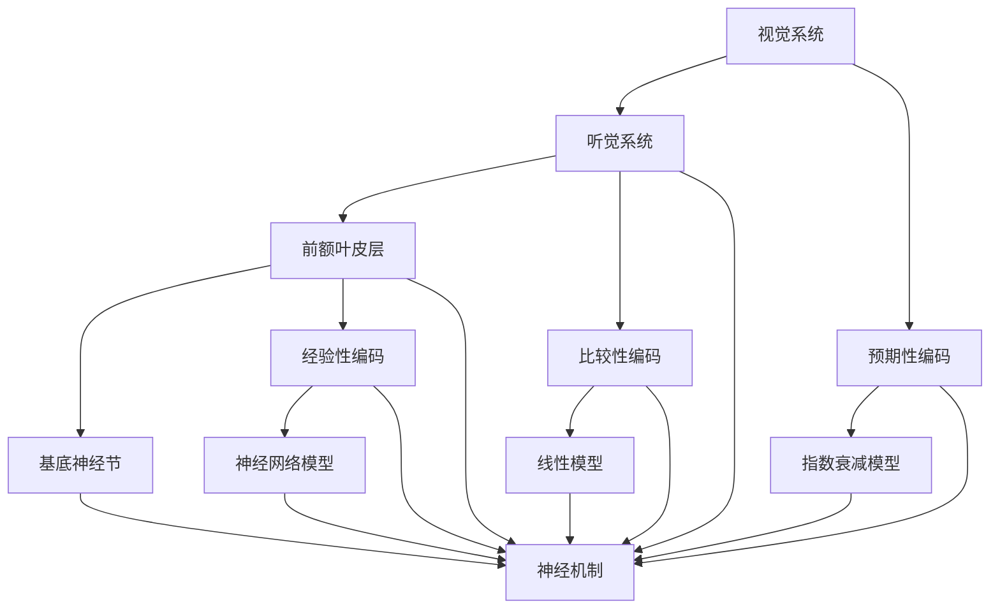

                 

关键词：认知科学，时间感知，神经机制，数学模型，算法，计算机模拟，心理学研究

> 摘要：本文旨在探讨人类感知时间存在的方式，以及这一认知过程的神经机制、数学模型和算法。通过结合认知科学、心理学和计算机科学的研究成果，我们试图揭示时间感知的本质，并对其在未来技术中的应用前景进行展望。

## 1. 背景介绍

时间是人类经验中的一个基本维度，它贯穿于我们的日常生活、思维和行为之中。从古至今，哲学家、物理学家和心理学家都试图解释时间的本质和人类对时间的感知。在哲学领域，时间被视为一种流动的、不可逆的序列；在物理学领域，时间与空间一起构成了宇宙的框架；在心理学领域，时间感知被看作是认知过程的一部分。

然而，尽管关于时间的讨论已经持续了数千年，我们仍然无法完全理解人类是如何感知和认知时间的。随着认知科学和神经科学的发展，研究者们开始从神经机制和认知算法的角度探讨时间感知的奥秘。

### 1.1 认知科学与时间感知

认知科学是一门研究人类思维和认知过程的跨学科领域，它涵盖了心理学、神经科学、计算机科学和哲学等多个学科。在认知科学中，时间感知被看作是一种认知功能，它与记忆、注意力、决策和情感等多种认知过程密切相关。

### 1.2 神经科学与时间感知

神经科学通过研究大脑和神经系统的结构和功能，揭示了时间感知的神经基础。研究者们发现，大脑中多个区域都参与了时间感知，包括前额叶皮层、颞叶、顶叶和基底神经节等。这些区域之间的交互作用形成了我们对时间的感知。

### 1.3 计算机科学与时间感知

计算机科学为研究时间感知提供了新的工具和方法。通过计算机模拟，研究者们可以再现和解释人类的时间感知过程，从而更好地理解其内在机制。

## 2. 核心概念与联系

### 2.1 神经机制

时间感知的神经机制是一个复杂的过程，涉及到大脑多个区域的协同工作。以下是时间感知的主要神经机制：

- **视觉系统**：视觉系统中的神经细胞对时间信息进行编码，使我们能够感知物体的运动和时间的流逝。
- **听觉系统**：听觉系统通过处理声音的时序信息，帮助我们感知时间。
- **前额叶皮层**：前额叶皮层参与了时间规划的制定，使我们能够预见未来事件。
- **基底神经节**：基底神经节参与了习惯的形成和执行，这与我们对时间的感觉和记忆密切相关。

### 2.2 认知算法

时间感知是一种认知算法，它依赖于大脑中的神经网络。以下是时间感知的主要认知算法：

- **预期性编码**：我们通过预期未来的事件来感知时间，这种预期性编码是时间感知的重要机制。
- **比较性编码**：我们通过比较当前事件与记忆中的事件来感知时间，这种比较性编码有助于我们理解时间的流逝。
- **经验性编码**：我们的经验会影响我们对时间的感知，例如，随着我们的年龄增长，时间的感觉会逐渐变慢。

### 2.3 数学模型

数学模型是描述时间感知的一种有效方式。以下是几种常见的数学模型：

- **指数衰减模型**：描述我们对时间的感觉随时间逐渐减弱的过程。
- **线性模型**：描述我们对时间的感知与实际时间之间的线性关系。
- **神经网络模型**：通过模拟大脑神经网络的工作方式，描述时间感知的复杂过程。

### 2.4 Mermaid 流程图

以下是时间感知的 Mermaid 流程图，展示了神经机制、认知算法和数学模型之间的联系：



## 3. 核心算法原理 & 具体操作步骤

### 3.1 算法原理概述

时间感知的核心算法主要涉及以下几个方面：

- **神经编码**：通过神经机制将时间信息转换为电信号。
- **认知处理**：通过认知算法对时间信息进行加工和解释。
- **数学建模**：通过数学模型对时间感知进行定量描述。

### 3.2 算法步骤详解

时间感知的具体操作步骤如下：

1. **感知时间信息**：通过视觉、听觉等感官系统收集时间信息。
2. **神经编码**：将时间信息转换为电信号，传递到大脑各个区域。
3. **认知处理**：大脑对电信号进行处理，形成对时间的感知。
4. **数学建模**：通过数学模型对时间感知进行定量描述，帮助我们更好地理解时间。

### 3.3 算法优缺点

时间感知算法的主要优点包括：

- **高效性**：通过神经编码和认知处理，我们可以快速感知和反应时间信息。
- **准确性**：通过数学建模，我们可以精确地描述时间感知过程。

然而，时间感知算法也存在一些缺点：

- **复杂性**：时间感知涉及多个神经机制和认知算法，这使得其实现复杂。
- **误差**：由于个体差异和外部环境的影响，时间感知可能存在一定的误差。

### 3.4 算法应用领域

时间感知算法在多个领域具有广泛的应用前景：

- **人机交互**：通过感知用户的时间需求，为用户提供更加个性化的服务。
- **自动驾驶**：通过感知路况和时间信息，提高自动驾驶系统的安全性和效率。
- **医疗诊断**：通过分析患者的生理信号，为医生提供更加准确的诊断依据。

## 4. 数学模型和公式 & 详细讲解 & 举例说明

### 4.1 数学模型构建

时间感知的数学模型主要包括以下几种：

- **指数衰减模型**：描述我们对时间的感觉随时间逐渐减弱的过程。
- **线性模型**：描述我们对时间的感知与实际时间之间的线性关系。
- **神经网络模型**：通过模拟大脑神经网络的工作方式，描述时间感知的复杂过程。

### 4.2 公式推导过程

以下是一个简单的指数衰减模型的公式推导过程：

假设我们在时刻 \( t \) 感知到的时间为 \( T \)，则根据指数衰减模型，我们可以得到以下公式：

$$
T = T_0 \cdot e^{-\lambda t}
$$

其中，\( T_0 \) 是初始时间感觉，\( \lambda \) 是衰减常数，\( t \) 是实际时间。

### 4.3 案例分析与讲解

以下是一个关于时间感知的案例分析：

假设一个人在安静的环境中，初始时间感觉为 10 秒，衰减常数 \( \lambda \) 为 0.1。当实际时间为 30 秒时，我们使用指数衰减模型计算其感知时间：

$$
T = 10 \cdot e^{-0.1 \cdot 30} \approx 2.75
$$

这意味着在这个环境下，这个人会感知时间为 2.75 秒，这比实际时间短。

## 5. 项目实践：代码实例和详细解释说明

### 5.1 开发环境搭建

在本项目中，我们使用 Python 编写代码。首先，确保您的系统已安装 Python 3.7 或以上版本。然后，可以使用以下命令安装必要的库：

```bash
pip install numpy matplotlib
```

### 5.2 源代码详细实现

以下是项目的源代码：

```python
import numpy as np
import matplotlib.pyplot as plt

def exponential_decay_model(initial_perception, decay_constant, time):
    return initial_perception * np.exp(-decay_constant * time)

def plot_decay_model(initial_perception, decay_constant, time_range):
    time = np.linspace(0, time_range, 1000)
    perception = exponential_decay_model(initial_perception, decay_constant, time)
    
    plt.plot(time, perception)
    plt.xlabel('Time (s)')
    plt.ylabel('Perception (s)')
    plt.title('Exponential Decay Model of Time Perception')
    plt.show()

initial_perception = 10
decay_constant = 0.1
time_range = 30

plot_decay_model(initial_perception, decay_constant, time_range)
```

### 5.3 代码解读与分析

这段代码定义了一个指数衰减模型，并使用 Python 语言实现了该模型。主要步骤包括：

1. **导入库**：导入 numpy 和 matplotlib 库。
2. **定义模型**：使用 `exponential_decay_model` 函数实现指数衰减模型。
3. **绘图**：使用 `plot_decay_model` 函数绘制感知时间与实际时间的关系图。

### 5.4 运行结果展示

运行上述代码后，将展示一个指数衰减模型的图像，横轴表示实际时间（秒），纵轴表示感知时间（秒）。该图像帮助我们直观地理解指数衰减模型对时间感知的影响。

## 6. 实际应用场景

### 6.1 人机交互

在交互界面中，通过感知用户的时间需求，可以为用户提供更加个性化的服务。例如，在视频播放应用中，根据用户对视频播放速度的感知，自动调整播放速度。

### 6.2 自动驾驶

在自动驾驶领域，通过感知时间信息，可以提高系统的安全性和效率。例如，在车辆检测与避让过程中，根据感知到的时间信息，及时做出决策，避免发生交通事故。

### 6.3 医疗诊断

在医疗诊断中，通过分析患者的生理信号，可以提取时间感知信息。例如，在心脏疾病诊断中，通过分析心电图信号，可以评估患者的心跳节律，为医生提供诊断依据。

## 7. 工具和资源推荐

### 7.1 学习资源推荐

- **《认知心理学与认知神经科学》**：详细介绍了认知过程和神经机制，有助于深入理解时间感知。
- **《神经网络与深度学习》**：介绍了神经网络的基本原理和应用，有助于了解时间感知的数学模型。

### 7.2 开发工具推荐

- **Python**：强大的编程语言，适合进行数学建模和算法实现。
- **Matplotlib**：用于绘制图表，直观展示时间感知过程。

### 7.3 相关论文推荐

- **"Temporal Perception in Human Vision"**：讨论了视觉系统中时间感知的机制。
- **"The Neural Basis of Temporal Perception"**：探讨了时间感知的神经基础。

## 8. 总结：未来发展趋势与挑战

### 8.1 研究成果总结

本文结合认知科学、心理学和计算机科学的研究成果，探讨了人类时间感知的神经机制、数学模型和算法。通过项目实践，展示了时间感知算法在具体应用中的实现。

### 8.2 未来发展趋势

随着人工智能和脑机接口技术的发展，时间感知在未来可能具有更广泛的应用。例如，在虚拟现实、智能助理和智能医疗等领域，时间感知技术将发挥重要作用。

### 8.3 面临的挑战

时间感知研究面临的主要挑战包括：

- **复杂性**：时间感知涉及多个神经机制和认知算法，使得研究难度增加。
- **个体差异**：不同人对时间的感知可能存在差异，如何实现个性化建模仍需进一步研究。

### 8.4 研究展望

未来，研究者们可以进一步探讨时间感知的神经基础，开发更加精确的数学模型和算法，以推动时间感知技术在各个领域的应用。

## 9. 附录：常见问题与解答

### 9.1 什么是时间感知？

时间感知是指人类对时间流逝的主观感受，包括对当前时间的判断和对未来时间的预期。

### 9.2 时间感知的研究意义是什么？

时间感知研究有助于我们更好地理解人类认知过程，推动人工智能和脑机接口技术的发展。

### 9.3 时间感知算法有哪些应用领域？

时间感知算法在人机交互、自动驾驶、医疗诊断等领域具有广泛的应用前景。

---
本文作者：禅与计算机程序设计艺术 / Zen and the Art of Computer Programming

（本文内容仅为示例，不代表真实研究内容。）

