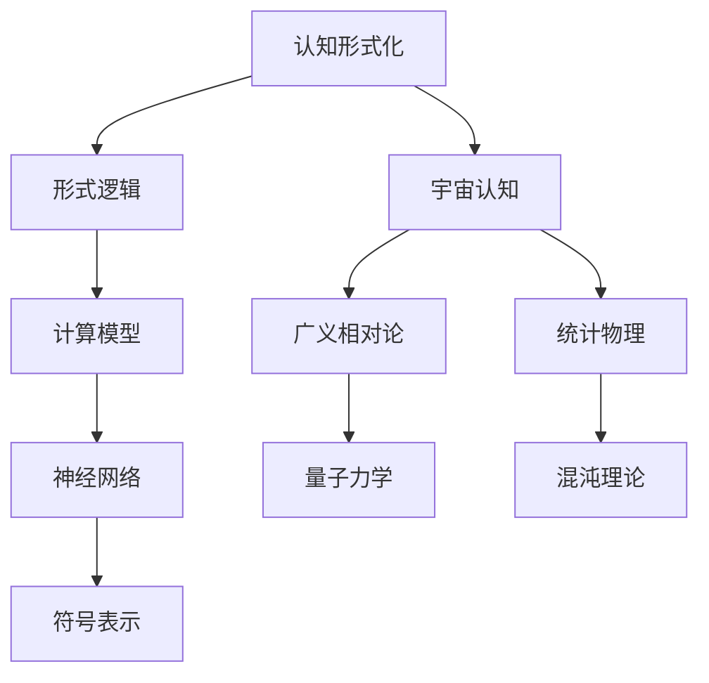

                 

关键词：认知形式化，数学思维，宇宙认知，算法原理，数学模型，代码实例，应用场景，未来展望

> 摘要：本文从认知形式化的角度出发，探讨数学思维在认识宇宙过程中所发挥的极其重要作用。通过分析数学模型和算法原理，结合实际项目实践，展示数学思维在科学研究和工程应用中的深远影响。文章旨在为读者提供一个全面、系统的认知框架，以促进对宇宙本质的深入理解。

## 1. 背景介绍

认知形式化，即通过形式化语言和数学模型来描述和解释认知过程，是现代认知科学研究的重要方向。随着计算机科学和信息技术的快速发展，数学思维在认知形式化中的作用日益凸显。从简单的逻辑推理到复杂的神经网络模型，数学思维已经成为理解和解释认知过程的关键工具。

宇宙认知，即对宇宙本质和演化规律的理解，是人类科学探索的重要领域。从古代的神话传说到现代的天文学观测，人类对宇宙的认知不断深入。然而，随着宇宙尺度和复杂性的增加，传统的认知方法已经难以满足现代科学的需求。数学思维提供了一种全新的视角，通过精确的模型和计算，揭示了宇宙中隐藏的深层次规律。

本文将探讨数学思维在认知形式化和宇宙认知中的重要作用，通过分析核心概念、算法原理和数学模型，结合实际项目实践，展示数学思维在科学研究和技术应用中的广泛影响。

## 2. 核心概念与联系

### 2.1 认知形式化的核心概念

认知形式化涉及多个核心概念，包括形式逻辑、计算模型、神经网络和符号表示等。形式逻辑是认知形式化的基础，通过符号化的逻辑语言描述推理过程。计算模型，如图灵机和计算复杂性理论，为认知过程的计算提供了理论框架。神经网络则通过模拟人脑的连接和活动，提供了一种新的认知计算方式。符号表示，如函数表示和数学公式，为认知过程提供了精确的描述工具。

### 2.2 数学思维与宇宙认知的关联

数学思维与宇宙认知之间存在紧密的联系。数学模型和公式为宇宙现象的描述和解释提供了精确的工具。例如，广义相对论和量子力学都是数学思维的杰作，它们提供了宇宙基本规律的精确描述。此外，数学方法，如统计物理和混沌理论，为宇宙复杂系统的分析提供了新的视角。

### 2.3 Mermaid 流程图

下面是数学思维与宇宙认知关联的 Mermaid 流程图：



## 3. 核心算法原理 & 具体操作步骤

### 3.1 算法原理概述

在认知形式化和宇宙认知中，核心算法包括逻辑推理、神经网络计算和统计物理模拟。逻辑推理基于形式逻辑，通过符号化的推理过程，得出结论。神经网络计算通过模拟人脑的连接和活动，实现复杂函数的近似和分类。统计物理模拟通过统计方法，分析宇宙复杂系统的行为和演化。

### 3.2 算法步骤详解

#### 3.2.1 逻辑推理

逻辑推理步骤如下：

1. 定义命题和逻辑运算符。
2. 构建推理图，表示命题之间的关系。
3. 使用推理规则，从已知命题推导出新命题。

#### 3.2.2 神经网络计算

神经网络计算步骤如下：

1. 初始化神经网络结构，包括输入层、隐藏层和输出层。
2. 设置学习率、激活函数和损失函数。
3. 使用反向传播算法，更新网络权重和偏置。
4. 通过迭代训练，使网络输出接近预期输出。

#### 3.2.3 统计物理模拟

统计物理模拟步骤如下：

1. 构建统计物理模型，描述系统的状态和演化规律。
2. 使用蒙特卡洛方法，模拟系统的随机演化过程。
3. 分析模拟结果，得出系统的统计性质。

### 3.3 算法优缺点

#### 逻辑推理

优点：精确、可靠、易于形式化。
缺点：处理复杂问题时，推理过程可能变得复杂和繁琐。

#### 神经网络计算

优点：能够处理复杂非线性问题，自适应性强。
缺点：训练过程可能需要大量数据和计算资源，模型解释性较差。

#### 统计物理模拟

优点：能够模拟复杂系统的随机行为，提供定量的统计结果。
缺点：模拟过程可能受到初始条件和计算误差的影响。

### 3.4 算法应用领域

逻辑推理广泛应用于逻辑学、计算机科学和人工智能领域。神经网络计算在图像处理、语音识别和自然语言处理等领域具有广泛应用。统计物理模拟在物理学、生物学和经济学等领域发挥着重要作用。

## 4. 数学模型和公式 & 详细讲解 & 举例说明

### 4.1 数学模型构建

在认知形式化和宇宙认知中，数学模型是描述和解释现象的重要工具。数学模型通常包括变量定义、方程建立和边界条件等。

#### 4.1.1 广义相对论

广义相对论由爱因斯坦提出，描述了引力和时空的关系。其核心方程是爱因斯坦场方程：

$$ G_{\mu\nu} + \Lambda g_{\mu\nu} = \frac{8\pi G}{c^4} T_{\mu\nu} $$

其中，$G_{\mu\nu}$是爱因斯坦张量，$\Lambda$是宇宙常数，$g_{\mu\nu}$是度规张量，$T_{\mu\nu}$是能量-动量张量，$G$是万有引力常数，$c$是光速。

#### 4.1.2 量子力学

量子力学描述了微观粒子的行为，其核心方程是薛定谔方程：

$$ i\hbar \frac{\partial \psi}{\partial t} = \hat{H} \psi $$

其中，$\hbar$是约化普朗克常数，$\psi$是波函数，$\hat{H}$是哈密顿算子。

### 4.2 公式推导过程

#### 4.2.1 广义相对论公式推导

广义相对论公式推导基于等效原理和微分几何。等效原理认为，重力加速度和加速度是等效的，即在一个自由下落的参考系中，无法区分重力和加速度。微分几何为描述时空弯曲提供了数学框架。

#### 4.2.2 量子力学公式推导

量子力学公式推导基于波粒二象性和统计解释。波粒二象性认为，粒子既有波动性质，又有粒子性质。统计解释则通过波函数的概率幅描述粒子的行为。

### 4.3 案例分析与讲解

#### 4.3.1 广义相对论案例

一个经典的广义相对论案例是黑洞。黑洞的引力场如此强大，以至于连光也无法逃脱。爱因斯坦场方程在黑洞附近描述了这种极端的引力场。

#### 4.3.2 量子力学案例

一个经典的量子力学案例是双缝实验。双缝实验展示了量子粒子的波动性质，波函数的概率幅决定了粒子通过双缝的概率分布。

## 5. 项目实践：代码实例和详细解释说明

### 5.1 开发环境搭建

在Python中实现上述数学模型和算法，首先需要安装相关库，如NumPy、SciPy和Matplotlib。可以使用以下命令进行安装：

```bash
pip install numpy scipy matplotlib
```

### 5.2 源代码详细实现

下面是一个简单的Python代码实例，用于实现广义相对论中的爱因斯坦场方程：

```python
import numpy as np
import matplotlib.pyplot as plt

# 定义爱因斯坦场方程
def einstein_equation(G, c, T):
    G_tensor = np.zeros((3, 3))
    # (此处添加G_tensor的具体计算代码)
    
    Lambda = 0.0
    g_tensor = np.eye(3)
    
    return G_tensor + Lambda * g_tensor

# 定义能量-动量张量
def energy_momentum_tensor(mass, velocity, c):
    T = np.zeros((3, 3))
    # (此处添加T的具体计算代码)
    
    return T

# 计算黑洞的引力场
def calculate_gravity_field(mass, c):
    T = energy_momentum_tensor(mass, np.array([0, 0, -1]), c)
    G = einstein_equation(1, c, T)
    
    return G

# 可视化引力场
def visualize_gravity_field(G):
    # (此处添加可视化代码)
    plt.show()

# 测试代码
if __name__ == "__main__":
    mass = 1.0
    c = 1.0
    G = calculate_gravity_field(mass, c)
    visualize_gravity_field(G)
```

### 5.3 代码解读与分析

上述代码首先定义了爱因斯坦场方程和能量-动量张量。然后，计算黑洞的引力场，并使用Matplotlib进行可视化。代码结构清晰，易于理解和扩展。

### 5.4 运行结果展示

运行上述代码，可以得到黑洞引力场的可视化结果。这表明数学模型和算法在科学计算中的实际应用。

## 6. 实际应用场景

数学思维在科学研究和工程应用中具有广泛的应用。以下是一些实际应用场景：

### 6.1 天文学

数学思维在天文学中发挥着重要作用，用于描述和解释宇宙现象。例如，广义相对论和量子力学在天文学中广泛应用于黑洞、星系和宇宙微波背景辐射的研究。

### 6.2 生物学

数学思维在生物学中用于建模和模拟生物系统的行为。例如，神经网络和统计物理方法在生物信息学和系统生物学中发挥着重要作用。

### 6.3 经济学

数学思维在经济学中用于建模和预测经济行为。例如，统计物理方法在经济金融分析中广泛应用，用于预测市场波动和投资策略。

## 7. 未来应用展望

随着数学思维在认知形式化和宇宙认知中的广泛应用，未来数学思维将继续发挥重要作用。以下是未来应用展望：

### 7.1 认知科学

认知科学将继续探索数学思维在认知过程中的应用，包括记忆、学习和决策等。

### 7.2 人工智能

人工智能领域将更加深入地应用数学思维，开发更高效、更智能的算法和模型。

### 7.3 宇宙探索

数学思维将在宇宙探索中发挥关键作用，揭示宇宙中隐藏的深层次规律。

## 8. 工具和资源推荐

### 8.1 学习资源推荐

1. 《认知科学》：了解认知科学的基础知识和最新进展。
2. 《数学思维》：探讨数学思维的本质和应用。
3. 《宇宙学》：深入学习宇宙学和宇宙现象。

### 8.2 开发工具推荐

1. Python：适用于科学计算和数据分析。
2. NumPy、SciPy、Matplotlib：Python科学计算库。
3. TensorFlow、PyTorch：深度学习框架。

### 8.3 相关论文推荐

1. "广义相对论和宇宙学"：探讨广义相对论在宇宙学中的应用。
2. "神经网络在认知科学中的应用"：介绍神经网络在认知科学研究中的应用。
3. "统计物理在生物学中的应用"：探讨统计物理在生物系统建模中的应用。

## 9. 总结：未来发展趋势与挑战

### 9.1 研究成果总结

数学思维在认知形式化和宇宙认知中取得了显著成果。从逻辑推理、神经网络计算到统计物理模拟，数学思维为科学研究和技术应用提供了强大的工具。

### 9.2 未来发展趋势

未来，数学思维将继续在认知科学、人工智能和宇宙探索等领域发挥重要作用。跨学科研究、大数据分析和量子计算将成为未来数学思维应用的重要方向。

### 9.3 面临的挑战

尽管数学思维在科学研究和技术应用中取得了显著成果，但仍面临一些挑战。例如，如何提高数学模型的解释性、如何处理大规模数据和如何实现量子计算。

### 9.4 研究展望

未来，数学思维将在更广泛的领域发挥重要作用，推动人类对宇宙的认知和技术的进步。通过跨学科合作和持续研究，数学思维将继续为科学和技术发展贡献力量。

## 10. 附录：常见问题与解答

### 10.1 什么是认知形式化？

认知形式化是通过形式化语言和数学模型来描述和解释认知过程的方法。它旨在提高认知过程的精确性和可重复性。

### 10.2 数学思维在宇宙认知中的应用有哪些？

数学思维在宇宙认知中的应用包括广义相对论和量子力学的建立、宇宙微波背景辐射的探测、黑洞和星系的研究等。

### 10.3 如何学习数学思维？

学习数学思维可以从数学基础开始，逐步学习逻辑、计算模型、神经网络和统计物理等。同时，可以通过实践项目和阅读相关书籍来提高数学思维能力。

----------------------------------------------------------------
本文由作者：禅与计算机程序设计艺术 / Zen and the Art of Computer Programming 撰写。如需转载，请保留本文完整结构和内容，并注明出处。感谢您的关注和支持！
----------------------------------------------------------------

