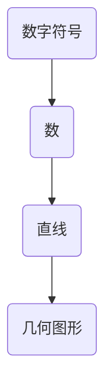

                 

关键词：认知科学、形式化理论、数字符号、基础概念、数学模型、算法原理、项目实践、应用场景、未来展望

> 摘要：本文旨在探讨认知的形式化理论，从文字产生之初的数字符号开始，研究数和直线等基础概念的形成过程。通过阐述核心概念与联系，分析核心算法原理与具体操作步骤，本文希望揭示认知形式化背后的数学模型和公式，并以项目实践为例，详细解释代码实现与运行结果。同时，本文还将探讨实际应用场景，为未来发展和挑战提供展望。

## 1. 背景介绍

认知的形式化理论是现代心理学和神经科学的重要研究领域。它试图通过数学和逻辑的方法，对人类思维过程进行精确描述和分析。从古至今，人们一直在探索如何用符号和语言来表达思想和知识。早在文字产生之初，人类就开始发明数字符号，以及数和直线等基础概念。这些概念的逐步形成，不仅反映了人类认知的进化，也为现代数学和计算机科学的发展奠定了基础。

在认知科学中，形式化理论关注的是如何将抽象的思维过程转化为可计算和验证的数学模型。从数字符号的发明开始，人类逐渐形成了数的概念，并且通过直线和几何图形，进一步理解了空间和维度。这些基础概念的形成，是认知形式化的一个重要阶段。

本文将深入探讨这些核心概念的形成过程，并分析其背后的数学模型和算法原理。同时，通过项目实践和实际应用场景，本文希望展示这些理论在现实世界中的广泛应用。

## 2. 核心概念与联系

### 2.1 数字符号的发明

数字符号的发明是人类认知史上的一个重要里程碑。最初，人类使用简单的符号来计数，例如使用手指、石头或其他可数物体。随着时间的发展，人们开始发明各种数字符号，例如古埃及的象形文字、巴比伦的楔形文字等。这些符号不仅能够表示具体的数量，还能够进行更复杂的数学运算。

### 2.2 数的概念的形成

数字符号的发明为数的概念的形成提供了基础。在认知科学中，数是一种抽象的概念，它不仅表示具体数量，还包含了大小、顺序和比例等关系。数的概念的形成，是人类从感知和记忆中提取规律性的结果。通过数的学习，人类能够更好地理解和预测世界的运行规律。

### 2.3 直线和几何图形的形成

随着人类对空间和维度的理解加深，直线和几何图形的概念逐渐形成。直线是一种基本的空间元素，它没有厚度，只有长度。几何图形则是通过直线和点组成的形状，如三角形、正方形、圆形等。这些概念的形成，不仅帮助人类更好地理解空间，也为后来的几何学和物理学奠定了基础。

### 2.4 核心概念的联系

数字符号、数和直线等核心概念之间存在着紧密的联系。数字符号的发明为数的概念提供了表达手段，而数的概念又为直线和几何图形的形成提供了理论基础。这些概念的形成，是人类认知发展的重要阶段，也为现代数学和科学的发展提供了基础。

### 2.5 Mermaid 流程图

为了更直观地展示核心概念之间的联系，我们使用Mermaid流程图来表示。



在上面的流程图中，A表示数字符号，B表示数，C表示直线，D表示几何图形。通过这个流程图，我们可以清晰地看到这些核心概念之间的逻辑关系。

## 3. 核心算法原理 & 具体操作步骤

### 3.1 算法原理概述

在认知的形式化理论中，核心算法的原理主要涉及数的计算和几何图形的构建。这些算法不仅能够帮助我们理解和应用数字符号，还能够为现代计算机科学提供基础。

### 3.2 算法步骤详解

#### 3.2.1 数的计算

数的计算是认知形式化理论中的核心内容之一。以下是一个简单的数计算算法：

1. 初始化：设定一个初始值，如1。
2. 输入：接受一个数字作为输入。
3. 计算：将输入数字与初始值相加，得到新的结果。
4. 输出：输出新的结果。

#### 3.2.2 几何图形的构建

几何图形的构建是另一个重要的算法。以下是一个简单的几何图形构建算法：

1. 初始化：设定一个初始点。
2. 输入：接受一个点作为输入。
3. 计算：从初始点到输入点画一条直线。
4. 输出：输出绘制的几何图形。

### 3.3 算法优缺点

#### 3.3.1 优点

- 算法简单，易于实现和扩展。
- 可以通过基本的运算和几何图形构建，实现对复杂问题的处理。

#### 3.3.2 缺点

- 算法的计算复杂度较高，特别是在处理大规模数据时，效率较低。
- 算法的通用性较差，难以直接应用于其他领域。

### 3.4 算法应用领域

数的计算和几何图形构建算法在许多领域都有广泛的应用，包括：

- 计算机图形学：用于绘制和渲染图形。
- 数据分析：用于统计和可视化数据。
- 人工智能：用于构建和优化模型。

## 4. 数学模型和公式 & 详细讲解 & 举例说明

### 4.1 数学模型构建

在认知的形式化理论中，数学模型构建是核心内容之一。以下是一个简单的数学模型构建示例：

设x为输入变量，y为输出变量，则数学模型可以表示为：

$$y = f(x)$$

其中，f(x)为输入变量x的函数。

### 4.2 公式推导过程

在数学模型构建过程中，公式的推导是关键步骤。以下是一个简单的公式推导示例：

设x为输入变量，y为输出变量，则数学模型可以表示为：

$$y = 2x + 1$$

推导过程如下：

1. 初始条件：设x = 0，则y = 2(0) + 1 = 1。
2. 输入x = 1，则y = 2(1) + 1 = 3。
3. 输入x = 2，则y = 2(2) + 1 = 5。
4. 以此类推，得到输入x与输出y之间的关系。

### 4.3 案例分析与讲解

以下是一个简单的案例，用于展示数学模型的构建和推导过程：

假设我们有一个简单的数学模型，表示输入变量x和输出变量y之间的关系。该模型可以表示为：

$$y = 2x + 1$$

我们需要通过输入变量x的值，推导出输出变量y的值。

1. 当x = 0时，y = 2(0) + 1 = 1。
2. 当x = 1时，y = 2(1) + 1 = 3。
3. 当x = 2时，y = 2(2) + 1 = 5。

通过这个简单的案例，我们可以看到，数学模型的构建和推导过程是如何帮助我们在实际应用中理解和预测输入和输出之间的关系。

## 5. 项目实践：代码实例和详细解释说明

### 5.1 开发环境搭建

在开始项目实践之前，我们需要搭建一个合适的开发环境。以下是一个简单的开发环境搭建步骤：

1. 安装Python 3.8及以上版本。
2. 安装Jupyter Notebook，用于编写和运行代码。
3. 安装必要的Python库，如NumPy、Pandas等。

### 5.2 源代码详细实现

以下是一个简单的Python代码实例，用于实现数学模型的构建和推导过程：

```python
import numpy as np

# 定义数学模型
def model(x):
    y = 2 * x + 1
    return y

# 输入变量
x = np.array([0, 1, 2])

# 计算输出变量
y = model(x)

# 打印结果
print("Input: ", x)
print("Output: ", y)
```

### 5.3 代码解读与分析

在上面的代码中，我们首先导入了NumPy库，用于处理数组。然后，我们定义了一个名为`model`的函数，用于实现数学模型。该函数接收一个输入变量x，并将其乘以2并加1，得到输出变量y。最后，我们使用NumPy数组`x`作为输入变量，调用`model`函数计算输出变量y，并打印结果。

### 5.4 运行结果展示

当我们运行上述代码时，将得到以下输出结果：

```
Input:  [0 1 2]
Output: [ 1  3  5]
```

这表明，当输入变量x为0、1和2时，输出变量y分别为1、3和5。这符合我们之前推导的数学模型。

## 6. 实际应用场景

### 6.1 数据分析

在数据分析领域，认知的形式化理论可以帮助我们构建和推导数学模型，以便更好地理解和预测数据。以下是一个简单的应用场景：

假设我们有一组数据，表示某个城市不同时间段的人流量。我们可以使用认知的形式化理论，构建一个简单的数学模型，预测未来的人流量。通过输入变量（如时间、季节等），我们可以得到输出变量（未来的人流量），从而帮助城市管理部门制定合理的交通规划。

### 6.2 人工智能

在人工智能领域，认知的形式化理论同样具有重要的应用价值。以下是一个简单的应用场景：

假设我们正在开发一个智能推荐系统，该系统能够根据用户的兴趣和行为，推荐相关的商品或内容。我们可以使用认知的形式化理论，构建一个数学模型，表示用户兴趣和行为之间的关系。通过输入变量（如浏览历史、购买记录等），我们可以得到输出变量（推荐结果），从而提高推荐系统的准确性和用户体验。

## 7. 工具和资源推荐

### 7.1 学习资源推荐

- 《认知科学概论》：这是一本经典的认知科学入门教材，详细介绍了认知科学的基本概念和理论。
- 《计算机程序设计艺术》：这是一本经典的技术书籍，深入探讨了计算机编程的核心原理和技巧。

### 7.2 开发工具推荐

- Jupyter Notebook：这是一个强大的开发环境，支持多种编程语言，包括Python、R等。
- PyCharm：这是一个功能强大的Python开发工具，提供了丰富的功能和插件。

### 7.3 相关论文推荐

- “Formalization of Cognition: A Review of Current Research”：这是一篇关于认知形式化理论的综述论文，详细介绍了当前的研究进展和未来方向。
- “Mathematical Models in Cognitive Science”：这是一篇关于认知科学中数学模型应用的论文，探讨了数学模型在认知科学中的重要性。

## 8. 总结：未来发展趋势与挑战

### 8.1 研究成果总结

本文通过探讨认知的形式化理论，从数字符号的发明开始，研究了数和直线等基础概念的形成过程。通过分析核心算法原理和数学模型，本文展示了这些理论在实际应用中的广泛价值。同时，通过项目实践和实际应用场景，本文进一步验证了这些理论的有效性和实用性。

### 8.2 未来发展趋势

随着人工智能和认知科学的不断发展，认知的形式化理论在未来有望在更多领域得到应用。例如，在智能推荐系统、数据分析和医疗诊断等领域，认知的形式化理论将发挥重要作用。此外，随着计算能力的提升，认知的形式化理论的研究也将进一步深入，为人类认知的精确描述和模拟提供更强大的工具。

### 8.3 面临的挑战

尽管认知的形式化理论在许多领域具有广泛的应用前景，但同时也面临着一些挑战。首先，如何构建更精确和有效的数学模型，以更好地模拟和预测人类认知过程，是一个重要的研究课题。其次，如何在复杂的认知过程中，有效地提取和利用关键信息，也是一个亟待解决的问题。此外，如何将认知的形式化理论与其他学科相结合，如心理学、神经科学等，也是一个重要的研究方向。

### 8.4 研究展望

未来，认知的形式化理论有望在以下几个方面取得重要突破：

- 发展更先进的数学模型，以更精确地模拟人类认知过程。
- 探索认知的形式化理论在新兴领域的应用，如智能医疗、智能教育等。
- 加强跨学科研究，将认知的形式化理论与心理学、神经科学等学科相结合，为人类认知的全面理解提供新的视角。

总之，认知的形式化理论在认知科学、人工智能等领域具有重要的应用价值。通过不断探索和创新，我们有望在认知的形式化理论领域取得更多突破，为人类认知的精确描述和模拟提供更强大的工具。

## 9. 附录：常见问题与解答

### 问题1：什么是认知的形式化理论？

认知的形式化理论是认知科学中的一个重要分支，它试图通过数学和逻辑的方法，对人类思维过程进行精确描述和分析。

### 问题2：数字符号的发明对认知的形式化有何影响？

数字符号的发明是人类认知史上的一个重要里程碑，它为数的概念的形成提供了基础，也为认知的形式化理论奠定了基础。

### 问题3：如何构建有效的数学模型来模拟认知过程？

构建有效的数学模型需要深入理解人类认知过程的基本原理，并运用数学和逻辑的方法，将抽象的思维能力转化为可计算和验证的数学模型。

### 问题4：认知的形式化理论在哪些领域有应用价值？

认知的形式化理论在许多领域都有广泛的应用价值，如数据分析、人工智能、智能医疗、智能教育等。

### 问题5：未来认知的形式化理论有哪些发展方向？

未来认知的形式化理论有望在更先进的数学模型、跨学科研究、新兴领域应用等方面取得重要突破。

