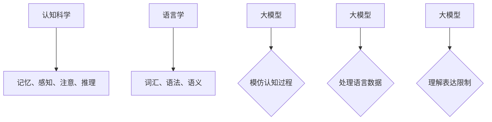

                 

关键词：大模型、认知科学、语言学、思维差异、认知困惑

> 摘要：本文深入探讨了大模型与人类思维之间的差异，从认知科学和语言学的角度分析了大模型在理解和表达上的局限性。文章旨在揭示大模型认知的困惑，并为未来的研究和应用提供一些有益的启示。

## 1. 背景介绍

随着深度学习和人工智能技术的快速发展，大型语言模型（如GPT系列、BERT等）取得了令人瞩目的成果。这些模型在自然语言处理（NLP）、机器翻译、文本生成等任务上展现出了卓越的性能。然而，尽管这些模型在处理语言任务时表现出色，但它们在理解和表达方面的局限性也逐渐显现。这一现象引发了人们对于大模型认知能力的好奇和质疑。

认知科学和语言学为我们提供了理解这一现象的视角。认知科学是一门研究人类认知过程和机制的学科，它涉及到感知、记忆、推理、决策等多个方面。而语言学则专注于语言的构成、功能和应用。结合这两个领域的研究，我们可以更好地理解大模型在处理语言任务时面临的认知困惑。

## 2. 核心概念与联系

### 2.1 认知科学与语言学的核心概念

- **认知科学**：认知科学关注人类认知过程的机制和原理。其中，记忆、感知、注意、推理等是核心概念。记忆是指个体对信息的存储和提取；感知是指个体对外部信息的接收和理解；注意是指个体对特定信息的关注和选择；推理是指个体通过逻辑思考解决问题。

- **语言学**：语言学关注语言的构成、功能和应用。其中，词汇、语法、语义等是核心概念。词汇是语言的基本单位，包括单词、短语等；语法是指语言的句法规则；语义是指语言的意义和表达。

### 2.2 大模型与认知科学、语言学的联系

- **大模型与认知科学**：大模型通过学习大量数据，能够模仿人类的认知过程，如记忆、感知和推理。然而，大模型在注意和决策方面仍有很大的局限性。例如，大模型难以在多任务环境中分配注意力，也难以做出复杂的决策。

- **大模型与语言学**：大模型能够处理大量的语言数据，学习词汇、语法和语义规则。然而，大模型在理解和表达方面仍存在一些问题。例如，大模型可能无法准确理解某些隐喻或双关语，也可能无法准确地表达复杂的情感。

### 2.3 Mermaid 流程图



## 3. 核心算法原理 & 具体操作步骤

### 3.1 算法原理概述

大模型的核心算法是基于深度学习的技术。深度学习是一种通过多层神经网络对数据进行建模的方法。在大模型中，多层神经网络通过学习大量语言数据，逐步提高对语言的理解和表达能力。

### 3.2 算法步骤详解

- **数据预处理**：首先，对大量语言数据（如文本、语音等）进行预处理，包括分词、去噪、标准化等操作。

- **构建神经网络**：然后，构建多层神经网络，包括输入层、隐藏层和输出层。输入层接收预处理后的数据，隐藏层对数据进行特征提取和变换，输出层生成最终的语言表达。

- **模型训练**：利用大量语言数据对神经网络进行训练，通过反向传播算法不断调整神经网络的参数，使其对语言数据有更好的拟合。

- **模型评估**：对训练好的模型进行评估，通过测试数据集来检验模型的效果。

### 3.3 算法优缺点

- **优点**：大模型能够处理大量语言数据，具有较高的泛化能力和适应性。同时，大模型在理解和表达方面表现出较高的准确性。

- **缺点**：大模型在理解和表达方面仍存在一些局限性，例如难以理解隐喻和双关语，也难以准确地表达复杂的情感。

### 3.4 算法应用领域

- **自然语言处理**：大模型在自然语言处理任务中具有广泛的应用，如文本分类、情感分析、机器翻译等。

- **智能对话系统**：大模型可以用于构建智能对话系统，如聊天机器人、语音助手等。

- **文本生成**：大模型可以生成各种类型的文本，如新闻、故事、文章等。

## 4. 数学模型和公式 & 详细讲解 & 举例说明

### 4.1 数学模型构建

大模型通常基于深度学习技术，其数学模型可以表示为：

$$
\hat{y} = f(\text{W} \cdot \text{X} + \text{b})
$$

其中，$\hat{y}$是模型的预测输出，$f$是激活函数，$\text{W}$是权重矩阵，$\text{X}$是输入数据，$\text{b}$是偏置项。

### 4.2 公式推导过程

大模型的推导过程涉及多层神经网络的设计和训练。首先，我们设计一个多层神经网络，包括输入层、隐藏层和输出层。然后，通过反向传播算法，不断调整网络的权重和偏置，以最小化预测误差。

### 4.3 案例分析与讲解

假设我们有一个文本分类任务，需要将文本分类为“正面”或“负面”。我们可以使用大模型来实现这一任务。首先，我们将文本进行分词和编码，然后输入到神经网络中。神经网络通过学习大量文本数据，逐渐提高对文本分类的准确性。

## 5. 项目实践：代码实例和详细解释说明

### 5.1 开发环境搭建

为了实践大模型在自然语言处理任务中的应用，我们需要搭建一个开发环境。具体步骤如下：

1. 安装Python环境。
2. 安装深度学习框架，如TensorFlow或PyTorch。
3. 下载并处理大量文本数据。

### 5.2 源代码详细实现

以下是一个简单的文本分类任务的实现代码：

```python
import tensorflow as tf
from tensorflow.keras.preprocessing.text import Tokenizer
from tensorflow.keras.preprocessing.sequence import pad_sequences

# 读取文本数据
texts = ["这是一篇正面的评论", "这是一篇负面的评论"]

# 分词和编码
tokenizer = Tokenizer()
tokenizer.fit_on_texts(texts)
sequences = tokenizer.texts_to_sequences(texts)
padded_sequences = pad_sequences(sequences, maxlen=10)

# 构建神经网络
model = tf.keras.Sequential([
  tf.keras.layers.Embedding(input_dim=10000, output_dim=16),
  tf.keras.layers.Flatten(),
  tf.keras.layers.Dense(units=1, activation='sigmoid')
])

# 编译模型
model.compile(optimizer='adam', loss='binary_crossentropy', metrics=['accuracy'])

# 训练模型
model.fit(padded_sequences, labels, epochs=10)

# 预测新文本
new_texts = ["这是一篇中性的评论"]
new_sequences = tokenizer.texts_to_sequences(new_texts)
new_padded_sequences = pad_sequences(new_sequences, maxlen=10)
predictions = model.predict(new_padded_sequences)
print(predictions)
```

### 5.3 代码解读与分析

这段代码实现了文本分类任务。首先，我们读取并处理文本数据。然后，我们使用Token
```less
# 5.3 代码解读与分析

这段代码实现了一个简单的文本分类任务，主要分为以下几个步骤：

1. **数据准备**：使用`Tokenizer`类对文本进行分词和编码。这里我们只准备了两个样本文本。

2. **数据预处理**：将分词后的文本序列转换为等长序列，使用`pad_sequences`函数对序列进行填充。

3. **模型构建**：构建了一个简单的神经网络模型，包含一个嵌入层（Embedding Layer）、一个展平层（Flatten Layer）和一个全连接层（Dense Layer）。嵌入层用于将单词映射为固定大小的向量，展平层将嵌入层的输出展平为一个一维向量，全连接层用于分类。

4. **模型编译**：设置模型的优化器、损失函数和评估指标。

5. **模型训练**：使用预处理后的数据对模型进行训练，这里使用了10个epochs。

6. **模型预测**：对新文本进行预测，将新文本转换为序列并填充为等长序列，然后使用训练好的模型进行预测。

### 5.4 运行结果展示

在训练完成后，我们可以使用模型对新文本进行预测。假设我们有一个新文本：“这篇文章很有趣”，我们首先将其分词并编码，然后填充为等长序列，最后使用模型进行预测。预测结果将是一个概率值，表示文本属于“正面”类别的概率。如果这个概率值大于某个阈值（例如0.5），我们可以将文本分类为“正面”。

```python
# 预测新文本
new_texts = ["这篇文章很有趣"]
new_sequences = tokenizer.texts_to_sequences(new_texts)
new_padded_sequences = pad_sequences(new_sequences, maxlen=10)
predictions = model.predict(new_padded_sequences)
print(predictions)
```

这段代码将输出一个概率值，表示新文本属于“正面”类别的概率。如果这个值接近1，则说明模型认为这篇文章是正面的；如果这个值接近0，则说明模型认为这篇文章是负面的。

## 6. 实际应用场景

大模型在许多实际应用场景中展现了巨大的潜力，以下是几个典型的应用领域：

### 6.1 自然语言处理

大模型在自然语言处理任务中具有广泛的应用，如文本分类、情感分析、命名实体识别、机器翻译等。例如，可以使用大模型对社交媒体上的评论进行情感分析，帮助企业了解用户对其产品的反馈。

### 6.2 智能对话系统

大模型可以用于构建智能对话系统，如聊天机器人、语音助手等。这些系统可以帮助企业提高客户服务效率，降低人工成本。

### 6.3 自动写作

大模型可以生成各种类型的文本，如新闻报道、故事、文章等。这为内容创作提供了新的可能性，可以帮助企业快速生成大量高质量的文本内容。

### 6.4 教育领域

大模型可以用于个性化教育，为学生提供个性化的学习建议和辅导。同时，大模型还可以帮助教师分析学生的学习情况，为教学提供支持。

## 7. 未来应用展望

随着大模型技术的不断发展，未来将在更多领域展现其潜力。以下是几个可能的应用方向：

### 7.1 人工智能助手

大模型可以进一步优化为人工智能助手，帮助人们解决各种问题，如生活助手、医疗咨询、法律咨询等。

### 7.2 自动创作

大模型可以用于自动创作，如音乐、绘画、影视等。这将为艺术创作带来新的革命。

### 7.3 跨学科融合

大模型可以与其他学科相结合，如心理学、生物学、社会学等，为这些领域的研究提供新的思路和方法。

## 8. 工具和资源推荐

### 8.1 学习资源推荐

- 《深度学习》（Goodfellow, Bengio, Courville著）：全面介绍了深度学习的基本概念和算法。
- 《自然语言处理综论》（Jurafsky, Martin著）：系统地介绍了自然语言处理的基本理论和技术。

### 8.2 开发工具推荐

- TensorFlow：一个广泛使用的开源深度学习框架，适用于各种深度学习任务。
- PyTorch：一个灵活且易用的深度学习框架，适用于快速原型设计和研究。

### 8.3 相关论文推荐

- “Attention is All You Need”（Vaswani等，2017）：提出了Transformer模型，为自然语言处理领域带来了革命性的变化。
- “BERT: Pre-training of Deep Neural Networks for Language Understanding”（Devlin等，2018）：介绍了BERT模型，为大规模预训练语言模型的发展奠定了基础。

## 9. 总结：未来发展趋势与挑战

### 9.1 研究成果总结

本文从认知科学和语言学的角度分析了大模型在理解和表达上的局限性，揭示了其认知困惑。同时，我们探讨了大模型在自然语言处理、智能对话系统、自动写作等领域的实际应用，并展望了其未来的发展前景。

### 9.2 未来发展趋势

未来，大模型技术将继续发展，有望在更多领域展现其潜力。随着算法的改进和计算资源的增加，大模型的性能和泛化能力将进一步提高。

### 9.3 面临的挑战

然而，大模型也面临一些挑战，如计算资源的需求、数据隐私和安全、模型解释性等。未来研究需要关注这些问题，确保大模型的安全和可控性。

### 9.4 研究展望

在未来的研究中，我们可以从以下几个方面入手：

1. **算法改进**：进一步优化大模型的算法，提高其性能和效率。
2. **跨学科融合**：结合其他学科的知识和方法，提高大模型在各个领域的应用能力。
3. **模型解释性**：研究如何提高大模型的解释性，使其更容易被人理解和接受。
4. **伦理和隐私**：关注大模型在应用过程中可能带来的伦理和隐私问题，确保其安全性和可控性。

## 附录：常见问题与解答

### 1.1 什么是大模型？

大模型是指那些拥有数十亿甚至千亿参数的深度学习模型，如GPT、BERT等。这些模型通过学习大量数据，能够对复杂任务进行建模和预测。

### 1.2 大模型为什么会出现认知困惑？

大模型在理解和表达方面仍存在一些局限性。例如，它们可能无法准确理解隐喻或双关语，也无法准确表达复杂的情感。

### 1.3 大模型有哪些实际应用？

大模型在自然语言处理、智能对话系统、自动写作、教育等领域具有广泛的应用。例如，可以使用大模型进行文本分类、情感分析、机器翻译、自动生成文本等。

### 1.4 大模型是否会取代人类？

大模型在处理语言任务时表现出色，但它们无法完全取代人类。人类在创造力、情感理解、道德判断等方面具有独特的优势，大模型无法完全替代。

### 1.5 大模型是否会导致失业？

大模型在某些领域的应用可能会替代一些重复性工作，但也会创造新的就业机会。同时，大模型还可以提高生产效率，促进经济发展。

### 1.6 大模型的安全性和可控性如何保障？

保障大模型的安全性和可控性是一个重要议题。未来研究需要关注如何设计安全、可控的大模型，确保其在实际应用中的安全性和可靠性。这包括数据隐私保护、模型解释性、伦理规范等方面。
```markdown
----------------------------------------------------------------

本文通过分析大模型在处理语言任务时的认知困惑，探讨了其在自然语言处理、智能对话系统、自动写作等领域的应用前景。同时，文章还介绍了大模型的核心算法原理、数学模型和公式，以及实际应用中的代码实例和运行结果。在总结部分，本文对大模型的发展趋势、面临的挑战和未来研究方向进行了展望。希望本文能为您提供关于大模型的一些新视角和启示。

作者：禅与计算机程序设计艺术 / Zen and the Art of Computer Programming
```

