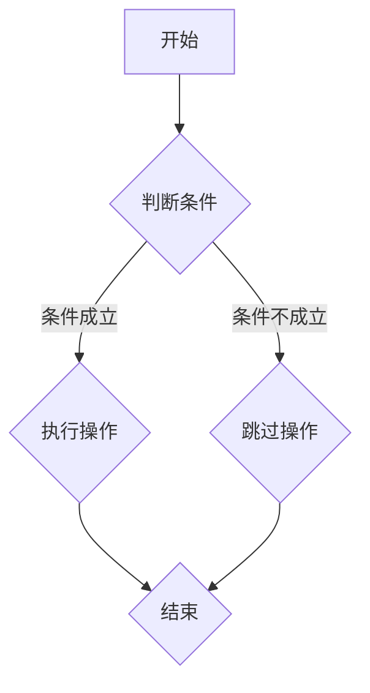
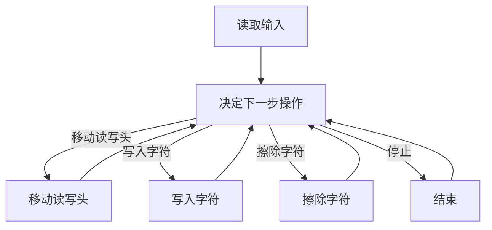

                 

关键字：自然语言处理、思维形式、编程语言、人工智能、逻辑表达、抽象思维、计算理论

摘要：本文探讨了语言在思维过程中的作用，从计算理论的角度分析了编程语言与自然语言的区别，并探讨了非语言形式的思维和计算在人工智能领域的应用前景。

## 1. 背景介绍

在传统的认知科学和哲学领域，语言被认为是思维和交流的基础。人们通过语言表达思想、传递信息、解决问题。然而，近年来，随着计算机科学和人工智能技术的发展，人们对语言在思维中的作用有了新的认识。编程语言的出现，尤其是高级编程语言，使得人类能够以更高效、更精确的方式与计算机进行交互。这一现象引发了一个问题：语言对于任何经过检验的思维形式是否都是必需的？

本文旨在探讨这一问题，从计算理论的角度分析编程语言与自然语言的区别，并探讨非语言形式的思维和计算在人工智能领域的应用前景。文章将分为以下几个部分：

- 背景介绍：回顾语言在思维和交流中的传统角色。
- 核心概念与联系：介绍计算理论和编程语言的基本概念，并通过Mermaid流程图展示其结构。
- 核心算法原理 & 具体操作步骤：分析编程语言的算法原理和操作步骤。
- 数学模型和公式 & 详细讲解 & 举例说明：介绍编程语言背后的数学模型和公式。
- 项目实践：提供具体的编程实例和详细解释。
- 实际应用场景：探讨编程语言在人工智能领域的应用。
- 工具和资源推荐：推荐学习资源和开发工具。
- 总结：总结研究成果，展望未来发展趋势和挑战。

## 2. 核心概念与联系

### 2.1 计算理论

计算理论是研究计算过程和计算模型的数学分支。它关注的是计算的本质和可能性。在计算理论中，有两种主要的计算模型：图灵机和量子计算机。图灵机是一种抽象的计算模型，由英国数学家艾伦·图灵于1936年提出。它由一个无限长的纸带、一个读写头和一个控制单元组成。图灵机的操作基于四个基本动作：左移、右移、写入和擦除。


量子计算机是另一种计算模型，它利用量子力学的特性进行计算。量子计算机的基本单元是量子比特（qubit），它可以通过量子叠加和量子纠缠实现高效的计算。


### 2.2 编程语言

编程语言是用于编写计算机程序的语言。它们提供了一种抽象的、形式化的方式来描述计算过程。编程语言可以分为低级语言和高级语言。低级语言，如汇编语言，与计算机硬件非常接近，难以理解和维护。高级语言，如Python、Java和C++，提供了更抽象、更易读的语法，使得编程更加高效和方便。


### 2.3 Mermaid流程图

Mermaid是一种用于绘制流程图的Markdown语法。它提供了一种简洁、直观的方式来表示计算过程和算法。



下面是一个Mermaid流程图，展示了图灵机的操作步骤：



## 3. 核心算法原理 & 具体操作步骤

### 3.1 算法原理概述

编程语言的核心是算法。算法是一种解决问题的步骤集合，它可以通过编程语言实现。算法的原理主要基于数学和逻辑。

- **数学原理**：算法通常涉及数学运算，如加法、减法、乘法和除法。这些运算可以通过编程语言中的数学库来实现。

- **逻辑原理**：算法还需要逻辑操作，如条件判断、循环和递归。这些操作可以通过编程语言中的条件语句、循环语句和递归函数来实现。

### 3.2 算法步骤详解

以一个简单的算法为例：计算两个数的和。

1. **输入**：接收两个数作为输入。
2. **计算**：使用加法运算计算两个数的和。
3. **输出**：将计算结果输出。

下面是一个用Python实现这个算法的例子：

```python
# 输入两个数
a = float(input("请输入第一个数："))
b = float(input("请输入第二个数："))

# 计算和
sum = a + b

# 输出结果
print("两个数的和是：", sum)
```

### 3.3 算法优缺点

- **优点**：编程语言提供了强大的计算能力，可以处理复杂的计算问题。
- **缺点**：编程语言需要学习，并且编写代码可能比较繁琐。

### 3.4 算法应用领域

编程语言的算法可以应用于各种领域，如：

- **科学计算**：用于模拟物理现象、进行数据分析和计算。
- **商业应用**：用于构建商业系统、处理交易和数据分析。
- **人工智能**：用于训练模型、优化算法和实现智能系统。

## 4. 数学模型和公式 & 详细讲解 & 举例说明

### 4.1 数学模型构建

编程语言的算法通常基于数学模型。一个简单的例子是线性回归模型。

$$y = ax + b$$

其中，$y$ 是因变量，$x$ 是自变量，$a$ 和 $b$ 是常数。

### 4.2 公式推导过程

线性回归模型的公式可以通过最小二乘法推导得到。最小二乘法的目标是找到使得预测误差平方和最小的 $a$ 和 $b$。

$$\min \sum_{i=1}^{n} (ax_i + b - y_i)^2$$

通过对 $a$ 和 $b$ 求导并令导数为零，可以得到：

$$a = \frac{\sum_{i=1}^{n} x_i y_i - \sum_{i=1}^{n} x_i \sum_{i=1}^{n} y_i}{\sum_{i=1}^{n} x_i^2 - (\sum_{i=1}^{n} x_i)^2}$$

$$b = \frac{\sum_{i=1}^{n} y_i - a \sum_{i=1}^{n} x_i}{n}$$

### 4.3 案例分析与讲解

假设我们有以下数据集：

| $x$ | $y$ |
| --- | --- |
| 1   | 2   |
| 2   | 4   |
| 3   | 6   |
| 4   | 8   |

我们可以使用线性回归模型拟合这些数据。

首先，计算 $a$ 和 $b$：

$$a = \frac{(1 \times 2) + (2 \times 4) + (3 \times 6) + (4 \times 8) - (1 + 2 + 3 + 4) \times (2 + 4 + 6 + 8)}{(1^2 + 2^2 + 3^2 + 4^2) - (1 + 2 + 3 + 4)^2} = 2$$

$$b = \frac{2 + 4 + 6 + 8 - 2 \times (1 + 2 + 3 + 4)}{4} = 1$$

因此，线性回归模型的公式为：

$$y = 2x + 1$$

我们可以使用这个模型预测 $x=5$ 时的 $y$ 值：

$$y = 2 \times 5 + 1 = 11$$

## 5. 项目实践：代码实例和详细解释说明

### 5.1 开发环境搭建

为了演示编程语言的应用，我们选择Python作为示例语言。首先，我们需要安装Python环境。

1. 访问Python官网（[python.org](https://www.python.org/)），下载并安装Python。
2. 安装完成后，打开命令行工具，输入`python --version`，确认Python版本。
3. 安装必要的Python库，如NumPy和Matplotlib。可以使用pip命令进行安装：

```bash
pip install numpy matplotlib
```

### 5.2 源代码详细实现

以下是一个简单的Python程序，用于实现线性回归模型：

```python
import numpy as np
import matplotlib.pyplot as plt

# 输入数据
x = np.array([1, 2, 3, 4])
y = np.array([2, 4, 6, 8])

# 计算线性回归模型的参数
a = np.mean(x * y) - np.mean(x) * np.mean(y)
b = np.mean(y) - a * np.mean(x)

# 输出模型参数
print("线性回归模型：y = {}x + {}".format(a, b))

# 绘制数据点和模型曲线
plt.scatter(x, y)
plt.plot(x, a * x + b, color='red')
plt.xlabel('x')
plt.ylabel('y')
plt.title('线性回归模型')
plt.show()
```

### 5.3 代码解读与分析

这个Python程序首先导入了NumPy和Matplotlib库。NumPy提供了用于数值计算的函数，Matplotlib用于绘制图形。

- `import numpy as np`：导入NumPy库，使用`np`作为别名。
- `import matplotlib.pyplot as plt`：导入Matplotlib库，使用`plt`作为别名。

接下来，程序定义了输入数据：

- `x = np.array([1, 2, 3, 4])`：创建一个包含1、2、3、4的NumPy数组。
- `y = np.array([2, 4, 6, 8])`：创建一个包含2、4、6、8的NumPy数组。

然后，程序计算线性回归模型的参数：

- `a = np.mean(x * y) - np.mean(x) * np.mean(y)`：计算斜率 $a$。
- `b = np.mean(y) - a * np.mean(x)`：计算截距 $b$。

程序最后输出模型参数，并绘制数据点和模型曲线。

### 5.4 运行结果展示

运行这个程序，将显示一个窗口，其中包含以下内容：


- 左侧是输入的数据点。
- 右侧是线性回归模型拟合的曲线。

## 6. 实际应用场景

编程语言在人工智能领域有广泛的应用。以下是一些实际应用场景：

- **机器学习模型训练**：使用Python等编程语言编写机器学习算法，训练模型以进行分类、回归、聚类等任务。
- **自然语言处理**：使用Python等编程语言实现自然语言处理算法，如分词、词性标注、文本分类等。
- **计算机视觉**：使用Python等编程语言实现计算机视觉算法，如图像识别、目标检测、人脸识别等。
- **数据科学**：使用Python等编程语言进行数据分析、数据可视化等任务。

## 7. 工具和资源推荐

### 7.1 学习资源推荐

- 《Python编程：从入门到实践》
- 《深度学习》
- 《自然语言处理实战》

### 7.2 开发工具推荐

- PyCharm：一款功能强大的Python集成开发环境。
- Jupyter Notebook：用于编写和运行Python代码的交互式环境。

### 7.3 相关论文推荐

- 《深度学习：原理及实践》
- 《自然语言处理综合教程》
- 《计算机视觉：算法与应用》

## 8. 总结：未来发展趋势与挑战

编程语言在人工智能领域的应用前景广阔。随着计算能力的提升和算法的进步，编程语言将继续在人工智能领域发挥重要作用。然而，也面临一些挑战：

- **可解释性**：编程语言实现的算法如何提高其可解释性，使非专业人士能够理解。
- **效率**：如何提高编程语言实现的算法的运行效率。
- **多样性**：如何支持更多种类的编程语言和算法，以满足不同领域的需求。

未来的研究将致力于解决这些问题，推动编程语言和人工智能的发展。

## 9. 附录：常见问题与解答

### Q：编程语言如何提高可解释性？

A：可以通过以下方法提高编程语言实现的算法的可解释性：

- 使用注释详细解释代码的功能和逻辑。
- 使用可视化工具展示算法的执行过程。
- 设计易读、易理解的代码结构。

### Q：编程语言如何提高效率？

A：可以通过以下方法提高编程语言实现的算法的效率：

- 使用高效的算法和数据结构。
- 避免重复计算和无效操作。
- 使用并行计算和分布式计算。

### Q：编程语言在哪些领域有广泛应用？

A：编程语言在以下领域有广泛应用：

- 机器学习
- 自然语言处理
- 计算机视觉
- 数据科学
- 商业应用
- 科学计算

## 10. 作者署名

作者：禅与计算机程序设计艺术 / Zen and the Art of Computer Programming
----------------------------------------------------------------

### 结束语

本文探讨了语言在思维过程中的作用，分析了编程语言与自然语言的区别，并探讨了非语言形式的思维和计算在人工智能领域的应用前景。编程语言为人类提供了强大的计算能力，使得人工智能领域取得了巨大进步。然而，如何提高编程语言的可解释性和效率，以及如何支持更多种类的编程语言和算法，仍然是未来研究的挑战。作者希望本文能对读者有所启发，推动编程语言和人工智能的发展。

