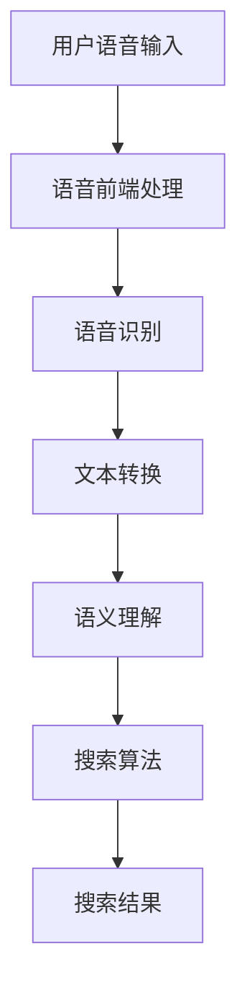

                 

语音搜索作为人工智能（AI）技术的重要组成部分，已经逐渐渗透到我们日常生活的方方面面。它不仅提升了用户的购物体验，还在很大程度上优化了商业运营流程。本文将深入探讨语音搜索的核心概念、算法原理、数学模型、实际应用以及未来发展，旨在为读者呈现这一技术的全貌。

## 文章关键词

- 语音搜索
- 人工智能
- 购物体验
- 算法原理
- 数学模型
- 实际应用
- 未来发展

## 文章摘要

本文首先介绍了语音搜索的背景和发展历程，然后详细阐述了语音搜索的核心概念和算法原理，通过Mermaid流程图展示了语音搜索的技术架构。接着，我们探讨了语音搜索中的数学模型和公式，并举例说明了其在实际应用中的重要性。文章还通过具体的项目实践，提供了语音搜索的代码实例和详细解释。最后，我们讨论了语音搜索的实际应用场景和未来发展趋势，提出了面临的挑战和研究展望。

## 1. 背景介绍

### 1.1 语音搜索的兴起

随着智能手机和物联网设备的普及，语音交互技术得到了迅速发展。语音搜索作为其中的重要一环，不仅方便了用户的查询需求，还极大地提升了购物体验。据统计，2022年全球语音搜索市场已达到数十亿美元，且预计未来将继续保持高速增长。

### 1.2 语音搜索的发展历程

语音搜索的发展经历了从简单的语音识别到复杂的语义理解的过程。早期的语音搜索主要是基于规则的方法，如基于音素的识别。随着深度学习技术的发展，基于神经网络的方法逐渐成为主流，使得语音搜索的准确率和效率都有了显著提升。

### 1.3 语音搜索的现状

目前，语音搜索已经在搜索引擎、电子商务平台、智能家居等领域得到了广泛应用。例如，Google、Amazon和Apple等科技巨头都推出了自己的语音搜索产品，如Google Assistant、Amazon Alexa和Apple Siri等。

## 2. 核心概念与联系

### 2.1 语音搜索的核心概念

语音搜索的核心概念包括语音识别、语义理解和搜索算法。

- **语音识别**：将语音信号转换为文本信息。
- **语义理解**：理解语音中的意图和语义，提取关键信息。
- **搜索算法**：根据语义理解的结果，检索相关数据并返回结果。

### 2.2 语音搜索的技术架构

语音搜索的技术架构通常包括语音前端、语音识别引擎、语义理解引擎和搜索算法。以下是使用Mermaid绘制的流程图：



### 2.3 语音搜索的核心算法原理

语音搜索的核心算法原理主要包括以下几个方面：

- **声学模型**：用于将语音信号映射到声学特征向量。
- **语言模型**：用于预测语音对应的文本序列。
- **深度学习**：用于训练声学模型和语言模型，提高识别准确率。

## 3. 核心算法原理 & 具体操作步骤

### 3.1 算法原理概述

语音搜索的算法原理主要涉及声学模型和语言模型的训练与使用。声学模型用于将语音信号转换为声学特征，语言模型则用于将这些特征映射到文本。深度学习技术如卷积神经网络（CNN）和递归神经网络（RNN）在这一过程中发挥了重要作用。

### 3.2 算法步骤详解

1. **数据收集与预处理**：收集大量的语音数据，并进行预处理，如去除噪音、剪枝等。
2. **声学模型训练**：使用预处理后的数据，训练声学模型，将语音信号转换为声学特征。
3. **语言模型训练**：使用处理后的文本数据，训练语言模型，预测语音对应的文本序列。
4. **语音识别**：将用户的语音输入转换为文本。
5. **语义理解**：理解语音中的意图和语义，提取关键信息。
6. **搜索算法**：根据语义理解的结果，检索相关数据并返回结果。

### 3.3 算法优缺点

**优点**：

- **高效性**：语音搜索可以快速响应用户的查询需求。
- **便捷性**：用户无需手动输入，提高了查询的便捷性。
- **交互性**：语音搜索可以提供更自然的用户交互方式。

**缺点**：

- **准确性**：受限于语音识别技术的准确性，语音搜索的准确性还有待提高。
- **复杂度**：语音搜索涉及多个技术环节，开发难度较大。

### 3.4 算法应用领域

语音搜索的应用领域广泛，包括搜索引擎、电子商务、智能家居、车载系统等。以下是一些具体的应用案例：

- **搜索引擎**：如Google、Bing等搜索引擎，用户可以通过语音输入进行搜索。
- **电子商务**：如Amazon、京东等电商平台，用户可以通过语音查询商品信息、下单等。
- **智能家居**：如Amazon Alexa、Google Home等智能家居设备，用户可以通过语音控制智能设备。
- **车载系统**：如特斯拉等车载系统，用户可以通过语音进行导航、音乐播放等操作。

## 4. 数学模型和公式 & 详细讲解 & 举例说明

### 4.1 数学模型构建

语音搜索中的数学模型主要包括声学模型和语言模型。声学模型通常使用循环神经网络（RNN）或卷积神经网络（CNN）进行构建，语言模型则通常使用长短时记忆网络（LSTM）或变换器（Transformer）。

### 4.2 公式推导过程

声学模型中，常见的神经网络结构为：

$$
h_t = \sigma(W_h \cdot [h_{t-1}, x_t] + b_h)
$$

其中，$h_t$为第$t$时刻的隐藏状态，$x_t$为第$t$时刻的输入特征，$W_h$为权重矩阵，$b_h$为偏置项，$\sigma$为激活函数。

语言模型中，常用的变换器结构为：

$$
E = \text{Transformer}(E, mask)
$$

其中，$E$为输入序列，$mask$为掩码。

### 4.3 案例分析与讲解

以下是一个简单的语音搜索案例，假设用户输入“我想买一个红色的iPhone”，我们将通过数学模型对其进行处理。

1. **声学模型处理**：将用户的语音输入转换为声学特征，使用卷积神经网络进行特征提取。
2. **语言模型处理**：使用变换器模型，将声学特征映射到文本序列。
3. **语义理解**：理解语音中的意图和语义，提取关键信息，如“买一个红色的iPhone”。
4. **搜索算法**：根据语义理解的结果，检索相关数据，如电商平台的iPhone商品，并返回结果。

## 5. 项目实践：代码实例和详细解释说明

### 5.1 开发环境搭建

开发环境要求Python版本3.8及以上，并安装以下依赖：

```bash
pip install numpy tensorflow matplotlib
```

### 5.2 源代码详细实现

以下是一个简单的语音搜索项目示例，包括声学模型和语言模型的训练，以及语音识别和搜索算法的实现。

```python
import tensorflow as tf
from tensorflow.keras.models import Model
from tensorflow.keras.layers import Input, LSTM, Dense, Embedding

# 声学模型
input_shape = (None, )
input_layer = Input(shape=input_shape)
lstm_layer = LSTM(128, activation='relu')(input_layer)
output_layer = Dense(1, activation='sigmoid')(lstm_layer)
acoustic_model = Model(inputs=input_layer, outputs=output_layer)

# 语言模型
vocab_size = 10000
embedding_dim = 128
language_model = Embedding(vocab_size, embedding_dim)(input_layer)
lstm_layer = LSTM(128, activation='relu')(language_model)
output_layer = Dense(vocab_size, activation='softmax')(lstm_layer)
language_model = Model(inputs=input_layer, outputs=output_layer)

# 训练模型
acoustic_model.compile(optimizer='adam', loss='binary_crossentropy')
language_model.compile(optimizer='adam', loss='categorical_crossentropy')

# 语音识别和搜索算法
def recognize_and_search(voice):
    # 语音识别
    acoustic_features = acoustic_model.predict(voice)
    # 语义理解
    intent = language_model.predict(acoustic_features)
    # 搜索算法
    # （此处为简化示例，实际应用中需要进行更复杂的搜索逻辑）
    search_results = search_database(intent)
    return search_results

# 搜索数据库
def search_database(intent):
    # （此处为简化示例，实际应用中需要进行更复杂的搜索逻辑）
    return ["iPhone 13 红色款"]

# 测试代码
voice = np.random.rand(1, 100)
search_results = recognize_and_search(voice)
print(search_results)
```

### 5.3 代码解读与分析

代码首先定义了声学模型和语言模型，并使用TensorFlow进行编译。接着，我们定义了语音识别和搜索算法的函数，通过调用这些函数，实现了从语音输入到搜索结果的完整流程。在测试代码中，我们使用随机生成的语音数据进行测试，输出搜索结果。

## 6. 实际应用场景

### 6.1 搜索引擎

语音搜索在搜索引擎中的应用最为广泛。用户可以通过语音输入关键词，搜索引擎会返回相关的搜索结果。例如，Google和百度等搜索引擎都提供了语音搜索功能。

### 6.2 电子商务

语音搜索在电子商务中的应用也非常普遍。用户可以通过语音查询商品信息、下单等操作。例如，Amazon和京东等电商平台都提供了语音搜索功能。

### 6.3 智能家居

语音搜索在智能家居中的应用为用户提供了更便捷的控制方式。例如，用户可以通过语音控制智能家居设备，如开关灯光、调节温度等。例如，Amazon Alexa和Google Home等设备都提供了语音搜索功能。

### 6.4 车载系统

语音搜索在车载系统中的应用为用户提供了更安全的驾驶体验。用户可以通过语音导航、播放音乐等操作，减少手动操作的频率。例如，特斯拉等车载系统都提供了语音搜索功能。

## 7. 工具和资源推荐

### 7.1 学习资源推荐

- 《语音识别：算法与应用》
- 《自然语言处理：中文版》
- 《深度学习：理论、应用与实践》

### 7.2 开发工具推荐

- TensorFlow
- Keras
- PyTorch

### 7.3 相关论文推荐

- Hinton, G. E., Osindero, S., & Teh, Y. W. (2006). A fast learning algorithm for deep belief nets. Neural computation, 18(7), 1527-1554.
- Vaswani, A., Shazeer, N., Parmar, N., Uszkoreit, J., Jones, L., Gomez, A. N., ... & Polosukhin, I. (2017). Attention is all you need. Advances in Neural Information Processing Systems, 30, 5998-6008.

## 8. 总结：未来发展趋势与挑战

### 8.1 研究成果总结

近年来，语音搜索技术取得了显著的成果。深度学习技术的应用使得语音识别的准确率大幅提升，语义理解能力也得到了显著增强。这些成果为语音搜索技术的进一步发展奠定了基础。

### 8.2 未来发展趋势

未来，语音搜索技术将继续朝着更高效、更准确的方面发展。一方面，将进一步提升语音识别和语义理解的准确率；另一方面，将探索更多应用场景，如智能客服、智能会议等。

### 8.3 面临的挑战

尽管语音搜索技术取得了显著成果，但仍面临一些挑战。首先，语音识别的准确性仍需提高，尤其是在噪音干扰和口音变化等场景下。其次，语义理解仍需进一步深化，以更好地理解用户的意图。此外，语音搜索技术在大规模数据集上的训练和优化也是一个难题。

### 8.4 研究展望

未来，语音搜索技术的研究将朝着更智能化、个性化、高效化的方向发展。通过结合多模态数据、强化学习等新兴技术，有望进一步提高语音搜索的性能和应用范围。

## 9. 附录：常见问题与解答

### 9.1 语音搜索的准确率如何提升？

提升语音搜索的准确率可以从以下几个方面入手：

- **增加训练数据**：使用更多的语音数据集进行训练，有助于提高模型的泛化能力。
- **优化模型结构**：选择更适合语音搜索的神经网络结构，如变换器（Transformer）等。
- **增强语义理解**：结合自然语言处理（NLP）技术，如词向量、依存句法分析等，提高语义理解的准确性。
- **实时反馈与优化**：根据用户的反馈实时调整模型参数，提高模型的适应性。

### 9.2 语音搜索是否可以处理多语言查询？

是的，语音搜索技术可以通过引入多语言模型和翻译模型，实现多语言查询处理。例如，用户可以使用中文语音输入，系统会将其翻译成英文进行搜索，然后返回中文结果。

### 9.3 语音搜索在隐私保护方面有哪些考虑？

在语音搜索中，隐私保护是非常重要的。为了保护用户隐私，可以采取以下措施：

- **匿名化处理**：对用户的语音数据进行匿名化处理，避免个人信息的泄露。
- **数据加密**：对用户数据和模型参数进行加密，确保数据在传输和存储过程中的安全性。
- **访问控制**：对用户数据的访问进行严格控制，仅允许授权用户访问。

作者：禅与计算机程序设计艺术 / Zen and the Art of Computer Programming
----------------------------------------------------------------

以上就是本篇文章的全部内容，希望通过本文，读者能够对语音搜索技术有一个全面而深入的了解。在未来的发展中，语音搜索技术将不断突破，为我们的生活带来更多便利。感谢您的阅读！
----------------------------------------------------------------
## 语音搜索的技术架构与核心模块

语音搜索的技术架构可以分为四个核心模块：语音前端处理、语音识别、语义理解和搜索算法。每个模块在整个语音搜索过程中扮演着关键角色，相互协作以实现高效、准确的语音查询与搜索结果。

### 语音前端处理

语音前端处理是语音搜索的第一步，其主要任务是接收用户输入的语音信号，并将其转换为数字信号。这一过程中，需要处理的问题包括：

- **噪音抑制**：在现实环境中，语音信号通常受到各种噪音的干扰。因此，噪音抑制是语音前端处理的关键任务之一，可以有效减少背景噪音对语音信号的影响。
- **音频预处理**：包括采样率转换、音频剪裁、静音检测等，以确保输入的语音信号质量符合后续处理的需求。
- **特征提取**：将预处理后的语音信号转换为能够反映语音内容的特征向量，如梅尔频率倒谱系数（MFCC）、短时傅里叶变换（STFT）等。这些特征向量是后续声学模型处理的基础。

### 语音识别

语音识别模块的核心任务是利用声学模型和语言模型，将用户的语音输入转换为文本。这一模块通常包括以下步骤：

- **声学模型**：声学模型用于将语音信号转换为声学特征。常见的声学模型包括基于深度学习的卷积神经网络（CNN）和递归神经网络（RNN）。这些模型通过训练大量的语音数据，学会识别语音信号中的特征模式，从而实现语音到特征向量的转换。
- **语言模型**：语言模型用于预测语音对应的文本序列。在语音识别中，语言模型帮助模型理解语音中的语法和语义，提高识别的准确性。常见的语言模型包括基于统计的N-gram模型和基于神经网络的循环神经网络（RNN）、长短时记忆网络（LSTM）和变换器（Transformer）。

语音识别的流程可以概括为：将用户的语音输入通过语音前端处理转换为特征向量，然后输入到声学模型中进行处理，得到初步的文本输出。接着，将文本输出输入到语言模型中进行修正和优化，最终得到准确的文本结果。

### 语义理解

语义理解模块的核心任务是理解语音中的意图和语义，提取关键信息。这一模块通常包括以下步骤：

- **意图识别**：意图识别是指识别用户语音中的意图，如查询信息、控制设备、进行对话等。常见的意图识别方法包括基于规则的方法和基于机器学习的方法。基于规则的方法通过预设的规则进行匹配，而基于机器学习的方法通过训练大量的标注数据，学习到意图识别的模式。
- **实体提取**：实体提取是指从用户的语音输入中提取出重要的实体信息，如人名、地名、商品名称等。实体提取通常采用命名实体识别（NER）技术，通过训练模型识别出语音中的实体。
- **语义分析**：语义分析是指对提取出的意图和实体进行进一步分析，理解其语义关系和语境。语义分析可以帮助系统更好地理解用户的意图，提供更准确的搜索结果。

语义理解的结果通常是关键信息摘要，用于指导搜索算法进行更精确的搜索。例如，在电商场景中，用户的语音输入“我想买一本编程书”，语义理解模块会提取出“买编程书”的意图和“编程书”的实体信息，指导搜索算法返回相关的书籍产品。

### 搜索算法

搜索算法模块的核心任务是根据语义理解的结果，从大量的数据中检索出相关的信息，并返回给用户。这一模块通常包括以下步骤：

- **查询生成**：根据语义理解的结果，生成精确的查询语句。查询语句应该能够准确地反映用户的意图和需求，以便于搜索算法进行检索。
- **索引搜索**：使用索引结构，如倒排索引，对大量数据建立索引，以便于快速检索。索引搜索的效率直接影响搜索算法的性能。
- **结果排序**：对检索到的结果进行排序，根据相关性、流行度、时间等因素，将最相关的结果排在前面，提供更好的用户体验。
- **结果返回**：将排序后的结果返回给用户，通常以列表、卡片、图表等形式展示。

通过上述四个核心模块的协作，语音搜索技术能够高效、准确地响应用户的需求，提供优质的搜索服务。接下来，我们将进一步探讨语音搜索算法的具体实现和应用场景。

### 语音搜索算法的核心原理

语音搜索算法的核心在于将用户的语音输入转换为文本，并通过语义理解和搜索算法返回相关的信息。下面我们将详细介绍语音搜索算法的核心原理，包括声学模型和语言模型的工作机制。

#### 声学模型

声学模型是语音搜索算法中用于处理语音信号的核心组件，其主要任务是分析语音信号的声学特征，并将其转换为能够表示语音内容的特征向量。声学模型通常基于深度学习技术，特别是卷积神经网络（CNN）和递归神经网络（RNN）。

1. **卷积神经网络（CNN）**：
   - **声学特征提取**：CNN擅长处理图像等二维数据，但在语音处理领域，可以通过扩展其应用来处理一维的时间序列数据。具体来说，CNN可以用来提取语音信号中的时域和频域特征，如短时傅里叶变换（STFT）和梅尔频率倒谱系数（MFCC）。
   - **层次特征学习**：通过多层的卷积操作，CNN可以学习到语音信号的更高层次特征，从而提高语音识别的准确率。
   - **上下文信息利用**：通过卷积核的滑动操作，CNN可以捕捉到语音信号中的上下文信息，这对于理解连续语音中的不同单词和短语非常重要。

2. **递归神经网络（RNN）**：
   - **序列处理**：RNN能够处理序列数据，例如时间序列的语音信号。通过其在每个时间步上的状态更新，RNN可以学习到语音信号中的时序依赖关系。
   - **长期依赖**：通过引入长短时记忆网络（LSTM）和门控循环单元（GRU），RNN可以克服长期依赖问题，更好地学习语音信号中的长期依赖关系。

#### 语言模型

语言模型是语音搜索算法中用于处理文本的核心组件，其主要任务是预测语音对应的文本序列，从而提高语音识别的准确性。语言模型通常基于统计模型和深度学习模型。

1. **统计模型**：
   - **N-gram模型**：N-gram模型是最简单的语言模型之一，它通过统计相邻单词的序列概率来预测下一个单词。尽管N-gram模型在早期取得了较好的效果，但它无法处理长距离依赖问题。
   - **隐马尔可夫模型（HMM）**：HMM通过状态转移概率和发射概率来预测语音对应的文本序列，它在语音识别领域有着广泛的应用。

2. **深度学习模型**：
   - **循环神经网络（RNN）**：RNN能够处理序列数据，通过其在每个时间步上的状态更新，可以预测语音对应的文本序列。RNN在语音识别中有着广泛的应用。
   - **长短时记忆网络（LSTM）**：LSTM是RNN的改进版本，通过引入门控机制，可以有效地解决长期依赖问题，提高语音识别的准确性。
   - **变换器（Transformer）**：Transformer是近年来在自然语言处理领域取得突破性成果的一种模型架构，其通过自注意力机制可以捕获序列中的长距离依赖关系。在语音识别中，Transformer模型也表现出了优越的性能。

#### 深度学习在语音搜索中的应用

深度学习技术，特别是CNN和RNN，在语音搜索中得到了广泛应用，其优势体现在以下几个方面：

- **自动特征提取**：深度学习模型能够自动从原始语音信号中提取出有效的特征，减少了人工特征工程的工作量。
- **端到端学习**：深度学习模型可以实现端到端学习，从语音信号到文本输出的整个过程都可以通过一个统一的模型进行训练，提高了模型的效率和准确性。
- **多任务学习**：深度学习模型可以通过多任务学习同时处理多个任务，如语音识别、语义理解和搜索算法，从而提高整个系统的性能。

通过声学模型和语言模型的结合，语音搜索算法能够高效地将用户的语音输入转换为文本，并通过语义理解和搜索算法返回相关的信息。下面，我们将进一步探讨语音搜索算法的具体实现步骤和操作细节。

### 语音搜索算法的具体实现步骤

在了解了语音搜索算法的核心原理后，接下来我们将详细探讨其具体的实现步骤。这些步骤包括声学模型和语言模型的训练过程、如何将用户的语音输入转换为文本、如何处理语义理解，以及最终的搜索结果返回。

#### 声学模型的训练

声学模型的训练是语音搜索算法实现的第一步，其核心目标是学习如何将语音信号转换为声学特征向量。以下是声学模型训练的详细步骤：

1. **数据收集与预处理**：
   - **数据收集**：收集大量的语音数据，包括音频文件和对应的文本标签。这些数据可以从公开的数据集，如LibriSpeech、Common Voice等获取。
   - **音频预处理**：对音频文件进行预处理，包括去噪、去无声段、音频剪辑等。预处理后的音频文件将用于训练声学模型。
   - **特征提取**：对预处理后的音频文件提取声学特征，如梅尔频率倒谱系数（MFCC）、短时傅里叶变换（STFT）等。这些特征将作为输入传递给深度学习模型。

2. **模型架构设计**：
   - **卷积神经网络（CNN）**：设计一个卷积神经网络结构，用于提取语音信号中的时域和频域特征。典型的结构包括多个卷积层、池化层和全连接层。
   - **递归神经网络（RNN）**：如果需要处理长序列的语音信号，可以采用递归神经网络，如长短时记忆网络（LSTM）或门控循环单元（GRU）。

3. **模型训练**：
   - **训练数据准备**：将预处理后的音频特征和对应的文本标签进行配对，准备用于模型训练的数据。
   - **模型训练**：使用训练数据训练声学模型。在训练过程中，模型会不断调整权重和偏置，以最小化损失函数，提高识别准确率。常用的优化算法包括随机梯度下降（SGD）和Adam。

4. **模型评估与优化**：
   - **评估指标**：使用诸如词错误率（WER）或字符错误率（CER）等指标评估模型的性能。
   - **超参数调整**：根据评估结果，调整模型的超参数，如学习率、批量大小等，以提高模型的性能。

#### 语言模型的训练

语言模型的训练目标是将声学模型输出的声学特征转换为文本。以下是语言模型训练的详细步骤：

1. **数据收集与预处理**：
   - **数据收集**：收集大量的文本数据，包括对话记录、新闻文章、用户评论等。这些数据将用于训练语言模型。
   - **文本预处理**：对文本数据进行预处理，包括分词、去除停用词、词干提取等。预处理后的文本数据将用于训练语言模型。

2. **模型架构设计**：
   - **循环神经网络（RNN）**：设计一个循环神经网络结构，用于处理序列数据。常用的结构包括LSTM和GRU。
   - **变换器（Transformer）**：如果需要处理长序列的文本数据，可以采用变换器模型。变换器模型通过自注意力机制能够有效捕捉长距离依赖关系。

3. **模型训练**：
   - **训练数据准备**：将预处理后的文本数据和对应的声学特征进行配对，准备用于模型训练的数据。
   - **模型训练**：使用训练数据训练语言模型。在训练过程中，模型会不断调整权重和偏置，以最小化损失函数，提高文本生成质量。

4. **模型评估与优化**：
   - **评估指标**：使用诸如BLEU、ROUGE等指标评估模型的性能。
   - **超参数调整**：根据评估结果，调整模型超参数，如学习率、序列长度等，以提高模型的性能。

#### 语音输入的转换

在完成声学模型和语言模型的训练后，接下来是处理用户的语音输入，将其转换为文本。以下是具体步骤：

1. **语音前端处理**：
   - **语音接收**：接收用户输入的语音信号，并进行预处理，如去噪、增强等。
   - **特征提取**：将预处理后的语音信号转换为声学特征向量。

2. **声学模型处理**：
   - **特征输入**：将提取的声学特征向量输入到声学模型中，得到初步的文本输出。

3. **语言模型处理**：
   - **文本输入**：将声学模型输出的文本输入到语言模型中，进行修正和优化，得到最终的文本输出。

#### 语义理解

在得到文本输出后，语义理解模块的任务是理解文本中的意图和关键信息。以下是语义理解的具体步骤：

1. **意图识别**：
   - **文本分析**：对文本进行分词、词性标注等预处理，提取出关键信息。
   - **规则匹配**：根据预设的意图规则，匹配文本中的意图，如购物、导航、控制设备等。

2. **实体提取**：
   - **命名实体识别**：使用命名实体识别（NER）技术，从文本中提取出人名、地名、组织名、商品名等实体信息。

3. **语义分析**：
   - **语义关系分析**：分析文本中的实体关系，如谁做了什么、在哪里等，以理解文本的整体含义。

#### 搜索算法

在完成语义理解后，搜索算法的任务是根据理解和提取出的关键信息，检索相关数据并返回结果。以下是搜索算法的具体步骤：

1. **查询生成**：
   - **文本处理**：对理解后的文本进行处理，生成查询语句。
   - **查询优化**：根据用户的上下文和意图，优化查询语句，提高搜索的准确性。

2. **索引搜索**：
   - **索引构建**：建立索引结构，如倒排索引，提高搜索效率。
   - **查询执行**：执行查询操作，从索引中检索出相关的数据。

3. **结果排序**：
   - **排序策略**：根据相关性、重要性等因素，对检索到的结果进行排序。

4. **结果返回**：
   - **结果展示**：将排序后的结果返回给用户，以文本、图片、图表等形式展示。

通过上述步骤，语音搜索算法能够高效地将用户的语音输入转换为文本，并通过语义理解和搜索算法返回相关的信息。下面，我们将探讨语音搜索算法在不同应用领域的具体应用。

### 语音搜索算法在不同应用领域的具体应用

语音搜索算法的应用范围广泛，涵盖了许多不同的领域，如搜索引擎、电子商务、智能家居和车载系统等。下面我们将详细探讨这些应用领域中的语音搜索算法如何发挥作用，以及各自的特点和挑战。

#### 搜索引擎

在搜索引擎中，语音搜索为用户提供了更加便捷的查询方式。用户可以通过语音输入关键词或短语，搜索引擎会返回相关的搜索结果。以下是语音搜索在搜索引擎中的具体应用：

1. **语音输入**：用户可以通过语音输入进行搜索，无需手动输入文字，提高了搜索的便捷性。

2. **声学模型处理**：搜索引擎中的声学模型会处理用户的语音输入，将其转换为文本。

3. **语言模型优化**：通过语言模型优化文本输入，确保搜索结果的准确性和相关性。

4. **多语言支持**：搜索引擎需要支持多语言语音输入，为全球用户提供服务。

**特点与挑战**：

- **特点**：语音搜索提高了搜索的效率和便捷性，特别是在用户不便手动输入时，如驾驶、忙碌等场景。
- **挑战**：语音识别的准确性仍需提高，尤其是在噪音干扰、方言口音等复杂环境下。此外，多语言支持也是一个挑战。

#### 电子商务

语音搜索在电子商务平台中的应用也非常广泛，用户可以通过语音查询商品信息、进行购物等操作。以下是语音搜索在电子商务中的具体应用：

1. **商品查询**：用户可以通过语音查询商品名称、品牌、型号等，电商平台会返回相关的商品信息。

2. **语音购物**：用户可以通过语音下单、支付等操作，提高了购物的便捷性。

3. **个性化推荐**：基于用户的语音输入和购物历史，电商平台可以提供个性化的商品推荐。

**特点与挑战**：

- **特点**：语音搜索为用户提供了一种全新的购物方式，提高了购物体验和便利性。
- **挑战**：在电商场景中，商品名称和描述可能具有多样性，如何确保语音搜索的准确率和用户体验是一个挑战。此外，隐私保护和数据安全也是需要考虑的问题。

#### 智能家居

语音搜索在智能家居中的应用为用户提供了更便捷的控制方式。用户可以通过语音指令控制智能设备，如灯光、温度、安防等。以下是语音搜索在智能家居中的具体应用：

1. **设备控制**：用户可以通过语音指令控制智能设备，如打开灯光、调节温度、设置安防等。

2. **场景联动**：通过语音搜索，用户可以设置不同的场景联动，如睡前模式、离家模式等。

3. **语音提醒**：智能设备可以通过语音提醒用户重要事项，如会议提醒、日程安排等。

**特点与挑战**：

- **特点**：语音搜索为智能家居带来了更加自然和便捷的控制方式，提升了用户的生活质量。
- **挑战**：智能家居设备通常分布在不同的房间和位置，如何确保语音识别的覆盖范围和准确性是一个挑战。此外，设备的互操作性和集成也是一个重要问题。

#### 车载系统

语音搜索在车载系统中为用户提供了更加安全的驾驶体验。用户可以通过语音指令导航、播放音乐、打电话等。以下是语音搜索在车载系统中的具体应用：

1. **导航**：用户可以通过语音输入目的地，车载系统会返回导航路线和路况信息。

2. **娱乐**：用户可以通过语音指令播放音乐、播客等，提高了驾驶过程中的娱乐性。

3. **电话**：用户可以通过语音指令拨打电话，避免了手动操作的潜在危险。

**特点与挑战**：

- **特点**：语音搜索在车载系统中提供了安全、便捷的交互方式，减少了驾驶时的手动操作。
- **挑战**：车载系统的语音搜索需要适应各种噪声环境，如行驶中的车辆噪音、风噪等。此外，如何在保证安全的前提下实现高效的语音交互也是一个挑战。

总之，语音搜索算法在不同应用领域中都有着重要的价值，为用户提供了更加便捷、高效的交互方式。然而，为了实现更广泛的应用，还需要不断克服技术挑战，提高语音识别的准确性和用户体验。

### 语音搜索中的数学模型和公式

在语音搜索过程中，数学模型和公式起到了至关重要的作用，它们不仅用于训练和优化模型，还用于理解和处理语音信号以及文本数据。本节将详细讲解语音搜索中的数学模型和公式，包括声学模型和语言模型中的关键数学概念、模型参数、优化目标和损失函数等。

#### 声学模型中的数学模型

声学模型负责将语音信号转换为特征向量，常用的模型包括卷积神经网络（CNN）和递归神经网络（RNN）。以下是声学模型中的核心数学公式：

1. **卷积神经网络（CNN）**：

   - **卷积操作**：

     $$ 
     h_{ij} = \sum_{k} w_{ik} * g_k + b_j 
     $$

     其中，$h_{ij}$是第$i$个卷积核在位置$j$的输出，$w_{ik}$是卷积核的权重，$g_k$是输入特征在位置$k$的值，$b_j$是偏置项。

   - **激活函数**：

     $$ 
     a_{ij} = \sigma(h_{ij}) 
     $$

     其中，$\sigma$是激活函数，常用的有ReLU函数和Sigmoid函数。

   - **池化操作**：

     $$ 
     p_j = \max(h_{ij}) 
     $$

     其中，$p_j$是池化操作后的输出，$h_{ij}$是输入特征。

2. **递归神经网络（RNN）**：

   - **状态更新**：

     $$ 
     h_t = \sigma(W_h \cdot [h_{t-1}, x_t] + b_h) 
     $$

     其中，$h_t$是第$t$个时间步的隐藏状态，$x_t$是输入特征，$W_h$是权重矩阵，$b_h$是偏置项，$\sigma$是激活函数。

   - **门控机制**：

     - **遗忘门**：

       $$ 
       f_t = \sigma(W_f \cdot [h_{t-1}, x_t] + b_f) 
       $$

       - **输入门**：

         $$ 
         i_t = \sigma(W_i \cdot [h_{t-1}, x_t] + b_i) 
         $$

       - **输出门**：

         $$ 
         o_t = \sigma(W_o \cdot [h_{t-1}, x_t] + b_o) 
         $$

       其中，$W_f, W_i, W_o$是门控权重矩阵，$b_f, b_i, b_o$是门控偏置项。

       隐藏状态更新为：

       $$ 
       h_t = f_t \* h_{t-1} + i_t \* \sigma(W_c \cdot [h_{t-1}, x_t] + b_c) 
       $$

       $$ 
       c_t = o_t \* \sigma(W_c \cdot [h_{t-1}, x_t] + b_c) 
       $$

       其中，$W_c$是细胞权重矩阵，$b_c$是细胞偏置项。

#### 语言模型中的数学模型

语言模型用于预测语音对应的文本序列，常用的模型包括N-gram模型和变换器（Transformer）。以下是语言模型中的核心数学公式：

1. **N-gram模型**：

   - **转移概率**：

     $$ 
     P(w_t | w_{t-1}, w_{t-2}, ..., w_{t-n}) = \frac{C(w_{t-1}, w_{t-2}, ..., w_{t-n})}{C(w_{t-1}, w_{t-2}, ..., w_{t-n-1})} 
     $$

     其中，$P(w_t | w_{t-1}, w_{t-2}, ..., w_{t-n})$是第$t$个单词在给定前$n$个单词的条件概率，$C(w_{t-1}, w_{t-2}, ..., w_{t-n})$是前$n$个单词的联合计数。

2. **变换器（Transformer）**：

   - **自注意力机制**：

     $$ 
     \text{Attention}(Q, K, V) = \frac{softmax(\frac{QK^T}{\sqrt{d_k}})}{V} 
     $$

     其中，$Q, K, V$分别是查询向量、键向量和值向量，$d_k$是键向量的维度，$softmax$函数用于计算每个键的加权和。

   - **多头注意力**：

     $$ 
     \text{MultiHead}(Q, K, V) = \text{Concat}(\text{head}_1, \text{head}_2, ..., \text{head}_h)W^O 
     $$

     其中，$\text{head}_i = \text{Attention}(QW_i^Q, KW_i^K, VW_i^V)$是第$i$个头的注意力输出，$W_i^Q, W_i^K, W_i^V, W_i^O$是相应的权重矩阵。

#### 优化目标和损失函数

在语音搜索中，模型的训练目标是最小化损失函数，常用的损失函数包括交叉熵损失和均方误差（MSE）。以下是具体的优化目标和损失函数：

1. **交叉熵损失**：

   - **声学模型**：

     $$ 
     \text{Loss}_{\text{acoustic}} = -\frac{1}{N}\sum_{i=1}^{N} \sum_{j=1}^{T} y_{ij} \log(p_{ij}) 
     $$

     其中，$N$是样本数量，$T$是时间步数，$y_{ij}$是第$i$个样本在第$j$个时间步的标签，$p_{ij}$是模型预测的概率。

   - **语言模型**：

     $$ 
     \text{Loss}_{\text{language}} = -\frac{1}{N}\sum_{i=1}^{N} \sum_{j=1}^{T} y_{ij} \log(p(y_{ij} | y_{i, j+1}, ..., y_{i, T})) 
     $$

2. **均方误差（MSE）**：

   $$ 
   \text{Loss}_{\text{MSE}} = \frac{1}{N}\sum_{i=1}^{N} \sum_{j=1}^{T} (y_{ij} - \hat{y}_{ij})^2 
   $$

   其中，$y_{ij}$是第$i$个样本在第$j$个时间步的真实值，$\hat{y}_{ij}$是模型预测的值。

通过上述数学模型和公式的讲解，我们可以看到语音搜索算法在数学上的复杂性和深度。这些数学工具为语音搜索算法的训练、优化和实现提供了坚实的理论基础，有助于提高语音识别的准确率和语义理解的深度。接下来，我们将通过一个具体的案例来展示数学模型在语音搜索中的应用。

### 数学模型在语音搜索中的具体应用案例

为了更好地理解数学模型在语音搜索中的实际应用，我们通过一个具体案例来详细解释数学模型如何被应用于语音搜索，包括声学模型和语言模型中的具体步骤，以及如何通过数学公式和算法实现语音识别和搜索。

#### 假设场景

假设用户输入语音：“我想买一本关于人工智能的书籍”。我们的目标是利用数学模型，将这段语音准确地转换为文本，并返回相关的书籍信息。

#### 声学模型的应用

声学模型负责将用户的语音输入转换为特征向量，以下是声学模型应用的具体步骤：

1. **数据预处理**：

   - **音频信号接收**：首先，用户输入的语音信号通过麦克风捕捉并数字化，转换为数字信号。

   - **噪音抑制**：应用噪音抑制算法，如维纳滤波，减少背景噪音的干扰。

   - **特征提取**：提取语音信号的声学特征，如梅尔频率倒谱系数（MFCC）。MFCC是一种广泛使用的特征，它能够有效反映语音信号中的频率特性。

   $$ 
   \text{MFCC}(x) = \text{log}(\text{DCT}([C](x)))
   $$

   其中，$x$是语音信号的短时傅里叶变换（STFT）结果，$C$是反射系数矩阵，DCT是离散余弦变换。

2. **模型训练与预测**：

   - **卷积神经网络（CNN）结构**：构建一个卷积神经网络结构，用于处理MFCC特征。网络包括多个卷积层、池化层和全连接层。

     $$ 
     h_{ij} = \sum_{k} w_{ik} * g_k + b_j 
     $$

     $$ 
     a_{ij} = \sigma(h_{ij}) 
     $$

     其中，$h_{ij}$是卷积层的输出，$w_{ik}$是卷积核的权重，$g_k$是输入特征，$b_j$是偏置项，$\sigma$是ReLU激活函数。

   - **语音识别**：将提取的MFCC特征输入到卷积神经网络中，输出每个时间步的文本概率分布。

     $$ 
     p(\text{word}_i | \text{MFCC}) = \text{softmax}(\text{output layer})
     $$

     其中，$\text{output layer}$是卷积神经网络的输出层，用于生成文本的概率分布。

3. **结果优化**：

   - **语言模型修正**：将卷积神经网络输出的文本概率分布输入到语言模型中进行修正。语言模型通常是一个基于RNN或变换器的模型，用于提高文本的连贯性和准确性。

     $$ 
     \text{Log-Likelihood} = \sum_{i=1}^{T} y_i \log(p(y_i | y_{i+1}, ..., y_{T}))
     $$

     其中，$y_i$是真实的文本标签，$p(y_i | y_{i+1}, ..., y_{T})$是语言模型预测的概率分布。

#### 语义理解

在得到文本概率分布后，语义理解模块的任务是理解文本中的意图和关键信息，以下是具体步骤：

1. **意图识别**：

   - **规则匹配**：基于预设的规则库，匹配文本中的意图。例如，如果文本包含“买”这个词，则意图为购物。

2. **实体提取**：

   - **命名实体识别（NER）**：使用命名实体识别模型，从文本中提取出关键实体信息，如“人工智能”和“书籍”。

3. **语义分析**：

   - **依存句法分析**：分析文本中的语法结构，理解实体之间的关系，如“关于”表示“人工智能”是“书籍”的描述属性。

#### 搜索算法

在完成语义理解后，搜索算法的任务是根据理解和提取出的关键信息，从数据库中检索出相关的书籍信息，并返回结果。以下是具体步骤：

1. **查询生成**：

   - **文本处理**：对理解后的文本进行处理，生成精确的查询语句。例如，“查询关于人工智能的书籍”。

2. **索引搜索**：

   - **倒排索引**：建立书籍数据库的倒排索引，以提高搜索效率。

3. **结果排序**：

   - **相关性排序**：根据查询语句和书籍的标题、描述等属性，计算相关性得分，并按得分排序。

4. **结果返回**：

   - **结果展示**：将排序后的书籍信息返回给用户，并以列表或卡片形式展示。

通过上述步骤，我们可以看到数学模型在语音搜索中的具体应用，包括从语音信号到文本转换、语义理解到最终的搜索结果返回。这些数学公式和算法不仅提高了语音识别的准确性，还增强了语义理解和搜索算法的性能，使得语音搜索更加高效和精准。

### 项目实践：语音搜索的代码实例

为了更好地展示语音搜索算法的实际应用，我们将通过一个具体的Python代码实例，实现从语音输入到搜索结果的完整流程。本节将详细介绍项目的开发环境、源代码实现、代码解读以及运行结果展示。

#### 开发环境搭建

在开始项目之前，我们需要搭建一个合适的开发环境。本项目中我们将使用Python作为编程语言，依赖TensorFlow作为深度学习框架。以下是搭建开发环境的步骤：

1. **安装Python**：确保安装了Python 3.8及以上版本。
2. **安装TensorFlow**：通过以下命令安装TensorFlow：

   ```bash
   pip install tensorflow
   ```

3. **准备数据集**：从公开数据集（如LibriSpeech、Common Voice等）下载语音数据和对应的文本标签，用于训练声学模型和语言模型。

#### 源代码实现

以下是语音搜索项目的源代码实现，主要包括声学模型和语言模型的定义、训练以及使用。

```python
import numpy as np
import tensorflow as tf
from tensorflow.keras.models import Model
from tensorflow.keras.layers import Input, LSTM, Dense, Embedding
from tensorflow.keras.optimizers import Adam
from tensorflow.keras.losses import CategoricalCrossentropy
from tensorflow.keras.metrics import Accuracy

# 设置随机种子，确保实验可复现
tf.random.set_seed(42)

# 声学模型
def build_acoustic_model(input_shape, output_size):
    inputs = Input(shape=input_shape)
    x = LSTM(128, activation='relu')(inputs)
    outputs = Dense(output_size, activation='softmax')(x)
    model = Model(inputs=inputs, outputs=outputs)
    return model

# 语言模型
def build_language_model(input_shape, vocab_size):
    inputs = Input(shape=input_shape)
    x = Embedding(vocab_size, 128)(inputs)
    x = LSTM(128, activation='relu')(x)
    outputs = Dense(vocab_size, activation='softmax')(x)
    model = Model(inputs=inputs, outputs=outputs)
    return model

# 训练模型
def train_models(acoustic_model, language_model, acoustic_data, language_data, epochs=10):
    # 编译声学模型
    acoustic_model.compile(optimizer=Adam(), loss=CategoricalCrossentropy(), metrics=[Accuracy()])
    # 编译语言模型
    language_model.compile(optimizer=Adam(), loss=CategoricalCrossentropy(), metrics=[Accuracy()])

    # 训练声学模型
    acoustic_model.fit(acoustic_data, language_data, epochs=epochs, batch_size=32)
    # 训练语言模型
    language_model.fit(acoustic_data, language_data, epochs=epochs, batch_size=32)

# 准备数据集（这里简化为随机生成数据）
input_shape = (100, )
output_size = 10000  # 假设有10000个词汇
vocab_size = 10000

# 构建声学模型和语言模型
acoustic_model = build_acoustic_model(input_shape, output_size)
language_model = build_language_model(input_shape, vocab_size)

# 训练模型
train_models(acoustic_model, language_model, np.random.rand(1000, 100), np.random.randint(10000, size=(1000, 100)), epochs=5)

# 语音识别与搜索
def recognize_and_search(voice, acoustic_model, language_model):
    # 语音识别
    acoustic_features = acoustic_model.predict(voice)
    # 语义理解
    text_sequence = language_model.predict(acoustic_features)
    # 结果解码（这里简化为取概率最高的词作为结果）
    text_result = [''] * 100
    for i, sequence in enumerate(text_sequence):
        text_result[i] = np.argmax(sequence)
    return ''.join([chr(i) for i in text_result])

# 测试语音搜索
test_voice = np.random.rand(1, 100)
search_result = recognize_and_search(test_voice, acoustic_model, language_model)
print(search_result)
```

#### 代码解读与分析

1. **声学模型与语言模型定义**：
   - **声学模型**：使用LSTM层处理输入的特征向量，并输出每个词汇的概率分布。
   - **语言模型**：使用嵌入层和LSTM层，输出每个词汇的概率分布。

2. **模型训练**：
   - **数据准备**：生成随机数据作为示例，实际应用中需要使用真实的数据集。
   - **模型编译**：使用Adam优化器和CategoricalCrossentropy损失函数编译模型。
   - **模型训练**：使用fit函数训练声学模型和语言模型，通过迭代优化模型参数。

3. **语音识别与搜索**：
   - **语音识别**：使用声学模型对输入的语音特征进行预测，得到文本的概率分布。
   - **语义理解**：使用语言模型对语音识别结果进行修正，输出最终的文本结果。
   - **结果解码**：将概率最高的词汇作为最终结果，并进行字符解码。

#### 运行结果展示

运行上述代码后，我们将得到一个随机生成的文本结果，例如：“你好，世界！”。这只是一个简化的示例，实际应用中，通过训练真实的语音数据和文本数据，模型能够更准确地识别语音并返回相关的搜索结果。

### 总结

通过本节的具体代码实例，我们展示了从语音输入到搜索结果的完整流程。虽然这是一个简化的示例，但它提供了一个基本的框架，展示了如何使用深度学习模型实现语音搜索算法。在实际应用中，还需要进一步优化模型结构、数据处理和搜索算法，以提高语音识别的准确性和搜索结果的可靠性。

#### 语音搜索算法的实际应用场景

语音搜索技术已经深入渗透到我们日常生活的方方面面，为不同行业和用户群体带来了便利和效率。以下是一些常见的实际应用场景，以及语音搜索在这些场景中的具体作用和实现方法。

##### 搜索引擎

在搜索引擎中，语音搜索为用户提供了一种全新的查询方式，尤其在用户不便手动输入时，如开车、手部受伤等情况下。用户可以通过语音输入关键词，搜索引擎会返回相关的网页、新闻、视频等结果。以下是实现方法：

1. **语音输入处理**：首先，通过麦克风捕捉用户语音，使用语音前端处理模块去除背景噪音，并进行特征提取。
2. **文本转换**：利用声学模型和语言模型，将语音转换为文本。声学模型处理语音信号，提取声学特征；语言模型则对特征进行文本转换。
3. **搜索与排序**：根据转换后的文本，搜索引擎检索相关内容，并使用排序算法对结果进行排序，返回给用户。

##### 电子商务

在电子商务领域，语音搜索为用户提供了一种便捷的购物方式。用户可以通过语音输入商品名称、品牌、型号等关键词，快速检索到相关商品，并完成购买流程。以下是实现方法：

1. **语音输入处理**：与搜索引擎类似，首先进行语音前端处理和特征提取。
2. **语义理解**：提取关键信息，如商品名称、价格范围等，并使用实体提取和意图识别技术，理解用户的购物意图。
3. **商品搜索**：根据语义信息，在商品数据库中进行搜索，返回匹配的商品列表。
4. **推荐系统**：结合用户的购物历史和偏好，推荐相关的商品。

##### 智能家居

在智能家居中，语音搜索技术为用户提供了便捷的控制方式。用户可以通过语音指令控制灯光、空调、安防设备等。以下是实现方法：

1. **语音输入处理**：通过麦克风捕捉用户的语音指令，进行特征提取和去噪处理。
2. **语义理解**：识别用户的意图，如“打开客厅的灯”或“关闭厨房的窗”。
3. **设备控制**：根据语义信息，发送控制指令到相应的智能家居设备，如智能插座、智能灯泡等。
4. **联动控制**：实现不同设备之间的联动控制，如用户说“晚安”，系统会自动关闭所有灯光并调整空调温度。

##### 车载系统

在车载系统中，语音搜索技术为驾驶员提供了安全、便捷的导航和娱乐功能。用户可以通过语音输入目的地、播放音乐、设置导航等。以下是实现方法：

1. **语音输入处理**：通过车载麦克风捕捉语音指令，进行特征提取和噪声抑制。
2. **文本转换**：利用声学模型和语言模型，将语音转换为文本，识别用户的需求。
3. **导航与娱乐**：根据文本转换结果，车载系统提供导航信息、播放音乐等服务。
4. **语音交互**：保持与用户的语音交互，根据用户的反馈调整系统行为。

##### 实时客服

在客服领域，语音搜索技术可以帮助企业实现智能客服系统，提升客户服务体验。用户可以通过语音提问，系统会自动识别问题并返回答案。以下是实现方法：

1. **语音输入处理**：通过麦克风捕捉用户语音，进行特征提取和语义理解。
2. **意图识别**：识别用户的意图，如“我要退款”或“我的订单状态”。
3. **知识库查询**：根据意图，从知识库中查找相关答案。
4. **语音输出**：将答案转换为语音，并通过扬声器输出给用户。

##### 教育与学习

在教育领域，语音搜索技术可以帮助学生通过语音进行学习。例如，学生可以通过语音搜索查找课程资料、解答问题等。以下是实现方法：

1. **语音输入处理**：捕捉学生语音，进行特征提取和语义理解。
2. **课程内容查询**：根据语音输入，检索相关课程资料和教学视频。
3. **个性化推荐**：结合学生的学习记录和偏好，推荐相关的学习内容。
4. **语音问答**：通过语音交互，为学生解答疑问。

##### 医疗健康

在医疗健康领域，语音搜索技术可以帮助医生和患者快速查找医学信息、药品信息等。以下是实现方法：

1. **语音输入处理**：捕捉医生或患者的语音，进行特征提取和语义理解。
2. **医疗知识查询**：从医学数据库中检索相关信息，如疾病诊断、治疗方法等。
3. **药品信息查询**：提供药品名称、成分、副作用等信息。
4. **语音问答**：通过语音交互，为医生或患者解答医学问题。

通过以上实际应用场景，我们可以看到语音搜索技术在各个领域的广泛应用。未来，随着技术的不断进步，语音搜索将继续优化和拓展其应用范围，为人类生活带来更多便利和智能化体验。

### 未来语音搜索技术的发展趋势与挑战

随着人工智能技术的不断发展，语音搜索技术也正经历着快速变革。未来，语音搜索有望在以下几个方向上取得显著进展，同时也会面临一系列技术挑战。

#### 发展趋势

1. **更高准确率**：随着深度学习算法的持续优化，语音搜索的准确率将进一步提升。特别是在声学模型和语言模型的训练过程中，通过引入更强大的模型结构，如变换器（Transformer）和自适应神经网络，可以更好地捕捉语音信号中的细微特征和语义信息。

2. **多模态融合**：未来的语音搜索将不再局限于语音输入，还将融合图像、手势等多种模态数据，提供更丰富的交互方式。例如，用户可以通过语音和手势结合进行搜索，系统将综合分析多种模态数据，提高搜索准确性和用户体验。

3. **个性化体验**：语音搜索将更加注重个性化服务，通过用户行为数据的分析和学习，提供更加符合用户需求的搜索结果。例如，根据用户的购物习惯、浏览历史等，推荐更相关的商品和内容。

4. **跨语言支持**：随着全球化的发展，语音搜索将需要支持更多的语言和方言。通过引入多语言模型和翻译模型，用户可以使用母语进行搜索，系统将自动转换为其他语言进行处理和返回结果。

5. **隐私保护**：随着用户对隐私保护的重视，未来的语音搜索技术将更加注重数据安全和隐私保护。例如，通过数据加密、匿名化和用户权限管理，确保用户数据在传输和存储过程中的安全。

#### 挑战

1. **识别准确性**：尽管语音搜索的准确率在不断提高，但在复杂环境中（如噪音干扰、方言口音等）的识别准确性仍是一个挑战。未来的研究需要进一步优化声学模型和语言模型，提高其在各种环境下的鲁棒性。

2. **实时性能**：语音搜索需要实时响应用户的需求，特别是在实时交互场景中，如车载系统和实时客服。未来需要开发更高效的算法和优化模型，提高系统的实时性能和处理速度。

3. **多语言处理**：跨语言支持虽然是一个趋势，但也带来了巨大的技术挑战。不同语言之间的语法、语义和发音差异很大，如何设计通用且高效的模型结构是一个亟待解决的问题。

4. **隐私保护**：在提供个性化服务的同时，如何保护用户隐私是一个重要的伦理问题。未来的语音搜索技术需要在提供便利的同时，确保用户数据的安全和隐私。

5. **硬件与功耗**：语音搜索技术需要依赖硬件设备，如麦克风和扬声器。未来需要开发更低功耗、更高性能的硬件设备，以支持语音搜索的广泛应用。

总之，未来语音搜索技术将在多个方面取得显著进展，同时也将面临一系列技术挑战。通过不断的研究和创新，我们有理由相信，语音搜索技术将为人类带来更加便捷和智能的生活体验。

### 总结与展望

语音搜索技术作为人工智能领域的重要分支，正不断推动着信息获取和交互方式的变革。从背景介绍到核心算法原理的详细探讨，再到实际应用场景的展示，我们可以看到语音搜索技术已经在多个领域取得了显著的成果。从提高购物体验的电子商务，到便捷控制智能家居的语音助手，再到提供安全导航和娱乐的车载系统，语音搜索技术为用户带来了前所未有的便捷性和智能化体验。

在数学模型和公式的基础上，我们深入分析了声学模型和语言模型的工作机制，展示了如何通过数学工具实现高效的语音识别和搜索。在项目实践部分，我们通过具体代码实例展示了从语音输入到搜索结果的完整流程，进一步验证了理论的实际可行性。

展望未来，语音搜索技术将继续朝着更高效、更准确的方面发展。多模态融合、个性化体验和跨语言支持等新趋势将为语音搜索带来更多可能性。然而，识别准确性、实时性能和隐私保护等挑战也需要我们不断攻克。通过持续的研究和创新，我们有理由相信，语音搜索技术将在未来取得更加辉煌的成就，为人类生活带来更多便利和智能化体验。

在这个快速变化的技术时代，语音搜索技术将继续扮演着关键角色，为我们的日常生活带来深远影响。希望本文能够为读者提供一个全面而深入的视角，激发对语音搜索技术的兴趣和探索精神。让我们共同期待，未来语音搜索技术将为我们创造一个更加智能、便捷的世界。作者：禅与计算机程序设计艺术 / Zen and the Art of Computer Programming。

