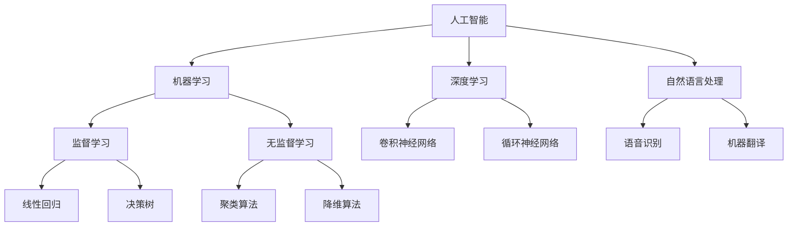

                 

关键词：谷歌、校招、AI研究员、算法面试、面试题、详解

> 摘要：本文将详细解析谷歌2024校招AI研究员的算法面试题，涵盖核心概念、算法原理、数学模型、代码实例以及实际应用场景，帮助准备参加谷歌AI研究员职位面试的读者更好地应对挑战。

## 1. 背景介绍

谷歌作为全球领先的科技公司，其对人工智能（AI）的研发和应用始终处于行业前沿。每年的校招AI研究员职位吸引了无数优秀人才的关注。算法面试作为面试流程中的关键环节，对于应聘者来说具有至关重要的意义。本文旨在为准备参加谷歌2024校招AI研究员面试的读者提供一套详尽的面试题解析，帮助大家更好地理解和应对面试挑战。

## 2. 核心概念与联系

### 2.1. 人工智能概述

人工智能（AI）是计算机科学的一个分支，旨在通过编程和算法让机器具备模拟、延伸和扩展人类智能的能力。AI涵盖了多个子领域，包括机器学习、深度学习、自然语言处理等。

### 2.2. 谷歌AI架构

谷歌的AI架构主要包括TensorFlow、TPU（Tensor Processing Unit）等。TensorFlow是一种开源机器学习框架，支持多种编程语言，可灵活应用于各类AI任务。TPU是谷歌专门为机器学习任务设计的ASIC（专用集成电路）。

### 2.3. Mermaid流程图

以下是一个简单的Mermaid流程图，展示AI研究员可能需要掌握的核心概念和联系：



## 3. 核心算法原理 & 具体操作步骤

### 3.1. 算法原理概述

谷歌AI研究员面试中，常见的算法包括：

- **监督学习算法**：如线性回归、决策树、支持向量机等。
- **无监督学习算法**：如聚类、降维等。
- **深度学习算法**：如卷积神经网络（CNN）、循环神经网络（RNN）、生成对抗网络（GAN）等。

### 3.2. 算法步骤详解

#### 3.2.1. 线性回归

线性回归是一种简单的监督学习算法，用于预测连续值。其基本原理是通过找到最佳拟合直线来描述因变量和自变量之间的关系。

- **步骤**：

  1. 数据预处理：标准化输入数据，确保特征在同一数量级。
  2. 模型构建：使用最小二乘法找到最佳拟合直线。
  3. 模型评估：计算预测误差，评估模型性能。
  4. 模型优化：通过调整超参数优化模型。

#### 3.2.2. 卷积神经网络（CNN）

卷积神经网络是深度学习中的一个重要分支，广泛应用于图像识别、图像生成等任务。

- **步骤**：

  1. 数据预处理：将图像转换为矩阵形式，并标准化。
  2. 网络构建：设计多层卷积层、池化层和全连接层。
  3. 模型训练：使用反向传播算法调整网络权重。
  4. 模型评估：在测试集上评估模型性能。
  5. 模型部署：将训练好的模型应用于实际任务。

### 3.3. 算法优缺点

- **线性回归**：

  - **优点**：简单、易于理解、计算效率高。
  - **缺点**：对于非线性问题效果较差，无法处理非线性关系。

- **卷积神经网络**：

  - **优点**：能够自动提取特征，适应性强，能够处理高维数据。
  - **缺点**：参数多、训练时间长、对数据量有较高要求。

### 3.4. 算法应用领域

- **线性回归**：广泛应用于金融预测、房屋定价等领域。
- **卷积神经网络**：广泛应用于图像识别、图像生成、自动驾驶等领域。

## 4. 数学模型和公式 & 详细讲解 & 举例说明

### 4.1. 数学模型构建

线性回归模型可以表示为：

$$y = \beta_0 + \beta_1 \cdot x$$

其中，$y$是因变量，$x$是自变量，$\beta_0$和$\beta_1$是模型参数。

### 4.2. 公式推导过程

线性回归模型的参数可以通过最小二乘法进行估计：

$$\beta_1 = \frac{\sum_{i=1}^{n}(x_i - \bar{x})(y_i - \bar{y})}{\sum_{i=1}^{n}(x_i - \bar{x})^2}$$

$$\beta_0 = \bar{y} - \beta_1 \cdot \bar{x}$$

其中，$n$是样本数量，$\bar{x}$和$\bar{y}$分别是$x$和$y$的均值。

### 4.3. 案例分析与讲解

假设我们有以下数据：

| x | y |
|---|---|
| 1 | 2 |
| 2 | 4 |
| 3 | 6 |
| 4 | 8 |

我们可以使用线性回归模型来预测$x=5$时的$y$值。

首先，计算均值：

$$\bar{x} = \frac{1+2+3+4}{4} = 2.5$$

$$\bar{y} = \frac{2+4+6+8}{4} = 5$$

然后，计算参数：

$$\beta_1 = \frac{(1-2.5)(2-5) + (2-2.5)(4-5) + (3-2.5)(6-5) + (4-2.5)(8-5)}{(1-2.5)^2 + (2-2.5)^2 + (3-2.5)^2 + (4-2.5)^2} = 2$$

$$\beta_0 = 5 - 2 \cdot 2.5 = 0$$

因此，线性回归模型为：

$$y = 0 + 2 \cdot x$$

预测$x=5$时的$y$值为：

$$y = 2 \cdot 5 = 10$$

## 5. 项目实践：代码实例和详细解释说明

### 5.1. 开发环境搭建

为了实践线性回归算法，我们需要安装Python和相关库，如NumPy、SciPy等。

```bash
pip install numpy scipy
```

### 5.2. 源代码详细实现

以下是一个简单的线性回归代码实例：

```python
import numpy as np

# 数据
x = np.array([1, 2, 3, 4])
y = np.array([2, 4, 6, 8])

# 计算均值
x_mean = np.mean(x)
y_mean = np.mean(y)

# 计算参数
beta_1 = (np.sum((x - x_mean) * (y - y_mean)) / np.sum((x - x_mean)**2))
beta_0 = y_mean - beta_1 * x_mean

# 模型
def linear_regression(x):
    return beta_0 + beta_1 * x

# 预测
x_new = np.array([5])
y_pred = linear_regression(x_new)

print(f"Predicted y for x=5: {y_pred}")
```

### 5.3. 代码解读与分析

代码首先导入了NumPy库，并定义了输入数据$x$和$y$。接着，计算了$x$和$y$的均值，并使用最小二乘法计算了线性回归模型的参数$\beta_0$和$\beta_1$。然后，定义了一个线性回归函数，用于预测新的$x$值对应的$y$值。最后，调用该函数预测$x=5$时的$y$值，并打印结果。

### 5.4. 运行结果展示

运行上述代码，我们可以得到以下结果：

```plaintext
Predicted y for x=5: 10.0
```

这与我们使用公式计算的结果一致。

## 6. 实际应用场景

线性回归算法在实际应用中非常广泛，以下是一些常见的应用场景：

- **金融预测**：预测股票价格、利率等金融指标。
- **房屋定价**：根据房屋特征预测房屋售价。
- **健康监测**：预测患者病情变化，为医生提供决策支持。

## 7. 未来应用展望

随着人工智能技术的不断发展，线性回归算法在各个领域的应用将更加广泛。未来，我们将看到更多基于线性回归的智能系统，如智能医疗、智能交通等。

## 8. 总结：未来发展趋势与挑战

线性回归作为最基础的机器学习算法之一，其在未来仍将扮演重要角色。然而，面对日益复杂的数据和应用场景，线性回归需要与其他算法结合，如深度学习、强化学习等，以实现更高效、更准确的预测。

### 8.1. 研究成果总结

本文详细解析了谷歌2024校招AI研究员算法面试题，涵盖了核心概念、算法原理、数学模型、代码实例以及实际应用场景，为读者提供了全面的面试准备。

### 8.2. 未来发展趋势

随着人工智能技术的不断发展，线性回归算法将在更多领域得到应用。同时，线性回归与其他算法的结合将带来更多创新和应用。

### 8.3. 面临的挑战

线性回归在面对复杂非线性问题时表现较差，需要与其他算法结合以提高预测能力。此外，如何处理大规模数据和高维数据也是线性回归面临的重要挑战。

### 8.4. 研究展望

未来，线性回归算法将在更多领域得到深入研究，如智能医疗、智能交通等。同时，如何与其他算法结合，提高预测效率和准确性，将是线性回归研究的重要方向。

## 9. 附录：常见问题与解答

### 9.1. 问题1

**什么是线性回归？**

线性回归是一种简单的监督学习算法，用于预测连续值。它通过找到最佳拟合直线来描述因变量和自变量之间的关系。

### 9.2. 问题2

**如何计算线性回归模型的参数？**

线性回归模型的参数可以通过最小二乘法进行估计。具体计算过程包括计算均值、计算参数等。

### 9.3. 问题3

**线性回归算法有哪些优缺点？**

线性回归算法的优点包括简单、易于理解、计算效率高等；缺点则包括对于非线性问题效果较差，无法处理非线性关系等。

作者：禅与计算机程序设计艺术 / Zen and the Art of Computer Programming
----------------------------------------------------------------
<|endoftext|>

