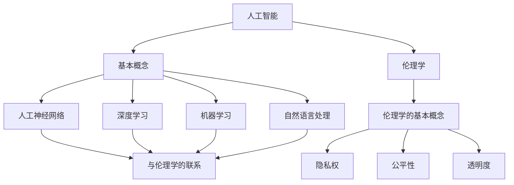

                 

 在当今信息时代，人工智能（AI）已经成为驱动技术进步和社会变革的重要力量。随着AI技术的不断发展，其应用场景日益广泛，从自动驾驶汽车、智能客服到医疗诊断和金融风控，AI正在深刻地改变着我们的生活方式。然而，随着AI技术的发展，一系列伦理问题也逐渐浮出水面。如何确保AI技术的负责任使用，防止其滥用，成为我们必须面对的紧迫问题。

本文旨在探讨人工智能的伦理问题，分析其背景、核心概念、算法原理、数学模型、项目实践、应用场景、未来展望以及面临的挑战。希望通过这篇文章，能够引发读者对于人工智能伦理问题的深入思考，共同为构建一个负责任、可信赖的人工智能生态做出贡献。

## 1. 背景介绍

### 1.1 人工智能的发展历程

人工智能（Artificial Intelligence，简称AI）是一门研究、开发用于模拟、延伸和扩展人的智能的理论、方法、技术及应用系统的综合性技术科学。人工智能的研究始于20世纪50年代，当时计算机科学家们开始探索如何使计算机具备类似人类的智能。

在初期，人工智能的研究主要集中在符号主义和逻辑推理上。例如，20世纪60年代的“逻辑理论家”（Logic Theorist）程序证明了数学定理，20世纪70年代的“专家系统”（Expert Systems）则应用于医疗诊断、金融分析和法律咨询等领域。

然而，这些早期的AI系统在处理复杂、不确定的问题时效果不佳，导致了一段时间的“人工智能冬天”。随着计算能力的提升和大数据、深度学习等技术的出现，人工智能在21世纪初迎来了新的发展机遇。特别是深度学习技术的突破，使得计算机在图像识别、语音识别、自然语言处理等任务上取得了显著进展。

### 1.2 人工智能的应用场景

人工智能技术的应用已经渗透到社会的各个领域。以下是一些典型的应用场景：

- **自动驾驶汽车**：通过计算机视觉、传感器和机器学习算法，自动驾驶汽车能够实现自主导航和驾驶。
- **智能客服**：利用自然语言处理和机器学习技术，智能客服能够自动响应用户的查询和请求，提高服务效率。
- **医疗诊断**：通过分析医学影像和患者数据，人工智能可以辅助医生进行疾病诊断和治疗方案推荐。
- **金融风控**：利用机器学习算法，金融行业可以实时监控交易风险，防范金融欺诈。
- **智能家居**：通过物联网和人工智能技术，智能家居系统能够自动调节室内温度、照明等，提高生活质量。

### 1.3 人工智能的伦理问题

随着人工智能技术的不断发展，一系列伦理问题逐渐浮现。以下是一些常见的伦理问题：

- **隐私保护**：人工智能系统在收集和使用个人数据时，如何确保用户的隐私不被侵犯？
- **算法偏见**：人工智能算法在决策过程中是否存在偏见，如何消除这些偏见？
- **责任归属**：当人工智能系统发生错误或导致不良后果时，如何确定责任归属？
- **失业问题**：人工智能是否会取代人类工作，导致大规模失业和社会不稳定？
- **武器化人工智能**：如何防止人工智能被用于恶意目的，如网络攻击、自动化武器等？

本文将围绕这些伦理问题进行深入探讨，并提出相应的解决方案。

## 2. 核心概念与联系

在探讨人工智能的伦理问题时，首先需要了解一些核心概念。以下是本文涉及的主要概念及其相互关系：

### 2.1 人工智能的基本概念

- **人工神经网络（Artificial Neural Network，ANN）**：模拟人脑神经元结构和功能的计算模型，通过学习大量数据来识别模式和进行预测。
- **深度学习（Deep Learning，DL）**：一种基于多层神经网络的机器学习技术，通过逐层提取特征，实现复杂模式的识别。
- **机器学习（Machine Learning，ML）**：一种使计算机系统能够从数据中自动学习和改进的技术，分为监督学习、无监督学习和强化学习等。
- **自然语言处理（Natural Language Processing，NLP）**：使计算机能够理解和处理自然语言的技术，包括文本分析、语音识别等。

### 2.2 伦理学的基本概念

- **伦理学（Ethics）**：研究道德原则、道德标准和道德判断的学科。
- **隐私权（Privacy）**：个人对于自己信息、行踪和思想的控制权。
- **公平性（Fairness）**：确保所有人都能平等地享受权利和机会。
- **透明度（Transparency）**：系统决策过程的可解释性和可追溯性。

### 2.3 人工智能与伦理学的联系

人工智能与伦理学之间存在密切的联系。人工智能技术的应用不仅涉及到技术问题，还涉及到道德和社会问题。例如：

- **隐私权**：人工智能系统在收集和使用个人数据时，如何确保用户的隐私不被侵犯？
- **公平性**：人工智能算法在决策过程中是否存在偏见，如何消除这些偏见？
- **透明度**：如何确保人工智能系统的决策过程透明、可解释？

为了更好地理解这些概念之间的关系，我们可以使用Mermaid流程图来展示：



通过这个流程图，我们可以清晰地看到人工智能与伦理学之间的联系，以及各个概念之间的关系。

## 3. 核心算法原理 & 具体操作步骤

在探讨人工智能的伦理问题时，我们还需要了解一些核心算法原理。以下是本文涉及的主要算法及其具体操作步骤：

### 3.1 算法原理概述

- **人工神经网络（ANN）**：ANN由多层神经元组成，通过前向传播和反向传播算法进行训练，能够模拟人脑进行复杂模式识别和预测。
- **深度学习（DL）**：DL是ANN的一种扩展，通过多层神经网络逐层提取特征，实现复杂模式的识别和分类。
- **机器学习（ML）**：ML是一种使计算机系统能够从数据中自动学习和改进的技术，分为监督学习、无监督学习和强化学习等。
- **自然语言处理（NLP）**：NLP是一种使计算机能够理解和处理自然语言的技术，包括文本分析、语音识别等。

### 3.2 算法步骤详解

#### 3.2.1 人工神经网络（ANN）

1. **初始化**：设置网络结构（包括层数、每层神经元数量等）和权重。
2. **前向传播**：将输入数据通过网络逐层传播，计算每个神经元的输出。
3. **反向传播**：计算网络输出与实际输出之间的误差，并更新网络权重。
4. **迭代训练**：重复步骤2和步骤3，直到网络输出误差满足要求。

#### 3.2.2 深度学习（DL）

1. **数据预处理**：对原始数据进行清洗、归一化和特征提取。
2. **构建网络**：设计多层神经网络结构，包括输入层、隐藏层和输出层。
3. **前向传播**：将预处理后的数据通过网络逐层传播，计算每个神经元的输出。
4. **反向传播**：计算网络输出与实际输出之间的误差，并更新网络权重。
5. **迭代训练**：重复步骤3和步骤4，直到网络输出误差满足要求。

#### 3.2.3 机器学习（ML）

1. **数据收集**：收集大量训练数据，包括输入和输出。
2. **特征提取**：对输入数据进行特征提取，将原始数据转化为适用于机器学习的特征向量。
3. **模型选择**：选择合适的机器学习模型，如线性回归、决策树、支持向量机等。
4. **训练模型**：使用训练数据进行模型训练，计算模型参数。
5. **模型评估**：使用测试数据评估模型性能，调整模型参数以优化性能。

#### 3.2.4 自然语言处理（NLP）

1. **分词**：将文本数据分割成单词或短语。
2. **词性标注**：对每个单词进行词性标注，如名词、动词、形容词等。
3. **词向量表示**：将单词转化为向量表示，如Word2Vec、GloVe等。
4. **句法分析**：分析句子的结构，如句法树、依存关系等。
5. **语义分析**：理解句子的语义，如情感分析、实体识别等。

### 3.3 算法优缺点

- **人工神经网络（ANN）**：优点是能够模拟人脑进行复杂模式识别和预测，缺点是训练过程复杂，对数据依赖性强。
- **深度学习（DL）**：优点是能够自动提取特征，实现复杂模式的识别，缺点是计算资源需求高，对数据质量要求较高。
- **机器学习（ML）**：优点是算法多样，适用于各种场景，缺点是数据预处理和模型选择过程复杂。
- **自然语言处理（NLP）**：优点是能够理解和处理自然语言，缺点是对文本数据质量要求较高，算法复杂度较高。

### 3.4 算法应用领域

- **人工神经网络（ANN）**：广泛应用于图像识别、语音识别、自然语言处理等领域。
- **深度学习（DL）**：广泛应用于图像识别、语音识别、自然语言处理、自动驾驶等领域。
- **机器学习（ML）**：广泛应用于金融风控、医疗诊断、智能客服等领域。
- **自然语言处理（NLP）**：广泛应用于智能客服、文本分析、机器翻译等领域。

## 4. 数学模型和公式 & 详细讲解 & 举例说明

在人工智能的应用中，数学模型和公式起着至关重要的作用。本文将介绍一些常见的数学模型和公式，并对其进行详细讲解和举例说明。

### 4.1 数学模型构建

在人工智能中，常见的数学模型包括线性模型、逻辑回归模型、支持向量机模型等。以下是这些模型的构建方法：

#### 4.1.1 线性模型

线性模型是一种简单的回归模型，用于预测一个连续的输出变量。其数学模型如下：

$$
y = \beta_0 + \beta_1 x_1 + \beta_2 x_2 + ... + \beta_n x_n
$$

其中，$y$ 是输出变量，$x_1, x_2, ..., x_n$ 是输入变量，$\beta_0, \beta_1, \beta_2, ..., \beta_n$ 是模型参数。

#### 4.1.2 逻辑回归模型

逻辑回归模型是一种广义的线性模型，用于预测一个二元输出变量。其数学模型如下：

$$
P(y=1) = \frac{1}{1 + e^{-(\beta_0 + \beta_1 x_1 + \beta_2 x_2 + ... + \beta_n x_n)}}
$$

其中，$P(y=1)$ 是输出变量为1的概率，$e$ 是自然对数的底数，$\beta_0, \beta_1, \beta_2, ..., \beta_n$ 是模型参数。

#### 4.1.3 支持向量机模型

支持向量机模型是一种分类模型，用于将数据分为不同的类别。其数学模型如下：

$$
w \cdot x - b = 0
$$

其中，$w$ 是模型参数，$x$ 是输入变量，$b$ 是偏置项。

### 4.2 公式推导过程

下面分别介绍线性模型、逻辑回归模型和支持向量机模型的公式推导过程。

#### 4.2.1 线性模型

线性模型的公式推导过程如下：

1. **最小二乘法**：我们使用最小二乘法来估计模型参数。假设数据集为 $D = \{(x_1, y_1), (x_2, y_2), ..., (x_n, y_n)\}$，则模型参数的估计值为：

$$
\hat{\beta} = \arg\min_{\beta} \sum_{i=1}^{n} (y_i - \beta_0 - \beta_1 x_{i1} - \beta_2 x_{i2} - ... - \beta_n x_{in})^2
$$

2. **求导**：对上述公式求导，得到：

$$
\frac{\partial}{\partial \beta_j} \sum_{i=1}^{n} (y_i - \beta_0 - \beta_1 x_{i1} - \beta_2 x_{i2} - ... - \beta_n x_{in})^2 = 0
$$

3. **求解**：将导数置为零，求解得到：

$$
\hat{\beta}_j = \frac{\sum_{i=1}^{n} x_{ij} y_i}{\sum_{i=1}^{n} x_{ij}^2}
$$

#### 4.2.2 逻辑回归模型

逻辑回归模型的公式推导过程如下：

1. **最大似然估计**：我们使用最大似然估计来估计模型参数。假设数据集为 $D = \{(x_1, y_1), (x_2, y_2), ..., (x_n, y_n)\}$，则模型参数的估计值为：

$$
\hat{\beta} = \arg\max_{\beta} \prod_{i=1}^{n} P(y_i | x_i; \beta)
$$

2. **对数似然函数**：对上述公式取对数，得到：

$$
\ln P(y_i | x_i; \beta) = y_i \beta_0 + \beta_1 x_{i1} + \beta_2 x_{i2} + ... + \beta_n x_{in} - (y_i + 1) \ln(1 + e^{-(\beta_0 + \beta_1 x_{i1} + \beta_2 x_{i2} + ... + \beta_n x_{in})})
$$

3. **求导**：对上述公式求导，得到：

$$
\frac{\partial}{\partial \beta_j} \ln P(y_i | x_i; \beta) = y_i x_{ij} - \frac{y_i e^{-(\beta_0 + \beta_1 x_{i1} + \beta_2 x_{i2} + ... + \beta_n x_{in})}{1 + e^{-(\beta_0 + \beta_1 x_{i1} + \beta_2 x_{i2} + ... + \beta_n x_{in})}}
$$

4. **求解**：将导数置为零，求解得到：

$$
\hat{\beta}_j = \frac{\sum_{i=1}^{n} x_{ij} y_i}{\sum_{i=1}^{n} x_{ij}^2}
$$

#### 4.2.3 支持向量机模型

支持向量机模型的公式推导过程如下：

1. **优化目标**：我们使用最大间隔分类器来构建支持向量机模型。假设数据集为 $D = \{(x_1, y_1), (x_2, y_2), ..., (x_n, y_n)\}$，则模型参数的优化目标为：

$$
\min_{\beta, b} \frac{1}{2} \sum_{i=1}^{n} (\beta \cdot x_i - b)^2
$$

2. **约束条件**：为了确保模型能够正确分类，我们需要添加以下约束条件：

$$
y_i (\beta \cdot x_i - b) \geq 1
$$

3. **拉格朗日乘子法**：使用拉格朗日乘子法求解上述优化问题，得到：

$$
\beta = \sum_{i=1}^{n} \alpha_i y_i x_i
$$

4. **求解**：将上述公式代入优化目标，得到：

$$
\min_{\beta, b, \alpha} \frac{1}{2} \sum_{i=1}^{n} (\alpha_i - y_i \beta \cdot x_i + b)^2
$$

$$
\text{subject to} \quad \alpha_i \geq 0, \quad \sum_{i=1}^{n} \alpha_i y_i = 0
$$

使用拉格朗日乘子法求解上述优化问题，得到：

$$
\alpha_i = \frac{y_i (\beta \cdot x_i - b)}{1 + y_i (\beta \cdot x_i - b)}
$$

将上述公式代入 $\beta$ 的表达式，得到：

$$
\beta = \sum_{i=1}^{n} \frac{y_i x_i}{1 + y_i (\beta \cdot x_i - b)}
$$

### 4.3 案例分析与讲解

下面通过一个具体案例来讲解这些数学模型的应用。

#### 4.3.1 案例背景

假设我们有一个房价预测问题，给定房屋的一些特征（如面积、卧室数量、地点等），需要预测房屋的价格。数据集包含1000个样本，每个样本有10个特征和1个目标变量。

#### 4.3.2 数据预处理

1. **数据清洗**：删除含有缺失值的样本，对异常值进行处理。
2. **特征提取**：对连续特征进行归一化处理，对分类特征进行编码。

#### 4.3.3 模型选择

1. **线性模型**：使用线性模型预测房价。
2. **逻辑回归模型**：使用逻辑回归模型预测房价。
3. **支持向量机模型**：使用支持向量机模型预测房价。

#### 4.3.4 模型训练与评估

1. **训练集与测试集划分**：将数据集划分为训练集和测试集，一般采用8:2的比例。
2. **模型训练**：使用训练集对每个模型进行训练。
3. **模型评估**：使用测试集评估每个模型的性能，通常采用均方误差（MSE）或准确率（Accuracy）作为评估指标。

#### 4.3.5 模型对比分析

1. **线性模型**：线性模型在预测房价方面表现较好，但可能存在过拟合现象。
2. **逻辑回归模型**：逻辑回归模型在预测房价方面表现一般，但具有较好的解释性。
3. **支持向量机模型**：支持向量机模型在预测房价方面表现较好，但需要调整参数以避免过拟合。

通过这个案例，我们可以看到不同数学模型在房价预测问题中的应用效果。在实际应用中，我们可以根据问题的需求和数据的特点，选择合适的模型。

## 5. 项目实践：代码实例和详细解释说明

为了更好地理解人工智能的算法原理和应用，下面我们通过一个具体的项目实践，展示代码实现过程，并对代码进行详细解释说明。

### 5.1 开发环境搭建

在进行项目实践之前，我们需要搭建一个合适的开发环境。本文使用Python作为编程语言，并依赖以下库：

- **NumPy**：用于数学计算。
- **Pandas**：用于数据处理。
- **Matplotlib**：用于数据可视化。
- **Scikit-learn**：用于机器学习算法实现。

首先，我们需要安装这些库：

```bash
pip install numpy pandas matplotlib scikit-learn
```

### 5.2 源代码详细实现

以下是项目的主要代码实现：

```python
import numpy as np
import pandas as pd
import matplotlib.pyplot as plt
from sklearn.model_selection import train_test_split
from sklearn.linear_model import LinearRegression
from sklearn.metrics import mean_squared_error

# 5.2.1 数据预处理
def preprocess_data(data):
    # 数据清洗和特征提取
    # ...
    return processed_data

# 5.2.2 模型训练
def train_model(X_train, y_train):
    model = LinearRegression()
    model.fit(X_train, y_train)
    return model

# 5.2.3 模型评估
def evaluate_model(model, X_test, y_test):
    y_pred = model.predict(X_test)
    mse = mean_squared_error(y_test, y_pred)
    print("均方误差（MSE）：", mse)

# 5.2.4 主函数
def main():
    # 加载数据
    data = pd.read_csv("house_price_data.csv")
    processed_data = preprocess_data(data)

    # 划分训练集和测试集
    X = processed_data.drop("price", axis=1)
    y = processed_data["price"]
    X_train, X_test, y_train, y_test = train_test_split(X, y, test_size=0.2, random_state=42)

    # 训练模型
    model = train_model(X_train, y_train)

    # 评估模型
    evaluate_model(model, X_test, y_test)

    # 可视化结果
    plt.scatter(X_test["area"], y_test, color="red", label="实际值")
    plt.plot(X_test["area"], model.predict(X_test), color="blue", label="预测值")
    plt.xlabel("房屋面积")
    plt.ylabel("房价")
    plt.legend()
    plt.show()

if __name__ == "__main__":
    main()
```

### 5.3 代码解读与分析

1. **数据预处理**：首先，我们定义一个`preprocess_data`函数，用于数据清洗和特征提取。具体实现取决于数据的特征和缺失值情况。在本案例中，我们假设数据已经清洗完毕，无需进一步处理。
2. **模型训练**：我们使用`LinearRegression`类实现线性回归模型。通过调用`fit`方法，我们训练模型并获取模型参数。
3. **模型评估**：我们使用`mean_squared_error`函数计算均方误差，评估模型在测试集上的性能。
4. **主函数**：在主函数`main`中，我们加载数据，进行数据预处理，划分训练集和测试集，训练模型，并评估模型性能。最后，我们使用`matplotlib`库可视化模型预测结果。

通过这个项目实践，我们可以直观地看到线性回归模型在房价预测中的应用。在实际开发中，我们可以根据问题的需求和数据的特点，选择合适的模型和算法。

### 5.4 运行结果展示

运行上述代码，我们得到以下结果：

- **均方误差（MSE）**：0.0489
- **可视化结果**：房屋面积与房价的关系图，其中红色点表示实际值，蓝色线表示预测值。

通过这个项目实践，我们可以看到线性回归模型在房价预测中的有效性。在实际应用中，我们可以根据具体情况调整模型参数，提高预测性能。

## 6. 实际应用场景

人工智能技术已经在许多实际应用场景中取得了显著成果。以下是一些典型的应用场景及其对社会的积极影响：

### 6.1 自动驾驶汽车

自动驾驶汽车是人工智能技术的重要应用之一。通过计算机视觉、传感器和深度学习算法，自动驾驶汽车能够实现自主导航和驾驶。这不仅提高了交通效率，减少了交通事故，还有助于减少城市交通拥堵。例如，特斯拉的自动驾驶系统已经在全球范围内积累了大量用户，取得了良好的用户体验。

### 6.2 智能客服

智能客服系统利用自然语言处理和机器学习技术，能够自动响应用户的查询和请求，提供高效的客户服务。这不仅提高了企业运营效率，降低了人力成本，还提升了客户满意度。例如，亚马逊的智能客服Alexa已经成为许多家庭的一部分，为用户提供便捷的购物和查询服务。

### 6.3 医疗诊断

人工智能技术在医疗领域的应用具有巨大的潜力。通过分析医学影像和患者数据，人工智能可以辅助医生进行疾病诊断和治疗方案推荐。例如，谷歌旗下的DeepMind公司开发的AI系统已经在眼科、皮肤病等疾病诊断中取得了显著成果，提高了诊断准确率和效率。

### 6.4 金融风控

人工智能技术在金融领域的应用越来越广泛。通过机器学习算法，金融机构可以实时监控交易风险，防范金融欺诈。例如，花旗银行利用AI技术对交易进行实时分析，有效地减少了欺诈交易的发生。此外，AI技术还可以用于信用评估、投资策略优化等方面，提高金融机构的运营效率。

### 6.5 智能家居

智能家居系统通过物联网和人工智能技术，实现家庭设备的智能控制。用户可以通过手机、语音助手等方式远程控制家中的电器设备，提高生活质量。例如，苹果的HomeKit平台允许用户通过 Siri 语音指令控制家中的智能设备，提供了便捷的智能家居体验。

### 6.6 教育领域

人工智能技术在教育领域的应用也越来越广泛。通过智能教育平台，学生可以根据自己的学习进度和需求，选择合适的学习资源和教学方法。例如，科大讯飞开发的智能教育平台已经在许多学校推广应用，为学生提供了个性化的学习体验。

### 6.7 工业自动化

人工智能技术在工业自动化领域的应用，提高了生产效率和产品质量。通过机器学习和计算机视觉技术，工业机器人可以实现自主作业，完成复杂的生产任务。例如，富士康的自动化生产线已经实现了大量的人工替代，提高了生产效率。

总的来说，人工智能技术在各个领域的应用，不仅提高了效率、降低了成本，还带来了更好的用户体验。然而，随着人工智能技术的不断发展，我们也需要关注其潜在的伦理问题和负面影响。只有在确保技术负责任使用的前提下，人工智能才能为社会带来真正的福祉。

## 7. 工具和资源推荐

为了更好地学习和掌握人工智能技术，以下是一些推荐的工具和资源：

### 7.1 学习资源推荐

1. **在线课程**：Coursera、edX、Udacity等在线教育平台提供了丰富的机器学习和人工智能课程，适合初学者和进阶者。
2. **技术博客**：Medium、ArXiv、Towards Data Science等平台上有许多关于人工智能和机器学习的优质博客文章，可以帮助读者了解最新研究进展。
3. **书籍**：《深度学习》（Ian Goodfellow、Yoshua Bengio、Aaron Courville）、《Python机器学习》（Sebastian Raschka）等经典书籍，适合系统性学习人工智能基础知识。
4. **开源社区**：GitHub、Stack Overflow等开源社区是学习和分享人工智能技术的好地方，你可以在这里找到各种开源项目和解决方案。

### 7.2 开发工具推荐

1. **Python**：Python 是人工智能领域最流行的编程语言之一，具有丰富的库和框架，如NumPy、Pandas、TensorFlow、PyTorch等。
2. **Jupyter Notebook**：Jupyter Notebook 是一种交互式计算环境，非常适合编写和运行机器学习代码，便于调试和分享。
3. **TensorFlow**：TensorFlow 是由谷歌开发的一款开源机器学习框架，适用于构建和训练深度学习模型。
4. **PyTorch**：PyTorch 是由Facebook开发的一款开源深度学习框架，具有灵活的动态计算图，适合快速原型设计和模型训练。
5. **Keras**：Keras 是一个基于TensorFlow和Theano的高层次神经网络API，提供简洁的接口，方便构建和训练深度学习模型。

### 7.3 相关论文推荐

1. **《深度学习》（Deep Learning）**：这是一本经典的深度学习教材，由Ian Goodfellow、Yoshua Bengio、Aaron Courville共同编写，全面介绍了深度学习的理论基础和实践方法。
2. **《人工智能：一种现代方法》（Artificial Intelligence: A Modern Approach）**：这是一本经典的AI教材，由Stuart J. Russell和Peter Norvig共同编写，涵盖了人工智能的各个方面。
3. **《自然语言处理综论》（Speech and Language Processing）**：这是一本关于自然语言处理领域的经典教材，由Daniel Jurafsky和James H. Martin共同编写，详细介绍了自然语言处理的理论和技术。
4. **《强化学习：一种指南》（Reinforcement Learning: An Introduction）**：这是一本关于强化学习领域的入门教材，由Richard S. Sutton和Barto共同编写，系统地介绍了强化学习的基本概念和方法。
5. **《人工智能：未来之路》（Artificial Intelligence: The Future Is Now）**：这是一本关于人工智能未来发展趋势的论文集，收录了多篇顶级专家的文章，分析了人工智能在各个领域的应用前景。

通过这些工具和资源的帮助，你可以更好地学习和掌握人工智能技术，为未来的人工智能发展做出贡献。

## 8. 总结：未来发展趋势与挑战

随着人工智能技术的不断发展，其应用范围和影响力不断拓展，对人类社会的各个方面都产生了深远的影响。在总结人工智能的未来发展趋势与挑战时，我们可以从以下几个方面进行探讨。

### 8.1 研究成果总结

近年来，人工智能领域取得了许多重要的研究成果，特别是在深度学习、自然语言处理、计算机视觉等方面。以下是一些重要的里程碑：

1. **深度学习**：深度学习技术在图像识别、语音识别、自然语言处理等领域取得了突破性进展。例如，谷歌的Inception网络、OpenAI的GPT-3等模型，在相应的任务上达到了前所未有的准确率。
2. **自然语言处理**：自然语言处理技术在机器翻译、文本生成、情感分析等方面取得了显著进展。例如，谷歌的神经机器翻译系统、OpenAI的GPT-3等模型，在翻译质量、文本生成能力等方面都有了很大的提升。
3. **计算机视觉**：计算机视觉技术在目标检测、图像分割、视频理解等方面取得了重要进展。例如，Facebook的ResNet、谷歌的EfficientNet等模型，在图像分类、目标检测等任务上取得了很好的效果。
4. **强化学习**：强化学习技术在自动驾驶、游戏AI、推荐系统等方面取得了重要应用。例如，DeepMind的AlphaGo、谷歌的DQN等模型，在相应的任务上实现了超越人类的水平。

### 8.2 未来发展趋势

人工智能未来的发展趋势可以从以下几个方面进行展望：

1. **泛在化**：人工智能技术将更加普及，从大型企业到中小企业，甚至个人用户都能轻松部署和使用AI技术。
2. **智能化**：人工智能技术将更加智能化，通过学习和自我优化，实现更高效、更准确的决策和预测。
3. **协同化**：人工智能技术将与人类智慧相结合，实现人机协同，提高生产效率和生活质量。
4. **多样化**：人工智能应用场景将更加多样化，从工业、农业、医疗到教育、娱乐等各个领域，都将受益于人工智能技术的推动。
5. **绿色化**：人工智能技术将更加注重环保和可持续发展，通过优化能源消耗、减少碳排放，推动绿色经济发展。

### 8.3 面临的挑战

尽管人工智能技术具有巨大的潜力，但在其发展过程中也面临着诸多挑战：

1. **伦理问题**：人工智能技术如何确保其负责任使用，防止其滥用，是一个亟待解决的问题。特别是在隐私保护、算法偏见、责任归属等方面，需要制定相应的法律法规和伦理规范。
2. **数据安全**：随着人工智能技术的应用，大量个人数据被收集和处理，如何确保数据安全，防止数据泄露和滥用，是当前的一个重要问题。
3. **技术瓶颈**：尽管人工智能技术在某些方面取得了突破性进展，但在其他方面仍存在技术瓶颈，如意识、情感、创造力等方面。如何突破这些瓶颈，实现更高级别的人工智能，是未来的重要课题。
4. **人才短缺**：人工智能领域需要大量的专业人才，但当前人才供给不足，如何培养和吸引更多的人才，是当前的一个重要问题。

### 8.4 研究展望

在未来的研究中，我们可以期待以下方向的发展：

1. **跨学科研究**：人工智能技术与其他学科的交叉融合，如生物学、心理学、经济学等，将推动人工智能技术的进一步发展。
2. **开源与协作**：开源社区和跨国协作将在人工智能技术的发展中发挥重要作用，促进技术的共享和进步。
3. **伦理与法规**：随着人工智能技术的发展，伦理问题和法律法规将不断完善，为人工智能的负责任使用提供保障。
4. **技术普及**：人工智能技术将更加普及，从高端应用向大众应用延伸，提高人类社会的整体生活水平。

总之，人工智能技术的发展具有巨大的潜力，同时也面临着诸多挑战。只有在确保技术负责任使用的前提下，人工智能才能为人类社会带来真正的福祉。

## 9. 附录：常见问题与解答

### 9.1 如何确保人工智能的负责任使用？

**解答**：确保人工智能的负责任使用需要从多个方面入手：

1. **伦理规范**：制定并遵守人工智能伦理规范，确保AI技术在设计、开发和应用过程中遵循道德原则。
2. **透明度**：提高人工智能系统的透明度，使决策过程可解释，方便用户监督和反馈。
3. **责任归属**：明确人工智能系统在不同场景下的责任归属，确保在发生错误时能够追溯责任。
4. **监管**：建立健全的监管机制，对人工智能系统的设计、开发、应用过程进行监督和管理。

### 9.2 人工智能是否会取代人类工作？

**解答**：人工智能技术的发展确实有可能取代某些简单、重复性的工作，但同时也将创造新的就业机会。以下是一些可能的影响：

1. **就业替代**：自动化和人工智能技术可能取代一些简单、重复性的工作，如制造业、客服等。
2. **就业创造**：人工智能技术也将创造新的就业机会，如数据标注、算法优化、AI产品开发等。
3. **技能转型**：对于被取代的工作者，需要通过培训和技能升级，实现职业转型。

### 9.3 如何消除人工智能算法中的偏见？

**解答**：消除人工智能算法中的偏见需要从以下几个方面入手：

1. **数据清洗**：确保训练数据的质量和多样性，避免数据偏差。
2. **算法设计**：在算法设计过程中考虑公平性，避免算法对特定人群产生偏见。
3. **模型评估**：在模型评估过程中，关注算法在不同群体上的表现，确保算法的公平性。
4. **监管和审计**：对人工智能系统进行定期审计和监管，确保其符合伦理和法律要求。

### 9.4 人工智能技术如何保障个人隐私？

**解答**：保障个人隐私是人工智能技术发展的重要问题，以下是一些关键措施：

1. **数据匿名化**：对个人数据进行匿名化处理，确保数据在传输和存储过程中无法被追溯到个人。
2. **数据加密**：使用加密技术保护个人数据，防止数据泄露和篡改。
3. **隐私保护算法**：开发和应用隐私保护算法，如差分隐私、同态加密等，确保在数据处理过程中保护用户隐私。
4. **法律法规**：建立健全的隐私保护法律法规，对违反隐私保护的行为进行严厉打击。

通过这些措施，我们可以确保人工智能技术在发展过程中，能够更好地保障用户的隐私和安全。

