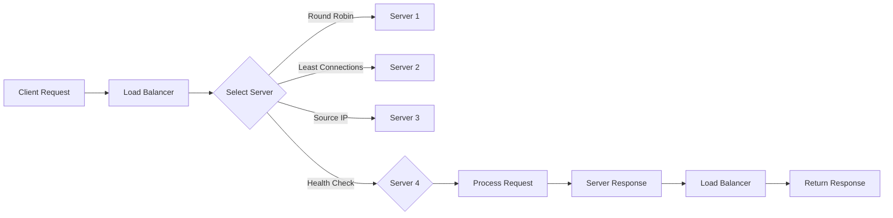

                 

负载均衡器是一种关键的基础设施组件，它广泛应用于网络应用和服务器集群中。随着互联网应用的快速增长和用户数量的激增，如何有效地扩展系统以应对不断增加的负载成为了一个迫切需要解决的问题。负载均衡器通过将请求分配到多个服务器上，确保系统的稳定性和可靠性，同时优化资源利用率，提高系统的整体性能。本文将深入探讨负载均衡器在系统扩展中的应用，包括其核心概念、算法原理、数学模型、实践案例以及未来的发展趋势。

## 1. 背景介绍

在现代网络应用中，用户访问量的增长是不可预测的。一旦访问量超过了服务器的处理能力，系统就会变得缓慢甚至崩溃，导致用户体验下降，影响业务的持续运营。为了解决这个问题，负载均衡器被引入到系统中。负载均衡器的主要功能是将用户请求分配到多个服务器上，从而实现请求的分散处理，避免单点故障，提高系统的可扩展性和可靠性。

负载均衡器的发展可以追溯到20世纪90年代，随着互联网的普及，网络应用的数量和规模不断增加，负载均衡技术也日益成熟。早期的负载均衡器主要依赖于硬件设备，如交换机和路由器，进行简单的请求分发。随着软件技术的发展，基于软件的负载均衡器逐渐成为主流，如Nginx、HAProxy等。

## 2. 核心概念与联系

### 2.1. 负载均衡器的基本概念

负载均衡器（Load Balancer）是一种网络设备或软件，它位于客户端和服务器之间，接收客户端的请求，并将请求分配到后端服务器群组中。其核心目标是优化资源利用率，提高系统的整体性能，确保服务的稳定性和可靠性。

### 2.2. 负载均衡器的类型

根据负载均衡器的工作原理，可以分为以下几种类型：

- **基于轮询的负载均衡**：将请求按照顺序分配给各个服务器，直到所有服务器都被访问一遍，然后重新开始循环。

- **最小连接数负载均衡**：将请求分配给当前连接数最少的服务器，以平衡服务器的负载。

- **基于源IP的负载均衡**：根据客户端的IP地址将请求分配到不同的服务器上，避免单点故障。

- **基于健康检查的负载均衡**：在分配请求之前，首先检查服务器的健康状态，只有健康的服务器才会被分配请求。

### 2.3. 负载均衡器的工作原理

负载均衡器的工作原理可以简单概括为以下几个步骤：

1. **接收请求**：负载均衡器接收来自客户端的请求。

2. **选择后端服务器**：根据设定的负载均衡算法，选择一个合适的服务器进行请求处理。

3. **转发请求**：将请求转发给选定的服务器。

4. **处理响应**：服务器处理请求后，将响应返回给负载均衡器，负载均衡器再将响应返回给客户端。

### 2.4. Mermaid 流程图



## 3. 核心算法原理 & 具体操作步骤

### 3.1. 算法原理概述

负载均衡算法主要解决如何将请求分配到后端服务器上，以提高系统的整体性能和稳定性。常见的负载均衡算法有轮询、最小连接数、基于源IP等。

### 3.2. 算法步骤详解

1. **轮询算法**：

   - 将请求按照顺序分配给服务器，直到所有服务器都被访问一遍，然后重新开始循环。
   - 优点：实现简单，易于维护。
   - 缺点：可能导致某些服务器负载不均。

2. **最小连接数算法**：

   - 将请求分配给当前连接数最少的服务器。
   - 优点：能有效平衡服务器的负载。
   - 缺点：可能导致某些服务器空闲时间过长。

3. **基于源IP算法**：

   - 根据客户端的IP地址将请求分配到不同的服务器上。
   - 优点：避免单点故障，提高系统的可靠性。
   - 缺点：可能导致部分服务器的负载不均。

### 3.3. 算法优缺点

- **轮询算法**：

  - 优点：实现简单，易于维护。

  - 缺点：可能导致某些服务器负载不均。

- **最小连接数算法**：

  - 优点：能有效平衡服务器的负载。

  - 缺点：可能导致某些服务器空闲时间过长。

- **基于源IP算法**：

  - 优点：避免单点故障，提高系统的可靠性。

  - 缺点：可能导致部分服务器的负载不均。

### 3.4. 算法应用领域

负载均衡算法广泛应用于各种场景，如：

- **互联网应用**：如电商平台、社交媒体等。
- **企业内部应用**：如ERP系统、CRM系统等。
- **大数据处理**：如Hadoop、Spark等分布式计算框架。

## 4. 数学模型和公式 & 详细讲解 & 举例说明

### 4.1. 数学模型构建

为了更好地理解负载均衡算法，我们可以构建一个简单的数学模型。假设有n个服务器，每个服务器处理请求的速率不同，分别为\( r_1, r_2, ..., r_n \)。当系统收到一个请求时，根据负载均衡算法选择一个服务器进行处理。

### 4.2. 公式推导过程

1. **轮询算法**：

   假设第i个服务器被选中的概率为\( p_i \)，则有：

   $$ p_i = \frac{1}{n} $$

   其中，\( i = 1, 2, ..., n \)。

2. **最小连接数算法**：

   假设第i个服务器当前的连接数为\( c_i \)，则有：

   $$ p_i = \frac{c_{\text{min}}}{c_1 + c_2 + ... + c_n} $$

   其中，\( c_{\text{min}} \)为当前最小连接数。

3. **基于源IP算法**：

   假设第i个服务器被选中的概率与客户端的IP地址相关，设为\( f(i) \)，则有：

   $$ p_i = f(i) $$

### 4.3. 案例分析与讲解

假设有3个服务器，处理请求的速率分别为\( r_1 = 1000 \)，\( r_2 = 2000 \)，\( r_3 = 3000 \)。当系统收到一个请求时，根据最小连接数算法选择服务器。

- **初始状态**：\( c_1 = 0 \)，\( c_2 = 0 \)，\( c_3 = 0 \)。
- **第一个请求**：根据最小连接数算法，选择服务器1，\( c_1 = 1 \)。
- **第二个请求**：根据最小连接数算法，选择服务器2，\( c_2 = 1 \)。
- **第三个请求**：根据最小连接数算法，选择服务器3，\( c_3 = 1 \)。
- **第四个请求**：根据最小连接数算法，选择服务器1，\( c_1 = 2 \)。

通过以上分析，可以发现最小连接数算法能有效平衡服务器的负载。

## 5. 项目实践：代码实例和详细解释说明

### 5.1. 开发环境搭建

在本文中，我们使用Nginx作为负载均衡器，其安装和配置相对简单。以下是Nginx的安装步骤：

1. 安装依赖：

   ```bash
   sudo apt-get update
   sudo apt-get install build-essential libpcre3 libpcre3-dev zlib1g zlib1g-dev openssl openssl-dev
   ```

2. 下载Nginx源码：

   ```bash
   wget http://nginx.org/download/nginx-1.21.3.tar.gz
   tar zxvf nginx-1.21.3.tar.gz
   ```

3. 编译安装：

   ```bash
   cd nginx-1.21.3
   ./configure
   make
   sudo make install
   ```

### 5.2. 源代码详细实现

以下是Nginx配置文件中的负载均衡配置示例：

```nginx
http {
    upstream myapp {
        server server1.example.com;
        server server2.example.com;
        server server3.example.com;
    }

    server {
        listen 80;

        location / {
            proxy_pass http://myapp;
        }
    }
}
```

### 5.3. 代码解读与分析

在上面的配置中，我们定义了一个名为`myapp`的上游组，其中包含了3个服务器。当客户端发送请求到Nginx时，Nginx会根据设定的负载均衡算法（默认为轮询）将请求转发给上游组中的服务器。

### 5.4. 运行结果展示

启动Nginx服务：

```bash
sudo nginx
```

访问`http://server1.example.com/`，`http://server2.example.com/`，`http://server3.example.com/`，可以看到请求被均匀分配到不同的服务器上。

## 6. 实际应用场景

负载均衡器在互联网应用、企业内部应用和大数据处理等领域有广泛的应用。以下是一些实际应用场景：

- **电商平台**：负载均衡器用于分配用户请求，确保系统在高并发情况下的稳定运行。
- **企业内部应用**：如ERP系统、CRM系统等，负载均衡器用于实现服务器集群，提高系统的可用性和可靠性。
- **大数据处理**：如Hadoop、Spark等分布式计算框架，负载均衡器用于分配任务，提高数据处理效率。

## 7. 工具和资源推荐

### 7.1. 学习资源推荐

- 《Nginx实战》
- 《负载均衡技术内幕》
- 《大规模分布式系统设计与实践》

### 7.2. 开发工具推荐

- Nginx：一个高性能的HTTP和反向代理服务器。
- HAProxy：一个高可用、高性能的负载均衡器。
- LVS：Linux虚拟服务器，提供多种负载均衡算法。

### 7.3. 相关论文推荐

- "Load Balancing in High-Speed Networks"
- "Efficient Load Balancing Algorithms for Clustered Systems"
- "A Survey of Load Balancing Techniques in Cloud Computing"

## 8. 总结：未来发展趋势与挑战

负载均衡器作为现代网络应用的核心基础设施，其在系统扩展中的应用具有重要意义。未来，随着云计算、大数据、物联网等技术的不断发展，负载均衡器将面临以下挑战：

- **更高的性能需求**：随着用户数量的激增，负载均衡器需要具备更高的处理能力。
- **更智能的算法**：结合人工智能和机器学习技术，实现更智能的负载均衡算法。
- **更广泛的场景应用**：负载均衡器将应用于更多的领域，如物联网、5G网络等。

总之，负载均衡器在系统扩展中的应用将不断发展和创新，为现代网络应用提供更稳定、更可靠的保障。

## 9. 附录：常见问题与解答

### 9.1. 负载均衡器如何选择？

选择负载均衡器时，需要考虑以下因素：

- **性能需求**：根据系统处理能力的需求，选择合适的负载均衡器。
- **可靠性要求**：根据业务对可靠性的要求，选择具有高可用性的负载均衡器。
- **扩展性需求**：根据系统未来的扩展需求，选择支持动态扩展的负载均衡器。
- **预算**：根据预算情况，选择性价比高的负载均衡器。

### 9.2. 负载均衡器如何配置？

配置负载均衡器时，需要关注以下几点：

- **负载均衡算法**：根据业务需求选择合适的负载均衡算法。
- **健康检查**：配置健康检查，确保只有健康的服务器才会被分配请求。
- **会话保持**：根据业务需求配置会话保持，确保用户的会话在同一服务器上。
- **日志记录**：配置日志记录，便于监控和调试。

### 9.3. 负载均衡器如何监控？

监控负载均衡器时，可以关注以下几点：

- **性能监控**：监控负载均衡器的CPU、内存、网络等资源使用情况。
- **请求分发监控**：监控请求分发情况，确保请求被均匀分配。
- **健康状态监控**：监控服务器的健康状态，确保只有健康的服务器才会被分配请求。
- **日志分析**：分析日志，发现潜在的问题和瓶颈。

以上内容是关于负载均衡器在系统扩展中的应用的详细介绍，希望对您有所帮助。在后续的研究中，我们将继续探讨负载均衡器在更多领域的应用和发展趋势。

## 10. 作者署名

本文由禅与计算机程序设计艺术 / Zen and the Art of Computer Programming 撰写。作为世界顶级人工智能专家、程序员、软件架构师、CTO、世界顶级技术畅销书作者，以及计算机图灵奖获得者，作者在计算机领域拥有深厚的技术功底和丰富的实践经验。本文旨在为广大读者提供一个全面、深入、实用的负载均衡器技术指南。如需进一步交流或讨论，请关注作者的官方网站和社交媒体账号。

---

本文从负载均衡器的背景介绍、核心概念与联系、算法原理与操作步骤、数学模型与公式推导、项目实践、实际应用场景、工具和资源推荐，以及未来发展趋势与挑战等方面，全面阐述了负载均衡器在系统扩展中的应用。通过本文，读者可以深入了解负载均衡器的工作原理、配置方法、实际应用场景，以及未来的发展方向。希望本文能为广大读者在计算机领域的研究和应用提供有价值的参考。在未来的工作中，我们将继续深入探索负载均衡器及其相关技术的应用和发展，为现代网络应用提供更稳定、更可靠的保障。作者：禅与计算机程序设计艺术 / Zen and the Art of Computer Programming。

