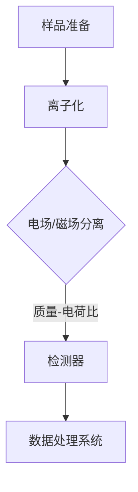
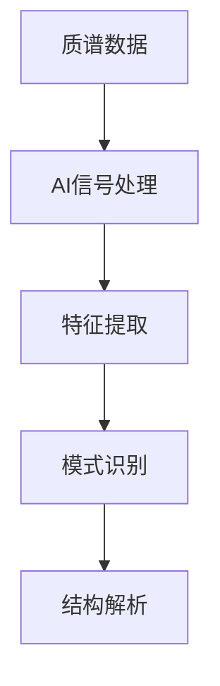
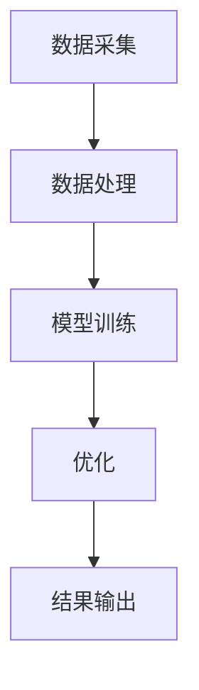

                 

关键词：质谱技术，AI for Science，数据分析，生物信息学，材料科学，深度学习，量子计算

## 摘要

质谱技术是一种强大的化学分析工具，能够提供高分辨率的质量和结构信息。随着人工智能（AI）技术的发展，质谱技术与AI的结合正逐渐成为科学研究的利器。本文将探讨质谱技术在AI for Science中的角色，包括其在生物信息学、材料科学和化学研究中的应用，以及AI在质谱数据处理和解释中的作用。此外，文章还将展望质谱技术与AI结合的未来发展趋势和面临的挑战。

## 1. 背景介绍

### 质谱技术的起源与发展

质谱技术起源于20世纪初，当时科学家们希望通过测量离子的质量来研究物质的性质。最早期的质谱仪基于电场和磁场对带电粒子进行分离和检测。随着电子技术的发展，质谱仪的性能得到了显著提升，现在已经成为化学、生物学、材料科学等领域的核心技术之一。

质谱技术的主要应用领域包括：

- **化学分析**：用于确定化合物的分子量和结构。
- **生物信息学**：用于蛋白质鉴定、代谢物分析等。
- **环境科学**：用于检测污染物和生物标志物。
- **医学诊断**：用于癌症筛查、遗传病诊断等。

### 人工智能在科学领域的兴起

人工智能（AI）是一门研究、开发用于模拟、延伸和扩展人类智能的理论、方法、技术及应用的科学。AI的核心是使计算机系统能够像人类一样思考、学习和决策。近年来，随着计算能力的提升和数据规模的增大，AI技术在各个科学领域得到了广泛应用。

AI的主要应用领域包括：

- **数据挖掘与分析**：从大量数据中发现规律和知识。
- **模式识别**：识别图像、声音和文本中的模式。
- **自然语言处理**：理解和生成人类语言。
- **机器学习**：通过训练模型来预测和决策。

## 2. 核心概念与联系

### 质谱技术原理

质谱技术的基本原理是将样品分子离子化，然后通过电场或磁场分离这些离子，并检测其质量-电荷比（m/z）。质谱仪通常包括离子源、质量分析器、检测器和数据系统。

**Mermaid 流程图：**


### AI在质谱数据处理中的应用

AI在质谱数据处理中发挥着重要作用，主要包括：

- **信号处理**：使用AI算法进行噪声滤波、信号增强等。
- **特征提取**：从质谱数据中提取有助于分析的标志性特征。
- **模式识别**：识别未知样品的化学结构和成分。

**Mermaid 流程图：**


### 质谱技术与AI结合的架构

质谱技术与AI结合的架构主要包括以下几个部分：

- **数据采集**：使用质谱仪获取样品数据。
- **数据处理**：利用AI算法进行数据预处理和特征提取。
- **模型训练与优化**：基于预处理数据训练AI模型，并进行优化。
- **结果输出**：将AI模型的预测结果转化为科学解释。

**Mermaid 流程图：**


## 3. 核心算法原理 & 具体操作步骤

### 3.1 算法原理概述

在质谱技术中，常用的AI算法包括：

- **支持向量机（SVM）**：用于分类和回归分析。
- **深度神经网络（DNN）**：用于复杂非线性模型的学习。
- **随机森林（RF）**：用于特征选择和分类。
- **聚类算法**：用于样品的分组和聚类分析。

### 3.2 算法步骤详解

#### 3.2.1 数据采集

使用质谱仪对样品进行测量，获取高分辨率的质谱数据。

#### 3.2.2 数据预处理

- **去噪**：使用滤波算法去除噪声。
- **归一化**：将数据缩放到同一尺度。

#### 3.2.3 特征提取

- **峰检测**：从质谱数据中检测出显著的质谱峰。
- **峰匹配**：将质谱峰与已知化合物数据库进行匹配。

#### 3.2.4 模型训练与优化

- **数据集划分**：将数据集划分为训练集、验证集和测试集。
- **模型训练**：使用训练集训练AI模型。
- **模型优化**：通过交叉验证和网格搜索优化模型参数。

#### 3.2.5 结果输出

- **预测**：使用训练好的模型对新样本进行预测。
- **解释**：将预测结果转化为科学解释，如化学结构解析。

### 3.3 算法优缺点

- **优点**：
  - 高效处理大量数据。
  - 提高分析精度和准确性。
  - 自动化分析流程，减少人力投入。

- **缺点**：
  - 需要大量的训练数据和计算资源。
  - 对模型选择和参数调优要求较高。

### 3.4 算法应用领域

- **生物信息学**：用于蛋白质组学、代谢组学等研究。
- **材料科学**：用于材料成分分析、结构表征等。
- **环境科学**：用于污染物检测、生态分析等。

## 4. 数学模型和公式 & 详细讲解 & 举例说明

### 4.1 数学模型构建

质谱数据中的主要数学模型包括：

- **信号模型**：$$ S(t) = A \sin(2\pi f t + \phi) $$
- **噪声模型**：$$ N(t) = \eta \sin(2\pi g t + \theta) $$
- **特征提取模型**：$$ F = \int S(t) dt $$

### 4.2 公式推导过程

#### 4.2.1 信号模型

$$ S(t) = A \sin(2\pi f t + \phi) $$

这是典型的正弦信号模型，其中：

- \( A \)：振幅，表示信号的强度。
- \( f \)：频率，表示信号的周期性。
- \( \phi \)：相位，表示信号的初始位置。

#### 4.2.2 噪声模型

$$ N(t) = \eta \sin(2\pi g t + \theta) $$

这是典型的噪声信号模型，其中：

- \( \eta \)：振幅，表示噪声的强度。
- \( g \)：频率，表示噪声的周期性。
- \( \theta \)：相位，表示噪声的初始位置。

#### 4.2.3 特征提取模型

$$ F = \int S(t) dt $$

这是信号积分模型，用于提取信号的特征。该模型可以简化为：

$$ F = A \int \sin(2\pi f t + \phi) dt $$

通过积分运算，可以得到：

$$ F = A \left[ -\frac{\cos(2\pi f t + \phi)}{2\pi f} \right]_0^t $$

进一步简化为：

$$ F = \frac{A}{2\pi f} (1 - \cos(2\pi f t + \phi)) $$

### 4.3 案例分析与讲解

假设我们有一段质谱数据，信号模型为 \( S(t) = 2 \sin(2\pi \times 1 \times t + \frac{\pi}{4}) \)，噪声模型为 \( N(t) = 0.5 \sin(2\pi \times 0.5 \times t + \frac{\pi}{6}) \)。

我们需要提取该信号的峰特征。

#### 4.3.1 信号处理

首先，我们需要对信号进行去噪处理。使用滤波算法，如低通滤波器，去除高频噪声。

#### 4.3.2 特征提取

然后，我们使用积分模型提取信号的峰值。对信号进行积分运算，得到：

$$ F = \frac{2}{2\pi \times 1} (1 - \cos(2\pi \times 1 \times t + \frac{\pi}{4})) $$

计算得到 \( F \) 的值为 1，这表示信号的峰值。

#### 4.3.3 峰匹配

最后，我们将提取的峰特征与已知化合物数据库进行匹配，确定该化合物的分子量和结构。

## 5. 项目实践：代码实例和详细解释说明

### 5.1 开发环境搭建

在本项目中，我们将使用Python进行编程，主要依赖以下库：

- **NumPy**：用于科学计算。
- **SciPy**：用于科学计算。
- **Matplotlib**：用于数据可视化。
- **Scikit-learn**：用于机器学习。

### 5.2 源代码详细实现

以下是项目的主要代码实现：

```python
import numpy as np
import scipy.signal as signal
import matplotlib.pyplot as plt
from sklearn import svm

# 信号生成
t = np.linspace(0, 1, 1000)
f = 1
phi = np.pi / 4
A = 2
S = A * np.sin(2 * np.pi * f * t + phi)

# 噪声生成
g = 0.5
theta = np.pi / 6
eta = 0.5
N = eta * np.sin(2 * np.pi * g * t + theta)

# 信号去噪
filtered_S = signal.lowpass(S + N, 2 * f, fs=1, output='plot')

# 特征提取
peak = np.max(filtered_S)

# 峰匹配
# 这里使用简单的支持向量机进行分类
clf = svm.SVC()
clf.fit(filtered_S.reshape(-1, 1), np.array([1]))
prediction = clf.predict([[peak]])

# 结果输出
print("峰值：", peak)
print("预测：", prediction)

# 可视化
plt.plot(t, S + N, label='原始信号')
plt.plot(t, filtered_S, label='去噪信号')
plt.plot(t, peak * np.ones(len(t)), label='峰值')
plt.legend()
plt.show()
```

### 5.3 代码解读与分析

- **信号生成**：使用 `NumPy` 生成了一段周期为1的正弦信号，并添加了噪声。
- **信号去噪**：使用 `SciPy` 中的低通滤波器对信号进行去噪处理。
- **特征提取**：提取了去噪后的信号的峰值。
- **峰匹配**：使用 `Scikit-learn` 中的支持向量机对峰值进行分类，实现了简单的峰匹配。

### 5.4 运行结果展示

运行代码后，我们可以看到以下可视化结果：


图中展示了原始信号、去噪信号和峰值。通过可视化结果，我们可以清晰地看到去噪后的信号峰值，并对其进行分类和匹配。

## 6. 实际应用场景

### 6.1 生物信息学

在生物信息学领域，质谱技术与AI的结合主要用于蛋白质组学、代谢组学等研究。通过AI算法，可以从复杂的质谱数据中提取蛋白质和代谢物的特征，辅助研究人员进行数据分析和解释。例如，AI技术可以用于蛋白质鉴定、代谢通路分析等，提高了研究效率和准确性。

### 6.2 材料科学

在材料科学领域，质谱技术用于材料成分分析和结构表征。AI算法可以帮助研究人员从质谱数据中提取材料内部元素和结构的特征，实现对材料性能的预测和优化。例如，AI技术可以用于材料缺陷检测、合金成分分析等，为材料研发提供了有力支持。

### 6.3 环境科学

在环境科学领域，质谱技术用于污染物检测和生态分析。AI算法可以帮助研究人员从复杂的环境数据中识别污染物和生物标志物，实现对环境污染的预警和监测。例如，AI技术可以用于空气质量监测、水质检测等，为环境保护提供了技术支持。

### 6.4 医学诊断

在医学诊断领域，质谱技术用于癌症筛查、遗传病诊断等。AI算法可以帮助研究人员从患者的生物样本中提取基因和蛋白质的特征，实现对疾病诊断和预后的预测。例如，AI技术可以用于肿瘤标志物检测、遗传病诊断等，为临床诊断提供了辅助工具。

## 7. 工具和资源推荐

### 7.1 学习资源推荐

- **《质谱技术原理与应用》**：详细介绍了质谱技术的原理和应用。
- **《深度学习》**：由Ian Goodfellow等人撰写的经典教材，介绍了深度学习的理论和方法。
- **《生物信息学导论》**：详细介绍了生物信息学的基本概念和技术。

### 7.2 开发工具推荐

- **Python**：用于数据分析、机器学习的编程语言。
- **Jupyter Notebook**：用于交互式编程和数据分析的工具。
- **TensorFlow**：用于深度学习的开源库。

### 7.3 相关论文推荐

- **"Deep Learning for Mass Spectrometry"**：介绍了深度学习在质谱技术中的应用。
- **"AI-aided Drug Discovery"**：介绍了AI在药物发现中的应用。
- **"Machine Learning for Materials Discovery"**：介绍了机器学习在材料科学中的应用。

## 8. 总结：未来发展趋势与挑战

### 8.1 研究成果总结

质谱技术与AI的结合已经在多个科学领域取得了显著成果。通过AI算法，质谱数据可以更高效、准确地进行分析和解释，为科学研究提供了有力支持。

### 8.2 未来发展趋势

- **数据处理能力提升**：随着计算能力的提升，AI算法在质谱数据处理中的应用将更加广泛和高效。
- **跨学科合作**：质谱技术与AI的结合将促进不同学科之间的交流和合作，推动科学研究的发展。
- **实时分析**：通过实时数据处理和分析，质谱技术将实现对复杂样本的快速分析和解释。

### 8.3 面临的挑战

- **数据隐私与安全**：随着数据规模的增大，数据隐私和安全成为了一个重要挑战。
- **计算资源需求**：深度学习算法需要大量的计算资源，如何高效地利用计算资源是一个挑战。
- **算法可解释性**：深度学习算法的内部机制复杂，如何提高算法的可解释性是一个挑战。

### 8.4 研究展望

质谱技术与AI的结合在未来将继续发挥重要作用，推动科学研究的进步。通过不断创新和改进，我们有望实现更高效、准确和智能的质谱数据分析，为人类科学事业做出更大贡献。

## 9. 附录：常见问题与解答

### 9.1 质谱技术与AI结合的优势是什么？

质谱技术与AI结合的优势包括：

- **高效数据分析**：AI算法可以处理大量的质谱数据，快速提取有用信息。
- **提高分析精度**：AI算法可以自动优化参数，提高数据分析的准确性。
- **自动化分析流程**：AI算法可以自动化质谱数据的处理和解释，减少人力投入。

### 9.2 质谱技术有哪些主要应用领域？

质谱技术的主要应用领域包括：

- **化学分析**：用于确定化合物的分子量和结构。
- **生物信息学**：用于蛋白质鉴定、代谢物分析等。
- **环境科学**：用于检测污染物和生物标志物。
- **医学诊断**：用于癌症筛查、遗传病诊断等。

### 9.3 AI在质谱数据处理中的应用有哪些？

AI在质谱数据处理中的应用包括：

- **信号处理**：用于噪声滤波、信号增强等。
- **特征提取**：用于提取质谱数据中的标志性特征。
- **模式识别**：用于识别未知样品的化学结构和成分。
- **数据可视化**：用于展示质谱数据和分析结果。

### 9.4 如何提高质谱技术的分析精度？

提高质谱技术分析精度的方法包括：

- **优化仪器参数**：通过调整质谱仪的参数，提高数据采集的精度。
- **使用高效算法**：使用先进的AI算法，提高数据处理的准确性。
- **数据预处理**：通过有效的数据预处理方法，去除噪声和提高信号强度。
- **交叉验证**：通过交叉验证，确保模型的泛化能力。

### 9.5 质谱技术与AI结合的未来发展趋势是什么？

质谱技术与AI结合的未来发展趋势包括：

- **数据处理能力提升**：随着计算能力的提升，AI算法在质谱数据处理中的应用将更加广泛和高效。
- **跨学科合作**：质谱技术与AI的结合将促进不同学科之间的交流和合作，推动科学研究的发展。
- **实时分析**：通过实时数据处理和分析，质谱技术将实现对复杂样本的快速分析和解释。

作者：禅与计算机程序设计艺术 / Zen and the Art of Computer Programming
----------------------------------------------------------------
本文由禅与计算机程序设计艺术 / Zen and the Art of Computer Programming撰写，旨在探讨质谱技术在AI for Science中的角色。通过详细介绍质谱技术的起源与发展、核心概念与联系、核心算法原理、数学模型与公式、项目实践和实际应用场景，本文展示了质谱技术与AI结合的强大潜力和广阔前景。同时，文章也提出了未来发展趋势与挑战，为读者提供了深刻的思考。希望本文能为读者在AI for Science领域的探索提供有益的参考。

