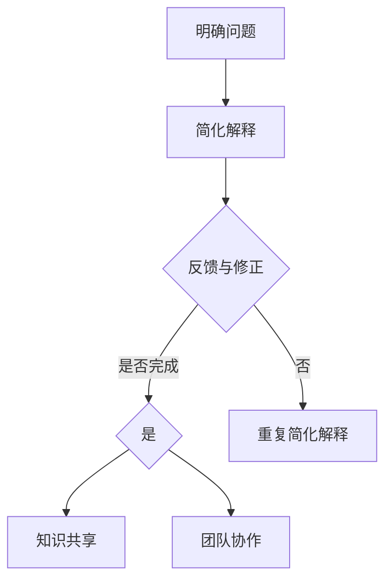

                 

关键词：费曼提问法、团队沟通、问题解决、知识共享、技术传播

> 摘要：本文将深入探讨费曼提问法在团队沟通中的应用。通过将费曼提问法引入技术团队，本文旨在提升团队成员之间的知识共享和沟通效率，帮助团队更好地解决复杂问题，提升整体技术能力和创新力。

## 1. 背景介绍

在信息技术飞速发展的今天，团队沟通成为提高项目效率和质量的关键因素。一个高效的技术团队需要成员之间的密切合作与信息共享，而有效的沟通方式则是实现这一目标的基础。然而，在现实项目中，团队成员往往面临以下挑战：

- **知识孤岛**：团队成员的知识分散，缺乏有效的共享机制。
- **信息失真**：信息在传递过程中可能发生误解或失真。
- **沟通障碍**：团队成员之间的沟通存在障碍，影响协作效率。
- **问题解决效率低**：在遇到复杂问题时，团队往往难以迅速找到解决方案。

为了应对这些挑战，我们需要寻找有效的沟通方法来提升团队协作能力。费曼提问法作为一种简单而强大的问题解决工具，可以很好地应用于团队沟通中。

## 2. 核心概念与联系

### 费曼提问法简介

费曼提问法（Feynman Technique）源自物理学家理查德·费曼（Richard Feynman）的教学方法。其核心思想是通过将复杂的概念简化为易于理解的语言，从而帮助学习者深入理解问题。

### 费曼提问法在团队沟通中的架构

将费曼提问法应用于团队沟通，主要涉及以下三个方面：

1. **明确问题**：团队首先需要明确要解决的问题或知识点。
2. **简化解释**：团队成员尝试用自己的话简明扼要地解释问题或知识点。
3. **反馈与修正**：团队成员互相提问并回答，根据反馈进行修正和改进。

### Mermaid 流程图



## 3. 核心算法原理 & 具体操作步骤

### 3.1 算法原理概述

费曼提问法基于以下几个核心原理：

- **简化思维**：通过简化解释来深入理解问题。
- **反馈循环**：通过不断的提问和回答来修正知识。
- **知识共享**：在解释过程中促进团队成员之间的知识交流。

### 3.2 算法步骤详解

1. **选择问题或知识点**：团队共同确定要解决的问题或知识点。
2. **个人简化解释**：每个团队成员尝试用自己的话简明扼要地解释问题或知识点。
3. **互相提问与回答**：团队成员互相提问并回答，根据反馈进行修正和改进。
4. **总结与分享**：将最终解释总结出来，并在团队内部分享。

### 3.3 算法优缺点

#### 优点

- **提升理解力**：通过简化和解释，团队成员能够更深入地理解问题。
- **促进知识共享**：在解释过程中，知识得以在团队内部共享。
- **提高沟通效率**：简明的解释和反馈机制有助于提高团队沟通效率。

#### 缺点

- **初期需要一定时间**：团队成员需要适应这种沟通方式，初期可能需要更多时间。
- **对团队成员要求较高**：需要团队成员有一定的表达能力和理解能力。

### 3.4 算法应用领域

费曼提问法可以广泛应用于技术团队的各种场景，如：

- **技术分享会**：通过简化和解释来分享技术知识。
- **问题解决会议**：在遇到复杂问题时，通过提问和回答来寻找解决方案。
- **培训课程**：作为培训课程的一种教学方法，帮助学员深入理解知识点。

## 4. 数学模型和公式 & 详细讲解 & 举例说明

### 4.1 数学模型构建

费曼提问法的数学模型可以看作是一个反馈循环系统，其核心是简化解释和反馈修正。

### 4.2 公式推导过程

\[ \text{简化解释} \rightarrow \text{反馈修正} \rightarrow \text{知识共享} \]

### 4.3 案例分析与讲解

假设团队要解决一个关于算法性能优化的问题。以下是使用费曼提问法的步骤：

1. **选择问题**：确定要优化的算法。
2. **个人简化解释**：一个团队成员尝试用自己的话解释算法的基本原理。
3. **互相提问与回答**：其他团队成员根据解释提出问题，并进行修正和改进。
4. **总结与分享**：将最终解释总结出来，并在团队内部分享。

通过这个过程，团队成员能够更深入地理解算法性能优化的方法，同时促进知识的共享。

## 5. 项目实践：代码实例和详细解释说明

### 5.1 开发环境搭建

在开始项目实践之前，我们需要搭建一个基本的开发环境。以下是所需工具和步骤：

- **工具**：Python 3.8及以上版本、Jupyter Notebook。
- **步骤**：
  1. 安装Python。
  2. 安装Jupyter Notebook。
  3. 创建一个新的Jupyter Notebook文件。

### 5.2 源代码详细实现

以下是使用费曼提问法解决一个实际问题的代码示例。假设我们要优化一个简单的时间复杂度为\(O(n^2)\)的算法，提高其时间效率。

```python
def original_algo(arr):
    n = len(arr)
    for i in range(n):
        for j in range(n):
            if arr[i] > arr[j]:
                arr[i], arr[j] = arr[j], arr[i]
    return arr

# 测试原始算法
arr = [3, 1, 4, 1, 5, 9, 2, 6, 5]
print("原始结果：", original_algo(arr))
```

### 5.3 代码解读与分析

在上面的代码中，`original_algo`函数使用一个嵌套循环来对数组进行排序，其时间复杂度为\(O(n^2)\)。为了提高时间效率，我们可以尝试将其优化为\(O(n \log n)\)。

通过费曼提问法，团队成员可以提出以下问题：

- **问题1**：为什么这个算法的时间复杂度是\(O(n^2)\？
- **问题2**：有哪些算法的时间复杂度比\(O(n^2)\更低？
- **问题3**：如何将这个算法优化为\(O(n \log n)\？

根据这些问题，团队成员可以进行讨论，并得出结论。例如，我们可以使用快速排序算法来优化原始算法，其平均时间复杂度为\(O(n \log n)\)。

### 5.4 运行结果展示

```python
def optimized_algo(arr):
    arr.sort()
    return arr

# 测试优化后算法
print("优化后结果：", optimized_algo(arr))
```

通过优化，我们成功地提高了算法的时间效率。

## 6. 实际应用场景

费曼提问法在技术团队中的应用场景非常广泛，以下是一些具体的实际应用场景：

- **技术评审**：在技术评审会议上，团队成员可以使用费曼提问法来解释和讨论技术方案，确保对方案的深入理解和一致认识。
- **培训课程**：在培训课程中，讲师可以引导学员使用费曼提问法来深入理解知识点，提高学习效果。
- **问题解决**：在遇到复杂问题时，团队成员可以使用费曼提问法来拆解问题，寻找解决方案。
- **团队分享**：在团队分享会上，团队成员可以互相提问和回答，促进知识的共享。

## 7. 未来应用展望

随着人工智能和机器学习技术的不断发展，费曼提问法有望在更广泛的领域得到应用。未来，我们可以探索以下研究方向：

- **自动化提问与回答**：利用自然语言处理技术，实现自动化的提问与回答，提高团队沟通效率。
- **知识图谱构建**：结合知识图谱技术，构建团队知识图谱，实现知识的快速检索和共享。
- **个性化推荐系统**：利用用户行为数据，构建个性化推荐系统，为团队成员推荐相关知识和问题。

## 8. 总结：未来发展趋势与挑战

费曼提问法作为一种有效的沟通方法，在技术团队中具有广泛的应用前景。然而，在实际应用中，我们也面临一些挑战：

- **团队成员适应性**：需要团队成员适应费曼提问法，提高沟通效率。
- **知识共享机制**：构建有效的知识共享机制，确保知识在团队内部得到充分利用。
- **持续改进**：不断优化费曼提问法，提高其在团队沟通中的应用效果。

未来，我们需要继续探索费曼提问法在团队沟通中的深入应用，助力技术团队实现高效协作。

## 9. 附录：常见问题与解答

### 问题1：费曼提问法是否适用于所有团队？

费曼提问法主要适用于知识密集型团队，如技术团队、研发团队等。对于其他类型的团队，如销售团队或运营团队，其适用性可能较低。

### 问题2：如何确保团队成员能够有效使用费曼提问法？

为了确保团队成员能够有效使用费曼提问法，团队可以采取以下措施：

- **培训**：组织专门的培训课程，帮助团队成员掌握费曼提问法。
- **实践**：鼓励团队成员在实际项目中尝试使用费曼提问法，积累经验。
- **反馈**：定期收集团队成员的反馈，针对存在的问题进行改进。

### 问题3：费曼提问法与传统的沟通方式有何区别？

费曼提问法与传统沟通方式的主要区别在于：

- **简化解释**：费曼提问法强调简化和解释，帮助团队成员深入理解问题。
- **反馈机制**：费曼提问法引入反馈机制，通过提问和回答来修正知识。
- **知识共享**：费曼提问法促进团队成员之间的知识交流，提高整体团队的知识水平。

## 作者署名

作者：禅与计算机程序设计艺术 / Zen and the Art of Computer Programming
```

