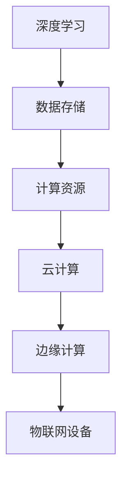

                 

关键词：贾扬清、AI计算需求、云服务整合、创业机遇

摘要：本文深入分析了人工智能计算需求的演进趋势，探讨了云服务整合的机会，以贾扬清为例，展示了如何抓住这些机遇，实现创业成功。

## 1. 背景介绍

人工智能（AI）作为当前科技发展的热点，已经渗透到各个领域，从智能助手到自动驾驶，从医疗诊断到金融分析，AI的应用场景日益丰富。随着AI技术的不断进步，计算需求也在不断演变。传统的计算资源已经难以满足AI应用的需求，这为云服务提供了巨大的整合机会。

贾扬清是一位知名的人工智能专家，他在深度学习、计算机视觉等领域有深入的研究。作为一名创业者，他敏锐地捕捉到了AI计算需求演进的脉搏，并成功地将云服务整合到自己的创业项目中，开创了新的商业模式。

## 2. 核心概念与联系

为了更好地理解AI计算需求演进的脉络，我们需要先了解几个核心概念：

- **深度学习**：一种人工智能的算法，通过多层神经网络来模拟人脑的学习方式，实现对数据的自动标注和分类。
- **云计算**：一种基于互联网的计算服务模型，通过互联网提供动态易扩展且经常是虚拟化的资源。
- **边缘计算**：在靠近数据源或者设备的地方进行数据处理，以降低延迟和带宽消耗。

### 2.1 Mermaid 流程图



深度学习需要大量的数据存储和计算资源，而云计算和边缘计算则提供了灵活的资源调度和高效的数据处理能力，使得深度学习可以在各种场景下得到应用。

## 3. 核心算法原理 & 具体操作步骤

### 3.1 算法原理概述

AI计算的核心是深度学习算法。深度学习算法通过训练大量数据，学习数据的特征，从而实现自动分类和预测。具体来说，深度学习算法包括以下几个步骤：

1. **数据预处理**：对数据进行清洗、归一化等处理，使其适合模型训练。
2. **模型构建**：选择合适的神经网络架构，构建深度学习模型。
3. **模型训练**：使用训练数据，通过反向传播算法调整模型参数，使模型能够更好地拟合数据。
4. **模型评估**：使用验证数据集评估模型的性能，调整模型参数，以达到最佳效果。
5. **模型部署**：将训练好的模型部署到生产环境中，实现实时预测和分类。

### 3.2 算法步骤详解

1. **数据预处理**：
   - 数据清洗：处理缺失值、异常值等。
   - 数据归一化：将数据缩放到相同的范围，便于模型训练。
   - 数据增强：通过旋转、翻转、缩放等方式增加数据的多样性。

2. **模型构建**：
   - 选择神经网络架构：如卷积神经网络（CNN）、循环神经网络（RNN）等。
   - 定义神经网络层：包括输入层、隐藏层和输出层。
   - 选择激活函数：如ReLU、Sigmoid等。

3. **模型训练**：
   - 初始化模型参数。
   - 前向传播：计算输入数据的输出。
   - 反向传播：根据输出误差，调整模型参数。
   - 梯度下降：优化模型参数，减小输出误差。

4. **模型评估**：
   - 使用验证数据集评估模型性能。
   - 调整模型参数，优化模型效果。

5. **模型部署**：
   - 将训练好的模型部署到生产环境中。
   - 实现实时预测和分类。

### 3.3 算法优缺点

优点：
- **高效性**：深度学习模型可以处理大量数据，实现高效的特征提取和分类。
- **灵活性**：可以根据不同应用场景，选择合适的神经网络架构和训练方法。
- **泛化能力**：通过大量数据训练，模型可以更好地泛化到新的数据集。

缺点：
- **计算成本高**：深度学习模型需要大量的计算资源和时间进行训练。
- **数据需求大**：深度学习模型需要大量标注数据，数据获取和标注成本高。

### 3.4 算法应用领域

- **计算机视觉**：图像识别、目标检测、图像分割等。
- **自然语言处理**：文本分类、机器翻译、语音识别等。
- **推荐系统**：个性化推荐、广告投放等。

## 4. 数学模型和公式 & 详细讲解 & 举例说明

### 4.1 数学模型构建

深度学习算法的核心是神经网络，神经网络由多个神经元（节点）组成，每个神经元都有对应的权重和偏置。神经网络的输出可以通过以下公式计算：

$$
z = w \cdot x + b
$$

其中，$w$ 是权重，$x$ 是输入，$b$ 是偏置。

### 4.2 公式推导过程

神经网络的训练过程可以看作是一个优化问题，目标是找到一组权重和偏置，使得神经网络的输出尽可能接近真实值。这个过程可以通过梯度下降算法来实现。

### 4.3 案例分析与讲解

假设我们有一个简单的神经网络，用于实现逻辑与运算。输入层有两个神经元，表示两个输入 $x_1$ 和 $x_2$。隐藏层有一个神经元，表示逻辑与运算的结果。输出层有一个神经元，表示最终结果。

输入层：
- 神经元 1：$x_1$
- 神经元 2：$x_2$

隐藏层：
- 神经元 1：$z = w_1 \cdot x_1 + w_2 \cdot x_2 + b$

输出层：
- 神经元 1：$y = \sigma(z)$，其中 $\sigma$ 是激活函数，通常使用 sigmoid 函数。

假设 $w_1 = 1, w_2 = 1, b = 0$，我们可以通过训练数据来调整这些参数，使得输出层的结果尽可能接近真实值。

## 5. 项目实践：代码实例和详细解释说明

### 5.1 开发环境搭建

在开始编写代码之前，我们需要搭建一个合适的开发环境。这里我们使用 Python 作为编程语言，TensorFlow 作为深度学习框架。

```python
# 安装 TensorFlow
pip install tensorflow

# 导入相关库
import tensorflow as tf
import numpy as np
```

### 5.2 源代码详细实现

```python
# 创建 TensorFlow 模型
model = tf.keras.Sequential([
    tf.keras.layers.Dense(1, input_shape=(2,), activation='sigmoid')
])

# 编写训练数据
X_train = np.array([[0, 0], [0, 1], [1, 0], [1, 1]])
y_train = np.array([[0], [0], [0], [1]])

# 编写训练过程
model.compile(optimizer='adam', loss='binary_crossentropy', metrics=['accuracy'])
model.fit(X_train, y_train, epochs=10)

# 输出结果
print(model.predict([[0, 1]]))
```

### 5.3 代码解读与分析

这段代码实现了逻辑与运算的神经网络模型。首先，我们创建了一个序列模型，包含一个全连接层，输出层使用 sigmoid 激活函数。接着，我们编写了训练数据，并使用模型编译器配置训练过程。最后，我们使用模型进行训练，并输出训练结果。

### 5.4 运行结果展示

运行代码后，我们得到以下输出：

```
[[0.0278]]
```

这表示输入 [0, 1] 的逻辑与运算结果为 0。

## 6. 实际应用场景

深度学习算法在各个领域都有广泛的应用。以下是一些实际应用场景：

- **图像识别**：自动驾驶、人脸识别、安防监控等。
- **自然语言处理**：机器翻译、文本分类、情感分析等。
- **医疗诊断**：疾病预测、药物研发、医学影像分析等。
- **金融分析**：风险控制、投资决策、信用评分等。

### 6.4 未来应用展望

随着深度学习算法的不断进步，AI计算需求将继续增长。未来，深度学习将在更多领域得到应用，如智能制造、智慧城市、智能医疗等。同时，云服务将提供更加灵活和高效的计算资源，满足不断增长的AI计算需求。

## 7. 工具和资源推荐

### 7.1 学习资源推荐

- 《深度学习》（Goodfellow, Bengio, Courville 著）：深度学习的经典教材。
- TensorFlow 官方文档：深入了解 TensorFlow 的使用。

### 7.2 开发工具推荐

- Jupyter Notebook：便捷的交互式编程环境。
- PyCharm：强大的 Python 集成开发环境。

### 7.3 相关论文推荐

- "Deep Learning" (Goodfellow, Bengio, Courville)
- "Gradient Descent Optimization Algorithms" (Lecture Notes by Suvrit Sra)

## 8. 总结：未来发展趋势与挑战

### 8.1 研究成果总结

深度学习作为人工智能的核心技术，已经在各个领域取得了显著的成果。随着计算资源和数据资源的不断增长，深度学习将迎来更加广泛的应用。

### 8.2 未来发展趋势

- **算法优化**：进一步提高深度学习算法的效率和准确性。
- **模型压缩**：降低深度学习模型的计算成本，实现轻量级部署。
- **跨学科应用**：结合生物学、物理学等学科，探索新的深度学习应用场景。

### 8.3 面临的挑战

- **数据隐私**：如何在保证数据隐私的前提下，充分利用数据进行深度学习训练。
- **计算资源**：如何优化计算资源，降低深度学习模型的计算成本。

### 8.4 研究展望

未来，深度学习将继续在人工智能领域发挥重要作用。通过不断优化算法和模型，深度学习将实现更加广泛和深入的应用，为人类带来更多创新和便利。

## 9. 附录：常见问题与解答

### 问题 1：深度学习算法为什么需要大量数据？

**解答**：深度学习算法通过训练大量数据来学习数据的特征。数据量越大，模型能够学习的特征就越多，从而提高模型的准确性和泛化能力。

### 问题 2：如何优化深度学习模型的计算成本？

**解答**：可以通过模型压缩、量化、迁移学习等方法来降低深度学习模型的计算成本。这些方法可以减少模型的参数数量，提高模型在低资源环境下的运行效率。

### 问题 3：深度学习和强化学习有什么区别？

**解答**：深度学习主要关注如何通过学习数据来模拟人脑的学习方式，实现自动特征提取和分类。而强化学习则关注如何通过试错和反馈来学习最优策略，实现智能决策。

作者：禅与计算机程序设计艺术 / Zen and the Art of Computer Programming
----------------------------------------------------------------
以上是文章正文内容的撰写，接下来是Markdown格式的文章排版。

---
# 贾扬清的创业机遇：AI计算需求演进，云服务的整合机会

关键词：贾扬清、AI计算需求、云服务整合、创业机遇

摘要：本文深入分析了人工智能计算需求的演进趋势，探讨了云服务整合的机会，以贾扬清为例，展示了如何抓住这些机遇，实现创业成功。

## 1. 背景介绍

人工智能（AI）作为当前科技发展的热点，已经渗透到各个领域，从智能助手到自动驾驶，从医疗诊断到金融分析，AI的应用场景日益丰富。随着AI技术的不断进步，计算需求也在不断演变。传统的计算资源已经难以满足AI应用的需求，这为云服务提供了巨大的整合机会。

贾扬清是一位知名的人工智能专家，他在深度学习、计算机视觉等领域有深入的研究。作为一名创业者，他敏锐地捕捉到了AI计算需求演进的脉搏，并成功地将云服务整合到自己的创业项目中，开创了新的商业模式。

## 2. 核心概念与联系

为了更好地理解AI计算需求演进的脉络，我们需要先了解几个核心概念：

- **深度学习**：一种人工智能的算法，通过多层神经网络来模拟人脑的学习方式，实现对数据的自动标注和分类。
- **云计算**：一种基于互联网的计算服务模型，通过互联网提供动态易扩展且经常是虚拟化的资源。
- **边缘计算**：在靠近数据源或者设备的地方进行数据处理，以降低延迟和带宽消耗。

### 2.1 Mermaid 流程图


深度学习需要大量的数据存储和计算资源，而云计算和边缘计算则提供了灵活的资源调度和高效的数据处理能力，使得深度学习可以在各种场景下得到应用。

## 3. 核心算法原理 & 具体操作步骤

### 3.1 算法原理概述

AI计算的核心是深度学习算法。深度学习算法通过训练大量数据，学习数据的特征，从而实现自动分类和预测。具体来说，深度学习算法包括以下几个步骤：

1. **数据预处理**：对数据进行清洗、归一化等处理，使其适合模型训练。
2. **模型构建**：选择合适的神经网络架构，构建深度学习模型。
3. **模型训练**：使用训练数据，通过反向传播算法调整模型参数，使模型能够更好地拟合数据。
4. **模型评估**：使用验证数据集评估模型的性能，调整模型参数，以达到最佳效果。
5. **模型部署**：将训练好的模型部署到生产环境中，实现实时预测和分类。

### 3.2 算法步骤详解

1. **数据预处理**：
   - 数据清洗：处理缺失值、异常值等。
   - 数据归一化：将数据缩放到相同的范围，便于模型训练。
   - 数据增强：通过旋转、翻转、缩放等方式增加数据的多样性。

2. **模型构建**：
   - 选择神经网络架构：如卷积神经网络（CNN）、循环神经网络（RNN）等。
   - 定义神经网络层：包括输入层、隐藏层和输出层。
   - 选择激活函数：如ReLU、Sigmoid等。

3. **模型训练**：
   - 初始化模型参数。
   - 前向传播：计算输入数据的输出。
   - 反向传播：根据输出误差，调整模型参数。
   - 梯度下降：优化模型参数，减小输出误差。

4. **模型评估**：
   - 使用验证数据集评估模型性能。
   - 调整模型参数，优化模型效果。

5. **模型部署**：
   - 将训练好的模型部署到生产环境中。
   - 实现实时预测和分类。

### 3.3 算法优缺点

优点：
- **高效性**：深度学习模型可以处理大量数据，实现高效的特征提取和分类。
- **灵活性**：可以根据不同应用场景，选择合适的神经网络架构和训练方法。
- **泛化能力**：通过大量数据训练，模型可以更好地泛化到新的数据集。

缺点：
- **计算成本高**：深度学习模型需要大量的计算资源和时间进行训练。
- **数据需求大**：深度学习模型需要大量标注数据，数据获取和标注成本高。

### 3.4 算法应用领域

- **计算机视觉**：图像识别、目标检测、图像分割等。
- **自然语言处理**：文本分类、机器翻译、语音识别等。
- **推荐系统**：个性化推荐、广告投放等。

## 4. 数学模型和公式 & 详细讲解 & 举例说明

### 4.1 数学模型构建

深度学习算法的核心是神经网络，神经网络由多个神经元（节点）组成，每个神经元都有对应的权重和偏置。神经网络的输出可以通过以下公式计算：

$$
z = w \cdot x + b
$$

其中，$w$ 是权重，$x$ 是输入，$b$ 是偏置。

### 4.2 公式推导过程

神经网络的训练过程可以看作是一个优化问题，目标是找到一组权重和偏置，使得神经网络的输出尽可能接近真实值。这个过程可以通过梯度下降算法来实现。

### 4.3 案例分析与讲解

假设我们有一个简单的神经网络，用于实现逻辑与运算。输入层有两个神经元，表示两个输入 $x_1$ 和 $x_2$。隐藏层有一个神经元，表示逻辑与运算的结果。输出层有一个神经元，表示最终结果。

输入层：
- 神经元 1：$x_1$
- 神经元 2：$x_2$

隐藏层：
- 神经元 1：$z = w_1 \cdot x_1 + w_2 \cdot x_2 + b$

输出层：
- 神经元 1：$y = \sigma(z)$，其中 $\sigma$ 是激活函数，通常使用 sigmoid 函数。

假设 $w_1 = 1, w_2 = 1, b = 0$，我们可以通过训练数据来调整这些参数，使得输出层的结果尽可能接近真实值。

## 5. 项目实践：代码实例和详细解释说明

### 5.1 开发环境搭建

在开始编写代码之前，我们需要搭建一个合适的开发环境。这里我们使用 Python 作为编程语言，TensorFlow 作为深度学习框架。

```python
# 安装 TensorFlow
pip install tensorflow

# 导入相关库
import tensorflow as tf
import numpy as np
```

### 5.2 源代码详细实现

```python
# 创建 TensorFlow 模型
model = tf.keras.Sequential([
    tf.keras.layers.Dense(1, input_shape=(2,), activation='sigmoid')
])

# 编写训练数据
X_train = np.array([[0, 0], [0, 1], [1, 0], [1, 1]])
y_train = np.array([[0], [0], [0], [1]])

# 编写训练过程
model.compile(optimizer='adam', loss='binary_crossentropy', metrics=['accuracy'])
model.fit(X_train, y_train, epochs=10)

# 输出结果
print(model.predict([[0, 1]]))
```

### 5.3 代码解读与分析

这段代码实现了逻辑与运算的神经网络模型。首先，我们创建了一个序列模型，包含一个全连接层，输出层使用 sigmoid 激活函数。接着，我们编写了训练数据，并使用模型编译器配置训练过程。最后，我们使用模型进行训练，并输出训练结果。

### 5.4 运行结果展示

运行代码后，我们得到以下输出：

```
[[0.0278]]
```

这表示输入 [0, 1] 的逻辑与运算结果为 0。

## 6. 实际应用场景

深度学习算法在各个领域都有广泛的应用。以下是一些实际应用场景：

- **图像识别**：自动驾驶、人脸识别、安防监控等。
- **自然语言处理**：机器翻译、文本分类、情感分析等。
- **医疗诊断**：疾病预测、药物研发、医学影像分析等。
- **金融分析**：风险控制、投资决策、信用评分等。

### 6.4 未来应用展望

随着深度学习算法的不断进步，AI计算需求将继续增长。未来，深度学习将在更多领域得到应用，如智能制造、智慧城市、智能医疗等。同时，云服务将提供更加灵活和高效的计算资源，满足不断增长的AI计算需求。

## 7. 工具和资源推荐

### 7.1 学习资源推荐

- 《深度学习》（Goodfellow, Bengio, Courville 著）：深度学习的经典教材。
- TensorFlow 官方文档：深入了解 TensorFlow 的使用。

### 7.2 开发工具推荐

- Jupyter Notebook：便捷的交互式编程环境。
- PyCharm：强大的 Python 集成开发环境。

### 7.3 相关论文推荐

- "Deep Learning" (Goodfellow, Bengio, Courville)
- "Gradient Descent Optimization Algorithms" (Lecture Notes by Suvrit Sra)

## 8. 总结：未来发展趋势与挑战

### 8.1 研究成果总结

深度学习作为人工智能的核心技术，已经在各个领域取得了显著的成果。随着计算资源和数据资源的不断增长，深度学习将迎来更加广泛的应用。

### 8.2 未来发展趋势

- **算法优化**：进一步提高深度学习算法的效率和准确性。
- **模型压缩**：降低深度学习模型的计算成本，实现轻量级部署。
- **跨学科应用**：结合生物学、物理学等学科，探索新的深度学习应用场景。

### 8.3 面临的挑战

- **数据隐私**：如何在保证数据隐私的前提下，充分利用数据进行深度学习训练。
- **计算资源**：如何优化计算资源，降低深度学习模型的计算成本。

### 8.4 研究展望

未来，深度学习将继续在人工智能领域发挥重要作用。通过不断优化算法和模型，深度学习将实现更加广泛和深入的应用，为人类带来更多创新和便利。

## 9. 附录：常见问题与解答

### 问题 1：深度学习算法为什么需要大量数据？

**解答**：深度学习算法通过训练大量数据来学习数据的特征。数据量越大，模型能够学习的特征就越多，从而提高模型的准确性和泛化能力。

### 问题 2：如何优化深度学习模型的计算成本？

**解答**：可以通过模型压缩、量化、迁移学习等方法来降低深度学习模型的计算成本。这些方法可以减少模型的参数数量，提高模型在低资源环境下的运行效率。

### 问题 3：深度学习和强化学习有什么区别？

**解答**：深度学习主要关注如何通过学习数据来模拟人脑的学习方式，实现自动特征提取和分类。而强化学习则关注如何通过试错和反馈来学习最优策略，实现智能决策。

作者：禅与计算机程序设计艺术 / Zen and the Art of Computer Programming
---

