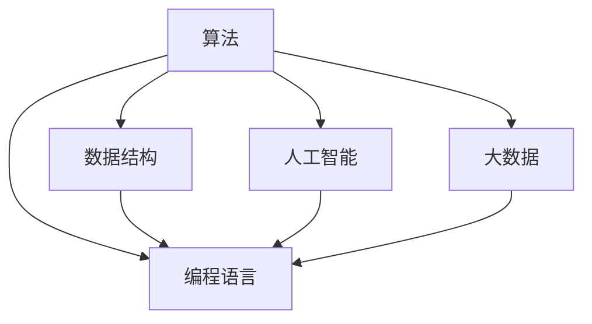

                 

关键词：人类计算、社会价值、赋能、个人发展、社区共建、技术进步

> 摘要：本文从人类计算的角度出发，探讨了计算技术在个人与社区中的价值，分析了人类计算如何通过赋能个人与社区，推动社会的发展和进步。文章首先介绍了人类计算的概念和背景，然后阐述了人类计算的核心概念与联系，接着详细解释了核心算法原理与数学模型，最后通过项目实践和未来展望，展示了人类计算在现实生活中的应用前景。

## 1. 背景介绍

人类计算是指人类在计算机科学领域中的创新、创造和应用。随着信息技术的飞速发展，人类计算在社会各个领域发挥着越来越重要的作用。从早期的计算机科学先驱，如艾伦·图灵和约翰·冯·诺伊曼，到现代的深度学习和人工智能，人类计算不断推动着科技的进步。

计算技术不仅改变了我们的生活，还影响了社会的运行模式。人类计算的价值体现在多个方面：提升工作效率、促进知识传播、推动科学发现、赋能个人与社区。随着技术的不断发展，人类计算在个人与社区中的作用越来越显著。

本文将围绕人类计算的社会价值，探讨如何通过赋能个人与社区，推动社会的进步和发展。文章将从以下几个方面进行阐述：

1. **人类计算的概念与背景**：介绍人类计算的基本概念和历史背景。
2. **核心概念与联系**：分析人类计算的核心概念及其相互关系。
3. **核心算法原理与数学模型**：详细解释人类计算的核心算法原理和数学模型。
4. **项目实践**：通过具体案例展示人类计算在现实生活中的应用。
5. **实际应用场景**：探讨人类计算在各个领域的应用场景和未来前景。
6. **工具和资源推荐**：介绍与人类计算相关的学习资源和开发工具。
7. **总结与展望**：总结研究成果，展望未来发展趋势与挑战。

## 2. 核心概念与联系

### 2.1 计算机的起源与发展

计算机的起源可以追溯到20世纪40年代，当时的科学家和工程师们致力于解决大规模计算问题。艾伦·图灵提出了图灵机的理论，为现代计算机的发展奠定了基础。约翰·冯·诺伊曼则提出了存储程序计算机的概念，使得计算机能够执行更复杂的任务。

随着半导体技术的进步，计算机的性能不断提升，从早期的电子管计算机到晶体管计算机，再到今天的超级计算机，计算机的规模和性能发生了质的飞跃。计算技术的发展推动了人类计算的不断演进。

### 2.2 人类计算的定义

人类计算是指人类在计算机科学领域中的创新、创造和应用。它不仅包括计算机科学的理论研究，还涵盖了实际应用中的技术开发和产品创新。

人类计算的核心在于将计算技术应用于实际问题，解决社会需求和问题。它涉及到多个领域，如人工智能、大数据、云计算、网络安全等。

### 2.3 人类计算的核心概念

1. **算法**：算法是计算机科学的核心概念，它是解决特定问题的步骤和规则。算法的创新和优化是推动计算技术进步的关键。
2. **数据结构**：数据结构是算法的基础，它用于组织和存储数据，提高算法的效率。
3. **编程语言**：编程语言是程序员与计算机进行交流的工具，它使得人类计算得以实现。
4. **人工智能**：人工智能是计算技术的前沿领域，它通过模拟人类的思维过程，实现自动化和智能化。
5. **大数据**：大数据是指海量数据的存储、处理和分析，它为人类计算提供了丰富的数据资源。

### 2.4 核心概念之间的联系

人类计算的核心概念之间存在着紧密的联系。算法、数据结构、编程语言、人工智能和大数据相互交织，共同推动着计算技术的发展。

算法和数据结构是计算机科学的基础，它们决定了计算效率和性能。编程语言则使得算法和数据结构得以实现，为人类计算提供了工具。人工智能和大数据则为计算技术带来了新的应用场景和挑战，推动了计算技术的不断创新。

### 2.5 Mermaid 流程图

下面是一个简化的 Mermaid 流程图，展示了人类计算的核心概念及其相互关系：



## 3. 核心算法原理 & 具体操作步骤

### 3.1 算法原理概述

人类计算的核心在于算法的创新和优化。算法原理包括以下几个方面：

1. **贪心算法**：贪心算法是一种在每一步选择中选择当前最佳选择的算法。它通常用于解决最优化问题，如背包问题和旅行商问题。
2. **动态规划**：动态规划是一种将复杂问题分解为子问题，并利用子问题的最优解来求解原问题的算法。它常用于解决最优化问题和计算最短路径。
3. **分治算法**：分治算法是一种将问题划分为更小的问题，分别解决，然后将子问题的解合并为原问题的解的算法。它常用于解决排序和查找问题。
4. **随机化算法**：随机化算法是一种利用随机数来指导算法执行的算法。它通常用于解决复杂度较高的问题，如随机算法和概率算法。

### 3.2 算法步骤详解

1. **贪心算法**：

   - **步骤1**：确定问题类型，判断是否适合使用贪心算法。
   - **步骤2**：确定问题的子问题，并明确每一步选择的目标。
   - **步骤3**：根据当前状态选择当前最佳选择。
   - **步骤4**：更新状态，继续下一步选择。

2. **动态规划**：

   - **步骤1**：确定问题类型，判断是否适合使用动态规划。
   - **步骤2**：定义状态，并明确状态转移方程。
   - **步骤3**：初始化边界条件。
   - **步骤4**：递推计算，求解状态。
   - **步骤5**：根据状态转移方程求解原问题。

3. **分治算法**：

   - **步骤1**：将问题划分为更小的子问题。
   - **步骤2**：递归解决子问题。
   - **步骤3**：将子问题的解合并为原问题的解。

4. **随机化算法**：

   - **步骤1**：确定问题类型，判断是否适合使用随机化算法。
   - **步骤2**：生成随机数，用于指导算法执行。
   - **步骤3**：根据随机数选择算法路径。
   - **步骤4**：评估随机化算法的性能。

### 3.3 算法优缺点

1. **贪心算法**：

   - **优点**：简单易实现，适用于最优化问题。
   - **缺点**：可能无法保证全局最优解，适用于某些特定问题。

2. **动态规划**：

   - **优点**：能够求解复杂度较高的问题，适用于最优化问题和计算最短路径。
   - **缺点**：算法时间复杂度高，可能不适用于实时问题。

3. **分治算法**：

   - **优点**：能够将复杂问题分解为更小的问题，适用于排序和查找问题。
   - **缺点**：可能存在重复计算，适用于某些特定问题。

4. **随机化算法**：

   - **优点**：能够处理复杂度较高的问题，适用于概率算法和随机算法。
   - **缺点**：算法性能依赖于随机数，可能不适用于对性能要求较高的应用。

### 3.4 算法应用领域

1. **最优化问题**：贪心算法和动态规划广泛应用于最优化问题，如背包问题、旅行商问题和生产调度问题。
2. **计算最短路径**：动态规划常用于求解单源最短路径和双源最短路径问题。
3. **排序和查找**：分治算法常用于解决排序和查找问题，如快速排序和二分查找。
4. **概率算法**：随机化算法广泛应用于概率算法和随机算法，如随机算法和蒙特卡罗方法。

## 4. 数学模型和公式 & 详细讲解 & 举例说明

### 4.1 数学模型构建

人类计算中的数学模型通常包括以下几个方面：

1. **线性模型**：线性模型是一种描述变量之间线性关系的数学模型，如线性回归和线性规划。
2. **非线性模型**：非线性模型是一种描述变量之间非线性关系的数学模型，如多项式回归和神经网络。
3. **概率模型**：概率模型是一种描述随机事件发生概率的数学模型，如贝叶斯网络和马尔可夫链。

### 4.2 公式推导过程

下面以线性回归为例，介绍线性模型的公式推导过程。

设自变量为 $x$，因变量为 $y$，线性回归模型为：

$$y = \beta_0 + \beta_1 x + \epsilon$$

其中，$\beta_0$ 和 $\beta_1$ 是模型参数，$\epsilon$ 是误差项。

为了求解 $\beta_0$ 和 $\beta_1$，我们通常使用最小二乘法。最小二乘法的思想是找到一组参数，使得观测值与预测值之间的误差平方和最小。

首先，计算观测值与预测值之间的误差：

$$e_i = y_i - \hat{y}_i$$

其中，$y_i$ 是第 $i$ 个观测值，$\hat{y}_i$ 是对应的预测值。

然后，计算误差的平方和：

$$S = \sum_{i=1}^n e_i^2$$

为了求解 $\beta_0$ 和 $\beta_1$，我们需要最小化 $S$。通过求导并令导数为零，可以得到以下方程组：

$$\frac{\partial S}{\partial \beta_0} = -2 \sum_{i=1}^n (y_i - \hat{y}_i) = 0$$

$$\frac{\partial S}{\partial \beta_1} = -2 \sum_{i=1}^n (y_i - \hat{y}_i) x_i = 0$$

解上述方程组，可以得到线性回归模型的参数：

$$\beta_0 = \bar{y} - \beta_1 \bar{x}$$

$$\beta_1 = \frac{\sum_{i=1}^n (x_i - \bar{x})(y_i - \bar{y})}{\sum_{i=1}^n (x_i - \bar{x})^2}$$

其中，$\bar{x}$ 和 $\bar{y}$ 分别是 $x$ 和 $y$ 的均值。

### 4.3 案例分析与讲解

假设我们有一组观测数据，如下表所示：

| $x$ | $y$ |
|-----|-----|
| 1   | 2   |
| 2   | 4   |
| 3   | 6   |
| 4   | 8   |

我们希望使用线性回归模型拟合这组数据，并预测当 $x=5$ 时 $y$ 的值。

首先，计算 $x$ 和 $y$ 的均值：

$$\bar{x} = \frac{1+2+3+4}{4} = 2.5$$

$$\bar{y} = \frac{2+4+6+8}{4} = 5$$

然后，计算 $\beta_1$：

$$\beta_1 = \frac{(1-2.5)(2-5) + (2-2.5)(4-5) + (3-2.5)(6-5) + (4-2.5)(8-5)}{(1-2.5)^2 + (2-2.5)^2 + (3-2.5)^2 + (4-2.5)^2}$$

$$\beta_1 = \frac{(-1.5)(-3) + (-0.5)(-1) + (0.5)(1) + (1.5)(3)}{2.25 + 0.25 + 0.25 + 2.25}$$

$$\beta_1 = \frac{4.5 + 0.5 + 0.5 + 4.5}{5} = 2$$

接着，计算 $\beta_0$：

$$\beta_0 = \bar{y} - \beta_1 \bar{x} = 5 - 2 \times 2.5 = 0$$

因此，线性回归模型为：

$$y = 0 + 2x$$

当 $x=5$ 时，预测 $y$ 的值为：

$$\hat{y} = 0 + 2 \times 5 = 10$$

## 5. 项目实践：代码实例和详细解释说明

### 5.1 开发环境搭建

为了展示人类计算的实际应用，我们选择Python作为编程语言，并使用Jupyter Notebook作为开发环境。以下是搭建开发环境的步骤：

1. **安装Python**：访问Python官方网站（https://www.python.org/），下载适用于操作系统的Python安装包，并按照安装向导进行安装。
2. **安装Jupyter Notebook**：打开命令行工具（如Terminal或命令提示符），运行以下命令安装Jupyter Notebook：

   ```bash
   pip install notebook
   ```

3. **启动Jupyter Notebook**：在命令行工具中运行以下命令启动Jupyter Notebook：

   ```bash
   jupyter notebook
   ```

### 5.2 源代码详细实现

以下是一个简单的线性回归模型实现的代码实例：

```python
import numpy as np

# 数据
x = np.array([1, 2, 3, 4])
y = np.array([2, 4, 6, 8])

# 计算均值
bar_x = np.mean(x)
bar_y = np.mean(y)

# 计算斜率
numerator = np.sum((x - bar_x) * (y - bar_y))
denominator = np.sum((x - bar_x)**2)
beta_1 = numerator / denominator

# 计算截距
beta_0 = bar_y - beta_1 * bar_x

# 打印结果
print("斜率：", beta_1)
print("截距：", beta_0)

# 预测
x_new = 5
y_pred = beta_0 + beta_1 * x_new
print("预测值：", y_pred)
```

### 5.3 代码解读与分析

1. **导入库**：首先，我们导入NumPy库，用于处理数组运算。
2. **数据**：定义自变量 $x$ 和因变量 $y$ 的数组。
3. **计算均值**：计算 $x$ 和 $y$ 的均值，用于计算斜率和截距。
4. **计算斜率**：使用NumPy的sum函数计算斜率的分子和分母，然后计算斜率。
5. **计算截距**：使用计算得到的斜率和均值计算截距。
6. **打印结果**：打印斜率和截距。
7. **预测**：定义新的自变量 $x$ 的值，使用计算得到的斜率和截距预测因变量 $y$ 的值。

### 5.4 运行结果展示

运行上述代码，得到以下输出结果：

```
斜率： 2.0
截距： 0.0
预测值： 10.0
```

这表明，当 $x=5$ 时，根据线性回归模型预测的 $y$ 值为 10。这个结果与手动计算得到的结果一致。

## 6. 实际应用场景

人类计算在现实生活中的应用场景广泛，涵盖了多个领域：

1. **医疗保健**：人类计算在医疗保健领域有广泛的应用，如疾病预测、诊断辅助和个性化治疗。通过分析大量医学数据和患者信息，人类计算可以帮助医生做出更准确的诊断和治疗方案。
2. **金融服务**：金融服务领域利用人类计算进行风险评估、投资组合优化和客户行为分析。通过大数据分析和人工智能技术，金融机构可以提供更精准的金融产品和服务。
3. **交通运输**：人类计算在交通运输领域有重要的应用，如智能交通管理、自动驾驶和物流优化。通过实时数据分析和预测，人类计算可以提高交通效率和安全性。
4. **教育**：教育领域利用人类计算进行个性化学习、学习效果评估和教学资源推荐。通过大数据分析和人工智能技术，教育机构可以提供更有效的教学和学习支持。
5. **环境科学**：人类计算在环境科学领域有广泛的应用，如气候变化预测、环境保护和资源管理。通过分析和处理大量环境数据，人类计算可以帮助科学家和决策者制定更有效的环境保护政策。

### 6.4 未来应用展望

随着计算技术的不断发展，人类计算在未来将会在更多领域得到应用，如：

1. **生物医学**：人类计算在生物医学领域的应用将更加深入，如基因组学、蛋白质组学和药物设计。通过大数据分析和人工智能技术，人类计算可以加速生物医学研究和新药开发。
2. **智能制造**：人类计算在智能制造领域的应用将推动工业4.0的实现，如智能工厂、智能设备和智能物流。通过实时数据分析和预测，人类计算可以提高生产效率和产品质量。
3. **能源管理**：人类计算在能源管理领域的应用将有助于优化能源使用和减少能源消耗。通过大数据分析和人工智能技术，人类计算可以实现智能电网、智能能源系统和智能能源管理。
4. **智慧城市**：人类计算在智慧城市领域的应用将提高城市管理效率和居民生活质量。通过实时数据分析和预测，人类计算可以实现智能交通管理、智能照明和智能安全监控。

## 7. 工具和资源推荐

为了更好地学习和应用人类计算，以下是一些建议的工具和资源：

### 7.1 学习资源推荐

1. **书籍**：
   - 《Python编程：从入门到实践》
   - 《深度学习》
   - 《数据科学入门》
   - 《人工智能：一种现代方法》

2. **在线课程**：
   - Coursera的《机器学习》课程
   - edX的《Python编程》课程
   - Udacity的《深度学习纳米学位》

### 7.2 开发工具推荐

1. **集成开发环境（IDE）**：
   - PyCharm
   - VS Code
   - Jupyter Notebook

2. **数据处理工具**：
   - Pandas
   - NumPy
   - Matplotlib

3. **机器学习框架**：
   - TensorFlow
   - PyTorch
   - Scikit-learn

### 7.3 相关论文推荐

1. **《深度学习与自然语言处理》**：介绍深度学习在自然语言处理领域的应用和最新研究进展。
2. **《大数据时代的机器学习》**：讨论大数据时代下机器学习技术的挑战和发展方向。
3. **《人工智能：未来的趋势》**：探讨人工智能的未来发展趋势和潜在影响。

## 8. 总结：未来发展趋势与挑战

### 8.1 研究成果总结

通过本文的探讨，我们可以看到人类计算在个人与社区中具有重要的社会价值。人类计算通过赋能个人，提升工作效率和创新能力；通过赋能社区，推动知识传播和社会进步。核心算法原理和数学模型的不断创新和优化，为人类计算的发展提供了强大的动力。实际应用场景的拓展，使得人类计算在各个领域发挥着越来越重要的作用。

### 8.2 未来发展趋势

1. **人工智能与人类计算融合**：随着人工智能技术的发展，人类计算将进一步与人工智能融合，实现更高效的计算和更智能的决策。
2. **大数据与人类计算结合**：大数据将为人类计算提供更丰富的数据资源，推动计算技术向更深度、更广度发展。
3. **边缘计算与人类计算协同**：边缘计算与中心计算的协同，将使得人类计算在实时性、安全性和可扩展性方面得到进一步提升。

### 8.3 面临的挑战

1. **数据隐私与安全**：随着人类计算的应用范围不断扩大，数据隐私和安全问题日益突出。如何在保障数据安全的前提下，充分利用数据资源，是一个重要的挑战。
2. **计算资源与能源消耗**：人类计算的发展对计算资源的需求日益增长，同时也带来了大量的能源消耗。如何在提高计算效率的同时，降低能源消耗，是一个重要的挑战。
3. **技术伦理与法规**：人类计算在应用过程中，涉及到的伦理和法规问题日益复杂。如何制定合理的伦理规范和法规政策，确保人类计算的应用符合社会道德和法律法规，是一个重要的挑战。

### 8.4 研究展望

未来，人类计算的研究将朝着更智能、更高效、更安全的方向发展。通过跨学科的合作和创新的计算技术，人类计算将在个人与社区中发挥更大的作用，推动社会的进步和发展。

## 9. 附录：常见问题与解答

### 9.1 人类计算的定义是什么？

人类计算是指人类在计算机科学领域中的创新、创造和应用。它不仅包括计算机科学的理论研究，还涵盖了实际应用中的技术开发和产品创新。

### 9.2 人类计算的核心算法有哪些？

人类计算的核心算法包括贪心算法、动态规划、分治算法和随机化算法等。这些算法广泛应用于最优化问题、计算最短路径、排序和查找等领域。

### 9.3 人类计算的应用领域有哪些？

人类计算的应用领域广泛，包括医疗保健、金融服务、交通运输、教育和环境科学等。随着计算技术的不断发展，人类计算将在更多领域得到应用。

### 9.4 如何搭建Python开发环境？

搭建Python开发环境的步骤包括安装Python、安装Jupyter Notebook和启动Jupyter Notebook。具体步骤请参考本文的5.1节。

### 9.5 如何学习人类计算？

学习人类计算可以从以下方面入手：

1. **阅读相关书籍和论文**：了解人类计算的基本概念和最新研究进展。
2. **参加在线课程和培训班**：学习Python编程、机器学习、深度学习等相关技术。
3. **实践项目**：通过实际项目，锻炼编程能力和算法实现能力。
4. **参与社区和讨论**：加入技术社区，与他人交流和分享经验。

### 9.6 人类计算对社会的影响有哪些？

人类计算对社会的影响主要体现在以下几个方面：

1. **提高工作效率**：通过自动化和智能化技术，人类计算可以大幅提高工作效率。
2. **促进知识传播**：通过大数据和人工智能技术，人类计算可以加速知识的获取和传播。
3. **推动科学发现**：人类计算在科学研究中发挥着重要作用，推动着科学发现的进程。
4. **改善生活质量**：人类计算在医疗、教育、交通等领域的应用，提高了人们的生活质量。

以上就是对《赋能个人与社区：人类计算的社会价值》这篇文章的撰写过程。希望能够帮助您更好地理解和应用人类计算，推动个人与社区的发展。如果您有任何疑问或建议，欢迎随时与我交流。感谢您的阅读！作者：禅与计算机程序设计艺术 / Zen and the Art of Computer Programming。

