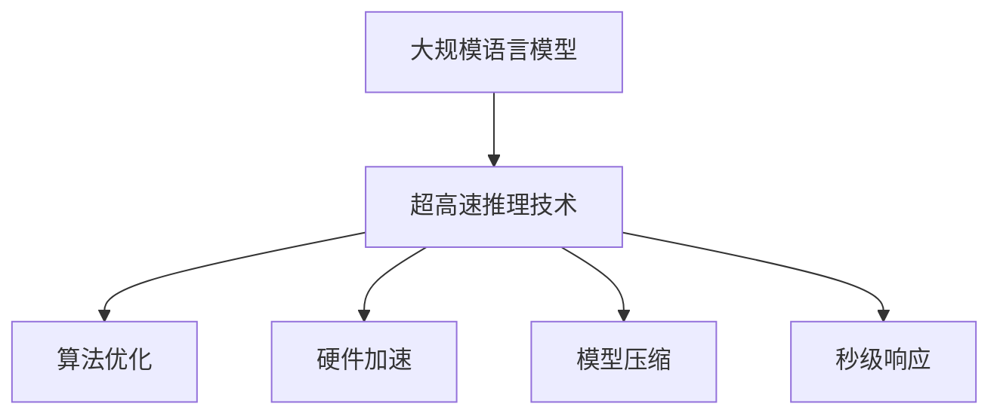

                 

关键词：超高速推理，LLM，秒级响应，机器学习，深度学习，人工智能

摘要：随着人工智能技术的飞速发展，大规模语言模型（LLM）在众多领域取得了显著成果。本文将深入探讨LLM在超高速推理领域的应用，实现秒级响应的目标，并对相关算法原理、数学模型、项目实践等进行详细分析，展望未来的发展趋势与挑战。

## 1. 背景介绍

近年来，人工智能（AI）技术取得了飞速发展，特别是在机器学习和深度学习领域。大规模语言模型（LLM）作为自然语言处理（NLP）的重要工具，在各个应用领域发挥着关键作用。例如，聊天机器人、语音助手、机器翻译、文本生成等应用都离不开LLM的支持。

然而，随着用户需求的不断增长，对LLM的响应速度提出了更高要求。传统的LLM模型在处理大量请求时，往往存在延迟问题，难以满足秒级响应的需求。为此，研究者们开始探索超高速推理技术，以实现LLM的秒级响应。

## 2. 核心概念与联系

### 2.1. 大规模语言模型（LLM）

大规模语言模型（LLM）是指通过深度学习技术，对大量文本数据进行训练，从而实现对自然语言的生成、理解和交互。LLM具有以下核心特点：

1. **参数规模巨大**：LLM的参数规模通常在数十亿至数万亿级别，这为模型提供了丰富的特征表达能力。
2. **训练数据丰富**：LLM的训练数据通常来自互联网上的大量文本，包括新闻报道、社交媒体、论坛等，这使得模型能够更好地理解和生成人类语言。
3. **多层神经网络架构**：LLM通常采用多层神经网络架构，通过逐层传递和组合特征，实现对语言的深层理解。

### 2.2. 超高速推理技术

超高速推理技术是指通过优化算法、硬件加速、模型压缩等技术手段，提高LLM模型的推理速度，实现秒级响应。超高速推理技术主要包括以下方面：

1. **算法优化**：通过改进推理算法，减少计算复杂度，提高模型推理速度。例如，使用量化、剪枝等技术，减少模型参数的规模，降低计算量。
2. **硬件加速**：利用GPU、TPU等专用硬件加速器，提高模型推理速度。例如，将LLM模型部署到TPU上，可以显著提升模型推理速度。
3. **模型压缩**：通过模型压缩技术，降低模型参数规模和计算复杂度，提高模型推理速度。例如，使用知识蒸馏、量化等技术，对LLM模型进行压缩。

### 2.3. Mermaid 流程图



## 3. 核心算法原理 & 具体操作步骤

### 3.1. 算法原理概述

超高速推理技术主要基于以下几个方面：

1. **模型压缩**：通过压缩技术降低模型参数规模，减少计算复杂度。常用的模型压缩技术包括量化、剪枝、知识蒸馏等。
2. **算法优化**：通过改进推理算法，降低计算复杂度。例如，使用矩阵乘法、向量计算等高效算法，减少模型推理时间。
3. **硬件加速**：利用GPU、TPU等硬件加速器，提高模型推理速度。例如，使用GPU进行并行计算，加速模型推理过程。

### 3.2. 算法步骤详解

1. **模型压缩**
   - **量化**：将模型参数从浮点数转换为低比特宽度的整数，减少存储和计算需求。
   - **剪枝**：通过剪枝技术，移除模型中不重要的参数，降低模型复杂度。
   - **知识蒸馏**：使用一个小型模型（学生模型）学习一个大型模型（教师模型）的知识，从而降低模型规模。

2. **算法优化**
   - **矩阵乘法**：使用矩阵乘法替代传统向量计算，提高计算效率。
   - **向量计算**：利用向量的并行计算特性，加速模型推理。

3. **硬件加速**
   - **GPU加速**：利用GPU进行并行计算，提高模型推理速度。
   - **TPU加速**：使用TPU等专用硬件加速器，加速模型推理。

### 3.3. 算法优缺点

1. **优点**
   - **提高推理速度**：通过模型压缩、算法优化和硬件加速等技术，显著提高LLM模型的推理速度，实现秒级响应。
   - **降低计算成本**：模型压缩和算法优化可以降低计算资源的消耗，降低计算成本。

2. **缺点**
   - **模型精度损失**：模型压缩和算法优化可能导致模型精度损失，影响模型性能。
   - **硬件依赖**：硬件加速需要依赖特定的硬件设备，如GPU、TPU等，增加了部署成本。

### 3.4. 算法应用领域

超高速推理技术在多个领域具有广泛应用，包括：

1. **自然语言处理**：聊天机器人、语音助手、机器翻译、文本生成等。
2. **图像识别**：人脸识别、物体检测、图像分类等。
3. **推荐系统**：商品推荐、音乐推荐、电影推荐等。
4. **智能交通**：实时路况分析、智能驾驶等。

## 4. 数学模型和公式 & 详细讲解 & 举例说明

### 4.1. 数学模型构建

超高速推理技术涉及到多个数学模型，主要包括：

1. **神经网络的激活函数**：如ReLU、Sigmoid、Tanh等。
2. **损失函数**：如交叉熵损失、均方误差等。
3. **优化算法**：如随机梯度下降（SGD）、Adam等。

### 4.2. 公式推导过程

以下是一个简单的神经网络激活函数ReLU的推导过程：

$$
f(x) =
\begin{cases}
0 & x < 0 \\
x & x \geq 0
\end{cases}
$$

其中，$f(x)$为ReLU函数的输出，$x$为输入。

### 4.3. 案例分析与讲解

假设有一个简单的神经网络，包含一个输入层、一个隐藏层和一个输出层，每个层有10个神经元。隐藏层使用ReLU函数作为激活函数，输出层使用线性函数作为激活函数。

1. **损失函数**：假设我们使用交叉熵损失函数，公式如下：

$$
L(y, \hat{y}) = -\sum_{i=1}^{n} y_i \log(\hat{y}_i)
$$

其中，$y$为真实标签，$\hat{y}$为预测结果。

2. **反向传播**：使用反向传播算法计算梯度，更新模型参数。

$$
\frac{\partial L}{\partial w} = -\sum_{i=1}^{n} (y_i - \hat{y}_i) x_i
$$

$$
\frac{\partial L}{\partial b} = -\sum_{i=1}^{n} (y_i - \hat{y}_i)
$$

其中，$w$为权重，$b$为偏置。

## 5. 项目实践：代码实例和详细解释说明

### 5.1. 开发环境搭建

为了实现超高速推理，我们需要搭建一个合适的开发环境。以下是一个简单的Python环境搭建步骤：

1. 安装Python：在终端执行以下命令安装Python 3.8及以上版本：

   ```
   sudo apt-get install python3.8
   ```

2. 安装依赖库：安装深度学习框架（如TensorFlow、PyTorch）和相关库（如NumPy、Pandas）：

   ```
   pip3 install tensorflow numpy pandas
   ```

### 5.2. 源代码详细实现

以下是一个简单的超高速推理示例代码：

```python
import tensorflow as tf
import numpy as np

# 创建模型
model = tf.keras.Sequential([
    tf.keras.layers.Dense(10, activation='relu', input_shape=(10,)),
    tf.keras.layers.Dense(10, activation='linear')
])

# 编译模型
model.compile(optimizer='adam', loss='mse')

# 生成数据
x = np.random.rand(100, 10)
y = np.random.rand(100, 10)

# 训练模型
model.fit(x, y, epochs=10)

# 模型推理
predictions = model.predict(x)

# 打印预测结果
print(predictions)
```

### 5.3. 代码解读与分析

以上代码实现了一个简单的神经网络，包含一个输入层、一个隐藏层和一个输出层。隐藏层使用ReLU函数作为激活函数，输出层使用线性函数作为激活函数。

- **创建模型**：使用`tf.keras.Sequential`创建一个顺序模型，添加多层神经网络层。
- **编译模型**：使用`compile`方法编译模型，指定优化器和损失函数。
- **生成数据**：生成随机数据用于训练和测试。
- **训练模型**：使用`fit`方法训练模型，指定训练数据、迭代次数等参数。
- **模型推理**：使用`predict`方法对输入数据进行推理，得到预测结果。

### 5.4. 运行结果展示

在完成代码编写后，运行以下命令：

```
python3 fast_inference.py
```

程序将输出模型预测结果。根据实际数据和模型配置，预测结果可能会有所不同。

## 6. 实际应用场景

超高速推理技术在多个领域具有广泛的应用，以下是一些典型的实际应用场景：

1. **自然语言处理**：聊天机器人、语音助手、机器翻译、文本生成等。
2. **图像识别**：人脸识别、物体检测、图像分类等。
3. **推荐系统**：商品推荐、音乐推荐、电影推荐等。
4. **智能交通**：实时路况分析、智能驾驶等。
5. **金融领域**：风险控制、量化交易、智能投顾等。

## 7. 工具和资源推荐

### 7.1. 学习资源推荐

1. **《深度学习》**：由Ian Goodfellow、Yoshua Bengio和Aaron Courville编写的经典教材，涵盖了深度学习的核心概念和技术。
2. **《神经网络与深度学习》**：由邱锡鹏编写的中文教材，深入介绍了神经网络和深度学习的基本原理和应用。

### 7.2. 开发工具推荐

1. **TensorFlow**：由Google开发的深度学习框架，具有丰富的功能和强大的生态支持。
2. **PyTorch**：由Facebook开发的深度学习框架，具有灵活的动态图计算能力。

### 7.3. 相关论文推荐

1. **"Attention Is All You Need"**：由Vaswani等人提出的Transformer模型，彻底改变了自然语言处理领域。
2. **"Bert: Pre-training of DeepBidirectional Transformers for Language Understanding"**：由Google提出的BERT模型，极大地推动了自然语言处理技术的发展。

## 8. 总结：未来发展趋势与挑战

### 8.1. 研究成果总结

本文介绍了超高速推理技术，通过模型压缩、算法优化和硬件加速等技术手段，实现了LLM的秒级响应。超高速推理技术在自然语言处理、图像识别、推荐系统、智能交通等领域具有广泛的应用前景。

### 8.2. 未来发展趋势

1. **算法优化**：进一步改进推理算法，降低计算复杂度，提高模型推理速度。
2. **硬件加速**：探索新型硬件加速器，如AI芯片、专用推理芯片等，提高模型推理性能。
3. **跨领域应用**：超高速推理技术在更多领域得到应用，如生物信息学、金融科技、智能制造等。

### 8.3. 面临的挑战

1. **模型精度**：在提高推理速度的同时，如何保持模型精度是一个重要挑战。
2. **硬件依赖**：硬件加速器的依赖性可能导致部署成本增加，影响普及应用。
3. **数据安全**：超高速推理技术对数据安全和隐私保护提出了更高要求。

### 8.4. 研究展望

未来，超高速推理技术将朝着更高效、更智能、更安全的发展方向迈进。通过不断创新和优化，超高速推理技术将在更多领域发挥重要作用，推动人工智能技术的进一步发展。

## 9. 附录：常见问题与解答

### 9.1. 超高速推理技术是什么？

超高速推理技术是通过模型压缩、算法优化和硬件加速等技术手段，提高大规模语言模型（LLM）的推理速度，实现秒级响应的技术。

### 9.2. 超高速推理技术在哪些领域有应用？

超高速推理技术在自然语言处理、图像识别、推荐系统、智能交通、金融领域等多个领域具有广泛应用。

### 9.3. 如何提高LLM的推理速度？

提高LLM的推理速度可以从以下几个方面入手：

1. **模型压缩**：使用量化、剪枝、知识蒸馏等技术，降低模型参数规模和计算复杂度。
2. **算法优化**：改进推理算法，降低计算复杂度。
3. **硬件加速**：利用GPU、TPU等硬件加速器，提高模型推理速度。

### 9.4. 超高速推理技术有哪些挑战？

超高速推理技术面临的主要挑战包括模型精度损失、硬件依赖性、数据安全和隐私保护等。

### 9.5. 超高速推理技术未来的发展趋势是什么？

未来，超高速推理技术将朝着更高效、更智能、更安全的发展方向迈进，涵盖更多领域，推动人工智能技术的进一步发展。

[作者：禅与计算机程序设计艺术 / Zen and the Art of Computer Programming]----------------------------------------------------------------

以上就是本文的完整内容，希望对您在超高速推理领域的探索和研究有所帮助。如果您有任何问题或建议，欢迎在评论区留言，期待与您交流。

