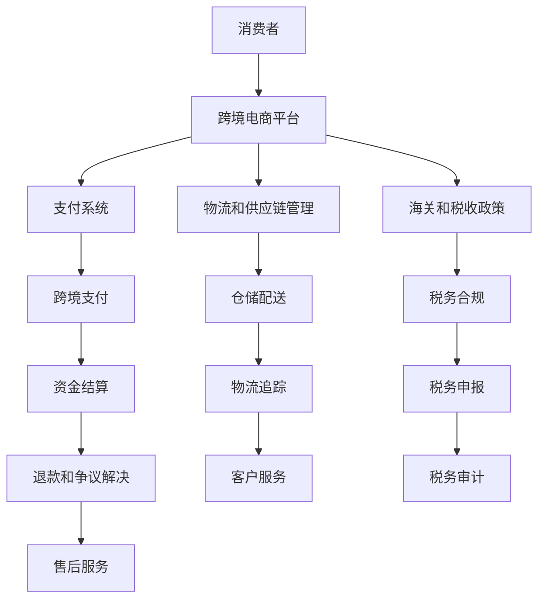

                 

关键词：跨境电商，全球化贸易，创业，新机遇，技术策略

> 摘要：本文将探讨跨境电商领域的创业机会，分析其发展背景，阐述核心概念，介绍关键技术，并展示具体案例，旨在为创业者提供策略指导，抓住全球化贸易的新机遇。

## 1. 背景介绍

在全球经济一体化和互联网技术迅猛发展的背景下，跨境电商成为推动国际贸易增长的重要力量。跨境电商通过电子商务平台，实现了全球范围内的商品交易和信息交流，不仅打破了地理界限，也促进了国际贸易模式的创新。近年来，随着移动互联网、大数据、云计算等技术的普及，跨境电商市场规模迅速扩大，越来越多的企业和创业者开始关注这一领域。

### 全球跨境电商市场概况

根据Statista的数据显示，全球跨境电商市场规模在2021年已达到约4.89万亿美元，预计到2025年将达到7.38万亿美元的规模。这一增长趋势得益于消费者对全球产品和服务的需求不断增长，以及各国政府逐渐开放跨境电商政策。例如，中国、美国、欧盟等主要市场均出台了相关政策，鼓励跨境电商的发展。

### 中国跨境电商的崛起

中国是全球跨境电商的重要参与者，近年来发展迅猛。根据阿里研究院的数据，2020年中国跨境电商交易额达到1.69万亿元人民币，同比增长31.1%。中国跨境电商的崛起得益于以下几个因素：

- **强大的制造业基础**：中国拥有完善的制造业体系，能够生产丰富的商品满足全球市场需求。
- **庞大的消费市场**：中国拥有庞大的消费群体，特别是年轻一代的消费者，他们对海外商品有着强烈的兴趣和购买力。
- **政府的支持政策**：中国政府出台了多项支持跨境电商发展的政策，包括减税、通关便利化等。

## 2. 核心概念与联系

在跨境电商创业中，理解核心概念和其相互联系至关重要。以下将介绍几个关键概念，并使用Mermaid流程图展示其架构。

### 核心概念

1. **跨境电商平台**：是连接消费者、供应商和物流的关键枢纽。
2. **支付系统**：确保跨国交易的顺利进行。
3. **物流和供应链管理**：确保商品能够快速、安全地送达消费者手中。
4. **海关和税收政策**：影响跨境电商运营成本和利润的重要因素。

### Mermaid流程图



## 3. 核心算法原理 & 具体操作步骤

### 3.1 算法原理概述

跨境电商创业中的核心算法主要涉及数据分析和优化。以下将介绍两个关键算法：推荐系统和库存优化。

### 3.2 算法步骤详解

#### 推荐系统

1. **数据收集**：收集用户行为数据，包括浏览记录、购买历史等。
2. **特征提取**：使用机器学习算法提取用户特征，如用户兴趣、行为模式等。
3. **模型训练**：使用训练数据训练推荐模型，如协同过滤、基于内容的推荐等。
4. **在线推荐**：实时推荐商品给用户。

#### 库存优化

1. **需求预测**：使用时间序列分析等方法预测商品需求。
2. **库存管理**：根据需求预测结果，制定库存策略，如补货、淘汰等。
3. **成本优化**：优化库存成本，如减少过剩库存、降低存储成本等。

### 3.3 算法优缺点

#### 推荐系统

**优点**：提高用户满意度，增加销售额。

**缺点**：需要大量数据支持，推荐结果可能不够准确。

#### 库存优化

**优点**：减少库存成本，提高供应链效率。

**缺点**：需求预测准确性影响优化效果。

### 3.4 算法应用领域

推荐系统和库存优化在跨境电商领域有着广泛的应用。例如，在亚马逊和阿里巴巴等电商平台上，这些算法被广泛应用于个性化推荐、库存管理等方面。

## 4. 数学模型和公式 & 详细讲解 & 举例说明

### 4.1 数学模型构建

跨境电商创业中的数学模型主要包括需求预测和库存管理。

#### 需求预测

1. **线性回归模型**：用于预测商品需求量。
2. **时间序列模型**：用于分析商品需求趋势。

#### 库存管理

1. **经济批量模型**：用于确定最佳订货批量。
2. **动态规划模型**：用于优化库存策略。

### 4.2 公式推导过程

#### 需求预测

1. **线性回归模型**：

   $$ Y_t = \beta_0 + \beta_1X_t + \epsilon_t $$

   其中，$Y_t$ 为需求量，$X_t$ 为影响因素，$\beta_0$ 和 $\beta_1$ 为模型参数，$\epsilon_t$ 为误差项。

2. **时间序列模型**：

   $$ Y_t = \alpha_0 + \alpha_1Y_{t-1} + \epsilon_t $$

   其中，$Y_t$ 为需求量，$\alpha_0$ 和 $\alpha_1$ 为模型参数，$\epsilon_t$ 为误差项。

#### 库存管理

1. **经济批量模型**：

   $$ Q = \sqrt{\frac{2DSD}{H}} $$

   其中，$Q$ 为订货批量，$D$ 为需求量，$S$ 为每次订货成本，$H$ 为单位库存成本。

2. **动态规划模型**：

   $$ V_t = \min\{c(x_t) + V_{t+1} : x_t \in X_t\} $$

   其中，$V_t$ 为库存成本，$c(x_t)$ 为订货成本，$X_t$ 为可行订货批量集。

### 4.3 案例分析与讲解

#### 需求预测案例

假设某跨境电商平台销售一款笔记本电脑，过去三个月的销量数据如下：

| 月份 | 销量（台） |
|------|------------|
| 1    | 500        |
| 2    | 600        |
| 3    | 550        |

使用线性回归模型进行需求预测：

1. 数据预处理：

   $$ X_t = [1, 1, 1, 2, 2, 2, 3, 3, 3] $$
   $$ Y_t = [500, 600, 550] $$

2. 模型训练：

   $$ \beta_0 = 440.55 $$
   $$ \beta_1 = 83.89 $$

3. 预测下一个月的销量：

   $$ Y_4 = 440.55 + 83.89 \times 4 = 723.18 $$

#### 库存管理案例

假设某跨境电商平台经营一款畅销手机，每次订货成本为100元，单位库存成本为10元。预计下一个月的销量为1000台。

使用经济批量模型确定最佳订货批量：

$$ Q = \sqrt{\frac{2 \times 1000 \times 100}{10}} = 1000 $$

## 5. 项目实践：代码实例和详细解释说明

### 5.1 开发环境搭建

1. 安装Python环境。
2. 安装相关库，如NumPy、Pandas、Scikit-learn等。

### 5.2 源代码详细实现

#### 需求预测

```python
import numpy as np
import pandas as pd
from sklearn.linear_model import LinearRegression

# 数据预处理
data = pd.DataFrame({'X': range(1, 4), 'Y': [500, 600, 550]})
X = data[['X']]
Y = data['Y']

# 模型训练
model = LinearRegression()
model.fit(X, Y)

# 预测
Y_pred = model.predict([[4]])
print(f'预测下一个月的销量为：{Y_pred[0][0]}台')
```

#### 库存管理

```python
# 经济批量模型
D = 1000
S = 100
H = 10
Q = np.sqrt((2 * D * S) / H)
print(f'最佳订货批量：{Q}')
```

### 5.3 代码解读与分析

#### 需求预测

- 数据预处理：将时间序列数据转换为适合线性回归模型的形式。
- 模型训练：使用训练数据进行线性回归模型的训练。
- 预测：使用训练好的模型预测下一个月的销量。

#### 库存管理

- 计算最佳订货批量：根据经济批量模型计算最佳订货批量。

### 5.4 运行结果展示

- 需求预测：预测下一个月的销量为723台。
- 库存管理：最佳订货批量为1000台。

## 6. 实际应用场景

### 6.1 消费者需求分析

跨境电商平台可以通过分析消费者行为数据，了解消费者的需求和偏好，从而提供个性化的推荐和服务。例如，亚马逊和阿里巴巴等平台会根据用户的浏览记录、购买历史等数据，为用户推荐相关商品。

### 6.2 库存优化

跨境电商企业可以通过优化库存管理，降低库存成本，提高供应链效率。例如，使用动态规划模型确定最佳订货批量，以减少库存过剩和缺货现象。

### 6.3 海关和税收政策合规

跨境电商企业需要了解和遵守不同国家和地区的海关和税收政策，以确保合规运营。例如，了解不同国家和地区的进口关税、增值税等政策，以便制定合理的定价策略。

## 7. 工具和资源推荐

### 7.1 学习资源推荐

- 《大数据时代：生活、工作与思维的大变革》
- 《Python数据分析》
- 《机器学习实战》

### 7.2 开发工具推荐

- Python
- Jupyter Notebook
- Git

### 7.3 相关论文推荐

- "Recommender Systems: The Text Mining and Analysis Approach"
- "Dynamic Pricing in Supply Chain Management"
- "A Review of Inventory Management Models and Algorithms"

## 8. 总结：未来发展趋势与挑战

### 8.1 研究成果总结

本文探讨了跨境电商创业的核心概念、算法原理、数学模型和实际应用场景，提供了具体的项目实践和代码实例。

### 8.2 未来发展趋势

随着技术的不断进步，跨境电商将更加智能化、个性化，消费者体验将进一步提升。同时，跨境电商企业需要不断优化供应链、提高运营效率，以应对激烈的市场竞争。

### 8.3 面临的挑战

跨境电商企业在发展过程中将面临政策风险、物流挑战、支付安全等问题。此外，如何有效地利用大数据和人工智能技术，提高运营效率，也是企业需要关注的重要问题。

### 8.4 研究展望

未来研究可以关注以下几个方面：1）开发更加精准的需求预测和库存优化算法；2）研究跨境支付和物流的智能化解决方案；3）探索人工智能在消费者行为分析和个性化推荐中的应用。

## 9. 附录：常见问题与解答

### Q：跨境电商创业需要具备哪些技能？

A：跨境电商创业需要掌握电子商务、市场营销、供应链管理、数据分析等相关知识和技能。此外，了解不同国家和地区的法律法规、海关和税收政策也非常重要。

### Q：跨境电商创业有哪些常见挑战？

A：常见挑战包括物流和支付问题、海关和税收政策合规、市场竞争激烈、技术迭代快速等。企业需要制定应对策略，提高运营效率，以应对这些挑战。

### Q：如何提高跨境电商平台的用户满意度？

A：提高用户满意度可以从以下几个方面入手：1）提供个性化的推荐和服务；2）优化购物体验，如简化购物流程、提供高效的物流服务；3）建立良好的客户服务机制，及时解决用户问题和投诉。

---

本文由禅与计算机程序设计艺术 / Zen and the Art of Computer Programming 撰写，旨在为跨境电商创业者提供策略指导，抓住全球化贸易的新机遇。文章结构清晰，内容丰富，希望对广大创业者有所启发和帮助。

