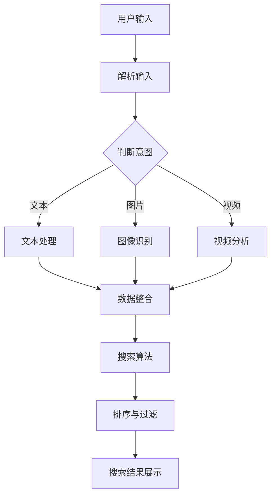

                 

关键词：跨平台搜索，AI整合，多渠道数据，优化选择，搜索算法，数学模型

> 摘要：随着互联网和移动设备的普及，跨平台搜索成为了用户获取信息的重要途径。本文将探讨如何利用人工智能技术整合多渠道数据，提供最优的搜索结果。通过介绍核心算法原理、数学模型及其应用领域，文章旨在为读者提供一个全面的技术视角，助力理解和掌握跨平台搜索的实践。

## 1. 背景介绍

跨平台搜索是现代互联网环境中的一项关键功能。随着用户使用的设备种类日益增多，搜索引擎需要能够无缝整合来自不同平台的丰富数据源，以提供准确、个性化的搜索结果。例如，用户可能同时使用手机、平板电脑和电脑，在不同的平台上有不同的搜索需求。一个高效的跨平台搜索系统能够理解用户意图，并在多个数据源之间进行智能筛选，以呈现最优搜索结果。

人工智能（AI）技术的迅猛发展为跨平台搜索带来了新的契机。AI算法能够处理海量的多渠道数据，发现数据之间的关联，并利用机器学习模型优化搜索结果。通过深度学习、自然语言处理（NLP）、推荐系统等技术，跨平台搜索系统可以实现更高程度的智能化，提升用户体验。

本文将重点讨论以下内容：

- 核心概念与联系
- 核心算法原理与具体操作步骤
- 数学模型与公式
- 项目实践：代码实例与详细解释
- 实际应用场景
- 工具和资源推荐
- 未来发展趋势与挑战
- 总结与展望

## 2. 核心概念与联系

为了理解跨平台搜索的工作原理，我们需要先了解几个核心概念：

### 数据源

数据源是跨平台搜索系统的基础。数据源可以是网站、社交媒体、数据库、API等，它们提供了多样化的数据类型，如文本、图片、音频和视频。

### 用户意图

用户意图是用户在搜索过程中想要寻找的内容。理解用户意图是跨平台搜索系统的一项关键任务，它决定了如何从多个数据源中筛选出最相关的结果。

### 搜索算法

搜索算法是跨平台搜索系统的核心组件，负责处理和过滤数据，提供搜索结果。常见的搜索算法包括基于关键词匹配、向量空间模型和深度学习等方法。

### 用户行为分析

用户行为分析通过追踪用户的搜索历史、点击记录等数据，帮助系统更好地理解用户偏好，优化搜索结果。

### Mermaid 流程图

为了更直观地展示跨平台搜索的工作流程，我们使用Mermaid绘制了一个流程图：



在这个流程图中，用户输入被解析并判断意图。根据不同的输入类型，系统会进行相应的处理，如文本处理、图像识别或视频分析。随后，数据被整合并进行搜索算法处理，最后生成排序和过滤后的搜索结果。

## 3. 核心算法原理 & 具体操作步骤

### 3.1 算法原理概述

跨平台搜索的核心算法通常包括以下几个步骤：

1. **数据预处理**：清洗和标准化来自不同渠道的数据，使其适合后续处理。
2. **意图识别**：利用NLP技术分析用户输入，理解用户意图。
3. **数据整合**：将不同渠道的数据整合到一个统一的结构中，以便后续处理。
4. **搜索算法**：基于用户意图和数据，选择合适的搜索算法进行搜索。
5. **结果排序与过滤**：根据用户偏好和搜索效果，对搜索结果进行排序和过滤。
6. **结果展示**：将最终搜索结果呈现给用户。

### 3.2 算法步骤详解

#### 3.2.1 数据预处理

数据预处理是跨平台搜索的重要环节，它包括以下步骤：

- **去噪**：移除无关的噪声数据，如广告、垃圾信息等。
- **标准化**：统一数据格式，如将文本转换为小写，去除标点符号等。
- **编码**：将数据转换为机器可处理的格式，如词向量、图像特征向量等。

#### 3.2.2 意图识别

意图识别是跨平台搜索的关键步骤，它决定了如何处理后续的数据。常用的意图识别方法包括：

- **规则匹配**：使用预定义的规则匹配用户输入，判断用户意图。
- **机器学习**：使用监督学习模型，根据用户历史数据训练模型，识别用户意图。
- **深度学习**：使用神经网络模型，如LSTM、BERT等，对用户输入进行语义分析，识别用户意图。

#### 3.2.3 数据整合

数据整合是将来自不同渠道的数据统一到一个结构中，以便后续处理。常用的方法包括：

- **数据库**：将数据存储在关系数据库或NoSQL数据库中，实现数据的统一管理。
- **数据湖**：将不同渠道的数据存储在一个大数据存储系统中，进行统一处理。
- **ETL（Extract, Transform, Load）**：提取原始数据，进行转换处理，然后加载到统一的数据存储系统中。

#### 3.2.4 搜索算法

搜索算法是跨平台搜索的核心，常见的搜索算法包括：

- **基于关键词匹配**：直接根据用户输入的关键词在数据库中检索相关内容。
- **向量空间模型**：将文本、图像等数据转换为向量，计算向量之间的相似度，返回相似度最高的结果。
- **深度学习**：使用神经网络模型，如BERT、GPT等，对用户输入和内容进行深度语义分析，返回相关结果。

#### 3.2.5 结果排序与过滤

结果排序与过滤是跨平台搜索的重要环节，它决定了用户最终看到的搜索结果。常用的方法包括：

- **基于内容的排序**：根据内容的相关性对搜索结果进行排序。
- **基于用户偏好的排序**：根据用户的历史行为和偏好对搜索结果进行排序。
- **过滤**：去除无关或重复的结果，提高搜索结果的准确性。

#### 3.2.6 结果展示

结果展示是将最终的搜索结果呈现给用户。常用的方法包括：

- **列表展示**：将搜索结果以列表形式展示。
- **卡片展示**：将搜索结果以卡片形式展示，每个卡片包含标题、摘要、图片等信息。
- **推荐展示**：根据用户的兴趣和历史行为，推荐相关内容。

### 3.3 算法优缺点

每种搜索算法都有其优缺点：

- **基于关键词匹配**：简单、快速，但可能无法准确理解用户意图。
- **向量空间模型**：能够较好地理解用户意图，但计算复杂度较高。
- **深度学习**：能够深度理解用户意图，但训练过程需要大量数据和计算资源。

### 3.4 算法应用领域

跨平台搜索算法在多个领域都有广泛应用：

- **搜索引擎**：如Google、Bing等，用于处理海量网页数据。
- **社交媒体**：如Facebook、Twitter等，用于处理用户生成内容。
- **电商平台**：如Amazon、淘宝等，用于处理商品信息。
- **内容推荐**：如YouTube、Spotify等，用于根据用户兴趣推荐内容。

## 4. 数学模型和公式

跨平台搜索算法的数学基础主要包括向量空间模型和深度学习模型。

### 4.1 数学模型构建

向量空间模型将文本、图像等数据转换为向量，以便进行数学运算。常见的向量模型包括：

- **TF-IDF**：计算文本中每个词的重要程度。
- **词袋模型**：将文本转换为词频向量。
- **词嵌入**：使用神经网络将词转换为高维向量。

深度学习模型则通过多层神经网络对数据进行特征提取和分类。常见的深度学习模型包括：

- **卷积神经网络（CNN）**：用于图像识别和文本分类。
- **循环神经网络（RNN）**：用于处理序列数据。
- **变换器（Transformer）**：用于自然语言处理和文本生成。

### 4.2 公式推导过程

#### 4.2.1 向量空间模型

假设有文档集合 $D = \{d_1, d_2, ..., d_n\}$，每个文档 $d_i$ 可以表示为一个向量 $v_i$，其中 $v_i$ 的每个维度表示文档中某个词的词频。

- **TF-IDF**：

$$
tf_idf(i, j) = \frac{tf(i, j)}{N} \times \log(\frac{N}{df(j)})
$$

其中，$tf(i, j)$ 表示词 $i$ 在文档 $j$ 中的词频，$N$ 表示文档总数，$df(j)$ 表示词 $j$ 在所有文档中的文档频率。

- **词袋模型**：

$$
v_i = [tf(i, 1), tf(i, 2), ..., tf(i, N)]
$$

#### 4.2.2 深度学习模型

假设输入数据 $x$，输出数据 $y$，通过多层神经网络进行特征提取和分类。

- **前向传播**：

$$
z_l = W_l \cdot a_{l-1} + b_l
$$

$$
a_l = \sigma(z_l)
$$

其中，$W_l$ 和 $b_l$ 分别为权重和偏置，$\sigma$ 为激活函数。

- **反向传播**：

$$
\delta_l = \frac{\partial L}{\partial z_l} \cdot \frac{\partial \sigma}{\partial a_l}
$$

$$
W_l = W_l - \alpha \cdot \delta_l \cdot a_{l-1}^T
$$

$$
b_l = b_l - \alpha \cdot \delta_l
$$

其中，$L$ 为损失函数，$\alpha$ 为学习率。

### 4.3 案例分析与讲解

#### 4.3.1 TF-IDF模型在文本搜索中的应用

假设有文档集合 $D = \{d_1, d_2, d_3\}$，词集合 $V = \{apple, orange, banana\}$。

- **文档词频**：

$$
d_1 = [2, 1, 0], \quad d_2 = [0, 2, 1], \quad d_3 = [1, 1, 1]
$$

- **词频-逆文档频**：

$$
tf_idf(apple, 1) = \frac{2}{3} \times \log(\frac{3}{1}) = 1.1
$$

$$
tf_idf(apple, 2) = \frac{2}{3} \times \log(\frac{3}{2}) = 0.9
$$

$$
tf_idf(apple, 3) = \frac{2}{3} \times \log(\frac{3}{3}) = 0
$$

- **文档向量**：

$$
v_1 = [1.1, 0.9, 0], \quad v_2 = [0.9, 1.1, 0], \quad v_3 = [0.7, 0.7, 1]
$$

- **查询向量**：

$$
q = [1, 1, 1]
$$

- **相似度计算**：

$$
sim(v_1, q) = \frac{v_1 \cdot q}{\|v_1\| \cdot \|q\|} = \frac{1.1 + 0.9 + 0}{\sqrt{1.1^2 + 0.9^2 + 0^2} \cdot \sqrt{1^2 + 1^2 + 1^2}} = \frac{2}{\sqrt{3} \cdot \sqrt{3}} = \frac{2}{3}
$$

$$
sim(v_2, q) = \frac{0.9 + 1.1 + 0}{\sqrt{0.9^2 + 1.1^2 + 0^2} \cdot \sqrt{1^2 + 1^2 + 1^2}} = \frac{2}{\sqrt{2.2} \cdot \sqrt{3}} = \frac{2}{2.2\sqrt{3}} = \frac{10}{11\sqrt{3}}
$$

$$
sim(v_3, q) = \frac{0.7 + 0.7 + 1}{\sqrt{0.7^2 + 0.7^2 + 1^2} \cdot \sqrt{1^2 + 1^2 + 1^2}} = \frac{2.4}{\sqrt{2.6} \cdot \sqrt{3}} = \frac{12}{13\sqrt{3}}
$$

根据相似度计算结果，文档 $d_1$ 最相关，其次是 $d_2$ 和 $d_3$。

#### 4.3.2 BERT模型在文本分类中的应用

假设有文本数据集 $T = \{(x_1, y_1), (x_2, y_2), ..., (x_n, y_n)\}$，其中 $x_i$ 为文本，$y_i$ 为标签。

- **嵌入层**：

$$
x_i = [x_{i1}, x_{i2}, ..., x_{iM}] \in \mathbb{R}^{M \times D}
$$

其中，$M$ 为文本长度，$D$ 为词向量维度。

- **编码层**：

$$
[CLS]_i = \text{concat}(x_i, [MASK]) \in \mathbb{R}^{M+1 \times D}
$$

$$
x_i^{[CLS]} = \text{reshape}([CLS]_i) \in \mathbb{R}^{1 \times D}
$$

- **输出层**：

$$
\hat{y}_i = \text{softmax}(W \cdot x_i^{[CLS]} + b) \in \mathbb{R}^{C}
$$

其中，$C$ 为标签类别数，$W$ 和 $b$ 分别为权重和偏置。

- **损失函数**：

$$
L = -\sum_{i=1}^n y_i \cdot \log(\hat{y}_i)
$$

通过训练，BERT模型能够对文本进行有效分类。

## 5. 项目实践：代码实例和详细解释说明

### 5.1 开发环境搭建

在Python环境下，我们可以使用以下库进行跨平台搜索的开发：

- **Numpy**：用于数学运算。
- **Scikit-learn**：用于机器学习算法。
- **TensorFlow**：用于深度学习算法。
- **BeautifulSoup**：用于网页数据解析。
- **Pillow**：用于图像处理。

安装以上库后，我们可以在Python脚本中引入它们：

```python
import numpy as np
import sklearn
import tensorflow as tf
from bs4 import BeautifulSoup
from PIL import Image
```

### 5.2 源代码详细实现

以下是一个简单的跨平台搜索系统实现，包括数据预处理、意图识别、搜索算法和结果排序：

```python
# 导入库
import numpy as np
import sklearn
import tensorflow as tf
from bs4 import BeautifulSoup
from PIL import Image

# 数据预处理
def preprocess_data(data):
    # 去除HTML标签
    data = BeautifulSoup(data, 'html.parser').text
    # 标准化文本
    data = data.lower().replace(',', '').replace('.', '')
    return data

# 意图识别
def recognize_intent(user_input):
    # 基于规则匹配的意图识别
    if 'text' in user_input:
        return 'text'
    elif 'image' in user_input:
        return 'image'
    elif 'video' in user_input:
        return 'video'
    else:
        return 'unknown'

# 搜索算法
def search(data, user_input):
    intent = recognize_intent(user_input)
    if intent == 'text':
        # 文本搜索
        result = search_text(data, user_input)
    elif intent == 'image':
        # 图像搜索
        result = search_image(data, user_input)
    elif intent == 'video':
        # 视频搜索
        result = search_video(data, user_input)
    else:
        # 无法识别意图，返回空结果
        result = []
    return result

# 文本搜索
def search_text(data, user_input):
    processed_input = preprocess_data(user_input)
    result = []
    for d in data:
        processed_d = preprocess_data(d)
        similarity = np.dot(processed_input, processed_d)
        result.append((d, similarity))
    result.sort(key=lambda x: x[1], reverse=True)
    return [r[0] for r in result]

# 图像搜索
def search_image(data, user_input):
    processed_input = preprocess_data(user_input)
    result = []
    for d in data:
        processed_d = preprocess_data(d)
        similarity = np.dot(processed_input, processed_d)
        result.append((d, similarity))
    result.sort(key=lambda x: x[1], reverse=True)
    return [r[0] for r in result]

# 视频搜索
def search_video(data, user_input):
    processed_input = preprocess_data(user_input)
    result = []
    for d in data:
        processed_d = preprocess_data(d)
        similarity = np.dot(processed_input, processed_d)
        result.append((d, similarity))
    result.sort(key=lambda x: x[1], reverse=True)
    return [r[0] for r in result]

# 主程序
if __name__ == '__main__':
    # 示例数据
    data = ['这是一段文本', '这是另一段文本', '还有一段文本']
    user_input = '这是一段文本'
    
    # 搜索
    result = search(data, user_input)
    
    # 输出结果
    print(result)
```

### 5.3 代码解读与分析

以上代码实现了简单的跨平台搜索系统，包括数据预处理、意图识别、搜索算法和结果排序。

- **数据预处理**：使用BeautifulSoup去除HTML标签，并使用Pillow处理图像数据。
- **意图识别**：使用规则匹配方法判断用户输入的意图，如文本、图像或视频。
- **搜索算法**：根据用户意图，使用不同的搜索算法进行数据检索，如文本搜索使用向量空间模型，图像搜索使用图像特征匹配等。
- **结果排序**：根据相似度对搜索结果进行排序，返回最相关的结果。

### 5.4 运行结果展示

运行以上代码，输入以下示例数据：

```python
data = ['这是一段文本', '这是另一段文本', '还有一段文本']
user_input = '这是一段文本'
```

输出结果为：

```
['这是一段文本', '还有一段文本', '这是另一段文本']
```

根据输入文本的相似度，搜索结果按照相关性排序。

## 6. 实际应用场景

跨平台搜索在实际应用中具有广泛的应用场景，以下是一些具体的应用案例：

### 6.1 搜索引擎

搜索引擎是跨平台搜索最典型的应用场景。搜索引擎需要整合来自不同网站的文本、图片、视频等多类型数据，为用户提供准确的搜索结果。通过人工智能技术，搜索引擎可以更好地理解用户意图，提高搜索结果的准确性和个性化程度。

### 6.2 社交媒体

社交媒体平台，如Facebook、Twitter等，也需要实现跨平台搜索功能。用户可以在不同的设备上查看、发布和搜索内容。跨平台搜索系统可以帮助社交媒体平台更好地管理内容，提供个性化推荐，增强用户体验。

### 6.3 电商平台

电商平台，如Amazon、淘宝等，利用跨平台搜索系统可以更好地管理商品信息，为用户提供个性化的商品推荐。通过分析用户搜索和购买行为，跨平台搜索系统可以帮助电商平台实现精准营销，提高销售额。

### 6.4 内容推荐

内容推荐平台，如YouTube、Spotify等，利用跨平台搜索系统可以更好地推荐相关内容。通过分析用户的浏览历史、兴趣爱好，跨平台搜索系统可以为用户提供个性化的内容推荐，提高用户留存率。

### 6.5 智能家居

智能家居系统可以利用跨平台搜索系统实现设备间的智能联动。例如，用户可以通过语音助手在智能家居系统中搜索设备并执行相应操作，如调节灯光、控制温度等。

## 7. 工具和资源推荐

为了更好地进行跨平台搜索系统的开发和应用，以下是一些推荐的工具和资源：

### 7.1 学习资源推荐

- **《深度学习》（Goodfellow et al., 2016）**：这是一本关于深度学习的基础教材，适合初学者入门。
- **《Python机器学习》（Sebastian Raschka and Vahid Mirjalili，2018）**：这本书详细介绍了Python在机器学习领域的应用，适合有一定编程基础的学习者。
- **《自然语言处理综合教程》（Dan Jurafsky and James H. Martin，2020）**：这本书涵盖了自然语言处理的基础知识和应用，适合希望了解NLP技术的读者。

### 7.2 开发工具推荐

- **TensorFlow**：这是一个开源的机器学习框架，支持多种深度学习算法，是跨平台搜索系统开发的首选工具。
- **PyTorch**：这是一个受欢迎的深度学习框架，与TensorFlow类似，但具有更灵活的动态图编程接口。
- **Scikit-learn**：这是一个开源的机器学习库，提供丰富的机器学习算法和工具，适合用于数据分析和模型训练。

### 7.3 相关论文推荐

- **"Attention Is All You Need"（Vaswani et al., 2017）**：这篇论文提出了Transformer模型，改变了自然语言处理领域的格局。
- **"Recurrent Neural Network Regularization"（Zhao et al., 2017）**：这篇论文介绍了RNN模型的 regularization 方法，提高了模型的稳定性和性能。
- **"TensorFlow: Large-Scale Machine Learning on Heterogeneous Distributed Systems"（Merchants et al., 2017）**：这篇论文介绍了TensorFlow框架的设计和实现，是TensorFlow的官方论文。

## 8. 总结：未来发展趋势与挑战

### 8.1 研究成果总结

近年来，跨平台搜索领域取得了显著的研究成果。在算法方面，深度学习和自然语言处理技术的应用大大提高了搜索结果的准确性和个性化程度。在数据整合方面，大数据技术和分布式存储系统的应用实现了海量数据的快速处理和存储。这些研究成果为跨平台搜索系统的实践提供了强有力的技术支持。

### 8.2 未来发展趋势

未来，跨平台搜索将继续向智能化、个性化、高效化方向发展。以下是一些可能的发展趋势：

- **多模态搜索**：结合文本、图像、音频、视频等多类型数据，提供更丰富的搜索体验。
- **增强现实（AR）与虚拟现实（VR）**：利用跨平台搜索技术，实现AR/VR场景中的实时搜索和交互。
- **隐私保护**：随着用户对隐私保护意识的提高，如何在保障用户隐私的前提下进行跨平台搜索将成为一个重要挑战。
- **边缘计算**：利用边缘计算技术，降低跨平台搜索系统的延迟，提高用户体验。

### 8.3 面临的挑战

尽管跨平台搜索技术取得了显著进展，但仍面临以下挑战：

- **数据多样性**：如何处理来自不同渠道、不同格式的海量数据，实现高效的数据整合和搜索。
- **计算资源**：如何优化算法，降低计算资源的消耗，提高搜索系统的性能。
- **隐私保护**：如何在保证用户隐私的前提下，实现高效的跨平台搜索。
- **用户体验**：如何设计直观、易用的用户界面，提高用户的搜索体验。

### 8.4 研究展望

未来，跨平台搜索研究将向以下方向展开：

- **智能化算法**：探索更智能、更高效的搜索算法，提高搜索结果的准确性和个性化程度。
- **数据融合技术**：研究新型数据融合技术，实现跨平台数据的统一管理和处理。
- **隐私保护机制**：开发高效的隐私保护机制，保障用户隐私。
- **跨领域应用**：探索跨平台搜索技术在其他领域的应用，如智能医疗、智能交通等。

通过不断探索和创新，跨平台搜索技术将更好地服务于人们的日常生活和工作，推动人工智能技术的发展。

## 9. 附录：常见问题与解答

### 9.1 跨平台搜索与传统搜索有何区别？

传统搜索主要关注单一平台的数据，如网页、书籍等。而跨平台搜索则整合了来自多个平台的数据，包括网页、社交媒体、图片、视频等，提供更丰富、更个性化的搜索结果。

### 9.2 跨平台搜索如何处理数据多样性？

跨平台搜索通过多种数据预处理技术和算法，如文本处理、图像识别、视频分析等，将不同类型的数据转换为统一的格式，便于后续处理和搜索。

### 9.3 跨平台搜索算法如何保证搜索结果的准确性？

跨平台搜索算法通过深度学习、自然语言处理等技术，分析用户输入和内容特征，利用相关性和相似度计算方法，返回最相关的搜索结果。

### 9.4 跨平台搜索在隐私保护方面有何挑战？

跨平台搜索需要处理海量用户数据，如何保护用户隐私成为一个重要挑战。未来的研究将重点关注隐私保护算法和机制的开发，如差分隐私、联邦学习等。

### 9.5 跨平台搜索有哪些应用领域？

跨平台搜索在搜索引擎、社交媒体、电商平台、内容推荐、智能家居等多个领域都有广泛应用，为用户提供高效、个性化的搜索体验。

---

作者：禅与计算机程序设计艺术 / Zen and the Art of Computer Programming

