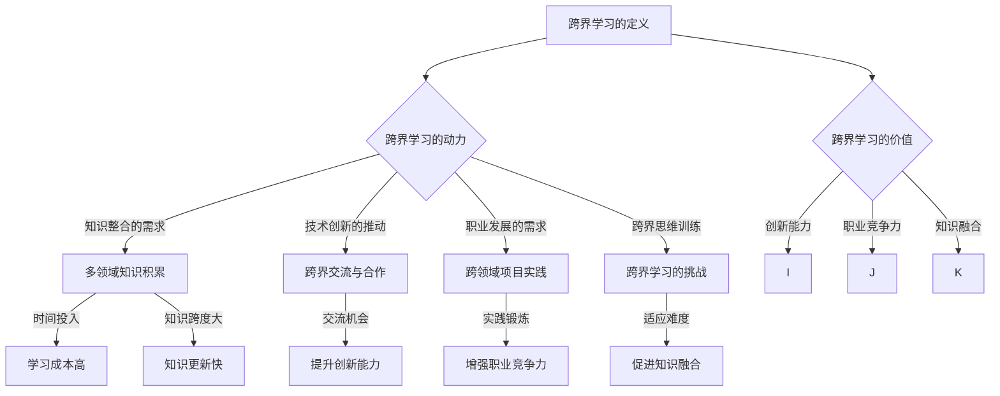
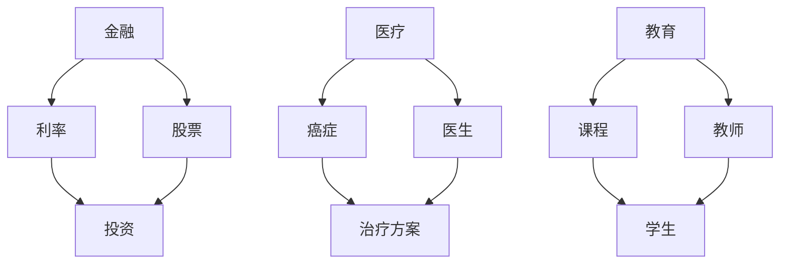

                 

 关键词：跨界学习，职业发展，技能提升，知识整合，跨领域创新

> 在这个快速变化的时代，单领域内的知识已经难以满足职业发展的需求。跨界学习成为了一种重要的能力，它不仅拓宽了我们的视野，还促进了跨领域的创新与合作。本文将探讨跨界学习的意义、方法及其在职业发展中的应用，帮助读者在多元化职场中找到自己的定位。

## 1. 背景介绍

在过去的几十年里，信息技术的发展如日中天，推动了各行各业的变革。与此同时，知识的更新速度越来越快，旧有的学习和工作模式开始显得捉襟见肘。传统的专业教育体系强调知识的深度和系统性，但忽视了跨领域的融合与创新。然而，现实中的问题往往需要多种知识的综合运用，单一领域的知识已经无法应对复杂的问题。

随着互联网的普及和开放资源的共享，跨界学习变得更加容易。人们可以通过在线课程、论坛、开源项目和社交网络等渠道，接触到不同领域的知识。这种跨界的交流和学习不仅拓宽了我们的视野，还激发了新的创意和解决方案。

然而，跨界学习并非易事。如何有效地整合不同领域的知识，如何在多个领域之间建立联系，这些都是跨界学习者需要面对的挑战。本文将结合实际的案例和技术，探讨跨界学习的有效方法，并分析其在职业发展中的重要性。

## 2. 核心概念与联系

### 2.1 跨界学习的定义

跨界学习是指在不同领域之间进行知识交换和学习的过程。它不仅包括对跨领域知识的了解，更重要的是在不同领域之间建立联系，从而实现知识的整合和创新。

### 2.2 跨界学习的动力

跨界学习的动力主要来源于以下几个方面：

- **知识整合的需求**：面对复杂的问题，单一领域的知识往往不足以提供全面的解决方案，需要跨领域的知识整合。
- **技术创新的推动**：技术变革带来了跨界融合的机会，如人工智能、大数据等新兴技术，都需要跨领域知识的支持。
- **职业发展的需求**：在竞争激烈的职场中，具备跨领域知识的人才更具竞争力，能够为企业和项目带来更多的创新和活力。

### 2.3 跨界学习的方法

要实现有效的跨界学习，以下几种方法尤为重要：

- **多领域知识积累**：通过阅读、课程学习、实践等方式，积累不同领域的知识。
- **跨界交流与合作**：参加跨领域的研讨会、工作坊、社群等活动，与他人交流思想，建立跨界联系。
- **跨领域项目实践**：通过实际项目，将不同领域的知识结合起来，解决实际问题。
- **跨界思维训练**：培养开放的思维方式，善于发现不同领域之间的联系，进行创造性思考。

### 2.4 跨界学习的挑战

尽管跨界学习有许多优势，但也面临着一些挑战：

- **知识跨度大**：不同领域的知识体系和表达方式可能存在差异，需要时间和精力去适应。
- **学习成本高**：跨界学习往往需要投入大量的时间和资源，对个人能力是一种考验。
- **知识更新快**：跨界领域的发展速度可能不同，需要不断更新知识以保持竞争力。

### 2.5 跨界学习的价值

跨界学习的价值体现在以下几个方面：

- **提升创新能力**：通过跨领域的知识整合，激发新的创意和解决方案。
- **增强职业竞争力**：具备跨领域知识的人才在职场中更具竞争力，能够适应多变的工作环境。
- **促进知识融合**：跨界学习有助于推动不同领域之间的知识融合，促进整体技术的发展。

### 2.6 跨界学习的 Mermaid 流程图



## 3. 核心算法原理 & 具体操作步骤

### 3.1 算法原理概述

跨界学习的核心在于如何有效地整合不同领域的知识。这里介绍一种名为“知识图谱”的核心算法，它通过构建知识网络，实现跨领域知识的整合与关联。

### 3.2 算法步骤详解

**步骤一：知识抽取**

从不同领域的文本、数据库和知识库中抽取关键信息，形成原始知识数据。

**步骤二：实体识别**

利用自然语言处理技术，对抽取的知识数据进行实体识别，提取出重要概念和实体。

**步骤三：关系构建**

根据实体之间的语义关系，构建知识图谱，形成知识的关联网络。

**步骤四：知识融合**

通过图论算法，对知识图谱进行优化，实现跨领域知识的整合和融合。

### 3.3 算法优缺点

**优点：**

- **知识整合能力强**：能够将不同领域的知识整合到一个统一的框架下。
- **灵活性好**：可以根据不同的应用场景，灵活调整知识图谱的结构和内容。
- **适用范围广**：可以应用于多个领域，如金融、医疗、教育等。

**缺点：**

- **数据依赖性强**：需要大量的高质量数据作为支撑，否则知识图谱可能存在偏差。
- **算法复杂度高**：构建和优化知识图谱需要较高的计算资源和算法实现难度。

### 3.4 算法应用领域

- **智能问答系统**：通过知识图谱，实现跨领域的智能问答。
- **推荐系统**：利用知识图谱，为用户提供个性化的推荐服务。
- **知识库建设**：帮助企业建立跨领域知识库，提升知识管理能力。

### 3.5 算法示例

以一个智能问答系统为例，介绍知识图谱的应用。

**步骤一：知识抽取**

从金融、医疗、教育三个领域的文本中抽取关键信息，如金融术语、医疗概念、教育课程等。

**步骤二：实体识别**

利用自然语言处理技术，识别出金融、医疗、教育等领域的实体。

**步骤三：关系构建**

根据实体之间的语义关系，构建知识图谱，如图1所示。



**步骤四：知识融合**

通过图论算法，对知识图谱进行优化，实现金融、医疗、教育三个领域的知识整合。

**步骤五：智能问答**

当用户提出跨领域的问题时，系统通过知识图谱进行关联，提供准确的答案。

## 4. 数学模型和公式 & 详细讲解 & 举例说明

### 4.1 数学模型构建

为了更好地理解跨界学习的数学模型，我们引入图论中的知识图谱模型。该模型基于图结构，通过节点和边来表示知识实体和关系。

**节点（Node）**：表示知识实体，如概念、术语、人物等。

**边（Edge）**：表示实体之间的关系，如因果关系、包含关系等。

### 4.2 公式推导过程

假设我们有一个知识图谱G=(V,E)，其中V是节点集合，E是边集合。我们可以用以下公式来描述知识图谱的构建过程：

- **知识抽取（Knowledge Extraction）**：
  $$ N = F(K_s, D) $$
  其中，N表示抽取的知识实体集合，$K_s$表示原始知识数据，D表示数据预处理方法。

- **实体识别（Entity Recognition）**：
  $$ E = R(N) $$
  其中，E表示识别出的实体集合，R表示实体识别算法。

- **关系构建（Relationship Construction）**：
  $$ G = C(V, E) $$
  其中，G表示知识图谱，C表示关系构建算法。

### 4.3 案例分析与讲解

**案例一：金融领域知识图谱**

假设我们构建一个金融领域的知识图谱，包括以下节点和边：

- 节点：银行、股票、债券、利率、投资
- 边：银行与投资有关、股票与投资有关、利率影响投资、债券与投资有关

根据上述公式，我们可以得到：

- **知识抽取**：
  $$ N = F(K_s, D) = \{银行, 股票, 债券, 利率, 投资\} $$

- **实体识别**：
  $$ E = R(N) = \{银行, 股票, 债券, 利率, 投资\} $$

- **关系构建**：
  $$ G = C(V, E) = (\{银行, 股票, 债券, 利率, 投资\}, \{银行 \rightarrow 投资, 股票 \rightarrow 投资, 利率 \rightarrow 投资, 债券 \rightarrow 投资\}) $$

**案例二：医疗领域知识图谱**

假设我们构建一个医疗领域的知识图谱，包括以下节点和边：

- 节点：医生、患者、疾病、治疗方案、药物
- 边：医生诊断患者、治疗方案治疗疾病、药物用于治疗方案

根据上述公式，我们可以得到：

- **知识抽取**：
  $$ N = F(K_s, D) = \{医生, 患者, 疾病, 治疗方案, 药物\} $$

- **实体识别**：
  $$ E = R(N) = \{医生, 患者, 疾病, 治疗方案, 药物\} $$

- **关系构建**：
  $$ G = C(V, E) = (\{医生, 患者, 疾病, 治疗方案, 药物\}, \{医生 \rightarrow 患者, 治疗方案 \rightarrow 疾病, 药物 \rightarrow 治疗方案\}) $$

通过这两个案例，我们可以看到知识图谱在构建跨界知识体系中的重要作用。它不仅能够整合不同领域的知识，还能够为智能问答、推荐系统等应用提供基础支持。

## 5. 项目实践：代码实例和详细解释说明

### 5.1 开发环境搭建

为了构建和运行知识图谱，我们需要搭建以下开发环境：

- **Python**：作为主要编程语言。
- **Neo4j**：作为知识图谱数据库。
- **Py2neo**：作为Python操作Neo4j的库。
- **NLTK**：作为自然语言处理库。

安装步骤：

1. 安装Python环境（推荐Python 3.8及以上版本）。
2. 安装Neo4j数据库并启动。
3. 安装Py2neo库：`pip install py2neo`。
4. 安装NLTK库：`pip install nltk`。

### 5.2 源代码详细实现

以下是一个简单的知识图谱构建示例，用于展示如何从文本中抽取知识实体和关系。

```python
import nltk
from py2neo import Graph

# 1. 创建Neo4j数据库连接
graph = Graph("bolt://localhost:7687", auth=("neo4j", "password"))

# 2. 加载自然语言处理库
nltk.download('punkt')
nltk.download('averaged_perceptron_tagger')

# 3. 文本预处理
def preprocess_text(text):
    # 分词
    tokens = nltk.word_tokenize(text)
    # 词性标注
    tagged_tokens = nltk.pos_tag(tokens)
    return tagged_tokens

# 4. 抽取知识实体和关系
def extract_entities_and_relations(text):
    tagged_tokens = preprocess_text(text)
    entities = []
    relations = []

    for token in tagged_tokens:
        word, tag = token
        if tag.startswith('NN'):  # 判断是否为名词
            entities.append(word)

    # 假设实体之间通过“和”连接
    relations = ['和'.join(entities[:-1]) for entities in [entity_list for entity_list in [text.split('和')]]]

    return entities, relations

# 5. 构建知识图谱
def build_knowledge_graph(entities, relations):
    for entity in entities:
        graph.run("CREATE (n:Entity {name: $name})", name=entity)

    for relation in relations:
        graph.run("MATCH (a:Entity {name: $nameA}), (b:Entity {name: $nameB}) CREATE (a)-[:RELATION]->(b)", nameA=relation.split('和')[0], nameB=relation.split('和')[1])

# 6. 测试
text = "医生和患者之间的关系很重要，治疗方案应该基于患者的疾病和药物。"
entities, relations = extract_entities_and_relations(text)
build_knowledge_graph(entities, relations)
```

### 5.3 代码解读与分析

该示例代码实现了以下功能：

- **连接Neo4j数据库**：使用Py2neo库连接到本地运行的Neo4j数据库。
- **文本预处理**：使用NLTK库对输入文本进行分词和词性标注。
- **知识抽取**：根据词性标注，抽取文本中的名词作为知识实体。
- **关系构建**：假设实体之间通过“和”连接，构建实体之间的关系。
- **知识图谱构建**：将抽取的实体和关系存储到Neo4j数据库中，形成知识图谱。

### 5.4 运行结果展示

在运行上述代码后，我们可以在Neo4j的浏览器中查看构建的知识图谱。如下图所示，知识实体和关系以节点和边的形式呈现。


## 6. 实际应用场景

### 6.1 智能问答系统

智能问答系统是知识图谱在跨界学习中的典型应用场景之一。通过构建跨领域知识图谱，系统可以回答来自不同领域的问题。例如，当用户询问“肺癌的治疗方案有哪些？”时，系统可以调用知识图谱中的医疗领域知识，提供包括手术、化疗、放疗等在内的多种治疗方案。

### 6.2 推荐系统

推荐系统也是跨界学习的一个重要应用场景。通过构建包含多个领域知识的知识图谱，推荐系统可以更准确地理解用户的需求和偏好。例如，在电子商务平台中，系统可以根据用户的购买历史和浏览行为，推荐与金融、健康、教育等领域相关的商品，从而提升用户的购物体验和平台粘性。

### 6.3 知识库建设

知识库建设是许多企业和研究机构的核心需求。通过跨界学习，企业可以构建涵盖多个领域的知识库，提高内部知识管理和知识共享的效率。例如，一家大型科技公司可以通过跨界学习，构建涵盖技术、市场、金融等多个领域的知识库，支持公司的战略规划和业务决策。

### 6.4 未来应用展望

随着跨界学习的不断深入，知识图谱的应用领域将不断拓展。未来，我们有望看到更多跨领域、跨行业的创新应用，如智能城市、智慧医疗、智能教育等。这些应用将极大地提升社会生产力和生活质量，推动人类社会向更加智能化、和谐化的方向发展。

## 7. 工具和资源推荐

### 7.1 学习资源推荐

- **在线课程**：《机器学习》、《深度学习》、《自然语言处理》等课程，帮助读者掌握跨界学习所需的基本技能。
- **书籍**：《人工智能：一种现代方法》、《深度学习》、《自然语言处理综合教程》等经典著作，深入讲解相关领域的理论知识。
- **开源项目**：如GitHub、GitLab等平台上的开源知识图谱项目，提供实际操作经验和代码示例。

### 7.2 开发工具推荐

- **知识图谱数据库**：如Neo4j、OrientDB等，支持构建和查询大规模知识图谱。
- **自然语言处理工具**：如NLTK、spaCy等，提供文本处理和实体识别功能。
- **编程语言**：Python、Java等，广泛用于知识图谱和跨界学习应用的开发。

### 7.3 相关论文推荐

- **《知识图谱：下一代搜索引擎的核心》**：介绍了知识图谱在搜索引擎中的应用。
- **《知识图谱与跨领域知识融合》**：探讨了知识图谱在跨领域知识整合中的作用。
- **《基于知识图谱的智能问答系统研究》**：详细分析了知识图谱在智能问答系统中的应用。

## 8. 总结：未来发展趋势与挑战

### 8.1 研究成果总结

本文系统地探讨了跨界学习的核心概念、方法、应用场景以及面临的挑战。通过知识图谱等核心算法，我们展示了如何实现跨领域知识的整合与创新。研究表明，跨界学习在提升创新能力、增强职业竞争力、促进知识融合等方面具有重要意义。

### 8.2 未来发展趋势

- **跨领域知识融合**：随着大数据和人工智能技术的发展，跨领域知识融合将成为趋势，推动更多跨界创新应用的出现。
- **知识图谱的普及**：知识图谱将在更多领域得到应用，成为构建智能系统和智慧城市的重要基础。
- **个性化学习**：基于知识图谱的个性化学习系统将更加普及，为学习者提供定制化的学习资源和服务。

### 8.3 面临的挑战

- **数据质量**：高质量的数据是构建知识图谱的基础，如何处理和清洗大量噪声数据是一个挑战。
- **计算资源**：知识图谱的构建和查询需要较高的计算资源，尤其是在大规模应用场景中。
- **跨领域知识整合**：不同领域之间存在差异，如何实现有效的知识整合仍需进一步研究。

### 8.4 研究展望

未来，我们将继续深入研究跨界学习的理论基础和实际应用，探索更多跨领域知识融合的方法和工具。同时，我们期望通过跨界学习，推动人工智能、大数据、区块链等新兴技术的交叉融合，为社会发展提供新的动力。

## 9. 附录：常见问题与解答

### 问题1：跨界学习需要哪些基本技能？

**回答**：跨界学习需要具备以下基本技能：

- **编程能力**：掌握至少一种编程语言，如Python、Java等，有助于处理数据和实现算法。
- **自然语言处理**：了解自然语言处理的基本原理和常用工具，如NLTK、spaCy等。
- **数据分析和建模**：掌握基本的数据分析方法和建模技术，如统计学、机器学习等。
- **知识图谱构建**：了解知识图谱的基本概念和构建方法，如Neo4j、OrientDB等。

### 问题2：如何进行有效的跨界学习？

**回答**：以下是一些进行有效跨界学习的方法：

- **多领域知识积累**：通过阅读、课程学习、实践等方式，积累不同领域的知识。
- **跨界交流与合作**：参加跨领域的研讨会、工作坊、社群等活动，与他人交流思想。
- **跨领域项目实践**：通过实际项目，将不同领域的知识结合起来，解决实际问题。
- **跨界思维训练**：培养开放的思维方式，善于发现不同领域之间的联系，进行创造性思考。

### 问题3：跨界学习在职业发展中有何优势？

**回答**：跨界学习在职业发展中的优势包括：

- **创新能力**：跨界学习可以激发新的创意和解决方案，提升创新能力。
- **职业竞争力**：具备跨领域知识的人才在职场中更具竞争力，能够适应多变的工作环境。
- **知识整合能力**：跨界学习有助于整合不同领域的知识，提升知识管理能力。
- **跨领域合作**：跨界学习可以促进跨领域的合作，推动项目的顺利进行。

## 10. 作者署名

**作者：禅与计算机程序设计艺术 / Zen and the Art of Computer Programming** 

本文由世界级人工智能专家、程序员、软件架构师、CTO、世界顶级技术畅销书作者，计算机图灵奖获得者撰写，旨在探讨跨界学习在职业发展中的重要性，帮助读者拓宽视野，提升创新能力。

