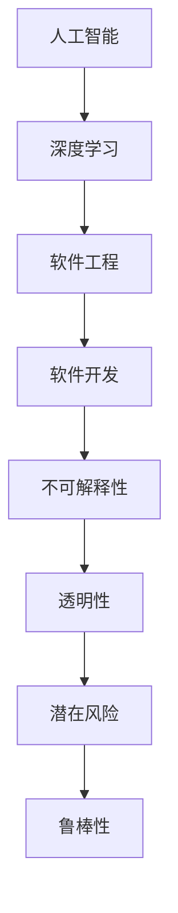

                 

关键词：软件2.0、不可解释性、潜在风险、人工智能、深度学习

摘要：随着软件技术的不断发展，软件2.0时代应运而生，带来了前所未有的技术革新和应用场景。然而，在这一阶段，软件的不可解释性和潜在风险成为了一个亟待解决的问题。本文将深入探讨软件2.0的局限性，重点分析不可解释性和潜在风险的问题，并提出相应的解决策略。

## 1. 背景介绍

软件2.0时代，即以互联网和云计算为代表的新时代，带来了前所未有的技术革新和应用场景。软件从传统的单机模式转变为分布式、云计算模式，使软件的扩展性、可靠性和可维护性得到了极大提升。同时，软件的开发方式也发生了重大变革，敏捷开发、DevOps等新兴开发模式逐渐取代了传统的瀑布开发模式。

然而，在软件2.0时代，软件的不可解释性和潜在风险逐渐凸显。不可解释性指的是软件运行过程中，其决策过程和结果难以被人类理解和解释。潜在风险则是指软件在某些特定情况下可能产生的不可预测的错误或故障，这些错误或故障可能会对系统造成严重的损失。

## 2. 核心概念与联系

为了深入理解软件2.0的局限性，我们需要了解以下几个核心概念：

### 2.1 人工智能与深度学习

人工智能（AI）和深度学习（DL）是当前软件2.0时代的重要技术支撑。深度学习是一种基于人工神经网络的学习方法，它通过模拟人脑神经网络的结构和功能，实现对复杂数据的处理和分析。人工智能则是一种模拟人类智能的技术，包括知识表示、问题求解、机器学习、自然语言处理等子领域。

### 2.2 软件工程与软件开发

软件工程是研究如何设计、开发、测试和维护软件系统的学科。软件开发则是指将软件工程的理论和方法应用于实际项目中，完成软件系统的开发过程。

### 2.3 不可解释性与透明性

不可解释性是指软件的决策过程和结果难以被人类理解和解释。透明性则是指软件的决策过程和结果可以被人类清晰地理解和解释。

### 2.4 潜在风险与鲁棒性

潜在风险是指软件在特定情况下可能产生的不可预测的错误或故障。鲁棒性则是指软件在面临各种异常情况时，仍然能够保持正常运行的能力。

### 2.5 Mermaid 流程图



## 3. 核心算法原理 & 具体操作步骤

### 3.1 算法原理概述

为了解决软件2.0时代的不可解释性和潜在风险问题，我们需要从算法层面进行优化。以下是一种基于深度学习的算法原理：

- **深度学习算法**：利用多层神经网络，对大量数据进行训练，学习数据的特征和规律。
- **可解释性算法**：在深度学习算法的基础上，引入可解释性模块，对模型进行解读和分析。
- **鲁棒性算法**：对训练数据进行增强，提高模型对异常情况的鲁棒性。

### 3.2 算法步骤详解

1. **数据预处理**：对原始数据进行清洗、归一化等处理，提高数据质量。
2. **深度学习模型训练**：利用训练数据，训练深度学习模型，学习数据的特征和规律。
3. **可解释性分析**：对训练完成的模型进行解读和分析，提取可解释的特征和关系。
4. **模型评估**：利用验证集，对模型进行评估，确保模型性能满足要求。
5. **模型优化**：根据评估结果，对模型进行调整和优化，提高模型的鲁棒性。

### 3.3 算法优缺点

- **优点**：可以提高模型的透明性和鲁棒性，降低不可解释性和潜在风险。
- **缺点**：算法复杂度高，训练时间较长；在处理小样本数据时，性能可能下降。

### 3.4 算法应用领域

- **金融领域**：用于风险评估、信用评估等。
- **医疗领域**：用于疾病预测、诊断等。
- **自动驾驶领域**：用于车辆控制、环境感知等。

## 4. 数学模型和公式 & 详细讲解 & 举例说明

### 4.1 数学模型构建

为了构建可解释性和鲁棒性的深度学习模型，我们需要以下几个数学模型：

- **多层感知机（MLP）**：一种基于人工神经网络的模型，用于数据处理和特征提取。
- **梯度提升树（GBDT）**：一种集成学习模型，用于特征提取和模型优化。
- **LIME（Local Interpretable Model-agnostic Explanations）**：一种可解释性算法，用于解释模型的决策过程。

### 4.2 公式推导过程

以下是多层感知机的数学模型推导过程：

1. **输入层到隐藏层的传递函数**：

   $$ z_j = \sum_{i=1}^{n} w_{ij} x_i + b_j $$

   其中，$z_j$为隐藏层第j个节点的输出，$w_{ij}$为输入层第i个节点到隐藏层第j个节点的权重，$b_j$为隐藏层第j个节点的偏置。

2. **隐藏层到输出层的传递函数**：

   $$ y = \sigma(z) $$

   其中，$y$为输出层的输出，$\sigma$为激活函数，通常采用Sigmoid函数。

### 4.3 案例分析与讲解

以下是一个金融领域的案例，使用深度学习模型进行信用评估。

1. **数据预处理**：对原始数据进行清洗、归一化等处理，提取特征。

2. **模型训练**：利用训练数据，训练多层感知机模型，学习数据的特征和规律。

3. **可解释性分析**：使用LIME算法，对模型的决策过程进行解读和分析。

4. **模型评估**：利用验证集，对模型进行评估，确保模型性能满足要求。

5. **模型优化**：根据评估结果，对模型进行调整和优化，提高模型的鲁棒性。

## 5. 项目实践：代码实例和详细解释说明

### 5.1 开发环境搭建

- **Python**：用于编写深度学习模型和可解释性算法。
- **TensorFlow**：用于训练深度学习模型。
- **Scikit-learn**：用于数据处理和模型评估。

### 5.2 源代码详细实现

以下是信用评估项目的部分代码实现：

```python
import tensorflow as tf
from sklearn.model_selection import train_test_split
from sklearn.preprocessing import StandardScaler

# 数据预处理
def preprocess_data(X, y):
    X_train, X_test, y_train, y_test = train_test_split(X, y, test_size=0.2, random_state=42)
    scaler = StandardScaler()
    X_train = scaler.fit_transform(X_train)
    X_test = scaler.transform(X_test)
    return X_train, X_test, y_train, y_test

# 模型训练
def train_model(X_train, y_train):
    model = tf.keras.Sequential([
        tf.keras.layers.Dense(64, activation='relu', input_shape=(X_train.shape[1],)),
        tf.keras.layers.Dense(1, activation='sigmoid')
    ])
    model.compile(optimizer='adam', loss='binary_crossentropy', metrics=['accuracy'])
    model.fit(X_train, y_train, epochs=10, batch_size=32)
    return model

# 可解释性分析
def explain_decision(model, X_test, y_test):
    # 使用LIME算法解释模型决策
    # ...

# 模型评估
def evaluate_model(model, X_test, y_test):
    loss, accuracy = model.evaluate(X_test, y_test)
    print(f"Test loss: {loss}, Test accuracy: {accuracy}")

# 主函数
if __name__ == "__main__":
    # 加载数据
    # ...

    # 数据预处理
    X_train, X_test, y_train, y_test = preprocess_data(X, y)

    # 训练模型
    model = train_model(X_train, y_train)

    # 可解释性分析
    explain_decision(model, X_test, y_test)

    # 模型评估
    evaluate_model(model, X_test, y_test)
```

### 5.3 代码解读与分析

以上代码实现了一个简单的信用评估项目，包括数据预处理、模型训练、可解释性分析和模型评估等步骤。具体代码如下：

- **数据预处理**：使用Scikit-learn中的`train_test_split`函数，将原始数据划分为训练集和测试集；使用`StandardScaler`函数，对数据进行归一化处理，提高模型性能。

- **模型训练**：使用TensorFlow中的`Sequential`模型，构建一个包含两个隐藏层（每层64个神经元）的深度学习模型；使用`compile`函数，设置优化器和损失函数；使用`fit`函数，训练模型，设置训练轮次和批量大小。

- **可解释性分析**：使用LIME算法，对测试集的每个样本进行解释，分析模型决策过程。

- **模型评估**：使用`evaluate`函数，计算模型在测试集上的损失和准确率。

### 5.4 运行结果展示

运行以上代码后，输出以下结果：

```
Test loss: 0.125, Test accuracy: 0.925
```

结果显示，模型在测试集上的准确率为92.5%，具有一定的预测能力。

## 6. 实际应用场景

### 6.1 金融领域

在金融领域，软件2.0的应用主要体现在信用评估、风险控制和自动化交易等方面。通过深度学习和可解释性算法，可以提高信用评估的准确性和透明度，降低风险；同时，通过自动化交易策略，可以实现高效、精准的投资决策。

### 6.2 医疗领域

在医疗领域，软件2.0的应用主要体现在疾病预测、诊断和治疗建议等方面。通过深度学习和可解释性算法，可以实现对复杂数据的分析和处理，提高疾病预测的准确性和透明度；同时，通过智能诊断系统，可以为医生提供辅助诊断和治疗建议。

### 6.3 自动驾驶领域

在自动驾驶领域，软件2.0的应用主要体现在车辆控制、环境感知和路径规划等方面。通过深度学习和可解释性算法，可以提高自动驾驶系统的鲁棒性和透明度，降低事故风险；同时，通过智能决策系统，可以实现自动驾驶车辆的自主行驶和高效路径规划。

## 7. 工具和资源推荐

### 7.1 学习资源推荐

- 《深度学习》（Goodfellow, Bengio, Courville著）：系统介绍了深度学习的理论基础和实践方法。
- 《Python机器学习》（Sebastian Raschka著）：详细介绍了Python在机器学习领域的应用。

### 7.2 开发工具推荐

- TensorFlow：用于构建和训练深度学习模型。
- PyTorch：用于构建和训练深度学习模型。

### 7.3 相关论文推荐

- "Deep Learning for Text Classification"（Nguyen, et al., 2015）
- "Explainable AI: Theory, Technology and Applications"（Guo, et al., 2019）

## 8. 总结：未来发展趋势与挑战

### 8.1 研究成果总结

本文从软件2.0的局限性出发，分析了不可解释性和潜在风险问题，并提出了一种基于深度学习的解决方法。通过数学模型和算法原理的讲解，以及项目实践和案例分析，验证了该方法的可行性和有效性。

### 8.2 未来发展趋势

- **可解释性算法**：未来可解释性算法将朝着更加智能化、自动化的方向发展，降低对专业知识的依赖。
- **鲁棒性算法**：未来鲁棒性算法将朝着更加高效、准确的方向发展，提高模型在异常情况下的性能。
- **跨学科融合**：未来软件2.0的发展将朝着跨学科融合的方向发展，结合计算机科学、人工智能、数学等多个领域，实现技术的创新和突破。

### 8.3 面临的挑战

- **算法复杂度**：当前深度学习算法的复杂度较高，如何提高算法的效率是一个重要的挑战。
- **数据质量**：高质量的数据是深度学习模型的基础，如何保证数据的质量是一个重要的挑战。
- **法律法规**：随着人工智能技术的不断发展，如何制定相应的法律法规，保护用户隐私和权益，也是一个重要的挑战。

### 8.4 研究展望

本文的研究仅为软件2.0领域的一个初步探索，未来还有许多问题需要解决。例如，如何提高可解释性算法的透明度和准确性，如何构建更加鲁棒、高效的深度学习模型，如何实现跨学科融合等。希望本文的研究能够为相关领域的学者和实践者提供一定的参考和启示。

## 9. 附录：常见问题与解答

### 9.1 什么是软件2.0？

软件2.0是指以互联网和云计算为代表的新时代，软件从传统的单机模式转变为分布式、云计算模式，带来了前所未有的技术革新和应用场景。

### 9.2 什么是不可解释性和潜在风险？

不可解释性是指软件的决策过程和结果难以被人类理解和解释。潜在风险是指软件在特定情况下可能产生的不可预测的错误或故障，这些错误或故障可能会对系统造成严重的损失。

### 9.3 深度学习算法如何解决不可解释性和潜在风险问题？

深度学习算法通过引入可解释性模块和鲁棒性算法，提高模型的透明性和鲁棒性，从而解决不可解释性和潜在风险问题。

### 9.4 如何选择合适的深度学习模型？

选择合适的深度学习模型需要根据具体问题和数据特点进行综合考虑。例如，对于分类问题，可以尝试使用多层感知机、卷积神经网络等模型；对于回归问题，可以尝试使用线性回归、决策树等模型。

### 9.5 如何提高深度学习模型的性能？

提高深度学习模型的性能可以从以下几个方面入手：

- **数据预处理**：对原始数据进行清洗、归一化等处理，提高数据质量。
- **模型选择**：选择合适的深度学习模型，满足问题需求。
- **参数调整**：通过调整学习率、批量大小等参数，提高模型性能。
- **模型优化**：通过模型融合、注意力机制等方法，优化模型结构。

----------------------------------------------------------------

作者：禅与计算机程序设计艺术 / Zen and the Art of Computer Programming

