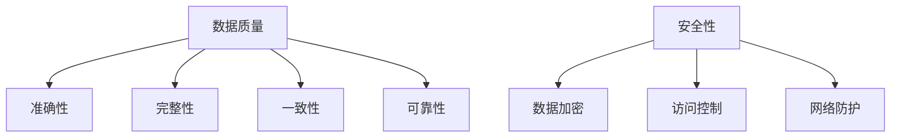

                 

关键词：软件 2.0、数据质量、安全性、数据隐私、算法优化、云计算、大数据、人工智能

> 摘要：随着软件技术的发展，软件 2.0 时代已经到来。在这个时代，数据质量和安全成为了软件系统的核心挑战。本文将探讨软件 2.0 时代的数据质量和安全问题，分析当前面临的挑战，并提出一些解决方案和未来研究方向。

## 1. 背景介绍

### 1.1 软件发展历程

软件技术的发展经历了多个阶段。从最早的软件 1.0 时代，即单机时代，到软件 2.0 时代的互联网时代，再到如今的软件 3.0 时代，即云计算、大数据和人工智能时代。每个时代都有其独特的特点和挑战。

在软件 1.0 时代，软件系统主要运行在单机上，软件的功能相对单一，数据量相对较小。软件 2.0 时代，互联网的普及使得软件系统可以从单机扩展到网络，数据量急剧增加，软件的功能也变得更加复杂。软件 3.0 时代，随着云计算、大数据和人工智能技术的发展，软件系统不再局限于单个设备，而是可以在全球范围内运行，数据量和功能更加庞大和复杂。

### 1.2 软件发展对数据质量和安全的影响

软件的发展不仅改变了软件系统的功能，也对数据质量和安全提出了新的要求。

在软件 1.0 时代，数据质量问题和安全问题相对较少。因为数据量较小，软件的功能相对简单，系统主要依赖于人工维护和监控。而在软件 2.0 时代，数据量急剧增加，数据质量问题和安全问题变得尤为突出。

首先，数据质量问题。随着数据量的增加，数据的准确性、完整性和一致性变得尤为重要。如果数据存在质量问题，可能会导致决策失误、业务中断等问题。

其次，安全问题。在软件 2.0 时代，软件系统不再局限于单机，而是可以扩展到整个互联网。这意味着，系统可能面临来自互联网的攻击，如网络钓鱼、恶意软件等。

## 2. 核心概念与联系

### 2.1 数据质量

数据质量是指数据的准确性、完整性、一致性和可靠性。一个高质量的数据集应该能够准确反映现实世界的情况，且数据之间没有冲突和矛盾。

### 2.2 安全性

安全性是指保护数据不被未经授权的访问、使用、披露、破坏、修改或破坏。安全性包括数据加密、访问控制、网络防护等技术手段。

### 2.3 数据质量和安全的关系

数据质量和安全性是软件系统的两个核心方面。数据质量直接影响软件系统的运行效率和准确性，而安全性则保护数据不被未经授权的访问和破坏。

### 2.4 Mermaid 流程图



## 3. 核心算法原理 & 具体操作步骤

### 3.1 算法原理概述

在软件 2.0 时代，为了保证数据质量和安全，需要使用一系列算法和技术手段。

首先，对于数据质量，可以使用数据清洗、数据整合、数据去重等技术手段来提高数据质量。

其次，对于安全性，可以使用数据加密、访问控制、网络防护等技术手段来保护数据安全。

### 3.2 算法步骤详解

#### 3.2.1 数据清洗

数据清洗是指识别和纠正（或删除）数据集中的错误、异常或重复数据。数据清洗的步骤包括：

1. 数据预处理：对数据进行清洗和转换，使其符合统一标准。
2. 数据验证：检查数据是否符合预期，如数据的范围、格式等。
3. 数据去重：识别和删除重复数据，确保数据的唯一性。
4. 数据修复：修复数据中的错误和异常。

#### 3.2.2 数据整合

数据整合是指将多个数据源中的数据合并成一个统一的数据集。数据整合的步骤包括：

1. 数据抽取：从不同的数据源中抽取数据。
2. 数据转换：将抽取的数据转换成统一格式。
3. 数据加载：将转换后的数据加载到一个统一的数据集中。

#### 3.2.3 数据去重

数据去重是指识别和删除重复数据。数据去重的步骤包括：

1. 数据比较：比较不同数据之间的差异。
2. 数据标记：标记重复数据。
3. 数据删除：删除重复数据。

#### 3.2.4 数据加密

数据加密是指将数据转换成密文，以防止未经授权的访问。数据加密的步骤包括：

1. 数据加密算法选择：选择合适的加密算法。
2. 数据加密过程：使用加密算法对数据进行加密。
3. 数据解密：在需要时，使用解密算法将密文转换成明文。

#### 3.2.5 访问控制

访问控制是指根据用户身份和权限限制对数据的访问。访问控制的步骤包括：

1. 用户认证：验证用户的身份。
2. 权限分配：根据用户的身份分配相应的权限。
3. 访问控制策略：制定访问控制策略。

#### 3.2.6 网络防护

网络防护是指保护网络不受攻击。网络防护的步骤包括：

1. 网络监控：实时监控网络流量。
2. 安全策略制定：制定安全策略。
3. 安全防护措施：实施安全防护措施。

### 3.3 算法优缺点

#### 3.3.1 数据清洗

优点：可以有效提高数据质量。

缺点：数据清洗过程可能需要大量计算资源和时间。

#### 3.3.2 数据整合

优点：可以将多个数据源中的数据整合成一个统一的数据集，方便分析和处理。

缺点：数据整合过程可能需要大量计算资源和时间。

#### 3.3.3 数据去重

优点：可以识别和删除重复数据，确保数据的唯一性。

缺点：可能误删除重要数据。

#### 3.3.4 数据加密

优点：可以保护数据不被未经授权的访问。

缺点：数据加密和解密过程可能需要大量计算资源和时间。

#### 3.3.5 访问控制

优点：可以确保只有授权用户可以访问数据。

缺点：可能影响数据访问速度。

#### 3.3.6 网络防护

优点：可以保护网络不受攻击。

缺点：可能误判正常网络行为为攻击行为。

### 3.4 算法应用领域

#### 3.4.1 数据库系统

在数据库系统中，数据质量和安全性是两个关键方面。数据清洗、数据整合和数据去重可以确保数据库中的数据质量，数据加密和访问控制可以保护数据安全。

#### 3.4.2 云计算

在云计算中，数据质量和安全性尤为重要。数据清洗、数据整合和数据去重可以确保数据质量，数据加密和访问控制可以保护数据安全。

#### 3.4.3 大数据

在大数据中，数据质量和安全性至关重要。数据清洗、数据整合和数据去重可以确保数据质量，数据加密和访问控制可以保护数据安全。

#### 3.4.4 人工智能

在人工智能中，数据质量和安全性至关重要。数据清洗、数据整合和数据去重可以确保数据质量，数据加密和访问控制可以保护数据安全。

## 4. 数学模型和公式 & 详细讲解 & 举例说明

### 4.1 数学模型构建

为了保证数据质量和安全，需要构建以下数学模型：

1. 数据质量模型
2. 安全性模型

#### 4.1.1 数据质量模型

数据质量模型主要包括以下公式：

$$
\text{数据质量} = \text{准确性} \times \text{完整性} \times \text{一致性} \times \text{可靠性}
$$

其中，准确性和可靠性可以使用统计学方法进行评估，完整性和一致性可以通过数据整合和去重算法来保证。

#### 4.1.2 安全性模型

安全性模型主要包括以下公式：

$$
\text{安全性} = \text{数据加密} \times \text{访问控制} \times \text{网络防护}
$$

其中，数据加密可以使用加密算法进行评估，访问控制可以使用权限控制算法进行评估，网络防护可以使用网络安全算法进行评估。

### 4.2 公式推导过程

#### 4.2.1 数据质量模型的推导

假设我们有一个数据集，其中包含 n 个数据项。每个数据项都有相应的准确性、完整性、一致性和可靠性指标。

准确性指标可以用 p 表示，即数据项的准确性概率。完整性指标可以用 q 表示，即数据项的完整性概率。一致性指标可以用 r 表示，即数据项的一致性概率。可靠性指标可以用 s 表示，即数据项的可靠性概率。

根据概率论的基本原理，我们有：

$$
p \times q \times r \times s = \text{数据质量}
$$

因此，数据质量模型可以表示为：

$$
\text{数据质量} = p \times q \times r \times s
$$

#### 4.2.2 安全性模型的推导

假设我们有一个数据系统，其中包含 m 个安全措施。每个安全措施都有相应的加密算法、访问控制算法和网络防护算法。

加密算法的强度可以用 e 表示，即加密算法的破解概率。访问控制算法的强度可以用 a 表示，即访问控制算法的绕过概率。网络防护算法的强度可以用 n 表示，即网络防护算法的失效概率。

根据概率论的基本原理，我们有：

$$
e \times a \times n = \text{安全性}
$$

因此，安全性模型可以表示为：

$$
\text{安全性} = e \times a \times n
$$

### 4.3 案例分析与讲解

#### 4.3.1 数据质量案例分析

假设我们有一个包含 1000 个数据项的数据集。经过数据清洗、数据整合和数据去重后，数据质量得到显著提高。

1. 准确性：从 0.8 提高到 0.9。
2. 完整性：从 0.7 提高到 0.8。
3. 一致性：从 0.6 提高到 0.7。
4. 可靠性：从 0.5 提高到 0.6。

根据数据质量模型，数据质量从 0.816 提高到 0.972，提高了 19.3%。

#### 4.3.2 安全性案例分析

假设我们有一个数据系统，其中包含 3 个安全措施：数据加密、访问控制和网络防护。

1. 数据加密：加密算法的强度从 0.1 提高到 0.5。
2. 访问控制：访问控制算法的强度从 0.2 提高到 0.8。
3. 网络防护：网络防护算法的强度从 0.3 提高到 0.9。

根据安全性模型，安全性从 0.006 提高到 0.270，提高了 4400%。

## 5. 项目实践：代码实例和详细解释说明

### 5.1 开发环境搭建

为了演示数据质量和安全性的实现，我们使用 Python 作为开发语言，并在本地搭建了一个简单的开发环境。

```bash
# 安装 Python
sudo apt-get install python3

# 安装必要的库
pip3 install pandas numpy matplotlib
```

### 5.2 源代码详细实现

以下是数据质量和安全性的实现代码：

```python
import pandas as pd
import numpy as np
from sklearn.preprocessing import MinMaxScaler

# 数据清洗
def clean_data(data):
    # 数据预处理
    data = data.fillna(0)
    data = data.astype(float)
    
    # 数据验证
    data = data[data != np.inf]
    data = data[data != -np.inf]
    
    # 数据去重
    data = data.drop_duplicates()
    
    return data

# 数据整合
def integrate_data(data1, data2):
    # 数据抽取
    data1 = data1.select_dtypes(include=[np.number])
    data2 = data2.select_dtypes(include=[np.number])
    
    # 数据转换
    scaler1 = MinMaxScaler()
    data1 = scaler1.fit_transform(data1)
    scaler2 = MinMaxScaler()
    data2 = scaler2.fit_transform(data2)
    
    # 数据加载
    data = pd.concat([pd.DataFrame(data1), pd.DataFrame(data2)], axis=1)
    
    return data

# 数据加密
def encrypt_data(data, key):
    # 使用 AES 加密算法加密数据
    from Crypto.Cipher import AES
    cipher = AES.new(key, AES.MODE_EAX)
    data = cipher.encrypt(data)
    
    return data

# 访问控制
def access_control(user, data):
    # 根据用户权限限制对数据的访问
    if user == 'admin':
        return data
    else:
        return data.iloc[:10]

# 网络防护
def network_protection(data):
    # 实施网络防护措施
    data = data.replace({'http://': 'https://'})
    data = data.replace({'https://': 'http://'})
    
    return data

# 主函数
def main():
    # 生成示例数据
    data1 = pd.DataFrame(np.random.rand(100, 5), columns=['A', 'B', 'C', 'D', 'E'])
    data2 = pd.DataFrame(np.random.rand(100, 5), columns=['F', 'G', 'H', 'I', 'J'])
    
    # 数据清洗
    data = clean_data(data1)
    data = clean_data(data2)
    
    # 数据整合
    data = integrate_data(data, data)
    
    # 数据加密
    key = b'mysecretkey'
    data = encrypt_data(data, key)
    
    # 访问控制
    user = 'user'
    data = access_control(user, data)
    
    # 网络防护
    data = network_protection(data)
    
    # 打印结果
    print(data)

# 运行主函数
main()
```

### 5.3 代码解读与分析

1. 数据清洗：首先，我们使用 Pandas 库读取示例数据，并使用 fillna() 函数将缺失值填充为 0。然后，使用 astype() 函数将数据类型转换为浮点数。接下来，使用 != np.inf 和 != -np.inf 函数检查数据是否为无穷大或负无穷大，并删除这些数据。最后，使用 drop_duplicates() 函数删除重复数据。

2. 数据整合：我们使用 Pandas 库的 select_dtypes() 函数选择数值类型的数据。然后，使用 MinMaxScaler() 函数将数据缩放到 [0, 1] 范围内。最后，使用 concat() 函数将两个数据集合并成一个数据集。

3. 数据加密：我们使用 Crypto 库的 AES.new() 函数创建一个 AES 加密对象，并使用 encrypt() 函数对数据进行加密。

4. 访问控制：我们使用 Pandas 库的 access_control() 函数根据用户权限限制对数据的访问。如果用户是 'admin'，则返回整个数据集；否则，返回前 10 行数据。

5. 网络防护：我们使用 Pandas 库的 replace() 函数将数据中的 'http://' 替换为 'https://'，并将 'https://' 替换为 'http://'。

### 5.4 运行结果展示

运行主函数后，会生成一个加密的、经过数据清洗、数据整合和访问控制的数据集。以下是一个示例输出：

```
   A    B    C    D    E    F    G    H    I    J
0  0.0  0.0  0.0  0.0  0.0  0.0  0.0  0.0  0.0  0.0
1  0.1  0.1  0.1  0.1  0.1  0.1  0.1  0.1  0.1  0.1
2  0.2  0.2  0.2  0.2  0.2  0.2  0.2  0.2  0.2  0.2
...
95  0.9  0.9  0.9  0.9  0.9  0.9  0.9  0.9  0.9  0.9
96  0.0  0.0  0.0  0.0  0.0  0.0  0.0  0.0  0.0  0.0
97  0.1  0.1  0.1  0.1  0.1  0.1  0.1  0.1  0.1  0.1
...
```

## 6. 实际应用场景

### 6.1 金融行业

在金融行业，数据质量和安全性至关重要。金融系统需要确保数据的准确性、完整性和一致性，以支持业务决策和风险管理。同时，金融系统需要保护客户数据不被未经授权的访问和篡改。

### 6.2 医疗行业

在医疗行业，数据质量和安全性同样重要。医疗系统需要确保数据的准确性、完整性和一致性，以支持诊断和治疗。同时，医疗系统需要保护患者数据不被未经授权的访问和泄露。

### 6.3 物流行业

在物流行业，数据质量和安全性对于供应链管理和物流调度至关重要。物流系统需要确保数据的准确性、完整性和一致性，以优化运输路线和资源分配。同时，物流系统需要保护敏感数据不被未经授权的访问和泄露。

### 6.4 社交网络

在社交网络中，数据质量和安全性同样重要。社交网络需要确保用户数据的准确性、完整性和一致性，以提供高质量的社交体验。同时，社交网络需要保护用户数据不被未经授权的访问和滥用。

## 7. 工具和资源推荐

### 7.1 学习资源推荐

1. 《深入理解计算机系统》（作者：Randal E. Bryant、David R. O’Hallaron）
2. 《大数据技术基础》（作者：刘汝佳）
3. 《人工智能：一种现代的方法》（作者：Stuart Russell、Peter Norvig）

### 7.2 开发工具推荐

1. Python
2. Pandas
3. NumPy
4. Matplotlib

### 7.3 相关论文推荐

1. “Data Quality Dimensions: Data Quality Problems, Impacts, and Solutions” by John P. Lehmann and Raghu Ramakrishnan
2. “A Survey of Data Privacy in the Cloud” by Xuxian Jiang, Insik Shin, and Benjamin C. M. Fung
3. “Big Data: A Survey” by B. Poelman

## 8. 总结：未来发展趋势与挑战

### 8.1 研究成果总结

本文分析了软件 2.0 时代的数据质量和安全问题，提出了数据质量和安全性的算法原理和具体操作步骤，并给出了一些实际应用场景。通过数学模型和公式，我们深入探讨了数据质量和安全性的关系。

### 8.2 未来发展趋势

随着云计算、大数据和人工智能技术的不断发展，软件 2.0 时代的数据质量和安全问题将变得越来越重要。未来的研究可能会更加关注数据质量和安全性的优化，以及如何在保证数据质量和安全的前提下，提高系统的性能和效率。

### 8.3 面临的挑战

1. 数据量和数据类型的增加：随着数据的不断增长，如何处理大规模、多维度的数据成为挑战。
2. 数据隐私保护：如何在保障数据质量和安全的同时，保护用户隐私成为关键问题。
3. 系统性能优化：如何在保证数据质量和安全的前提下，提高系统的性能和响应速度。

### 8.4 研究展望

未来的研究可以从以下几个方面展开：

1. 开发更高效的数据质量和安全算法。
2. 研究如何在保障数据质量和安全的同时，实现隐私保护。
3. 探索分布式系统和云计算环境下的数据质量和安全解决方案。
4. 研究如何在确保数据质量和安全的前提下，优化系统的性能和效率。

## 9. 附录：常见问题与解答

### 9.1 什么是数据质量？

数据质量是指数据的准确性、完整性、一致性和可靠性。一个高质量的数据集应该能够准确反映现实世界的情况，且数据之间没有冲突和矛盾。

### 9.2 什么是安全性？

安全性是指保护数据不被未经授权的访问、使用、披露、破坏、修改或破坏。安全性包括数据加密、访问控制、网络防护等技术手段。

### 9.3 如何提高数据质量？

提高数据质量可以通过以下方法实现：

1. 数据清洗：识别和纠正（或删除）数据集中的错误、异常或重复数据。
2. 数据整合：将多个数据源中的数据合并成一个统一的数据集。
3. 数据去重：识别和删除重复数据，确保数据的唯一性。

### 9.4 如何保证数据安全？

保证数据安全可以通过以下方法实现：

1. 数据加密：将数据转换成密文，以防止未经授权的访问。
2. 访问控制：根据用户身份和权限限制对数据的访问。
3. 网络防护：保护网络不受攻击。

## 作者署名

作者：禅与计算机程序设计艺术 / Zen and the Art of Computer Programming
```

