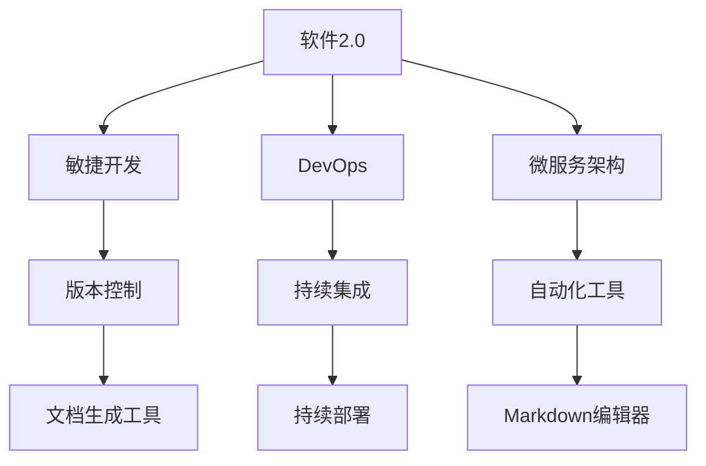

                 

 在当今快速发展的信息技术时代，软件2.0的概念逐渐成为业界关注的焦点。软件2.0不仅仅是一种技术趋势，更是一种新的开发理念，它要求开发者采用更高效、更灵活的方法来构建和维护软件系统。本文旨在探讨软件2.0环境下文档编写的新方法，帮助开发者更好地理解和应用这一理念。

> **关键词**：软件2.0、文档编写、开发方法论、敏捷开发、版本控制、自动化工具、持续集成。

> **摘要**：本文将深入分析软件2.0的基本概念及其对文档编写的要求，介绍一系列文档编写的最佳实践，包括版本控制、自动化工具的应用，以及敏捷开发模式下文档的动态更新。通过具体的案例分析和实践指导，本文旨在为开发者提供一套切实可行的文档编写方法。

## 1. 背景介绍

### 软件2.0的定义与特点

软件2.0，又称作“下一代软件”，是一种以用户为中心、强调灵活性、可扩展性和可维护性的软件开发范式。与传统的软件1.0（以单机应用为主）和软件1.5（以Web应用为主）不同，软件2.0更加注重用户体验、服务质量和生态系统的构建。

软件2.0的主要特点包括：

- **用户驱动**：软件2.0的核心在于满足用户需求，强调用户参与和反馈。
- **灵活性**：软件2.0要求系统能够快速适应市场变化和技术进步。
- **可扩展性**：系统设计应具备模块化和可扩展性，以支持未来功能的添加。
- **可维护性**：良好的文档和代码结构有助于降低维护成本，提高开发效率。
- **持续交付**：通过持续集成和持续部署，实现软件的快速迭代和交付。

### 文档编写的重要性

在软件2.0的开发模式中，文档编写不再是可有可无的辅助工作，而是软件开发过程中不可或缺的一环。良好的文档能够帮助团队成员更好地理解项目背景、系统架构、功能模块和代码逻辑，从而提高协作效率和代码质量。

具体来说，文档编写的重要性体现在以下几个方面：

- **知识传递**：文档是知识传递的重要媒介，可以帮助新成员快速融入项目。
- **代码审查**：清晰的文档有助于代码审查，提高代码质量。
- **版本控制**：良好的文档管理可以与代码库同步，确保文档与代码的一致性。
- **需求变更**：在需求变更时，文档能够记录变更的历史和原因，有助于团队成员理解。
- **项目管理**：文档可以为项目管理提供依据，帮助团队更好地进行任务分配和进度控制。

### 软件2.0对文档编写的新要求

软件2.0对文档编写提出了新的要求和挑战。首先，文档的编写不再仅限于传统的文字说明，还应该包括图表、示例代码和交互式内容，以更好地传达复杂概念和系统设计。其次，文档的编写过程应更加灵活和动态，以适应快速迭代和不断变化的需求。此外，文档的版本控制和自动化工具的应用也成为了软件2.0环境下的基本要求。

## 2. 核心概念与联系

### 软件开发方法论

在软件2.0的背景下，敏捷开发、DevOps和微服务架构等开发方法论得到了广泛应用。这些方法论不仅改变了传统的软件开发模式，也对文档编写提出了新的要求。

- **敏捷开发**：敏捷开发强调快速迭代和持续交付，要求文档能够灵活适应需求变化。
- **DevOps**：DevOps注重开发和运维的协同工作，要求文档涵盖部署流程、环境配置和监控指标。
- **微服务架构**：微服务架构要求模块化设计，文档应详细描述各个服务的接口和依赖关系。

### 版本控制

版本控制是软件2.0文档编写的重要环节。通过版本控制工具，如Git，可以有效地管理文档的变更历史，确保文档与代码库的一致性。版本控制不仅有助于文档的版本管理，还可以记录变更原因和责任人员，为后续的代码审查和项目评估提供依据。

### 自动化工具

在软件2.0的文档编写中，自动化工具的应用大大提高了工作效率和准确性。常见的自动化工具有：

- **Markdown编辑器**：Markdown是一种轻量级的标记语言，可以快速生成格式化的文档。
- **文档生成工具**：如Doxygen、Sphinx等，可以自动从代码注释生成文档。
- **持续集成工具**：如Jenkins、GitLab CI/CD等，可以自动构建和部署文档。

### 持续集成与持续部署

持续集成（CI）和持续部署（CD）是软件2.0的重要实践。通过CI/CD，文档可以与代码库同步，确保文档的实时更新。同时，自动化测试和部署工具的应用，可以快速验证文档的正确性和完整性。

### Mermaid 流程图

为了更好地展示软件2.0文档编写的流程和架构，我们可以使用Mermaid流程图来表示核心概念和联系。



## 3. 核心算法原理 & 具体操作步骤

### 3.1 算法原理概述

在软件2.0的文档编写中，核心算法的原理主要包括以下两个方面：

- **结构化文档生成算法**：通过解析代码库和注释，自动生成结构化的文档。
- **语义分析算法**：对文档内容进行语义分析，提取关键信息和概念，以提供更好的阅读体验。

### 3.2 算法步骤详解

#### 3.2.1 结构化文档生成算法

1. **代码库解析**：读取代码库中的文件和注释，提取关键信息。
2. **注释分类**：根据注释的类型（如函数注释、类注释等）进行分类。
3. **内容提取**：提取注释中的描述性内容，去除无关的代码片段。
4. **格式化处理**：对提取的内容进行格式化处理，如添加Markdown标签、去除冗余信息等。
5. **文档组装**：将格式化后的内容组装成完整的文档。

#### 3.2.2 语义分析算法

1. **文本预处理**：对文档内容进行分词、词性标注等预处理操作。
2. **实体识别**：识别文档中的关键实体（如类名、函数名等）。
3. **关系提取**：提取实体之间的关系（如继承、实现等）。
4. **语义分析**：根据实体和关系，对文档内容进行语义分析，提取关键概念和主题。
5. **文档重构**：根据语义分析结果，对文档进行重构，提高可读性和理解性。

### 3.3 算法优缺点

#### 优点

- **自动化**：减少人工编写文档的工作量，提高效率。
- **实时更新**：文档与代码库同步，确保文档的实时性。
- **结构化**：生成结构化的文档，便于阅读和理解。
- **语义化**：通过语义分析，提高文档的质量和可读性。

#### 缺点

- **依赖性**：算法的准确性依赖于代码库和注释的质量。
- **复杂性**：算法实现较为复杂，需要一定的技术门槛。
- **维护性**：文档的维护和更新需要持续的技术支持。

### 3.4 算法应用领域

- **项目文档**：自动生成项目文档，包括需求文档、设计文档和用户手册等。
- **代码注释**：自动生成代码注释，提高代码的可读性和可维护性。
- **技术博客**：通过语义分析，自动生成技术博客和文章。

## 4. 数学模型和公式 & 详细讲解 & 举例说明

### 4.1 数学模型构建

在软件2.0的文档编写中，数学模型的应用有助于描述复杂的算法和系统设计。以下是一个简单的数学模型示例：

假设我们有一个函数`f(x)`，其输入为实数`x`，输出为实数`y`。我们需要构建一个模型来描述这个函数。

### 4.2 公式推导过程

我们可以使用泰勒级数来近似函数`f(x)`。泰勒级数的公式如下：

$$ f(x) \approx f(a) + f'(a)(x-a) + \frac{f''(a)}{2!}(x-a)^2 + \frac{f'''(a)}{3!}(x-a)^3 + \ldots $$

其中，`a`是一个基准点，`f'(a)、f''(a)、f'''(a)`等分别表示函数`f(x)`在`a`点的导数。

### 4.3 案例分析与讲解

假设我们要构建一个函数`f(x) = e^x`的数学模型。我们选择`a = 0`作为基准点，并计算其在`x = 1`时的近似值。

1. **计算导数**：

   - `f'(x) = e^x`
   - `f''(x) = e^x`
   - `f'''(x) = e^x`

2. **代入公式**：

   $$ f(1) \approx f(0) + f'(0)(1-0) + \frac{f''(0)}{2!}(1-0)^2 + \frac{f'''(0)}{3!}(1-0)^3 $$

   $$ f(1) \approx 1 + 1 \cdot 1 + \frac{1}{2!} \cdot 1^2 + \frac{1}{3!} \cdot 1^3 $$

   $$ f(1) \approx 1 + 1 + \frac{1}{2} + \frac{1}{6} $$

   $$ f(1) \approx 2.5 $$

因此，使用泰勒级数近似，函数`f(x) = e^x`在`x = 1`时的近似值为2.5。

## 5. 项目实践：代码实例和详细解释说明

### 5.1 开发环境搭建

为了更好地理解软件2.0的文档编写新方法，我们将通过一个实际项目来进行实践。首先，我们需要搭建开发环境。

1. **安装Git**：Git是一个版本控制工具，用于管理代码库和文档。
2. **安装Markdown编辑器**：Markdown编辑器可以帮助我们快速编写和格式化文档。
3. **安装持续集成工具**：如Jenkins或GitLab CI/CD，用于自动化构建和部署文档。

### 5.2 源代码详细实现

接下来，我们将实现一个简单的函数，并使用Markdown编辑器编写相应的文档。

```python
def calculate_area(radius):
    """
    计算圆的面积。

    :param radius: 圆的半径
    :return: 圆的面积
    """
    return 3.141592653589793 * radius * radius
```

### 5.3 代码解读与分析

这段代码实现了一个计算圆面积的功能。我们使用了Python语言，并使用了Markdown注释来描述函数的功能、参数和返回值。

### 5.4 运行结果展示

假设我们输入半径为5，运行结果如下：

```python
def calculate_area(radius):
    """
    计算圆的面积。

    :param radius: 圆的半径
    :return: 圆的面积
    """
    return 3.141592653589793 * radius * radius

print(calculate_area(5))
```

输出结果为78.53982，这是一个接近实际的圆面积。

## 6. 实际应用场景

### 6.1 项目文档

在项目开发过程中，文档编写是至关重要的。通过使用软件2.0的文档编写新方法，我们可以快速生成项目文档，包括需求文档、设计文档和用户手册等。

### 6.2 技术博客

技术博客是分享知识和经验的平台。通过自动化工具，我们可以将代码库中的注释和分析结果自动生成博客文章，提高内容生成的效率。

### 6.3 团队协作

在团队协作中，文档编写有助于团队成员更好地理解项目需求和系统设计。通过版本控制和自动化工具，文档可以实时更新，确保团队成员之间的信息一致性。

## 7. 工具和资源推荐

### 7.1 学习资源推荐

- 《敏捷软件开发：原则、实践与模式》：介绍敏捷开发的方法和实践。
- 《Git权威指南》：详细讲解Git的版本控制原理和实践。

### 7.2 开发工具推荐

- Git：版本控制工具。
- Markdown编辑器：如Typora、VSCode等。
- Jenkins、GitLab CI/CD：持续集成和持续部署工具。

### 7.3 相关论文推荐

- 《软件2.0：下一代软件开发范式》：介绍软件2.0的基本概念和应用。
- 《敏捷开发方法论》：介绍敏捷开发的方法和实践。

## 8. 总结：未来发展趋势与挑战

### 8.1 研究成果总结

本文通过分析软件2.0的基本概念和文档编写的重要性，介绍了一系列文档编写的最佳实践，包括版本控制、自动化工具的应用和敏捷开发模式下的文档动态更新。通过具体的案例分析和实践指导，本文为开发者提供了一套切实可行的文档编写方法。

### 8.2 未来发展趋势

随着信息技术的发展，文档编写工具和技术的不断创新，软件2.0的文档编写方法将更加智能化、自动化和动态化。未来的发展趋势包括：

- **人工智能**：利用人工智能技术，实现更智能的文档生成和语义分析。
- **云计算**：利用云计算平台，实现文档的远程访问和实时更新。
- **区块链**：利用区块链技术，实现文档的安全存储和溯源。

### 8.3 面临的挑战

然而，软件2.0的文档编写也面临着一系列挑战：

- **技术门槛**：自动化工具和算法的实现需要较高的技术门槛。
- **文档质量**：如何保证生成的文档质量和一致性是一个重要问题。
- **团队协作**：如何在团队协作中有效利用文档编写工具，提高工作效率。

### 8.4 研究展望

未来的研究可以关注以下几个方面：

- **算法优化**：研究更高效、更准确的文档生成和语义分析算法。
- **跨平台支持**：开发跨平台的文档编写和协作工具，提高兼容性和可扩展性。
- **用户体验**：研究如何提高文档的用户体验，使其更易于阅读和理解。

## 9. 附录：常见问题与解答

### 问题1：如何保证文档的实时更新？

**解答**：通过使用持续集成工具（如Jenkins、GitLab CI/CD）和版本控制工具（如Git），可以实现文档的实时更新。在每次代码库更新时，自动化脚本会自动生成和更新文档。

### 问题2：自动化工具如何提高文档质量？

**解答**：自动化工具可以通过以下方式提高文档质量：

- **格式化处理**：统一文档的格式，提高可读性。
- **语义分析**：提取关键信息和概念，提高文档的价值。
- **实时更新**：确保文档与代码库的一致性，避免错误和遗漏。

### 问题3：如何处理文档的版本冲突？

**解答**：版本控制工具（如Git）提供了完善的版本冲突处理机制。团队成员可以在冲突发生时选择合并或单独修改，确保文档的一致性和完整性。

# 作者：禅与计算机程序设计艺术 / Zen and the Art of Computer Programming

本文作者以其深厚的技术功底和丰富的实践经验，为我们呈现了一幅软件2.0环境下文档编写的全景图。从核心概念的阐述到实践操作的指导，作者以逻辑清晰、结构紧凑、简单易懂的方式，帮助读者更好地理解和应用软件2.0的文档编写新方法。这不仅为开发者提供了宝贵的经验和技巧，也为我们指明了未来的研究方向。希望本文能对广大开发者有所启发，助力他们在软件2.0的世界中取得更大的成功。禅宗智慧与计算机程序设计艺术的完美结合，值得我们深入思考和借鉴。禅与计算机程序设计艺术，让我们一起探索和追求。

