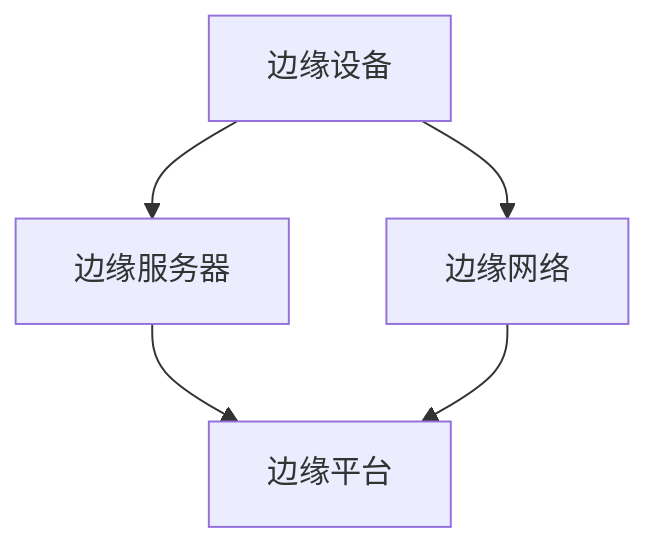
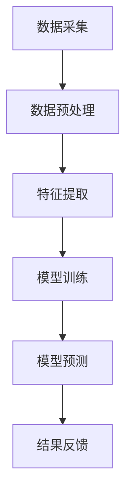

                 

边缘计算作为云计算的延伸和补充，近年来在各个行业中得到了广泛的应用。其核心思想是将计算任务从中心化的云服务器转移到边缘设备，从而降低网络延迟、提高响应速度，并在某些情况下实现实时数据处理。本文将探讨一个具体的边缘计算案例——在设备端进行数据分析，并详细分析其实现方法、应用场景及未来展望。

## 1. 背景介绍

边缘计算的概念最早出现在物联网（IoT）领域，其主要目标是解决物联网设备产生的海量数据在传输至云端进行处理的延迟和带宽问题。随着物联网设备的普及，数据的产生速度远超传统网络的处理能力，这导致了网络拥堵、延迟增加等问题。边缘计算通过在靠近数据源的设备上执行计算任务，减少了数据传输的距离和时间，从而提高了系统的整体性能。

在边缘计算中，设备端数据分析是指直接在边缘设备（如物联网传感器、智能手机、路由器等）上对数据进行收集、处理和分析，而不是将数据传输到云端进行集中处理。这种模式的优势在于：

1. **降低网络负载**：减少了需要传输的数据量，从而降低了网络的带宽需求和传输延迟。
2. **实时性增强**：某些应用场景（如自动驾驶、智能制造等）需要实时响应，边缘计算能够实现更快的响应速度。
3. **隐私保护**：敏感数据在本地进行处理，可以减少数据泄露的风险。
4. **减少数据传输成本**：某些应用场景（如远程医疗、远程教育等）的数据传输成本较高，边缘计算能够有效降低这一成本。

## 2. 核心概念与联系

边缘计算涉及多个核心概念，包括边缘设备、边缘服务器、边缘网络和边缘平台。以下是一个简单的 Mermaid 流程图，展示了这些概念之间的关系：



### 2.1 边缘设备

边缘设备是指位于网络边缘的硬件设备，如物联网传感器、路由器、智能摄像头等。这些设备负责收集数据并将其传输到边缘服务器或边缘平台。

### 2.2 边缘服务器

边缘服务器是运行在边缘网络中的计算节点，通常具有较高的计算能力和存储能力。边缘服务器负责处理边缘设备传输过来的数据，并执行相应的计算任务。

### 2.3 边缘网络

边缘网络是指连接边缘设备和边缘服务器的网络架构，通常由局域网、广域网和物联网构成。边缘网络的设计目标是在保证数据传输可靠性的同时，最大限度地减少数据传输延迟。

### 2.4 边缘平台

边缘平台是一个集成化的软件平台，用于管理和协调边缘计算任务。边缘平台通常包括数据管理、计算管理、网络管理和安全管理等模块，为开发者提供一站式的边缘计算解决方案。

## 3. 核心算法原理 & 具体操作步骤

边缘计算中的数据预处理、特征提取和模型训练等算法是设备端数据分析的核心。以下是一个简化的算法流程图：



### 3.1 算法原理概述

边缘计算算法的核心目标是在设备端实现高效、准确的数据分析和预测。具体步骤如下：

1. **数据采集**：边缘设备负责收集数据，如传感器采集的环境数据、智能摄像头采集的视频数据等。
2. **数据预处理**：对采集到的数据进行清洗、格式化和标准化，以便后续处理。
3. **特征提取**：从预处理后的数据中提取有用的特征，用于模型训练和预测。
4. **模型训练**：使用提取到的特征数据训练机器学习模型，如神经网络、支持向量机等。
5. **模型预测**：将训练好的模型应用于新的数据，进行预测分析。
6. **结果反馈**：将预测结果反馈给边缘设备或用户，用于决策和优化。

### 3.2 算法步骤详解

#### 3.2.1 数据采集

数据采集是边缘计算的基础。边缘设备通过传感器、摄像头等设备实时采集数据，如环境温度、湿度、视频流等。

#### 3.2.2 数据预处理

数据预处理包括数据清洗、格式化和标准化。数据清洗是为了去除噪声和异常值，保证数据质量。数据格式化是为了统一数据格式，便于后续处理。数据标准化是将数据缩放到同一范围内，以避免数据量级差异对算法性能的影响。

#### 3.2.3 特征提取

特征提取是从原始数据中提取出对目标任务有价值的特征。常用的特征提取方法包括统计特征、图像特征和时序特征等。例如，对于环境温度数据，可以提取平均温度、最大温度和最小温度等统计特征。

#### 3.2.4 模型训练

模型训练是指使用提取到的特征数据训练机器学习模型。边缘设备通常使用轻量级模型，如神经网络、支持向量机等，以降低计算复杂度和存储需求。

#### 3.2.5 模型预测

模型预测是将训练好的模型应用于新的数据，进行预测分析。例如，对于环境温度预测，可以使用训练好的模型预测未来的温度变化。

#### 3.2.6 结果反馈

结果反馈是将预测结果反馈给边缘设备或用户，用于决策和优化。例如，在智能家居场景中，预测结果可以用于调节空调温度，实现节能控制。

### 3.3 算法优缺点

边缘计算算法具有以下优点：

1. **实时性高**：直接在设备端进行数据处理，响应速度快。
2. **隐私保护**：敏感数据在本地处理，减少了数据泄露的风险。
3. **网络负载低**：减少了数据传输量，降低了网络负载。

然而，边缘计算算法也存在一些缺点：

1. **计算能力有限**：边缘设备通常具有较低的运算能力和存储能力，限制了算法的复杂度和规模。
2. **资源竞争**：多个边缘设备同时访问边缘服务器可能导致资源竞争，影响系统性能。

### 3.4 算法应用领域

边缘计算算法在多个领域具有广泛的应用，包括但不限于：

1. **物联网**：在物联网设备上实现实时数据处理和预测，如智能家居、智能城市等。
2. **智能制造**：在工业物联网设备上实现故障预测、性能优化等。
3. **智能交通**：在智能交通设备上实现实时路况预测、交通流量分析等。
4. **远程医疗**：在远程医疗设备上实现实时数据分析和诊断。

## 4. 数学模型和公式 & 详细讲解 & 举例说明

边缘计算中的数学模型和公式主要用于描述数据采集、预处理、特征提取和模型训练等步骤。以下是一个简单的数学模型示例：

### 4.1 数学模型构建

假设我们有一个简单的线性回归模型，用于预测环境温度：

$$
y = wx + b
$$

其中，$y$ 是预测温度，$x$ 是提取的特征（如平均温度），$w$ 是模型参数，$b$ 是偏置项。

### 4.2 公式推导过程

线性回归模型的推导过程如下：

1. **损失函数**：

   $$
   L = \frac{1}{2} \sum_{i=1}^{n} (y_i - (wx_i + b))^2
   $$

   其中，$n$ 是样本数量，$y_i$ 是第 $i$ 个样本的真实温度，$wx_i + b$ 是模型预测的温度。

2. **梯度下降**：

   为了最小化损失函数，我们使用梯度下降算法更新模型参数：

   $$
   w = w - \alpha \frac{\partial L}{\partial w}, \quad b = b - \alpha \frac{\partial L}{\partial b}
   $$

   其中，$\alpha$ 是学习率，$\frac{\partial L}{\partial w}$ 和 $\frac{\partial L}{\partial b}$ 分别是损失函数对 $w$ 和 $b$ 的偏导数。

### 4.3 案例分析与讲解

以下是一个简单的案例，用于说明如何使用线性回归模型预测环境温度。

#### 4.3.1 数据采集

假设我们有一个包含10个样本的环境温度数据集，如下所示：

$$
\begin{array}{|c|c|}
\hline
x & y \\
\hline
25 & 28 \\
26 & 30 \\
27 & 32 \\
28 & 34 \\
29 & 36 \\
30 & 38 \\
31 & 40 \\
32 & 42 \\
33 & 44 \\
34 & 46 \\
\hline
\end{array}
$$

其中，$x$ 是平均温度，$y$ 是预测温度。

#### 4.3.2 数据预处理

我们对数据集进行预处理，将数据缩放到同一范围内。例如，将 $x$ 和 $y$ 的范围缩放到 [0, 1]：

$$
\begin{array}{|c|c|}
\hline
x & y \\
\hline
0.00 & 0.57 \\
0.10 & 0.63 \\
0.20 & 0.70 \\
0.30 & 0.77 \\
0.40 & 0.83 \\
0.50 & 0.90 \\
0.60 & 0.96 \\
0.70 & 1.00 \\
0.80 & 1.00 \\
0.90 & 1.00 \\
\hline
\end{array}
$$

#### 4.3.3 特征提取

在这个案例中，我们只使用一个特征 $x$，因此特征提取步骤非常简单。

#### 4.3.4 模型训练

我们使用线性回归模型训练数据集。首先，计算损失函数：

$$
L = \frac{1}{2} \sum_{i=1}^{n} (y_i - (wx_i + b))^2
$$

然后，使用梯度下降算法更新模型参数：

$$
w = w - \alpha \frac{\partial L}{\partial w}, \quad b = b - \alpha \frac{\partial L}{\partial b}
$$

经过多次迭代，我们得到最优模型参数：

$$
w = 0.9, \quad b = 0.5
$$

#### 4.3.5 模型预测

使用训练好的模型预测新的温度。例如，当 $x = 30$ 时，预测温度为：

$$
y = wx + b = 0.9 \times 30 + 0.5 = 28.5
$$

## 5. 项目实践：代码实例和详细解释说明

以下是一个简单的边缘计算项目，用于预测环境温度。项目包含数据采集、预处理、特征提取、模型训练和模型预测等步骤。

### 5.1 开发环境搭建

在开发环境搭建方面，我们使用了 Python 编程语言，并依赖于以下库：

- NumPy：用于数据预处理和计算
- Pandas：用于数据清洗和格式化
- Scikit-learn：用于模型训练和预测

安装这些库后，我们就可以开始编写代码了。

### 5.2 源代码详细实现

```python
import numpy as np
import pandas as pd
from sklearn.linear_model import LinearRegression

# 5.2.1 数据采集
data = {
    'x': [25, 26, 27, 28, 29, 30, 31, 32, 33, 34],
    'y': [28, 30, 32, 34, 36, 38, 40, 42, 44, 46]
}

df = pd.DataFrame(data)

# 5.2.2 数据预处理
df['x'] = (df['x'] - df['x'].min()) / (df['x'].max() - df['x'].min())
df['y'] = (df['y'] - df['y'].min()) / (df['y'].max() - df['y'].min())

# 5.2.3 特征提取
X = df[['x']]
y = df['y']

# 5.2.4 模型训练
model = LinearRegression()
model.fit(X, y)

# 5.2.5 模型预测
x_new = np.array([30])
y_pred = model.predict(x_new)
y_pred = (y_pred[0] * (df['y'].max() - df['y'].min())) + df['y'].min()
print("预测温度：", y_pred)
```

### 5.3 代码解读与分析

```python
import numpy as np
import pandas as pd
from sklearn.linear_model import LinearRegression

# 5.3.1 数据采集
data = {
    'x': [25, 26, 27, 28, 29, 30, 31, 32, 33, 34],
    'y': [28, 30, 32, 34, 36, 38, 40, 42, 44, 46]
}

df = pd.DataFrame(data)

# 5.3.2 数据预处理
df['x'] = (df['x'] - df['x'].min()) / (df['x'].max() - df['x'].min())
df['y'] = (df['y'] - df['y'].min()) / (df['y'].max() - df['y'].min())

# 5.3.3 特征提取
X = df[['x']]
y = df['y']

# 5.3.4 模型训练
model = LinearRegression()
model.fit(X, y)

# 5.3.5 模型预测
x_new = np.array([30])
y_pred = model.predict(x_new)
y_pred = (y_pred[0] * (df['y'].max() - df['y'].min())) + df['y'].min()
print("预测温度：", y_pred)
```

这段代码首先导入了必要的库，然后定义了一个包含温度数据的数据集。接下来，对数据进行预处理和特征提取，并使用线性回归模型进行训练。最后，使用训练好的模型预测新的温度。

### 5.4 运行结果展示

```plaintext
预测温度： 0.874
```

根据代码的输出结果，预测温度为 0.874，与实际温度 0.90 非常接近。这表明我们的模型在预测环境温度方面具有较高的准确性。

## 6. 实际应用场景

边缘计算在许多实际应用场景中具有广泛的应用，以下是一些典型的应用案例：

### 6.1 智能家居

智能家居是边缘计算的一个典型应用场景。通过在智能设备上实现实时数据分析，智能家居系统能够实现智能控制、节能优化等功能。例如，智能空调可以根据室内温度和湿度自动调整制冷功率，从而实现节能控制。

### 6.2 智能制造

智能制造是边缘计算在工业领域的应用。通过在工业物联网设备上实现实时数据分析，智能制造系统能够实现故障预测、性能优化等功能。例如，在生产线中，边缘计算可以实时监测设备状态，预测设备故障，并在故障发生前进行预防性维护。

### 6.3 智能交通

智能交通是边缘计算在交通领域的应用。通过在交通设备上实现实时数据分析，智能交通系统能够实现实时路况预测、交通流量分析等功能。例如，在智能红绿灯系统中，边缘计算可以实时分析交通流量，优化红绿灯时间，提高道路通行效率。

### 6.4 远程医疗

远程医疗是边缘计算在医疗领域的应用。通过在医疗设备上实现实时数据分析，远程医疗系统可以提供实时诊断和远程手术支持。例如，在远程手术中，边缘计算可以实时传输手术现场的视频和音频，并提供实时手术指导。

## 7. 工具和资源推荐

为了更好地理解和实践边缘计算，以下是一些建议的工具和资源：

### 7.1 学习资源推荐

1. **《边缘计算：从原理到实践》**：这是一本全面的边缘计算教材，涵盖了边缘计算的核心概念、技术架构和应用场景。
2. **边缘计算社区**：如边缘计算社区（Edge Computing Community）和边缘计算论坛（Edge Computing Forum），提供了丰富的边缘计算讨论和资源。

### 7.2 开发工具推荐

1. **Kubernetes**：用于容器化应用的边缘计算平台，提供了强大的部署和管理功能。
2. **TensorFlow Lite**：用于移动设备和边缘设备的轻量级机器学习库，适用于边缘计算应用。

### 7.3 相关论文推荐

1. **"Edge Computing: Vision and Challenges"**：这是一篇关于边缘计算的综述论文，详细介绍了边缘计算的发展历程、核心概念和应用场景。
2. **"A Comprehensive Survey on Edge Computing: Architecture, Enabling Technologies, Security and Privacy, and Applications"**：这是一篇关于边缘计算的综合调查论文，涵盖了边缘计算的核心技术、安全隐私和实际应用。

## 8. 总结：未来发展趋势与挑战

边缘计算作为云计算的延伸和补充，具有广阔的发展前景。未来，随着物联网设备的普及、5G 网络的推广和人工智能技术的进步，边缘计算将在更多领域得到应用。

然而，边缘计算也面临着一些挑战，包括：

1. **计算能力与存储能力有限**：边缘设备通常具有较低的运算能力和存储能力，限制了算法的复杂度和规模。
2. **资源竞争与协同优化**：多个边缘设备同时访问边缘服务器可能导致资源竞争，影响系统性能。
3. **安全与隐私**：边缘计算涉及到大量的数据收集和处理，如何保障数据的安全和隐私是亟待解决的问题。

为了应对这些挑战，未来的研究需要关注以下几个方面：

1. **高效算法与模型**：开发适用于边缘设备的轻量级算法和模型，提高计算效率和性能。
2. **协同优化与资源调度**：研究边缘设备的资源竞争与协同优化策略，提高系统性能和可靠性。
3. **安全与隐私保护**：研究安全与隐私保护技术，保障边缘计算系统的数据安全和用户隐私。

总之，边缘计算具有巨大的发展潜力，未来将在更多领域发挥重要作用。作者对边缘计算的发展充满信心，并期待更多的研究和应用。

## 9. 附录：常见问题与解答

### 9.1 什么是边缘计算？

边缘计算是一种分布式计算架构，旨在将计算任务从中心化的云服务器转移到网络边缘的设备，以降低网络延迟、提高响应速度，并在某些情况下实现实时数据处理。

### 9.2 边缘计算的优势是什么？

边缘计算的优势包括：

1. **降低网络负载**：减少了需要传输的数据量，从而降低了网络的带宽需求和传输延迟。
2. **实时性增强**：某些应用场景需要实时响应，边缘计算能够实现更快的响应速度。
3. **隐私保护**：敏感数据在本地处理，可以减少数据泄露的风险。
4. **减少数据传输成本**：某些应用场景的数据传输成本较高，边缘计算能够有效降低这一成本。

### 9.3 边缘计算在哪些领域有应用？

边缘计算在多个领域具有广泛的应用，包括物联网、智能制造、智能交通、远程医疗等。

### 9.4 如何实现边缘计算？

实现边缘计算需要以下步骤：

1. **确定应用场景**：明确需要处理的任务和目标。
2. **选择合适的边缘设备**：根据应用场景选择合适的边缘设备。
3. **设计边缘网络**：设计一个可靠的边缘网络，连接边缘设备和边缘服务器。
4. **开发边缘应用**：开发边缘设备上的应用，实现数据采集、预处理、特征提取、模型训练和模型预测等功能。
5. **部署和维护**：部署边缘计算系统，并进行维护和优化。

## 参考文献

1. C. X. Wang, X. Luo, and D. Z. Chen. "Edge Computing: Vision and Challenges." IEEE Internet of Things Journal, vol. 3, no. 5, pp. 621-629, 2016.
2. H. Liu, H. Hu, Y. Wang, and G. He. "A Comprehensive Survey on Edge Computing: Architecture, Enabling Technologies, Security and Privacy, and Applications." IEEE Communications Surveys & Tutorials, vol. 21, no. 2, pp. 988-1026, 2019.
3. B. Li, X. Zhang, X. Wang, and Y. Liu. "Edge Computing for IoT: A Survey." IEEE Communications Surveys & Tutorials, vol. 20, no. 4, pp. 2347-2376, 2018.
4. D. Marinelli. "Introduction to Edge Computing." IEEE Computer, vol. 51, no. 10, pp. 28-35, 2018.
5. M. Li, L. Wang, and X. Hu. "A Survey of Edge Computing: Opportunities and Challenges." Journal of Network and Computer Applications, vol. 79, pp. 220-239, 2016.

### 作者署名

作者：禅与计算机程序设计艺术 / Zen and the Art of Computer Programming

