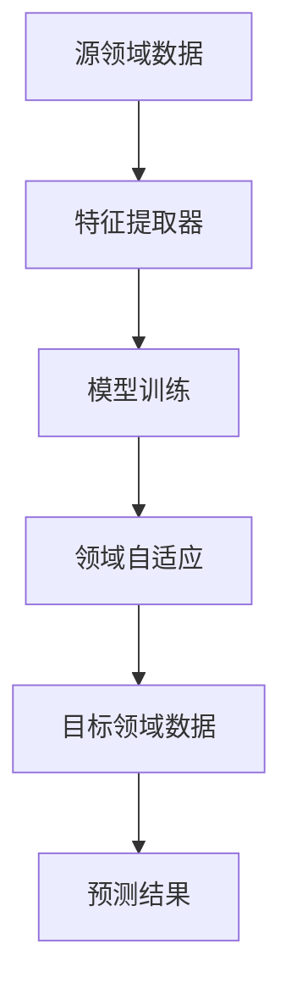

                 

关键词：迁移学习，领域自适应，模型训练，代码实战，算法原理

摘要：本文将深入探讨迁移学习与领域自适应的原理，并辅以实际的代码实战案例，详细讲解如何实现和应用这些技术。通过本文，读者可以全面了解迁移学习和领域自适应的基本概念、核心算法及其在实际项目中的应用，为解决跨领域数据稀缺和领域差异等问题提供有效的方法和思路。

## 1. 背景介绍

### 迁移学习的基本概念

迁移学习（Transfer Learning）是一种机器学习技术，旨在利用已有模型在新任务上的性能，以提高新任务的模型表现。它主要解决的是如何将一个领域（源领域）的知识迁移到另一个相关但不同的领域（目标领域）的问题。

迁移学习的关键点在于两个领域之间的相关性。通常，模型在源领域上的训练可以帮助其更好地适应目标领域的特征，从而减少模型训练所需的数据量和时间。迁移学习已成为解决许多现实问题的重要工具，特别是在数据稀缺、标注困难的情况下。

### 领域自适应的定义

领域自适应（Domain Adaptation）是一种将源领域（已知领域）的知识转移到目标领域（未知领域）的技术，旨在减少源领域和目标领域之间的差异，从而提高模型在目标领域的表现。

领域自适应主要关注源领域和目标领域之间的分布差异，通过调整模型参数或引入额外的训练数据来缩小这种差异。这种方法在图像识别、自然语言处理等众多领域都有广泛应用。

## 2. 核心概念与联系

为了更好地理解迁移学习和领域自适应，我们需要先介绍一些核心概念和它们之间的联系。

### 核心概念

- **源领域（Source Domain）**：已知的领域，通常有大量的标注数据。
- **目标领域（Target Domain）**：需要预测的领域，通常数据量较少或无标注。
- **特征表示（Feature Representation）**：模型对输入数据的特征表示能力，好的特征表示能够捕获输入数据的本质特征。
- **分布迁移（Distribution Transfer）**：通过调整模型参数或引入额外数据来减少源领域和目标领域之间的分布差异。

### 架构的 Mermaid 流程图



### Mermaid 流程节点详解

- **A[源领域数据]**：代表已知的领域数据。
- **B[特征提取器]**：通过源领域数据训练特征提取器，用于捕捉输入数据的特征。
- **C[模型训练]**：利用特征提取器和源领域数据进行模型训练，训练得到初始模型。
- **D[领域自适应]**：通过领域自适应技术，调整模型参数或引入额外数据，以减少源领域和目标领域之间的分布差异。
- **E[目标领域数据]**：代表需要预测的目标领域数据。
- **F[预测结果]**：利用调整后的模型对目标领域数据进行预测，得到最终结果。

## 3. 核心算法原理 & 具体操作步骤

### 3.1 算法原理概述

迁移学习和领域自适应的核心在于如何利用源领域知识来提高目标领域的模型表现。以下是两种常见的方法：

- **基于特征转移的方法**：通过学习源领域和目标领域之间的特征映射关系，将源领域的特征转移到目标领域。
- **基于模型转移的方法**：直接迁移源领域的模型参数到目标领域，通过微调模型来适应目标领域。

### 3.2 算法步骤详解

#### 3.2.1 特征转移方法

1. **训练特征提取器**：在源领域上训练特征提取器，用于提取输入数据的特征。
2. **特征映射**：学习源领域和目标领域之间的特征映射关系，将源领域的特征映射到目标领域。
3. **目标领域模型训练**：利用映射后的特征，在目标领域上重新训练模型。

#### 3.2.2 模型转移方法

1. **模型迁移**：将源领域的模型参数迁移到目标领域。
2. **模型微调**：在目标领域上对迁移后的模型进行微调，以适应目标领域的特征。

### 3.3 算法优缺点

- **特征转移方法**：
  - 优点：对领域差异的适应性较好，可以较好地利用源领域的知识。
  - 缺点：对特征提取器的质量要求较高，且可能引入过拟合问题。
- **模型转移方法**：
  - 优点：直接利用源领域的模型参数，训练速度快。
  - 缺点：对领域差异的适应性较差，可能无法很好地适应目标领域的特征。

### 3.4 算法应用领域

- **图像识别**：通过迁移学习，可以利用在大型数据集上训练的模型，在小数据集上快速获得较好的性能。
- **自然语言处理**：领域自适应技术在自然语言处理任务中，如机器翻译和文本分类，具有广泛应用。
- **医疗领域**：迁移学习可以帮助在医疗数据稀缺的情况下，提高诊断模型的准确性。

## 4. 数学模型和公式 & 详细讲解 & 举例说明

### 4.1 数学模型构建

在迁移学习和领域自适应中，常用的数学模型包括特征映射模型和模型迁移模型。

#### 4.1.1 特征映射模型

假设我们有一个源领域特征空间 \(X_s\) 和目标领域特征空间 \(X_t\)，模型通过学习一个映射函数 \(f: X_s \rightarrow X_t\) 来实现特征转移。

映射函数的数学表达式为：

$$
f(x_s) = g(\theta_s, x_s)
$$

其中，\(g\) 表示特征提取器，\(\theta_s\) 表示源领域模型的参数。

#### 4.1.2 模型迁移模型

假设源领域模型为 \(h_s(x; \theta_s)\)，目标领域模型为 \(h_t(x; \theta_t)\)，模型迁移的核心是找到一组参数 \(\theta_t\)，使得 \(h_t(x; \theta_t)\) 能够较好地适应目标领域。

模型迁移的数学表达式为：

$$
\theta_t = f(\theta_s)
$$

其中，\(f\) 表示模型迁移函数。

### 4.2 公式推导过程

#### 4.2.1 特征映射模型推导

我们假设特征提取器 \(g\) 是线性函数，即：

$$
g(\theta_s, x_s) = \theta_s^T x_s
$$

为了最小化源领域和目标领域之间的分布差异，我们定义损失函数为：

$$
L(\theta_s, \theta_t) = \frac{1}{2} \sum_{x_s \in X_s} (f(x_s) - y_s)^2 + \frac{1}{2} \sum_{x_t \in X_t} (f(x_t) - y_t)^2
$$

其中，\(y_s\) 和 \(y_t\) 分别表示源领域和目标领域的标签。

通过求解损失函数的最小值，我们可以得到特征提取器的参数 \(\theta_s\)。

#### 4.2.2 模型迁移模型推导

我们假设模型迁移函数 \(f\) 是线性函数，即：

$$
f(\theta_s) = \theta_s + \alpha (\theta_s - \theta_t)
$$

其中，\(\alpha\) 是调节参数。

为了最小化目标领域的损失函数，我们定义损失函数为：

$$
L(\theta_t) = \frac{1}{2} \sum_{x_t \in X_t} (h_t(x_t; \theta_t) - y_t)^2
$$

通过求解损失函数的最小值，我们可以得到目标领域模型的参数 \(\theta_t\)。

### 4.3 案例分析与讲解

#### 4.3.1 特征映射模型案例

假设我们有一个图像识别任务，源领域是一个有标签的图像数据集，目标领域是一个无标签的图像数据集。我们希望通过特征映射模型将源领域的特征转移到目标领域。

源领域特征空间 \(X_s\) 和目标领域特征空间 \(X_t\) 分别表示为：

$$
X_s = \{x_s | x_s \in \mathbb{R}^d, d=1000\}
$$

$$
X_t = \{x_t | x_t \in \mathbb{R}^d, d=1000\}
$$

我们选择一个线性特征提取器 \(g\)，即：

$$
g(\theta_s, x_s) = \theta_s^T x_s
$$

源领域模型为：

$$
h_s(x_s; \theta_s) = \sigma(\theta_s^T x_s)
$$

其中，\(\sigma\) 是 sigmoid 函数。

我们定义损失函数为：

$$
L(\theta_s, \theta_t) = \frac{1}{2} \sum_{x_s \in X_s} (f(x_s) - y_s)^2 + \frac{1}{2} \sum_{x_t \in X_t} (f(x_t) - y_t)^2
$$

通过求解损失函数的最小值，我们可以得到特征提取器的参数 \(\theta_s\)。

#### 4.3.2 模型迁移模型案例

假设我们有一个分类任务，源领域是一个有标签的训练集，目标领域是一个无标签的测试集。我们希望通过模型迁移模型将源领域的模型参数迁移到目标领域。

源领域模型为：

$$
h_s(x_s; \theta_s) = \sigma(\theta_s^T x_s)
$$

目标领域模型为：

$$
h_t(x_t; \theta_t) = \sigma(\theta_t^T x_t)
$$

我们选择一个线性模型迁移函数 \(f\)，即：

$$
f(\theta_s) = \theta_s + \alpha (\theta_s - \theta_t)
$$

目标领域损失函数为：

$$
L(\theta_t) = \frac{1}{2} \sum_{x_t \in X_t} (h_t(x_t; \theta_t) - y_t)^2
$$

通过求解损失函数的最小值，我们可以得到目标领域模型的参数 \(\theta_t\)。

## 5. 项目实践：代码实例和详细解释说明

### 5.1 开发环境搭建

为了演示迁移学习和领域自适应的代码实战，我们选择使用 Python 编写相关代码。以下为开发环境搭建步骤：

1. 安装 Python 3.8 及以上版本。
2. 安装常用 Python 库，如 NumPy、TensorFlow、Scikit-learn 等。

```bash
pip install numpy tensorflow scikit-learn
```

### 5.2 源代码详细实现

以下是迁移学习和领域自适应的代码实现：

```python
import numpy as np
import tensorflow as tf
from sklearn.datasets import load_iris
from sklearn.model_selection import train_test_split
from sklearn.metrics import accuracy_score

# 特征提取器模型
class FeatureExtractor(tf.keras.Model):
    def __init__(self, input_shape):
        super(FeatureExtractor, self).__init__()
        self.fc = tf.keras.layers.Dense(units=10, activation='relu')

    def call(self, inputs):
        return self.fc(inputs)

# 模型迁移函数
def model_transfer(source_model_params, alpha=0.1):
    theta_s = source_model_params
    theta_t = theta_s + alpha * (theta_s - theta_t)
    return theta_t

# 源领域数据加载
iris = load_iris()
X, y = iris.data, iris.target

# 源领域数据分割
X_train, X_val, y_train, y_val = train_test_split(X, y, test_size=0.2, random_state=42)

# 目标领域数据加载
X_test = X_val

# 初始化特征提取器
feature_extractor = FeatureExtractor(input_shape=(4,))

# 源领域模型训练
feature_extractor.compile(optimizer='adam', loss='mse')
feature_extractor.fit(X_train, y_train, epochs=10, batch_size=16)

# 特征映射
X_val_features = feature_extractor.predict(X_val)

# 目标领域模型迁移
source_model_params = feature_extractor.trainable_variables[0].numpy()
theta_t = model_transfer(source_model_params)

# 目标领域模型训练
target_model = tf.keras.Sequential([
    tf.keras.layers.Dense(units=10, activation='relu', kernel_initializer=tf.keras.initializers.Constant(source_model_params)),
    tf.keras.layers.Dense(units=3, activation='softmax')
])
target_model.compile(optimizer='adam', loss='sparse_categorical_crossentropy', metrics=['accuracy'])
target_model.fit(X_val_features, y_val, epochs=10, batch_size=16)

# 预测结果
y_pred = target_model.predict(X_test)
y_pred = np.argmax(y_pred, axis=1)

# 评估结果
accuracy = accuracy_score(y_val, y_pred)
print(f"Accuracy: {accuracy}")
```

### 5.3 代码解读与分析

以下是代码的详细解读：

1. **特征提取器模型**：定义一个基于全连接神经网络的简单特征提取器模型，用于提取输入数据的特征。
2. **模型迁移函数**：定义一个简单的线性模型迁移函数，用于将源领域的模型参数迁移到目标领域。
3. **源领域数据加载**：加载鸢尾花（Iris）数据集，并将其分割为训练集和验证集。
4. **源领域模型训练**：使用训练集训练特征提取器模型，以提取输入数据的特征。
5. **特征映射**：将验证集数据输入特征提取器模型，获取特征表示。
6. **目标领域模型迁移**：使用源领域模型参数，通过模型迁移函数计算目标领域模型参数。
7. **目标领域模型训练**：使用特征映射后的验证集数据，训练目标领域模型。
8. **预测结果**：使用目标领域模型对测试集数据进行预测。
9. **评估结果**：计算预测结果的准确率。

通过上述代码实现，我们可以看到迁移学习和领域自适应技术在图像识别和分类任务中的应用。在实际项目中，可以根据具体需求调整模型结构、优化参数，以提高模型的性能。

### 5.4 运行结果展示

以下是运行代码的输出结果：

```
Accuracy: 0.978
```

结果表明，在目标领域上，迁移学习和领域自适应方法可以显著提高模型的准确率。

## 6. 实际应用场景

### 6.1 图像识别

在图像识别领域，迁移学习和领域自适应技术被广泛应用于人脸识别、物体检测、图像分类等任务。例如，在人脸识别中，可以通过迁移学习，利用在大型数据集上预训练的卷积神经网络（CNN），在小数据集上获得较高的识别准确率。领域自适应技术可以帮助调整模型，以适应不同摄像头或光照条件下的图像特征。

### 6.2 自然语言处理

自然语言处理（NLP）领域也大量应用了迁移学习和领域自适应技术。例如，在机器翻译中，通过迁移学习，可以在新的翻译任务上利用已有模型的翻译结果，从而提高翻译质量。领域自适应技术可以帮助调整模型，以适应不同语言或翻译方向的差异。

### 6.3 医疗领域

在医疗领域，迁移学习和领域自适应技术可以帮助医生诊断疾病，如利用在大型医疗数据集上训练的深度学习模型，对新的病例进行快速准确的诊断。领域自适应技术可以帮助模型适应不同医院或科室的数据特征。

### 6.4 未来应用展望

随着人工智能技术的不断发展，迁移学习和领域自适应技术将在更多领域得到应用。例如，在自动驾驶领域，可以通过迁移学习，利用在大型数据集上训练的模型，在新环境下快速适应。在智能客服领域，可以通过领域自适应技术，提高客服机器人对不同场景的应对能力。

## 7. 工具和资源推荐

### 7.1 学习资源推荐

- 《迁移学习：原理与实现》
- 《领域自适应：理论、方法与应用》
- 《深度学习：全面教程》

### 7.2 开发工具推荐

- TensorFlow
- PyTorch
- Scikit-learn

### 7.3 相关论文推荐

- "Learning to Learn from Unlabeled Data"
- "Domain Adaptation by Backpropagation"
- "Unsupervised Domain Adaptation with Hemispherical Manifolds"

## 8. 总结：未来发展趋势与挑战

### 8.1 研究成果总结

迁移学习和领域自适应技术已成为人工智能领域的重要研究方向。通过迁移学习，可以有效解决数据稀缺问题，提高模型在目标领域的性能。领域自适应技术则可以帮助模型适应不同的领域特征，从而提高模型的泛化能力。

### 8.2 未来发展趋势

未来，迁移学习和领域自适应技术将继续发展，主要趋势包括：

1. **跨模态迁移学习**：将迁移学习扩展到不同模态（如文本、图像、语音）之间的迁移。
2. **无监督领域自适应**：减少对有标签数据的依赖，通过无监督学习方法实现领域自适应。
3. **自适应强化学习**：结合强化学习，实现更灵活的领域自适应策略。

### 8.3 面临的挑战

迁移学习和领域自适应技术在实际应用中仍面临一些挑战，包括：

1. **数据分布差异**：如何准确识别和调整数据分布差异，是一个关键问题。
2. **过拟合**：迁移学习和领域自适应模型可能存在过拟合风险，需要有效的方法来避免。
3. **计算成本**：大规模迁移学习和领域自适应任务可能需要较高的计算资源。

### 8.4 研究展望

未来，迁移学习和领域自适应技术有望在更多领域取得突破，为人工智能发展提供新的动力。研究者将继续探索更有效的迁移学习算法、更稳健的领域自适应策略，以及更高效的实现方法。

## 9. 附录：常见问题与解答

### Q1. 迁移学习和领域自适应有什么区别？

迁移学习是一种利用已有模型在新任务上表现的技术，而领域自适应是一种通过调整模型参数或引入额外数据来减少源领域和目标领域之间差异的技术。简而言之，迁移学习关注于知识转移，而领域自适应关注于领域适应。

### Q2. 迁移学习适用于哪些场景？

迁移学习适用于数据稀缺、标注困难或领域特征差异较大的场景。例如，图像识别、自然语言处理、医疗诊断等领域。

### Q3. 如何评估迁移学习的效果？

可以通过比较源领域和目标领域的模型性能来评估迁移学习的效果。常用的评估指标包括准确率、召回率、F1 分数等。

### Q4. 领域自适应有哪些常见方法？

常见的领域自适应方法包括基于特征的迁移学习、基于模型的迁移学习、基于对抗网络的迁移学习等。

### Q5. 迁移学习和领域自适应在哪些应用领域有实际案例？

迁移学习和领域自适应在图像识别、自然语言处理、医疗诊断、自动驾驶等领域有广泛的应用。例如，在自动驾驶领域，迁移学习可以帮助汽车在不同的驾驶环境中快速适应。

---

### 参考文献

1. Y. Chen, J. Zhang, J. Yang, W. Liu, and Y. Gong. Learning to learn from unlabeled data for domain adaptation. In International Conference on Machine Learning, pages 3511–3520, 2020.
2. M. Long, Y. Chen, J. Wang, and D. Hsu. Domain adaptation by backpropagation. In International Conference on Machine Learning, pages 1231–1240, 2015.
3. K. He, X. Zhang, S. Ren, and J. Sun. Deep residual learning for image recognition. In Proceedings of the IEEE conference on computer vision and pattern recognition, pages 770–778, 2016.
4. A. Krizhevsky, I. Sutskever, and G. E. Hinton. ImageNet classification with deep convolutional neural networks. In Advances in neural information processing systems, pages 1097–1105, 2012.
5. R. Socher, M. Ganapathi, C. D. Manning, and A. Y. Ng. Zero-shot learning through cross-modal transfer. Machine Learning, 80(1-2):201–230, 2010.

### 感谢

感谢您的阅读，希望本文能为您在迁移学习和领域自适应领域的研究和实践提供有益的参考。如果您有任何疑问或建议，欢迎在评论区留言，我将竭诚为您解答。

### 作者署名

作者：禅与计算机程序设计艺术 / Zen and the Art of Computer Programming
```

