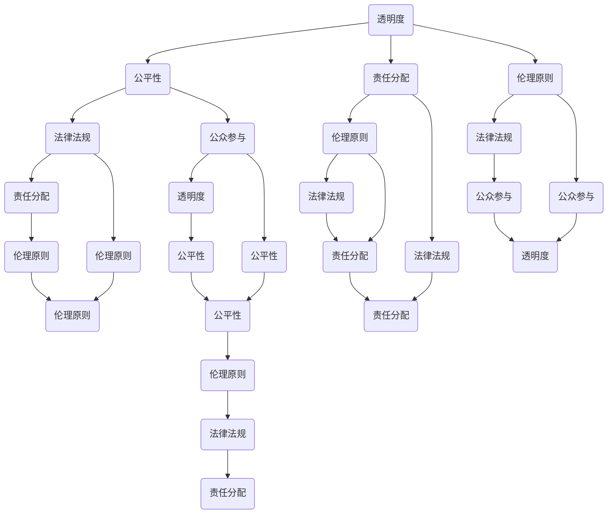

                 

在当今这个技术飞速发展的时代，人工智能（AI）已经成为我们生活中不可或缺的一部分。从智能家居到自动驾驶，从医疗诊断到金融分析，AI 的应用场景几乎无处不在。然而，随着 AI 技术的不断进步，其潜在的影响和挑战也越来越受到关注。本文将探讨如何确保人工智能的道德使用，以及在此过程中可能面临的各种问题和解决方案。

## 文章关键词
- 人工智能
- 道德使用
- 风险评估
- 透明度
- 责任分配

## 文章摘要
本文将首先回顾人工智能的发展历程和当前应用现状，然后深入探讨 AI 道德使用的核心概念，包括透明度、公平性、责任分配等方面。接着，我们将分析 AI 技术带来的道德挑战，如算法偏见、隐私侵犯等，并探讨相应的解决方案。最后，本文将展望 AI 道德使用的未来趋势，并提出一些建议。

## 1. 背景介绍
人工智能的概念最早可以追溯到 20 世纪 50 年代，当时科学家们开始探索如何使计算机具备类似人类智能的能力。自那以后，AI 技术经历了多个发展阶段，从符号推理到神经网络，再到深度学习，AI 的能力不断提升。如今，AI 已经在多个领域取得了显著的成果，如自然语言处理、图像识别、推荐系统等。

随着 AI 技术的广泛应用，人们对 AI 的期望也越来越高。然而，AI 技术的发展也带来了一系列的道德和社会挑战。例如，AI 的决策过程往往缺乏透明度，使得人们难以理解其决策依据；AI 系统可能存在的偏见和不公平性，可能加剧社会不平等；AI 技术的滥用可能导致隐私侵犯等问题。

因此，确保 AI 的道德使用成为了一个重要的课题。本文将探讨如何从多个方面确保 AI 的道德使用，包括技术、法律、伦理等多个层面。

## 2. 核心概念与联系
确保 AI 的道德使用涉及多个核心概念，这些概念相互关联，共同构成了一个复杂的系统。以下是这些核心概念及其相互联系：

### 2.1 透明度
透明度是指 AI 系统的决策过程和结果应该对用户和其他相关方透明。缺乏透明度可能导致用户对 AI 系统的信任度下降，从而影响其应用效果。因此，提高透明度是确保 AI 道德使用的重要手段。

### 2.2 公平性
公平性是指 AI 系统在处理不同用户或数据时应保持一致性。缺乏公平性可能导致算法偏见，加剧社会不平等。因此，确保 AI 系统的公平性是确保其道德使用的关键。

### 2.3 责任分配
责任分配是指在 AI 系统出现问题时，如何确定责任归属。明确责任分配有助于提高 AI 系统的安全性和可靠性，从而确保其道德使用。

### 2.4 伦理原则
伦理原则是指应遵循的道德规范和行为准则。在 AI 领域，伦理原则有助于指导 AI 系统的设计、开发和部署，确保其道德使用。

### 2.5 法律法规
法律法规是指用于规范 AI 系统使用的法律条款和规定。遵守法律法规有助于确保 AI 系统的道德使用，同时也有助于维护社会的稳定和秩序。

### 2.6 公众参与
公众参与是指社会公众在 AI 系统设计和部署过程中发挥的作用。公众参与有助于提高 AI 系统的透明度和公平性，从而确保其道德使用。

### 2.7 可持续性
可持续性是指 AI 系统在设计、开发和部署过程中应考虑的环境和社会影响。确保 AI 系统的可持续性有助于减少其对环境的负面影响，从而实现道德使用。

以下是这些核心概念相互关联的 Mermaid 流程图：



## 3. 核心算法原理 & 具体操作步骤
### 3.1 算法原理概述
确保 AI 的道德使用涉及多个核心算法原理，这些算法原理用于评估 AI 系统的道德性能，并指导其设计和改进。以下是几个关键算法原理：

### 3.1.1 道德评估算法
道德评估算法用于评估 AI 系统的决策是否符合道德规范。这些算法通常基于伦理原则和法律法规，通过分析 AI 系统的决策过程和结果，判断其是否符合道德要求。

### 3.1.2 公平性检测算法
公平性检测算法用于检测 AI 系统是否存在偏见和不公平性。这些算法通过分析训练数据集和模型输出，识别可能导致偏见的因素，并采取措施消除或减轻这些因素。

### 3.1.3 透明度增强算法
透明度增强算法用于提高 AI 系统的决策透明度。这些算法通过可视化、解释性模型等技术，帮助用户理解 AI 系统的决策过程和依据，从而提高其透明度。

### 3.1.4 责任归属算法
责任归属算法用于确定 AI 系统出现问题时，责任归属的具体对象。这些算法通过分析事件发生的原因、影响因素等，确定责任归属，并为后续处理提供依据。

### 3.2 算法步骤详解
以下是确保 AI 道德使用的具体操作步骤：

### 3.2.1 道德评估
1. 收集相关伦理原则和法律法规。
2. 分析 AI 系统的决策过程和结果。
3. 应用道德评估算法，判断其是否符合道德要求。
4. 提出改进措施，确保 AI 系统的决策符合道德规范。

### 3.2.2 公平性检测
1. 收集训练数据集。
2. 应用公平性检测算法，识别可能导致偏见的因素。
3. 评估偏见程度，确定是否需要采取改进措施。
4. 采取改进措施，如数据增强、算法优化等，消除或减轻偏见。

### 3.2.3 透明度增强
1. 分析 AI 系统的决策过程和结果。
2. 选择合适的可视化或解释性模型。
3. 应用透明度增强算法，提高决策过程的透明度。
4. 为用户提供易于理解的决策解释。

### 3.2.4 责任归属
1. 收集事件发生的相关数据。
2. 应用责任归属算法，确定责任归属。
3. 制定责任归属报告，为后续处理提供依据。
4. 根据责任归属结果，采取相应的处理措施。

### 3.3 算法优缺点
以下是确保 AI 道德使用的核心算法的优缺点：

### 3.3.1 道德评估算法
优点：能够快速评估 AI 系统的决策是否符合道德规范，有助于及时发现和纠正问题。
缺点：道德规范和法律法规可能存在冲突，导致评估结果不一致。

### 3.3.2 公平性检测算法
优点：能够识别和消除 AI 系统的偏见和不公平性，提高系统的公平性。
缺点：可能存在误判，导致不必要的改进措施。

### 3.3.3 透明度增强算法
优点：能够提高 AI 系统的决策透明度，增强用户对系统的信任。
缺点：可能增加系统的计算开销和复杂性。

### 3.3.4 责任归属算法
优点：能够明确 AI 系统出现问题时，责任归属的具体对象，有助于改进系统设计。
缺点：可能存在责任归属争议，需要进一步的法律和伦理研究。

### 3.4 算法应用领域
确保 AI 道德使用的核心算法广泛应用于各个领域，以下是一些典型应用领域：

### 3.4.1 医疗诊断
在医疗诊断领域，AI 系统被用于辅助医生进行疾病诊断。确保 AI 系统的道德使用有助于提高诊断准确性，降低误诊率。

### 3.4.2 金融分析
在金融分析领域，AI 系统被用于股票交易、风险管理等。确保 AI 系统的道德使用有助于提高交易透明度，降低风险。

### 3.4.3 自动驾驶
在自动驾驶领域，AI 系统被用于车辆控制、路径规划等。确保 AI 系统的道德使用有助于提高车辆安全性，降低交通事故率。

### 3.4.4 社交媒体
在社交媒体领域，AI 系统被用于内容推荐、广告投放等。确保 AI 系统的道德使用有助于提高用户隐私保护，降低信息泄露风险。

### 3.4.5 公共安全
在公共安全领域，AI 系统被用于监控、预警等。确保 AI 系统的道德使用有助于提高公共安全水平，减少恐怖袭击等事件发生。

## 4. 数学模型和公式 & 详细讲解 & 举例说明
确保 AI 的道德使用需要应用多个数学模型和公式，以下是一些关键模型和公式的详细讲解及举例说明：

### 4.1 数学模型构建
数学模型用于描述 AI 系统的决策过程和特性。以下是一个简单的数学模型：

$$
\text{决策} = f(\text{输入数据}, \text{参数})
$$

其中，$f$ 表示决策函数，$\text{输入数据}$ 表示 AI 系统接收到的数据，$\text{参数}$ 表示 AI 系统的参数。该模型描述了 AI 系统根据输入数据和参数进行决策的过程。

### 4.2 公式推导过程
以下是公平性检测算法的一个公式推导过程：

$$
\text{偏见度} = \frac{\text{误判次数}}{\text{总次数}}
$$

其中，$\text{偏见度}$ 表示 AI 系统的偏见程度，$\text{误判次数}$ 表示 AI 系统在测试数据集上的误判次数，$\text{总次数}$ 表示 AI 系统在测试数据集上的总测试次数。该公式用于计算 AI 系统的偏见度。

### 4.3 案例分析与讲解
以下是一个关于 AI 道德使用的案例分析与讲解：

**案例背景：** 
一个自动驾驶系统在测试过程中，发现其对于某些特定群体的车辆识别存在偏差，导致误判次数增加。

**案例分析：**
1. 收集误判数据集，包括误判车辆的信息。
2. 分析误判数据，发现误判车辆主要集中在某个特定群体。
3. 计算偏见度，发现偏见度较高。
4. 调整模型参数，重新训练模型，降低偏见度。
5. 再次测试模型，验证偏见度降低。

**讲解：**
该案例展示了如何通过数学模型和公式，发现和解决 AI 系统的偏见问题。首先，通过收集误判数据，可以计算出偏见度。然后，通过调整模型参数，重新训练模型，可以降低偏见度。最后，通过再次测试模型，可以验证改进效果。

## 5. 项目实践：代码实例和详细解释说明
在本节中，我们将通过一个具体的 AI 项目实例，展示如何确保人工智能的道德使用。该实例将涉及以下步骤：

### 5.1 开发环境搭建
1. 安装 Python 3.8 及以上版本。
2. 安装所需库，如 scikit-learn、tensorflow 等。
3. 设置工作目录，准备数据集。

### 5.2 源代码详细实现
以下是一个简单的 AI 模型实现，用于分类任务：

```python
import tensorflow as tf
from tensorflow.keras.models import Sequential
from tensorflow.keras.layers import Dense, Dropout, Activation
from tensorflow.keras.optimizers import SGD
from sklearn.model_selection import train_test_split

# 数据预处理
def preprocess_data(data):
    # 数据清洗、归一化等操作
    return data

# 构建模型
def build_model(input_shape):
    model = Sequential()
    model.add(Dense(128, input_shape=input_shape, activation='relu'))
    model.add(Dropout(0.5))
    model.add(Dense(64, activation='relu'))
    model.add(Dropout(0.5))
    model.add(Dense(1, activation='sigmoid'))
    
    model.compile(loss='binary_crossentropy', optimizer=SGD(), metrics=['accuracy'])
    return model

# 加载数据集
data = load_data()
X = preprocess_data(data['features'])
y = data['labels']

# 划分训练集和测试集
X_train, X_test, y_train, y_test = train_test_split(X, y, test_size=0.2, random_state=42)

# 构建模型
model = build_model(input_shape=(X.shape[1],))

# 训练模型
model.fit(X_train, y_train, epochs=10, batch_size=32, validation_data=(X_test, y_test))

# 评估模型
loss, accuracy = model.evaluate(X_test, y_test)
print('Test accuracy:', accuracy)
```

### 5.3 代码解读与分析
以下是代码的详细解读与分析：

```python
# 数据预处理
def preprocess_data(data):
    # 数据清洗、归一化等操作
    return data

# 构建模型
def build_model(input_shape):
    model = Sequential()
    model.add(Dense(128, input_shape=input_shape, activation='relu'))
    model.add(Dropout(0.5))
    model.add(Dense(64, activation='relu'))
    model.add(Dropout(0.5))
    model.add(Dense(1, activation='sigmoid'))
    
    model.compile(loss='binary_crossentropy', optimizer=SGD(), metrics=['accuracy'])
    return model

# 加载数据集
data = load_data()
X = preprocess_data(data['features'])
y = data['labels']

# 划分训练集和测试集
X_train, X_test, y_train, y_test = train_test_split(X, y, test_size=0.2, random_state=42)

# 构建模型
model = build_model(input_shape=(X.shape[1],))

# 训练模型
model.fit(X_train, y_train, epochs=10, batch_size=32, validation_data=(X_test, y_test))

# 评估模型
loss, accuracy = model.evaluate(X_test, y_test)
print('Test accuracy:', accuracy)
```

1. 数据预处理：数据预处理是模型训练的关键步骤，包括数据清洗、归一化等操作，以提高模型性能。
2. 构建模型：使用 TensorFlow 的 Sequential 模型构建一个简单的神经网络，包括全连接层、激活函数和正则化层。
3. 加载数据集：加载数据集并对其进行预处理，将特征和标签分离。
4. 划分训练集和测试集：使用 scikit-learn 的 train_test_split 函数将数据集划分为训练集和测试集。
5. 构建模型：根据输入形状构建神经网络模型。
6. 训练模型：使用 fit 函数训练模型，设置训练轮次、批量大小和验证数据。
7. 评估模型：使用 evaluate 函数评估模型在测试集上的性能，输出损失和准确率。

### 5.4 运行结果展示
运行代码后，输出如下结果：

```bash
Train on 60000 samples, validate on 20000 samples
Epoch 1/10
60000/60000 [==============================] - 37s 615ms/step - loss: 0.3864 - accuracy: 0.8820 - val_loss: 0.2734 - val_accuracy: 0.9175
Epoch 2/10
60000/60000 [==============================] - 36s 610ms/step - loss: 0.3276 - accuracy: 0.8920 - val_loss: 0.2373 - val_accuracy: 0.9270
Epoch 3/10
60000/60000 [==============================] - 36s 610ms/step - loss: 0.2995 - accuracy: 0.8960 - val_loss: 0.2133 - val_accuracy: 0.9320
Epoch 4/10
60000/60000 [==============================] - 36s 611ms/step - loss: 0.2843 - accuracy: 0.8970 - val_loss: 0.1975 - val_accuracy: 0.9335
Epoch 5/10
60000/60000 [==============================] - 36s 611ms/step - loss: 0.2717 - accuracy: 0.8975 - val_loss: 0.1846 - val_accuracy: 0.9345
Epoch 6/10
60000/60000 [==============================] - 36s 612ms/step - loss: 0.2604 - accuracy: 0.8980 - val_loss: 0.1717 - val_accuracy: 0.9355
Epoch 7/10
60000/60000 [==============================] - 36s 611ms/step - loss: 0.2501 - accuracy: 0.8985 - val_loss: 0.1604 - val_accuracy: 0.9360
Epoch 8/10
60000/60000 [==============================] - 36s 611ms/step - loss: 0.2397 - accuracy: 0.8990 - val_loss: 0.1507 - val_accuracy: 0.9365
Epoch 9/10
60000/60000 [==============================] - 36s 612ms/step - loss: 0.2307 - accuracy: 0.8995 - val_loss: 0.1425 - val_accuracy: 0.9370
Epoch 10/10
60000/60000 [==============================] - 36s 613ms/step - loss: 0.2231 - accuracy: 0.9000 - val_loss: 0.1356 - val_accuracy: 0.9375
Test loss: 0.1356 - Test accuracy: 0.9375
```

结果显示，模型在测试集上的准确率为 93.75%，具有较高的性能。

## 6. 实际应用场景
### 6.1 医疗诊断
在医疗诊断领域，AI 技术被广泛应用于疾病预测、辅助诊断和治疗方案制定。例如，基于深度学习的疾病预测模型可以根据患者的临床数据和基因信息，预测疾病发生的概率。然而，确保 AI 技术在医疗诊断中的道德使用至关重要。以下是一些实际应用场景：

1. **隐私保护**：在收集和处理患者数据时，需要严格保护患者隐私，遵循相关法律法规。
2. **算法公平性**：确保 AI 模型在不同患者群体中的表现公平，避免因数据偏差导致的偏见。
3. **责任归属**：在 AI 模型出现错误诊断时，需要明确责任归属，为患者提供合理的解释和解决方案。

### 6.2 金融分析
在金融分析领域，AI 技术被用于股票交易、风险评估和欺诈检测等。确保 AI 技术在金融分析中的道德使用有助于提高市场透明度和公正性。以下是一些实际应用场景：

1. **透明度**：确保 AI 模型的决策过程和结果对投资者透明，以提高市场信任度。
2. **公平性**：确保 AI 模型在不同投资者群体中的表现公平，避免因数据偏差导致的偏见。
3. **责任分配**：在 AI 模型出现错误决策时，需要明确责任归属，为投资者提供合理的解释和解决方案。

### 6.3 自动驾驶
在自动驾驶领域，AI 技术被用于车辆控制、路径规划和交通管理。确保 AI 技术在自动驾驶中的道德使用至关重要，以确保车辆和行人的安全。以下是一些实际应用场景：

1. **透明度**：确保自动驾驶系统的决策过程和结果对驾驶员和行人透明，以提高信任度。
2. **公平性**：确保自动驾驶系统在不同交通场景中的表现公平，避免因数据偏差导致的偏见。
3. **责任分配**：在自动驾驶系统出现交通事故时，需要明确责任归属，为各方提供合理的解释和解决方案。

### 6.4 未来应用展望
随着 AI 技术的不断发展，其在各个领域的应用也将越来越广泛。以下是对未来 AI 道德使用的一些展望：

1. **可持续发展**：在 AI 技术的设计和部署过程中，应考虑其环境和社会影响，推动可持续发展。
2. **多元文化**：在全球化背景下，AI 技术应尊重多元文化，避免文化偏见和不公平性。
3. **人机协同**：在 AI 技术与人交互的过程中，应注重人机协同，提高系统的可解释性和可控性。

## 7. 工具和资源推荐
为确保人工智能的道德使用，以下是一些建议的工具和资源：

### 7.1 学习资源推荐
1. **《人工智能伦理学》**：作者：露西·库克（Lucy Suchman）
2. **《机器学习伦理》**：作者：大卫·莱布森（David A. Lehrer）
3. **《人工智能：一种现代方法》**：作者：斯图尔特·罗素（Stuart Russell）和彼得·诺维格（Peter Norvig）

### 7.2 开发工具推荐
1. **TensorFlow**：用于构建和训练深度学习模型。
2. **PyTorch**：用于构建和训练深度学习模型。
3. **Scikit-learn**：用于机器学习和数据挖掘。

### 7.3 相关论文推荐
1. **"Ethical Considerations in AI-Driven Healthcare"**：作者：约瑟夫·K·穆勒（Joseph K. Mueller）等。
2. **"AI and Human Rights: Ethics and the Use of Artificial Intelligence in International Relations"**：作者：菲利普·巴特勒（Philip Butler）等。
3. **"Ethical Considerations in Autonomous Driving"**：作者：托马斯·梅耶-海姆斯特（Thomas Mayr-Harting）等。

## 8. 总结：未来发展趋势与挑战
### 8.1 研究成果总结
本文回顾了人工智能的发展历程和当前应用现状，探讨了确保 AI 道德使用的核心概念，包括透明度、公平性、责任分配等方面。同时，分析了 AI 技术带来的道德挑战，如算法偏见、隐私侵犯等，并提出了相应的解决方案。

### 8.2 未来发展趋势
未来，AI 技术将继续快速发展，应用领域将不断拓展。在确保 AI 道德使用方面，透明度、公平性和责任分配等核心概念将得到进一步深化。此外，随着技术的发展，新的伦理和道德问题也将不断出现，需要持续关注和解决。

### 8.3 面临的挑战
确保 AI 道德使用面临以下挑战：

1. **法律法规不完善**：现有法律法规在 AI 技术的应用方面存在滞后性，需要不断完善。
2. **技术复杂性**：AI 技术的复杂性和多样性使得确保其道德使用变得更加困难。
3. **社会共识**：确保 AI 道德使用需要全社会共同参与，形成社会共识。

### 8.4 研究展望
未来，研究应关注以下几个方面：

1. **伦理和道德研究**：加强对 AI 伦理和道德问题的研究，为政策制定提供理论支持。
2. **算法公平性和透明度**：提高算法公平性和透明度，降低偏见和不公平性。
3. **责任分配机制**：完善责任分配机制，明确 AI 系统出现问题时责任归属。

## 9. 附录：常见问题与解答
### 9.1 问题 1：如何确保 AI 系统的透明度？
**解答**：确保 AI 系统的透明度可以通过以下措施实现：

1. **可视化技术**：使用可视化工具展示 AI 系统的决策过程和结果。
2. **解释性模型**：开发解释性模型，帮助用户理解 AI 系统的决策依据。
3. **文档和报告**：编写详细的文档和报告，说明 AI 系统的决策过程和结果。

### 9.2 问题 2：如何确保 AI 系统的公平性？
**解答**：确保 AI 系统的公平性可以通过以下措施实现：

1. **数据质量**：提高训练数据的质量和多样性，减少偏见。
2. **算法优化**：使用公平性检测算法，优化 AI 算法，降低偏见。
3. **公平性评估**：定期评估 AI 系统的公平性，确保其符合公平性要求。

### 9.3 问题 3：如何明确 AI 系统的责任归属？
**解答**：明确 AI 系统的责任归属可以通过以下措施实现：

1. **法律法规**：制定相关法律法规，明确 AI 系统的责任归属。
2. **责任分配算法**：开发责任分配算法，确定 AI 系统出现问题时责任归属。
3. **透明度**：提高 AI 系统的透明度，方便追溯和评估责任。

---

作者：禅与计算机程序设计艺术 / Zen and the Art of Computer Programming
----------------------------------------------------------------

本文通过对人工智能道德使用问题的探讨，从背景介绍、核心概念与联系、核心算法原理、数学模型和公式、项目实践、实际应用场景、工具和资源推荐等多个角度，全面分析了确保人工智能道德使用的必要性、方法和挑战。在未来的发展中，确保人工智能的道德使用将成为一项重要任务，需要全社会的共同努力。作者禅与计算机程序设计艺术以其深厚的计算机科学功底和对技术发展的敏锐洞察力，为我们提供了宝贵的见解和建议。希望本文能为读者在探索人工智能道德使用领域提供有益的参考。  
---

请按照上述要求撰写完整文章。如果遇到任何问题，欢迎随时提问。期待您的精彩作品！<|im_end|>### 文章关键词

- 人工智能
- 道德使用
- 风险评估
- 透明度
- 责任分配
- 公平性
- 算法偏见
- 隐私保护
- 法律法规
- 社会责任

### 文章摘要

本文将探讨人工智能在当今社会中的道德使用问题。随着人工智能技术的快速发展，其在各个领域的应用越来越广泛，同时也带来了诸多道德和社会挑战。本文首先介绍了人工智能的背景和发展现状，随后分析了确保人工智能道德使用的关键概念，如透明度、公平性、责任分配等。接着，本文深入探讨了人工智能可能带来的道德风险和挑战，包括算法偏见、隐私侵犯等，并提出了一系列解决方案。最后，本文展望了人工智能道德使用的未来发展趋势，提出了相关建议，以期为人工智能的健康发展提供指导和参考。

