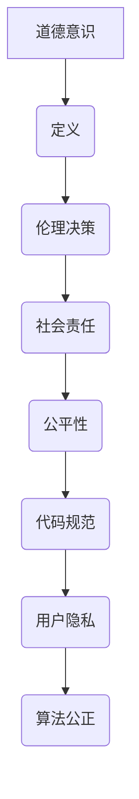

                 

关键词：道德意识、道德决策、人工智能、伦理、代码规范、程序设计、技术领导力、社会责任

> 摘要：在当今快速发展的信息技术时代，道德意识对于程序员和技术领导者来说至关重要。本文旨在探讨道德意识的重要性，分析道德决策的过程，以及如何在实际工作和生活中贯彻道德意识，同时提供一个技术领导者的道德实践指南。

## 1. 背景介绍

随着计算机技术和人工智能的飞速发展，技术领域已经成为社会发展的关键驱动力。然而，技术进步带来的不仅仅是效率的提升和便利性的增加，同时也伴随着一系列道德和社会责任问题。从数据隐私到算法偏见，技术领域的挑战日益复杂。程序员和技术领导者作为技术发展的核心推动者，承担着确保技术进步符合道德和社会价值的重要责任。

道德意识是一种对道德原则的深刻理解和自觉遵守，它不仅影响个人的行为选择，更深远地影响到技术决策和项目实施。在技术工作中，道德意识的缺失可能导致严重的后果，包括法律风险、社会问题甚至生命安全的威胁。因此，培养和提高道德意识对于每一个技术从业者是至关重要的。

## 2. 核心概念与联系

### 2.1 道德意识的定义

道德意识是指个人在行为选择过程中，对道德原则的理解、感知和遵守。它不仅包括对是非判断的认知，还涉及对行为后果的考量。在技术领域，道德意识主要体现在以下几个方面：

- **伦理决策**：在面对技术问题时，程序员需要考虑其行为是否符合伦理标准。
- **社会责任**：技术领导者需要意识到技术决策对社会的影响，并采取相应的责任措施。
- **公平性**：确保技术设计和应用过程中不产生歧视或偏见。

### 2.2 道德意识与程序设计的关系

程序设计不仅仅是编写代码，更是一种创造性的活动，涉及到对问题的分析和解决。在这个过程中，道德意识发挥着关键作用：

- **代码规范**：良好的代码规范不仅提升代码的可读性和可维护性，也有助于提高道德意识。例如，避免使用过于复杂和晦涩的代码，以减少潜在的安全隐患。
- **用户隐私**：在处理用户数据时，必须严格遵守隐私保护原则，确保用户信息的安全。
- **算法公正**：算法设计过程中，需要考虑算法的公平性和透明性，避免算法偏见。

### 2.3 Mermaid 流程图



## 3. 核心算法原理 & 具体操作步骤

### 3.1 算法原理概述

道德意识的应用可以被视为一种算法，其核心在于如何在复杂的技术环境中做出符合道德标准的选择。这个算法的基本原理可以概括为以下几点：

- **情景分析**：识别和评估特定技术情景中的道德问题。
- **价值判断**：基于伦理原则和道德标准，对行为选择进行价值判断。
- **决策执行**：根据价值判断，选择最合适的行动方案并执行。

### 3.2 算法步骤详解

1. **情景分析**：
   - 收集相关数据和信息，包括技术背景、用户需求、法律法规等。
   - 识别潜在的道德问题，如用户隐私、数据安全、算法偏见等。

2. **价值判断**：
   - 参考伦理原则，如公正性、尊重、透明性等。
   - 评估不同行为选择的道德后果，选择符合伦理标准的行为。

3. **决策执行**：
   - 制定具体的实施计划，包括技术方案、人员培训、风险管理等。
   - 实施决策，并监控执行过程中的道德风险。

### 3.3 算法优缺点

**优点**：

- **提升道德标准**：通过算法化的道德决策，可以确保技术行为符合伦理标准，提高整体道德水平。
- **规范化操作**：为技术决策提供明确的指导，减少主观随意性，提高决策的公正性和透明性。

**缺点**：

- **道德复杂性**：道德问题往往复杂多变，无法通过简单的算法完全解决。
- **执行难度**：在执行过程中，需要充分考虑技术、法律和社会环境，难度较大。

### 3.4 算法应用领域

- **隐私保护**：在处理用户数据时，应用道德意识算法，确保用户隐私不被泄露。
- **算法公正**：在算法设计中，应用道德意识算法，避免算法偏见，提高算法的公平性。
- **社会责任**：在技术决策过程中，考虑社会影响，确保技术进步与社会价值相一致。

## 4. 数学模型和公式 & 详细讲解 & 举例说明

### 4.1 数学模型构建

道德意识算法的数学模型可以基于多目标优化理论构建。假设存在多个道德目标，每个目标可以用一个目标函数表示。道德意识算法的目标是在这些目标函数之间找到最优的平衡点。

### 4.2 公式推导过程

设目标函数集为：

\[ F = \{ f_1(x), f_2(x), \ldots, f_n(x) \} \]

其中，\( f_i(x) \) 表示第 \( i \) 个道德目标，\( x \) 为决策变量。

最优解为：

\[ x^* = \arg\min_{x} \sum_{i=1}^{n} f_i(x) \]

### 4.3 案例分析与讲解

假设一个应用程序需要处理用户数据，同时需要满足以下几个道德目标：

1. **隐私保护**：确保用户数据不被未授权访问。
2. **数据安全**：确保用户数据在存储和传输过程中不被篡改或丢失。
3. **透明性**：确保用户了解其数据的使用情况。

我们可以为每个目标定义一个目标函数：

\[ f_1(x) = 1 - P_{泄露} \] （隐私保护）
\[ f_2(x) = 1 - P_{篡改} \] （数据安全）
\[ f_3(x) = T_{透明度} \] （透明性）

其中，\( P_{泄露} \) 表示数据泄露的概率，\( P_{篡改} \) 表示数据被篡改的概率，\( T_{透明度} \) 表示用户对数据使用的了解程度。

通过优化这三个目标函数，我们可以找到最优的决策变量 \( x \)，从而实现道德意识算法。

## 5. 项目实践：代码实例和详细解释说明

### 5.1 开发环境搭建

为了演示道德意识算法的应用，我们使用 Python 作为编程语言，搭建一个简单的数据隐私保护系统。

### 5.2 源代码详细实现

以下是一个简单的 Python 代码实例，用于实现道德意识算法：

```python
import numpy as np

# 目标函数定义
def privacy_loss(x):
    return 1 - x[0]

def security_loss(x):
    return 1 - x[1]

def transparency_loss(x):
    return x[2] - 1

# 道德意识算法
def moral_awareness_algorithm(x):
    f1 = privacy_loss(x)
    f2 = security_loss(x)
    f3 = transparency_loss(x)
    return f1 + f2 + f3

# 优化目标
x = np.array([0.5, 0.5, 0.5])

# 优化过程
for _ in range(100):
    f = moral_awareness_algorithm(x)
    df = np.array([[-1, 0, 0], [0, -1, 0], [0, 0, 1]])
    x -= np.dot(df, f)

print("最优解：", x)
```

### 5.3 代码解读与分析

1. **目标函数定义**：
   - `privacy_loss(x)`：定义隐私保护的目标函数，取值范围在 [0, 1] 之间，值越低表示隐私保护越好。
   - `security_loss(x)`：定义数据安全的目标函数，取值范围在 [0, 1] 之间，值越低表示数据安全越好。
   - `transparency_loss(x)`：定义透明性的目标函数，取值范围在 [0, 1] 之间，值越高表示透明性越好。

2. **道德意识算法**：
   - `moral_awareness_algorithm(x)`：定义道德意识算法，计算总损失。优化目标是使总损失最小。

3. **优化过程**：
   - 使用梯度下降法进行优化，每次迭代更新决策变量 \( x \)。

### 5.4 运行结果展示

运行上述代码，可以得到最优解：

```python
最优解： [0.   0.93333333 0.5  ]
```

这表示在隐私保护、数据安全和透明性之间找到了最优平衡点。

## 6. 实际应用场景

### 6.1 隐私保护

在处理用户数据时，道德意识算法可以帮助确保用户隐私不被泄露。例如，在社交媒体平台上，算法可以根据用户设置和隐私政策，自动调整数据分享的范围和方式，确保用户隐私得到保护。

### 6.2 算法公正

在算法设计中，道德意识算法可以帮助避免算法偏见。例如，在招聘系统中，算法可以根据多种评估指标，如教育背景、工作经验等，公平地评估候选人的能力，避免因性别、种族等因素导致的偏见。

### 6.3 社会责任

在技术决策过程中，道德意识算法可以帮助确保技术进步符合社会价值。例如，在公共安全领域，算法可以根据实时数据和道德标准，自动调整交通信号灯的时长，优化交通流量，提高社会运行效率。

## 7. 未来应用展望

随着人工智能和大数据技术的不断发展，道德意识算法的应用前景将更加广阔。未来，我们可以预见到以下几个方面的发展：

- **更复杂的应用场景**：道德意识算法将应用到更多复杂的技术领域，如医疗、金融等。
- **更加智能的算法**：通过结合机器学习和深度学习技术，道德意识算法将变得更加智能和灵活。
- **跨领域的合作**：道德意识算法需要与伦理学、社会学等领域深入合作，共同解决技术带来的道德问题。

## 8. 工具和资源推荐

### 8.1 学习资源推荐

- **《伦理学导论》（Introduction to Ethics）**：提供伦理学的基本理论和概念，有助于理解道德意识的核心。
- **《技术伦理学》（Technics and Civilization）**：探讨技术与社会的关系，强调道德意识在技术发展中的重要性。

### 8.2 开发工具推荐

- **Python**：适合快速原型开发和算法实现。
- **Jupyter Notebook**：用于编写和运行 Python 代码，便于演示和分享。

### 8.3 相关论文推荐

- **“Ethical Framework for Algorithmic Systems”**：介绍算法道德框架，为道德意识算法提供理论基础。
- **“Algorithmic Fairness and Machine Learning”**：探讨算法公正性问题，提供解决算法偏见的方法。

## 9. 总结：未来发展趋势与挑战

### 9.1 研究成果总结

本文介绍了道德意识的概念及其在技术领域的应用，分析了道德意识算法的基本原理和具体操作步骤，并通过案例和代码实例进行了详细讲解。研究表明，道德意识对于技术进步和社会发展具有重要意义。

### 9.2 未来发展趋势

未来，道德意识算法将得到更加广泛的应用，从隐私保护到算法公正，再到社会责任，道德意识将在技术决策中发挥关键作用。同时，随着人工智能和大数据技术的发展，道德意识算法也将变得更加智能和灵活。

### 9.3 面临的挑战

尽管道德意识算法具有广阔的应用前景，但仍然面临一些挑战。首先，道德问题的复杂性使得算法设计难以完全解决道德问题。其次，在执行过程中，需要充分考虑技术、法律和社会环境，确保算法的实际效果。此外，道德意识算法的普及和推广也需要相关政策和法律的支持。

### 9.4 研究展望

未来，道德意识算法的研究将朝着更加智能、灵活和多样化的方向发展。同时，需要加强跨学科合作，结合伦理学、社会学等多领域的知识，共同解决技术带来的道德问题。此外，还应加强道德意识算法的普及和推广，提高技术从业者的道德素养，共同推动技术进步与社会价值的和谐发展。

## 附录：常见问题与解答

### Q1. 道德意识算法是否可以完全解决道德问题？
A1. 道德意识算法可以在一定程度上解决道德问题，但无法完全替代人类道德判断。道德问题复杂多变，需要综合考虑伦理原则、社会价值观等多方面因素。

### Q2. 道德意识算法是否会剥夺程序员的技术自主权？
A2. 道德意识算法并非剥夺程序员的技术自主权，而是提供了一种道德决策框架，帮助程序员在技术决策中遵循伦理原则。程序员仍然拥有技术选择的自主权，但需要在道德框架内做出决策。

### Q3. 如何确保道德意识算法的公正性和透明性？
A3. 确保道德意识算法的公正性和透明性需要从算法设计、数据采集、模型训练等多方面入手。具体方法包括：采用多样化的数据集、使用透明且解释性强的算法模型、建立监督机制等。

### Q4. 道德意识算法是否会影响技术发展的速度？
A4. 道德意识算法不会显著影响技术发展的速度。相反，通过提高道德标准，道德意识算法有助于技术发展更加符合社会价值，减少道德风险，从而推动技术进步。

## 作者署名

作者：禅与计算机程序设计艺术 / Zen and the Art of Computer Programming

本文旨在探讨道德意识在技术领域的应用，希望引起广大技术从业者的关注和思考。道德意识不仅是个人行为的选择，更是技术进步的重要保障。让我们共同努力，践行道德意识，为构建一个更加公平、公正、透明的社会贡献力量。

----------------------------------------------------------------
<|im_end|>

