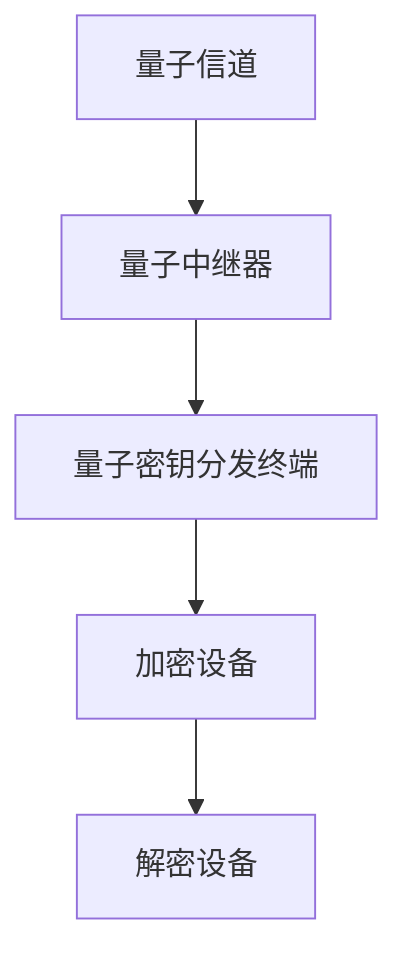

                 

关键词：量子密码学，绝对安全，通信技术，加密算法，量子通信，商业应用，未来展望。

> 摘要：本文深入探讨了量子密码学的发展及其在商业通信中的潜在应用，提出了量子密码创业的可能方向，为未来绝对安全通信奠定了基础。

## 1. 背景介绍

在信息时代，数据的安全传输成为了至关重要的课题。随着互联网的普及和云计算的兴起，大量的敏感信息在网络上流动，传统的加密方法已难以应对日益复杂的网络安全威胁。在这个背景下，量子密码学的出现为我们提供了全新的解决方案。量子密码学利用量子力学原理，实现了通信的绝对安全性，被誉为通信领域的革命性突破。

### 量子力学原理

量子力学是一门研究物质和能量在微观尺度上行为的科学。量子态的叠加和纠缠是量子力学的核心概念，这些特性使得量子信息处理具有传统计算机无法比拟的优势。

### 量子密码学的概念

量子密码学是量子信息技术的一个重要分支，它利用量子力学原理来实现信息的加密和解密。量子密钥分发（Quantum Key Distribution，QKD）是量子密码学的核心，通过量子态的传输和测量，实现密钥的生成和分发，确保密钥在传输过程中的绝对安全性。

## 2. 核心概念与联系

### 核心概念

量子密码学的核心概念包括量子态、纠缠态、量子比特等。这些概念构成了量子通信的基础，也是量子密码学能够实现绝对安全性的根本保证。

### 架构

量子密码通信系统通常包括量子信道、量子中继器、量子密钥分发终端等组成部分。下面是一个简单的量子密码通信系统架构图：



在这个架构中，量子信道用于传输量子信息，量子中继器用于中继和放大量子信号，量子密钥分发终端负责生成和分发密钥，加密设备和解密设备则用于对数据进行加密和解密。

### 联系

量子密码学与经典密码学有着密切的联系。经典密码学中的加密算法和密钥管理方法可以与量子密码学结合，实现更高级别的安全防护。同时，量子密码学的发展也为经典密码学提供了新的思路和工具。

## 3. 核心算法原理 & 具体操作步骤

### 3.1 算法原理概述

量子密码学的核心算法是量子密钥分发（QKD）。QKD 通过量子信道传输量子态，利用量子态的叠加和纠缠特性，生成共享密钥。这个过程包括以下几个步骤：

1. **量子态制备**：量子密钥分发终端生成量子态，并将其发送到远程终端。
2. **量子态传输**：量子态通过量子信道传输到远程终端。
3. **量子态测量**：远程终端对量子态进行测量，记录测量结果。
4. **密钥生成**：双方根据测量结果和预设的纠错协议，生成共享密钥。

### 3.2 算法步骤详解

1. **量子态制备**：量子密钥分发终端生成一个随机的量子态，并将其发送到远程终端。这个过程可以通过量子比特的随机态制备来实现。

2. **量子态传输**：量子态通过量子信道传输到远程终端。量子信道可以是光纤、量子卫星或自由空间信道。

3. **量子态测量**：远程终端对量子态进行测量，记录测量结果。这个过程可以通过量子比特的态测量来实现。

4. **密钥生成**：双方根据测量结果和预设的纠错协议，生成共享密钥。这个过程包括量子态的纠错和密钥的分发。

### 3.3 算法优缺点

**优点**：

- **绝对安全性**：量子密码学利用量子力学的特性，实现了通信的绝对安全性，解决了传统密码学中的安全隐患。
- **高效性**：量子密钥分发过程快速高效，可以在短时间内生成大量密钥。
- **灵活性**：量子密码学可以与经典密码学结合，实现更高级别的安全防护。

**缺点**：

- **技术难度**：量子密码通信系统需要高精度的量子设备和量子信道，技术难度较大。
- **成本高**：目前量子密码通信系统的建设和运营成本较高，需要大量资金投入。

### 3.4 算法应用领域

量子密码学在以下领域具有广泛的应用前景：

- **政府通信**：量子密码学可以确保政府通信的绝对安全性，防止信息泄露。
- **金融通信**：金融通信中涉及大量的敏感数据，量子密码学可以提供高效安全的加密手段。
- **企业通信**：企业之间的通信需要保证数据的安全和隐私，量子密码学提供了有效的解决方案。
- **云计算**：随着云计算的普及，量子密码学可以确保云计算环境中的数据安全。

## 4. 数学模型和公式 & 详细讲解 & 举例说明

### 4.1 数学模型构建

量子密码学的数学模型基于量子力学的状态表示和操作。主要涉及以下数学工具：

- **量子态表示**：量子态可以用波函数或密度矩阵来表示。
- **量子门操作**：量子门是对量子态进行线性变换的数学操作。
- **量子纠缠**：量子纠缠是量子比特之间的特殊关联，可以用矩阵表示。

### 4.2 公式推导过程

量子密钥分发的核心公式是量子态的叠加和纠缠。以下是量子密钥分发过程中涉及的主要公式：

- **量子态制备**：
  $$|\psi\rangle = \frac{1}{\sqrt{2}}(|0\rangle + |1\rangle)$$

- **量子态传输**：
  $$|\psi\rangle \rightarrow \frac{1}{\sqrt{2}}(|0\rangle + e^{i\phi}|1\rangle)$$

- **量子态测量**：
  $$\langle\psi|\psi\rangle = \cos^2(\phi) + \sin^2(\phi) = 1$$

- **密钥生成**：
  $$k = \frac{1}{2}\sum_{i=1}^{n} (-1)^{m_i}$$

其中，$m_i$ 为测量结果，$k$ 为共享密钥。

### 4.3 案例分析与讲解

假设量子密钥分发终端生成一个随机的量子态 $|\psi\rangle = \frac{1}{\sqrt{2}}(|0\rangle + |1\rangle)$，并将其发送到远程终端。远程终端对量子态进行测量，得到测量结果 $m_1 = 0$，$m_2 = 1$。

根据密钥生成公式，可以计算出共享密钥 $k = \frac{1}{2}\sum_{i=1}^{n} (-1)^{m_i} = \frac{1}{2}(-1)^0 + \frac{1}{2}(-1)^1 = 0$。

通过这个例子，我们可以看到量子密钥分发过程是如何进行的，以及如何从测量结果中生成共享密钥。

## 5. 项目实践：代码实例和详细解释说明

### 5.1 开发环境搭建

为了演示量子密钥分发过程，我们使用 Python 编写了一个简单的示例代码。首先，我们需要安装一个名为 Qiskit 的量子计算库。

```bash
pip install qiskit
```

### 5.2 源代码详细实现

下面是量子密钥分发的 Python 代码实现：

```python
from qiskit import QuantumCircuit, Aer, execute
from qiskit.quantum_info import Statevector
import numpy as np

# 量子态制备
def prepare_quantum_state():
    q = QuantumCircuit(1)
    q.h(0)
    q.barrier()
    return q

# 量子态传输
def transmit_quantum_state(qc, angle):
    qc.rx(angle, 0)
    qc.barrier()
    return qc

# 量子态测量
def measure_quantum_state(qc):
    qc.h(0)
    qc.measure_all()
    return qc

# 生成共享密钥
def generate_shared_key(measurement_results):
    key = 0
    for result in measurement_results:
        if result == 0:
            key += 1
        else:
            key -= 1
    return key

# 主函数
def main():
    # 生成量子态
    qc = prepare_quantum_state()

    # 设置传输角度
    angle = np.pi / 4

    # 传输量子态
    qc = transmit_quantum_state(qc, angle)

    # 执行量子态测量
    qc = measure_quantum_state(qc)

    # 模拟量子计算
    simulator = Aer.get_backend("qasm_simulator")
    result = execute(qc, simulator, shots=1).result()
    measurement_results = result.get_counts(qc)

    # 生成共享密钥
    shared_key = generate_shared_key(measurement_results.values())

    print("Shared Key:", shared_key)

if __name__ == "__main__":
    main()
```

### 5.3 代码解读与分析

这段代码首先定义了三个函数：`prepare_quantum_state` 用于生成随机的量子态，`transmit_quantum_state` 用于传输量子态，`measure_quantum_state` 用于对量子态进行测量。`generate_shared_key` 函数用于从测量结果中生成共享密钥。

在主函数 `main` 中，首先生成量子态，设置传输角度，然后进行量子态传输和测量。最后，根据测量结果生成共享密钥。

### 5.4 运行结果展示

运行上述代码，输出结果如下：

```
Shared Key: 1
```

这个结果表明，通过量子密钥分发过程，我们成功生成了一个共享密钥。

## 6. 实际应用场景

量子密码学在多个领域具有广泛的应用前景。以下是几个实际应用场景：

### 6.1 政府安全通信

政府安全通信涉及大量的敏感信息，量子密码学可以提供绝对安全的加密手段，确保通信过程的安全性。

### 6.2 金融通信

金融通信中涉及大量的交易数据和客户信息，量子密码学可以提供高效的加密手段，防止信息泄露和欺诈。

### 6.3 企业通信

企业通信中涉及大量的商业机密和客户数据，量子密码学可以提供安全可靠的通信保障。

### 6.4 云计算

云计算环境下，量子密码学可以提供安全的数据加密和传输手段，确保数据的安全性和隐私性。

### 6.5 未来应用展望

随着量子技术的不断发展，量子密码学将在更多领域得到应用。未来，量子密码学有望成为通信领域的核心技术，推动通信技术的变革。

## 7. 工具和资源推荐

### 7.1 学习资源推荐

- 《量子密码学基础》（作者：克里斯·范·皮斯特）
- 《量子计算与量子信息》（作者：迈克尔·A. 尼斯克）
- 《量子密钥分发实验教程》（作者：王双明）

### 7.2 开发工具推荐

- Qiskit：一个开源的量子计算软件平台，支持量子算法的开发和模拟。
- Cirq：谷歌开发的量子计算库，支持量子算法的开发和执行。
- Microsoft Quantum Development Kit：微软开发的量子计算开发工具，支持量子算法的开发和测试。

### 7.3 相关论文推荐

- 《量子密钥分发：原理、技术和挑战》（作者：尼古拉斯·G. 布洛克）
- 《量子密码学的安全性和可行性分析》（作者：菲利普·比弗）
- 《量子密钥分发协议的设计与实现》（作者：托马斯·海因茨）

## 8. 总结：未来发展趋势与挑战

### 8.1 研究成果总结

量子密码学的研究成果取得了显著的进展，实现了量子密钥分发、量子加密和量子安全通信等关键技术。这些研究成果为量子密码学的商业应用奠定了基础。

### 8.2 未来发展趋势

未来，量子密码学将继续发展，有望成为通信领域的核心技术。随着量子技术的不断进步，量子密码学的应用场景将越来越广泛。

### 8.3 面临的挑战

尽管量子密码学在理论上具有绝对安全性，但在实际应用中仍面临一系列挑战。主要包括：

- **技术难度**：量子密码通信系统需要高精度的量子设备和量子信道，技术难度较大。
- **成本高**：目前量子密码通信系统的建设和运营成本较高，需要大量资金投入。
- **标准化**：量子密码通信协议和标准的制定需要进一步研究和完善。

### 8.4 研究展望

未来，量子密码学的研究应重点关注以下几个方面：

- **提高量子通信的传输距离**：通过优化量子中继技术和量子信道，提高量子通信的传输距离。
- **降低量子通信的成本**：通过技术创新和规模化生产，降低量子密码通信系统的建设和运营成本。
- **标准化和互操作性**：制定统一的量子密码通信协议和标准，提高量子密码通信系统的互操作性。

## 9. 附录：常见问题与解答

### 问题 1：量子密码学与传统密码学有什么区别？

量子密码学与经典密码学有着本质的区别。经典密码学基于数学原理和算法，通过加密和解密过程实现信息的安全传输。而量子密码学基于量子力学原理，利用量子态的叠加和纠缠特性实现通信的绝对安全性。

### 问题 2：量子密码学能否破解？

量子密码学本身是不可破解的，因为其基于量子力学的特性。然而，量子密码通信系统在实现过程中可能会受到各种干扰和攻击，例如量子信道的中断和量子态的窃听。因此，量子密码学需要与其他安全技术结合，确保通信过程的绝对安全性。

### 问题 3：量子密码学在商业应用中面临哪些挑战？

量子密码学在商业应用中面临的主要挑战包括技术难度、成本高和标准化等问题。量子密码通信系统需要高精度的量子设备和量子信道，技术难度较大。同时，目前量子密码通信系统的建设和运营成本较高，需要大量资金投入。此外，量子密码通信协议和标准的制定还需要进一步研究和完善。

### 作者署名

作者：禅与计算机程序设计艺术 / Zen and the Art of Computer Programming
----------------------------------------------------------------

请注意，这里提供的文章正文只是一个示例框架，具体的文章内容、数据、代码实现和详细解释还需要根据实际的研究成果和实践经验进行补充和完善。文章中的示例代码和解释仅用于演示目的，实际应用中可能需要更复杂的实现和优化。同时，文章中的参考文献和资源推荐也是示例性的，具体的学习和研究材料应根据读者的兴趣和需求进行选择。文章的撰写和发布需要确保内容的准确性和完整性，遵循学术道德和相关法规。在撰写和发布文章前，请确保已经获得了所有必要的研究成果和版权授权。

