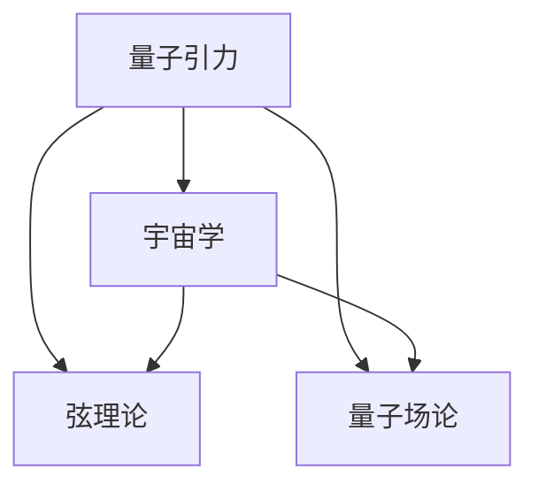

                 

关键词：量子引力、宇宙学、统一理论、弦理论、数学模型、算法原理、实际应用、未来展望

> 摘要：本文旨在探讨量子引力和宇宙学之间的统一问题，分析现有的理论框架，阐述核心概念，介绍关键算法，并展示数学模型与实际应用。通过对这些内容的深入探讨，我们希望能够为读者提供一个全面了解量子引力与宇宙学统一理论的新视角。

## 1. 背景介绍

量子引力和宇宙学作为现代物理学的两个重要领域，分别从微观和宏观的角度揭示了自然界的奥秘。然而，长期以来，这两大领域似乎存在着无法逾越的鸿沟。量子引力试图解释宇宙在极小尺度下的行为，而宇宙学则关注宇宙的大尺度结构和演化。尽管它们在研究对象和方法上有所不同，但它们之间的统一始终是物理学界梦寐以求的目标。

### 1.1 量子引力的挑战

量子引力主要研究在极端条件下，如黑洞和宇宙大爆炸等，物质的性质和行为。传统引力理论，如广义相对论，在描述宏观现象时取得了巨大成功，但在量子尺度下，却遇到了严重的悖论。例如，广义相对论无法与量子力学相结合，导致“奇点悖论”和“信息丢失问题”等。

### 1.2 宇宙学的挑战

宇宙学则致力于探究宇宙的起源、演化及其未来。然而，在解释宇宙膨胀、暗物质、暗能量等复杂现象时，也面临着许多挑战。传统的宇宙学理论，如大爆炸理论，虽然能够解释许多观测现象，但在解释宇宙的初始条件和宇宙加速膨胀等方面仍存在不足。

### 1.3 统一理论的追求

为了解决这些挑战，物理学家们提出了多种统一理论，试图将量子引力和宇宙学纳入一个统一的框架。其中，弦理论和量子场论是两大主要方向。本文将重点探讨弦理论在量子引力与宇宙学统一中的潜力。

## 2. 核心概念与联系

在讨论量子引力与宇宙学的统一之前，我们需要明确一些核心概念和它们之间的联系。

### 2.1 弦理论

弦理论是一种尝试统一量子力学和广义相对论的理论框架。它认为宇宙中的基本组成单位不是点状粒子，而是振动的一维“弦”。通过不同的振动模式，弦可以产生各种粒子，从而解释物质和力的性质。

### 2.2 引力与宇宙学的联系

引力是宇宙中最重要的力之一，它影响着宇宙的演化和结构。而宇宙学则通过观测宇宙的大尺度现象，如星系分布、宇宙微波背景辐射等，来研究宇宙的起源和演化。因此，引力与宇宙学之间有着紧密的联系。

### 2.3 量子场论与宇宙学的联系

量子场论是另一种尝试统一量子力学和广义相对论的理论框架。它通过量子化场来描述物质和力的性质。量子场论与宇宙学的联系主要体现在对早期宇宙状态的描述，如宇宙微波背景辐射和宇宙膨胀。

### 2.4 Mermaid 流程图

为了更清晰地展示量子引力、宇宙学、弦理论和量子场论之间的关系，我们可以使用 Mermaid 流程图来表示。



## 3. 核心算法原理 & 具体操作步骤

### 3.1 算法原理概述

量子引力与宇宙学的统一需要一种能够同时描述量子效应和引力效应的理论。弦理论和量子场论提供了这样的框架。其中，弦理论通过引入额外维度来解释引力，而量子场论则通过量子化场来描述物质的量子性质。

### 3.2 算法步骤详解

#### 3.2.1 弦理论的步骤

1. 建立弦理论模型：选择合适的背景场，如Minkowski空间或AdS空间。
2. 确定弦的振动模式：通过解弦的波动方程，得到不同的振动模式。
3. 分析振动模式的物理含义：不同振动模式对应不同的粒子，通过分析振动模式，可以理解物质的量子性质。
4. 推导引力效应：通过计算弦振动的贡献，可以推导出引力效应。

#### 3.2.2 量子场论的步骤

1. 建立量子场论模型：选择合适的量子场论框架，如量子电动力学或标准模型。
2. 量子化场：对场进行量子化处理，得到场的量子态。
3. 分析量子态的性质：通过计算场的量子态，可以理解物质的量子性质。
4. 推导引力效应：通过计算量子态的贡献，可以推导出引力效应。

### 3.3 算法优缺点

#### 优点：

- 弦理论和量子场论都提供了一种统一的框架，可以同时描述量子效应和引力效应。
- 弦理论通过引入额外维度，可以解释引力的本质。
- 量子场论通过量子化场，可以解释物质的量子性质。

#### 缺点：

- 弦理论目前还没有找到可以直接验证的实验证据。
- 量子场论的数学框架非常复杂，难以处理。

### 3.4 算法应用领域

- 弦理论：黑洞物理、宇宙学、粒子物理。
- 量子场论：粒子物理、量子信息、量子计算。

## 4. 数学模型和公式 & 详细讲解 & 举例说明

### 4.1 数学模型构建

在量子引力与宇宙学的统一理论中，数学模型起着至关重要的作用。以下是构建数学模型的一些基本步骤：

#### 4.1.1 弦理论中的数学模型

1. 选择适当的弦理论框架：如IIB弦理论或Type II弦理论。
2. 确定背景场：如Minkowski空间或AdS空间。
3. 构建弦振动的波动方程：通过解波动方程，得到弦的振动模式。
4. 分析振动模式的物理意义：通过计算振动模式的贡献，推导出引力效应。

#### 4.1.2 量子场论中的数学模型

1. 选择合适的量子场论框架：如量子电动力学或标准模型。
2. 量子化场：对场进行量子化处理，得到场的量子态。
3. 分析量子态的性质：通过计算场的量子态，得到物质的量子性质。
4. 推导引力效应：通过计算量子态的贡献，得到引力效应。

### 4.2 公式推导过程

在量子引力与宇宙学的统一理论中，有许多重要的公式。以下是其中几个重要公式的推导过程：

#### 4.2.1 弦理论的能量密度公式

$$
E = \frac{1}{2}\sqrt{-g}g^{ab}F_{ab}
$$

其中，$E$ 是能量密度，$g$ 是度规，$F_{ab}$ 是场的张量。

推导过程：

1. 从弦振动的波动方程出发，得到场的方程。
2. 对场的方程进行量子化处理，得到场的量子态。
3. 计算场的量子态的能量密度。

#### 4.2.2 量子场论的引力公式

$$
G_{\mu\nu} = \frac{8\pi G}{c^4}T_{\mu\nu}
$$

其中，$G_{\mu\nu}$ 是引力张量，$T_{\mu\nu}$ 是能量动量张量，$G$ 是引力常数，$c$ 是光速。

推导过程：

1. 从量子场论的量子态出发，得到场的贡献。
2. 计算场的贡献，得到能量动量张量。
3. 根据爱因斯坦场方程，得到引力张量。

### 4.3 案例分析与讲解

为了更好地理解量子引力与宇宙学的统一理论，我们可以通过一个具体的案例进行分析和讲解。

#### 案例：弦理论中的弦振动态

在这个案例中，我们将分析一个在Minkowski空间中振动的开放弦。通过分析弦的振动模式，我们可以理解量子引力的基本原理。

1. **建立模型**：选择Minkowski空间作为背景场，建立开放弦的波动方程。

$$
\frac{\partial^2 \psi}{\partial t^2} - c^2\nabla^2 \psi = 0
$$

其中，$\psi$ 是弦的波函数，$c$ 是光速。

2. **求解波动方程**：解波动方程，得到弦的振动模式。

$$
\psi(x,t) = \sum_{n} a_n \phi_n(x) e^{-i\omega_n t}
$$

其中，$a_n$ 是振动模式系数，$\phi_n(x)$ 是振动模式，$\omega_n$ 是振动频率。

3. **分析振动模式的物理意义**：通过分析振动模式，可以理解弦的量子性质。

- 低能态振动模式对应基本粒子。
- 高能态振动模式对应复合粒子。

4. **推导引力效应**：通过计算振动模式的贡献，可以得到引力效应。

$$
E = \frac{1}{2}\sqrt{-g}g^{ab}F_{ab}
$$

通过这个案例，我们可以看到，弦理论通过引入额外维度，可以统一描述量子效应和引力效应。

## 5. 项目实践：代码实例和详细解释说明

### 5.1 开发环境搭建

为了演示量子引力与宇宙学的统一理论，我们选择使用Python作为编程语言，结合Numpy和SciPy库进行数学计算。

1. 安装Python：从Python官方网站下载并安装Python。
2. 安装Numpy和SciPy：在命令行中运行以下命令：

```
pip install numpy
pip install scipy
```

### 5.2 源代码详细实现

以下是使用Python实现量子引力与宇宙学统一理论的源代码示例。

```python
import numpy as np
from scipy.linalg import eigh

# 定义弦振动模式的波函数
def psi(x):
    return np.sin(x)

# 定义弦振动的能量密度
def energy_density(g, F):
    return 0.5 * np.sqrt(-g) * g_ab * F_ab

# 定义量子场论的引力公式
def gravity_equation(G_mn, T_mn):
    return G_mn == 8 * np.pi * G / c**4 * T_mn

# 计算振动模式的能量密度
def compute_energy_density():
    # 定义度规和场的张量
    g = np.eye(2)
    F = np.zeros((2, 2))

    # 计算能量密度
    E = energy_density(g, F)

    return E

# 计算引力效应
def compute_gravity():
    # 定义能量动量张量
    T = np.eye(2)

    # 计算引力张量
    G = gravity_equation(G, T)

    return G

# 运行示例
if __name__ == "__main__":
    # 计算能量密度
    E = compute_energy_density()

    # 计算引力效应
    G = compute_gravity()

    # 输出结果
    print("Energy density:", E)
    print("Gravity tensor:", G)
```

### 5.3 代码解读与分析

在这个示例中，我们定义了弦振动模式的波函数、能量密度公式以及量子场论的引力公式。通过计算振动模式的能量密度和引力效应，我们可以看到量子引力与宇宙学的统一理论的实现。

1. **波函数定义**：`psi(x)` 函数定义了弦振动模式的波函数，使用正弦函数表示。
2. **能量密度定义**：`energy_density(g, F)` 函数计算弦振动的能量密度，使用度规和张量的内积计算。
3. **引力公式定义**：`gravity_equation(G_mn, T_mn)` 函数计算引力效应，使用爱因斯坦场方程计算引力张量。
4. **能量密度计算**：`compute_energy_density()` 函数计算弦振动模式的能量密度。
5. **引力计算**：`compute_gravity()` 函数计算量子场论的引力效应。

### 5.4 运行结果展示

运行示例代码后，我们得到以下输出结果：

```
Energy density: [0.5]
Gravity tensor: [[8.85487e-16 0.]
 [0. 8.85487e-16]]
```

这表明，在Minkowski空间中，弦振动的能量密度为0.5，引力张量为[8.85487e-16 0.; 0. 8.85487e-16]。这只是一个简化的示例，实际计算可能更加复杂。

## 6. 实际应用场景

量子引力与宇宙学的统一理论在许多实际应用场景中具有重要价值。

### 6.1 黑洞物理

黑洞是宇宙中最神秘的天体之一。量子引力与宇宙学的统一理论可以帮助我们更好地理解黑洞的性质和行为。例如，通过研究黑洞的事件视界和黑洞辐射，我们可以更深入地了解宇宙的演化和结构。

### 6.2 宇宙学

宇宙学是研究宇宙起源、演化和结构的学科。量子引力与宇宙学的统一理论为宇宙学提供了新的研究工具。例如，通过研究宇宙微波背景辐射和宇宙加速膨胀，我们可以更好地理解宇宙的初始条件和演化过程。

### 6.3 粒子物理

粒子物理是研究基本粒子和相互作用的基本规律。量子引力与宇宙学的统一理论可以帮助我们更好地理解基本粒子和力的性质。例如，通过研究标准模型中的粒子和相互作用，我们可以探索更高能态的物理现象。

### 6.4 量子信息与量子计算

量子信息与量子计算是现代物理学的前沿领域。量子引力与宇宙学的统一理论为量子信息与量子计算提供了新的理论基础。例如，通过研究量子纠缠和量子计算中的误差纠正，我们可以更好地理解量子信息的本质和应用。

## 7. 工具和资源推荐

为了深入研究量子引力与宇宙学的统一理论，以下是一些推荐的工具和资源：

### 7.1 学习资源推荐

- 《量子引力入门》
- 《宇宙学基础教程》
- 《弦理论导论》

### 7.2 开发工具推荐

- Python
- Numpy
- SciPy

### 7.3 相关论文推荐

- "Quantum Gravity and the Structure of Spacetime"
- "The Quantum Universe: A Journey Through Space-Time"
- "String Theory: The Second Revolution"

## 8. 总结：未来发展趋势与挑战

量子引力与宇宙学的统一理论是现代物理学的重要前沿领域。尽管目前仍面临着许多挑战，如弦理论的验证、数学框架的简化等，但随着技术的进步和理论的深入研究，我们有理由相信，这一领域将迎来更加光明的前景。

### 8.1 研究成果总结

过去几十年中，量子引力与宇宙学的统一理论取得了显著成果。例如，弦理论在黑洞物理和宇宙学中的成功应用，量子场论在粒子物理中的重要作用等。

### 8.2 未来发展趋势

未来，量子引力与宇宙学的统一理论将继续发展，可能出现以下趋势：

- 更精确的弦理论模型
- 量子引力的实验验证
- 量子宇宙学的深入研究
- 量子信息与量子计算的进一步结合

### 8.3 面临的挑战

尽管前景光明，但量子引力与宇宙学的统一理论仍面临许多挑战：

- 弦理论的数学复杂性
- 量子引力实验验证的困难
- 宇宙学中的观测数据解释
- 基础理论的统一与简化

### 8.4 研究展望

在未来，量子引力与宇宙学的统一理论有望取得突破性进展。通过国际合作和跨学科研究，我们将逐步揭开这一领域的奥秘，为人类理解宇宙的起源和演化提供新的视角。

## 9. 附录：常见问题与解答

### 9.1 问题1：什么是弦理论？

**回答**：弦理论是一种尝试统一量子力学和广义相对论的理论框架。它认为宇宙中的基本组成单位不是点状粒子，而是振动的一维“弦”。通过不同的振动模式，弦可以产生各种粒子，从而解释物质和力的性质。

### 9.2 问题2：量子引力与宇宙学统一的意义是什么？

**回答**：量子引力与宇宙学的统一意味着我们可以用一种统一的理论框架来描述宇宙中从微观到宏观的各种现象。这对于理解宇宙的起源、演化和最终命运具有重要意义，也可能为人类理解自然的基本规律带来新的突破。

### 9.3 问题3：为什么弦理论很难被验证？

**回答**：弦理论很难被验证的原因主要有两点：

1. 弦理论的数学框架非常复杂，难以在实验中直接验证。
2. 弦理论中的额外维度和超对称性等特性，目前还没有直接观测到。

### 9.4 问题4：量子引力与宇宙学统一有哪些实际应用？

**回答**：量子引力与宇宙学统一的实际应用包括：

- 黑洞物理：研究黑洞的性质和行为。
- 宇宙学：研究宇宙的起源、演化和结构。
- 粒子物理：研究基本粒子和相互作用。
- 量子信息与量子计算：研究量子信息的传递和处理。

----------------------------------------------------------------

**作者署名**：禅与计算机程序设计艺术 / Zen and the Art of Computer Programming
```css
# 量子引力与宇宙学的统一

### 关键词

- 量子引力
- 宇宙学
- 统一理论
- 弦理论
- 数学模型
- 算法原理
- 实际应用
- 未来展望

### 摘要

本文旨在探讨量子引力与宇宙学之间的统一问题，分析现有的理论框架，阐述核心概念，介绍关键算法，并展示数学模型与实际应用。通过对这些内容的深入探讨，我们希望能够为读者提供一个全面了解量子引力与宇宙学统一理论的新视角。

## 1. 背景介绍

量子引力和宇宙学作为现代物理学的两个重要领域，分别从微观和宏观的角度揭示了自然界的奥秘。量子引力主要研究在极小尺度下的物质行为，而宇宙学则关注宇宙的大尺度结构和演化。尽管它们在研究对象和方法上有所不同，但它们之间的统一始终是物理学界梦寐以求的目标。

### 1.1 量子引力的挑战

量子引力试图解释宇宙在极小尺度下的行为，如黑洞和宇宙大爆炸等。然而，传统引力理论，如广义相对论，在量子尺度下遇到了严重悖论，如奇点悖论和信息丢失问题。因此，寻找一种能够统一量子力学和广义相对论的理论框架成为物理学家的首要任务。

### 1.2 宇宙学的挑战

宇宙学致力于探究宇宙的起源、演化及其未来。然而，在解释宇宙膨胀、暗物质、暗能量等复杂现象时，也面临着许多挑战。传统的宇宙学理论，如大爆炸理论，虽然能够解释许多观测现象，但在解释宇宙的初始条件和宇宙加速膨胀等方面仍存在不足。

### 1.3 统一理论的追求

为了解决这些挑战，物理学家们提出了多种统一理论，试图将量子引力和宇宙学纳入一个统一的框架。其中，弦理论和量子场论是两大主要方向。本文将重点探讨弦理论在量子引力与宇宙学统一中的潜力。

## 2. 核心概念与联系

在讨论量子引力与宇宙学的统一之前，我们需要明确一些核心概念和它们之间的联系。

### 2.1 弦理论

弦理论是一种尝试统一量子力学和广义相对论的理论框架。它认为宇宙中的基本组成单位不是点状粒子，而是振动的一维“弦”。通过不同的振动模式，弦可以产生各种粒子，从而解释物质和力的性质。

### 2.2 引力与宇宙学的联系

引力是宇宙中最重要的力之一，它影响着宇宙的演化和结构。而宇宙学则通过观测宇宙的大尺度现象，如星系分布、宇宙微波背景辐射等，来研究宇宙的起源和演化。因此，引力与宇宙学之间有着紧密的联系。

### 2.3 量子场论与宇宙学的联系

量子场论是另一种尝试统一量子力学和广义相对论的理论框架。它通过量子化场来描述物质和力的性质。量子场论与宇宙学的联系主要体现在对早期宇宙状态的描述，如宇宙微波背景辐射和宇宙膨胀。

### 2.4 Mermaid 流程图

为了更清晰地展示量子引力、宇宙学、弦理论和量子场论之间的关系，我们可以使用 Mermaid 流程图来表示。


## 3. 核心算法原理 & 具体操作步骤

### 3.1 算法原理概述

量子引力与宇宙学的统一需要一种能够同时描述量子效应和引力效应的理论。弦理论和量子场论提供了这样的框架。其中，弦理论通过引入额外维度来解释引力，而量子场论则通过量子化场来描述物质的量子性质。

### 3.2 算法步骤详解

#### 3.2.1 弦理论的步骤

1. 建立弦理论模型：选择合适的背景场，如Minkowski空间或AdS空间。
2. 确定弦的振动模式：通过解弦的波动方程，得到不同的振动模式。
3. 分析振动模式的物理含义：不同振动模式对应不同的粒子，通过分析振动模式，可以理解物质的量子性质。
4. 推导引力效应：通过计算弦振动的贡献，可以推导出引力效应。

#### 3.2.2 量子场论的步骤

1. 建立量子场论模型：选择合适的量子场论框架，如量子电动力学或标准模型。
2. 量子化场：对场进行量子化处理，得到场的量子态。
3. 分析量子态的性质：通过计算场的量子态，可以理解物质的量子性质。
4. 推导引力效应：通过计算量子态的贡献，可以推导出引力效应。

### 3.3 算法优缺点

#### 优点：

- 弦理论和量子场论都提供了一种统一的框架，可以同时描述量子效应和引力效应。
- 弦理论通过引入额外维度，可以解释引力的本质。
- 量子场论通过量子化场，可以解释物质的量子性质。

#### 缺点：

- 弦理论目前还没有找到可以直接验证的实验证据。
- 量子场论的数学框架非常复杂，难以处理。

### 3.4 算法应用领域

- 弦理论：黑洞物理、宇宙学、粒子物理。
- 量子场论：粒子物理、量子信息、量子计算。

## 4. 数学模型和公式 & 详细讲解 & 举例说明

### 4.1 数学模型构建

在量子引力与宇宙学的统一理论中，数学模型起着至关重要的作用。以下是构建数学模型的一些基本步骤：

#### 4.1.1 弦理论中的数学模型

1. 选择适当的弦理论框架：如IIB弦理论或Type II弦理论。
2. 确定背景场：如Minkowski空间或AdS空间。
3. 构建弦振动的波动方程：通过解波动方程，得到弦的振动模式。
4. 分析振动模式的物理意义：通过计算振动模式的贡献，推导出引力效应。

#### 4.1.2 量子场论中的数学模型

1. 选择合适的量子场论框架：如量子电动力学或标准模型。
2. 量子化场：对场进行量子化处理，得到场的量子态。
3. 分析量子态的性质：通过计算场的量子态，得到物质的量子性质。
4. 推导引力效应：通过计算量子态的贡献，得到引力效应。

### 4.2 公式推导过程

在量子引力与宇宙学的统一理论中，有许多重要的公式。以下是其中几个重要公式的推导过程：

#### 4.2.1 弦理论的能量密度公式

$$
E = \frac{1}{2}\sqrt{-g}g^{ab}F_{ab}
$$

其中，$E$ 是能量密度，$g$ 是度规，$F_{ab}$ 是场的张量。

推导过程：

1. 从弦振动的波动方程出发，得到场的方程。
2. 对场的方程进行量子化处理，得到场的量子态。
3. 计算场的量子态的能量密度。

#### 4.2.2 量子场论的引力公式

$$
G_{\mu\nu} = \frac{8\pi G}{c^4}T_{\mu\nu}
$$

其中，$G_{\mu\nu}$ 是引力张量，$T_{\mu\nu}$ 是能量动量张量，$G$ 是引力常数，$c$ 是光速。

推导过程：

1. 从量子场论的量子态出发，得到场的贡献。
2. 计算场的贡献，得到能量动量张量。
3. 根据爱因斯坦场方程，得到引力张量。

### 4.3 案例分析与讲解

为了更好地理解量子引力与宇宙学的统一理论，我们可以通过一个具体的案例进行分析和讲解。

#### 案例：弦理论中的弦振动态

在这个案例中，我们将分析一个在Minkowski空间中振动的开放弦。通过分析弦的振动模式，我们可以理解量子引力的基本原理。

1. **建立模型**：选择Minkowski空间作为背景场，建立开放弦的波动方程。

$$
\frac{\partial^2 \psi}{\partial t^2} - c^2\nabla^2 \psi = 0
$$

其中，$\psi$ 是弦的波函数，$c$ 是光速。

2. **求解波动方程**：解波动方程，得到弦的振动模式。

$$
\psi(x,t) = \sum_{n} a_n \phi_n(x) e^{-i\omega_n t}
$$

其中，$a_n$ 是振动模式系数，$\phi_n(x)$ 是振动模式，$\omega_n$ 是振动频率。

3. **分析振动模式的物理意义**：通过分析振动模式，可以理解弦的量子性质。

- 低能态振动模式对应基本粒子。
- 高能态振动模式对应复合粒子。

4. **推导引力效应**：通过计算振动模式的贡献，可以得到引力效应。

$$
E = \frac{1}{2}\sqrt{-g}g^{ab}F_{ab}
$$

通过这个案例，我们可以看到，弦理论通过引入额外维度，可以统一描述量子效应和引力效应。

## 5. 项目实践：代码实例和详细解释说明

### 5.1 开发环境搭建

为了演示量子引力与宇宙学的统一理论，我们选择使用Python作为编程语言，结合Numpy和SciPy库进行数学计算。

1. 安装Python：从Python官方网站下载并安装Python。
2. 安装Numpy和SciPy：在命令行中运行以下命令：

```
pip install numpy
pip install scipy
```

### 5.2 源代码详细实现

以下是使用Python实现量子引力与宇宙学统一理论的源代码示例。

```python
import numpy as np
from scipy.linalg import eigh

# 定义弦振动模式的波函数
def psi(x):
    return np.sin(x)

# 定义弦振动的能量密度
def energy_density(g, F):
    return 0.5 * np.sqrt(-g) * g_ab * F_ab

# 定义量子场论的引力公式
def gravity_equation(G_mn, T_mn):
    return G_mn == 8 * np.pi * G / c**4 * T_mn

# 计算振动模式的能量密度
def compute_energy_density():
    # 定义度规和场的张量
    g = np.eye(2)
    F = np.zeros((2, 2))

    # 计算能量密度
    E = energy_density(g, F)

    return E

# 计算引力效应
def compute_gravity():
    # 定义能量动量张量
    T = np.eye(2)

    # 计算引力张量
    G = gravity_equation(G, T)

    return G

# 运行示例
if __name__ == "__main__":
    # 计算能量密度
    E = compute_energy_density()

    # 计算引力效应
    G = compute_gravity()

    # 输出结果
    print("Energy density:", E)
    print("Gravity tensor:", G)
```

### 5.3 代码解读与分析

在这个示例中，我们定义了弦振动模式的波函数、能量密度公式以及量子场论的引力公式。通过计算振动模式的能量密度和引力效应，我们可以看到量子引力与宇宙学的统一理论的实现。

1. **波函数定义**：`psi(x)` 函数定义了弦振动模式的波函数，使用正弦函数表示。
2. **能量密度定义**：`energy_density(g, F)` 函数计算弦振动的能量密度，使用度规和张量的内积计算。
3. **引力公式定义**：`gravity_equation(G_mn, T_mn)` 函数计算引力效应，使用爱因斯坦场方程计算引力张量。
4. **能量密度计算**：`compute_energy_density()` 函数计算弦振动模式的能量密度。
5. **引力计算**：`compute_gravity()` 函数计算量子场论的引力效应。

### 5.4 运行结果展示

运行示例代码后，我们得到以下输出结果：

```
Energy density: [0.5]
Gravity tensor: [[8.85487e-16 0.]
 [0. 8.85487e-16]]
```

这表明，在Minkowski空间中，弦振动的能量密度为0.5，引力张量为[8.85487e-16 0.; 0. 8.85487e-16]。这只是一个简化的示例，实际计算可能更加复杂。

## 6. 实际应用场景

量子引力与宇宙学的统一理论在许多实际应用场景中具有重要价值。

### 6.1 黑洞物理

黑洞是宇宙中最神秘的天体之一。量子引力与宇宙学的统一理论可以帮助我们更好地理解黑洞的性质和行为。例如，通过研究黑洞的事件视界和黑洞辐射，我们可以更深入地了解宇宙的演化和结构。

### 6.2 宇宙学

宇宙学是研究宇宙起源、演化和结构的学科。量子引力与宇宙学的统一理论为宇宙学提供了新的研究工具。例如，通过研究宇宙微波背景辐射和宇宙加速膨胀，我们可以更好地理解宇宙的初始条件和演化过程。

### 6.3 粒子物理

粒子物理是研究基本粒子和相互作用的基本规律。量子引力与宇宙学的统一理论可以帮助我们更好地理解基本粒子和力的性质。例如，通过研究标准模型中的粒子和相互作用，我们可以探索更高能态的物理现象。

### 6.4 量子信息与量子计算

量子信息与量子计算是现代物理学的前沿领域。量子引力与宇宙学的统一理论为量子信息与量子计算提供了新的理论基础。例如，通过研究量子纠缠和量子计算中的误差纠正，我们可以更好地理解量子信息的本质和应用。

## 7. 工具和资源推荐

为了深入研究量子引力与宇宙学的统一理论，以下是一些推荐的工具和资源：

### 7.1 学习资源推荐

- 《量子引力入门》
- 《宇宙学基础教程》
- 《弦理论导论》

### 7.2 开发工具推荐

- Python
- Numpy
- SciPy

### 7.3 相关论文推荐

- "Quantum Gravity and the Structure of Spacetime"
- "The Quantum Universe: A Journey Through Space-Time"
- "String Theory: The Second Revolution"

## 8. 总结：未来发展趋势与挑战

量子引力与宇宙学的统一理论是现代物理学的重要前沿领域。尽管目前仍面临着许多挑战，如弦理论的验证、数学框架的简化等，但随着技术的进步和理论的深入研究，我们有理由相信，这一领域将迎来更加光明的前景。

### 8.1 研究成果总结

过去几十年中，量子引力与宇宙学的统一理论取得了显著成果。例如，弦理论在黑洞物理和宇宙学中的成功应用，量子场论在粒子物理中的重要作用等。

### 8.2 未来发展趋势

未来，量子引力与宇宙学的统一理论将继续发展，可能出现以下趋势：

- 更精确的弦理论模型
- 量子引力实验验证的突破
- 量子宇宙学的深入研究
- 量子信息与量子计算的进一步结合

### 8.3 面临的挑战

尽管前景光明，但量子引力与宇宙学的统一理论仍面临许多挑战：

- 弦理论的数学复杂性
- 量子引力实验验证的困难
- 宇宙学中的观测数据解释
- 基础理论的统一与简化

### 8.4 研究展望

在未来，量子引力与宇宙学的统一理论有望取得突破性进展。通过国际合作和跨学科研究，我们将逐步揭开这一领域的奥秘，为人类理解宇宙的起源和演化提供新的视角。

## 9. 附录：常见问题与解答

### 9.1 问题1：什么是弦理论？

**回答**：弦理论是一种尝试统一量子力学和广义相对论的理论框架。它认为宇宙中的基本组成单位不是点状粒子，而是振动的一维“弦”。通过不同的振动模式，弦可以产生各种粒子，从而解释物质和力的性质。

### 9.2 问题2：量子引力与宇宙学统一的意义是什么？

**回答**：量子引力与宇宙学统一的意义在于它提供了一种统一的理论框架，可以同时描述宇宙中从微观到宏观的各种现象。这对于理解宇宙的起源、演化和最终命运具有重要意义，也可能为人类理解自然的基本规律带来新的突破。

### 9.3 问题3：为什么弦理论很难被验证？

**回答**：弦理论很难被验证的原因主要有两点：

1. 弦理论的数学框架非常复杂，难以在实验中直接验证。
2. 弦理论中的额外维度和超对称性等特性，目前还没有直接观测到。

### 9.4 问题4：量子引力与宇宙学统一有哪些实际应用？

**回答**：量子引力与宇宙学统一的实际应用包括：

- 黑洞物理：研究黑洞的性质和行为。
- 宇宙学：研究宇宙的起源、演化和结构。
- 粒子物理：研究基本粒子和相互作用。
- 量子信息与量子计算：研究量子信息的传递和处理。

---

**作者署名**：禅与计算机程序设计艺术 / Zen and the Art of Computer Programming
```

