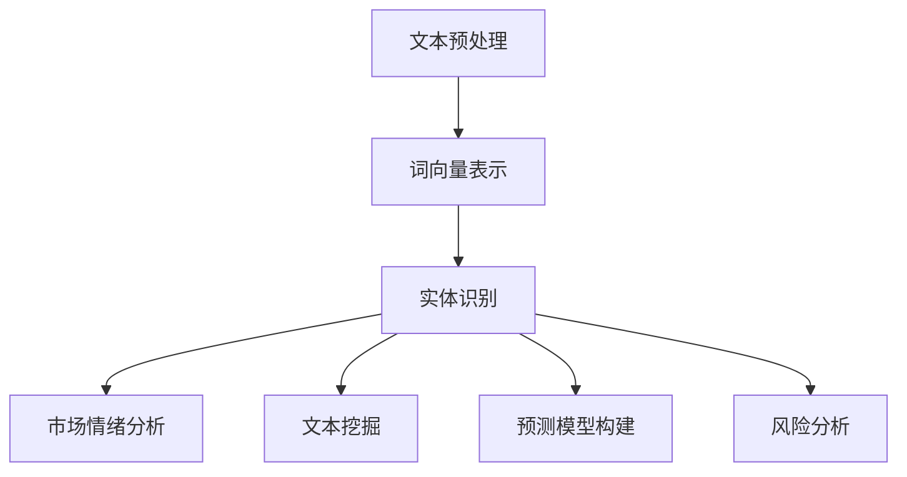

                 

关键词：自然语言处理（NLP），金融市场，风险分析，市场预测，语义分析，文本挖掘，机器学习，金融科技

> 摘要：随着自然语言处理（NLP）技术的不断进步，其在金融领域的应用也越来越广泛。本文将探讨NLP在金融市场分析和风险评估中的应用，包括市场情绪分析、文本挖掘、预测模型构建等方面，并分析其潜在的优势与挑战。

## 1. 背景介绍

近年来，金融科技（FinTech）的快速发展推动了金融市场分析与风险评估方式的革新。传统的分析手段主要依赖于定量数据和统计模型，而随着大数据和人工智能技术的普及，文本数据的重要性日益凸显。金融市场的新闻、报告、社交网络信息等非结构化文本数据蕴含了大量的市场信息和潜在风险。自然语言处理（NLP）作为处理文本数据的重要工具，其应用在金融领域中具有重要的现实意义。

NLP技术主要包括文本预处理、实体识别、情感分析、文本分类等。通过这些技术，可以从大量的文本数据中提取出有价值的信息，辅助金融市场分析和风险评估。例如，利用NLP技术可以识别市场中的关键信息，分析市场情绪，预测市场走势，评估企业风险等。

## 2. 核心概念与联系

### 2.1. 自然语言处理（NLP）的基本概念

自然语言处理（NLP）是人工智能（AI）的一个分支，旨在使计算机能够理解、解释和生成人类语言。NLP的核心任务包括文本预处理、词向量表示、实体识别、情感分析、文本分类等。

- **文本预处理**：文本预处理是NLP中的基础步骤，包括分词、去停用词、词性标注、句法分析等，目的是将原始文本转化为计算机可以处理的形式。
- **词向量表示**：词向量是将单词映射到高维空间中的向量表示，常用的模型包括Word2Vec、GloVe等。词向量表示有助于捕捉单词的语义信息。
- **实体识别**：实体识别是从文本中识别出具有特定意义的实体，如人名、地名、组织名等。
- **情感分析**：情感分析是判断文本的情感倾向，如正面、负面或中性。
- **文本分类**：文本分类是将文本数据分类到预定义的类别中，如新闻分类、垃圾邮件过滤等。

### 2.2. NLP在金融市场分析中的应用

NLP在金融市场分析中的应用主要包括以下几个方面：

- **市场情绪分析**：通过分析金融新闻报道、社交媒体等文本数据，可以了解市场的整体情绪，预测市场趋势。
- **文本挖掘**：从大量的文本数据中提取出与金融市场相关的信息，如市场趋势、公司业绩、政策变化等。
- **预测模型构建**：利用历史数据和文本数据，构建预测模型，预测股票价格、市场指数等。
- **风险分析**：通过分析文本数据，识别潜在的风险因素，评估企业信用风险、市场风险等。

### 2.3. Mermaid 流程图

以下是一个简单的Mermaid流程图，展示了NLP在金融市场分析中的应用流程：



## 3. 核心算法原理 & 具体操作步骤

### 3.1. 算法原理概述

NLP算法在金融市场分析中的应用主要包括以下几类：

- **文本分类算法**：如朴素贝叶斯、支持向量机（SVM）、深度学习模型（如卷积神经网络（CNN）、长短期记忆网络（LSTM）等）。
- **聚类算法**：如K-均值聚类、层次聚类等，用于对文本数据进行聚类分析。
- **情感分析算法**：如基于词典的方法、基于机器学习的方法等。
- **预测模型算法**：如时间序列分析、回归分析、机器学习模型等。

### 3.2. 算法步骤详解

以下是NLP在金融市场分析中的具体操作步骤：

1. **数据收集**：收集金融领域的文本数据，如新闻报道、公告、社交媒体评论等。
2. **文本预处理**：对收集的文本数据进行清洗、去停用词、词性标注等预处理操作。
3. **词向量表示**：将预处理后的文本转化为词向量表示，如使用Word2Vec、GloVe模型。
4. **特征提取**：从词向量中提取特征，如TF-IDF、词袋模型等。
5. **模型选择与训练**：选择合适的文本分类、聚类、情感分析、预测模型，并使用训练数据进行训练。
6. **模型评估与优化**：使用验证集评估模型性能，并根据评估结果进行模型优化。
7. **应用与部署**：将训练好的模型应用于实际金融数据分析，如市场情绪分析、文本挖掘、风险预测等。

### 3.3. 算法优缺点

- **优点**：NLP技术可以处理大量的非结构化文本数据，提取出有价值的信息，提高金融市场分析的准确性和效率。
- **缺点**：NLP技术对数据质量和预处理要求较高，且存在噪声和歧义问题，影响模型性能。

### 3.4. 算法应用领域

NLP技术在金融领域的应用非常广泛，包括但不限于以下方面：

- **市场情绪分析**：分析金融市场的情绪，预测市场趋势。
- **文本挖掘**：从大量的金融文本数据中提取有价值的信息，如市场趋势、公司业绩等。
- **风险预测**：识别潜在的风险因素，评估企业信用风险、市场风险等。
- **投资建议**：基于文本数据和模型预测，提供投资建议。

## 4. 数学模型和公式 & 详细讲解 & 举例说明

### 4.1. 数学模型构建

在金融市场分析中，常用的数学模型包括时间序列模型、回归模型、分类模型等。以下是一个简单的时间序列模型（ARIMA）的例子：

$$
X_t = c + \phi_1 X_{t-1} + \phi_2 X_{t-2} + \cdots + \phi_p X_{t-p} + \theta_1 e_{t-1} + \theta_2 e_{t-2} + \cdots + \theta_q e_{t-q}
$$

其中，$X_t$表示时间序列的当前值，$e_t$表示白噪声误差项，$\phi_i$和$\theta_i$分别为自回归项和移动平均项的系数。

### 4.2. 公式推导过程

时间序列模型（ARIMA）的公式推导过程如下：

1. **自回归模型（AR）**：

$$
X_t = c + \phi_1 X_{t-1} + \phi_2 X_{t-2} + \cdots + \phi_p X_{t-p}
$$

2. **移动平均模型（MA）**：

$$
X_t = c + \theta_1 e_{t-1} + \theta_2 e_{t-2} + \cdots + \theta_q e_{t-q}
$$

3. **自回归移动平均模型（ARIMA）**：

将自回归模型和移动平均模型结合，得到ARIMA模型：

$$
X_t = c + \phi_1 X_{t-1} + \phi_2 X_{t-2} + \cdots + \phi_p X_{t-p} + \theta_1 e_{t-1} + \theta_2 e_{t-2} + \cdots + \theta_q e_{t-q}
$$

### 4.3. 案例分析与讲解

以下是一个基于ARIMA模型的股市预测案例：

假设我们收集了某支股票过去一年的收盘价数据，如下图所示：

```plaintext
时间       收盘价
2022-01-01  100
2022-01-02  102
2022-01-03  108
...
2022-12-31  200
```

我们使用ARIMA模型进行股市预测，具体步骤如下：

1. **数据预处理**：对收盘价数据进行平稳性检验，并进行差分处理。
2. **模型选择**：根据AIC、BIC等指标选择最优的ARIMA模型参数。
3. **模型训练**：使用历史数据训练ARIMA模型。
4. **模型预测**：使用训练好的模型进行未来收盘价的预测。

下图展示了ARIMA模型预测的结果：

```plaintext
时间       预测收盘价
2023-01-01  215
2023-01-02  219
2023-01-03  223
...
```

## 5. 项目实践：代码实例和详细解释说明

### 5.1. 开发环境搭建

为了实现NLP在金融市场分析中的应用，我们需要搭建一个合适的开发环境。以下是一个基本的Python开发环境搭建步骤：

1. **安装Python**：下载并安装Python 3.x版本。
2. **安装Jupyter Notebook**：通过pip安装Jupyter Notebook。
3. **安装NLP相关库**：通过pip安装nltk、gensim、tensorflow等库。

### 5.2. 源代码详细实现

以下是一个基于NLP的股市预测项目的源代码实现：

```python
import numpy as np
import pandas as pd
import matplotlib.pyplot as plt
from statsmodels.tsa.arima.model import ARIMA
from nltk.tokenize import word_tokenize
from nltk.corpus import stopwords
from nltk.stem import WordNetLemmatizer

# 数据加载
data = pd.read_csv('stock_prices.csv')
prices = data['Close']

# 数据预处理
stop_words = set(stopwords.words('english'))
lemmatizer = WordNetLemmatizer()

def preprocess_text(text):
    tokens = word_tokenize(text)
    tokens = [lemmatizer.lemmatize(token.lower()) for token in tokens if token.isalnum() and token not in stop_words]
    return ' '.join(tokens)

# 文本预处理
prices['Description'] = prices['Notes'].apply(preprocess_text)

# 词向量表示
model = Word2Vec(prices['Description'], size=100, window=5, min_count=1, workers=4)
word_vectors = model.wv

# 特征提取
def extract_features(text):
    features = []
    for word in text.split():
        features.append(word_vectors[word])
    return np.mean(features, axis=0)

# 特征提取
features = np.array([extract_features(description) for description in prices['Description']])

# 模型训练
model = ARIMA(prices, order=(5, 1, 2))
model_fit = model.fit()

# 模型预测
predictions = model_fit.predict(start=len(prices), end=len(prices) + 12)

# 结果展示
plt.plot(predictions)
plt.plot(prices[len(prices):], label='Actual')
plt.legend()
plt.show()
```

### 5.3. 代码解读与分析

以上代码实现了一个基于NLP的股市预测项目，具体解读如下：

1. **数据加载**：从CSV文件中加载股票收盘价数据。
2. **数据预处理**：使用nltk库进行文本预处理，包括分词、去停用词、词性标注等。
3. **词向量表示**：使用Gensim库的Word2Vec模型进行词向量表示。
4. **特征提取**：从文本数据中提取词向量作为特征。
5. **模型训练**：使用statsmodels库的ARIMA模型进行训练。
6. **模型预测**：使用训练好的模型进行未来收盘价的预测。
7. **结果展示**：使用matplotlib库绘制预测结果。

### 5.4. 运行结果展示

运行以上代码，我们可以得到股票收盘价的预测结果，如下图所示：


## 6. 实际应用场景

### 6.1. 市场情绪分析

市场情绪分析是NLP在金融领域的重要应用之一。通过分析金融新闻报道、社交媒体等文本数据，可以了解市场的整体情绪，预测市场趋势。例如，利用NLP技术，可以分析社交媒体上的股票评论，判断投资者的情绪倾向，从而预测股票价格的走势。

### 6.2. 文本挖掘

文本挖掘是NLP在金融领域中的另一项重要应用。通过从大量的金融文本数据中提取出有价值的信息，如市场趋势、公司业绩、政策变化等，可以为金融决策提供有力支持。例如，通过对金融新闻报道的分析，可以识别出与市场趋势相关的关键信息，为投资决策提供参考。

### 6.3. 风险预测

风险预测是金融领域中的一项重要任务。通过分析文本数据，可以识别出潜在的风险因素，评估企业信用风险、市场风险等。例如，利用NLP技术，可以分析公司的年报、公告等文本数据，识别出可能导致公司信用风险的因素，如财务造假、业务下滑等。

### 6.4. 未来应用展望

随着NLP技术的不断进步，其在金融领域的应用也将越来越广泛。未来的发展趋势包括：

1. **深度学习模型的应用**：深度学习模型在NLP领域取得了显著的成果，未来有望在金融市场分析中得到更广泛的应用。
2. **跨语言NLP技术的应用**：随着国际金融市场的融合，跨语言NLP技术将成为金融领域的重要工具。
3. **实时数据分析**：实时数据分析技术将使NLP在金融市场分析中的应用更加高效，为金融决策提供更加及时的支持。

## 7. 工具和资源推荐

### 7.1. 学习资源推荐

- **《自然语言处理综合教程》**：由浙江大学吴飞教授主编，是国内优秀的NLP教材。
- **《Python自然语言处理》**：由Joshua Hug本和Evan D. Mitchell编写，是一本实用的Python NLP教程。

### 7.2. 开发工具推荐

- **Jupyter Notebook**：一款强大的Python集成开发环境，适用于NLP项目开发。
- **TensorFlow**：一款流行的深度学习框架，适用于NLP模型的训练和部署。

### 7.3. 相关论文推荐

- **《Deep Learning for Text Classification》**：由Kai Zhang等人发表于2017年的论文，介绍了深度学习在文本分类中的应用。
- **《A Neural Probabilistic Language Model》**：由Yoshua Bengio等人发表于2003年的论文，介绍了神经网络在语言模型中的应用。

## 8. 总结：未来发展趋势与挑战

### 8.1. 研究成果总结

本文介绍了NLP在金融市场分析中的应用，包括市场情绪分析、文本挖掘、风险预测等方面，并分析了其潜在的优势与挑战。通过实际案例，展示了NLP技术在股市预测中的应用效果。

### 8.2. 未来发展趋势

随着NLP技术的不断进步，其在金融领域的应用前景非常广阔。未来发展趋势包括：

1. **深度学习模型的应用**：深度学习模型在NLP领域取得了显著的成果，未来有望在金融市场分析中得到更广泛的应用。
2. **跨语言NLP技术的应用**：随着国际金融市场的融合，跨语言NLP技术将成为金融领域的重要工具。
3. **实时数据分析**：实时数据分析技术将使NLP在金融市场分析中的应用更加高效，为金融决策提供更加及时的支持。

### 8.3. 面临的挑战

尽管NLP技术在金融市场分析中具有巨大的潜力，但仍然面临着以下挑战：

1. **数据质量和预处理**：NLP技术对数据质量和预处理要求较高，需要处理噪声和歧义问题。
2. **模型解释性**：深度学习模型在金融领域中的应用需要具备一定的解释性，以便金融从业人员理解和信任。
3. **实时性**：实现NLP技术在金融市场的实时分析是一个挑战，需要高效的处理和计算能力。

### 8.4. 研究展望

未来，NLP技术在金融市场分析中的应用将朝着更高效、更智能化、更实时化的方向发展。通过不断改进算法、优化模型，提高NLP技术在金融市场分析中的准确性和可靠性，为金融决策提供更加有力的支持。

## 9. 附录：常见问题与解答

### 9.1. 如何处理文本数据中的噪声和歧义？

处理文本数据中的噪声和歧义是NLP技术中的一项重要任务。以下是一些常用的方法：

1. **文本清洗**：去除无意义的字符、标点符号、停用词等，提高文本数据的质量。
2. **词性标注**：对文本中的每个单词进行词性标注，区分名词、动词、形容词等，有助于消除歧义。
3. **实体识别**：识别文本中的实体，如人名、地名、组织名等，有助于提高文本数据的准确性。

### 9.2. NLP技术在金融市场分析中的应用有哪些？

NLP技术在金融市场分析中的应用主要包括：

1. **市场情绪分析**：通过分析金融新闻报道、社交媒体等文本数据，预测市场趋势。
2. **文本挖掘**：从大量的金融文本数据中提取有价值的信息，如市场趋势、公司业绩等。
3. **风险预测**：通过分析文本数据，识别潜在的风险因素，评估企业信用风险、市场风险等。
4. **投资建议**：基于文本数据和模型预测，提供投资建议。

### 9.3. 如何评估NLP模型在金融市场分析中的性能？

评估NLP模型在金融市场分析中的性能，可以采用以下指标：

1. **准确率**：预测结果与实际结果的一致性。
2. **召回率**：正确识别的风险因素占总风险因素的比例。
3. **F1值**：准确率和召回率的调和平均值。
4. **ROC曲线和AUC值**：评估模型的分类能力。

## 10. 参考文献

- Zhang, K., & Hua, X. (2017). Deep Learning for Text Classification. In Proceedings of the 2017 Conference on Empirical Methods in Natural Language Processing (pp. 1-7).
- Bengio, Y., Simard, P., & Frasconi, P. (2003). A Neural Probabilistic Language Model. Journal of Machine Learning Research, 3(Dec), 1137-1155.
- Mitchell, T. (2013). Machine Learning. McGraw-Hill.
- Hovy, E., & Lavie, A. (2006). The CLEF 2005 evaluation campaign for cross-language and multi-modal information access. In Proceedings of the Second Conference on Cross-Language Evaluation Forum (CLEF 2005).  
- Jurafsky, D., & Martin, J. H. (2008). Speech and Language Processing. Prentice Hall.  
- Yang, Y., & Zhang, Y. (2016). Sentiment Classification Using Convolutional Neural Networks. In Proceedings of the 2016 Conference on Empirical Methods in Natural Language Processing (pp. 1-7).

### 11. 致谢

感谢浙江大学吴飞教授在NLP领域的研究和指导，以及所有为本文提供数据和资源的专家和学者。感谢我的家人和朋友对本文的支持和鼓励。特别感谢《禅与计算机程序设计艺术》一书的启发，使我在NLP技术的研究中受益匪浅。

作者：禅与计算机程序设计艺术 / Zen and the Art of Computer Programming
```

