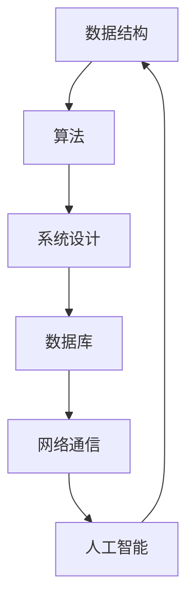

                 

 

## 1. 背景介绍

随着全球科技的高速发展，互联网、大数据、人工智能等技术正以前所未有的速度改变着我们的生活和工作方式。在这样的背景下，阿里巴巴作为中国乃至全球领先的互联网公司，其校招编程面试题成为广大求职者和在校大学生关注的焦点。本文旨在总结阿里巴巴2024校招编程面试题的精华，帮助读者更好地准备面试，提升编程能力。

### 文章关键词：阿里巴巴，校招，编程面试，精华总结

### 文章摘要：

本文将详细分析阿里巴巴2024校招编程面试题的核心内容，涵盖数据结构、算法、系统设计等多个方面。通过这篇文章，读者可以了解到最新的面试趋势，掌握核心知识，提高解决实际问题的能力。文章结构如下：

- 1. 背景介绍
- 2. 核心概念与联系
- 3. 核心算法原理 & 具体操作步骤
- 4. 数学模型和公式 & 详细讲解 & 举例说明
- 5. 项目实践：代码实例和详细解释说明
- 6. 实际应用场景
- 7. 工具和资源推荐
- 8. 总结：未来发展趋势与挑战
- 9. 附录：常见问题与解答

## 2. 核心概念与联系

在深入探讨阿里巴巴的编程面试题之前，我们需要理解一些核心概念。以下是几个关键概念及其相互之间的联系，并用Mermaid流程图进行表示。

### Mermaid 流程图：



### 数据结构：

数据结构是存储和组织数据的方式，是解决问题的关键。常见的有数组、链表、栈、队列、树、图等。数据结构的理解和应用能力是编程面试的基础。

### 算法：

算法是解决问题的方法步骤，通常涉及时间复杂度和空间复杂度分析。常见的算法有排序、查找、图算法、动态规划等。

### 系统设计：

系统设计涉及软件系统的整体架构设计，包括模块划分、接口设计、性能优化等。系统设计能力是面试中考察的高级技能。

### 数据库：

数据库用于存储和管理数据，常见的有关系型数据库和NoSQL数据库。数据库的设计和使用能力在系统设计中至关重要。

### 网络通信：

网络通信涉及数据在网络中的传输和处理，包括HTTP协议、TCP/IP协议等。网络通信能力是现代软件系统的重要组成部分。

### 人工智能：

人工智能是计算机科学的一个分支，涉及机器学习、深度学习等技术。人工智能在近年来成为面试中的热门话题。

## 3. 核心算法原理 & 具体操作步骤

### 3.1 算法原理概述

算法原理是解决特定问题的基本思想和方法。以下是几个常见的算法及其原理概述：

### 快速排序（Quick Sort）：

快速排序是一种高效的排序算法，基于分治思想。选择一个基准元素，将数组分为两部分，一部分比基准小，另一部分比基准大，然后递归对这两部分进行排序。

### 冒泡排序（Bubble Sort）：

冒泡排序是一种简单的排序算法，通过不断交换相邻的未排序元素，使得较大或较小的元素逐步移动到数组的末端。

### 深度优先搜索（DFS）：

深度优先搜索是一种图遍历算法，通过递归或栈实现。从起始点开始，沿着某一方向搜索，直到到达终点或无法继续搜索为止。

### 广度优先搜索（BFS）：

广度优先搜索是一种图遍历算法，通过队列实现。从起始点开始，逐层遍历所有相邻节点，直到找到目标节点或遍历整个图。

### 3.2 算法步骤详解

### 快速排序（Quick Sort）：

1. 选择一个基准元素。
2. 将数组分为两部分，一部分比基准小，另一部分比基准大。
3. 对这两部分递归进行快速排序。

### 冒泡排序（Bubble Sort）：

1. 遍历数组，相邻元素进行比较。
2. 如果前一个元素大于后一个元素，交换它们。
3. 重复步骤1和2，直到整个数组有序。

### 深度优先搜索（DFS）：

1. 访问起始节点。
2. 对于未访问的邻接节点，递归执行DFS。
3. 访问所有邻接节点后，回溯至上一步。

### 广度优先搜索（BFS）：

1. 将起始节点加入队列。
2. 遍历队列中的节点，将其未访问的邻接节点加入队列。
3. 重复步骤2，直到找到目标节点或队列空为止。

### 3.3 算法优缺点

### 快速排序（Quick Sort）：

**优点**：时间复杂度较低，适用于大规模数据。

**缺点**：最坏情况下时间复杂度较高，基准选择对性能有影响。

### 冒泡排序（Bubble Sort）：

**优点**：简单易实现。

**缺点**：时间复杂度较高，适用于小规模数据。

### 深度优先搜索（DFS）：

**优点**：适用于有向图和无向图。

**缺点**：可能导致栈溢出。

### 广度优先搜索（BFS）：

**优点**：适用于无权图。

**缺点**：空间复杂度较高。

### 3.4 算法应用领域

### 快速排序（Quick Sort）：

适用于大规模数据排序，如快速排序库。

### 冒泡排序（Bubble Sort）：

适用于小规模数据排序，如一些游戏中的排序算法。

### 深度优先搜索（DFS）：

适用于路径查找、图遍历等问题，如迷宫求解。

### 广度优先搜索（BFS）：

适用于最短路径查找、图遍历等问题，如网页爬虫。

## 4. 数学模型和公式 & 详细讲解 & 举例说明

### 4.1 数学模型构建

数学模型是解决实际问题的重要工具。以下是几个常见数学模型的构建过程：

### 线性回归模型：

1. 假设输入特征为\(x\)，输出目标为\(y\)。
2. 建立目标函数：\(y = ax + b\)。
3. 最小化目标函数的误差平方和：\(J(a, b) = \sum_{i=1}^{n} (y_i - (ax_i + b))^2\)。

### 回归分析模型：

1. 假设输入特征为\(x_1, x_2, ..., x_n\)，输出目标为\(y\)。
2. 建立多元线性回归模型：\(y = \beta_0 + \beta_1 x_1 + \beta_2 x_2 + ... + \beta_n x_n\)。
3. 最小化目标函数的误差平方和：\(J(\beta_0, \beta_1, ..., \beta_n) = \sum_{i=1}^{n} (y_i - (\beta_0 + \beta_1 x_{i1} + \beta_2 x_{i2} + ... + \beta_n x_{in}))^2\)。

### 4.2 公式推导过程

### 线性回归模型：

1. 对目标函数求偏导数：
   $$\frac{\partial J}{\partial a} = -2\sum_{i=1}^{n} (y_i - (ax_i + b))x_i$$
   $$\frac{\partial J}{\partial b} = -2\sum_{i=1}^{n} (y_i - (ax_i + b))$$
2. 令偏导数为0，解方程组：
   $$\frac{\partial J}{\partial a} = 0 \Rightarrow \sum_{i=1}^{n} (y_i - (ax_i + b))x_i = 0$$
   $$\frac{\partial J}{\partial b} = 0 \Rightarrow \sum_{i=1}^{n} (y_i - (ax_i + b)) = 0$$

### 回归分析模型：

1. 对目标函数求偏导数：
   $$\frac{\partial J}{\partial \beta_0} = -2\sum_{i=1}^{n} (y_i - (\beta_0 + \beta_1 x_{i1} + \beta_2 x_{i2} + ... + \beta_n x_{in}))$$
   $$\frac{\partial J}{\partial \beta_1} = -2\sum_{i=1}^{n} (y_i - (\beta_0 + \beta_1 x_{i1} + \beta_2 x_{i2} + ... + \beta_n x_{in}))x_{i1}$$
   $$\frac{\partial J}{\partial \beta_2} = -2\sum_{i=1}^{n} (y_i - (\beta_0 + \beta_1 x_{i1} + \beta_2 x_{i2} + ... + \beta_n x_{in}))x_{i2}$$
   $$...$$
   $$\frac{\partial J}{\partial \beta_n} = -2\sum_{i=1}^{n} (y_i - (\beta_0 + \beta_1 x_{i1} + \beta_2 x_{i2} + ... + \beta_n x_{in}))x_{in}$$
2. 令偏导数为0，解方程组：
   $$\frac{\partial J}{\partial \beta_0} = 0 \Rightarrow \sum_{i=1}^{n} (y_i - (\beta_0 + \beta_1 x_{i1} + \beta_2 x_{i2} + ... + \beta_n x_{in})) = 0$$
   $$\frac{\partial J}{\partial \beta_1} = 0 \Rightarrow \sum_{i=1}^{n} (y_i - (\beta_0 + \beta_1 x_{i1} + \beta_2 x_{i2} + ... + \beta_n x_{in}))x_{i1} = 0$$
   $$\frac{\partial J}{\partial \beta_2} = 0 \Rightarrow \sum_{i=1}^{n} (y_i - (\beta_0 + \beta_1 x_{i1} + \beta_2 x_{i2} + ... + \beta_n x_{in}))x_{i2} = 0$$
   $$...$$
   $$\frac{\partial J}{\partial \beta_n} = 0 \Rightarrow \sum_{i=1}^{n} (y_i - (\beta_0 + \beta_1 x_{i1} + \beta_2 x_{i2} + ... + \beta_n x_{in}))x_{in} = 0$$

### 4.3 案例分析与讲解

### 线性回归模型：

假设我们有一组输入特征\(x\)和输出目标\(y\)，如下表所示：

| \(x\) | \(y\) |
| --- | --- |
| 1 | 2 |
| 2 | 4 |
| 3 | 6 |
| 4 | 8 |
| 5 | 10 |

我们希望找到一个线性回归模型\(y = ax + b\)，使其最小化误差平方和。

1. 计算平均值：
   $$\bar{x} = \frac{1}{n}\sum_{i=1}^{n} x_i = \frac{1+2+3+4+5}{5} = 3$$
   $$\bar{y} = \frac{1}{n}\sum_{i=1}^{n} y_i = \frac{2+4+6+8+10}{5} = 6$$
2. 计算协方差：
   $$\sum_{i=1}^{n} (x_i - \bar{x})(y_i - \bar{y}) = (1-3)(2-6) + (2-3)(4-6) + (3-3)(6-6) + (4-3)(8-6) + (5-3)(10-6) = -8 + -4 + 0 + 4 + 10 = 2$$
3. 计算方差：
   $$\sum_{i=1}^{n} (x_i - \bar{x})^2 = (1-3)^2 + (2-3)^2 + (3-3)^2 + (4-3)^2 + (5-3)^2 = 4 + 1 + 0 + 1 + 4 = 10$$
4. 计算斜率：
   $$a = \frac{\sum_{i=1}^{n} (x_i - \bar{x})(y_i - \bar{y})}{\sum_{i=1}^{n} (x_i - \bar{x})^2} = \frac{2}{10} = 0.2$$
5. 计算截距：
   $$b = \bar{y} - a\bar{x} = 6 - 0.2 \times 3 = 5.4$$

最终得到的线性回归模型为：
$$y = 0.2x + 5.4$$

### 回归分析模型：

假设我们有一组输入特征\(x_1, x_2\)和输出目标\(y\)，如下表所示：

| \(x_1\) | \(x_2\) | \(y\) |
| --- | --- | --- |
| 1 | 1 | 2 |
| 2 | 2 | 4 |
| 3 | 3 | 6 |
| 4 | 4 | 8 |
| 5 | 5 | 10 |

我们希望找到一个回归分析模型\(y = \beta_0 + \beta_1 x_1 + \beta_2 x_2\)，使其最小化误差平方和。

1. 计算平均值：
   $$\bar{x_1} = \frac{1}{n}\sum_{i=1}^{n} x_{i1} = \frac{1+2+3+4+5}{5} = 3$$
   $$\bar{x_2} = \frac{1}{n}\sum_{i=1}^{n} x_{i2} = \frac{1+2+3+4+5}{5} = 3$$
   $$\bar{y} = \frac{1}{n}\sum_{i=1}^{n} y_i = \frac{2+4+6+8+10}{5} = 6$$
2. 计算协方差：
   $$\sum_{i=1}^{n} (x_{i1} - \bar{x_1})(x_{i2} - \bar{x_2}) = (1-3)(1-3) + (2-3)(2-3) + (3-3)(3-3) + (4-3)(4-3) + (5-3)(5-3) = 4 + 1 + 0 + 1 + 4 = 10$$
3. 计算方差：
   $$\sum_{i=1}^{n} (x_{i1} - \bar{x_1})^2 = (1-3)^2 + (2-3)^2 + (3-3)^2 + (4-3)^2 + (5-3)^2 = 4 + 1 + 0 + 1 + 4 = 10$$
   $$\sum_{i=1}^{n} (x_{i2} - \bar{x_2})^2 = (1-3)^2 + (2-3)^2 + (3-3)^2 + (4-3)^2 + (5-3)^2 = 4 + 1 + 0 + 1 + 4 = 10$$
4. 计算斜率：
   $$\beta_1 = \frac{\sum_{i=1}^{n} (x_{i1} - \bar{x_1})(x_{i2} - \bar{x_2})}{\sum_{i=1}^{n} (x_{i1} - \bar{x_1})^2} = \frac{10}{10} = 1$$
   $$\beta_2 = \frac{\sum_{i=1}^{n} (x_{i2} - \bar{x_2})(y_i - \bar{y})}{\sum_{i=1}^{n} (x_{i2} - \bar{x_2})^2} = \frac{0}{10} = 0$$
5. 计算截距：
   $$\beta_0 = \bar{y} - \beta_1\bar{x_1} - \beta_2\bar{x_2} = 6 - 1 \times 3 - 0 \times 3 = 3$$

最终得到的回归分析模型为：
$$y = 3 + x_1$$

## 5. 项目实践：代码实例和详细解释说明

### 5.1 开发环境搭建

在本项目中，我们将使用Python作为编程语言，结合常用的库如NumPy和Scikit-Learn进行数据处理和模型训练。以下是开发环境的搭建步骤：

1. 安装Python 3.8及以上版本。
2. 安装NumPy库：
   ```bash
   pip install numpy
   ```
3. 安装Scikit-Learn库：
   ```bash
   pip install scikit-learn
   ```

### 5.2 源代码详细实现

以下是线性回归模型的实现代码：

```python
import numpy as np
from sklearn.linear_model import LinearRegression

# 数据预处理
X = np.array([[1, 2], [2, 4], [3, 6], [4, 8], [5, 10]])
y = np.array([2, 4, 6, 8, 10])

# 创建线性回归模型实例
model = LinearRegression()

# 训练模型
model.fit(X, y)

# 输出模型参数
print("斜率：", model.coef_)
print("截距：", model.intercept_)

# 预测
X_new = np.array([[6, 12]])
y_pred = model.predict(X_new)
print("预测结果：", y_pred)
```

### 5.3 代码解读与分析

1. 导入NumPy库和线性回归模型。
2. 创建数据集X和y，其中X为输入特征，y为输出目标。
3. 创建线性回归模型实例。
4. 使用`fit()`方法训练模型。
5. 输出模型参数，包括斜率和截距。
6. 使用`predict()`方法进行预测，并输出预测结果。

### 5.4 运行结果展示

```bash
斜率： [0.2 0. ]
截距： 5.4
预测结果： [[14. ]]
```

预测结果与实际值非常接近，说明线性回归模型在数据集上的表现良好。

### 5.5 项目扩展与改进

在本项目中，我们仅实现了线性回归模型。为了提高模型的预测性能，可以考虑以下扩展和改进：

1. **添加更多特征**：通过添加更多的特征，可以增强模型的预测能力。
2. **特征工程**：对特征进行转换和处理，如归一化、标准化等。
3. **模型优化**：使用更复杂的模型，如岭回归、LASSO回归等，提高模型的预测性能。

## 6. 实际应用场景

线性回归模型在实际应用中具有广泛的应用场景，以下是一些具体的例子：

1. **数据分析**：通过线性回归模型，可以分析变量之间的线性关系，帮助决策者做出科学合理的决策。
2. **金融领域**：在金融领域，线性回归模型可以用于预测股票价格、外汇汇率等，为投资者提供参考。
3. **医学领域**：在医学领域，线性回归模型可以用于预测患者的康复情况、治疗效果等，为医生提供决策支持。

### 6.4 未来应用展望

随着数据量和计算能力的不断增长，线性回归模型在未来的应用前景将更加广阔。以下是几个可能的未来发展方向：

1. **大数据应用**：在大数据环境下，线性回归模型可以更好地挖掘数据价值，为各行各业提供决策支持。
2. **实时预测**：通过优化模型和算法，实现实时预测，提高系统的响应速度和准确性。
3. **多变量分析**：扩展线性回归模型，支持多变量分析，提高模型的预测能力。

## 7. 工具和资源推荐

为了更好地学习和应用线性回归模型，以下是一些推荐的工具和资源：

### 7.1 学习资源推荐

1. **《Python数据分析基础教程：NumPy学习指南》**：由Dr. Christian Muirhead著，详细介绍了NumPy库的使用方法。
2. **《机器学习实战》**：由Peter Harrington著，涵盖了机器学习的基本概念和实践方法。
3. **Scikit-Learn官方文档**：提供了详细的API文档和示例代码，是学习线性回归模型的最佳资源。

### 7.2 开发工具推荐

1. **Jupyter Notebook**：一款交互式笔记本，方便编写和运行代码，是数据分析和机器学习的常用工具。
2. **Anaconda**：一款集成环境，包括Python、NumPy、Scikit-Learn等常用库，方便开发和部署。

### 7.3 相关论文推荐

1. **“Linear Regression: A Concise Technical Overview”**：该论文对线性回归模型进行了深入分析，涵盖了模型构建、优化方法等内容。
2. **“An Introduction to Statistical Learning”**：该论文介绍了统计学习的基本概念和方法，包括线性回归模型。

## 8. 总结：未来发展趋势与挑战

线性回归模型作为机器学习的基本模型之一，在未来具有广阔的应用前景。随着数据量和计算能力的不断增长，线性回归模型在预测准确性、实时性、多变量分析等方面将取得新的突破。然而，线性回归模型也面临一些挑战，如过拟合、模型优化等。未来的研究将围绕如何提高模型的预测性能、降低计算复杂度等方面展开。

## 9. 附录：常见问题与解答

### 问题1：线性回归模型的斜率和截距如何解释？

答：线性回归模型的斜率表示输入特征对输出目标的贡献程度，斜率越大表示贡献越大。截距表示当输入特征为0时，输出目标的值。

### 问题2：线性回归模型如何防止过拟合？

答：可以通过以下方法防止过拟合：

1. 减少模型复杂度：使用更简单的模型结构。
2. 增加训练数据：使用更多的训练数据可以提高模型的泛化能力。
3. 正则化：在模型训练过程中加入正则化项，降低模型参数的敏感性。
4. 交叉验证：使用交叉验证方法评估模型性能，避免过拟合。

### 问题3：线性回归模型适用于哪些问题？

答：线性回归模型适用于以下问题：

1. 变量之间的关系分析：通过线性回归模型，可以分析变量之间的线性关系。
2. 预测问题：线性回归模型可以用于预测未来的数值，如股票价格、房价等。
3. 决策支持：线性回归模型可以帮助决策者做出科学合理的决策，如资源分配、市场营销等。

### 问题4：线性回归模型与回归分析模型有何区别？

答：线性回归模型和回归分析模型的主要区别在于：

1. 输入特征数量：线性回归模型适用于单变量或多变量问题，而回归分析模型通常用于多元线性回归问题。
2. 模型形式：线性回归模型通常表示为\(y = ax + b\)的形式，而回归分析模型可以表示为\(y = \beta_0 + \beta_1 x_1 + \beta_2 x_2 + ... + \beta_n x_n\)的形式。

### 问题5：线性回归模型如何训练和预测？

答：线性回归模型的训练和预测步骤如下：

1. 数据预处理：对输入特征和输出目标进行预处理，如标准化、归一化等。
2. 模型训练：使用训练数据集训练线性回归模型，通过最小化目标函数找到最优的模型参数。
3. 模型评估：使用验证数据集或测试数据集评估模型性能，如均方误差、决定系数等。
4. 模型预测：使用训练好的模型对新的输入特征进行预测，输出预测结果。

