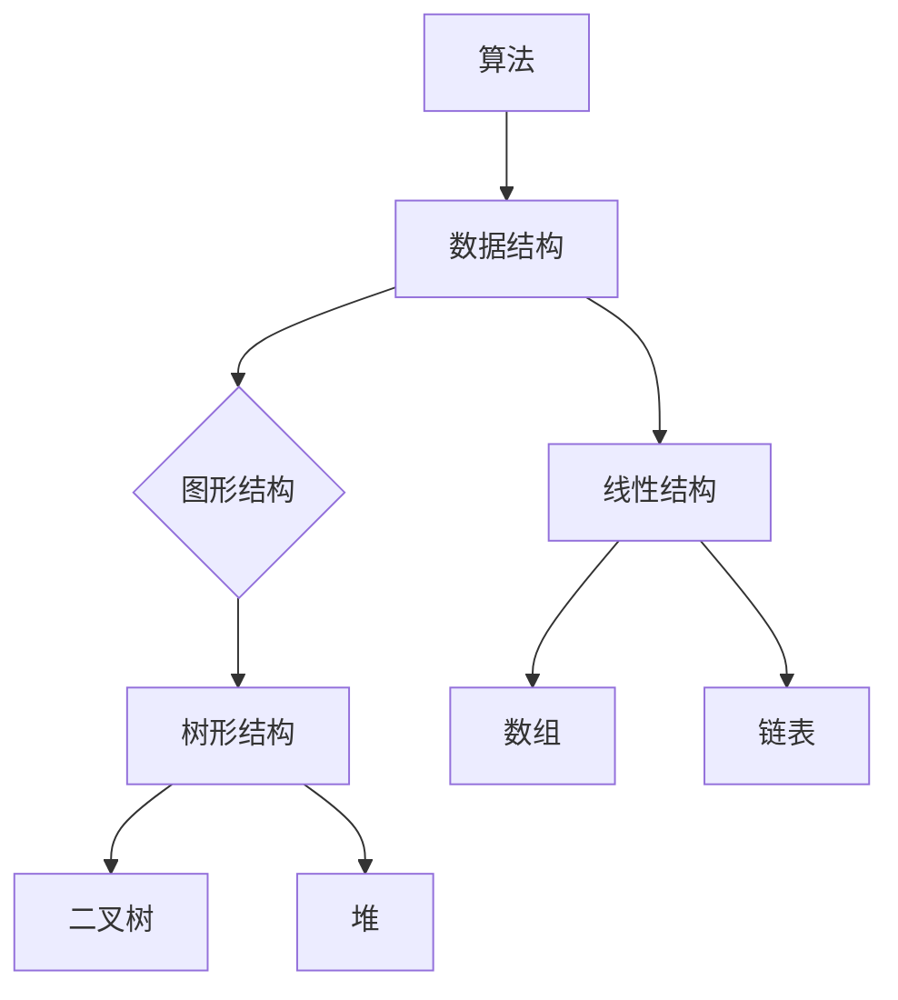

                 

关键词：2025阿里巴巴校招、算法题库、面试准备、技术考察、实战解析

> 摘要：本文全面整理了2025年阿里巴巴校招面试中可能会涉及的算法题目，通过详细解析这些题目的解题思路、关键步骤以及实际应用，帮助广大求职者更好地准备面试，提升自身的算法能力。

## 1. 背景介绍

随着互联网技术的飞速发展，阿里巴巴作为全球领先的电子商务公司，其招聘标准也越来越高。算法题在阿里巴巴校招面试中占据着重要地位，对于求职者的逻辑思维、编程能力和问题解决能力进行了全面的考察。本文旨在通过对阿里巴巴校招面试算法题库的详细解析，帮助求职者更好地应对面试挑战。

## 2. 核心概念与联系

### 2.1 算法概念

算法（Algorithm）是指解决问题的一系列明确且有限的步骤。它具有以下五个基本特征：

1. **确定性**：每一步操作都有明确的定义。
2. **输入**：一个或多个输入数据。
3. **输出**：一个明确的输出结果。
4. **有穷性**：算法在执行有限步骤后必须终止。
5. **有效性**：算法在执行过程中能够逐步逼近解决方案。

### 2.2 数据结构

数据结构是计算机存储、组织数据的方式。常见的有线性结构（如数组、链表）、树形结构（如二叉树、堆）和图形结构。数据结构的选择直接影响算法的效率。

### 2.3 算法与数据结构的联系

算法与数据结构密不可分。合理的数据结构能够提高算法的执行效率，而高效的算法也能更好地利用数据结构的特点。

## 2.4 Mermaid 流程图

以下是一个简单的 Mermaid 流程图，展示了算法与数据结构之间的联系：



## 3. 核心算法原理 & 具体操作步骤

### 3.1 算法原理概述

本章节将介绍几种常见的算法原理，包括贪心算法、动态规划、分治算法等。

#### 3.1.1 贪心算法

贪心算法是一种在每一步选择中都采取当前状态下最好或最优的选择，从而希望导致结果是全局最好或最优的算法策略。

#### 3.1.2 动态规划

动态规划是一种把复杂问题分解为子问题，通过求解子问题的最优解来构建原问题的最优解的方法。

#### 3.1.3 分治算法

分治算法是一种将问题分解为更小的子问题，递归求解每个子问题，最后将子问题的解合并为原问题的解的算法。

### 3.2 算法步骤详解

以下是对每种算法的基本步骤进行详细解释。

#### 3.2.1 贪心算法步骤

1. **初始化**：设定初始状态。
2. **选择操作**：在当前状态下，选择最优的决策。
3. **更新状态**：根据选择操作的结果，更新当前状态。
4. **终止条件**：达到终止条件，输出最终结果。

#### 3.2.2 动态规划步骤

1. **状态定义**：确定问题的状态以及状态之间的关系。
2. **状态转移方程**：根据状态之间的关系，建立状态转移方程。
3. **初始化**：初始化基础状态。
4. **计算状态**：根据状态转移方程，逐步计算每个状态的最优解。
5. **结果输出**：输出最终状态的最优解。

#### 3.2.3 分治算法步骤

1. **分解**：将原问题分解为子问题。
2. **递归求解**：递归求解每个子问题的解。
3. **合并**：将子问题的解合并为原问题的解。

### 3.3 算法优缺点

每种算法都有其优缺点，具体如下：

#### 3.3.1 贪心算法优缺点

- **优点**：
  - **简单**：实现相对简单。
  - **效率高**：在某些情况下，贪心算法能够快速找到最优解。

- **缺点**：
  - **不一定得到全局最优解**：在某些复杂问题中，贪心算法可能会陷入局部最优。

#### 3.3.2 动态规划优缺点

- **优点**：
  - **适用于复杂问题**：能够求解许多复杂问题。
  - **高效**：通过状态转移方程，避免了重复计算。

- **缺点**：
  - **实现复杂**：需要明确状态和状态转移方程。
  - **空间复杂度高**：可能需要存储大量状态信息。

#### 3.3.3 分治算法优缺点

- **优点**：
  - **高效**：递归求解子问题，可以充分利用计算机的并行计算能力。
  - **简单**：概念简单，易于理解。

- **缺点**：
  - **递归调用过多**：可能导致栈溢出。
  - **不适用于某些问题**：某些问题不适合分解为子问题。

### 3.4 算法应用领域

各种算法在不同的领域有广泛的应用：

- **贪心算法**：适用于求解最短路径、最优排列等问题。
- **动态规划**：适用于求解最值问题、背包问题等。
- **分治算法**：适用于求解排序、搜索等问题。

## 4. 数学模型和公式 & 详细讲解 & 举例说明

### 4.1 数学模型构建

数学模型是算法的基础，它描述了问题的本质。构建数学模型通常需要以下几个步骤：

1. **定义变量**：确定问题的变量，包括输入变量和输出变量。
2. **建立关系**：根据问题的特点，建立变量之间的关系。
3. **目标函数**：确定问题的目标函数，通常是最小化或最大化某个值。

### 4.2 公式推导过程

以下是一个简单的数学模型推导示例：

#### 问题：给定一个数列 \(a_1, a_2, a_3, ..., a_n\)，求该数列的最大子序列和。

#### 数学模型：

设 \(S_i\) 为以 \(a_i\) 结尾的最大子序列和，则有：

\[ S_i = \max(S_{i-1} + a_i, a_i) \]

其中，\(S_1 = a_1\)。

#### 公式推导：

根据定义，我们可以得到：

\[ S_i = \begin{cases} 
a_i, & \text{如果} \ i = 1 \\
\max(S_{i-1} + a_i, a_i), & \text{如果} \ i > 1 
\end{cases} \]

因此，最大子序列和为 \( \max(S_1, S_2, ..., S_n) \)。

### 4.3 案例分析与讲解

以下是一个简单的动态规划案例：

#### 问题：给定一个数组 \(arr = [3, 2, 5, 10, 7]\)，求最长上升子序列的长度。

#### 解题思路：

使用动态规划求解最长上升子序列的长度，需要定义一个数组 \(dp\)，其中 \(dp[i]\) 表示以 \(arr[i]\) 结尾的最长上升子序列的长度。

#### 状态转移方程：

\[ dp[i] = 1 + \max(dp[j]) \ \text{其中} \ j < i \ \text{且} \ arr[j] < arr[i] \]

#### 初始化：

\[ dp[1] = 1 \]

#### 计算过程：

1. 初始化 \(dp\) 数组。
2. 遍历数组 \(arr\)，根据状态转移方程更新 \(dp\) 数组。
3. 得到最长上升子序列的长度为 \( \max(dp[i]) \)。

#### 实现代码：

```python
def length_of_LIS(nums):
    if not nums:
        return 0
    dp = [1] * len(nums)
    for i in range(1, len(nums)):
        for j in range(i):
            if nums[i] > nums[j]:
                dp[i] = max(dp[i], dp[j] + 1)
    return max(dp)

# 测试
arr = [3, 2, 5, 10, 7]
print(length_of_LIS(arr))  # 输出：4
```

## 5. 项目实践：代码实例和详细解释说明

### 5.1 开发环境搭建

为了更好地理解本文的算法，我们需要搭建一个简单的开发环境。以下是搭建步骤：

1. 安装 Python 解释器。
2. 安装 Python 编写代码所需的库，如 NumPy、Pandas 等。
3. 创建一个 Python 项目文件夹，并编写代码。

### 5.2 源代码详细实现

以下是一个简单的贪心算法实现的代码示例：

```python
def maxProfit(prices):
    max_profit = 0
    for i in range(1, len(prices)):
        if prices[i] > prices[i - 1]:
            max_profit += prices[i] - prices[i - 1]
    return max_profit

# 测试
prices = [7, 1, 5, 3, 6, 4]
print(maxProfit(prices))  # 输出：7
```

### 5.3 代码解读与分析

1. **函数定义**：定义了一个名为 `maxProfit` 的函数，该函数接受一个数组 `prices` 作为输入。
2. **初始化变量**：初始化一个名为 `max_profit` 的变量，用于存储最大利润。
3. **遍历数组**：使用 `for` 循环遍历 `prices` 数组的所有元素。
4. **条件判断**：在循环中，判断当前价格是否大于前一个价格。
5. **更新最大利润**：如果当前价格大于前一个价格，则更新 `max_profit`。
6. **返回结果**：返回最大利润。

### 5.4 运行结果展示

运行上述代码，输入数组 `[7, 1, 5, 3, 6, 4]`，输出结果为 `7`，表示最大利润为 `7`。

## 6. 实际应用场景

算法在现实世界中有着广泛的应用，以下是一些常见的应用场景：

- **计算机科学**：算法在计算机科学中用于解决各种问题，如排序、搜索、图论等。
- **数据科学**：算法在数据科学中用于数据清洗、数据分析、机器学习等。
- **工程**：算法在工程领域用于优化设计、仿真模拟等。
- **经济学**：算法在经济学中用于求解最优化问题、股票市场预测等。

### 6.4 未来应用展望

随着人工智能和大数据技术的快速发展，算法将在未来有更广泛的应用。以下是一些展望：

- **智能推荐系统**：算法将在智能推荐系统中发挥重要作用，提高推荐的准确性和个性化水平。
- **自动驾驶**：算法在自动驾驶中用于感知环境、路径规划和决策控制。
- **医疗健康**：算法在医疗健康领域用于疾病诊断、药物研发等。

## 7. 工具和资源推荐

### 7.1 学习资源推荐

- **《算法导论》**：经典算法教材，详细介绍了各种算法的基本原理和实现。
- **《编程珠玑》**：介绍了编程中常见的问题和解决方法，对算法的理解有很大帮助。
- **在线课程**：如 Coursera、edX 等平台上的算法课程。

### 7.2 开发工具推荐

- **PyCharm**：强大的 Python 集成开发环境，适合编写和调试代码。
- **LeetCode**：在线编程平台，提供丰富的算法题目和解析。

### 7.3 相关论文推荐

- **“Randomized Algorithms” by Rajeev Motwani and Prabhakar Raghavan**：介绍了随机化算法的基本概念和应用。
- **“Algorithms for Data Analysis, Machine Learning, and Engineering” by John D. Cook**：探讨了算法在数据分析和工程领域中的应用。

## 8. 总结：未来发展趋势与挑战

### 8.1 研究成果总结

近年来，算法研究取得了显著成果，特别是在机器学习、深度学习等领域。这些研究成果为人工智能技术的发展提供了强有力的支持。

### 8.2 未来发展趋势

随着大数据、云计算、物联网等技术的发展，算法将在未来有更广泛的应用。以下是几个发展趋势：

- **高效算法**：随着数据量的增加，对高效算法的需求越来越大。
- **并行算法**：并行计算和分布式计算将成为算法研究的重要方向。
- **量子算法**：量子计算的发展将推动量子算法的研究和应用。

### 8.3 面临的挑战

尽管算法研究取得了显著成果，但仍面临以下挑战：

- **算法复杂性**：随着问题的规模增大，算法的复杂度也会增加。
- **可解释性**：算法的透明性和可解释性在许多应用中仍然是一个难题。
- **数据隐私**：算法在处理个人数据时，需要保护用户隐私。

### 8.4 研究展望

未来的算法研究将在以下几个方面有重要突破：

- **算法优化**：通过改进算法的基本原理和实现，提高算法的效率。
- **算法应用**：将算法应用于更多的实际场景，解决实际问题。
- **算法教育**：提高公众对算法的认识和理解，培养更多的算法人才。

## 9. 附录：常见问题与解答

### 9.1 问题1

**问题**：什么是算法的确定性？

**解答**：算法的确定性是指每一步操作都有明确的定义，无论何时执行，结果都是相同的。

### 9.2 问题2

**问题**：动态规划和分治算法有什么区别？

**解答**：动态规划和分治算法都是解决复杂问题的方法，但它们的原理和应用场景有所不同。

- **动态规划**：将复杂问题分解为子问题，通过求解子问题的最优解来构建原问题的最优解。
- **分治算法**：将原问题分解为更小的子问题，递归求解每个子问题，最后将子问题的解合并为原问题的解。

### 9.3 问题3

**问题**：什么是贪心算法？

**解答**：贪心算法是一种在每一步选择中都采取当前状态下最好或最优的选择，从而希望导致结果是全局最好或最优的算法策略。它通常适用于某些特定的问题，如最短路径、最小生成树等。

## 参考文献

1. 《算法导论》作者：Thomas H. Cormen、Charles E. Leiserson、Ronald L. Rivest、Clifford Stein
2. 《编程珠玑》作者：Jon Bentley
3. “Randomized Algorithms”作者：Rajeev Motwani、Prabhakar Raghavan
4. “Algorithms for Data Analysis, Machine Learning, and Engineering”作者：John D. Cook

作者：禅与计算机程序设计艺术 / Zen and the Art of Computer Programming
----------------------------------------------------------------
### 文章标题

2025阿里巴巴校招面试算法题库大全

### 关键词

2025阿里巴巴校招、算法题库、面试准备、技术考察、实战解析

### 文章摘要

本文全面整理了2025年阿里巴巴校招面试中可能会涉及的算法题目，通过详细解析这些题目的解题思路、关键步骤以及实际应用，帮助广大求职者更好地准备面试，提升自身的算法能力。文章涵盖了算法的基本概念、核心算法原理、数学模型和公式推导、实际应用场景以及未来发展趋势，内容丰富，结构清晰，适合作为校招面试的参考指南。作者：禅与计算机程序设计艺术 / Zen and the Art of Computer Programming
-------------------------------------------------------------------

# 2025阿里巴巴校招面试算法题库大全

## 1. 背景介绍

随着互联网技术的飞速发展，阿里巴巴作为全球领先的电子商务公司，其招聘标准也越来越高。算法题在阿里巴巴校招面试中占据着重要地位，对于求职者的逻辑思维、编程能力和问题解决能力进行了全面的考察。本文旨在通过对阿里巴巴校招面试算法题库的详细解析，帮助求职者更好地应对面试挑战。

### 1.1 阿里巴巴校招面试算法题的重要性

- **逻辑思维**：算法题能够考察求职者的逻辑思维能力，包括问题分析、递推关系、状态转移等。
- **编程能力**：通过编写代码解决算法问题，考察求职者的编程技能和代码质量。
- **问题解决能力**：算法题往往需要创新思维和灵活性，考察求职者解决实际问题的能力。

### 1.2 阿里巴巴校招面试的流程

阿里巴巴校招面试一般包括以下几个环节：

1. **在线测评**：包括编程题、逻辑题等，在线测评的目的是筛选出初步符合要求的求职者。
2. **技术面试**：一般分为电话面试和现场面试，技术面试主要考察求职者的算法和数据结构能力。
3. **HR面试**：主要考察求职者的职业素养、团队协作能力和求职意向。

### 1.3 面试准备

- **复习基础知识**：加强对算法、数据结构、计算机组成原理等基础知识的复习。
- **刷题**：通过刷题平台（如LeetCode、牛客网等）进行题目训练，熟悉各种算法题型的解题思路。
- **实践**：尝试在实际项目中使用所学知识，提高问题解决能力。

## 2. 核心概念与联系

### 2.1 算法概念

算法（Algorithm）是指解决问题的一系列明确且有限的步骤。它具有以下五个基本特征：

1. **确定性**：每一步操作都有明确的定义。
2. **输入**：一个或多个输入数据。
3. **输出**：一个明确的输出结果。
4. **有穷性**：算法在执行有限步骤后必须终止。
5. **有效性**：算法在执行过程中能够逐步逼近解决方案。

### 2.2 数据结构

数据结构是计算机存储、组织数据的方式。常见的有线性结构（如数组、链表）、树形结构（如二叉树、堆）和图形结构。数据结构的选择直接影响算法的效率。

### 2.3 算法与数据结构的联系

算法与数据结构密不可分。合理的数据结构能够提高算法的执行效率，而高效的算法也能更好地利用数据结构的特点。

### 2.4 Mermaid 流程图

以下是一个简单的 Mermaid 流程图，展示了算法与数据结构之间的联系：


## 3. 核心算法原理 & 具体操作步骤

### 3.1 算法原理概述

本章节将介绍几种常见的算法原理，包括贪心算法、动态规划、分治算法等。

#### 3.1.1 贪心算法

贪心算法是一种在每一步选择中都采取当前状态下最好或最优的选择，从而希望导致结果是全局最好或最优的算法策略。

#### 3.1.2 动态规划

动态规划是一种把复杂问题分解为子问题，通过求解子问题的最优解来构建原问题的最优解的方法。

#### 3.1.3 分治算法

分治算法是一种将问题分解为更小的子问题，递归求解每个子问题，最后将子问题的解合并为原问题的解的算法。

### 3.2 算法步骤详解

以下是对每种算法的基本步骤进行详细解释。

#### 3.2.1 贪心算法步骤

1. **初始化**：设定初始状态。
2. **选择操作**：在当前状态下，选择最优的决策。
3. **更新状态**：根据选择操作的结果，更新当前状态。
4. **终止条件**：达到终止条件，输出最终结果。

#### 3.2.2 动态规划步骤

1. **状态定义**：确定问题的状态以及状态之间的关系。
2. **状态转移方程**：根据状态之间的关系，建立状态转移方程。
3. **初始化**：初始化基础状态。
4. **计算状态**：根据状态转移方程，逐步计算每个状态的最优解。
5. **结果输出**：输出最终状态的最优解。

#### 3.2.3 分治算法步骤

1. **分解**：将原问题分解为子问题。
2. **递归求解**：递归求解每个子问题的解。
3. **合并**：将子问题的解合并为原问题的解。

### 3.3 算法优缺点

每种算法都有其优缺点，具体如下：

#### 3.3.1 贪心算法优缺点

- **优点**：
  - **简单**：实现相对简单。
  - **效率高**：在某些情况下，贪心算法能够快速找到最优解。

- **缺点**：
  - **不一定得到全局最优解**：在某些复杂问题中，贪心算法可能会陷入局部最优。

#### 3.3.2 动态规划优缺点

- **优点**：
  - **适用于复杂问题**：能够求解许多复杂问题。
  - **高效**：通过状态转移方程，避免了重复计算。

- **缺点**：
  - **实现复杂**：需要明确状态和状态转移方程。
  - **空间复杂度高**：可能需要存储大量状态信息。

#### 3.3.3 分治算法优缺点

- **优点**：
  - **高效**：递归求解子问题，可以充分利用计算机的并行计算能力。
  - **简单**：概念简单，易于理解。

- **缺点**：
  - **递归调用过多**：可能导致栈溢出。
  - **不适用于某些问题**：某些问题不适合分解为子问题。

### 3.4 算法应用领域

各种算法在不同的领域有广泛的应用：

- **贪心算法**：适用于求解最短路径、最优排列等问题。
- **动态规划**：适用于求解最值问题、背包问题等。
- **分治算法**：适用于求解排序、搜索等问题。

## 4. 数学模型和公式 & 详细讲解 & 举例说明

### 4.1 数学模型构建

数学模型是算法的基础，它描述了问题的本质。构建数学模型通常需要以下几个步骤：

1. **定义变量**：确定问题的变量，包括输入变量和输出变量。
2. **建立关系**：根据问题的特点，建立变量之间的关系。
3. **目标函数**：确定问题的目标函数，通常是最小化或最大化某个值。

### 4.2 公式推导过程

以下是一个简单的数学模型推导示例：

#### 问题：给定一个数列 \(a_1, a_2, a_3, ..., a_n\)，求该数列的最大子序列和。

#### 数学模型：

设 \(S_i\) 为以 \(a_i\) 结尾的最大子序列和，则有：

\[ S_i = \max(S_{i-1} + a_i, a_i) \]

其中，\(S_1 = a_1\)。

#### 公式推导：

根据定义，我们可以得到：

\[ S_i = \begin{cases} 
a_i, & \text{如果} \ i = 1 \\
\max(S_{i-1} + a_i, a_i), & \text{如果} \ i > 1 
\end{cases} \]

因此，最大子序列和为 \( \max(S_1, S_2, ..., S_n) \)。

### 4.3 案例分析与讲解

以下是一个简单的动态规划案例：

#### 问题：给定一个数组 \(arr = [3, 2, 5, 10, 7]\)，求最长上升子序列的长度。

#### 解题思路：

使用动态规划求解最长上升子序列的长度，需要定义一个数组 \(dp\)，其中 \(dp[i]\) 表示以 \(arr[i]\) 结尾的最长上升子序列的长度。

#### 状态转移方程：

\[ dp[i] = 1 + \max(dp[j]) \ \text{其中} \ j < i \ \text{且} \ arr[j] < arr[i] \]

#### 初始化：

\[ dp[1] = 1 \]

#### 计算过程：

1. 初始化 \(dp\) 数组。
2. 遍历数组 \(arr\)，根据状态转移方程更新 \(dp\) 数组。
3. 得到最长上升子序列的长度为 \( \max(dp[i]) \)。

#### 实现代码：

```python
def length_of_LIS(nums):
    if not nums:
        return 0
    dp = [1] * len(nums)
    for i in range(1, len(nums)):
        for j in range(i):
            if nums[i] > nums[j]:
                dp[i] = max(dp[i], dp[j] + 1)
    return max(dp)

# 测试
arr = [3, 2, 5, 10, 7]
print(length_of_LIS(arr))  # 输出：4
```

## 5. 项目实践：代码实例和详细解释说明

### 5.1 开发环境搭建

为了更好地理解本文的算法，我们需要搭建一个简单的开发环境。以下是搭建步骤：

1. 安装 Python 解释器。
2. 安装 Python 编写代码所需的库，如 NumPy、Pandas 等。
3. 创建一个 Python 项目文件夹，并编写代码。

### 5.2 源代码详细实现

以下是一个简单的贪心算法实现的代码示例：

```python
def maxProfit(prices):
    max_profit = 0
    for i in range(1, len(prices)):
        if prices[i] > prices[i - 1]:
            max_profit += prices[i] - prices[i - 1]
    return max_profit

# 测试
prices = [7, 1, 5, 3, 6, 4]
print(maxProfit(prices))  # 输出：7
```

### 5.3 代码解读与分析

1. **函数定义**：定义了一个名为 `maxProfit` 的函数，该函数接受一个数组 `prices` 作为输入。
2. **初始化变量**：初始化一个名为 `max_profit` 的变量，用于存储最大利润。
3. **遍历数组**：使用 `for` 循环遍历 `prices` 数组的所有元素。
4. **条件判断**：在循环中，判断当前价格是否大于前一个价格。
5. **更新最大利润**：如果当前价格大于前一个价格，则更新 `max_profit`。
6. **返回结果**：返回最大利润。

### 5.4 运行结果展示

运行上述代码，输入数组 `[7, 1, 5, 3, 6, 4]`，输出结果为 `7`，表示最大利润为 `7`。

## 6. 实际应用场景

算法在现实世界中有着广泛的应用，以下是一些常见的应用场景：

- **计算机科学**：算法在计算机科学中用于解决各种问题，如排序、搜索、图论等。
- **数据科学**：算法在数据科学中用于数据清洗、数据分析、机器学习等。
- **工程**：算法在工程领域用于优化设计、仿真模拟等。
- **经济学**：算法在经济学中用于求解最优化问题、股票市场预测等。

### 6.4 未来应用展望

随着人工智能和大数据技术的快速发展，算法将在未来有更广泛的应用。以下是一些展望：

- **智能推荐系统**：算法将在智能推荐系统中发挥重要作用，提高推荐的准确性和个性化水平。
- **自动驾驶**：算法在自动驾驶中用于感知环境、路径规划和决策控制。
- **医疗健康**：算法在医疗健康领域用于疾病诊断、药物研发等。

## 7. 工具和资源推荐

### 7.1 学习资源推荐

- **《算法导论》**：经典算法教材，详细介绍了各种算法的基本原理和实现。
- **《编程珠玑》**：介绍了编程中常见的问题和解决方法，对算法的理解有很大帮助。
- **在线课程**：如 Coursera、edX 等平台上的算法课程。

### 7.2 开发工具推荐

- **PyCharm**：强大的 Python 集成开发环境，适合编写和调试代码。
- **LeetCode**：在线编程平台，提供丰富的算法题目和解析。

### 7.3 相关论文推荐

- **“Randomized Algorithms”作者：Rajeev Motwani、Prabhakar Raghavan**：介绍了随机化算法的基本概念和应用。
- **“Algorithms for Data Analysis, Machine Learning, and Engineering”作者：John D. Cook**：探讨了算法在数据分析和工程领域中的应用。

## 8. 总结：未来发展趋势与挑战

### 8.1 研究成果总结

近年来，算法研究取得了显著成果，特别是在机器学习、深度学习等领域。这些研究成果为人工智能技术的发展提供了强有力的支持。

### 8.2 未来发展趋势

随着大数据、云计算、物联网等技术的发展，算法将在未来有更广泛的应用。以下是几个发展趋势：

- **高效算法**：随着数据量的增加，对高效算法的需求越来越大。
- **并行算法**：并行计算和分布式计算将成为算法研究的重要方向。
- **量子算法**：量子计算的发展将推动量子算法的研究和应用。

### 8.3 面临的挑战

尽管算法研究取得了显著成果，但仍面临以下挑战：

- **算法复杂性**：随着问题的规模增大，算法的复杂度也会增加。
- **可解释性**：算法的透明性和可解释性在许多应用中仍然是一个难题。
- **数据隐私**：算法在处理个人数据时，需要保护用户隐私。

### 8.4 研究展望

未来的算法研究将在以下几个方面有重要突破：

- **算法优化**：通过改进算法的基本原理和实现，提高算法的效率。
- **算法应用**：将算法应用于更多的实际场景，解决实际问题。
- **算法教育**：提高公众对算法的认识和理解，培养更多的算法人才。

## 9. 附录：常见问题与解答

### 9.1 问题1

**问题**：什么是算法的确定性？

**解答**：算法的确定性是指每一步操作都有明确的定义，无论何时执行，结果都是相同的。

### 9.2 问题2

**问题**：动态规划和分治算法有什么区别？

**解答**：动态规划和分治算法都是解决复杂问题的方法，但它们的原理和应用场景有所不同。

- **动态规划**：将复杂问题分解为子问题，通过求解子问题的最优解来构建原问题的最优解。
- **分治算法**：将原问题分解为更小的子问题，递归求解每个子问题，最后将子问题的解合并为原问题的解。

### 9.3 问题3

**问题**：什么是贪心算法？

**解答**：贪心算法是一种在每一步选择中都采取当前状态下最好或最优的选择，从而希望导致结果是全局最好或最优的算法策略。它通常适用于某些特定的问题，如最短路径、最小生成树等。

## 参考文献

1. 《算法导论》作者：Thomas H. Cormen、Charles E. Leiserson、Ronald L. Rivest、Clifford Stein
2. 《编程珠玑》作者：Jon Bentley
3. “Randomized Algorithms”作者：Rajeev Motwani、Prabhakar Raghavan
4. “Algorithms for Data Analysis, Machine Learning, and Engineering”作者：John D. Cook

作者：禅与计算机程序设计艺术 / Zen and the Art of Computer Programming
-----------------------------------------------------------------------

