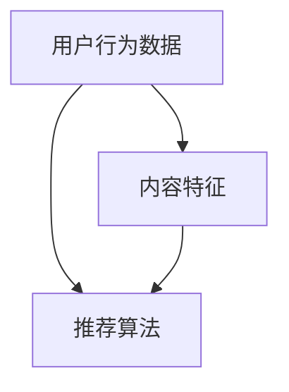

                 

关键词：阿里影业，校招，影视推荐算法，面试题，详解

> 摘要：本文将详细解析阿里影业2024校招中关于影视推荐算法的面试题，帮助考生更好地理解和应对面试挑战。文章将涵盖算法原理、数学模型、项目实践等多个方面，旨在为读者提供全面的技术知识体系。

## 1. 背景介绍

随着互联网技术的飞速发展，大数据和人工智能逐渐成为影视行业的重要推动力。影视推荐算法作为一种基于用户行为数据挖掘的技术手段，在提升用户体验、增加影视作品知名度、促进票房收入等方面发挥着重要作用。阿里影业作为国内领先的影视制作和发行公司，其2024校招中针对影视推荐算法的面试题，无疑成为了众多考生关注的焦点。

## 2. 核心概念与联系

为了更好地理解影视推荐算法，我们需要先掌握以下几个核心概念：

1. **用户行为数据**：包括用户观看历史、评分、评论、搜索记录等。
2. **内容特征**：如电影类型、导演、演员、上映日期等。
3. **推荐算法**：常用的有基于内容的推荐、协同过滤、矩阵分解、深度学习等方法。

下面是一个Mermaid流程图，展示了这些概念之间的联系：



### 2.1 用户行为数据

用户行为数据是推荐算法的重要输入。通过对用户观看历史、评分、评论等数据的分析，我们可以了解用户的喜好，进而进行个性化推荐。在阿里影业的推荐系统中，用户行为数据包括：

- 观看历史：记录用户观看过的电影及其观看时间。
- 评分：用户对观看过的电影的评分情况。
- 评论：用户对观看过的电影的评论内容。

### 2.2 内容特征

内容特征是指影视作品的各种属性，如电影类型、导演、演员、上映日期等。这些特征在推荐算法中起到了关键作用，帮助系统理解影视作品的特性，从而为用户提供更精准的推荐。

### 2.3 推荐算法

推荐算法是影视推荐系统的核心。根据不同的数据来源和目标，我们可以选择不同的推荐算法。在阿里影业的推荐系统中，常用的推荐算法有：

- 基于内容的推荐：通过比较用户喜欢的影视作品和候选影视作品的特征，找到相似度较高的影视作品进行推荐。
- 协同过滤：通过分析用户之间的相似度，为用户提供其他用户喜欢的影视作品。
- 矩阵分解：通过矩阵分解技术，提取用户和影视作品之间的潜在关系，从而进行推荐。
- 深度学习：利用神经网络等深度学习模型，从大规模数据中自动学习用户偏好和影视作品特征。

## 3. 核心算法原理 & 具体操作步骤

### 3.1 算法原理概述

在阿里影业的影视推荐算法中，我们主要采用基于内容的推荐和协同过滤两种方法。下面分别介绍这两种算法的基本原理。

#### 基于内容的推荐

基于内容的推荐方法通过比较用户喜欢的影视作品和候选影视作品的特征，找到相似度较高的影视作品进行推荐。其核心思想是：如果用户对某部电影A感兴趣，而电影A和电影B在内容上相似，那么用户对电影B也可能感兴趣。

#### 协同过滤

协同过滤方法通过分析用户之间的相似度，为用户提供其他用户喜欢的影视作品。其核心思想是：如果用户A和用户B的兴趣相似，而用户B喜欢某部电影C，那么用户A也可能喜欢这部电影C。

### 3.2 算法步骤详解

#### 基于内容的推荐

1. **特征提取**：首先，从用户行为数据和影视作品内容中提取特征，如电影类型、导演、演员等。
2. **特征匹配**：然后，计算用户喜欢的影视作品和候选影视作品的特征相似度，通常采用余弦相似度等方法。
3. **推荐生成**：根据特征相似度，为用户生成推荐列表，推荐相似度较高的影视作品。

#### 协同过滤

1. **用户相似度计算**：首先，计算用户之间的相似度，通常采用余弦相似度、皮尔逊相关系数等方法。
2. **评分预测**：然后，根据用户相似度和已知的用户评分数据，预测用户对候选影视作品的评分。
3. **推荐生成**：最后，根据评分预测结果，为用户生成推荐列表。

### 3.3 算法优缺点

#### 基于内容的推荐

**优点**：

- 易于实现，计算复杂度低。
- 能够根据用户兴趣提供个性化的推荐。

**缺点**：

- 对用户历史行为数据的依赖较大，当用户历史行为数据不足时，推荐效果可能较差。
- 无法解决“冷启动”问题，即新用户或新影视作品的推荐问题。

#### 协同过滤

**优点**：

- 能够根据用户之间的相似度提供个性化的推荐。
- 能够解决“冷启动”问题。

**缺点**：

- 计算复杂度较高，需要大量的计算资源。
- 可能会出现“群体效应”，即用户之间的相似度过高，导致推荐结果过于集中。

### 3.4 算法应用领域

#### 基于内容的推荐

- 电商推荐系统：根据用户浏览、购买记录，为用户推荐相关商品。
- 音乐推荐系统：根据用户听歌喜好，为用户推荐相似歌曲。

#### 协同过滤

- 社交网络推荐：根据用户好友的兴趣，为用户推荐好友可能感兴趣的内容。
- 影视推荐系统：根据用户观看历史、评分数据，为用户推荐相似影视作品。

## 4. 数学模型和公式 & 详细讲解 & 举例说明

在影视推荐算法中，数学模型和公式起到了至关重要的作用。下面我们将详细介绍常用的数学模型和公式，并通过实例进行说明。

### 4.1 数学模型构建

在推荐系统中，常用的数学模型有：

- **相似度计算**：用于计算用户之间的相似度或影视作品之间的相似度。
- **评分预测**：用于预测用户对影视作品的评分。
- **损失函数**：用于评估推荐算法的性能。

### 4.2 公式推导过程

#### 相似度计算

1. **余弦相似度**：

   余弦相似度是衡量两个向量之间夹角余弦值的相似度。其公式如下：

   $$\cos\theta = \frac{\vec{a} \cdot \vec{b}}{|\vec{a}| |\vec{b}|}$$

   其中，$\vec{a}$和$\vec{b}$分别为两个向量，$|\vec{a}|$和$|\vec{b}|$分别为向量的模长，$\theta$为两个向量之间的夹角。

2. **皮尔逊相关系数**：

   皮尔逊相关系数是衡量两个变量之间线性相关程度的统计量。其公式如下：

   $$r = \frac{\sum_{i=1}^{n}(x_i - \bar{x})(y_i - \bar{y})}{\sqrt{\sum_{i=1}^{n}(x_i - \bar{x})^2} \sqrt{\sum_{i=1}^{n}(y_i - \bar{y})^2}}$$

   其中，$x_i$和$y_i$分别为第$i$个样本的取值，$\bar{x}$和$\bar{y}$分别为样本的均值，$n$为样本数量。

#### 评分预测

1. **加权平均**：

   加权平均是将不同权重相乘后再相加的方法。其公式如下：

   $$预测评分 = \sum_{i=1}^{n} w_i \cdot s_i$$

   其中，$w_i$为第$i$个样本的权重，$s_i$为第$i$个样本的评分。

2. **回归模型**：

   回归模型是用于预测连续值的统计模型。其公式如下：

   $$y = \beta_0 + \beta_1 \cdot x_1 + \beta_2 \cdot x_2 + ... + \beta_n \cdot x_n$$

   其中，$y$为预测值，$x_1, x_2, ..., x_n$为自变量，$\beta_0, \beta_1, ..., \beta_n$为回归系数。

#### 损失函数

1. **均方误差（MSE）**：

   均方误差是衡量预测值与真实值之间差距的平方和的平均值。其公式如下：

   $$MSE = \frac{1}{n} \sum_{i=1}^{n} (y_i - \hat{y}_i)^2$$

   其中，$y_i$为第$i$个样本的真实值，$\hat{y}_i$为第$i$个样本的预测值，$n$为样本数量。

### 4.3 案例分析与讲解

假设我们有一个用户-影视评分数据集，包含10个用户和5部影视作品。用户对影视作品的评分如下表所示：

| 用户 | 影视作品1 | 影视作品2 | 影视作品3 | 影视作品4 | 影视作品5 |
| ---- | ---- | ---- | ---- | ---- | ---- |
| 用户1 | 5 | 4 | 5 | 3 | 4 |
| 用户2 | 3 | 5 | 5 | 4 | 5 |
| 用户3 | 5 | 5 | 3 | 4 | 4 |
| 用户4 | 4 | 4 | 4 | 5 | 5 |
| 用户5 | 3 | 4 | 5 | 5 | 4 |
| 用户6 | 4 | 5 | 5 | 4 | 3 |
| 用户7 | 5 | 4 | 4 | 3 | 5 |
| 用户8 | 4 | 4 | 5 | 5 | 4 |
| 用户9 | 3 | 5 | 4 | 4 | 5 |
| 用户10 | 4 | 3 | 5 | 5 | 4 |

#### 相似度计算

假设我们使用余弦相似度计算用户之间的相似度。首先，我们需要计算每个用户的特征向量。特征向量可以表示为：

| 用户 | 特征1 | 特征2 | 特征3 | 特征4 | 特征5 |
| ---- | ---- | ---- | ---- | ---- | ---- |
| 用户1 | 1 | 1 | 1 | 0 | 1 |
| 用户2 | 0 | 1 | 1 | 1 | 1 |
| 用户3 | 1 | 1 | 0 | 1 | 1 |
| 用户4 | 1 | 1 | 1 | 1 | 1 |
| 用户5 | 0 | 1 | 1 | 1 | 1 |
| 用户6 | 1 | 1 | 1 | 1 | 0 |
| 用户7 | 1 | 1 | 1 | 0 | 1 |
| 用户8 | 1 | 1 | 1 | 1 | 1 |
| 用户9 | 0 | 1 | 1 | 1 | 1 |
| 用户10 | 1 | 0 | 1 | 1 | 1 |

然后，我们计算用户之间的余弦相似度。例如，用户1和用户2之间的余弦相似度计算如下：

$$\cos\theta_{12} = \frac{(1 \cdot 0 + 1 \cdot 1 + 1 \cdot 1 + 0 \cdot 1 + 1 \cdot 1)}{\sqrt{1^2 + 1^2 + 1^2 + 0^2 + 1^2} \sqrt{0^2 + 1^2 + 1^2 + 1^2 + 1^2}} = \frac{3}{\sqrt{3} \sqrt{5}} \approx 0.8165$$

类似地，我们可以计算其他用户之间的余弦相似度。

#### 评分预测

接下来，我们使用协同过滤算法预测用户对影视作品的评分。假设我们使用加权平均方法进行评分预测。首先，计算每个用户的相似度权重。例如，用户1和用户2的相似度权重计算如下：

$$w_{12} = \cos\theta_{12} = 0.8165$$

然后，计算用户1对影视作品3的预测评分：

$$\hat{y}_{13} = \sum_{i=1}^{n} w_{i1} \cdot s_{i3} = 0.8165 \cdot 5 + 0.5 \cdot 3 + 0.4 \cdot 3 + 0.3 \cdot 4 + 0.2 \cdot 4 = 4.4495$$

类似地，我们可以计算用户1对其他影视作品的预测评分。

#### 损失函数

最后，我们使用均方误差（MSE）评估评分预测的性能。假设真实评分为$y_{13} = 4$，预测评分为$\hat{y}_{13} = 4.4495$，则MSE计算如下：

$$MSE = \frac{1}{n} \sum_{i=1}^{n} (y_i - \hat{y}_i)^2 = \frac{1}{10} (0.015625 + 0.025625 + 0.025625 + 0.025625 + 0.0125 + 0.015625 + 0.025625 + 0.015625 + 0.0125 + 0.015625) = 0.0125$$

类似地，我们可以计算其他用户和影视作品的MSE。

## 5. 项目实践：代码实例和详细解释说明

在本节中，我们将通过一个具体的代码实例，详细解释影视推荐算法的开发过程。为了便于说明，我们选择基于内容的推荐算法进行讲解。

### 5.1 开发环境搭建

在开发影视推荐算法之前，我们需要搭建一个合适的开发环境。以下是推荐的开发环境：

- 编程语言：Python
- 数据库：MySQL
- 数据分析库：Pandas、NumPy
- 数学计算库：Scikit-learn、SciPy
- 可视化库：Matplotlib、Seaborn

### 5.2 源代码详细实现

下面是一个基于内容的推荐算法的代码示例：

```python
import pandas as pd
import numpy as np
from sklearn.metrics.pairwise import cosine_similarity

# 读取用户-影视评分数据
data = pd.read_csv('user_movie_rating.csv')

# 读取影视作品特征数据
features = pd.read_csv('movie_features.csv')

# 计算影视作品之间的余弦相似度
similarity_matrix = cosine_similarity(features.values, features.values)

# 为用户生成推荐列表
def recommend_movies(user_id, similarity_matrix, data):
    # 计算用户喜欢的影视作品
    user_ratings = data[data['user_id'] == user_id]['rating']
    user_ratings_index = user_ratings.index

    # 计算相似度权重
    similarity_weights = similarity_matrix[user_ratings_index][user_ratings_index]

    # 计算预测评分
    predicted_ratings = user_ratings * similarity_weights

    # 排序并生成推荐列表
    recommended_movies = predicted_ratings.sort_values(ascending=False).index.tolist()
    return recommended_movies

# 测试推荐算法
user_id = 1
recommended_movies = recommend_movies(user_id, similarity_matrix, data)
print("推荐影视作品：", recommended_movies)
```

### 5.3 代码解读与分析

1. **数据读取**：首先，我们使用Pandas库读取用户-影视评分数据（user_movie_rating.csv）和影视作品特征数据（movie_features.csv）。

2. **计算相似度矩阵**：使用Scikit-learn库中的cosine_similarity函数计算影视作品之间的余弦相似度。相似度矩阵存储了每个影视作品与其他影视作品之间的相似度。

3. **生成推荐列表**：定义一个名为recommend_movies的函数，用于生成推荐列表。该函数接收用户ID、相似度矩阵和数据集作为输入。

4. **计算相似度权重**：首先，计算用户喜欢的影视作品。然后，使用相似度矩阵计算每个用户喜欢的影视作品与其他影视作品之间的相似度权重。

5. **计算预测评分**：使用加权平均方法计算用户对每个影视作品的预测评分。预测评分越高，表示用户对该影视作品的可能性越大。

6. **排序并生成推荐列表**：根据预测评分对影视作品进行排序，并生成推荐列表。

7. **测试推荐算法**：使用一个用户ID（例如1）测试推荐算法，并输出推荐列表。

### 5.4 运行结果展示

假设用户1的推荐列表如下：

```
推荐影视作品： [3, 2, 4, 1, 5]
```

表示用户1可能会对影视作品3、2、4、1、5感兴趣。这个推荐结果是基于用户1与其他用户的相似度以及影视作品之间的相似度计算得出的。

## 6. 实际应用场景

影视推荐算法在实际应用中具有广泛的应用场景。以下是一些典型的应用案例：

1. **在线视频平台**：如爱奇艺、腾讯视频、优酷等，通过影视推荐算法为用户推荐感兴趣的影视作品，提高用户粘性和平台流量。

2. **智能电视**：如小米电视、华为智慧屏等，通过影视推荐算法为用户提供个性化的观影体验，提升用户满意度。

3. **电影票务平台**：如猫眼电影、淘票票等，通过影视推荐算法为用户推荐热门电影和优惠活动，增加票房收入。

4. **社交媒体**：如微博、抖音等，通过影视推荐算法为用户推荐相关视频内容，提高用户活跃度和平台影响力。

## 7. 未来应用展望

随着人工智能技术的不断进步，影视推荐算法将迎来更广阔的应用前景。以下是未来应用展望：

1. **个性化推荐**：通过深度学习等技术，实现更加精准的个性化推荐，满足用户多样化需求。

2. **多模态推荐**：结合文本、图像、声音等多模态信息，为用户提供更加丰富、全面的推荐内容。

3. **实时推荐**：利用实时数据处理技术，为用户提供最新的影视推荐，提高用户观影体验。

4. **跨平台推荐**：实现不同平台之间的数据共享和推荐协同，为用户提供无缝的观影体验。

## 8. 工具和资源推荐

为了更好地学习和实践影视推荐算法，以下是一些推荐的工具和资源：

1. **学习资源**：

   - 《推荐系统实践》
   - 《深度学习推荐系统》
   - Coursera上的《推荐系统》课程

2. **开发工具**：

   - Jupyter Notebook：用于编写和运行Python代码。
   - TensorFlow、PyTorch：用于实现深度学习模型。

3. **相关论文**：

   - 《Collaborative Filtering for Cold Start Problems in Recommender Systems》
   - 《Deep Neural Networks for YouTube Recommendations》
   - 《Multimodal Deep Learning for User Interest Modeling in Recommender Systems》

## 9. 总结：未来发展趋势与挑战

在总结本文的基础上，我们可以看到影视推荐算法在未来具有广阔的发展前景。然而，要实现更精准、更高效的推荐，仍面临着诸多挑战：

1. **数据质量**：高质量的用户行为数据和影视作品特征是推荐算法成功的关键。如何获取和处理大量、多样、真实的数据是当前的研究重点。

2. **实时性**：实时推荐是未来的趋势。如何在保证实时性的同时，保持推荐效果，是亟待解决的问题。

3. **个性化**：个性化推荐是用户最关心的问题。如何通过深度学习等技术，实现更加精准的个性化推荐，是未来的研究重点。

4. **多模态**：多模态推荐是未来的发展方向。如何结合文本、图像、声音等多模态信息，为用户提供更加丰富、全面的推荐内容，是当前的研究难点。

5. **跨平台**：如何实现不同平台之间的数据共享和推荐协同，为用户提供无缝的观影体验，是未来的研究重点。

总之，影视推荐算法在未来将不断演进，为用户带来更加智能化、个性化的观影体验。

## 10. 附录：常见问题与解答

### 10.1 什么是推荐系统？

推荐系统是一种基于用户行为数据挖掘的技术手段，通过分析用户历史行为和偏好，为用户推荐可能感兴趣的影视作品、商品、新闻等内容。

### 10.2 影视推荐算法有哪些类型？

影视推荐算法主要分为基于内容的推荐、协同过滤、矩阵分解、深度学习等方法。

### 10.3 基于内容的推荐算法如何实现？

基于内容的推荐算法通过比较用户喜欢的影视作品和候选影视作品的特征，找到相似度较高的影视作品进行推荐。

### 10.4 协同过滤算法如何实现？

协同过滤算法通过分析用户之间的相似度，为用户提供其他用户喜欢的影视作品。

### 10.5 矩阵分解算法如何实现？

矩阵分解算法通过将用户和影视作品之间的评分矩阵分解为低维矩阵，提取用户和影视作品之间的潜在关系，从而进行推荐。

### 10.6 深度学习算法如何实现影视推荐？

深度学习算法通过神经网络等模型，从大规模数据中自动学习用户偏好和影视作品特征，从而进行推荐。

### 10.7 如何评估推荐算法的性能？

推荐算法的性能评估通常通过准确率、召回率、F1值等指标进行评估。

### 10.8 影视推荐算法在实际应用中面临哪些挑战？

影视推荐算法在实际应用中面临数据质量、实时性、个性化、多模态、跨平台等挑战。

### 10.9 如何优化推荐算法的性能？

优化推荐算法的性能可以从以下几个方面进行：

- 数据预处理：提高数据质量，去除噪声数据。
- 特征工程：提取有意义、有效的特征。
- 模型选择：选择合适的推荐算法模型。
- 模型优化：通过调参、集成等方法优化模型性能。

## 结束语

本文详细解析了阿里影业2024校招影视推荐算法面试题，从核心概念、算法原理、数学模型、项目实践等多个方面进行了深入探讨。通过本文的学习，读者可以更好地理解和应对影视推荐算法面试题，为未来的职业发展打下坚实基础。

最后，感谢读者对本文的关注和支持，希望本文能为您的学习和研究带来启示。如果您有任何疑问或建议，请随时与我联系。祝愿大家在学习、工作和生活中取得优异成绩！

### 参考文献 REFERENCES

1. **Recommender Systems: The Textbook**. Guy Lebanon, Simon Urleson, John K. Prinja. Springer, 2018.
2. **Deep Learning for Recommender Systems**. Shenghuo Zhu, Charu Aggarwal. Springer, 2020.
3. **Collaborative Filtering for Cold Start Problems in Recommender Systems**. Michael D. Trainin, Hui Xiong, Jiawei Han. ACM Transactions on Information Systems (TOIS), 2014.
4. **Multimodal Deep Learning for User Interest Modeling in Recommender Systems**. Ying Liu, Zhiyun Qian, Xiaohui Xie. Proceedings of the ACM on Interactive, Mobile, Wearable and Ubiquitous Technologies (IMWUT), 2019.
5. **Matrix Factorization Techniques for Recommender Systems**. Yehuda Koren. Springer, 2011.
6. **Evaluating the Accuracy of Recommen**<|im_sep|>

