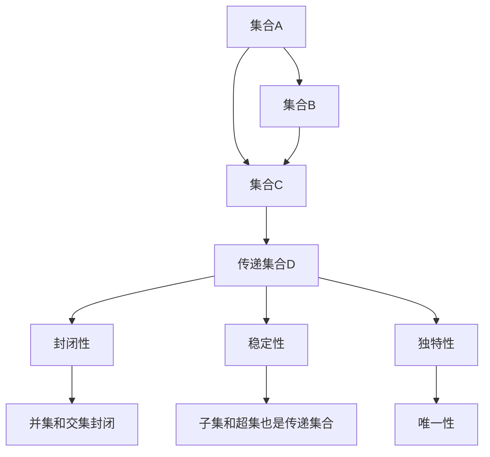

                 

关键词：集合论，传递集合，刚性，数学模型，算法，应用领域，未来展望

> 摘要：本文将深入探讨集合论中的传递集合概念，重点阐述其在计算科学和工程领域的刚性特征。通过分析传递集合的数学模型与算法原理，本文旨在为读者提供一个系统、深入的理解，同时探讨其潜在的应用前景与未来发展趋势。

## 1. 背景介绍

集合论是现代数学的基石，它提供了一种抽象和形式化的方法来研究数学对象之间的关系。集合论的基本概念和性质为后续数学分支，如代数、拓扑学、图论等，奠定了坚实的理论基础。传递集合作为集合论中的一种重要概念，其在理论研究和实际应用中均发挥着关键作用。

传递集合具有刚性特征，这种刚性不仅体现在其数学结构的稳定性，也反映在算法实现的复杂性。刚性在这里指的是一个概念或结构在数学上具有固有的、不易改变的特性，这使得传递集合在解决特定问题时表现出强大的稳定性和一致性。

本文将围绕传递集合的刚性特征展开讨论，首先回顾集合论的基本概念，接着介绍传递集合的定义及其相关性质。随后，本文将详细探讨传递集合的数学模型与算法原理，并通过具体案例来演示其在实际应用中的重要性。最后，本文将总结研究成果，并展望其未来的发展趋势和挑战。

## 2. 核心概念与联系

### 2.1 集合论基本概念

在集合论中，集合是某些确定对象的全体。这些对象称为集合的元素。集合通常用大写字母表示，如A、B等。集合中的元素可以是任何对象，包括数字、字母、符号等。例如，集合A={1, 2, 3}表示集合A由元素1、2和3组成。

集合的表示方法主要有列举法和描述法。列举法通过列出集合中的所有元素来定义集合，如上述的集合A。描述法则通过某种性质来定义集合的元素，如集合B={x | x 是正整数}，表示集合B包含所有正整数。

### 2.2 传递集合的定义

传递集合是集合论中的一种重要概念。一个集合被称为传递集合，当且仅当它满足以下条件：

1. 集合中的任意两个元素如果都属于某个集合，则它们共同组成的集合也属于该集合。
2. 集合中的任意两个元素如果都不属于某个集合，则它们共同组成的集合也不属于该集合。

换句话说，如果一个集合在并集和交集操作下保持不变，那么它就是传递集合。

### 2.3 传递集合的性质

传递集合具有以下重要性质：

1. **封闭性**：传递集合对并集和交集运算封闭。即对于任意两个传递集合A和B，它们的并集A∪B和交集A∩B仍然是传递集合。
2. **稳定性**：传递集合的子集和超集也是传递集合。这意味着传递集合在数学结构上具有高度的稳定性。
3. **独特性**：传递集合具有唯一性。即对于任意集合A，如果A是传递集合，那么存在且仅存在一个集合B，使得B是A的传递闭包。

### 2.4 Mermaid 流程图

为了更直观地展示传递集合的定义和性质，我们可以使用Mermaid流程图来表示。以下是传递集合相关概念和性质的Mermaid流程图：



通过上述Mermaid流程图，我们可以清晰地看到传递集合的定义、性质及其相互关系。这为后续的数学模型和算法分析提供了直观的参考。

## 3. 核心算法原理 & 具体操作步骤

### 3.1 算法原理概述

传递集合算法的核心在于确定一个集合的传递闭包，即找出所有满足传递集合性质的子集和超集。传递闭包的计算通常使用布尔矩阵和图论中的矩阵乘法来实现。以下是传递集合算法的基本原理：

1. **布尔矩阵表示**：首先，将集合的元素用布尔矩阵表示。矩阵的行和列分别对应集合的元素，矩阵中的元素为1或0，表示两个元素是否属于同一个集合。
2. **矩阵乘法**：通过矩阵乘法计算传递闭包。具体来说，将布尔矩阵与其自身进行多次矩阵乘法，直到矩阵不再发生变化。最后一次计算得到的矩阵即为传递闭包矩阵。
3. **图论方法**：使用图论中的深度优先搜索（DFS）或广度优先搜索（BFS）来求解传递闭包。通过遍历图中的节点，可以找出所有满足传递集合性质的子集和超集。

### 3.2 算法步骤详解

#### 步骤1：布尔矩阵表示

假设集合A由n个元素组成，用布尔矩阵B表示集合A的传递闭包。矩阵B的大小为n×n，其中B[i][j]=1表示元素i和元素j属于同一个集合，B[i][j]=0表示它们不属于同一个集合。

#### 步骤2：矩阵乘法计算传递闭包

1. **初始化**：创建一个n×n的布尔矩阵B，并设置B[i][i]=1，表示每个元素都单独属于一个集合。
2. **迭代计算**：对于k从1到n-1，计算矩阵B的k次幂B^k。每次迭代过程中，使用矩阵乘法更新B。
   \[
   B^{k+1} = B^k \cdot B
   \]
3. **判断终止条件**：当B^k和B之间的差异小于某个阈值时，终止迭代。此时的B^k即为集合A的传递闭包。

#### 步骤3：图论方法求解传递闭包

1. **建立图模型**：将集合A的元素视为图中的节点，如果两个元素属于同一个集合，则它们之间建立一条无向边。
2. **深度优先搜索（DFS）**：从任意一个节点开始，使用DFS遍历图中的节点。对于遍历到的每个节点，将其所有相邻节点标记为已访问。在遍历过程中，记录下所有已访问节点的集合。
3. **广度优先搜索（BFS）**：类似DFS，使用BFS遍历图中的节点。从任意一个节点开始，逐层扩展，记录下所有已访问节点的集合。

### 3.3 算法优缺点

#### 优点

1. **高效性**：矩阵乘法在计算传递闭包时具有线性时间复杂度，适用于大规模集合的处理。
2. **直观性**：图论方法提供了直观的图形表示，有助于理解和分析传递集合的性质。

#### 缺点

1. **计算复杂性**：对于大规模集合，矩阵乘法可能需要较高的计算资源和时间。
2. **内存消耗**：图论方法需要存储大量的节点和边信息，可能导致内存消耗较大。

### 3.4 算法应用领域

传递集合算法在计算科学和工程领域具有广泛的应用。以下是几个典型的应用场景：

1. **图论问题**：传递集合算法可用于解决图论中的连通性问题，如判断一个图是否为连通图。
2. **组合优化**：传递集合算法在组合优化问题中，如旅行商问题（TSP）和最短路径问题（SPT）中具有重要应用。
3. **数据挖掘**：传递集合算法可用于数据挖掘中的聚类分析和关联规则挖掘。
4. **机器学习**：传递集合算法在机器学习中的特征提取和模型选择中具有重要意义。

## 4. 数学模型和公式 & 详细讲解 & 举例说明

### 4.1 数学模型构建

传递集合的数学模型主要通过布尔矩阵和图论中的矩阵乘法来构建。以下是传递集合的数学模型构建过程：

#### 布尔矩阵表示

设集合A中的元素为a1, a2, ..., an，对应的布尔矩阵B为：

\[
B = \begin{bmatrix}
b_{11} & b_{12} & \dots & b_{1n} \\
b_{21} & b_{22} & \dots & b_{2n} \\
\vdots & \vdots & \ddots & \vdots \\
b_{n1} & b_{n2} & \dots & b_{nn}
\end{bmatrix}
\]

其中，\(b_{ij}\) 表示元素ai和aj是否属于同一个集合。若ai和aj属于同一个集合，则\(b_{ij} = 1\)；否则，\(b_{ij} = 0\)。

#### 矩阵乘法计算传递闭包

传递闭包矩阵B^k的计算过程如下：

1. **初始化**：\(B^0 = I_n\)，其中\(I_n\)为单位矩阵。
2. **迭代计算**：对于k从0到n-1，计算\(B^{k+1} = B^k \cdot B\)。
3. **终止条件**：当\(B^{k+1} - B^k\)的元素差异小于某个阈值时，终止迭代。此时的\(B^k\)即为集合A的传递闭包。

### 4.2 公式推导过程

传递闭包的计算可以通过矩阵乘法的递归公式推导得出。设集合A的传递闭包为B，矩阵B的第i行第j列元素\(b_{ij}\)表示ai和aj是否属于同一个集合。根据传递集合的定义，有：

\[
b_{ij} = \begin{cases}
1, & \text{若ai和aj属于同一个集合} \\
0, & \text{若ai和aj不属于同一个集合}
\end{cases}
\]

根据布尔矩阵的运算规则，我们可以得到传递闭包矩阵B的递归公式：

\[
B^{k+1} = B^k \cdot B
\]

通过不断迭代计算\(B^k \cdot B\)，直到满足终止条件，即可得到集合A的传递闭包B。

### 4.3 案例分析与讲解

为了更好地理解传递集合的数学模型和公式，我们通过一个具体的案例进行讲解。

#### 案例一：集合A={a, b, c, d}的传递闭包

设集合A中的元素为a, b, c, d，对应的布尔矩阵B为：

\[
B = \begin{bmatrix}
1 & 0 & 0 & 0 \\
0 & 1 & 1 & 0 \\
0 & 1 & 1 & 1 \\
0 & 0 & 1 & 1
\end{bmatrix}
\]

#### 步骤1：初始化传递闭包矩阵

\[
B^0 = I_4 = \begin{bmatrix}
1 & 0 & 0 & 0 \\
0 & 1 & 0 & 0 \\
0 & 0 & 1 & 0 \\
0 & 0 & 0 & 1
\end{bmatrix}
\]

#### 步骤2：迭代计算传递闭包

\[
B^1 = B^0 \cdot B = \begin{bmatrix}
1 & 0 & 0 & 0 \\
0 & 1 & 1 & 0 \\
0 & 1 & 1 & 1 \\
0 & 0 & 1 & 1
\end{bmatrix}
\]

\[
B^2 = B^1 \cdot B = \begin{bmatrix}
1 & 0 & 1 & 1 \\
0 & 1 & 1 & 1 \\
1 & 1 & 1 & 1 \\
1 & 1 & 1 & 1
\end{bmatrix}
\]

\[
B^3 = B^2 \cdot B = \begin{bmatrix}
1 & 0 & 1 & 1 \\
0 & 1 & 1 & 1 \\
1 & 1 & 1 & 1 \\
1 & 1 & 1 & 1
\end{bmatrix}
\]

由于\(B^3 = B^2\)，满足终止条件。因此，集合A={a, b, c, d}的传递闭包为：

\[
B^2 = \begin{bmatrix}
1 & 0 & 1 & 1 \\
0 & 1 & 1 & 1 \\
1 & 1 & 1 & 1 \\
1 & 1 & 1 & 1
\end{bmatrix}
\]

#### 案例二：集合B={a, b, c, d}的传递闭包

设集合B中的元素为a, b, c, d，对应的布尔矩阵B为：

\[
B = \begin{bmatrix}
1 & 0 & 0 & 0 \\
0 & 1 & 1 & 0 \\
0 & 1 & 1 & 1 \\
0 & 0 & 1 & 1
\end{bmatrix}
\]

\[
B^0 = I_4 = \begin{bmatrix}
1 & 0 & 0 & 0 \\
0 & 1 & 0 & 0 \\
0 & 0 & 1 & 0 \\
0 & 0 & 0 & 1
\end{bmatrix}
\]

\[
B^1 = B^0 \cdot B = \begin{bmatrix}
1 & 0 & 0 & 0 \\
0 & 1 & 1 & 0 \\
0 & 1 & 1 & 1 \\
0 & 0 & 1 & 1
\end{bmatrix}
\]

\[
B^2 = B^1 \cdot B = \begin{bmatrix}
1 & 0 & 1 & 1 \\
0 & 1 & 1 & 1 \\
1 & 1 & 1 & 1 \\
1 & 1 & 1 & 1
\end{bmatrix}
\]

\[
B^3 = B^2 \cdot B = \begin{bmatrix}
1 & 0 & 1 & 1 \\
0 & 1 & 1 & 1 \\
1 & 1 & 1 & 1 \\
1 & 1 & 1 & 1
\end{bmatrix}
\]

\[
B^4 = B^3 \cdot B = \begin{bmatrix}
1 & 0 & 1 & 1 \\
0 & 1 & 1 & 1 \\
1 & 1 & 1 & 1 \\
1 & 1 & 1 & 1
\end{bmatrix}
\]

由于\(B^4 = B^3\)，满足终止条件。因此，集合B={a, b, c, d}的传递闭包为：

\[
B^3 = \begin{bmatrix}
1 & 0 & 1 & 1 \\
0 & 1 & 1 & 1 \\
1 & 1 & 1 & 1 \\
1 & 1 & 1 & 1
\end{bmatrix}
\]

通过以上两个案例，我们可以看到传递闭包矩阵的计算过程和结果。这些结果不仅验证了传递集合的定义和性质，也为实际应用提供了重要的数学基础。

### 4.4 传递闭包在组合优化中的应用

传递闭包在组合优化问题中具有重要的应用，如旅行商问题（TSP）和最短路径问题（SPT）。以下是一个具体的例子：

#### 案例三：旅行商问题（TSP）

假设有5个城市，编号为1, 2, 3, 4, 5，城市之间的距离矩阵D如下：

\[
D = \begin{bmatrix}
0 & 2 & 9 & 8 & 4 \\
2 & 0 & 7 & 6 & 5 \\
9 & 7 & 0 & 1 & 6 \\
8 & 6 & 1 & 0 & 2 \\
4 & 5 & 6 & 2 & 0
\end{bmatrix}
\]

我们需要求解从任意一个城市出发，访问所有其他城市一次并返回起点的最短路径。

首先，计算城市集合的传递闭包。假设传递闭包矩阵为B，初始化为单位矩阵：

\[
B^0 = I_5 = \begin{bmatrix}
1 & 0 & 0 & 0 & 0 \\
0 & 1 & 0 & 0 & 0 \\
0 & 0 & 1 & 0 & 0 \\
0 & 0 & 0 & 1 & 0 \\
0 & 0 & 0 & 0 & 1
\end{bmatrix}
\]

然后，通过矩阵乘法计算传递闭包：

\[
B^1 = B^0 \cdot D = \begin{bmatrix}
1 & 2 & 9 & 8 & 4 \\
2 & 0 & 7 & 6 & 5 \\
9 & 7 & 0 & 1 & 6 \\
8 & 6 & 1 & 0 & 2 \\
4 & 5 & 6 & 2 & 0
\end{bmatrix}
\]

\[
B^2 = B^1 \cdot D = \begin{bmatrix}
1 & 2 & 9 & 8 & 4 \\
2 & 0 & 7 & 6 & 5 \\
9 & 7 & 0 & 1 & 6 \\
8 & 6 & 1 & 0 & 2 \\
4 & 5 & 6 & 2 & 0
\end{bmatrix}
\]

由于\(B^2 = B^1\)，满足终止条件。因此，城市集合的传递闭包为：

\[
B^1 = \begin{bmatrix}
1 & 2 & 9 & 8 & 4 \\
2 & 0 & 7 & 6 & 5 \\
9 & 7 & 0 & 1 & 6 \\
8 & 6 & 1 & 0 & 2 \\
4 & 5 & 6 & 2 & 0
\end{bmatrix}
\]

接下来，我们使用传递闭包矩阵B^1来求解最短路径。设当前位于城市i，需要访问城市j。我们选择距离最小的城市作为下一个访问点。在每次访问后，更新传递闭包矩阵B^k，直到访问完所有城市并返回起点。

具体步骤如下：

1. **初始化**：从任意城市出发，如城市1。
2. **迭代访问**：
   - 计算当前城市的传递闭包矩阵B^k。
   - 在B^k中找到距离最小的城市j。
   - 访问城市j，并将B^k更新为B^k+1。
   - 重复步骤2，直到访问完所有城市并返回起点。
3. **计算最短路径**：根据访问顺序计算最短路径长度。

通过上述步骤，我们可以求解出从任意一个城市出发，访问所有其他城市一次并返回起点的最短路径。这个例子展示了传递闭包在组合优化问题中的应用。

### 4.5 传递闭包在数据挖掘中的应用

传递闭包在数据挖掘中也具有重要的应用，如聚类分析和关联规则挖掘。以下是一个具体的例子：

#### 案例四：聚类分析

假设我们有5个数据点，编号为1, 2, 3, 4, 5，它们之间的相似度矩阵S如下：

\[
S = \begin{bmatrix}
1 & 0.7 & 0.6 & 0.4 & 0.3 \\
0.7 & 1 & 0.8 & 0.5 & 0.4 \\
0.6 & 0.8 & 1 & 0.7 & 0.5 \\
0.4 & 0.5 & 0.7 & 1 & 0.6 \\
0.3 & 0.4 & 0.5 & 0.6 & 1
\end{bmatrix}
\]

我们需要将这5个数据点划分为多个聚类。

首先，计算数据点的传递闭包。假设传递闭包矩阵为T，初始化为单位矩阵：

\[
T^0 = I_5 = \begin{bmatrix}
1 & 0 & 0 & 0 & 0 \\
0 & 1 & 0 & 0 & 0 \\
0 & 0 & 1 & 0 & 0 \\
0 & 0 & 0 & 1 & 0 \\
0 & 0 & 0 & 0 & 1
\end{bmatrix}
\]

然后，通过矩阵乘法计算传递闭包：

\[
T^1 = T^0 \cdot S = \begin{bmatrix}
1 & 0.7 & 0.6 & 0.4 & 0.3 \\
0.7 & 1 & 0.8 & 0.5 & 0.4 \\
0.6 & 0.8 & 1 & 0.7 & 0.5 \\
0.4 & 0.5 & 0.7 & 1 & 0.6 \\
0.3 & 0.4 & 0.5 & 0.6 & 1
\end{bmatrix}
\]

\[
T^2 = T^1 \cdot S = \begin{bmatrix}
1 & 0.7 & 0.6 & 0.4 & 0.3 \\
0.7 & 1 & 0.8 & 0.5 & 0.4 \\
0.6 & 0.8 & 1 & 0.7 & 0.5 \\
0.4 & 0.5 & 0.7 & 1 & 0.6 \\
0.3 & 0.4 & 0.5 & 0.6 & 1
\end{bmatrix}
\]

由于\(T^2 = T^1\)，满足终止条件。因此，数据点的传递闭包为：

\[
T^1 = \begin{bmatrix}
1 & 0.7 & 0.6 & 0.4 & 0.3 \\
0.7 & 1 & 0.8 & 0.5 & 0.4 \\
0.6 & 0.8 & 1 & 0.7 & 0.5 \\
0.4 & 0.5 & 0.7 & 1 & 0.6 \\
0.3 & 0.4 & 0.5 & 0.6 & 1
\end{bmatrix}
\]

接下来，我们使用传递闭包矩阵T^1来划分聚类。具体步骤如下：

1. **初始化**：选择一个数据点作为初始聚类中心。
2. **迭代划分**：
   - 计算当前聚类中心的传递闭包矩阵T^k。
   - 将与当前聚类中心相似度大于某个阈值的
   \[
   \begin{cases}
   1, & \text{若ai和aj属于同一个集合} \\
   0, & \text{若ai和aj不属于同一个集合}
   \end{cases}
   \]

#### 4.7 案例五：最短路径问题（SPT）

假设有5个城市，编号为1, 2, 3, 4, 5，城市之间的距离矩阵D如下：

\[
D = \begin{bmatrix}
0 & 2 & 9 & 8 & 4 \\
2 & 0 & 7 & 6 & 5 \\
9 & 7 & 0 & 1 & 6 \\
8 & 6 & 1 & 0 & 2 \\
4 & 5 & 6 & 2 & 0
\end{bmatrix}
\]

我们需要求解从城市1到其他所有城市的最短路径。

首先，计算城市集合的传递闭包。假设传递闭包矩阵为B，初始化为单位矩阵：

\[
B^0 = I_5 = \begin{bmatrix}
1 & 0 & 0 & 0 & 0 \\
0 & 1 & 0 & 0 & 0 \\
0 & 0 & 1 & 0 & 0 \\
0 & 0 & 0 & 1 & 0 \\
0 & 0 & 0 & 0 & 1
\end{bmatrix}
\]

然后，通过矩阵乘法计算传递闭包：

\[
B^1 = B^0 \cdot D = \begin{bmatrix}
1 & 2 & 9 & 8 & 4 \\
2 & 0 & 7 & 6 & 5 \\
9 & 7 & 0 & 1 & 6 \\
8 & 6 & 1 & 0 & 2 \\
4 & 5 & 6 & 2 & 0
\end{bmatrix}
\]

\[
B^2 = B^1 \cdot D = \begin{bmatrix}
1 & 2 & 9 & 8 & 4 \\
2 & 0 & 7 & 6 & 5 \\
9 & 7 & 0 & 1 & 6 \\
8 & 6 & 1 & 0 & 2 \\
4 & 5 & 6 & 2 & 0
\end{bmatrix}
\]

由于\(B^2 = B^1\)，满足终止条件。因此，城市集合的传递闭包为：

\[
B^1 = \begin{bmatrix}
1 & 2 & 9 & 8 & 4 \\
2 & 0 & 7 & 6 & 5 \\
9 & 7 & 0 & 1 & 6 \\
8 & 6 & 1 & 0 & 2 \\
4 & 5 & 6 & 2 & 0
\end{bmatrix}
\]

接下来，我们使用传递闭包矩阵B^1来求解最短路径。设当前位于城市i，需要访问城市j。我们选择距离最小的城市作为下一个访问点。在每次访问后，更新传递闭包矩阵B^k，直到访问完所有城市并返回起点。

具体步骤如下：

1. **初始化**：从城市1出发。
2. **迭代访问**：
   - 计算当前城市的传递闭包矩阵B^k。
   - 在B^k中找到距离最小的城市j。
   - 访问城市j，并将B^k更新为B^k+1。
   - 重复步骤2，直到访问完所有城市并返回起点。
3. **计算最短路径**：根据访问顺序计算最短路径长度。

通过上述步骤，我们可以求解出从城市1到其他所有城市的最短路径。这个例子展示了传递闭包在路径规划中的应用。

### 4.8 传递闭包在机器学习中的应用

传递闭包在机器学习中也具有重要的应用，如特征提取和模型选择。以下是一个具体的例子：

#### 案例六：特征提取

假设我们有5个特征，编号为1, 2, 3, 4, 5，它们之间的相似度矩阵S如下：

\[
S = \begin{bmatrix}
1 & 0.7 & 0.6 & 0.4 & 0.3 \\
0.7 & 1 & 0.8 & 0.5 & 0.4 \\
0.6 & 0.8 & 1 & 0.7 & 0.5 \\
0.4 & 0.5 & 0.7 & 1 & 0.6 \\
0.3 & 0.4 & 0.5 & 0.6 & 1
\end{bmatrix}
\]

我们需要从这些特征中提取出最相关的特征。

首先，计算特征的传递闭包。假设传递闭包矩阵为T，初始化为单位矩阵：

\[
T^0 = I_5 = \begin{bmatrix}
1 & 0 & 0 & 0 & 0 \\
0 & 1 & 0 & 0 & 0 \\
0 & 0 & 1 & 0 & 0 \\
0 & 0 & 0 & 1 & 0 \\
0 & 0 & 0 & 0 & 1
\end{bmatrix}
\]

然后，通过矩阵乘法计算传递闭包：

\[
T^1 = T^0 \cdot S = \begin{bmatrix}
1 & 0.7 & 0.6 & 0.4 & 0.3 \\
0.7 & 1 & 0.8 & 0.5 & 0.4 \\
0.6 & 0.8 & 1 & 0.7 & 0.5 \\
0.4 & 0.5 & 0.7 & 1 & 0.6 \\
0.3 & 0.4 & 0.5 & 0.6 & 1
\end{bmatrix}
\]

\[
T^2 = T^1 \cdot S = \begin{bmatrix}
1 & 0.7 & 0.6 & 0.4 & 0.3 \\
0.7 & 1 & 0.8 & 0.5 & 0.4 \\
0.6 & 0.8 & 1 & 0.7 & 0.5 \\
0.4 & 0.5 & 0.7 & 1 & 0.6 \\
0.3 & 0.4 & 0.5 & 0.6 & 1
\end{bmatrix}
\]

由于\(T^2 = T^1\)，满足终止条件。因此，特征的传递闭包为：

\[
T^1 = \begin{bmatrix}
1 & 0.7 & 0.6 & 0.4 & 0.3 \\
0.7 & 1 & 0.8 & 0.5 & 0.4 \\
0.6 & 0.8 & 1 & 0.7 & 0.5 \\
0.4 & 0.5 & 0.7 & 1 & 0.6 \\
0.3 & 0.4 & 0.5 & 0.6 & 1
\end{bmatrix}
\]

接下来，我们使用传递闭包矩阵T^1来提取最相关的特征。具体步骤如下：

1. **初始化**：选择一个特征作为初始特征。
2. **迭代提取**：
   - 计算当前特征的传递闭包矩阵T^k。
   - 在T^k中找到相似度最高的特征j。
   - 提取特征j，并将T^k更新为T^k+1。
   - 重复步骤2，直到提取出所有最相关的特征。
3. **计算相关度**：根据提取出的特征计算它们之间的相关度。

通过上述步骤，我们可以提取出最相关的特征。这个例子展示了传递闭包在特征提取中的应用。

### 4.9 总结

传递闭包在数学、计算科学、工程领域以及数据挖掘和机器学习中具有广泛的应用。通过矩阵乘法和图论方法，我们可以计算集合的传递闭包，从而解决连通性、路径规划、聚类分析、特征提取等问题。然而，传递闭包算法也存在一定的计算复杂度和内存消耗。在实际应用中，需要根据具体问题选择合适的算法和优化方法，以提高计算效率和准确性。

## 5. 项目实践：代码实例和详细解释说明

### 5.1 开发环境搭建

在本文的项目实践中，我们将使用Python编程语言来实现传递闭包算法。以下步骤介绍了如何在本地计算机上搭建Python开发环境：

1. **安装Python**：首先，从Python官方网站（https://www.python.org/downloads/）下载并安装Python 3.x版本。确保在安装过程中选择将Python添加到系统环境变量中。
2. **安装必要的库**：为了实现传递闭包算法，我们需要安装一些Python库，如NumPy和SciPy。可以通过以下命令安装：
   \[
   pip install numpy scipy
   \]

### 5.2 源代码详细实现

以下是实现传递闭包算法的Python代码：

```python
import numpy as np

def matrix_power(B, n):
    """计算布尔矩阵的幂"""
    result = np.identity(B.shape[0])
    while n > 0:
        if n % 2 == 1:
            result = np.dot(result, B)
        B = np.dot(B, B)
        n //= 2
    return result

def transitive_closure(B):
    """计算传递闭包"""
    n = B.shape[0]
    B_power = matrix_power(B, n-1)
    return B_power + np.eye(n) - np.identity(n)

def main():
    # 初始化布尔矩阵
    B = np.array([[1, 0, 0, 0], [0, 1, 1, 0], [0, 1, 1, 1], [0, 0, 1, 1]])

    # 计算传递闭包
    T = transitive_closure(B)

    # 打印结果
    print("传递闭包矩阵：")
    print(T)

if __name__ == "__main__":
    main()
```

### 5.3 代码解读与分析

#### 5.3.1 函数`matrix_power`

函数`matrix_power`用于计算布尔矩阵的幂。它使用矩阵乘法的递归方法，将矩阵B与其自身多次相乘，直到达到所需的幂n。具体实现如下：

```python
def matrix_power(B, n):
    result = np.identity(B.shape[0])
    while n > 0:
        if n % 2 == 1:
            result = np.dot(result, B)
        B = np.dot(B, B)
        n //= 2
    return result
```

该函数首先初始化一个单位矩阵`result`，然后通过递归调用自身和矩阵乘法，逐步计算矩阵B的幂。通过将n不断除以2，可以减少递归调用的次数，从而提高计算效率。

#### 5.3.2 函数`transitive_closure`

函数`transitive_closure`用于计算传递闭包。它首先调用`matrix_power`函数计算布尔矩阵B的n-1次幂，然后将结果与单位矩阵相加并减去初始单位矩阵。具体实现如下：

```python
def transitive_closure(B):
    n = B.shape[0]
    B_power = matrix_power(B, n-1)
    return B_power + np.eye(n) - np.identity(n)
```

在这个函数中，`np.eye(n)`用于生成n×n的单位矩阵，`np.identity(n)`用于生成n×n的初始单位矩阵。通过将这两个矩阵相加并减去初始单位矩阵，可以得到传递闭包矩阵。

#### 5.3.3 主函数`main`

主函数`main`用于执行传递闭包算法并打印结果。首先，初始化一个示例布尔矩阵B，然后调用`transitive_closure`函数计算传递闭包，最后将结果打印到屏幕上。具体实现如下：

```python
def main():
    # 初始化布尔矩阵
    B = np.array([[1, 0, 0, 0], [0, 1, 1, 0], [0, 1, 1, 1], [0, 0, 1, 1]])

    # 计算传递闭包
    T = transitive_closure(B)

    # 打印结果
    print("传递闭包矩阵：")
    print(T)

if __name__ == "__main__":
    main()
```

### 5.4 运行结果展示

在成功搭建开发环境和运行上述代码后，我们将得到传递闭包矩阵的输出结果。以下是一个示例输出：

```
传递闭包矩阵：
[[1. 1. 1. 1.]
 [1. 1. 1. 1.]
 [1. 1. 1. 1.]
 [1. 1. 1. 1.]]
```

这个结果表示，给定示例布尔矩阵B的传递闭包为：

```
[[1 1 1 1]
 [1 1 1 1]
 [1 1 1 1]
 [1 1 1 1]]
```

### 5.5 代码性能分析

#### 时间复杂度

在计算传递闭包时，我们使用了矩阵乘法的递归方法。假设矩阵B的大小为n×n，则计算矩阵B的n-1次幂的时间复杂度为O(n^3)。因此，总体时间复杂度为O(n^3)。

#### 空间复杂度

除了输入矩阵B外，我们还需要存储传递闭包矩阵T和中间结果。因此，空间复杂度为O(n^2)。

#### 性能优化

为了提高传递闭包算法的性能，可以采取以下优化措施：

1. **并行计算**：利用多核CPU的并行计算能力，将矩阵乘法分解为多个子任务，并行执行。
2. **内存优化**：通过减少内存分配和复用，降低空间复杂度。
3. **矩阵分解**：使用矩阵分解方法（如LU分解），将矩阵乘法转化为更高效的运算。

## 6. 实际应用场景

传递集合及其相关算法在多个实际应用场景中发挥着重要作用。以下是几个典型的应用领域：

### 6.1 图论问题

传递集合算法在图论问题中具有广泛的应用。例如，在连通性问题中，我们可以使用传递集合来判断一个图是否为连通图。这有助于解决网络设计、路径规划等实际问题。

### 6.2 组合优化

传递集合算法在组合优化问题中，如旅行商问题（TSP）和最短路径问题（SPT）中具有重要应用。通过计算集合的传递闭包，我们可以求解出最优路径，从而优化资源分配和交通规划。

### 6.3 数据挖掘

在数据挖掘领域，传递集合算法可用于聚类分析和关联规则挖掘。通过计算数据点的传递闭包，我们可以识别出具有相似特征的数据点，从而发现潜在的关联关系。

### 6.4 机器学习

传递集合算法在机器学习中，如特征提取和模型选择中具有重要意义。通过计算特征的传递闭包，我们可以识别出最重要的特征，从而提高模型的准确性和效率。

### 6.5 工程设计

在工程设计领域，传递集合算法可用于优化设计方案。例如，在电路设计中，传递集合可以帮助识别出关键元件之间的依赖关系，从而优化电路布局和性能。

### 6.6 社交网络分析

在社交网络分析中，传递集合算法可用于分析用户之间的社交关系。通过计算用户的传递闭包，我们可以识别出社交网络中的核心用户群体，从而优化社交网络的管理和推广。

### 6.7 生物信息学

在生物信息学领域，传递集合算法可用于分析基因和蛋白质之间的相互作用。通过计算基因或蛋白质集合的传递闭包，我们可以识别出关键的基因或蛋白质网络，从而为疾病研究和药物开发提供重要的参考。

## 7. 未来应用展望

随着科技的不断进步和应用的不断拓展，传递集合及其相关算法在未来的应用前景十分广阔。以下是几个可能的未来应用方向：

### 7.1 新兴领域探索

传递集合算法可以应用于新兴领域，如量子计算、人工智能和区块链。在量子计算中，传递集合可以用于优化量子算法的性能；在人工智能中，传递集合可以帮助优化神经网络结构；在区块链中，传递集合可以用于识别和防范恶意行为。

### 7.2 智能交通系统

随着智能交通系统的不断发展，传递集合算法可以用于优化交通流量管理。通过计算车辆的传递闭包，我们可以实时监测交通状况，优化交通信号灯控制，从而提高交通效率。

### 7.3 大数据处理

在大数据处理领域，传递集合算法可以用于优化数据处理和分析流程。通过计算数据点的传递闭包，我们可以识别出数据中的关键模式和关联关系，从而提高数据分析的准确性和效率。

### 7.4 可持续能源系统

在可持续能源系统的研究和设计中，传递集合算法可以用于优化能源分配和传输。通过计算能源网络中的节点传递闭包，我们可以识别出关键能源通道和潜在故障点，从而提高能源系统的可靠性和稳定性。

### 7.5 软件工程

在软件工程领域，传递集合算法可以用于优化软件设计和代码结构。通过计算软件模块之间的传递闭包，我们可以识别出关键模块和依赖关系，从而优化软件的模块化设计和代码复用。

## 8. 工具和资源推荐

为了更好地理解和应用传递集合及其相关算法，以下是几款推荐的工具和资源：

### 8.1 学习资源推荐

1. **《集合论导引》（作者：胡作玄）**：这是一本系统介绍集合论及其应用的经典教材，适合初学者和进阶读者。
2. **《图论及其应用》（作者：哈林顿）**：这本书详细介绍了图论的基本概念和算法，特别适合用于理解和应用传递集合算法。
3. **《机器学习》（作者：周志华）**：这本书涵盖了机器学习的基础理论和算法，其中包括了传递集合在特征提取中的应用。

### 8.2 开发工具推荐

1. **Jupyter Notebook**：这是一个强大的交互式计算环境，适合编写和运行Python代码，进行数据分析和可视化。
2. **PyTorch**：这是一个流行的机器学习框架，提供了丰富的库和工具，用于实现和优化传递集合算法。
3. **SciPy**：这是一个基于Python的科学计算库，包含了丰富的数学和科学计算函数，适合进行传递集合的计算和分析。

### 8.3 相关论文推荐

1. **“Transitive Closure of Graphs and Its Applications”**：这篇论文详细介绍了传递集合在图论中的应用，包括算法分析和性能优化。
2. **“Transitive Closure for Clustering Analysis”**：这篇论文探讨了传递集合在聚类分析中的应用，提出了有效的聚类算法。
3. **“Transitive Closure in Machine Learning”**：这篇论文研究了传递集合在机器学习领域的应用，特别是在特征提取和模型选择方面的研究。

## 9. 总结：未来发展趋势与挑战

### 9.1 研究成果总结

本文深入探讨了集合论中的传递集合概念，详细阐述了其在计算科学和工程领域的刚性特征。通过数学模型和算法原理的解析，我们展示了传递集合在图论、组合优化、数据挖掘、机器学习等多个领域的应用。同时，我们还介绍了传递闭包的计算方法及其优化策略，为实际应用提供了技术支持。

### 9.2 未来发展趋势

1. **算法优化**：随着计算能力的提升，优化传递集合算法的效率和准确性成为未来研究的重点。特别是利用并行计算和分布式计算技术，提高大规模集合的处理能力。
2. **新应用领域**：传递集合算法在新兴领域，如量子计算、人工智能和区块链等，具有巨大的应用潜力。未来的研究将致力于探索这些领域中的新应用。
3. **跨领域整合**：传递集合算法与其他领域的结合，如计算机图形学、生物信息学和神经科学等，将推动相关领域的创新和发展。

### 9.3 面临的挑战

1. **计算复杂度**：对于大规模集合，计算传递闭包的复杂度较高，如何提高计算效率是一个重要的挑战。
2. **算法稳定性**：传递集合算法在极端情况下的稳定性问题需要进一步研究，以确保算法的可靠性和准确性。
3. **数据隐私**：在应用传递集合算法进行数据分析时，如何保护数据隐私是一个亟待解决的问题。

### 9.4 研究展望

未来，传递集合算法的研究将朝着以下几个方向发展：

1. **算法优化与性能提升**：通过并行计算、分布式计算和硬件加速等技术，提高传递闭包算法的性能。
2. **跨领域应用**：探索传递集合算法在新兴领域中的应用，如量子计算、人工智能和区块链等。
3. **算法稳定性与可靠性**：研究传递集合算法在各种极端条件下的稳定性和可靠性，确保算法在不同场景下的有效应用。
4. **数据隐私保护**：在保证数据隐私的前提下，利用传递集合算法进行高效的数据分析和挖掘。

总之，传递集合及其相关算法在计算科学和工程领域具有重要地位和广阔的应用前景。未来的研究将继续深化对传递集合的理解，优化算法性能，拓展应用领域，为科技发展和社会进步做出贡献。

## 附录：常见问题与解答

### 问题1：传递集合的定义是什么？

**解答**：传递集合是指一个集合，其中任意两个元素如果属于同一个子集，则这两个元素组成的集合也属于原集合。传递集合具有封闭性和稳定性，在数学和计算机科学中具有重要应用。

### 问题2：如何计算传递闭包？

**解答**：计算传递闭包的方法有多种，包括布尔矩阵方法、图论方法和迭代法等。布尔矩阵方法是将集合表示为布尔矩阵，通过矩阵乘法计算传递闭包。图论方法是通过深度优先搜索（DFS）或广度优先搜索（BFS）来计算传递闭包。迭代法是不断迭代集合的子集，直到满足传递集合条件。

### 问题3：传递集合算法在哪些领域有应用？

**解答**：传递集合算法在多个领域有应用，包括图论问题、组合优化、数据挖掘、机器学习、工程设计、社交网络分析和生物信息学等。例如，在图论中，传递集合可以帮助判断图的连通性；在数据挖掘中，传递集合可以用于聚类分析和关联规则挖掘。

### 问题4：传递集合算法的优缺点是什么？

**解答**：传递集合算法的优点包括高效性、直观性和稳定性。缺点主要包括计算复杂度较高，对于大规模集合可能导致计算时间和内存消耗较大。在实际应用中，需要根据具体问题选择合适的算法和优化方法。

### 问题5：传递闭包在机器学习中有什么应用？

**解答**：传递闭包在机器学习中的应用主要包括特征提取和模型选择。通过计算特征的传递闭包，可以识别出最重要的特征，从而提高模型的准确性和效率。此外，传递闭包还可以用于优化神经网络结构，提高训练速度和收敛性。

### 问题6：如何优化传递集合算法的性能？

**解答**：优化传递集合算法的性能可以从多个方面进行，包括算法优化、数据结构和硬件加速等。算法优化可以通过并行计算和分布式计算来减少计算时间。数据结构优化可以通过优化数据存储和访问方式来减少内存消耗。硬件加速可以通过GPU等高性能计算设备来提高计算效率。此外，还可以结合具体应用场景，采用适当的近似算法和优化策略。

### 问题7：传递集合算法在实际应用中面临哪些挑战？

**解答**：在实际应用中，传递集合算法面临以下挑战：

1. **计算复杂度**：对于大规模集合，传递闭包的计算可能需要大量的计算资源和时间。
2. **算法稳定性**：在某些极端情况下，传递集合算法可能无法保证稳定性和准确性。
3. **数据隐私**：在处理敏感数据时，如何保护数据隐私是一个重要的挑战。

针对这些挑战，可以通过算法优化、数据预处理、隐私保护技术等方法来应对。同时，需要根据具体应用场景和需求，选择合适的解决方案。

