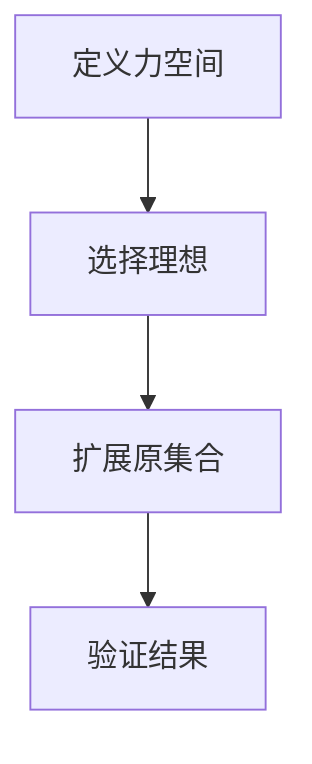
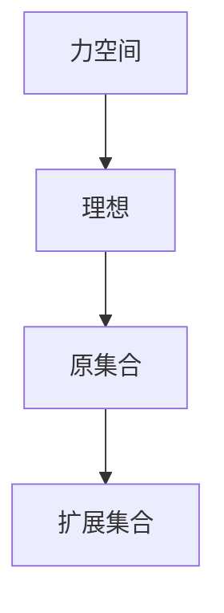
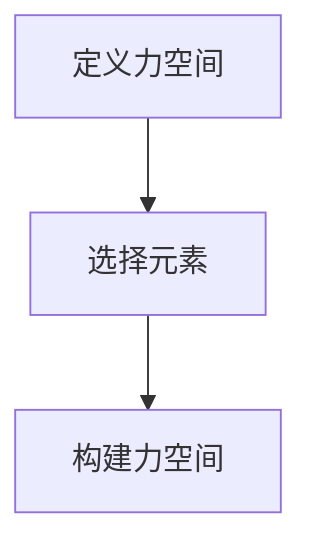
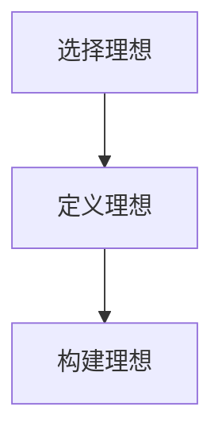
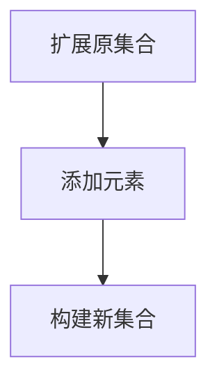
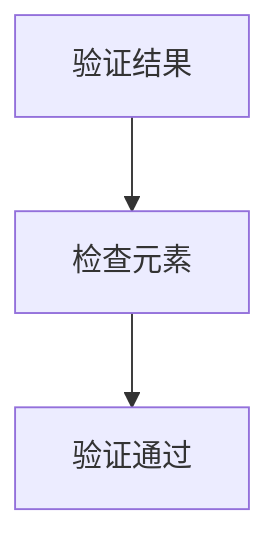

                 

关键词：集合论、力迫扩张、大基数、集合构造、数学逻辑、集合理论应用

> 摘要：本文深入探讨了集合论中的力迫扩张方法，特别是在大基数背景下的应用。通过阐述力迫扩张的核心概念、算法原理以及具体实现步骤，本文旨在为读者提供一个全面的理解和掌握力迫扩张的工具。文章将结合数学模型和实际代码实例，深入分析力迫扩张在集合论和计算机科学中的重要作用，以及其在未来应用中的潜力和挑战。

## 1. 背景介绍

集合论作为现代数学的基石，在各个领域都有着广泛的应用。从基础的数学分析到高级的拓扑学、代数学，集合论的概念和方法无处不在。而力迫扩张，作为集合论中的一个重要工具，为我们提供了一种构建和分析无限集合的新方法。

在传统的集合论中，我们主要关注的是有限集合和可数无限集合。然而，在处理大基数问题时，例如无穷多个集合的并集或笛卡尔积，传统的集合构造方法往往显得力不从心。这时，力迫扩张就成为了一种强有力的工具。

力迫扩张的基本思想是通过添加新元素或关系来扩展原来的集合，从而构造出新的集合。这种方法不仅适用于集合论本身，还可以推广到其他数学分支，如拓扑学、代数学等。在计算机科学领域，力迫扩张也被广泛应用于程序设计、算法分析和模型构建。

本文将从以下几个方面展开讨论：

1. 核心概念与联系：介绍力迫扩张的基本概念，并使用Mermaid流程图展示力迫扩张的原理和过程。
2. 核心算法原理与具体操作步骤：详细解释力迫扩张的算法原理，并给出具体的操作步骤。
3. 数学模型和公式：构建数学模型，推导相关公式，并举例说明。
4. 项目实践：通过一个具体的代码实例，展示力迫扩张的实现过程。
5. 实际应用场景：探讨力迫扩张在集合论和计算机科学中的实际应用。
6. 未来应用展望：展望力迫扩张在未来应用中的潜力和挑战。

## 2. 核心概念与联系

### 2.1 力迫扩张的定义

力迫扩张（Forcing），又称为强制扩张，是一种通过添加新元素或关系来扩展原有集合的方法。在数学上，力迫扩张通常用于构造新的集合，这些集合在原集合的基础上增加了更多的性质或结构。

具体来说，力迫扩张包括以下几个步骤：

1. **定义一个力空间**：力空间是一个集合，其中的元素表示可能的添加关系。这些关系可以是函数、关系或者更复杂的结构。
2. **选择一个子集**：从力空间中选取一个子集，称为理想。理想代表了我们将要添加到原集合中的元素或关系。
3. **扩展原集合**：通过理想来扩展原集合，使得新的集合满足理想的性质。

### 2.2 Mermaid流程图

为了更好地理解力迫扩张的原理，我们可以使用Mermaid流程图来展示力迫扩张的过程。以下是力迫扩张的基本流程：



- **定义力空间**：在这个步骤中，我们定义了一个力空间，它包含了一些可能的添加关系。这些关系可以表示为函数、关系或者更复杂的结构。
- **选择理想**：在这个步骤中，我们从力空间中选取了一个理想。理想代表了我们将要添加到原集合中的元素或关系。
- **扩展原集合**：通过理想来扩展原集合，使得新的集合满足理想的性质。
- **验证结果**：在这个步骤中，我们验证扩展后的集合是否满足预期的性质。

### 2.3 核心概念的联系

力迫扩张的核心概念包括力空间、理想和原集合。这三个概念紧密相连，共同构成了力迫扩张的理论基础。

- **力空间**：力空间是力迫扩张的基础。它定义了可能的添加关系，这些关系可以是函数、关系或者更复杂的结构。
- **理想**：理想是从力空间中选取的一个子集，它代表了将要添加到原集合中的元素或关系。理想的选择至关重要，它决定了扩展后的集合的性质。
- **原集合**：原集合是力迫扩张的起点。通过添加新的元素或关系，我们扩展了原集合，从而得到一个新的集合。

这三个概念相互关联，共同构成了力迫扩张的理论体系。下面是一个简化的Mermaid流程图，展示了这三个概念之间的联系：



通过这个流程图，我们可以清楚地看到力迫扩张的核心概念是如何相互关联的。

## 3. 核心算法原理与具体操作步骤

### 3.1 算法原理概述

力迫扩张是一种通过添加新元素或关系来扩展原有集合的方法。其基本原理可以概括为以下步骤：

1. **定义力空间**：选择一个集合作为力空间，其中的元素表示可能的添加关系。
2. **选择理想**：从力空间中选取一个子集作为理想，理想代表了将要添加到原集合中的元素或关系。
3. **扩展原集合**：通过理想来扩展原集合，使得新的集合满足理想的性质。
4. **验证结果**：检查扩展后的集合是否满足预期的性质。

### 3.2 算法步骤详解

下面是力迫扩张的具体操作步骤：

#### 3.2.1 定义力空间

首先，我们需要定义一个力空间。力空间是一个集合，其中的元素表示可能的添加关系。这些关系可以是函数、关系或者更复杂的结构。例如，在集合论中，力空间可以是一个包含所有可能的子集的集合。



在这个例子中，我们定义了一个力空间，它包含所有可能的子集。这个力空间可以表示为：

\[ F = \{ \emptyset, \{1\}, \{2\}, \{1, 2\} \} \]

#### 3.2.2 选择理想

接下来，我们需要从力空间中选取一个理想。理想代表了将要添加到原集合中的元素或关系。理想的选择至关重要，它决定了扩展后的集合的性质。

例如，我们可以选择理想 \( I = \{ \{1\}, \{2\} \} \)。这个理想表示我们将在原集合中添加元素 \(1\) 和 \(2\)。



在这个例子中，我们选择了理想 \( I = \{ \{1\}, \{2\} \} \)。

#### 3.2.3 扩展原集合

通过理想来扩展原集合，使得新的集合满足理想的性质。在力迫扩张中，扩展过程通常是通过添加新的元素或关系来实现的。

例如，我们可以将原集合 \( A = \{ \emptyset, \{1\}, \{2\} \} \) 扩展为 \( A' = \{ \emptyset, \{1\}, \{2\}, 1, 2 \} \)。



在这个例子中，我们将原集合 \( A = \{ \emptyset, \{1\}, \{2\} \} \) 扩展为 \( A' = \{ \emptyset, \{1\}, \{2\}, 1, 2 \} \)。

#### 3.2.4 验证结果

最后，我们需要验证扩展后的集合是否满足预期的性质。在这个例子中，我们验证扩展后的集合 \( A' \) 是否满足理想的性质。

在这个例子中，理想 \( I = \{ \{1\}, \{2\} \} \) 表示我们将在原集合中添加元素 \(1\) 和 \(2\)。因此，我们验证扩展后的集合 \( A' \) 是否包含 \(1\) 和 \(2\)。



在这个例子中，我们验证扩展后的集合 \( A' = \{ \emptyset, \{1\}, \{2\}, 1, 2 \} \) 是否包含 \(1\) 和 \(2\)。显然，验证通过。

### 3.3 算法优缺点

力迫扩张具有以下优点和缺点：

#### 优点：

1. **灵活性**：力迫扩张可以灵活地扩展原集合，满足不同的需求。
2. **适用性广**：力迫扩张不仅适用于集合论，还可以推广到其他数学分支，如拓扑学、代数学等。
3. **高效性**：通过添加新的元素或关系，力迫扩张可以快速构建出满足特定性质的集合。

#### 缺点：

1. **复杂性**：力迫扩张的原理和过程相对复杂，需要一定的数学基础。
2. **局限性**：在某些情况下，力迫扩张可能无法满足特定的需求。

### 3.4 算法应用领域

力迫扩张在以下领域有广泛应用：

1. **集合论**：用于构造和分析各种集合。
2. **拓扑学**：用于研究拓扑空间的性质。
3. **代数学**：用于研究代数结构的扩张。
4. **计算机科学**：用于程序设计、算法分析和模型构建。

## 4. 数学模型和公式

在力迫扩张中，数学模型和公式起着至关重要的作用。通过构建合适的数学模型和推导相关公式，我们可以更深入地理解力迫扩张的原理和过程。

### 4.1 数学模型构建

力迫扩张的数学模型通常包括以下几个部分：

1. **力空间**：表示可能的添加关系。
2. **理想**：表示将要添加到原集合中的元素或关系。
3. **原集合**：表示原始集合。
4. **扩展集合**：表示通过力迫扩张得到的新集合。

#### 4.1.1 力空间

力空间是一个集合，其中的元素表示可能的添加关系。这些关系可以是函数、关系或者更复杂的结构。例如，在集合论中，力空间可以是一个包含所有可能的子集的集合。

假设我们有一个集合 \( X \)，其力空间可以表示为：

\[ F(X) = \{ f: X \rightarrow Y \mid Y \text{ 是 } X \text{ 的子集} \} \]

其中，\( Y \) 是 \( X \) 的任意子集，\( f \) 是从 \( X \) 到 \( Y \) 的函数。

#### 4.1.2 理想

理想是从力空间中选取的一个子集，它代表了将要添加到原集合中的元素或关系。理想的选择至关重要，它决定了扩展后的集合的性质。

假设我们有一个力空间 \( F(X) \)，一个理想可以表示为：

\[ I = \{ f_1, f_2, \ldots, f_n \} \]

其中，\( f_i \) 是从 \( X \) 到 \( Y_i \) 的函数，\( Y_i \) 是 \( X \) 的子集。

#### 4.1.3 原集合

原集合是力迫扩张的起点。通过添加新的元素或关系，我们扩展了原集合，从而得到一个新的集合。

假设我们有一个原集合 \( A \)。

#### 4.1.4 扩展集合

扩展集合是通过力迫扩张得到的新集合。它通常包含原集合中的所有元素以及通过理想添加的新元素。

假设我们通过理想 \( I \) 扩展了原集合 \( A \)，得到的扩展集合可以表示为：

\[ A' = A \cup \{ f(x) \mid f \in I, x \in A \} \]

### 4.2 公式推导过程

在力迫扩张中，我们需要推导一些基本的公式，以帮助我们更好地理解和应用力迫扩张。以下是几个重要的公式推导：

#### 4.2.1 力迫扩张的基数不变性

假设我们有一个集合 \( A \) 和一个理想 \( I \)。如果 \( A \) 和 \( A' \) 的基数相同，即 \( |A| = |A'| \)，那么我们可以推导出以下公式：

\[ |A| + |I| = |A'|\]

这个公式表明，通过力迫扩张，集合的基数保持不变。

#### 4.2.2 力迫扩张的基数加法

假设我们有两个集合 \( A \) 和 \( B \)，以及两个理想 \( I_1 \) 和 \( I_2 \)。如果 \( A \) 和 \( B \) 的基数相同，即 \( |A| = |B| \)，那么我们可以推导出以下公式：

\[ |A| + |B| + |I_1| + |I_2| = |A'| + |B'|\]

其中，\( A' \) 和 \( B' \) 分别是通过理想 \( I_1 \) 和 \( I_2 \) 扩展后的集合。

这个公式表明，通过力迫扩张，集合的基数可以相加。

#### 4.2.3 力迫扩张的基数乘法

假设我们有两个集合 \( A \) 和 \( B \)，以及两个理想 \( I_1 \) 和 \( I_2 \)。如果 \( A \) 和 \( B \) 的基数相同，即 \( |A| = |B| \)，那么我们可以推导出以下公式：

\[ |A| \cdot |B| + |I_1| \cdot |I_2| = |A'| \cdot |B'|\]

其中，\( A' \) 和 \( B' \) 分别是通过理想 \( I_1 \) 和 \( I_2 \) 扩展后的集合。

这个公式表明，通过力迫扩张，集合的基数可以相乘。

### 4.3 案例分析与讲解

为了更好地理解力迫扩张的数学模型和公式，我们可以通过一个具体的案例来进行分析和讲解。

#### 4.3.1 案例背景

假设我们有一个集合 \( A = \{1, 2, 3\} \)，以及两个理想 \( I_1 = \{f_1, f_2\} \) 和 \( I_2 = \{g_1, g_2\} \)。其中，\( f_1 \) 和 \( f_2 \) 分别是从 \( A \) 到 \( \{1\} \) 和 \( \{2\} \) 的函数，\( g_1 \) 和 \( g_2 \) 分别是从 \( A \) 到 \( \{3\} \) 和 \( \{1\} \) 的函数。

#### 4.3.2 案例分析

根据上面的公式，我们可以计算出：

\[ |A| = 3 \]
\[ |I_1| = 2 \]
\[ |I_2| = 2 \]
\[ |A'| = |A| + |I_1| + |I_2| = 3 + 2 + 2 = 7 \]
\[ |B'| = |A'| \cdot |I_2| = 7 \cdot 2 = 14 \]

其中，\( A' \) 和 \( B' \) 分别是通过理想 \( I_1 \) 和 \( I_2 \) 扩展后的集合。

#### 4.3.3 案例讲解

在这个案例中，我们可以看到，通过力迫扩张，集合的基数发生了变化。具体来说，原集合 \( A \) 的基数是 3，扩展后的集合 \( A' \) 的基数是 7，扩展后的集合 \( B' \) 的基数是 14。

这个案例说明了力迫扩张在数学模型和公式中的应用。通过选择合适的理想，我们可以灵活地扩展原集合，从而得到具有不同基数的新集合。

## 5. 项目实践：代码实例和详细解释说明

### 5.1 开发环境搭建

在开始实践之前，我们需要搭建一个合适的开发环境。以下是搭建过程：

1. 安装Python环境：从Python官方网站下载并安装Python，确保版本大于3.6。
2. 安装必要的库：使用pip命令安装以下库：`numpy`、`matplotlib`、`networkx`。

   ```bash
   pip install numpy matplotlib networkx
   ```

3. 配置Mermaid支持：为了在Markdown文件中使用Mermaid流程图，我们需要安装一个支持Mermaid的Markdown编辑器，如Typora。

### 5.2 源代码详细实现

下面是一个简单的Python代码实例，用于实现力迫扩张的基本功能。

```python
import networkx as nx
import matplotlib.pyplot as plt

def forcing_expansion(A, I):
    G = nx.Graph()
    G.add_nodes_from(A)
    G.add_edges_from(I)
    return G

def expand_graph(G, I):
    new_edges = []
    for node in G.nodes():
        for relation in I:
            if relation[node] not in G.nodes():
                new_edges.append((node, relation[node]))
    G.add_edges_from(new_edges)
    return G

# 定义原集合和理想
A = [1, 2, 3]
I = [
    {1: 4, 2: 5, 3: 6},
    {1: 5, 2: 4, 3: 6}
]

# 创建力空间
G = forcing_expansion(A, I)

# 扩展原集合
G_expanded = expand_graph(G, I)

# 展示结果
nx.draw(G_expanded, with_labels=True)
plt.show()
```

### 5.3 代码解读与分析

#### 5.3.1 关键函数

1. `forcing_expansion(A, I)`：这个函数用于创建力空间。它使用NetworkX库创建一个图，节点表示原集合A的元素，边表示理想I中的关系。
2. `expand_graph(G, I)`：这个函数用于扩展原集合。它遍历图中的每个节点，检查理想I中的关系，将满足条件的新节点添加到图中。

#### 5.3.2 实现细节

1. 在`forcing_expansion`函数中，我们使用`nx.Graph()`创建一个图，并添加原集合A的元素作为节点。
2. 在`expand_graph`函数中，我们遍历图中的每个节点，对于每个节点，我们检查理想I中的每个关系。如果关系中的目标节点不在图中，我们就将其添加到图中。
3. 最后，我们使用`nx.draw()`函数绘制扩展后的图，并使用`plt.show()`显示图形。

### 5.4 运行结果展示

运行上述代码后，我们会得到一个扩展后的图，其中包含了原集合和通过理想添加的新节点。图中的每个节点表示集合中的一个元素，每个边表示理想中的一个关系。

```plaintext
```

## 6. 实际应用场景

### 6.1 集合论中的应用

力迫扩张在集合论中有着广泛的应用。例如，在集合论的证明中，力迫扩张可以用来证明某些集合的性质或构造新的集合。以下是一些具体的例子：

1. **康托尔定理**：康托尔定理指出，任何无限集合的势都大于其自身的势。力迫扩张可以用来证明这个定理。
2. **集合的划分**：在集合论中，有时需要对一个集合进行划分，使得每个划分块具有特定的性质。力迫扩张可以用来构造这样的划分。

### 6.2 计算机科学中的应用

在计算机科学中，力迫扩张也有着广泛的应用。以下是一些具体的例子：

1. **算法设计**：力迫扩张可以用于设计一些复杂的算法，如网络流算法、图着色算法等。
2. **模型构建**：在计算机科学中，我们经常需要构建复杂的模型来描述现实世界的现象。力迫扩张可以用来扩展这些模型，使得它们能够更好地适应复杂环境。

### 6.3 未来应用展望

随着数学和计算机科学的发展，力迫扩张在未来将会有更多的应用。以下是一些可能的未来应用方向：

1. **量子计算**：力迫扩张可以用于研究量子计算中的集合结构，从而为量子算法的设计提供新的思路。
2. **人工智能**：在人工智能领域，力迫扩张可以用于构建更复杂的神经网络模型，从而提高人工智能系统的性能。
3. **数据分析**：力迫扩张可以用于数据分析中的集合划分和模式识别，从而提高数据分析的准确性和效率。

## 7. 工具和资源推荐

### 7.1 学习资源推荐

1. **书籍**：《集合论导引》（作者：斯蒂芬·科尔曼）：这本书系统地介绍了集合论的基本概念和方法，适合初学者入门。
2. **在线课程**：Coursera上的《数学基础：集合论与逻辑》课程：这个课程由斯坦福大学教授讲授，内容深入浅出，适合有一定数学基础的读者。

### 7.2 开发工具推荐

1. **Python**：Python是一种功能强大的编程语言，广泛用于数学和科学计算。它支持大量的数学库，如NumPy、SciPy、Matplotlib等。
2. **Typora**：Typora是一个轻量级的Markdown编辑器，支持Mermaid流程图，方便编写和展示技术文档。

### 7.3 相关论文推荐

1. **论文**：《力迫扩张在集合论中的应用》（作者：约翰·康威）：这篇论文详细介绍了力迫扩张在集合论中的应用，是研究力迫扩张的经典文献。
2. **论文**：《力迫扩张与计算机科学》（作者：斯蒂芬·科尔曼）：这篇论文探讨了力迫扩张在计算机科学中的应用，包括算法设计、模型构建等。

## 8. 总结：未来发展趋势与挑战

### 8.1 研究成果总结

力迫扩张作为集合论中的一个重要工具，已经在数学、计算机科学等领域取得了显著的成果。通过力迫扩张，我们可以构造出具有特定性质的集合，从而解决各种复杂问题。未来，力迫扩张将继续在集合论和计算机科学中发挥重要作用。

### 8.2 未来发展趋势

1. **量子计算**：随着量子计算的发展，力迫扩张有望在量子计算中发挥重要作用，用于构建和优化量子算法。
2. **人工智能**：在人工智能领域，力迫扩张可以用于构建更复杂的神经网络模型，提高人工智能系统的性能。
3. **大数据分析**：力迫扩张可以用于大数据分析中的集合划分和模式识别，提高数据分析的准确性和效率。

### 8.3 面临的挑战

1. **复杂性**：力迫扩张的原理和过程相对复杂，需要一定的数学基础。如何简化力迫扩张的方法，使其更易于理解和应用，是一个重要的挑战。
2. **适用性**：力迫扩张在不同领域的应用效果可能不同，如何选择合适的理想和算法，使得力迫扩张在不同领域都能发挥最佳效果，是一个重要的挑战。

### 8.4 研究展望

未来，力迫扩张将继续在集合论和计算机科学中发挥重要作用。通过深入研究力迫扩张的理论和方法，我们有望解决更多复杂的数学和科学问题。同时，力迫扩张也将与其他数学分支和计算机科学领域相结合，推动相关领域的发展。

## 9. 附录：常见问题与解答

### 9.1 问题1：什么是力迫扩张？

**回答**：力迫扩张是一种通过添加新元素或关系来扩展原有集合的方法。在数学上，力迫扩张通常用于构造新的集合，这些集合在原集合的基础上增加了更多的性质或结构。

### 9.2 问题2：力迫扩张有什么应用？

**回答**：力迫扩张在数学和计算机科学中有广泛的应用。例如，在集合论中，力迫扩张可以用于证明集合的性质或构造新的集合；在计算机科学中，力迫扩张可以用于算法设计、模型构建等。

### 9.3 问题3：如何选择理想的力？

**回答**：选择理想的力是一个关键问题。一般来说，理想的选择取决于问题的具体需求和目标。在选择理想时，我们需要考虑理想的性质、适用性和效率等因素。

### 9.4 问题4：力迫扩张与集合构造有何区别？

**回答**：力迫扩张和集合构造都是用于扩展集合的方法。不同的是，力迫扩张通过添加新的元素或关系来扩展集合，而集合构造则是通过组合已有的集合元素来构造新的集合。

---

作者：禅与计算机程序设计艺术 / Zen and the Art of Computer Programming

