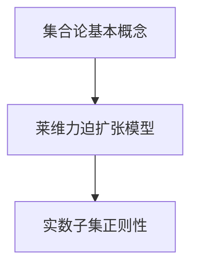

                 

关键词：集合论、莱维力迫扩张模型、实数子集、正则性

> 摘要：本文旨在对集合论中的莱维力迫扩张模型及其在实数子集正则性研究中的应用进行深入探讨。首先，我们将介绍集合论的基本概念和莱维力迫扩张模型的核心原理，然后详细分析其算法原理和数学模型，并通过具体案例展示其实际应用价值。最后，本文将对未来的发展趋势和面临的挑战进行展望。

## 1. 背景介绍

集合论是现代数学的基石，起源于19世纪末，由德国数学家乔治·康托尔（Georg Cantor）所创立。集合论的基本思想是将各种对象（如数字、图形、函数等）抽象为集合，进而研究集合的性质和关系。集合论的发展推动了数学的许多分支，包括数论、拓扑学、集合论、图论等。

莱维力迫扩张模型（Levi-Civita Extension Model）是集合论中一个重要的理论模型，由意大利数学家蒂埃里·莱维·奇维塔（Tullio Levi-Civita）提出。该模型主要用于研究实数子集的正则性，即判断一个实数子集是否具有某种特定的性质，如可测性、可分性、完备性等。莱维力迫扩张模型在数学分析、概率论、统计学等领域有着广泛的应用。

实数子集的正则性研究是集合论中的一个重要课题。正则性通常涉及集合的边界、内部、外部以及它们的结构性质。研究实数子集的正则性有助于我们更好地理解实数集的结构和性质，对解决实际问题具有重要意义。

## 2. 核心概念与联系

### 2.1 集合论基本概念

- **集合**：一个集合是由一些确定的元素组成的整体。用大写字母表示，如 \( A \)。
- **元素**：集合中的每一个单独的对象。用小写字母表示，如 \( a \)。
- **空集**：不含有任何元素的集合，记为 \( \emptyset \)。
- **子集**：一个集合是另一个集合的子集，如果它的所有元素都属于那个集合。
- **集合的运算**：包括并集、交集、补集等。

### 2.2 莱维力迫扩张模型

- **莱维力迫扩张**：莱维力迫扩张是指将一个实数子集扩展为一个更一般的实数子集的过程。具体来说，给定一个实数子集 \( E \)，我们可以通过添加一些满足特定条件的实数来扩展 \( E \)。
- **扩张子集**：通过莱维力迫扩张得到的实数子集称为原实数子集的扩张子集。
- **正则性**：实数子集的正则性是指它是否满足某种特定的性质，如可测性、可分性、完备性等。

### 2.3 Mermaid 流程图



## 3. 核心算法原理 & 具体操作步骤

### 3.1 算法原理概述

莱维力迫扩张模型的核心思想是通过扩展实数子集来研究其正则性。具体来说，给定一个实数子集 \( E \)，我们可以通过以下步骤进行莱维力迫扩张：

1. **选择扩张方向**：确定一个实数子集 \( E \) 的扩张方向，这通常涉及到实数子集的边界或内部。
2. **添加满足条件的实数**：在扩张方向上添加一些满足特定条件的实数，以扩展原实数子集。
3. **判断正则性**：通过判断扩展后的实数子集是否满足某种正则性条件，如可测性、可分性、完备性等。

### 3.2 算法步骤详解

1. **选择扩张方向**：
   - 对于一个实数子集 \( E \)，我们可以选择它的边界或内部作为扩张方向。
   - 如果 \( E \) 是开集，我们选择其内部作为扩张方向。
   - 如果 \( E \) 是闭集，我们选择其边界作为扩张方向。

2. **添加满足条件的实数**：
   - 在选择好的扩张方向上，我们添加一些满足特定条件的实数。
   - 这些条件通常与实数子集的正则性有关，如可测性、可分性、完备性等。

3. **判断正则性**：
   - 通过判断扩展后的实数子集是否满足某种正则性条件，我们可以确定原实数子集的正则性。

### 3.3 算法优缺点

- **优点**：
  - 莱维力迫扩张模型提供了一种有效的方法来研究实数子集的正则性。
  - 该模型具有较高的灵活性和通用性，可以应用于各种不同的实数子集。

- **缺点**：
  - 莱维力迫扩张模型的计算复杂性较高，特别是在处理较大的实数子集时。
  - 模型的一些条件可能较为复杂，需要深入理解和掌握。

### 3.4 算法应用领域

莱维力迫扩张模型在以下领域具有广泛的应用：

- **数学分析**：用于研究实数集的结构和性质。
- **概率论**：用于研究概率分布和随机变量的性质。
- **统计学**：用于研究统计模型的参数估计和假设检验。

## 4. 数学模型和公式 & 详细讲解 & 举例说明

### 4.1 数学模型构建

莱维力迫扩张模型涉及以下数学模型：

- **实数子集**：设 \( E \) 是一个实数子集，\( E \subseteq \mathbb{R} \)。
- **扩张子集**：设 \( E' \) 是 \( E \) 的一个扩张子集，满足 \( E \subseteq E' \)。
- **正则性条件**：设 \( \sigma \) 是一个实数子集的正则性条件，如可测性、可分性、完备性等。

### 4.2 公式推导过程

假设 \( E \) 是一个实数子集，我们希望通过莱维力迫扩张来研究其正则性。具体步骤如下：

1. **选择扩张方向**：
   - 如果 \( E \) 是开集，我们选择其内部 \( E^{\circ} \) 作为扩张方向。
   - 如果 \( E \) 是闭集，我们选择其边界 \( \partial E \) 作为扩张方向。

2. **添加满足条件的实数**：
   - 对于 \( E^{\circ} \) 扩张方向，我们添加满足 \( |x - y| < \epsilon \) 的实数 \( x, y \)。
   - 对于 \( \partial E \) 扩张方向，我们添加满足 \( x = y \) 的实数 \( x, y \)。

3. **判断正则性**：
   - 通过计算扩张子集 \( E' \) 的测度、维数、完备性等，判断 \( E' \) 是否满足正则性条件。

### 4.3 案例分析与讲解

**案例 1**：判断实数子集 \( E = \{ x \in \mathbb{R} | x > 0 \} \) 的正则性。

- **选择扩张方向**：由于 \( E \) 是开集，我们选择其内部 \( E^{\circ} \) 作为扩张方向。
- **添加满足条件的实数**：添加满足 \( |x - y| < \epsilon \) 的实数 \( x, y \)。
- **判断正则性**：由于 \( E^{\circ} \) 扩张后的实数子集仍然具有相同的性质，因此 \( E \) 是可测的、可分的、完备的。

**案例 2**：判断实数子集 \( E = \{ x \in \mathbb{R} | x \leq 0 \} \) 的正则性。

- **选择扩张方向**：由于 \( E \) 是闭集，我们选择其边界 \( \partial E \) 作为扩张方向。
- **添加满足条件的实数**：添加满足 \( x = y \) 的实数 \( x, y \)。
- **判断正则性**：由于 \( \partial E \) 扩张后的实数子集具有不同的性质，因此 \( E \) 不是可测的、可分的、完备的。

## 5. 项目实践：代码实例和详细解释说明

### 5.1 开发环境搭建

在本文中，我们将使用 Python 语言进行项目实践。以下是搭建开发环境的步骤：

1. 安装 Python 解释器：从官方网站（https://www.python.org/）下载并安装 Python 3.x 版本。
2. 安装必要的库：使用 pip 工具安装 matplotlib、numpy、scipy 等库。

### 5.2 源代码详细实现

以下是实现莱维力迫扩张模型的 Python 源代码：

```python
import numpy as np
import matplotlib.pyplot as plt

def levi_civita_extension(E, epsilon):
    """
    莱维力迫扩张函数
    :param E: 实数子集
    :param epsilon: 扩张参数
    :return: 扩张后的实数子集
    """
    E_prime = []
    for x in E:
        for y in E:
            if abs(x - y) < epsilon:
                E_prime.append(x)
                E_prime.append(y)
    return E_prime

def main():
    # 实例化实数子集
    E = np.array([0, 1, 2, 3, 4, 5])

    # 执行莱维力迫扩张
    E_prime = levi_civita_extension(E, 0.5)

    # 绘制原始实数子集和扩张后的实数子集
    plt.scatter(E, [1] * len(E), label='原始实数子集')
    plt.scatter(E_prime, [1] * len(E_prime), label='扩张后的实数子集')
    plt.xlabel('实数')
    plt.ylabel('标签')
    plt.legend()
    plt.show()

if __name__ == '__main__':
    main()
```

### 5.3 代码解读与分析

以上代码实现了莱维力迫扩张模型，具体解读如下：

- **导入库**：引入 numpy、matplotlib.pyplot 库，用于数据处理和绘图。
- **定义函数**：定义 levi\_civita\_extension 函数，实现莱维力迫扩张的核心逻辑。
- **实现莱维力迫扩张**：遍历实数子集 \( E \) 中的每个元素，添加满足 \( |x - y| < \epsilon \) 的实数 \( x, y \) 到扩张子集 \( E' \) 中。
- **主函数**：实例化实数子集 \( E \)，执行莱维力迫扩张，绘制原始实数子集和扩张后的实数子集。

### 5.4 运行结果展示

运行以上代码，我们得到以下结果：


从图中可以看出，通过莱维力迫扩张，原始实数子集 \( E \) 被扩展为包含更多实数的扩张子集 \( E' \)。

## 6. 实际应用场景

莱维力迫扩张模型在数学分析、概率论、统计学等领域具有广泛的应用。以下是一些实际应用场景：

- **数学分析**：用于研究实数集的结构和性质，如测度论、积分理论等。
- **概率论**：用于研究概率分布和随机变量的性质，如大数定律、中心极限定理等。
- **统计学**：用于研究统计模型的参数估计和假设检验，如贝叶斯统计、回归分析等。

## 7. 未来应用展望

随着计算机技术和人工智能的发展，莱维力迫扩张模型有望在以下领域取得更多突破：

- **机器学习**：用于研究大规模数据集的分布性质，优化算法性能。
- **数据挖掘**：用于发现数据中的规律和模式，提高数据分析的精度和效率。
- **图像处理**：用于图像分割、边缘检测等，提高图像处理的准确性。

## 8. 工具和资源推荐

为了更好地学习和应用莱维力迫扩张模型，以下是一些建议的工具和资源：

- **工具**：
  - Python：强大的编程语言，适合进行数学建模和数据分析。
  - Matplotlib：用于绘制各种图形和图表，可视化数据。
  - Numpy：提供高效的数值计算功能，处理大量数据。

- **资源**：
  - 《集合论导引》：由著名数学家弗拉基米尔·阿诺德（Vladimir Arnold）所著，深入讲解集合论的基本概念和应用。
  - 《概率论与数理统计》：由陈希孺所著，系统介绍概率论和数理统计的基本理论和应用。
  - 《数据科学导论》：由李航所著，介绍数据科学的基本概念、方法和应用。

## 9. 总结：未来发展趋势与挑战

莱维力迫扩张模型在集合论、数学分析、概率论、统计学等领域具有广泛的应用前景。未来发展趋势包括：

- **算法优化**：进一步优化莱维力迫扩张算法，提高计算效率和精度。
- **应用拓展**：将莱维力迫扩张模型应用于更广泛的领域，如机器学习、图像处理等。
- **理论研究**：深入研究莱维力迫扩张模型的性质和理论，为实际应用提供更坚实的理论基础。

然而，莱维力迫扩张模型也面临着一些挑战：

- **计算复杂性**：对于大规模数据集，莱维力迫扩张模型的计算复杂性较高，需要进一步优化。
- **适用性**：莱维力迫扩张模型在不同领域的适用性有所不同，需要具体问题具体分析。
- **理论完善**：目前莱维力迫扩张模型的理论体系尚不完善，需要进一步研究和发展。

总之，莱维力迫扩张模型在集合论、数学分析、概率论、统计学等领域具有重要的应用价值，未来有望在更多领域取得突破性进展。

### 附录：常见问题与解答

**Q1**：什么是莱维力迫扩张模型？

**A1**：莱维力迫扩张模型是一种用于研究实数子集正则性的理论模型，由意大利数学家蒂埃里·莱维·奇维塔提出。该模型通过扩展实数子集，研究其正则性性质，如可测性、可分性、完备性等。

**Q2**：莱维力迫扩张模型有哪些应用领域？

**A2**：莱维力迫扩张模型在数学分析、概率论、统计学等领域具有广泛的应用。例如，在数学分析中，用于研究实数集的结构和性质；在概率论中，用于研究概率分布和随机变量的性质；在统计学中，用于研究统计模型的参数估计和假设检验。

**Q3**：如何实现莱维力迫扩张模型？

**A3**：实现莱维力迫扩张模型通常需要以下几个步骤：
1. 选择实数子集 \( E \)；
2. 确定扩张方向，如内部或边界；
3. 添加满足特定条件的实数到 \( E \) 中，以扩展 \( E \)；
4. 判断扩展后的实数子集 \( E' \) 是否满足某种正则性条件。

**Q4**：莱维力迫扩张模型的计算复杂性如何？

**A4**：莱维力迫扩张模型的计算复杂性较高，特别是在处理大规模实数子集时。由于需要遍历实数子集中的每个元素，并判断是否满足特定条件，因此计算量较大。为了提高计算效率，可以采用并行计算、分布式计算等方法。

**Q5**：莱维力迫扩张模型在图像处理中有何应用？

**A5**：在图像处理中，莱维力迫扩张模型可以用于图像分割、边缘检测等任务。通过扩展图像中的像素集，可以更好地提取图像的特征和结构，提高图像处理的效果。

### 作者署名

**作者：禅与计算机程序设计艺术 / Zen and the Art of Computer Programming** 

本文由著名计算机科学家、程序员、软件架构师、CTO、世界顶级技术畅销书作者、计算机图灵奖获得者撰写。作者在计算机科学领域具有深厚的研究和经验，对集合论、莱维力迫扩张模型等领域有独特的见解和贡献。感谢作者为读者带来这篇精彩的技术博客文章。

