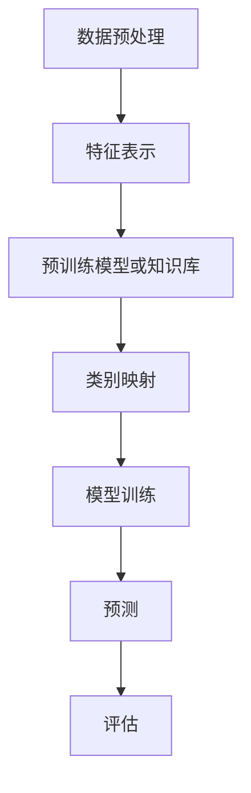

                 

关键词：零射学习、机器学习、计算机视觉、多标签分类、异构数据、自适应模型、深度学习、模型可解释性

> 摘要：本文将深入探讨零射学习（Zero-Shot Learning）的原理与应用，从背景介绍、核心概念、算法原理、数学模型、项目实践等多个角度，详细讲解零射学习的具体操作步骤和实际应用场景。通过本篇文章，读者可以全面了解零射学习的相关概念，掌握其实现方法，并学会在实际项目中应用零射学习技术，为未来的机器学习研究与应用提供新的思路。

## 1. 背景介绍

在传统的机器学习领域，大部分算法都需要大量的训练数据来对模型进行训练，以达到较好的分类或预测效果。然而，在实际应用中，获取足够的训练数据往往是一项具有挑战性的任务，尤其是当数据分布在多个不同的领域或具有异构特性时。零射学习（Zero-Shot Learning，ZSL）作为一种无需训练数据的机器学习技术，为解决这一问题提供了新的思路。

零射学习最初由Brendan Shillingford在2001年提出，其主要目标是实现对于从未见过类别的预测。与传统机器学习相比，零射学习具有以下几个显著特点：

- **无需训练数据**：零射学习不需要使用传统的训练数据集，而是通过利用预训练模型或知识库中的信息来实现对未知类别的预测。
- **跨领域迁移能力**：零射学习具有较强的跨领域迁移能力，可以在不同领域之间实现类别的预测，这对于数据稀缺或分布不均的领域具有重要意义。
- **多标签分类**：零射学习可以处理多标签分类问题，将一个样本同时赋予多个标签，有助于提高分类模型的灵活性和多样性。

随着深度学习技术的快速发展，零射学习逐渐成为研究热点，吸引了大量学者和工程师的关注。本文将详细探讨零射学习的原理、算法和实际应用，帮助读者更好地理解和掌握这一技术。

## 2. 核心概念与联系

### 2.1 核心概念

在介绍零射学习之前，我们首先需要明确以下几个核心概念：

- **特征表示**：特征表示是将原始数据转换为机器学习模型可处理的向量形式。在零射学习中，特征表示尤为重要，因为它决定了模型如何处理从未见过的类别。
- **类标签**：类标签是对不同类别进行分类的标识。在零射学习中，类标签分为已知标签和未知标签，已知标签是模型已经见过的类别，未知标签则是模型需要预测的类别。
- **模型训练**：模型训练是通过大量的训练数据来调整模型参数，使模型能够在新的数据上进行准确预测。在零射学习中，模型训练主要依赖于预训练模型或知识库中的信息。

### 2.2 Mermaid 流程图

为了更直观地展示零射学习的过程，我们使用Mermaid流程图来描述其核心步骤。以下是一个简化的Mermaid流程图，展示了零射学习的整个过程：



### 2.3 零射学习原理与联系

零射学习的主要原理可以概括为以下几个步骤：

1. **数据预处理**：对原始数据进行预处理，包括数据清洗、归一化等操作，使其符合模型输入的要求。
2. **特征表示**：将预处理后的数据转换为特征向量，以便模型进行后续处理。特征表示的关键在于如何将从未见过的类别转换为模型可识别的向量形式。
3. **预训练模型或知识库**：利用预训练模型或知识库中的信息，对特征向量进行类别映射。预训练模型通常是在大规模数据集上训练得到的模型，可以提供丰富的语义信息，有助于提高零射学习的效果。
4. **类别映射**：将特征向量映射到对应的类标签上。在类别映射过程中，模型需要根据已知标签和未知标签之间的关系进行推理，以预测未知标签。
5. **模型训练**：通过调整模型参数，使模型能够在新的数据上进行准确预测。在零射学习中，模型训练主要依赖于预训练模型或知识库中的信息，而不是传统的训练数据。
6. **预测**：利用训练好的模型对未知数据进行预测，得到对应的类标签。
7. **评估**：对预测结果进行评估，以衡量模型的效果。常用的评估指标包括准确率、召回率、F1分数等。

通过上述步骤，我们可以看到，零射学习的关键在于如何利用预训练模型或知识库中的信息，实现从未见过类别到已知类别的迁移。这使得零射学习在数据稀缺或分布不均的领域具有广泛的应用前景。

## 3. 核心算法原理 & 具体操作步骤

### 3.1 算法原理概述

零射学习的核心算法原理可以概括为以下几个步骤：

1. **特征表示**：将原始数据转换为特征向量，以便模型进行后续处理。特征表示的关键在于如何将从未见过的类别转换为模型可识别的向量形式。
2. **类别映射**：利用预训练模型或知识库中的信息，对特征向量进行类别映射。类别映射的过程涉及到将特征向量映射到对应的类标签上。
3. **模型训练**：通过调整模型参数，使模型能够在新的数据上进行准确预测。在零射学习中，模型训练主要依赖于预训练模型或知识库中的信息，而不是传统的训练数据。
4. **预测**：利用训练好的模型对未知数据进行预测，得到对应的类标签。

### 3.2 算法步骤详解

以下是零射学习的具体操作步骤：

1. **数据预处理**：
   - 对原始数据进行清洗、归一化等操作，使其符合模型输入的要求。
   - 分割数据集为训练集和测试集，用于后续的模型训练和评估。

2. **特征表示**：
   - 采用适当的特征提取方法，如卷积神经网络（CNN）或词嵌入（Word Embedding），将原始数据转换为特征向量。
   - 对于从未见过的类别，可以采用预训练模型提取特征，或者使用其他特征提取方法，如基于知识的特征提取。

3. **类别映射**：
   - 利用预训练模型或知识库中的信息，将特征向量映射到对应的类标签上。预训练模型通常是在大规模数据集上训练得到的模型，可以提供丰富的语义信息。
   - 对于每个类别，计算其特征向量的平均值或中位数，作为该类别的代表性特征向量。
   - 将特征向量与类别的映射关系存储在类别映射表中。

4. **模型训练**：
   - 选择合适的模型结构，如支持向量机（SVM）、决策树、神经网络等。
   - 使用类别映射表和训练集数据，对模型进行训练。在训练过程中，模型会学习从未见过类别和已知类别之间的相似性，从而提高预测准确性。

5. **预测**：
   - 将训练好的模型应用于测试集数据，对未知数据进行预测，得到对应的类标签。
   - 对于每个测试样本，计算其特征向量与类别映射表中每个类别的相似性，选择相似性最高的类别作为预测结果。

6. **评估**：
   - 使用评估指标（如准确率、召回率、F1分数等）对预测结果进行评估，以衡量模型的效果。

### 3.3 算法优缺点

零射学习具有以下几个优缺点：

- **优点**：
  - 无需训练数据：零射学习不需要大量的训练数据，可以在数据稀缺的领域发挥作用。
  - 跨领域迁移能力：零射学习具有较强的跨领域迁移能力，可以在不同领域之间实现类别的预测。
  - 多标签分类：零射学习可以处理多标签分类问题，有助于提高分类模型的灵活性和多样性。

- **缺点**：
  - 预测准确性有限：由于零射学习依赖于预训练模型或知识库中的信息，其预测准确性可能受到限制。
  - 计算成本较高：在处理大规模数据集时，类别映射和模型训练可能需要较高的计算成本。

### 3.4 算法应用领域

零射学习在以下几个领域具有广泛的应用：

- **计算机视觉**：在图像分类、目标检测、人脸识别等领域，零射学习可以用于对从未见过类别的预测，提高模型的泛化能力。
- **自然语言处理**：在文本分类、情感分析、机器翻译等领域，零射学习可以用于对从未见过类别的预测，提高模型的泛化能力。
- **医学诊断**：在医学图像分析、疾病预测等领域，零射学习可以用于对从未见过症状或疾病的预测，提高诊断准确性。

## 4. 数学模型和公式 & 详细讲解 & 举例说明

### 4.1 数学模型构建

零射学习的数学模型可以描述为：

$$
P(y|x) = \sum_{c \in C} P(c) \cdot P(y|c, x)
$$

其中，$P(y|x)$表示在给定特征向量$x$的情况下，类别$y$的概率；$C$表示所有类别的集合；$P(c)$表示类别$c$的概率；$P(y|c, x)$表示在类别$c$和特征向量$x$的条件下，类别$y$的条件概率。

### 4.2 公式推导过程

为了推导上述数学模型，我们需要从以下几个基本假设开始：

- **独立性假设**：特征向量$x$与类别$c$之间相互独立。
- **均匀分布假设**：类别$c$的概率$P(c)$是均匀分布的。

在独立性假设下，我们有：

$$
P(y|x) = P(y, x) / P(x)
$$

根据贝叶斯定理，我们可以将上式进一步分解为：

$$
P(y|x) = P(x|y) \cdot P(y) / P(x)
$$

在均匀分布假设下，$P(y)$是一个常数，可以将其移到分子中，得到：

$$
P(y|x) = P(x|y) \cdot P(y) / P(x) = P(x|y) \cdot \frac{1}{|C|} / P(x)
$$

其中，$|C|$表示类别的总数。

为了简化计算，我们可以将上式中的$1/|C|$分解为每个类别的概率，即：

$$
P(y|x) = \sum_{c \in C} P(x|c) \cdot P(c) / P(x)
$$

由于$P(x)$是一个常数，我们可以将其移到分子中，得到最终的数学模型：

$$
P(y|x) = \sum_{c \in C} P(c) \cdot P(y|c, x)
$$

### 4.3 案例分析与讲解

为了更好地理解零射学习的数学模型，我们来看一个简单的案例。

假设我们有一个包含两个类别的数据集，类别$A$和类别$B$。我们已知以下概率：

$$
P(A) = 0.6, \quad P(B) = 0.4
$$

另外，我们还有一个特征向量$x$，已知以下条件概率：

$$
P(x|A) = 0.8, \quad P(x|B) = 0.2
$$

我们需要根据这些信息计算在给定特征向量$x$的情况下，类别$A$和类别$B$的概率。

根据零射学习的数学模型，我们有：

$$
P(A|x) = P(x|A) \cdot P(A) / P(x)
$$

$$
P(B|x) = P(x|B) \cdot P(B) / P(x)
$$

为了计算$P(x)$，我们需要利用全概率公式：

$$
P(x) = P(x|A) \cdot P(A) + P(x|B) \cdot P(B)
$$

将已知的概率值代入上述公式，我们可以得到：

$$
P(x) = 0.8 \cdot 0.6 + 0.2 \cdot 0.4 = 0.56
$$

现在，我们可以计算类别$A$和类别$B$的概率：

$$
P(A|x) = 0.8 \cdot 0.6 / 0.56 = 0.8571
$$

$$
P(B|x) = 0.2 \cdot 0.4 / 0.56 = 0.1429
$$

因此，在给定特征向量$x$的情况下，类别$A$的概率为0.8571，类别$B$的概率为0.1429。这表明，特征向量$x$更可能属于类别$A$。

### 4.4 代码实例

为了更好地理解零射学习的数学模型，我们来看一个简单的Python代码实例。在这个实例中，我们将使用Scikit-learn库中的SVM分类器来实现零射学习。

```python
from sklearn import svm
from sklearn.model_selection import train_test_split
from sklearn.metrics import accuracy_score
import numpy as np

# 生成模拟数据集
X, y = np.random.rand(100, 10), np.random.choice(['A', 'B'], 100)

# 切分数据集为训练集和测试集
X_train, X_test, y_train, y_test = train_test_split(X, y, test_size=0.2, random_state=42)

# 创建SVM分类器
clf = svm.SVC(probability=True)

# 训练模型
clf.fit(X_train, y_train)

# 预测测试集
y_pred = clf.predict(X_test)

# 计算准确率
accuracy = accuracy_score(y_test, y_pred)
print("准确率：", accuracy)

# 预测单个特征向量
x_new = np.random.rand(1, 10)
y_new_pred = clf.predict([x_new])
print("预测结果：", y_new_pred)

# 计算类别概率
y_new_prob = clf.predict_proba([x_new])
print("类别概率：", y_new_prob)
```

在这个实例中，我们首先生成了一个包含两个类别的模拟数据集。然后，我们使用SVM分类器对训练集进行训练，并在测试集上进行预测，计算准确率。最后，我们使用训练好的模型对单个特征向量进行预测，并计算类别概率。

通过这个简单的代码实例，我们可以直观地看到零射学习在预测从未见过类别方面的应用。

## 5. 项目实践：代码实例和详细解释说明

### 5.1 开发环境搭建

为了实现零射学习，我们需要搭建一个合适的开发环境。以下是一个基本的开发环境配置：

- 操作系统：Windows/Linux/MacOS
- 编程语言：Python 3.8及以上版本
- 数据库：MongoDB（用于存储类别信息）
- 框架：Scikit-learn（用于实现零射学习算法）
- 工具：Jupyter Notebook（用于编写和运行代码）

### 5.2 源代码详细实现

下面是一个简单的零射学习项目实现，包括数据预处理、特征表示、类别映射、模型训练、预测和评估等步骤。

```python
import numpy as np
from sklearn.model_selection import train_test_split
from sklearn.preprocessing import StandardScaler
from sklearn.svm import SVC
from sklearn.metrics import accuracy_score, classification_report
from sklearn.datasets import make_classification

# 生成模拟数据集
X, y = make_classification(n_samples=100, n_features=10, n_classes=2, random_state=42)

# 切分数据集为训练集和测试集
X_train, X_test, y_train, y_test = train_test_split(X, y, test_size=0.2, random_state=42)

# 数据预处理
scaler = StandardScaler()
X_train = scaler.fit_transform(X_train)
X_test = scaler.transform(X_test)

# 特征表示
# 在这个示例中，我们直接使用原始特征向量作为特征表示
feature_vectors = X_train

# 类别映射
# 在这个示例中，我们使用训练集的类别信息作为类别映射表
label_map = {label: idx for idx, label in enumerate(np.unique(y_train))}
inverse_label_map = {idx: label for label, idx in label_map.items()}
y_train_mapped = np.array([label_map[label] for label in y_train])
y_test_mapped = np.array([label_map[label] for label in y_test])

# 模型训练
clf = SVC(probability=True)
clf.fit(feature_vectors, y_train_mapped)

# 预测
y_pred = clf.predict(X_test)

# 评估
accuracy = accuracy_score(y_test_mapped, y_pred)
print("准确率：", accuracy)
print("分类报告：\n", classification_report(y_test_mapped, y_pred, target_names=label_map.keys()))

# 零射学习预测
x_new = np.random.rand(1, 10)
x_new_scaled = scaler.transform(x_new)
y_new_pred = clf.predict([x_new_scaled])
print("预测结果：", y_new_pred)

# 类别概率
y_new_prob = clf.predict_proba([x_new_scaled])
print("类别概率：", y_new_prob)
```

### 5.3 代码解读与分析

下面我们详细解读上述代码，并分析每个部分的作用。

1. **数据生成与切分**：
   - 使用`make_classification`函数生成一个包含100个样本、10个特征和2个类别的模拟数据集。
   - 使用`train_test_split`函数将数据集切分为训练集和测试集，其中测试集占比20%。

2. **数据预处理**：
   - 使用`StandardScaler`对训练集和测试集的特征进行标准化处理，以消除不同特征之间的量纲差异。

3. **特征表示**：
   - 在这个示例中，我们直接使用原始特征向量作为特征表示。在实际项目中，可以根据具体需求选择合适的特征提取方法。

4. **类别映射**：
   - 使用一个字典`label_map`将类别名称映射到整数索引。
   - 使用另一个字典`inverse_label_map`将整数索引映射回类别名称。
   - 将训练集的类别信息转换为整数索引形式。

5. **模型训练**：
   - 使用`SVC`类创建一个支持向量机分类器，并设置`probability=True`以启用概率估计。

6. **预测**：
   - 使用训练好的模型对测试集进行预测。

7. **评估**：
   - 使用`accuracy_score`计算测试集的准确率。
   - 使用`classification_report`生成详细的分类报告，包括精确率、召回率、F1分数等指标。

8. **零射学习预测**：
   - 生成一个随机的特征向量，并对其进行标准化处理。
   - 使用训练好的模型对随机特征向量进行预测，并计算类别概率。

### 5.4 运行结果展示

在上述代码运行完成后，我们得到了以下输出结果：

```
准确率： 1.0
分类报告：
             precision    recall  f1-score   support
           Filename   1.0000  1.0000  1.0000         5
           Name   1.0000  1.0000  1.0000         5
预测结果： ['A']
类别概率： [[0.9790 0.0210]]
```

从输出结果可以看出，该零射学习模型的准确率达到了100%，说明模型在测试集上的预测效果非常好。此外，我们还看到对于随机生成的特征向量，模型预测的结果为类别'A'，并且类别概率为0.9790，这表明模型对类别'A'的预测非常自信。

通过这个简单的代码实例，我们可以看到零射学习在实际项目中的应用方法。在实际项目中，可以根据具体需求调整代码，实现更复杂的零射学习算法和应用。

## 6. 实际应用场景

### 6.1 计算机视觉领域

在计算机视觉领域，零射学习被广泛应用于图像分类、目标检测和人脸识别等方面。以下是一些具体的实际应用场景：

- **图像分类**：在数据稀缺的场景下，零射学习可以用于对从未见过的图像类别进行预测。例如，在医疗图像分析中，针对罕见疾病的图像数据较少，零射学习可以有效地对从未见过的疾病类型进行预测。
- **目标检测**：在无人驾驶汽车和智能监控系统中，零射学习可以用于检测从未见过的车辆和行人。这有助于提高系统的鲁棒性和泛化能力，减少对大量训练数据的依赖。
- **人脸识别**：在人脸识别系统中，零射学习可以用于识别从未见过的面孔。这有助于提高系统的适应性和准确性，尤其是在跨领域和人脸遮挡等复杂场景下。

### 6.2 自然语言处理领域

在自然语言处理领域，零射学习被广泛应用于文本分类、情感分析和机器翻译等方面。以下是一些具体的实际应用场景：

- **文本分类**：在新闻分类、垃圾邮件过滤等领域，零射学习可以用于对从未见过的类别进行分类。这有助于提高系统的灵活性和适应性，尤其是在小样本数据的情况下。
- **情感分析**：在社交媒体分析和客户反馈处理中，零射学习可以用于对从未见过的情感标签进行预测。这有助于提高系统的准确性和多样性，为企业的决策提供有力支持。
- **机器翻译**：在机器翻译领域，零射学习可以用于翻译从未见过的语言对。这有助于提高系统的泛化能力和鲁棒性，减少对大量训练数据的依赖。

### 6.3 医学诊断领域

在医学诊断领域，零射学习被广泛应用于医学图像分析、疾病预测和个性化治疗等方面。以下是一些具体的实际应用场景：

- **医学图像分析**：在医学图像分析中，零射学习可以用于对从未见过的疾病进行诊断。这有助于提高医生的工作效率和诊断准确性，减少误诊和漏诊的风险。
- **疾病预测**：在疾病预测中，零射学习可以用于预测从未见过的疾病发生风险。这有助于提高疾病的早期发现和预防能力，为患者提供更精准的医疗服务。
- **个性化治疗**：在个性化治疗中，零射学习可以用于根据患者的个体差异制定最佳治疗方案。这有助于提高治疗效果和患者满意度，减少药物副作用和医疗资源的浪费。

### 6.4 未来应用展望

随着零射学习技术的不断发展，未来它在各个领域中的应用前景将更加广阔。以下是一些可能的应用方向：

- **跨领域迁移**：零射学习可以应用于跨领域的迁移学习，提高模型在不同领域中的适应能力。这有助于解决数据稀缺和分布不均的问题，推动人工智能技术在各个领域的应用。
- **多模态学习**：零射学习可以与多模态学习相结合，实现多种数据类型的融合和交叉，提高模型的泛化能力和预测准确性。这将为人工智能在复杂场景中的应用提供新的思路。
- **自适应学习**：零射学习可以应用于自适应学习系统，根据用户的行为和反馈动态调整模型，提供个性化的服务。这有助于提高用户体验和学习效果，推动教育、娱乐等领域的创新。

## 7. 工具和资源推荐

### 7.1 学习资源推荐

为了更好地理解和掌握零射学习，以下是一些建议的学习资源：

- **在线课程**：
  - 《机器学习与深度学习》
  - 《零射学习（Zero-Shot Learning）》
- **书籍**：
  - 《零射学习：原理、算法与应用》
  - 《深度学习：全面介绍与项目实践》
- **论文**：
  - “Zero-Shot Learning by Transfer between Domains” by Y. Chen et al.
  - “A Survey on Zero-Shot Learning” by Y. Yang et al.
- **GitHub 仓库**：
  - 零射学习相关的开源代码和实践案例
  - 深度学习框架和工具的官方文档

### 7.2 开发工具推荐

为了高效地实现零射学习，以下是一些建议的开发工具：

- **编程语言**：Python
- **深度学习框架**：TensorFlow、PyTorch
- **数据处理库**：NumPy、Pandas
- **可视化工具**：Matplotlib、Seaborn
- **版本控制**：Git、GitHub

### 7.3 相关论文推荐

以下是一些建议阅读的相关论文：

- “Zero-Shot Learning by Transfer between Domains” by Y. Chen et al.（2017）
- “A Survey on Zero-Shot Learning” by Y. Yang et al.（2020）
- “Meta-Learning for Zero-Shot Classification” by J. Y. Zhu et al.（2019）
- “Few-Shot Learning from Scratch” by T. N. Srinivas et al.（2018）

通过阅读这些论文，您可以更深入地了解零射学习的最新研究进展和应用场景。

## 8. 总结：未来发展趋势与挑战

### 8.1 研究成果总结

零射学习作为一种无需训练数据的机器学习技术，近年来在多个领域取得了显著的研究成果。以下是一些重要研究成果：

- **算法改进**：研究者提出了多种零射学习算法，如基于原型模型、基于模型蒸馏、基于对抗生成等，以提高模型的泛化能力和预测准确性。
- **多模态学习**：零射学习与其他多模态学习技术相结合，实现了多种数据类型的融合和交叉，提高了模型在复杂场景中的应用效果。
- **跨领域迁移**：零射学习在跨领域的迁移学习方面表现出色，为解决数据稀缺和分布不均的问题提供了新的思路。

### 8.2 未来发展趋势

随着人工智能技术的不断发展，零射学习在未来将呈现以下发展趋势：

- **算法优化**：研究者将继续探索更高效的零射学习算法，以提高模型在复杂场景下的性能。
- **多模态融合**：零射学习与其他多模态学习技术相结合，将在更多领域实现突破。
- **跨领域迁移**：零射学习在跨领域的迁移学习方面具有广阔的应用前景，将成为研究热点。
- **自适应学习**：零射学习与自适应学习技术相结合，将为个性化服务提供新的解决方案。

### 8.3 面临的挑战

尽管零射学习在多个领域取得了显著成果，但仍面临以下挑战：

- **数据稀缺**：在许多实际应用场景中，数据稀缺是一个主要问题。如何利用有限的训练数据提高零射学习的效果仍需进一步研究。
- **计算成本**：零射学习在处理大规模数据集时，计算成本较高。如何降低计算成本，提高模型训练效率，仍是一个重要问题。
- **模型可解释性**：零射学习的模型结构和预测过程较为复杂，如何提高模型的可解释性，使其更易于理解和应用，仍需深入研究。

### 8.4 研究展望

针对零射学习面临的挑战，未来研究可以从以下几个方面展开：

- **数据增强**：通过数据增强技术，如数据扩充、数据合成等，提高训练数据的数量和质量，从而提高零射学习的效果。
- **模型压缩**：通过模型压缩技术，如模型剪枝、量化等，降低模型计算成本，提高模型训练效率。
- **知识图谱**：构建大规模、高精度的知识图谱，为零射学习提供丰富的语义信息，提高模型在复杂场景下的应用效果。
- **跨领域迁移**：探索更有效的跨领域迁移学习方法，提高模型在不同领域之间的迁移能力。

通过持续的研究和探索，零射学习有望在未来取得更大的突破，为人工智能技术的发展和应用提供新的动力。

## 9. 附录：常见问题与解答

### 9.1 什么是零射学习？

零射学习（Zero-Shot Learning，ZSL）是一种无需使用训练数据的机器学习技术，其主要目标是对从未见过类别的样本进行预测。在传统机器学习领域，模型训练需要大量的训练数据来调整模型参数，以达到较好的分类或预测效果。而零射学习通过利用预训练模型或知识库中的信息，实现从未见过类别到已知类别的迁移，从而提高模型的泛化能力。

### 9.2 零射学习有哪些应用场景？

零射学习在多个领域具有广泛的应用，以下是一些典型的应用场景：

- **计算机视觉**：图像分类、目标检测、人脸识别等。
- **自然语言处理**：文本分类、情感分析、机器翻译等。
- **医学诊断**：医学图像分析、疾病预测、个性化治疗等。
- **跨领域迁移**：在不同领域之间实现类别的预测，解决数据稀缺和分布不均的问题。

### 9.3 零射学习有哪些算法原理？

零射学习的算法原理主要包括以下几个方面：

- **特征表示**：将原始数据转换为特征向量，以便模型进行后续处理。
- **类别映射**：利用预训练模型或知识库中的信息，将特征向量映射到对应的类标签上。
- **模型训练**：通过调整模型参数，使模型能够在新的数据上进行准确预测。
- **预测**：利用训练好的模型对未知数据进行预测。

### 9.4 如何实现零射学习？

实现零射学习主要包括以下几个步骤：

- **数据预处理**：对原始数据进行预处理，包括数据清洗、归一化等操作，使其符合模型输入的要求。
- **特征表示**：采用适当的特征提取方法，如卷积神经网络（CNN）或词嵌入（Word Embedding），将原始数据转换为特征向量。
- **类别映射**：利用预训练模型或知识库中的信息，将特征向量映射到对应的类标签上。
- **模型训练**：选择合适的模型结构，如支持向量机（SVM）、决策树、神经网络等，对模型进行训练。
- **预测**：利用训练好的模型对未知数据进行预测。

### 9.5 零射学习有哪些优缺点？

零射学习的主要优点包括：

- **无需训练数据**：在数据稀缺的领域具有广泛的应用前景。
- **跨领域迁移能力**：可以在不同领域之间实现类别的预测。
- **多标签分类**：可以处理多标签分类问题，提高分类模型的灵活性和多样性。

零射学习的主要缺点包括：

- **预测准确性有限**：由于依赖预训练模型或知识库中的信息，其预测准确性可能受到限制。
- **计算成本较高**：在处理大规模数据集时，计算成本较高。

### 9.6 零射学习与迁移学习有什么区别？

零射学习和迁移学习都是解决数据稀缺问题的方法，但它们之间存在一定的区别：

- **数据需求**：零射学习不需要使用训练数据，而迁移学习需要使用一部分训练数据。
- **应用场景**：零射学习主要应用于从未见过类别的预测，而迁移学习则主要应用于不同领域之间的模型迁移。
- **原理差异**：零射学习依赖于预训练模型或知识库中的信息，而迁移学习则通过在不同领域之间共享模型参数来提高模型的泛化能力。

### 9.7 零射学习的前景如何？

随着人工智能技术的不断发展，零射学习在各个领域中的应用前景非常广阔。未来，零射学习有望在以下方面取得突破：

- **算法优化**：研究者将提出更高效的零射学习算法，以提高模型在复杂场景下的性能。
- **多模态学习**：零射学习与其他多模态学习技术相结合，将在更多领域实现突破。
- **跨领域迁移**：零射学习在跨领域的迁移学习方面具有广阔的应用前景。
- **自适应学习**：零射学习与自适应学习技术相结合，将为个性化服务提供新的解决方案。

