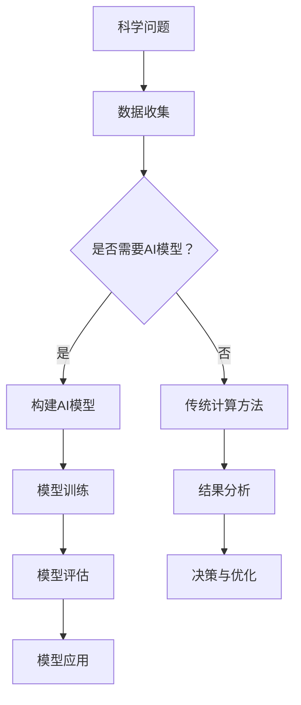

                 

关键词：高度整合的算力平台，AI for Science，科学计算，高性能计算，数据密集型应用，算法优化，人工智能加速

> 摘要：本文探讨了高度整合的算力平台在人工智能（AI）应用于科学研究中的关键作用。文章首先介绍了AI for Science的发展背景和重要性，随后详细阐述了高度整合算力平台的核心特性及其如何支撑AI的算法优化和加速。通过数学模型、具体操作步骤和项目实践案例，深入分析了这一平台在生物信息学、气候科学和材料科学等领域的实际应用，并展望了其未来的发展趋势与挑战。

## 1. 背景介绍

### 1.1 AI for Science的发展背景

人工智能（AI）作为一门交叉学科，融合了计算机科学、数学、统计学和神经科学等多个领域。自20世纪50年代以来，AI经历了多个发展时期，从早期的符号推理到近年的深度学习和大数据分析，AI技术不断进步，应用范围也在不断扩大。在科学领域，AI的应用更是日益广泛，从生物信息学、医学影像到气候科学、材料科学等，AI正逐渐成为推动科学研究的重要工具。

### 1.2 高度整合的算力平台

高度整合的算力平台（HPC Platforms）是指通过先进的硬件和软件技术，实现对计算资源的高效管理和调度，以满足大规模数据处理和复杂计算需求。这些平台通常具备以下特点：

1. **高性能计算能力**：通过大规模并行处理和分布式计算技术，实现高性能计算。
2. **资源整合能力**：整合多种类型的计算资源，包括CPU、GPU、FPGA等，以满足不同类型的应用需求。
3. **高效的数据处理能力**：支持高速数据传输和存储，满足数据密集型应用的需求。
4. **自动化管理能力**：具备自动化任务调度、负载均衡和资源优化等功能，提高资源利用率。

## 2. 核心概念与联系

### 2.1 高度整合算力平台与AI的关联

高度整合的算力平台与AI在科学研究中的关联主要体现在以下几个方面：

1. **算法优化**：高度整合的算力平台通过提供强大的计算能力，可以加速AI算法的优化和改进。
2. **数据处理**：AI应用中的大规模数据通常需要高效的数据处理能力，高度整合的算力平台能够满足这一需求。
3. **模型训练**：深度学习等AI技术的核心是模型训练，高度整合的算力平台能够提供大规模并行计算能力，加速模型训练过程。
4. **应用推广**：通过高度整合的算力平台，AI技术可以更广泛地应用于科学研究的各个领域。

### 2.2 Mermaid流程图

下面是一个简化的Mermaid流程图，展示了高度整合的算力平台与AI在科学计算中的应用流程。



## 3. 核心算法原理 & 具体操作步骤

### 3.1 算法原理概述

高度整合的算力平台在AI for Science中的应用，主要涉及以下几个核心算法：

1. **深度学习算法**：用于模型训练和预测，包括卷积神经网络（CNN）、循环神经网络（RNN）等。
2. **优化算法**：用于模型参数的优化，如随机梯度下降（SGD）、Adam优化器等。
3. **数据处理算法**：用于数据预处理、特征提取和数据分析，如PCA、k-均值聚类等。
4. **模型评估算法**：用于评估模型性能，如交叉验证、ROC曲线等。

### 3.2 算法步骤详解

#### 3.2.1 数据收集与预处理

1. **数据收集**：从各种来源收集原始数据，如实验数据、传感器数据、公开数据集等。
2. **数据清洗**：去除噪声、缺失值和异常值，保证数据质量。
3. **数据归一化**：将数据转换到同一尺度，便于模型训练。

#### 3.2.2 构建AI模型

1. **模型选择**：根据具体应用场景选择合适的模型架构，如CNN、RNN等。
2. **参数初始化**：随机初始化模型参数。
3. **前向传播**：计算输入数据通过模型的输出。
4. **反向传播**：计算损失函数的梯度，更新模型参数。

#### 3.2.3 模型训练

1. **批量大小**：选择合适的批量大小，影响训练速度和收敛效果。
2. **迭代次数**：设置足够的迭代次数，使模型收敛。
3. **学习率调整**：根据模型训练效果调整学习率，避免过拟合。

#### 3.2.4 模型评估

1. **交叉验证**：使用交叉验证方法评估模型性能。
2. **ROC曲线**：绘制ROC曲线，评估模型的分类能力。
3. **精度、召回率**：计算模型的精度、召回率等指标。

#### 3.2.5 模型应用

1. **模型部署**：将训练好的模型部署到生产环境中。
2. **结果分析**：分析模型预测结果，为科学研究提供决策支持。

### 3.3 算法优缺点

**优点**：

1. **高效性**：通过并行计算和分布式存储，加速算法运行。
2. **灵活性**：支持多种算法和模型架构，适应不同应用场景。
3. **可扩展性**：易于扩展计算资源和存储容量，满足不断增长的计算需求。

**缺点**：

1. **复杂性**：涉及多种技术和工具，学习成本高。
2. **成本**：高性能计算设备成本较高，对预算要求较高。

### 3.4 算法应用领域

高度整合的算力平台在多个科学领域都有广泛应用：

1. **生物信息学**：用于基因序列分析、蛋白质结构预测等。
2. **气候科学**：用于气候模拟、天气预报等。
3. **材料科学**：用于材料设计、性能预测等。
4. **医学影像**：用于疾病诊断、治疗规划等。

## 4. 数学模型和公式 & 详细讲解 & 举例说明

### 4.1 数学模型构建

在AI for Science中，常用的数学模型包括：

1. **神经网络**：
   \[
   y = f(\sum_{i=1}^{n} w_i \cdot x_i + b)
   \]
   其中，\( f \) 是激活函数，\( w_i \) 和 \( b \) 是模型参数。

2. **损失函数**：
   \[
   J = \frac{1}{2} \sum_{i=1}^{n} (y_i - \hat{y}_i)^2
   \]
   其中，\( y_i \) 是真实标签，\( \hat{y}_i \) 是模型预测。

3. **优化算法**：
   \[
   w_{new} = w_{old} - \alpha \cdot \frac{\partial J}{\partial w}
   \]
   其中，\( \alpha \) 是学习率，\( \frac{\partial J}{\partial w} \) 是损失函数关于模型参数的梯度。

### 4.2 公式推导过程

以神经网络为例，假设有一个三层神经网络，包括输入层、隐藏层和输出层。输入层有 \( m \) 个神经元，隐藏层有 \( n \) 个神经元，输出层有 \( p \) 个神经元。

1. **前向传播**：
   \[
   z_j = \sum_{i=1}^{m} w_{ij} \cdot x_i + b_j
   \]
   \[
   a_j = f(z_j)
   \]

2. **反向传播**：
   \[
   \delta_k = \frac{\partial J}{\partial z_k}
   \]
   \[
   \frac{\partial J}{\partial w_{ik}} = \delta_k \cdot a_i
   \]
   \[
   \frac{\partial J}{\partial b_k} = \delta_k
   \]

3. **更新模型参数**：
   \[
   w_{ik, new} = w_{ik, old} - \alpha \cdot \frac{\partial J}{\partial w_{ik}}
   \]
   \[
   b_{k, new} = b_{k, old} - \alpha \cdot \frac{\partial J}{\partial b_k}
   \]

### 4.3 案例分析与讲解

以生物信息学中的基因序列分析为例，假设我们要训练一个深度神经网络模型来预测基因序列的编码功能。

1. **数据收集与预处理**：收集大量的基因序列及其对应的编码功能标签，对数据进行清洗和归一化处理。
2. **模型构建**：构建一个包含多个隐藏层的深度神经网络模型，输入层和输出层分别对应基因序列和编码功能标签。
3. **模型训练**：使用高度整合的算力平台，通过反向传播算法训练模型，不断更新模型参数，直至模型收敛。
4. **模型评估**：使用交叉验证方法评估模型性能，计算准确率、召回率等指标。
5. **模型应用**：将训练好的模型应用于新的基因序列预测，为生物科学研究提供支持。

## 5. 项目实践：代码实例和详细解释说明

### 5.1 开发环境搭建

在开始项目实践之前，我们需要搭建一个适合深度学习开发的计算环境。以下是搭建过程：

1. **安装Python**：从Python官方网站下载并安装Python 3.8版本。
2. **安装TensorFlow**：使用pip命令安装TensorFlow：
   \[
   pip install tensorflow
   \]
3. **配置GPU支持**：确保NVIDIA GPU驱动和CUDA库已正确安装，并在Python环境中配置：
   \[
   export TF_CUDAUFFелями = 1
   \]

### 5.2 源代码详细实现

以下是使用TensorFlow实现一个简单的深度神经网络模型的代码示例：

```python
import tensorflow as tf
from tensorflow.keras.layers import Dense
from tensorflow.keras.models import Sequential

# 构建模型
model = Sequential()
model.add(Dense(units=64, activation='relu', input_shape=(num_features,)))
model.add(Dense(units=32, activation='relu'))
model.add(Dense(units=1, activation='sigmoid'))

# 编译模型
model.compile(optimizer='adam', loss='binary_crossentropy', metrics=['accuracy'])

# 训练模型
model.fit(x_train, y_train, epochs=10, batch_size=32, validation_data=(x_val, y_val))
```

### 5.3 代码解读与分析

1. **模型构建**：使用`Sequential`模型堆叠多层`Dense`层，定义模型结构。
2. **编译模型**：指定优化器、损失函数和评价指标，准备训练。
3. **训练模型**：使用`fit`函数进行模型训练，传入训练数据、训练轮数、批量大小和验证数据。

### 5.4 运行结果展示

在完成模型训练后，我们可以使用以下代码展示模型的运行结果：

```python
# 评估模型
loss, accuracy = model.evaluate(x_test, y_test)

# 输出结果
print(f"Test Loss: {loss}")
print(f"Test Accuracy: {accuracy}")
```

运行结果将显示模型在测试数据上的损失和准确率。

## 6. 实际应用场景

### 6.1 生物信息学

高度整合的算力平台在生物信息学中的应用非常广泛，例如：

- **基因序列分析**：用于预测基因功能、识别基因突变等。
- **蛋白质结构预测**：加速蛋白质结构建模和模拟。

### 6.2 气候科学

高度整合的算力平台在气候科学中用于：

- **气候模拟**：用于模拟气候变化、预测极端天气事件。
- **天气预报**：提供高精度的天气预报，支持防灾减灾。

### 6.3 材料科学

高度整合的算力平台在材料科学中用于：

- **材料设计**：加速材料结构的计算和优化。
- **性能预测**：预测材料的物理和化学性能，为材料选择提供依据。

## 7. 工具和资源推荐

### 7.1 学习资源推荐

1. **《深度学习》（Goodfellow, Bengio, Courville）**：系统介绍了深度学习的基础理论和实践方法。
2. **《Python深度学习》（François Chollet）**：针对Python编程语言实现的深度学习项目指南。

### 7.2 开发工具推荐

1. **TensorFlow**：谷歌开发的深度学习框架，适用于多种深度学习应用。
2. **PyTorch**：Facebook开发的深度学习框架，易于实现和调试。

### 7.3 相关论文推荐

1. **“Deep Learning for Drug Discovery”**：介绍深度学习在药物发现中的应用。
2. **“AI for Climate Science”**：探讨人工智能在气候科学研究中的潜力。

## 8. 总结：未来发展趋势与挑战

### 8.1 研究成果总结

高度整合的算力平台在AI for Science中取得了显著成果，加速了算法优化、提高了数据处理能力，并推动了多个科学领域的发展。

### 8.2 未来发展趋势

未来，高度整合的算力平台将继续发展，重点包括：

- **硬件升级**：采用更先进的硬件技术，如量子计算、光子计算等。
- **软件优化**：开发更高效的算法和框架，提高计算效率。
- **跨学科融合**：与其他学科（如生物学、化学、物理学等）深度融合，推动科学创新。

### 8.3 面临的挑战

尽管高度整合的算力平台在AI for Science中取得了显著成果，但仍然面临以下挑战：

- **成本问题**：高性能计算设备的成本较高，对研究预算和资源提出了较高要求。
- **数据隐私**：在数据处理过程中，如何保护数据隐私成为一大挑战。
- **人才短缺**：深度学习等领域的专业人才需求巨大，但供应不足。

### 8.4 研究展望

未来，随着技术的不断进步，高度整合的算力平台将在AI for Science中发挥更大作用，为科学研究带来更多突破。通过跨学科合作和持续创新，有望解决当前面临的挑战，推动科学进步。

## 9. 附录：常见问题与解答

### 9.1 高度整合的算力平台是什么？

高度整合的算力平台是指通过先进的硬件和软件技术，实现对计算资源的高效管理和调度，以满足大规模数据处理和复杂计算需求。

### 9.2 高度整合的算力平台有哪些优点？

高度整合的算力平台具有高性能计算能力、资源整合能力、高效的数据处理能力和自动化管理能力等优点。

### 9.3 高度整合的算力平台在AI for Science中的应用有哪些？

高度整合的算力平台在AI for Science中的应用包括算法优化、数据处理、模型训练和模型应用等方面，广泛应用于生物信息学、气候科学、材料科学等多个领域。

### 9.4 如何搭建一个适合深度学习开发的计算环境？

搭建适合深度学习开发的计算环境通常包括安装Python、安装深度学习框架（如TensorFlow或PyTorch）、配置GPU支持等步骤。

---

### 结束语

本文详细探讨了高度整合的算力平台在AI for Science中的应用，从背景介绍、核心概念、算法原理、数学模型、项目实践到实际应用和未来展望，全面展示了这一平台在推动科学研究中的重要作用。随着技术的不断进步，高度整合的算力平台将在AI for Science中发挥更大作用，为科学研究带来更多创新和突破。

作者：禅与计算机程序设计艺术 / Zen and the Art of Computer Programming
----------------------------------------------------------------

