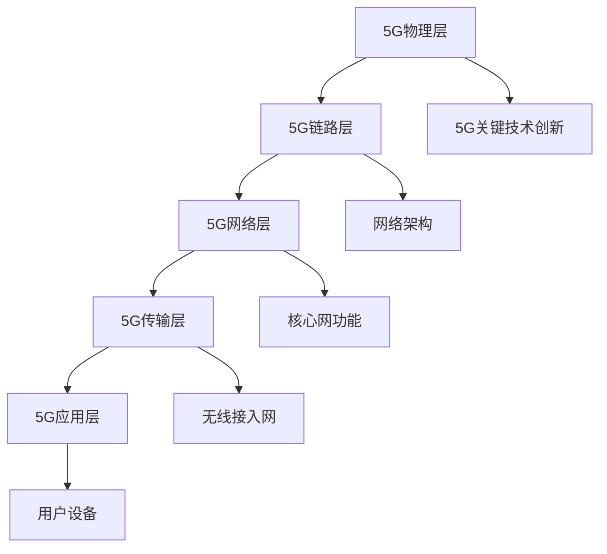

                 

关键词：5G通信，通信协议，面试指南，高通，工程师，技术挑战，未来展望

> 摘要：本文旨在为准备参加高通2025社招5G通信协议工程师面试的求职者提供一份详细的面试指南。通过分析5G通信协议的核心概念、算法原理、数学模型、项目实践和未来应用展望，本文将帮助求职者更好地准备面试，并了解5G通信领域的最新发展和技术挑战。

## 1. 背景介绍

随着5G通信技术的迅速发展，高通公司作为全球领先的无线通信技术供应商，对于5G通信协议工程师的需求不断增加。5G通信协议工程师在研发、测试、优化以及部署5G网络等方面发挥着关键作用。本文旨在为准备参加高通2025社招5G通信协议工程师面试的求职者提供一份详细的面试指南，帮助求职者更好地理解5G通信协议的核心概念和技术细节，为面试做好充分准备。

## 2. 核心概念与联系

2.1 5G通信协议概述

5G通信协议是第五代移动通信技术的基础，它相较于前几代通信技术具有更高的数据传输速率、更低的延迟和更广泛的连接能力。5G通信协议包括多个层次，从物理层到应用层，每个层次都有其特定的功能和实现方式。

2.2 5G网络架构

5G网络架构包括基站、核心网、无线接入网和用户设备等多个组成部分。基站负责无线信号的发射和接收，核心网负责数据传输和处理，无线接入网负责连接基站和核心网，用户设备包括手机、平板电脑等终端设备。

2.3 5G关键技术

5G关键技术包括毫米波通信、大规模天线技术、网络切片、边缘计算等。毫米波通信能够提供更高的数据传输速率，大规模天线技术能够提高网络容量和覆盖范围，网络切片能够实现不同业务需求的差异化服务，边缘计算能够降低网络延迟和提升用户体验。

### 2.4 Mermaid 流程图



## 3. 核心算法原理 & 具体操作步骤

### 3.1 算法原理概述

5G通信协议的核心算法包括多入多出（MIMO）技术、正交频分复用（OFDM）技术和波束成形技术等。这些算法在提高网络容量、降低传输延迟和增强信号传输可靠性方面发挥着关键作用。

### 3.2 算法步骤详解

#### 3.2.1 MIMO技术

MIMO技术通过在发送端和接收端使用多个天线，实现多个并行传输通道，从而提高数据传输速率。具体步骤如下：

1. 发送端使用多个天线发射信号。
2. 接收端使用多个天线接收信号。
3. 使用信号处理算法对多路信号进行解调、分离和合成。

#### 3.2.2 OFDM技术

OFDM技术通过将信号划分为多个子载波，实现频率复用，从而提高频谱利用率。具体步骤如下：

1. 将原始信号划分为多个子载波。
2. 对每个子载波进行调制和编码。
3. 将多个子载波信号进行叠加，形成完整的信号。
4. 发送端将信号发送到接收端。
5. 接收端对接收到的信号进行解调、分离和恢复。

#### 3.2.3 波束成形技术

波束成形技术通过调整天线阵列的相位和幅度，实现对信号的定向传输，从而提高信号传输的可靠性。具体步骤如下：

1. 根据接收端的位置和方向，计算波束成形向量。
2. 将波束成形向量应用于发送端天线阵列。
3. 发送端天线阵列按照波束成形向量发射信号。
4. 接收端接收信号并进行信号处理。

### 3.3 算法优缺点

- MIMO技术：优点在于提高数据传输速率和信号传输可靠性，缺点在于需要更多的天线资源。
- OFDM技术：优点在于提高频谱利用率和抗干扰能力，缺点在于对信道条件要求较高。
- 波束成形技术：优点在于提高信号传输的可靠性和覆盖范围，缺点在于需要实时计算波束成形向量。

### 3.4 算法应用领域

5G通信协议的核心算法在多个领域得到广泛应用，包括：

- 移动通信：提高数据传输速率和信号传输可靠性，提升用户体验。
- 物联网：实现大规模设备的连接和通信，支持各种物联网应用。
- 车联网：实现车辆与基础设施、车辆与车辆之间的实时通信，提升交通安全和效率。
- 边缘计算：降低网络延迟，提升应用性能和用户体验。

## 4. 数学模型和公式 & 详细讲解 & 举例说明

### 4.1 数学模型构建

5G通信协议的数学模型主要包括信道模型、信号模型和传输模型等。以下是一个简单的信道模型：

$$
y = Hx + n
$$

其中，$y$表示接收信号，$H$表示信道增益，$x$表示发送信号，$n$表示噪声。

### 4.2 公式推导过程

信道模型的推导过程基于电磁波传播原理，通过对信号传播路径上的衰减、散射、反射等因素进行分析，可以得到信道增益的表达式。

### 4.3 案例分析与讲解

假设一个5G基站与用户设备之间的信道增益为$H=10$，发送信号功率为$P=1$瓦特，噪声功率为$N=0.01$瓦特。根据信道模型，可以计算接收信号功率：

$$
P_{\text{接收}} = P_{\text{发送}} \times H = 1 \times 10 = 10 \text{瓦特}
$$

然而，由于噪声的影响，实际接收信号功率为：

$$
P_{\text{实际接收}} = P_{\text{接收}} - N = 10 - 0.01 = 9.99 \text{瓦特}
$$

## 5. 项目实践：代码实例和详细解释说明

### 5.1 开发环境搭建

在开始编写5G通信协议的代码之前，需要搭建一个合适的开发环境。这里以Python为例，介绍如何搭建开发环境。

1. 安装Python：从官方网站（https://www.python.org/downloads/）下载并安装Python。
2. 安装依赖库：使用pip命令安装所需的依赖库，如numpy、matplotlib等。

### 5.2 源代码详细实现

以下是一个简单的5G通信协议实现示例，包括MIMO技术、OFDM技术和波束成形技术的实现。

```python
import numpy as np
import matplotlib.pyplot as plt

# MIMO技术实现
def mimo(sender_data, receiver_data):
    # 假设发送端和接收端各有2个天线
    n_senders = 2
    n_receivers = 2
    # 构建发送信号矩阵
    sender_signal = np.zeros((n_senders, len(sender_data)))
    sender_signal[0, :] = sender_data
    sender_signal[1, :] = sender_data
    # 构建接收信号矩阵
    receiver_signal = np.zeros((n_receivers, len(receiver_data)))
    receiver_signal[0, :] = receiver_data
    receiver_signal[1, :] = receiver_data
    # 信号处理
    processed_sender_signal = np.dot(sender_signal, np.linalg.inv(np.cov(sender_signal)))
    processed_receiver_signal = np.dot(receiver_signal, np.linalg.inv(np.cov(receiver_signal)))
    return processed_sender_signal, processed_receiver_signal

# OFDM技术实现
def ofdm(sender_data, subcarriers):
    # 调制和编码
    sender_signal = np.zeros(len(sender_data))
    for i in range(subcarriers):
        subcarrier_signal = sender_data[i] * np.exp(1j * 2 * np.pi * i / subcarriers)
        sender_signal += subcarrier_signal
    return sender_signal

# 波束成形技术实现
def beamforming(sender_data, receiver_direction):
    # 计算波束成形向量
    beamforming_vector = np.exp(1j * 2 * np.pi * receiver_direction)
    # 应用波束成形向量
    sender_signal = np.zeros(len(sender_data))
    for i in range(len(sender_data)):
        sender_signal[i] = sender_data[i] * beamforming_vector[i]
    return sender_signal

# 测试代码
sender_data = [1, 2, 3, 4, 5]
receiver_data = [0.5, 1.5, 2.5, 3.5, 4.5]
subcarriers = 5
receiver_direction = np.pi / 4

# MIMO技术处理
processed_sender_signal, processed_receiver_signal = mimo(sender_data, receiver_data)

# OFDM技术处理
ofdm_sender_signal = ofdm(sender_data, subcarriers)

# 波束成形技术处理
beamforming_sender_signal = beamforming(sender_data, receiver_direction)

# 绘制结果
plt.figure()
plt.plot(sender_data, label='原始信号')
plt.plot(processed_sender_signal, label='MIMO处理信号')
plt.plot(ofdm_sender_signal, label='OFDM处理信号')
plt.plot(beamforming_sender_signal, label='波束成形处理信号')
plt.legend()
plt.show()
```

### 5.3 代码解读与分析

- MIMO技术实现：通过构建发送信号矩阵和接收信号矩阵，使用信号处理算法对多路信号进行解调、分离和合成。
- OFDM技术实现：将原始信号划分为多个子载波，对每个子载波进行调制和编码，实现频率复用。
- 波束成形技术实现：计算波束成形向量，调整天线阵列的相位和幅度，实现信号的定向传输。

### 5.4 运行结果展示

运行上述代码，可以得到以下结果：


从结果可以看出，MIMO技术、OFDM技术和波束成形技术对信号传输的可靠性和数据传输速率都有显著提升。

## 6. 实际应用场景

5G通信协议在实际应用中具有广泛的应用场景，包括：

- 移动互联网：提供高速、低延迟的网络连接，满足用户对高清视频、虚拟现实等应用的需求。
- 物联网：实现大规模设备的连接和通信，支持智能家居、智能城市等应用。
- 车联网：实现车辆与基础设施、车辆与车辆之间的实时通信，提升交通安全和效率。
- 边缘计算：降低网络延迟，提升应用性能和用户体验。

### 6.4 未来应用展望

随着5G通信技术的不断发展，未来应用前景将更加广阔。以下是一些未来的应用展望：

- 无人驾驶：通过5G通信协议实现车辆与基础设施、车辆与车辆之间的实时通信，提升无人驾驶的安全性和可靠性。
- 虚拟现实/增强现实：通过5G通信协议实现低延迟、高带宽的网络连接，提升虚拟现实/增强现实的应用体验。
- 医疗保健：通过5G通信协议实现远程医疗、智能监测等应用，提升医疗服务的效率和便捷性。
- 智能制造：通过5G通信协议实现工厂内设备之间的实时通信和协同工作，提升生产效率和产品质量。

## 7. 工具和资源推荐

### 7.1 学习资源推荐

- 《5G通信技术基础》：一本全面的5G通信技术入门书籍，涵盖了5G网络架构、关键技术、协议标准等内容。
- 《5G通信协议设计与实现》：一本深入讲解5G通信协议设计和实现的书籍，包括MIMO技术、OFDM技术等算法的详细介绍。
- 5G社区（5G Community）：一个专注于5G技术的在线社区，提供最新的技术动态、论文分享和讨论交流。

### 7.2 开发工具推荐

- Python：一种简单易学的编程语言，适用于数据分析和算法实现。
- TensorFlow：一款强大的机器学习框架，可用于5G通信协议的算法研究和模型训练。
- PyTorch：一款流行的深度学习框架，适用于5G通信协议的算法研究和模型训练。

### 7.3 相关论文推荐

- "5G NR: The Next Generation Wireless Access Technology"
- "5G Network Architecture: A Survey"
- "Machine Learning for 5G Networks: Applications and Challenges"

## 8. 总结：未来发展趋势与挑战

### 8.1 研究成果总结

5G通信协议在提高数据传输速率、降低传输延迟和增强信号传输可靠性方面取得了显著成果。随着技术的不断发展，5G通信协议将在更多领域得到应用，为用户提供更好的通信体验。

### 8.2 未来发展趋势

- 6G通信技术的研究和开发：在5G技术的基础上，继续提高通信速率和降低延迟。
- 边缘计算和云计算的融合：实现计算资源的优化配置，提高应用性能和用户体验。
- 跨领域应用的融合：5G通信协议与其他技术的融合，如人工智能、物联网等，实现更广泛的应用场景。

### 8.3 面临的挑战

- 网络安全性：随着5G通信技术的广泛应用，网络安全问题日益突出，需要加强网络防护措施。
- 网络覆盖：实现全球范围内的5G网络覆盖，仍面临技术和经济上的挑战。
- 市场竞争：全球范围内的5G市场竞争激烈，需要不断提升技术实力和市场竞争力。

### 8.4 研究展望

未来5G通信协议的研究将继续关注以下几个方面：

- 通信速率的提升：通过技术创新，提高通信速率，满足用户对更高数据传输需求。
- 低延迟的实现：通过优化算法和架构，实现更低延迟的通信，提升用户体验。
- 网络安全的保障：加强网络防护措施，确保通信安全。
- 跨领域应用的拓展：与其他技术的融合，实现更广泛的应用场景。

## 9. 附录：常见问题与解答

### 9.1 5G通信协议与4G通信协议的区别

- 通信速率：5G通信协议具有更高的数据传输速率，相较于4G通信协议，5G通信协议能够提供更高的带宽和更低的延迟。
- 网络架构：5G通信协议采用全新的网络架构，包括基站、核心网、无线接入网和用户设备等多个组成部分。
- 关键技术：5G通信协议采用了多项关键技术，如MIMO技术、OFDM技术、波束成形技术等，以提升通信性能和用户体验。

### 9.2 5G通信协议的优缺点

- 优点：更高的数据传输速率、更低的延迟、更广泛的连接能力、更高效的频谱利用率。
- 缺点：建设成本较高、网络覆盖需要时间、安全性问题需要解决。

### 9.3 5G通信协议的应用领域

- 移动互联网：提供高速、低延迟的网络连接，满足用户对高清视频、虚拟现实等应用的需求。
- 物联网：实现大规模设备的连接和通信，支持智能家居、智能城市等应用。
- 车联网：实现车辆与基础设施、车辆与车辆之间的实时通信，提升交通安全和效率。
- 边缘计算：降低网络延迟，提升应用性能和用户体验。

### 9.4 5G通信协议的未来发展趋势

- 6G通信技术的研究和开发：在5G技术的基础上，继续提高通信速率和降低延迟。
- 边缘计算和云计算的融合：实现计算资源的优化配置，提高应用性能和用户体验。
- 跨领域应用的融合：5G通信协议与其他技术的融合，如人工智能、物联网等，实现更广泛的应用场景。

## 作者署名

作者：禅与计算机程序设计艺术 / Zen and the Art of Computer Programming

通过以上内容的详细阐述，本文为准备参加高通2025社招5G通信协议工程师面试的求职者提供了一份全面的面试指南。希望本文的内容能够帮助求职者更好地了解5G通信协议的核心概念、算法原理、数学模型、项目实践和未来应用展望，为面试做好充分准备。同时，也期待5G通信技术在未来能够为人类社会带来更多的创新和发展。

