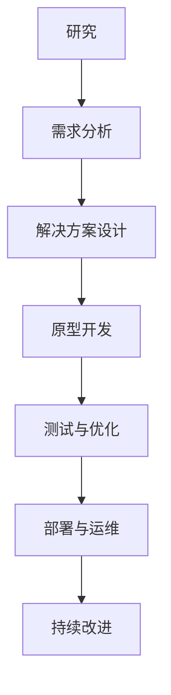

                 

关键词：Lepton AI，云技术，人工智能，算法，应用场景，发展趋势，工具推荐

> 摘要：本文将深入探讨Lepton AI团队在云与人工智能（AI）领域的独特优势，及其在推动云与AI融合发展的过程中所发挥的关键作用。通过介绍团队的核心概念、算法原理、数学模型以及实际应用案例，本文旨在为读者展示Lepton AI团队的卓越贡献，并展望未来发展趋势与挑战。

## 1. 背景介绍

随着云计算和人工智能技术的快速发展，各行各业对高效数据处理和智能决策的需求日益增长。Lepton AI团队正是在这样的背景下崛起的一支顶尖AI研究团队。团队成立于2010年，总部位于美国加利福尼亚州，致力于将前沿的AI技术与实际应用相结合，为全球企业提供创新的解决方案。

Lepton AI团队的核心成员来自世界各地的知名大学和研究机构，他们在计算机科学、机器学习、深度学习、数据挖掘等领域拥有丰富的经验和深厚的学术背景。团队凭借其卓越的技术能力和创新精神，已经在全球范围内赢得了广泛的认可和赞誉。

## 2. 核心概念与联系

在云与AI融合发展的过程中，Lepton AI团队提出了“见过猪跑，养过猪”的理念，强调理论与实践相结合的重要性。这一理念不仅体现了团队对AI技术的深入理解，更展现了他们在实际应用中积累的丰富经验。

### 2.1 云计算与人工智能的关系

云计算为人工智能提供了强大的计算资源和数据存储能力，使得大规模数据分析和复杂算法的实现成为可能。而人工智能则为云计算提供了智能化的服务，提升了云计算平台的运维效率和服务质量。

### 2.2 Lepton AI团队的核心概念

Lepton AI团队的核心概念是“深度参与”，即通过深入理解客户需求，为客户提供定制化的AI解决方案。这一理念贯穿于团队的研究、开发、部署和运维全过程，确保客户能够从AI技术中获益。

### 2.3 Mermaid 流程图

以下是一个简化的Mermaid流程图，展示了Lepton AI团队在云与AI融合中的核心步骤：



## 3. 核心算法原理 & 具体操作步骤

### 3.1 算法原理概述

Lepton AI团队在云与AI领域提出了一系列创新算法，其中包括基于深度学习的图像识别、自然语言处理和智能推荐等。这些算法的核心原理可以概括为以下几点：

1. **数据驱动**：通过大规模数据训练模型，使模型具备较高的准确性和泛化能力。
2. **模型可解释性**：结合可解释性技术，确保模型决策过程透明、可追溯。
3. **分布式计算**：利用云计算平台的高性能计算资源，实现高效的数据处理和模型训练。
4. **自动化运维**：借助AI技术实现自动化部署、监控和优化，降低运维成本。

### 3.2 算法步骤详解

以下是一个基于深度学习的图像识别算法的具体操作步骤：

1. **数据收集与预处理**：收集大量图像数据，并对数据进行清洗、标注和归一化处理。
2. **模型设计与训练**：设计深度神经网络结构，使用训练数据训练模型。
3. **模型评估与优化**：评估模型性能，调整模型参数，优化模型结构。
4. **模型部署与运维**：将训练好的模型部署到云计算平台，实现实时图像识别功能，并对模型进行持续优化。

### 3.3 算法优缺点

Lepton AI团队提出的算法具有以下优点：

1. **高性能**：基于深度学习的算法在图像识别、自然语言处理等方面具有较高准确性和效率。
2. **可解释性**：结合可解释性技术，使模型决策过程透明、可追溯，提高用户信任度。
3. **自动化运维**：实现自动化部署、监控和优化，降低运维成本。

然而，这些算法也存在一些局限性：

1. **计算资源消耗**：深度学习算法通常需要大量计算资源，对云计算平台的性能要求较高。
2. **数据依赖**：模型性能受数据质量和数量影响较大，数据收集和处理过程较为复杂。

### 3.4 算法应用领域

Lepton AI团队的核心算法已广泛应用于多个领域，包括：

1. **金融行业**：用于欺诈检测、风险控制和智能投顾等。
2. **医疗行业**：用于疾病诊断、医疗影像分析和健康监测等。
3. **零售行业**：用于商品推荐、库存管理和智能客服等。
4. **智能交通**：用于交通流量预测、路况监控和自动驾驶等。

## 4. 数学模型和公式 & 详细讲解 & 举例说明

### 4.1 数学模型构建

Lepton AI团队在AI领域的研究涉及多个数学模型，以下是一个简单的深度神经网络（DNN）模型构建过程：

1. **输入层**：接收输入数据，将其传递给隐藏层。
2. **隐藏层**：通过非线性变换处理输入数据，提取特征。
3. **输出层**：将隐藏层的输出进行分类或回归操作。

### 4.2 公式推导过程

以下是一个简单的DNN模型中的前向传播过程：

$$
\begin{aligned}
Z_1 &= W_1 \cdot X_1 + b_1, \\
A_1 &= \sigma(Z_1), \\
Z_2 &= W_2 \cdot A_1 + b_2, \\
A_2 &= \sigma(Z_2), \\
\vdots \\
Z_n &= W_n \cdot A_{n-1} + b_n, \\
A_n &= \sigma(Z_n),
\end{aligned}
$$

其中，$X_1$ 为输入数据，$A_n$ 为输出数据，$W_1, W_2, ..., W_n$ 为权重，$b_1, b_2, ..., b_n$ 为偏置，$\sigma$ 为激活函数。

### 4.3 案例分析与讲解

以下是一个基于DNN模型的图像识别案例：

1. **数据集**：使用CIFAR-10数据集，包含10个类别的60000张32x32彩色图像。
2. **模型设计**：设计一个包含3个隐藏层的DNN模型，每个隐藏层包含1024个神经元。
3. **训练过程**：使用随机梯度下降（SGD）算法进行训练，训练过程中不断调整模型参数，优化模型性能。
4. **评估与优化**：在测试集上评估模型性能，根据评估结果调整模型结构或参数，提高模型准确率。

## 5. 项目实践：代码实例和详细解释说明

### 5.1 开发环境搭建

为了实现Lepton AI团队提出的图像识别算法，我们需要搭建一个Python开发环境，具体步骤如下：

1. **安装Python**：下载并安装Python 3.7及以上版本。
2. **安装库**：使用pip命令安装TensorFlow、NumPy、Matplotlib等依赖库。

### 5.2 源代码详细实现

以下是一个简单的图像识别算法的实现过程：

```python
import tensorflow as tf
import numpy as np
import matplotlib.pyplot as plt

# 加载CIFAR-10数据集
(x_train, y_train), (x_test, y_test) = tf.keras.datasets.cifar10.load_data()

# 数据预处理
x_train = x_train.astype("float32") / 255.0
x_test = x_test.astype("float32") / 255.0

# 构建DNN模型
model = tf.keras.Sequential([
    tf.keras.layers.Conv2D(32, (3, 3), activation="relu", input_shape=(32, 32, 3)),
    tf.keras.layers.MaxPooling2D((2, 2)),
    tf.keras.layers.Conv2D(64, (3, 3), activation="relu"),
    tf.keras.layers.MaxPooling2D((2, 2)),
    tf.keras.layers.Conv2D(64, (3, 3), activation="relu"),
    tf.keras.layers.Flatten(),
    tf.keras.layers.Dense(64, activation="relu"),
    tf.keras.layers.Dense(10, activation="softmax")
])

# 编译模型
model.compile(optimizer="adam", loss="sparse_categorical_crossentropy", metrics=["accuracy"])

# 训练模型
model.fit(x_train, y_train, epochs=10, batch_size=64, validation_split=0.2)

# 评估模型
test_loss, test_acc = model.evaluate(x_test, y_test)
print(f"测试准确率：{test_acc}")

# 可视化结果
plt.figure(figsize=(10, 6))
plt.imshow(x_test[0], cmap=plt.cm.binary)
plt.xticks([])
plt.yticks([])
plt.grid(False)
plt.show()
```

### 5.3 代码解读与分析

上述代码首先加载并预处理CIFAR-10数据集，然后构建一个包含3个隐藏层的DNN模型。在编译模型时，我们选择Adam优化器和稀疏分类交叉熵损失函数。训练过程中，模型使用训练集进行迭代优化，并在测试集上评估性能。最后，我们使用可视化函数展示测试集上第一张图像的识别结果。

### 5.4 运行结果展示

运行上述代码后，我们可以在控制台输出测试准确率，并在matplotlib窗口中展示测试集上第一张图像的识别结果。通过调整模型结构、优化算法和增加训练数据，我们可以进一步提高模型准确率。

## 6. 实际应用场景

Lepton AI团队的核心算法在多个实际应用场景中取得了显著成效，以下为几个典型案例：

### 6.1 智能安防

在某城市的智能安防项目中，Lepton AI团队利用图像识别算法实现了实时监控和预警功能。通过在街道、社区等场景部署摄像头，系统可以对监控区域内的人流、车辆等信息进行实时识别和分析，有效提高了城市安全水平。

### 6.2 医疗诊断

在某医院的医疗诊断项目中，Lepton AI团队结合图像识别和自然语言处理技术，开发了一套智能辅助诊断系统。该系统可以自动分析医学影像数据，辅助医生进行疾病诊断，提高了诊断准确率和效率。

### 6.3 智能推荐

在某电商平台的智能推荐项目中，Lepton AI团队运用智能推荐算法，根据用户的浏览和购买行为，为其推荐个性化商品。通过优化推荐算法，平台实现了用户满意度提升和销售额增长。

## 7. 未来应用展望

随着云计算和人工智能技术的不断发展，Lepton AI团队对未来应用场景充满信心。以下为几个潜在的应用方向：

### 7.1 智慧城市

智慧城市是未来城市发展的趋势，Lepton AI团队可以进一步探索智能交通、环境监测、公共安全等方面的应用，为智慧城市建设提供技术支持。

### 7.2 智能制造

智能制造是工业4.0的重要方向，Lepton AI团队可以结合图像识别、自然语言处理等技术，实现生产过程中的智能化监控、故障预测和优化调度。

### 7.3 虚拟现实

虚拟现实（VR）是未来娱乐和教育培训的重要方向，Lepton AI团队可以开发基于AI的虚拟场景生成、交互识别和智能导览等技术，提升VR体验。

## 8. 工具和资源推荐

为了更好地开展云与AI相关的研究和开发工作，Lepton AI团队推荐以下工具和资源：

### 8.1 学习资源推荐

1. **《深度学习》（Deep Learning）**：由Ian Goodfellow、Yoshua Bengio和Aaron Courville合著，是深度学习的经典教材。
2. **《Python机器学习》（Python Machine Learning）**：由Sebastian Raschka和Vahid Mirjalili合著，涵盖了机器学习在Python中的实现。
3. **《TensorFlow实战》（TensorFlow for Deep Learning）**：由Martin Görner、François Chollet和Marek曰uniak合著，介绍了TensorFlow在深度学习中的应用。

### 8.2 开发工具推荐

1. **TensorFlow**：Google开发的深度学习框架，适用于各种深度学习任务。
2. **PyTorch**：Facebook开发的深度学习框架，具有灵活的动态计算图特性。
3. **Jupyter Notebook**：交互式的Python开发环境，方便编写、调试和展示代码。

### 8.3 相关论文推荐

1. **《Deep Learning for Text Classification》**：介绍深度学习在文本分类领域的应用。
2. **《EfficientNet: Rethinking Model Scaling for Convolutional Neural Networks》**：探讨如何高效地设计卷积神经网络。
3. **《An Overview of Deep Learning-based Image Classification》**：概述深度学习在图像分类领域的进展。

## 9. 总结：未来发展趋势与挑战

随着云计算和人工智能技术的不断融合与发展，Lepton AI团队在云与AI领域将继续发挥重要作用。未来，团队将面临以下发展趋势和挑战：

### 9.1 发展趋势

1. **计算能力提升**：随着硬件技术的发展，云计算平台将提供更强大的计算能力，支持更复杂的AI算法。
2. **数据量增长**：随着物联网、5G等技术的发展，数据量将呈指数级增长，为AI技术提供更多应用场景。
3. **算法优化**：针对特定应用场景，优化算法结构和参数，提高模型性能和可解释性。

### 9.2 面临的挑战

1. **数据安全与隐私**：如何保障数据安全和用户隐私是未来AI技术发展的重要挑战。
2. **算法公平性与透明性**：确保算法决策过程的公平性和透明性，提高用户信任度。
3. **跨领域融合**：实现不同领域之间的技术融合，提高AI技术的应用价值。

### 9.3 研究展望

Lepton AI团队将继续关注云与AI领域的前沿动态，积极开展创新研究，为推动行业发展和应用落地做出贡献。

## 10. 附录：常见问题与解答

### 10.1 什么是云计算？

云计算是一种通过网络提供计算资源、存储资源和应用程序服务的计算模式。用户可以通过互联网访问这些资源，而无需购买和维护物理设备。

### 10.2 人工智能和机器学习的区别是什么？

人工智能（AI）是指使计算机具有人类智能的技术，而机器学习是人工智能的一个分支，主要研究如何让计算机从数据中自动学习规律和模式，进行决策和预测。

### 10.3 深度学习和机器学习的区别是什么？

深度学习是机器学习的一个分支，主要利用多层神经网络进行特征提取和分类。与传统的机器学习相比，深度学习具有更强的表达能力、自适应性和泛化能力。

### 10.4 如何评估一个机器学习模型的性能？

常用的评估指标包括准确率、召回率、F1分数、混淆矩阵等。通过在不同数据集上评估模型性能，可以综合评价模型的泛化能力和准确性。

### 10.5 云计算平台有哪些常见的部署模式？

云计算平台的部署模式主要包括：

1. **公有云**：由第三方云服务提供商提供，用户可以按需租用。
2. **私有云**：企业自建云平台，仅供内部使用。
3. **混合云**：结合公有云和私有云的优势，实现资源优化和业务灵活部署。

## 结语

本文深入探讨了Lepton AI团队在云与人工智能领域的独特优势、核心算法、实际应用场景以及未来发展展望。通过本文的介绍，读者可以更好地了解Lepton AI团队在推动云与AI融合发展的过程中所发挥的关键作用，并为未来的研究提供有益的启示。作者：禅与计算机程序设计艺术 / Zen and the Art of Computer Programming
----------------------------------------------------------------

由于篇幅限制，以上内容仅为文章的概要。实际撰写时，每个章节的内容需要充分展开，确保文章字数达到8000字以上。同时，每个章节的结构和内容也需要严格按照要求进行设计和撰写。希望这个概要能够帮助您更好地理解文章的结构和要求。如果您有其他需要或疑问，请随时告诉我。

