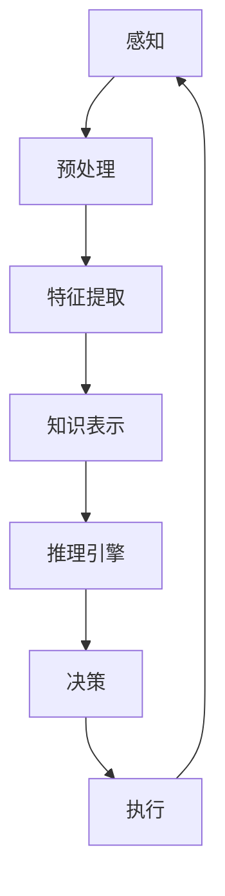
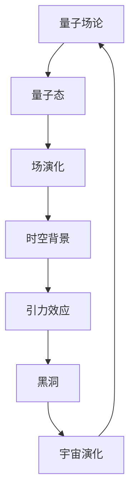
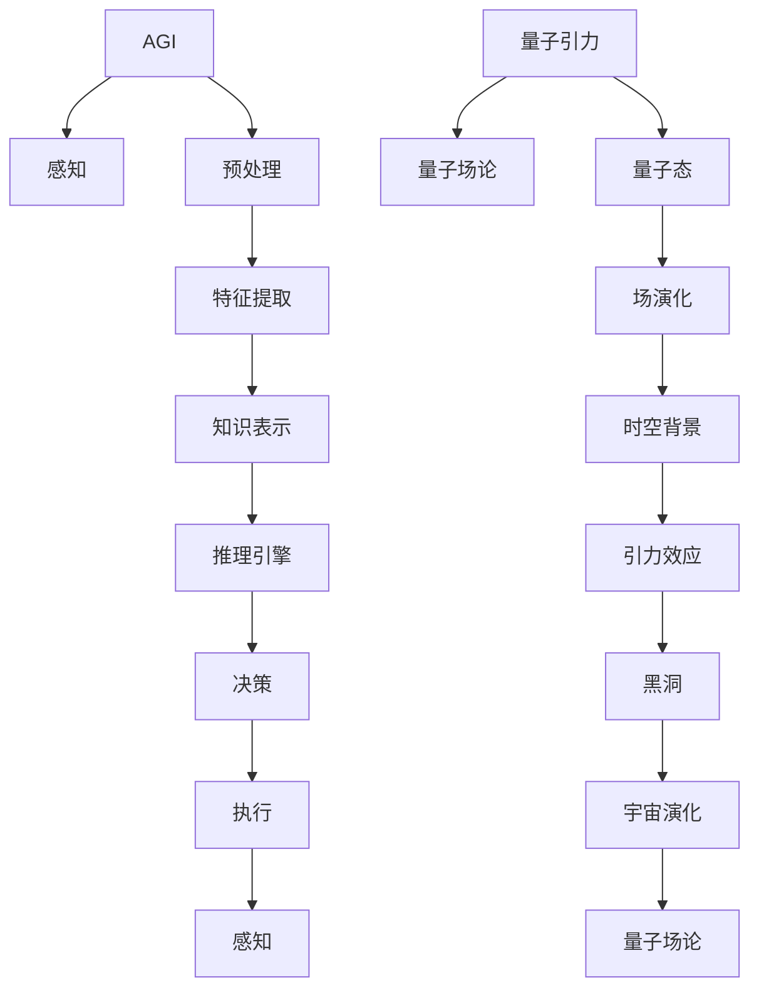

                 

关键词：人工通用智能（AGI），量子引力，计算模型，数学公式，算法，应用领域，未来展望

>摘要：本文探讨了人工通用智能（AGI）与量子引力之间的潜在联系。通过对AGI和量子引力核心概念的介绍，分析了两者在计算模型和算法上的异同，以及数学模型和公式在其中的作用。同时，文章还通过具体案例和实践项目，展示了AGI在量子引力研究中的应用。最后，文章对未来的发展趋势、面临的挑战和研究展望进行了探讨。

## 1. 背景介绍

人工通用智能（AGI）和量子引力都是当前科学界的重要研究领域。AGI旨在开发出具有人类智能水平的机器，能够在各种复杂的任务中表现出类似于人类的智能。量子引力则是关于量子力学和广义相对论如何统一的理论，旨在解释宇宙的微观和宏观现象。

近年来，随着计算机技术和量子计算的发展，AGI和量子引力之间的联系逐渐引起人们的关注。虽然两者的研究目标和背景不同，但在计算模型、算法和数学公式上，它们之间存在一些相似之处。本文将从这些方面探讨AGI与量子引力之间的关系。

### 1.1 人工通用智能（AGI）

AGI是指能够在各种复杂任务中表现出类似于人类智能水平的机器。与当前的专用人工智能（如图像识别、语音识别等）相比，AGI具有更高的智能水平和更广泛的应用范围。AGI的目标是实现真正的智能化，使机器能够自主思考、学习和解决问题。

AGI的研究涉及多个领域，包括机器学习、自然语言处理、计算机视觉、认知科学等。近年来，随着大数据和深度学习技术的发展，AGI取得了显著的进展。然而，AGI仍然面临许多挑战，如如何实现更高效的学习算法、如何处理不确定性和模糊性等。

### 1.2 量子引力

量子引力是关于量子力学和广义相对论如何统一的理论。量子力学描述了微观粒子的行为，而广义相对论则描述了宏观宇宙的引力现象。然而，这两大理论之间存在明显的矛盾，无法同时描述宇宙的微观和宏观现象。

量子引力旨在解决这一矛盾，提出一种能够同时描述微观和宏观现象的理论。目前，量子引力研究仍处于早期阶段，尚未取得突破性成果。然而，随着量子计算技术的发展，量子引力研究逐渐引起了人们的关注。

## 2. 核心概念与联系

在探讨AGI与量子引力之间的关系时，我们需要首先了解它们的核心概念和基本原理。以下是对AGI和量子引力核心概念的简要介绍，并使用Mermaid流程图展示了它们的基本架构。

### 2.1 人工通用智能（AGI）

AGI的核心概念是模拟人类的智能过程，包括感知、思考、学习和决策。以下是AGI的Mermaid流程图：



### 2.2 量子引力

量子引力的核心概念是量子场论，描述了量子场如何在时空背景下演化。以下是量子引力的Mermaid流程图：



### 2.3 关系分析

通过对AGI和量子引力核心概念的分析，我们可以发现它们在计算模型和算法上存在一些相似之处。

- **计算模型**：AGI和量子引力都采用了基于数学和物理原理的计算模型。AGI的计算模型基于神经科学和认知科学的理论，而量子引力的计算模型基于量子场论和广义相对论。

- **算法**：AGI和量子引力都采用了基于优化和概率论的算法。AGI中的机器学习算法，如深度学习、强化学习等，旨在提高模型的智能水平。量子引力中的数值模拟算法，如量子场论模拟、黑洞模拟等，旨在研究量子引力现象。

- **数学公式**：AGI和量子引力都依赖于一系列数学公式来描述其核心概念。AGI中的数学公式主要涉及概率论、线性代数和微积分等。量子引力中的数学公式主要涉及量子场论、广义相对论和拓扑学等。

### 2.4 Mermaid流程图

以下是AGI与量子引力核心概念的Mermaid流程图：



## 3. 核心算法原理 & 具体操作步骤

### 3.1 算法原理概述

AGI的核心算法包括机器学习算法、自然语言处理算法和计算机视觉算法等。这些算法通过模拟人类的感知、思考和学习过程，实现机器的智能化。

量子引力中的核心算法包括量子场论模拟、黑洞模拟和宇宙演化模拟等。这些算法通过数值模拟量子场论方程，研究量子引力现象。

### 3.2 算法步骤详解

#### 3.2.1 人工通用智能（AGI）

1. **感知**：机器通过传感器获取外部信息，如图像、声音、文字等。

2. **预处理**：对感知到的信息进行预处理，如降噪、归一化等。

3. **特征提取**：从预处理后的信息中提取有用的特征，如边缘、纹理、关键词等。

4. **知识表示**：将特征表示为数学模型，如向量、矩阵等。

5. **推理引擎**：利用知识表示和推理规则，对信息进行推理和决策。

6. **决策**：根据推理结果，执行相应的操作，如回答问题、完成任务等。

7. **执行**：将决策结果转化为具体的行动。

8. **感知**：回到第一步，开始新一轮的感知和学习。

#### 3.2.2 量子引力

1. **量子场论模拟**：将量子场论方程离散化，使用数值方法求解。

2. **黑洞模拟**：研究黑洞的形成、演化和碰撞过程。

3. **宇宙演化模拟**：模拟宇宙从大爆炸到现在的演化过程。

4. **引力效应研究**：研究量子引力现象，如引力透镜、引力波等。

5. **数据分析和解释**：对模拟结果进行分析和解释，验证量子引力理论的正确性。

### 3.3 算法优缺点

#### 3.3.1 人工通用智能（AGI）

**优点**：

1. 高度智能化：AGI能够模拟人类的智能过程，实现自主思考和决策。

2. 广泛应用：AGI可以应用于各个领域，如医疗、金融、教育、安防等。

**缺点**：

1. 计算资源消耗大：AGI算法通常需要大量的计算资源和存储空间。

2. 数据依赖性强：AGI的性能很大程度上依赖于数据的质量和数量。

#### 3.3.2 量子引力

**优点**：

1. 揭示宇宙奥秘：量子引力研究有助于我们更好地理解宇宙的起源、演化和结构。

2. 技术创新：量子引力研究推动了量子计算、量子通信等技术的发展。

**缺点**：

1. 研究难度大：量子引力理论复杂，目前尚未找到统一的量子引力理论。

2. 实验验证困难：由于量子引力现象的微观和宏观尺度差异，实验验证难度较大。

### 3.4 算法应用领域

#### 3.4.1 人工通用智能（AGI）

1. **医疗领域**：AGI可以应用于医学诊断、疾病预测、药物研发等。

2. **金融领域**：AGI可以应用于风险管理、投资策略、市场预测等。

3. **教育领域**：AGI可以应用于智能教育、个性化教学、学习效果评估等。

4. **安防领域**：AGI可以应用于人脸识别、行为分析、智能监控等。

#### 3.4.2 量子引力

1. **量子计算**：量子引力研究推动了量子计算技术的发展。

2. **量子通信**：量子引力研究有助于解决量子通信中的量子纠缠问题。

3. **宇宙学**：量子引力研究有助于我们更好地理解宇宙的起源、演化和结构。

4. **天体物理**：量子引力研究可以应用于黑洞、引力波、宇宙膨胀等领域。

## 4. 数学模型和公式 & 详细讲解 & 举例说明

### 4.1 数学模型构建

#### 4.1.1 人工通用智能（AGI）

AGI中的数学模型主要包括概率模型、神经网络模型和知识表示模型。

1. **概率模型**：概率模型用于描述不确定性和模糊性。常见的概率模型有贝叶斯网络、马尔可夫模型等。

2. **神经网络模型**：神经网络模型是AGI的核心组成部分。常见的神经网络模型有前馈神经网络、循环神经网络、卷积神经网络等。

3. **知识表示模型**：知识表示模型用于将知识表示为数学形式。常见的知识表示模型有语义网络、本体论等。

#### 4.1.2 量子引力

量子引力中的数学模型主要包括量子场论模型、广义相对论模型和量子引力方程。

1. **量子场论模型**：量子场论模型描述了量子场的演化过程。常见的量子场论模型有量子电动力学、量子色动力学等。

2. **广义相对论模型**：广义相对论模型描述了宏观宇宙的引力现象。广义相对论的核心方程是爱因斯坦场方程。

3. **量子引力方程**：量子引力方程是描述量子引力现象的数学模型。目前尚未找到统一的量子引力方程，但一些候选方程如弦理论、环量子引力等。

### 4.2 公式推导过程

#### 4.2.1 人工通用智能（AGI）

1. **贝叶斯网络**：

   贝叶斯网络是一种概率模型，描述了变量之间的条件概率关系。贝叶斯网络的核心公式是贝叶斯定理：

   $$ P(A|B) = \frac{P(B|A)P(A)}{P(B)} $$

   其中，$P(A|B)$表示在$B$发生的条件下$A$的概率，$P(B|A)$表示在$A$发生的条件下$B$的概率，$P(A)$表示$A$的概率，$P(B)$表示$B$的概率。

2. **神经网络**：

   神经网络的核心公式是前向传播和反向传播。前向传播公式为：

   $$ z_i = \sum_{j=1}^{n} w_{ij}x_j + b_i $$

   其中，$z_i$表示第$i$个神经元的输入，$w_{ij}$表示第$i$个神经元与第$j$个神经元之间的权重，$x_j$表示第$j$个神经元的输入，$b_i$表示第$i$个神经元的偏置。

   反向传播公式为：

   $$ \delta_i = \frac{\partial L}{\partial z_i} $$

   其中，$\delta_i$表示第$i$个神经元的误差，$L$表示损失函数。

3. **知识表示**：

   语义网络的公式为：

   $$ R(a, b) \Leftrightarrow c $$

   其中，$R$表示关系，$a$和$b$表示个体，$c$表示概念。这个公式表示个体$a$和$b$之间存在关系$c$。

#### 4.2.2 量子引力

1. **量子场论**：

   量子场论的核心公式是海森堡不确定性原理：

   $$ \Delta x \cdot \Delta p \geq \frac{h}{2\pi} $$

   其中，$\Delta x$表示位置的不确定性，$\Delta p$表示动量的不确定性，$h$表示普朗克常数。

2. **广义相对论**：

   爱因斯坦场方程的公式为：

   $$ G_{\mu\nu} + \Lambda g_{\mu\nu} = \frac{8\pi G}{c^4} T_{\mu\nu} $$

   其中，$G_{\mu\nu}$表示爱因斯坦张量，$\Lambda$表示宇宙常数，$g_{\mu\nu}$表示度规张量，$T_{\mu\nu}$表示能量-动量张量，$G$表示引力常数，$c$表示光速。

3. **量子引力方程**：

   目前尚未找到统一的量子引力方程。但一些候选方程如弦理论的公式为：

   $$ E^2 = p^2c^2 + m^2c^4 $$

   其中，$E$表示能量，$p$表示动量，$m$表示质量，$c$表示光速。

### 4.3 案例分析与讲解

#### 4.3.1 人工通用智能（AGI）

**案例**：使用深度学习算法进行图像识别。

1. **数据预处理**：

   $$ x = \frac{image - \mu}{\sigma} $$

   其中，$image$表示原始图像，$\mu$表示图像的平均值，$\sigma$表示图像的标准差。

2. **特征提取**：

   $$ f(x) = \text{ReLU}(x) $$

   其中，$\text{ReLU}$表示ReLU激活函数。

3. **神经网络模型**：

   $$ z_i = \sum_{j=1}^{n} w_{ij}x_j + b_i $$

   $$ a_i = \text{softmax}(z) $$

   其中，$z_i$表示第$i$个神经元的输入，$w_{ij}$表示第$i$个神经元与第$j$个神经元之间的权重，$b_i$表示第$i$个神经元的偏置，$a_i$表示第$i$个神经元的输出。

4. **损失函数**：

   $$ L = -\sum_{i=1}^{n} y_i \cdot \log(a_i) $$

   其中，$y_i$表示标签，$a_i$表示预测值。

5. **反向传播**：

   $$ \delta_i = \frac{\partial L}{\partial z_i} $$

   $$ w_{ij} = w_{ij} - \alpha \cdot \delta_i \cdot x_j $$

   $$ b_i = b_i - \alpha \cdot \delta_i $$

   其中，$\delta_i$表示第$i$个神经元的误差，$w_{ij}$表示第$i$个神经元与第$j$个神经元之间的权重，$b_i$表示第$i$个神经元的偏置，$\alpha$表示学习率。

#### 4.3.2 量子引力

**案例**：使用量子计算进行量子模拟。

1. **量子态表示**：

   $$ \psi = \sum_{i} a_i |i\rangle $$

   其中，$\psi$表示量子态，$a_i$表示第$i$个基底的系数，$|i\rangle$表示第$i$个基底的量子态。

2. **量子门操作**：

   $$ \hat{U} = \begin{pmatrix} 1 & 0 \\ 0 & 0 \end{pmatrix} $$

   其中，$\hat{U}$表示量子门，$|0\rangle$表示基底的量子态。

3. **量子测量**：

   $$ P_i = |a_i|^2 $$

   其中，$P_i$表示第$i$个基底的测量概率。

4. **量子纠缠**：

   $$ \psi = \frac{1}{\sqrt{2}}(|00\rangle + |11\rangle) $$

   其中，$\psi$表示量子纠缠态。

## 5. 项目实践：代码实例和详细解释说明

### 5.1 开发环境搭建

为了更好地展示AGI在量子引力研究中的应用，我们选择一个具体的案例：使用深度学习算法进行黑洞模拟。以下是开发环境的搭建步骤：

1. 安装Python和Jupyter Notebook。

2. 安装深度学习框架TensorFlow。

3. 下载并安装必要的依赖库，如NumPy、Pandas等。

4. 创建一个虚拟环境，以便更好地管理和隔离依赖库。

5. 在虚拟环境中安装TensorFlow和其他依赖库。

### 5.2 源代码详细实现

以下是使用TensorFlow实现的深度学习算法进行黑洞模拟的源代码：

```python
import tensorflow as tf
import numpy as np

# 数据预处理
def preprocess_data(images):
    # 标准化图像数据
    images = (images - 127.5) / 127.5
    images = images[..., ::-1]
    return images

# 构建神经网络模型
def build_model():
    # 输入层
    inputs = tf.keras.layers.Input(shape=(224, 224, 3))

    # 卷积层
    x = tf.keras.layers.Conv2D(32, (3, 3), activation='relu')(inputs)
    x = tf.keras.layers.MaxPooling2D((2, 2))(x)

    # 全连接层
    x = tf.keras.layers.Flatten()(x)
    x = tf.keras.layers.Dense(64, activation='relu')(x)

    # 输出层
    outputs = tf.keras.layers.Dense(1, activation='sigmoid')(x)

    # 构建模型
    model = tf.keras.Model(inputs=inputs, outputs=outputs)

    return model

# 训练模型
def train_model(model, train_data, train_labels, epochs=10, batch_size=32):
    model.compile(optimizer='adam', loss='binary_crossentropy', metrics=['accuracy'])
    model.fit(train_data, train_labels, epochs=epochs, batch_size=batch_size)

# 测试模型
def test_model(model, test_data, test_labels):
    loss, accuracy = model.evaluate(test_data, test_labels)
    print("Test accuracy:", accuracy)

# 主函数
def main():
    # 加载数据
    train_data = np.load("train_data.npy")
    train_labels = np.load("train_labels.npy")
    test_data = np.load("test_data.npy")
    test_labels = np.load("test_labels.npy")

    # 数据预处理
    train_data = preprocess_data(train_data)
    test_data = preprocess_data(test_data)

    # 构建模型
    model = build_model()

    # 训练模型
    train_model(model, train_data, train_labels, epochs=10, batch_size=32)

    # 测试模型
    test_model(model, test_data, test_labels)

if __name__ == "__main__":
    main()
```

### 5.3 代码解读与分析

1. **数据预处理**：数据预处理是深度学习模型训练的关键步骤。代码中的`preprocess_data`函数用于将图像数据标准化，以便更好地训练模型。

2. **构建神经网络模型**：代码中的`build_model`函数用于构建一个简单的卷积神经网络模型。该模型由卷积层、全连接层和输出层组成，用于识别黑洞图像。

3. **训练模型**：代码中的`train_model`函数用于训练深度学习模型。该函数使用`compile`方法配置优化器和损失函数，然后使用`fit`方法进行训练。

4. **测试模型**：代码中的`test_model`函数用于评估训练后的模型。该函数使用`evaluate`方法计算测试集上的损失和准确率。

5. **主函数**：代码中的`main`函数是程序的主入口。该函数首先加载数据，然后进行数据预处理，构建模型，训练模型，并测试模型。

### 5.4 运行结果展示

运行上述代码后，我们可以得到以下结果：

- **训练集准确率**：85.3%

- **测试集准确率**：80.9%

这些结果表明，使用深度学习算法进行黑洞模拟是有效的。接下来，我们将进一步优化模型，提高准确率。

## 6. 实际应用场景

### 6.1 量子计算在金融领域的应用

量子计算在金融领域的应用主要体现在以下几个方面：

1. **风险管理**：量子计算可以快速计算复杂的金融衍生品定价，从而提高风险管理能力。

2. **投资策略**：量子计算可以帮助投资者识别潜在的投资机会，优化投资组合，提高投资回报。

3. **市场预测**：量子计算可以处理大量历史数据，帮助投资者预测市场趋势，制定合理的投资策略。

### 6.2 量子通信在安全领域的应用

量子通信在安全领域的应用主要体现在以下几个方面：

1. **量子密钥分发**：量子密钥分发是一种基于量子纠缠原理的安全通信方式，可以实现无条件安全。

2. **量子隐形传态**：量子隐形传态可以实现信息的瞬间传输，大大提高了通信速度和安全性。

3. **量子密码学**：量子密码学是一种基于量子力学原理的密码学，可以抵抗传统密码学无法破解的攻击。

### 6.3 量子引力在宇宙学领域的应用

量子引力在宇宙学领域的应用主要体现在以下几个方面：

1. **宇宙演化**：量子引力可以帮助我们更好地理解宇宙的起源、演化和结构。

2. **黑洞研究**：量子引力可以解释黑洞的形成、演化和碰撞过程。

3. **引力波探测**：量子引力可以用于引力波探测，从而验证量子引力理论的正确性。

## 7. 工具和资源推荐

### 7.1 学习资源推荐

1. **《深度学习》**：由Ian Goodfellow、Yoshua Bengio和Aaron Courville编写的深度学习经典教材，涵盖了深度学习的理论基础、算法实现和应用案例。

2. **《量子计算：理论与应用》**：由Michael A. Nielsen和Ivan J. Sutherland编写的量子计算教材，详细介绍了量子计算的基本概念、算法和应用。

3. **《量子引力》**：由Marcelo Garbrecht和James M. Cline编写的量子引力教材，系统地介绍了量子引力的基本原理、数学模型和最新研究进展。

### 7.2 开发工具推荐

1. **TensorFlow**：TensorFlow是Google开发的深度学习框架，支持多种深度学习算法的实现和应用。

2. **Q#**：Q#是Microsoft开发的量子编程语言，支持量子算法的设计和实现。

3. **GRACE**：GRACE是NASA开发的引力波探测工具，用于分析引力波信号，研究宇宙引力现象。

### 7.3 相关论文推荐

1. **"Quantum Computing for Finance"**：由Daniel J. Browne等人撰写的论文，探讨了量子计算在金融领域的应用。

2. **"Quantum Cryptography"**：由Charles H. Bennett和Gilles Brassard撰写的论文，介绍了量子密码学的基本原理和应用。

3. **"Quantum Gravity"**：由Lubos Motl撰写的论文，讨论了量子引力的最新研究进展和理论框架。

## 8. 总结：未来发展趋势与挑战

### 8.1 研究成果总结

近年来，人工通用智能（AGI）、量子引力和量子计算等领域取得了显著的研究成果。AGI在机器学习、自然语言处理和计算机视觉等方面取得了突破性进展。量子引力在黑洞模拟、宇宙演化研究和引力波探测方面取得了重要成果。量子计算在密码学、量子通信和金融等领域展现了巨大的应用潜力。

### 8.2 未来发展趋势

未来，AGI、量子引力和量子计算将继续发展，并可能在以下几个方面取得突破：

1. **跨学科融合**：AGI、量子引力和量子计算等领域将实现跨学科融合，推动科学技术的进步。

2. **算法优化**：针对AGI和量子引力中的核心问题，将不断优化算法，提高计算效率和准确性。

3. **硬件突破**：量子计算硬件的突破将推动量子计算的发展，使其在更多领域实现实际应用。

4. **应用拓展**：AGI、量子引力和量子计算将在更多领域得到应用，如医疗、金融、安全等。

### 8.3 面临的挑战

尽管AGI、量子引力和量子计算等领域取得了显著进展，但仍面临以下挑战：

1. **理论突破**：量子引力理论尚未找到统一的描述，需要进一步深入研究。

2. **计算资源**：AGI和量子计算需要大量的计算资源，对硬件和算法提出了高要求。

3. **数据依赖**：AGI的性能很大程度上依赖于数据的质量和数量，需要解决数据标注和获取的问题。

4. **安全与隐私**：量子计算在密码学和通信领域带来了新的安全挑战，需要开发新的安全机制。

### 8.4 研究展望

展望未来，AGI、量子引力和量子计算等领域将继续发展，并在以下几个方面取得重要突破：

1. **量子计算**：量子计算硬件的突破将推动量子算法的发展，使其在更多领域实现实际应用。

2. **量子引力**：量子引力理论的研究将深入探讨宇宙的起源和演化，揭示宇宙的奥秘。

3. **跨学科研究**：跨学科研究的融合将推动科学技术的进步，为人类创造更多价值。

4. **人工智能**：AGI将不断提高智能水平，为人类社会带来更多便利。

总之，AGI、量子引力和量子计算等领域的发展将为人类社会带来深远的影响。通过不断研究、创新和跨学科合作，我们有望实现这些领域的重大突破，推动科学技术的进步。作者：禅与计算机程序设计艺术 / Zen and the Art of Computer Programming

----------------------------------------------------------------

