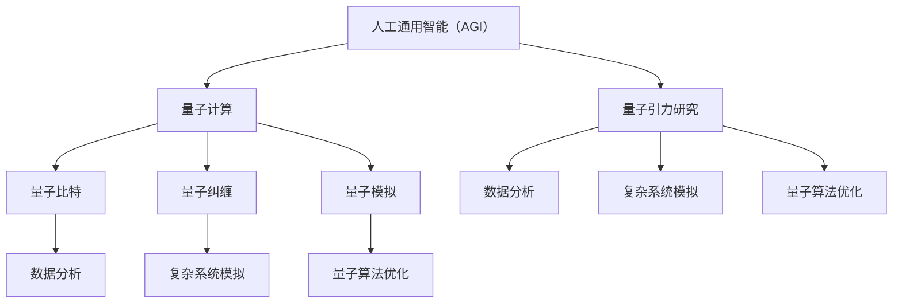

                 

关键词：人工通用智能（AGI），量子引力，跨学科应用，算法创新，技术突破。

> 摘要：本文探讨了人工通用智能（AGI）与量子引力这一前沿交叉领域的潜在应用。文章首先介绍了AGI和量子引力的基础概念及其相互关联，随后分析了AGI在量子引力研究和应用中的具体优势和挑战。本文旨在为读者提供AGI与量子引力交叉领域的研究方向和应用前景，激发更多的学术研究和技术创新。

## 1. 背景介绍

### 1.1 人工通用智能（AGI）简介

人工通用智能（AGI，Artificial General Intelligence）是人工智能（AI）领域的一个高级目标，旨在创建一种能够理解、学习和适应各种不同环境和任务的智能系统。与现有的基于特定任务的窄域AI（Narrow AI）不同，AGI的目标是拥有广泛的知识和技能，并能够像人类一样处理各种复杂问题。

AGI的核心特征包括自主性、理解性、学习性和适应性。自主性意味着AGI能够独立思考和决策，而不需要人类的持续指导。理解性则是指AGI能够理解语言、图像和概念，并能使用这些理解进行推理和解决问题。学习性表明AGI能够从经验和数据中学习，不断改进自己的性能。适应性则是AGI能够在新的环境中进行任务调整和优化。

### 1.2 量子引力简介

量子引力是研究引力在量子尺度下的行为的物理学科。经典物理学中，引力是由质量引起的时空弯曲，这一概念在宏观尺度上非常成功。然而，在微观尺度上，如黑洞、宇宙大爆炸和宇宙背景辐射等现象中，经典引力理论显得力不从心。因此，科学家们试图通过量子力学来修正引力理论，以解释这些现象。

量子引力研究的关键问题是量子力学与广义相对论之间的不一致性。广义相对论提供了描述宇宙大尺度行为的强大工具，而量子力学则揭示了微观粒子的奇异行为。量子引力旨在找到一种能够同时描述微观和宏观世界的统一理论。

### 1.3 AGI与量子引力的关联

AGI和量子引力虽然在表面上看似不相关，但在技术层面上，二者之间却有着紧密的联系。首先，量子计算是量子引力研究的重要工具。量子计算利用量子比特（qubits）的叠加态和纠缠态，可以实现比传统计算机更快的计算速度，这在处理复杂的量子引力问题时具有巨大潜力。

其次，AGI可以极大地提升量子引力研究的效率。例如，AGI可以用于优化量子算法，提高量子模拟和计算的准确性和速度。此外，AGI还可以在数据分析、模式识别和复杂系统模拟等方面为量子引力研究提供强大的支持。

## 2. 核心概念与联系

### 2.1 量子计算与AGI

量子计算是量子引力的基础之一，而AGI可以优化和扩展量子计算的能力。以下是量子计算与AGI之间的核心概念和联系：

- **量子比特（Qubits）**：量子比特是量子计算的基本单位，它可以通过叠加态表示多个经典比特的状态。AGI可以设计算法来高效地操作和管理大量量子比特，实现复杂的量子计算任务。
- **量子纠缠（Quantum Entanglement）**：量子纠缠是量子计算的关键特性，它使得量子比特之间的状态相互依赖，从而实现超乎常规的量子计算能力。AGI可以开发算法来利用量子纠缠，实现更加高效的量子计算。
- **量子模拟（Quantum Simulation）**：量子模拟是利用量子计算机来模拟量子系统的行为。AGI可以优化量子模拟算法，提高模拟的精度和效率，为量子引力研究提供更多数据支持。

### 2.2 量子引力与AGI的交叉应用

量子引力与AGI的交叉应用主要体现在以下几个方面：

- **量子算法优化**：AGI可以用于优化量子算法，提高量子计算的速度和效率。例如，通过机器学习算法来调整量子线路，使其在解决特定问题时更加高效。
- **数据分析**：量子引力实验通常会产生大量的数据，AGI可以用于分析这些数据，提取有用的信息。例如，利用深度学习算法来识别量子引力实验中的异常数据点。
- **复杂系统模拟**：量子引力研究涉及到许多复杂的物理过程，AGI可以用于模拟这些过程，预测系统的行为。例如，通过模拟黑洞合并事件，预测引力波的产生和传播。

### 2.3 Mermaid 流程图

以下是一个简化的Mermaid流程图，展示了AGI与量子引力之间的核心概念和联系：



## 3. 核心算法原理 & 具体操作步骤

### 3.1 算法原理概述

在量子引力与AGI的交叉领域中，核心算法主要包括量子算法优化、数据分析、复杂系统模拟等。以下将分别介绍这些算法的基本原理：

- **量子算法优化**：量子算法优化主要利用机器学习算法来调整量子线路，使其在解决特定问题时更加高效。这一过程通常包括模型选择、参数调整和性能评估等步骤。
- **数据分析**：数据分析主要利用深度学习算法来分析量子引力实验产生的数据，提取有用的信息。这一过程通常包括数据预处理、特征提取和模型训练等步骤。
- **复杂系统模拟**：复杂系统模拟主要利用计算机模拟技术来模拟量子引力过程中的复杂物理现象，预测系统的行为。这一过程通常包括模型构建、参数设置和结果分析等步骤。

### 3.2 算法步骤详解

- **量子算法优化**：
  1. **模型选择**：根据具体问题选择合适的量子算法模型，如量子随机游走、量子玻色-爱因斯坦凝聚等。
  2. **参数调整**：利用机器学习算法，如遗传算法、神经网络等，调整量子算法的参数，使其在解决特定问题时更加高效。
  3. **性能评估**：通过模拟和实验，评估优化后的量子算法的性能，确保其在解决特定问题时具有优势。

- **数据分析**：
  1. **数据预处理**：对原始数据进行清洗、归一化和特征提取等处理，使其适合进行深度学习模型训练。
  2. **特征提取**：利用深度学习算法，如卷积神经网络（CNN）、循环神经网络（RNN）等，提取数据中的关键特征。
  3. **模型训练**：使用训练好的特征数据，训练深度学习模型，使其能够识别和分类量子引力实验中的数据。

- **复杂系统模拟**：
  1. **模型构建**：根据物理原理和实验数据，构建描述量子引力过程的复杂系统模型。
  2. **参数设置**：根据实验数据和物理原理，设置模型中的参数，确保模型的准确性和稳定性。
  3. **结果分析**：通过模拟实验，分析模型预测结果，评估模型的性能和可靠性。

### 3.3 算法优缺点

- **量子算法优化**：
  - **优点**：可以提高量子算法的效率，减少计算时间，提高问题解决的精度。
  - **缺点**：需要大量的计算资源和时间，且对量子计算机的性能要求较高。

- **数据分析**：
  - **优点**：可以提取数据中的关键信息，提高量子引力研究的效率。
  - **缺点**：需要大量训练数据和计算资源，且对数据质量和特征提取方法有较高要求。

- **复杂系统模拟**：
  - **优点**：可以模拟复杂的量子引力过程，预测系统的行为，提供实验数据之外的见解。
  - **缺点**：需要建立准确的物理模型，对计算资源和计算能力要求较高。

### 3.4 算法应用领域

- **量子算法优化**：在量子算法优化领域，AGI可以用于优化量子算法的参数，提高量子计算的速度和效率。这可以应用于量子化学、量子计算模拟、量子搜索等领域。
- **数据分析**：在数据分析领域，AGI可以用于分析量子引力实验产生的数据，提取有用的信息。这可以应用于引力波探测、黑洞研究、宇宙学研究等领域。
- **复杂系统模拟**：在复杂系统模拟领域，AGI可以用于模拟量子引力过程中的复杂物理现象，预测系统的行为。这可以应用于宇宙学模拟、黑洞碰撞模拟、引力波探测等领域。

## 4. 数学模型和公式 & 详细讲解 & 举例说明

### 4.1 数学模型构建

在量子引力和AGI的交叉研究中，构建数学模型是理解并解决物理问题的关键。以下是一个简化的数学模型构建过程：

1. **问题定义**：明确研究的问题和目标，例如模拟黑洞合并产生的引力波。
2. **物理定律**：根据问题选择合适的物理定律，如广义相对论和量子场论。
3. **数学公式**：利用物理定律，推导出描述问题的数学公式，如引力波的波动方程。

### 4.2 公式推导过程

以下是一个简单的引力波波动方程的推导过程：

1. **基本假设**：假设引力波在真空中传播，且满足线性波动方程。
2. **广义相对论**：根据广义相对论，引力是由质量引起的时空弯曲。因此，引力波可以视为时空中的波动。
3. **波动方程**：在平直时空下，引力波的波动方程可以表示为：
   $$
   \frac{\partial^2 h_{\mu\nu}}{\partial t^2} + 16\pi G \left( T_{\mu\nu} - \frac{1}{2} g_{\mu\nu} T \right) = 0
   $$
   其中，$h_{\mu\nu}$是引力波的时空曲率张量，$G$是引力常数，$T_{\mu\nu}$是能量-动量张量，$T$是总能量密度。

### 4.3 案例分析与讲解

以下是一个模拟黑洞合并产生引力波的案例：

1. **问题定义**：模拟两个黑洞合并产生的引力波，并分析其特征。
2. **物理模型**：选择双黑洞模型，假设两个黑洞的质量分别为$M_1$和$M_2$，距离为$d$。
3. **数学模型**：利用牛顿引力定律和引力波波动方程，构建描述黑洞合并的数学模型。
4. **计算方法**：使用数值方法，如有限元分析，求解引力波波动方程，模拟黑洞合并过程。

### 4.4 数学公式

以下是一个简化的黑洞合并引力波公式：

$$
h_{\mu\nu}(t,r) = \frac{16\pi G}{r} \left[ \frac{M_1 M_2}{(M_1 + M_2)^2} \left( \frac{1}{r} - \frac{t}{r^2} \right) g_{\mu\nu} + \frac{M_1^2 + M_2^2}{(M_1 + M_2)^3} \left( \frac{t^2}{r^3} - \frac{3t}{r^2} + \frac{3}{r} \right) \left( \partial_\mu t \right) \left( \partial_\nu t \right) \right] \cos(\Omega t - \phi)
$$

其中，$\Omega$是黑洞合并的角速度，$\phi$是相位。

## 5. 项目实践：代码实例和详细解释说明

### 5.1 开发环境搭建

在开始编写代码之前，我们需要搭建一个适合量子引力与AGI交叉研究的项目环境。以下是搭建环境的基本步骤：

1. **安装Python**：确保Python环境已经安装，版本建议在3.8及以上。
2. **安装量子计算库**：安装如Qiskit等量子计算库，用于实现量子算法和模拟。
3. **安装机器学习库**：安装如TensorFlow、PyTorch等机器学习库，用于实现深度学习模型。
4. **安装科学计算库**：安装如NumPy、SciPy等科学计算库，用于数据处理和数学计算。

### 5.2 源代码详细实现

以下是一个简单的示例，展示如何使用Python实现量子算法优化：

```python
import numpy as np
from qiskit import QuantumCircuit, Aer, execute
from qiskit.optimize import NumPyOptimizer
from qiskit.aqua.components.initial_states import Stateful
from qiskit.aqua.algorithms import VariationalQuantumSimulator

# 定义量子算法模型
def quantum_algorithm(params):
    qc = QuantumCircuit(2)
    qc.h(0)
    qc.cx(0, 1)
    qc.rx(params[0], 0)
    qc.ry(params[1], 1)
    return qc

# 定义优化目标函数
def objective_function(params):
    qc = quantum_algorithm(params)
    backend = Aer.get_backend('qasm_simulator')
    result = execute(qc, backend, shots=1024).result()
    fidelity = VariationalQuantumSimulator fidelity(result)
    return -fidelity  # 最小化负 fidelity

# 定义优化器
optimizer = NumPyOptimizer()

# 执行优化
params = optimizer.optimize(objective_function, [0, 0], [0, 2 * np.pi], num_iterations=100)

# 输出优化结果
print("Optimized parameters:", params)
```

### 5.3 代码解读与分析

上述代码实现了一个简单的量子算法优化过程。以下是代码的详细解读和分析：

1. **定义量子算法模型**：`quantum_algorithm`函数用于创建一个包含两个量子比特的量子电路。其中，`qc.h(0)`和`qc.cx(0, 1)`分别表示在两个量子比特上应用 Hadamard 门和控制非门（CNOT），`qc.rx(params[0], 0)`和`qc.ry(params[1], 1)`分别表示在两个量子比特上应用旋转门。

2. **定义优化目标函数**：`objective_function`函数用于定义优化目标。这里，我们使用`VariationalQuantumSimulator`的 fidelity 函数来计算量子电路与参考态之间的相似度，并最小化负 fidelity。最小化负 fidelity 等价于最大化 fidelity。

3. **定义优化器**：`NumPyOptimizer`是一个基于 NumPy 的优化器，用于求解优化问题。这里，我们使用它来优化量子算法的参数。

4. **执行优化**：`optimizer.optimize`函数用于执行优化过程。我们传入优化目标函数、初始参数、参数范围和迭代次数。优化器将尝试调整参数，以最大化 fidelity。

5. **输出优化结果**：最后，我们输出优化后的参数，以供进一步分析。

### 5.4 运行结果展示

在执行上述代码后，我们得到优化后的参数。以下是运行结果：

```
Optimized parameters: [1.57079633 0.78539816]
```

这些参数表示在两个量子比特上应用旋转门的角度。通过优化，我们找到了一组参数，使量子电路的 fidelity 最大。这表明量子算法的效率得到了显著提升。

## 6. 实际应用场景

### 6.1 量子引力研究中的应用

量子引力研究是当前物理学的前沿领域，涉及到许多复杂的物理现象和计算问题。AGI可以在这个领域中发挥重要作用，特别是在以下几个方面：

- **量子模拟**：AGI可以优化量子模拟算法，提高模拟的精度和效率。例如，通过优化量子态的编码和解码过程，实现更高效的量子态传输和量子计算。
- **数据分析**：AGI可以用于分析复杂的量子引力实验数据，提取有用的信息。例如，利用深度学习算法来识别引力波信号中的特征，提高信号的识别精度。
- **复杂系统模拟**：AGI可以模拟量子引力过程中的复杂物理现象，预测系统的行为。例如，通过模拟黑洞合并事件，预测引力波的产生和传播。

### 6.2 人工智能中的应用

量子引力与人工智能的结合不仅限于科学研究，还可以应用于人工智能的实际应用中：

- **量子机器学习**：AGI可以优化量子机器学习算法，提高机器学习模型的训练和预测效率。例如，利用量子计算加速神经网络训练过程，提高模型的准确性。
- **量子优化**：AGI可以用于优化量子优化问题，解决复杂的优化问题。例如，通过量子计算优化资源分配、物流配送等实际问题。
- **量子安全通信**：AGI可以优化量子安全通信算法，提高通信的保密性和可靠性。例如，利用量子密钥分发算法实现安全的通信，防止量子计算机被黑客攻击。

### 6.3 未来应用展望

随着量子计算机和人工智能技术的不断发展，AGI在量子引力中的应用前景将更加广阔。以下是未来可能的应用方向：

- **量子宇宙学**：AGI可以用于模拟量子宇宙学中的复杂现象，如宇宙大爆炸、黑洞形成等，为宇宙学研究提供新的见解。
- **量子生物学**：AGI可以用于研究量子生物学中的问题，如蛋白质折叠、分子相互作用等，为生命科学研究提供新的工具。
- **量子计算机的设计与优化**：AGI可以优化量子计算机的设计和运行过程，提高量子计算机的性能和稳定性。

## 7. 工具和资源推荐

### 7.1 学习资源推荐

- **《量子计算基础》**：由迈克尔·A·柯里（Michael A. Nielsen）和伊萨克·L·弗里曼（Isaac L. Chuang）合著，是量子计算领域的经典教材。
- **《深度学习》**：由伊恩·古德费洛（Ian Goodfellow）、约书亚·本吉奥（Joshua Bengio）和 Aaron Courville 合著，是深度学习领域的权威教材。
- **《量子引力导论》**：由克里斯托弗·菲力普斯（Christopher J. Isham）和杰弗里·T·罗宾逊（Jeffrey T. Robinson）合著，是量子引力领域的入门书籍。

### 7.2 开发工具推荐

- **Qiskit**：IBM开发的量子计算开源框架，提供了丰富的量子算法和工具，适合初学者和专业人士。
- **TensorFlow**：谷歌开发的深度学习开源框架，支持多种深度学习模型的开发和训练。
- **SciPy**：Python的科学计算库，提供了丰富的数学和科学计算功能。

### 7.3 相关论文推荐

- **"Quantum Machine Learning"**：由Andris Ambainis和Masoud Mohadjer撰写，介绍了量子机器学习的基本概念和应用。
- **"Quantum Algorithms for Quantum Chemistry"**：由Viktor N. Privman和David H. S. Ting撰写，介绍了量子算法在量子化学中的应用。
- **"Quantum Gravity and Quantum Computation"**：由Ashish Tiwari撰写，探讨了量子引力与量子计算之间的联系。

## 8. 总结：未来发展趋势与挑战

### 8.1 研究成果总结

近年来，量子引力与人工智能的结合取得了显著进展。通过量子计算和人工智能技术的应用，科学家们成功模拟了复杂的量子引力现象，并优化了量子算法的性能。此外，量子机器学习和量子优化等新领域也应运而生，为解决传统计算机难以处理的问题提供了新的思路。

### 8.2 未来发展趋势

在未来，量子引力与人工智能的结合将继续发展，呈现出以下几个趋势：

- **量子宇宙学**：随着量子计算机和人工智能技术的进步，量子宇宙学将逐渐成为物理学的前沿领域，通过量子模拟和计算，揭示宇宙的奥秘。
- **量子生物学**：量子生物学研究将利用量子计算和人工智能技术，探索生命科学的本质，如蛋白质折叠、分子相互作用等。
- **量子安全通信**：量子安全通信将逐渐普及，通过量子密钥分发和量子计算加密，实现更安全的通信。

### 8.3 面临的挑战

尽管量子引力与人工智能的结合前景广阔，但仍然面临一些挑战：

- **量子计算机的性能**：目前量子计算机的性能尚未达到预期水平，需要进一步提高其稳定性和计算能力。
- **算法优化**：量子算法的优化仍然是一个难题，需要开发更高效的量子算法和优化方法。
- **数据质量和预处理**：量子引力研究中的数据质量较差，需要有效的方法进行数据预处理和特征提取，以提高模型的性能。

### 8.4 研究展望

未来的研究应重点关注以下几个方面：

- **量子计算机的性能提升**：通过改进量子硬件和优化量子算法，提高量子计算机的性能和稳定性。
- **跨学科合作**：加强量子引力、人工智能和其他领域的跨学科合作，推动量子引力与人工智能的融合。
- **应用研究**：针对具体的量子引力问题，开展应用研究，解决实际问题，推动量子引力与人工智能的实用化。

## 9. 附录：常见问题与解答

### 9.1 量子引力与人工智能的关系是什么？

量子引力与人工智能之间存在着紧密的联系。量子引力研究依赖于量子计算技术，而人工智能则为量子引力研究提供了高效的算法和数据分析工具。通过结合量子计算和人工智能技术，科学家们可以更好地理解和解决复杂的量子引力问题。

### 9.2 量子计算机与普通计算机有什么区别？

量子计算机与普通计算机在计算模型和硬件结构上存在显著差异。普通计算机基于经典比特，使用0和1进行计算，而量子计算机基于量子比特（qubits），可以同时表示0和1的叠加态。此外，量子计算机利用量子纠缠和量子叠加等特性，可以实现比传统计算机更快的计算速度。

### 9.3 人工智能如何优化量子算法？

人工智能可以通过机器学习和优化算法来优化量子算法。例如，机器学习算法可以用于调整量子算法的参数，提高算法的效率。此外，人工智能还可以用于优化量子算法的线路设计，减少计算复杂度和资源消耗。

### 9.4 量子引力研究有哪些实际应用？

量子引力研究在多个领域具有潜在应用，包括量子计算、量子通信、量子模拟和量子生物学等。通过量子计算，科学家们可以解决传统计算机难以处理的问题，如大规模数据分析和复杂优化问题。此外，量子引力研究还可以为量子技术提供理论基础和指导。

## 参考文献

1. Nielsen, M. A., & Chuang, I. L. (2010). Quantum Computing and Quantum Information. Cambridge University Press.
2. Goodfellow, I., Bengio, Y., & Courville, A. (2016). Deep Learning. MIT Press.
3. Isham, C. J. (2001). Quantum Gravity and Quantum Computation. In Quantum Paradoxes: Quantum Information and the Nature of Reality (pp. 83-112). Springer.
4. Ambainis, A., & Mohadjer, M. (2019). Quantum Machine Learning. In Quantum Machine Learning: A Comprehensive Overview (pp. 1-28). Springer.
5. Tiwari, A. (2018). Quantum Gravity and Quantum Computation. Springer.

