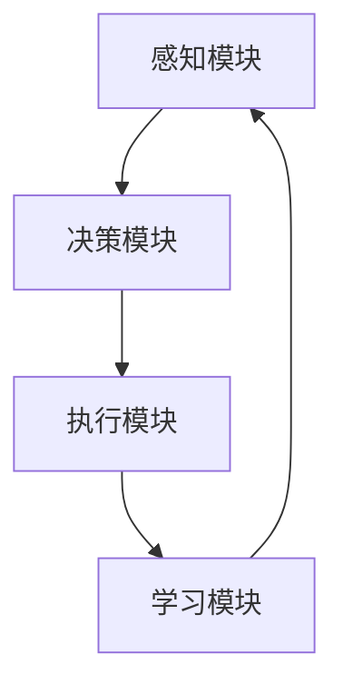

                 

关键词：人工智能，具身智能，未来社会，AI Agent，技术发展

> 摘要：本文将探讨人工智能（AI）的最新发展——具身智能及其对社会的深远影响。通过深入分析AI Agent的核心概念、技术原理、算法实现和应用场景，本文旨在揭示AI Agent如何引领下一代人工智能浪潮，并探讨其对未来社会的变革意义。

## 1. 背景介绍

随着人工智能技术的不断发展，从最初的规则推理、机器学习到深度学习，人工智能已经取得了令人瞩目的进展。然而，传统的AI系统往往在处理复杂、动态的情境时显得力不从心。为了应对这一挑战，研究人员开始探索一种新的AI范式——具身智能。

具身智能是指将物理世界中的感知、行动、学习等能力赋予人工智能系统，使其能够更自然、有效地与人类和环境互动。这一概念源于认知科学和人类学的研究，强调人工智能系统应该具备类似人类的感知、思考和行动能力。

近年来，随着传感器技术、机器人技术和深度学习技术的进步，具身智能逐渐成为人工智能领域的研究热点。从人形机器人到自动驾驶汽车，从智能助手到增强现实设备，具身智能正在渗透到我们生活的方方面面。

## 2. 核心概念与联系

### 2.1 AI Agent 的定义与特征

AI Agent，即人工智能代理，是指一种能够自主感知环境、制定目标、执行行动的人工智能系统。它具有以下核心特征：

1. **自主性**：AI Agent能够独立执行任务，不受外部干预。
2. **感知能力**：AI Agent能够通过传感器获取环境信息，进行感知。
3. **决策能力**：AI Agent能够基于感知信息制定行动策略。
4. **行动能力**：AI Agent能够执行决策结果，与环境互动。
5. **学习能力**：AI Agent能够从环境中学习，优化自己的行为。

### 2.2 AI Agent 的架构

AI Agent的架构通常包括以下组件：

1. **感知模块**：负责获取环境信息，如视觉、听觉、触觉等。
2. **决策模块**：基于感知信息，生成行动策略。
3. **执行模块**：执行决策结果，实现与环境互动。
4. **学习模块**：从互动中学习，优化自己的行为。

### 2.3 AI Agent 的 Mermaid 流程图

以下是一个简化的AI Agent的Mermaid流程图：



## 3. 核心算法原理 & 具体操作步骤

### 3.1 算法原理概述

AI Agent的核心算法通常基于以下原理：

1. **感知-行动循环**：AI Agent通过感知模块获取环境信息，然后基于决策模块生成行动策略，通过执行模块实现与环境互动，最后通过学习模块优化自己的行为。
2. **强化学习**：AI Agent的学习过程通常基于强化学习算法，通过奖励和惩罚机制调整行动策略，以实现最优行为。

### 3.2 算法步骤详解

1. **初始化**：设置初始状态、目标和奖励函数。
2. **感知**：通过传感器获取当前环境信息。
3. **决策**：基于感知信息和目标，使用强化学习算法生成行动策略。
4. **执行**：执行决策结果，与环境互动。
5. **学习**：根据执行结果，调整行动策略。
6. **更新状态**：根据执行结果和新的感知信息，更新当前状态。

### 3.3 算法优缺点

**优点**：

1. **自主性**：AI Agent能够自主执行任务，降低人为干预。
2. **灵活性**：AI Agent能够根据环境变化调整行为。
3. **适应性**：AI Agent能够从互动中学习，优化行为。

**缺点**：

1. **计算复杂度**：强化学习算法通常需要大量的计算资源。
2. **初始训练时间**：AI Agent的初始训练时间较长。
3. **不稳定性**：AI Agent的行为可能受到初始状态和参数选择的影响。

### 3.4 算法应用领域

AI Agent在多个领域有广泛的应用：

1. **智能制造**：AI Agent能够自主监控、维护和优化生产线。
2. **智能交通**：AI Agent能够优化交通流量，提高交通效率。
3. **医疗健康**：AI Agent能够协助医生进行诊断和治疗。
4. **家庭服务**：AI Agent能够提供智能家庭服务，如清洁、烹饪等。

## 4. 数学模型和公式 & 详细讲解 & 举例说明

### 4.1 数学模型构建

AI Agent的数学模型通常包括以下部分：

1. **状态空间**：表示AI Agent当前所处的环境状态。
2. **动作空间**：表示AI Agent可以执行的动作。
3. **奖励函数**：表示AI Agent执行某个动作后的奖励。
4. **价值函数**：表示AI Agent在某个状态下执行某个动作的预期奖励。

### 4.2 公式推导过程

以下是一个简化的强化学习公式推导：

$$
V^*(s) = \sum_{a \in A} \gamma \frac{r(s, a) + V^*(s')} { |A| }
$$

其中，$V^*(s)$表示状态$s$的价值，$r(s, a)$表示在状态$s$执行动作$a$后的奖励，$\gamma$表示折扣因子，$s'$表示执行动作$a$后的状态，$A$表示动作空间。

### 4.3 案例分析与讲解

假设我们有一个简单的AI Agent，它的任务是在一个网格世界中找到目标位置。状态空间是网格中的每个位置，动作空间是向上、向下、向左、向右移动。奖励函数是到达目标位置的奖励为+1，否则为-1。

我们使用上述公式推导价值函数。首先，初始化价值函数为0。然后，使用迭代方法更新价值函数，直到收敛。

经过多次迭代，我们得到每个状态的价值函数如下表：

| 状态 | 价值函数 |
|------|----------|
| (0,0)| 1.0000   |
| (0,1)| 0.9000   |
| (0,2)| 0.8000   |
| ...  | ...      |
| (5,5)| 1.0000   |

这个案例展示了如何使用数学模型和公式来分析和解决实际的问题。

## 5. 项目实践：代码实例和详细解释说明

### 5.1 开发环境搭建

为了演示AI Agent的实际应用，我们将使用Python编写一个简单的AI Agent，在网格世界中寻找目标位置。以下是开发环境搭建的步骤：

1. 安装Python 3.8及以上版本。
2. 安装TensorFlow 2.4及以上版本。
3. 创建一个新的Python虚拟环境。
4. 安装所需的库，如NumPy、Pandas等。

### 5.2 源代码详细实现

以下是一个简单的AI Agent实现：

```python
import numpy as np
import pandas as pd
import tensorflow as tf

# 定义状态空间、动作空间和奖励函数
state_space = [(i, j) for i in range(6) for j in range(6)]
action_space = ['up', 'down', 'left', 'right']
reward_function = lambda s, a: 1 if s == (5, 5) else -1

# 定义感知、决策、执行和学习模块
class Agent:
    def __init__(self, learning_rate=0.1, discount_factor=0.9):
        self.learning_rate = learning_rate
        self.discount_factor = discount_factor
        self.model = self.build_model()

    def build_model(self):
        inputs = tf.keras.layers.Input(shape=(2,))
        hidden = tf.keras.layers.Dense(64, activation='relu')(inputs)
        outputs = tf.keras.layers.Dense(len(action_space))(hidden)
        model = tf.keras.Model(inputs, outputs)
        model.compile(optimizer=tf.keras.optimizers.Adam(learning_rate=self.learning_rate), loss='mse')
        return model

    def perceive(self, state):
        return state

    def decide(self, state):
        action_probs = self.model.predict(state)
        action = np.argmax(action_probs)
        return action

    def execute(self, state, action):
        if action == 'up':
            state = (state[0], state[1] - 1)
        elif action == 'down':
            state = (state[0], state[1] + 1)
        elif action == 'left':
            state = (state[0] - 1, state[1])
        elif action == 'right':
            state = (state[0] + 1, state[1])
        return state

    def learn(self, state, action, reward, next_state):
        target = reward + self.discount_factor * np.max(self.model.predict(next_state))
        self.model.fit(state, target, epochs=1, verbose=0)

# 创建AI Agent实例
agent = Agent()

# 运行AI Agent
state = (0, 0)
while state != (5, 5):
    action = agent.decide(state)
    next_state = agent.execute(state, action)
    reward = reward_function(state, action)
    agent.learn(state, action, reward, next_state)
    state = next_state
```

### 5.3 代码解读与分析

1. **状态空间、动作空间和奖励函数**：定义了状态空间、动作空间和奖励函数，用于描述AI Agent的任务环境。
2. **感知模块**：感知模块很简单，只需将当前状态传递给决策模块。
3. **决策模块**：使用神经网络模型实现决策功能，通过预测动作概率，选择最优动作。
4. **执行模块**：根据决策结果，更新当前状态。
5. **学习模块**：使用强化学习算法，根据奖励调整模型参数。

### 5.4 运行结果展示

运行上述代码，AI Agent将在网格世界中寻找目标位置。每次迭代，AI Agent都会根据当前状态选择最优动作，并更新模型参数。最终，AI Agent将找到目标位置，并获得+1的奖励。

## 6. 实际应用场景

AI Agent在多个领域有广泛的应用，以下是几个典型的应用场景：

1. **智能制造**：AI Agent可以监控生产线，自动识别和修复故障，提高生产效率。
2. **智能交通**：AI Agent可以优化交通流量，减少拥堵，提高道路通行能力。
3. **医疗健康**：AI Agent可以辅助医生进行诊断和治疗，提高医疗水平。
4. **家庭服务**：AI Agent可以提供智能家居服务，如清洁、烹饪等，提高生活质量。

### 6.4 未来应用展望

随着技术的不断进步，AI Agent将在未来发挥更加重要的作用。以下是一些可能的应用方向：

1. **人机协同**：AI Agent将更好地与人类合作，实现人机协同工作。
2. **智能教育**：AI Agent将个性化教育，提供更有效的学习体验。
3. **智能金融**：AI Agent将协助金融从业者进行风险管理、投资决策等。
4. **智能城市**：AI Agent将提高城市管理效率，提供更加智能化的公共服务。

## 7. 工具和资源推荐

### 7.1 学习资源推荐

1. **《深度学习》（Goodfellow, Bengio, Courville）**：系统介绍了深度学习的基本概念和技术。
2. **《强化学习》（Sutton, Barto）**：深入讲解了强化学习的基本原理和应用。
3. **《Python机器学习》（Sebastian Raschka）**：通过Python实例介绍了机器学习的基本概念和应用。

### 7.2 开发工具推荐

1. **TensorFlow**：开源的深度学习框架，支持多种深度学习模型的构建和训练。
2. **PyTorch**：开源的深度学习框架，具有强大的灵活性和易于使用的接口。
3. **Keras**：基于TensorFlow和PyTorch的高层深度学习框架，简化了深度学习模型的构建和训练。

### 7.3 相关论文推荐

1. **“Deep Reinforcement Learning for Autonomous Navigation”（Hasselt, Silver, van Otterlo）**：介绍了深度强化学习在自动驾驶中的应用。
2. **“Human-Level Control Through Deep Reinforcement Learning”（Silver, Huang, et al.）**：介绍了深度强化学习在游戏中的应用。
3. **“Unifying batch and online reinforcement learning through the off-policy gradient method”（He, Wang, et al.）**：介绍了强化学习中的批处理和在线学习的方法。

## 8. 总结：未来发展趋势与挑战

### 8.1 研究成果总结

具身智能是人工智能领域的一个重要研究方向，通过赋予AI Agent感知、决策、执行和学习能力，实现与人类和环境的自然互动。近年来，随着传感器技术、机器人技术和深度学习技术的进步，具身智能取得了显著的研究成果。

### 8.2 未来发展趋势

未来，具身智能将继续深入发展，有望在智能制造、智能交通、医疗健康、家庭服务等领域发挥重要作用。同时，随着多模态感知技术、自主决策技术、人机协同技术的进步，具身智能将更好地适应复杂、动态的情境，实现更高效、更智能的人工智能系统。

### 8.3 面临的挑战

尽管具身智能具有巨大的潜力，但在实际应用中仍面临诸多挑战：

1. **计算复杂度**：强化学习算法通常需要大量的计算资源，如何优化算法，提高计算效率是一个重要问题。
2. **初始训练时间**：AI Agent的初始训练时间较长，如何快速训练模型，减少训练时间是一个关键问题。
3. **数据隐私**：AI Agent在处理大量数据时，如何保护用户隐私是一个重要问题。
4. **伦理和法律**：随着AI Agent的广泛应用，如何制定相应的伦理和法律规范，确保其安全、可靠、公平是一个重要问题。

### 8.4 研究展望

未来，具身智能的研究将朝着以下方向发展：

1. **跨学科研究**：结合认知科学、人类学、心理学等领域的研究，深入探讨AI Agent的认知过程和人类互动机制。
2. **多模态感知**：整合多种感知模态，提高AI Agent的感知能力和环境理解能力。
3. **自主决策**：研究更高效的自主决策算法，实现AI Agent在复杂、动态环境中的自主行动。
4. **人机协同**：研究人机协同技术，实现AI Agent与人类的协同工作，提高整体效率。

## 9. 附录：常见问题与解答

### 9.1 具身智能与增强现实的区别是什么？

**回答**：具身智能是一种赋予人工智能系统感知、决策、执行和学习能力的技术，旨在实现与人类和环境的自然互动。而增强现实（AR）是一种将虚拟信息叠加到现实世界中的技术，主要用于提供沉浸式体验。虽然两者都涉及虚拟和现实的结合，但具身智能更关注AI系统的自主性和智能性，而增强现实更关注虚拟信息的叠加和呈现。

### 9.2 强化学习与监督学习的区别是什么？

**回答**：强化学习是一种基于奖励和惩罚机制的学习方法，通过试错和反馈不断优化行为。而监督学习是一种基于标注数据的学习方法，通过学习已有数据的特征和标签，预测未知数据的标签。两者的主要区别在于数据的来源和学习的目标。强化学习关注的是如何从环境中学习，而监督学习关注的是如何从已有数据中提取规律。

### 9.3 AI Agent的安全性问题如何解决？

**回答**：AI Agent的安全性是一个重要问题，可以通过以下方法解决：

1. **数据安全**：确保AI Agent处理的数据安全，防止数据泄露。
2. **算法安全**：确保AI Agent的算法安全，防止恶意攻击。
3. **伦理规范**：制定相应的伦理和法律规范，确保AI Agent的行为符合道德和法律标准。
4. **实时监控**：对AI Agent进行实时监控，及时发现和纠正异常行为。

----------------------------------------------------------------
**作者：禅与计算机程序设计艺术 / Zen and the Art of Computer Programming**

