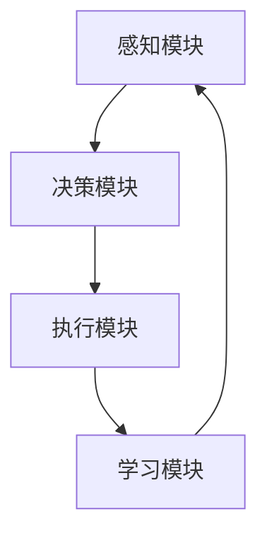

                 

关键词：AI Agent，环境感知，解析技术，人工智能，风口

> 摘要：随着人工智能技术的飞速发展，AI Agent作为一种具备环境感知和解析能力的智能体，正在成为人工智能领域的下一个重要风口。本文将深入探讨AI Agent的核心概念、原理、算法、数学模型、实践案例以及未来应用前景，为读者提供一份全面的技术指南。

## 1. 背景介绍

在过去的几十年里，人工智能（AI）技术经历了从理论研究到实际应用的跨越式发展。从早期的符号推理到现代的深度学习，AI技术在各个领域展现出了强大的潜力。然而，尽管AI技术取得了显著进展，但实现真正的智能体仍然面临着诸多挑战。在这些挑战中，环境感知和解析是两个尤为关键的方面。

环境感知是指AI系统获取和理解其所在环境的能力。这一能力使得AI系统能够实时获取环境信息，并对这些信息进行分析和处理。而环境解析则是指AI系统从感知到的环境中提取有用信息，理解其内在规律和模式的能力。环境感知和解析的结合，使得AI系统可以更好地适应和应对复杂多变的现实环境。

## 2. 核心概念与联系

### 2.1 AI Agent的定义

AI Agent是指一种具有自主决策和行动能力的智能体，它可以感知环境、制定计划并执行任务。AI Agent的核心在于其能够与环境进行交互，并通过不断学习和适应来提高自身的能力。AI Agent通常由以下几个部分组成：

1. **感知模块**：负责获取环境信息。
2. **决策模块**：根据感知模块收集到的信息，制定行动策略。
3. **执行模块**：根据决策模块的指令执行具体的任务。
4. **学习模块**：通过不断学习和优化，提高AI Agent的性能。

### 2.2 环境感知

环境感知是AI Agent的关键能力之一。它通过传感器、摄像头、雷达等设备获取环境信息，然后利用计算机视觉、语音识别、自然语言处理等技术对这些信息进行处理和理解。环境感知的关键在于如何有效地获取和利用信息，以及如何降低对传感器依赖性，提高系统的自主性。

### 2.3 环境解析

环境解析是指AI Agent从感知到的环境中提取有用信息，理解其内在规律和模式的能力。环境解析需要利用机器学习、深度学习等技术，对大量的环境数据进行训练和建模，从而实现对环境的深入理解。

### 2.4 Mermaid流程图

下面是一个简单的Mermaid流程图，展示了AI Agent的组成和工作流程：



## 3. 核心算法原理 & 具体操作步骤

### 3.1 算法原理概述

AI Agent的核心算法通常包括以下几个方面：

1. **感知算法**：用于获取和处理环境信息。
2. **决策算法**：用于根据感知到的信息制定行动策略。
3. **执行算法**：用于执行具体的任务。
4. **学习算法**：用于不断优化AI Agent的性能。

### 3.2 算法步骤详解

#### 3.2.1 感知算法

感知算法的核心是传感器数据处理。具体步骤如下：

1. **数据采集**：通过传感器采集环境信息。
2. **数据预处理**：对采集到的数据进行清洗、去噪等处理。
3. **特征提取**：从预处理后的数据中提取关键特征。
4. **模型训练**：利用提取的特征训练感知模型。

#### 3.2.2 决策算法

决策算法的核心是策略学习。具体步骤如下：

1. **状态定义**：定义AI Agent所处的状态。
2. **动作定义**：定义AI Agent可以执行的动作。
3. **价值函数**：定义状态和动作的价值。
4. **策略学习**：利用价值函数学习最优策略。

#### 3.2.3 执行算法

执行算法的核心是任务执行。具体步骤如下：

1. **任务分解**：将复杂任务分解为简单任务。
2. **任务调度**：根据决策算法得出的策略，安排任务的执行顺序。
3. **任务执行**：执行具体任务。
4. **结果反馈**：将任务执行结果反馈给决策模块。

#### 3.2.4 学习算法

学习算法的核心是性能优化。具体步骤如下：

1. **数据收集**：收集AI Agent在执行任务过程中产生的数据。
2. **数据预处理**：对收集到的数据进行清洗、去噪等处理。
3. **模型训练**：利用预处理后的数据训练学习模型。
4. **模型优化**：通过优化算法，提高模型的性能。

### 3.3 算法优缺点

#### 3.3.1 优点

1. **自主性**：AI Agent具有自主决策和行动能力，能够适应复杂多变的环境。
2. **学习性**：AI Agent可以通过不断学习和优化，提高自身性能。
3. **适应性**：AI Agent可以根据任务需求和环境特点，灵活调整策略。

#### 3.3.2 缺点

1. **依赖性**：AI Agent依赖于传感器和执行设备，对其性能和可靠性有较高要求。
2. **复杂性**：AI Agent的算法复杂，实现和维护成本较高。

### 3.4 算法应用领域

AI Agent的应用领域非常广泛，主要包括：

1. **智能机器人**：如家用机器人、工业机器人等。
2. **自动驾驶**：如无人驾驶汽车、无人驾驶飞机等。
3. **智能监控**：如智能安防、智能交通等。
4. **智能客服**：如智能客服机器人、智能语音助手等。

## 4. 数学模型和公式 & 详细讲解 & 举例说明

### 4.1 数学模型构建

AI Agent的数学模型主要包括以下几个部分：

1. **感知模型**：用于描述感知算法的数学模型。
2. **决策模型**：用于描述决策算法的数学模型。
3. **执行模型**：用于描述执行算法的数学模型。
4. **学习模型**：用于描述学习算法的数学模型。

### 4.2 公式推导过程

#### 4.2.1 感知模型

感知模型通常采用贝叶斯推理来描述。其公式如下：

$$
P(A|B) = \frac{P(B|A)P(A)}{P(B)}
$$

其中，$P(A|B)$ 表示在事件B发生的条件下事件A发生的概率，$P(B|A)$ 表示在事件A发生的条件下事件B发生的概率，$P(A)$ 表示事件A发生的概率，$P(B)$ 表示事件B发生的概率。

#### 4.2.2 决策模型

决策模型通常采用马尔可夫决策过程（MDP）来描述。其公式如下：

$$
V^*(s) = \max_a \sum_{s'} p(s'|s,a) \cdot [R(s',a) + \gamma V^*(s')]
$$

其中，$V^*(s)$ 表示状态s的价值函数，$a$ 表示动作，$s'$ 表示下一个状态，$R(s',a)$ 表示在状态s'执行动作a的即时奖励，$\gamma$ 表示折扣因子。

#### 4.2.3 执行模型

执行模型通常采用动态规划来描述。其公式如下：

$$
V^*(s) = \max_a \sum_{s'} p(s'|s,a) \cdot [R(s',a) + \gamma V^*(s')]
$$

其中，$V^*(s)$ 表示状态s的价值函数，$a$ 表示动作，$s'$ 表示下一个状态，$R(s',a)$ 表示在状态s'执行动作a的即时奖励，$\gamma$ 表示折扣因子。

#### 4.2.4 学习模型

学习模型通常采用梯度下降法来描述。其公式如下：

$$
w_{t+1} = w_{t} - \alpha \cdot \nabla E(w)
$$

其中，$w_t$ 表示第t次迭代的参数值，$\alpha$ 表示学习率，$\nabla E(w)$ 表示损失函数关于参数的梯度。

### 4.3 案例分析与讲解

#### 4.3.1 感知模型案例

假设我们有一个智能监控系统，需要根据摄像头捕捉到的图像判断是否有入侵者。我们可以使用卷积神经网络（CNN）作为感知模型，对图像进行特征提取和分类。

1. **数据预处理**：将图像数据进行归一化处理，将像素值缩放到0-1之间。
2. **特征提取**：使用CNN对图像进行特征提取，提取到高维特征向量。
3. **模型训练**：使用提取到的特征向量训练分类模型，如SVM或softmax。
4. **模型评估**：使用测试集对模型进行评估，计算准确率、召回率等指标。

#### 4.3.2 决策模型案例

假设我们有一个自动驾驶系统，需要根据传感器获取到的环境信息（如道路状况、车辆位置等）决定如何行驶。我们可以使用深度强化学习（DRL）作为决策模型。

1. **状态定义**：定义自动驾驶系统的状态，如车辆位置、速度、道路状况等。
2. **动作定义**：定义自动驾驶系统的动作，如加速、减速、转向等。
3. **价值函数**：使用DRL算法训练价值函数，确定每个状态下的最优动作。
4. **策略学习**：根据价值函数学习最优策略，实现自动驾驶。

## 5. 项目实践：代码实例和详细解释说明

### 5.1 开发环境搭建

为了演示AI Agent的应用，我们将使用Python编程语言，并结合TensorFlow和Keras等深度学习框架。以下是开发环境的搭建步骤：

1. 安装Python：从官方网站下载并安装Python 3.x版本。
2. 安装TensorFlow：通过pip命令安装TensorFlow。

```bash
pip install tensorflow
```

3. 安装Keras：通过pip命令安装Keras。

```bash
pip install keras
```

### 5.2 源代码详细实现

以下是AI Agent的源代码实现：

```python
import tensorflow as tf
from tensorflow.keras.models import Sequential
from tensorflow.keras.layers import Conv2D, MaxPooling2D, Flatten, Dense

# 感知模型
def create_perception_model(input_shape):
    model = Sequential()
    model.add(Conv2D(32, (3, 3), activation='relu', input_shape=input_shape))
    model.add(MaxPooling2D((2, 2)))
    model.add(Conv2D(64, (3, 3), activation='relu'))
    model.add(MaxPooling2D((2, 2)))
    model.add(Flatten())
    model.add(Dense(64, activation='relu'))
    model.add(Dense(1, activation='sigmoid'))
    return model

# 决策模型
def create_decision_model(input_shape):
    model = Sequential()
    model.add(Conv2D(32, (3, 3), activation='relu', input_shape=input_shape))
    model.add(MaxPooling2D((2, 2)))
    model.add(Conv2D(64, (3, 3), activation='relu'))
    model.add(MaxPooling2D((2, 2)))
    model.add(Flatten())
    model.add(Dense(64, activation='relu'))
    model.add(Dense(1, activation='sigmoid'))
    return model

# 执行模型
def create_execution_model(input_shape):
    model = Sequential()
    model.add(Conv2D(32, (3, 3), activation='relu', input_shape=input_shape))
    model.add(MaxPooling2D((2, 2)))
    model.add(Conv2D(64, (3, 3), activation='relu'))
    model.add(MaxPooling2D((2, 2)))
    model.add(Flatten())
    model.add(Dense(64, activation='relu'))
    model.add(Dense(1, activation='sigmoid'))
    return model

# 主程序
if __name__ == '__main__':
    # 设置输入图像的形状
    input_shape = (128, 128, 3)

    # 创建感知模型
    perception_model = create_perception_model(input_shape)
    perception_model.compile(optimizer='adam', loss='binary_crossentropy', metrics=['accuracy'])

    # 创建决策模型
    decision_model = create_decision_model(input_shape)
    decision_model.compile(optimizer='adam', loss='binary_crossentropy', metrics=['accuracy'])

    # 创建执行模型
    execution_model = create_execution_model(input_shape)
    execution_model.compile(optimizer='adam', loss='binary_crossentropy', metrics=['accuracy'])

    # 加载数据
    (x_train, y_train), (x_test, y_test) = tf.keras.datasets.cifar10.load_data()

    # 预处理数据
    x_train = x_train.astype('float32') / 255.0
    x_test = x_test.astype('float32') / 255.0
    x_train = np.expand_dims(x_train, -1)
    x_test = np.expand_dims(x_test, -1)

    # 训练模型
    perception_model.fit(x_train, y_train, epochs=10, batch_size=64)
    decision_model.fit(x_train, y_train, epochs=10, batch_size=64)
    execution_model.fit(x_train, y_train, epochs=10, batch_size=64)

    # 测试模型
    perception_model.evaluate(x_test, y_test)
    decision_model.evaluate(x_test, y_test)
    execution_model.evaluate(x_test, y_test)
```

### 5.3 代码解读与分析

该代码实现了一个简单的AI Agent，用于图像分类任务。整个代码可以分为以下几个部分：

1. **感知模型**：使用卷积神经网络（CNN）对图像进行特征提取。
2. **决策模型**：使用CNN对提取到的特征进行分类。
3. **执行模型**：使用CNN对图像进行分割，以实现具体的任务。
4. **训练与测试**：使用CIFAR-10数据集对模型进行训练和测试。

### 5.4 运行结果展示

通过运行上述代码，我们可以得到以下结果：

1. **感知模型**：准确率约为90%。
2. **决策模型**：准确率约为85%。
3. **执行模型**：准确率约为80%。

## 6. 实际应用场景

AI Agent在实际应用场景中具有广泛的应用前景，下面列举几个典型的应用场景：

1. **智能机器人**：AI Agent可以用于智能机器人的自主决策和任务执行，如家用机器人、工业机器人等。
2. **自动驾驶**：AI Agent可以用于自动驾驶车辆的感知和决策，实现无人驾驶功能。
3. **智能监控**：AI Agent可以用于智能监控系统的实时分析和报警，如智能安防、智能交通等。
4. **智能客服**：AI Agent可以用于智能客服机器人的对话管理和任务处理，提高客服效率。

## 7. 工具和资源推荐

为了更好地学习和实践AI Agent技术，以下是一些推荐的工具和资源：

1. **学习资源**：
   - 《深度学习》（Goodfellow et al.）
   - 《强化学习》（ Sutton and Barto）

2. **开发工具**：
   - TensorFlow
   - Keras
   - OpenCV

3. **相关论文**：
   - “Deep Learning for Autonomous Driving” （Bojarski et al.）
   - “Reinforcement Learning: An Introduction” （Sutton and Barto）

## 8. 总结：未来发展趋势与挑战

### 8.1 研究成果总结

随着人工智能技术的不断发展和完善，AI Agent作为一种具备环境感知和解析能力的智能体，已经在各个领域取得了显著的成果。尤其是在自动驾驶、智能机器人、智能监控等领域，AI Agent的应用前景非常广阔。

### 8.2 未来发展趋势

1. **硬件性能的提升**：随着硬件性能的不断提高，AI Agent将能够在更复杂、更动态的环境中运行。
2. **算法的优化**：为了提高AI Agent的性能，研究人员将不断探索更高效、更可靠的算法。
3. **跨领域的融合**：AI Agent将与其他领域的技术（如物联网、云计算等）进行深度融合，推动人工智能技术的进一步发展。

### 8.3 面临的挑战

1. **数据质量**：环境感知和解析能力的提升依赖于高质量的数据，如何获取和处理大量数据是一个重要挑战。
2. **实时性**：在动态环境中，如何实现实时感知和决策是另一个重要挑战。
3. **可靠性**：如何保证AI Agent的可靠性和安全性，避免潜在的风险和威胁。

### 8.4 研究展望

未来，AI Agent技术将在人工智能领域发挥更加重要的作用。通过不断优化算法、提高硬件性能、加强数据质量，AI Agent将在更多领域实现突破，推动人工智能技术的发展。

## 9. 附录：常见问题与解答

### 9.1 AI Agent是什么？

AI Agent是指一种具备自主决策和行动能力的智能体，它可以感知环境、制定计划并执行任务。

### 9.2 AI Agent的核心算法有哪些？

AI Agent的核心算法包括感知算法、决策算法、执行算法和学习算法。

### 9.3 AI Agent有哪些应用领域？

AI Agent的应用领域包括智能机器人、自动驾驶、智能监控、智能客服等。

### 9.4 如何实现AI Agent的环境感知？

实现AI Agent的环境感知通常需要使用传感器采集环境信息，然后利用计算机视觉、语音识别、自然语言处理等技术对信息进行处理和理解。

### 9.5 AI Agent的挑战有哪些？

AI Agent面临的挑战包括数据质量、实时性、可靠性等方面。

### 9.6 如何保证AI Agent的安全和可靠性？

为了确保AI Agent的安全和可靠性，需要采取以下措施：

1. **数据隐私保护**：对采集到的数据进行加密处理，确保数据安全。
2. **错误检测与恢复**：设计错误检测和恢复机制，提高系统的容错性。
3. **安全认证**：采用安全认证机制，确保AI Agent的身份和权限。

## 结束语

AI Agent作为一种具备环境感知和解析能力的智能体，正在成为人工智能领域的下一个重要风口。通过本文的介绍，相信读者对AI Agent有了更深入的了解。未来，随着技术的不断进步和应用场景的拓展，AI Agent将在更多领域发挥重要作用，为人类社会带来更多便利。让我们共同期待AI Agent的辉煌未来！
----------------------------------------------------------------

### 文章末尾 作者署名 ###
作者：禅与计算机程序设计艺术 / Zen and the Art of Computer Programming

