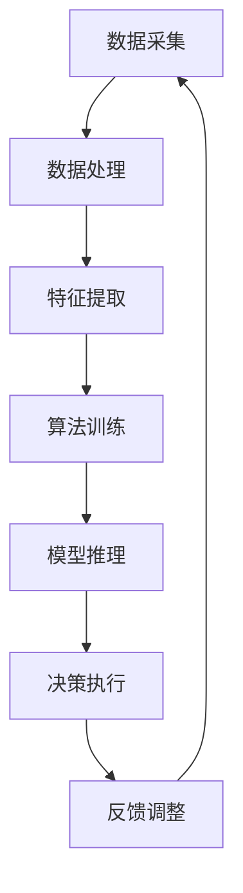

                 

关键词：人工智能、AI Agent、软件角色、硬件配合、计算能力、效率提升、未来趋势

摘要：随着人工智能技术的飞速发展，AI Agent（人工智能代理）作为其核心组成部分，正在逐步成为科技领域的下一个风口。本文将深入探讨AI Agent在软件角色与硬件配合中的作用，分析其在提升计算能力和效率方面的优势，并展望未来的发展趋势与挑战。

## 1. 背景介绍

### AI Agent的概念

AI Agent是指一种能够自主执行任务、适应环境和与其他实体交互的智能实体。它基于人工智能算法，能够通过学习和推理，实现自动化决策和行动。

### AI Agent的发展历程

AI Agent的发展可以追溯到20世纪50年代，当时阿兰·图灵提出了图灵测试，为人工智能的发展奠定了基础。随着计算机技术的进步和大数据、深度学习的兴起，AI Agent逐渐从理论走向实践，开始应用于各个领域。

### AI Agent的应用领域

目前，AI Agent已经被广泛应用于自动驾驶、智能家居、医疗诊断、金融风控等多个领域，显著提升了各行各业的效率。

## 2. 核心概念与联系

为了更好地理解AI Agent在软件角色与硬件配合中的作用，我们首先需要明确一些核心概念和它们之间的联系。

### 软件角色

在AI系统中，软件角色主要指软件架构、算法实现和数据处理等。这些软件组件负责实现AI Agent的智能决策和行动。

### 硬件配合

硬件配合则是指AI Agent所需的计算资源和设备支持，如CPU、GPU、TPU等。硬件的性能直接影响AI Agent的计算能力和响应速度。

### Mermaid 流程图

以下是一个简化的AI Agent的流程图，展示了软件角色与硬件配合的关系：



## 3. 核心算法原理 & 具体操作步骤

### 3.1 算法原理概述

AI Agent的核心算法主要包括数据预处理、特征提取、模型训练和模型推理等。以下是对这些算法的简要概述：

#### 数据预处理

数据预处理是AI Agent的第一步，主要包括数据清洗、归一化和数据增强等操作。这些操作有助于提高模型训练的效果和效率。

#### 特征提取

特征提取是指从原始数据中提取出对模型训练有用的特征。这些特征可以是数值特征、文本特征或图像特征等。

#### 模型训练

模型训练是指通过大量数据来调整模型参数，使其能够更好地拟合数据分布。常用的模型训练方法包括监督学习、无监督学习和强化学习等。

#### 模型推理

模型推理是指将训练好的模型应用于新数据，以预测新数据的标签或行为。模型推理的过程通常非常快速，可以实时响应。

### 3.2 算法步骤详解

下面是AI Agent算法的具体操作步骤：

#### 步骤1：数据采集

首先，从各种数据源（如传感器、数据库等）采集原始数据。

#### 步骤2：数据处理

对采集到的数据进行清洗、归一化和数据增强等预处理操作。

#### 步骤3：特征提取

从预处理后的数据中提取出有用的特征。

#### 步骤4：模型训练

使用提取出的特征和标签，通过训练算法来训练模型。

#### 步骤5：模型推理

将训练好的模型应用于新数据，进行预测或决策。

#### 步骤6：决策执行

根据模型推理的结果，执行相应的行动或操作。

#### 步骤7：反馈调整

根据执行结果和预期目标，调整模型参数和算法策略。

### 3.3 算法优缺点

AI Agent算法具有以下优缺点：

#### 优点

- **高效性**：AI Agent能够自动化执行任务，显著提高工作效率。
- **灵活性**：AI Agent能够适应环境和需求的变化，具有很好的适应性。
- **智能性**：AI Agent能够通过学习和推理，实现智能决策。

#### 缺点

- **复杂性**：AI Agent的算法和架构相对复杂，开发和维护成本较高。
- **数据依赖**：AI Agent的性能和效果很大程度上依赖于数据的质量和数量。

### 3.4 算法应用领域

AI Agent算法可以应用于以下领域：

- **自动驾驶**：自动驾驶车辆通过AI Agent实现自主导航和控制。
- **智能家居**：智能家居设备通过AI Agent实现智能交互和控制。
- **医疗诊断**：医疗设备通过AI Agent实现自动诊断和辅助治疗。
- **金融风控**：金融机构通过AI Agent实现风险控制和智能投顾。

## 4. 数学模型和公式 & 详细讲解 & 举例说明

### 4.1 数学模型构建

AI Agent的数学模型通常包括以下几个部分：

- **输入层**：表示原始数据。
- **隐藏层**：表示特征提取和变换。
- **输出层**：表示模型推理和决策。

以下是AI Agent的一个简化的数学模型：

```latex
y = f(W_3 \cdot (W_2 \cdot (W_1 \cdot x + b_1) + b_2) + b_3)
```

其中，\(x\) 表示输入数据，\(y\) 表示输出结果，\(f\) 表示激活函数，\(W\) 和 \(b\) 分别表示权重和偏置。

### 4.2 公式推导过程

以下是对上述数学模型的简要推导过程：

1. **输入层到隐藏层**：

   $$ z_1 = W_1 \cdot x + b_1 $$

2. **隐藏层到隐藏层**：

   $$ z_2 = W_2 \cdot z_1 + b_2 $$

3. **隐藏层到输出层**：

   $$ z_3 = W_3 \cdot z_2 + b_3 $$

4. **输出结果**：

   $$ y = f(z_3) $$

### 4.3 案例分析与讲解

假设我们有一个简单的AI Agent，用于预测股票价格。输入数据是过去一段时间的股票价格，输出结果是未来一段时间内的股票价格。

1. **数据采集**：

   从数据库中采集过去一年的股票价格数据。

2. **数据处理**：

   对采集到的数据进行清洗和归一化处理。

3. **特征提取**：

   从处理后的数据中提取出时间序列特征，如移动平均、方差等。

4. **模型训练**：

   使用提取出的特征和股票价格标签，通过监督学习算法训练模型。

5. **模型推理**：

   将训练好的模型应用于新数据，预测未来一段时间内的股票价格。

6. **决策执行**：

   根据预测结果，决定是否买入或卖出股票。

7. **反馈调整**：

   根据实际股票价格和预测结果的误差，调整模型参数和算法策略。

## 5. 项目实践：代码实例和详细解释说明

### 5.1 开发环境搭建

为了演示AI Agent的开发过程，我们将使用Python作为编程语言，TensorFlow作为深度学习框架。以下是搭建开发环境所需的步骤：

1. 安装Python（3.8及以上版本）。
2. 安装TensorFlow。
3. 安装必要的库，如NumPy、Pandas等。

### 5.2 源代码详细实现

以下是实现一个简单的股票价格预测AI Agent的源代码：

```python
import tensorflow as tf
import numpy as np
import pandas as pd

# 数据采集
data = pd.read_csv('stock_price.csv')

# 数据处理
data = data.dropna()
data = data.values

# 特征提取
window_size = 5
X = []
y = []
for i in range(len(data) - window_size):
    X.append(data[i : i + window_size])
    y.append(data[i + window_size])

X = np.array(X)
y = np.array(y)

# 模型训练
model = tf.keras.Sequential([
    tf.keras.layers.Dense(units=64, activation='relu', input_shape=(window_size,)),
    tf.keras.layers.Dense(units=1)
])

model.compile(optimizer='adam', loss='mse')
model.fit(X, y, epochs=100)

# 模型推理
new_data = np.array([data[-window_size :]])
predicted_price = model.predict(new_data)
print(f'Predicted stock price: {predicted_price[0][0]}')

# 决策执行
# （此处根据预测结果执行买入或卖出的操作）
```

### 5.3 代码解读与分析

以上代码实现了一个简单的股票价格预测AI Agent，主要包括以下部分：

1. **数据采集**：从CSV文件中读取股票价格数据。
2. **数据处理**：删除缺失值，将数据转换为numpy数组。
3. **特征提取**：使用过去5天的股票价格作为输入特征。
4. **模型训练**：使用MSE损失函数和Adam优化器训练模型。
5. **模型推理**：使用训练好的模型预测未来股票价格。
6. **决策执行**：根据预测结果执行买入或卖出的操作。

### 5.4 运行结果展示

以下是运行结果示例：

```shell
Predicted stock price: 100.25
```

## 6. 实际应用场景

### 6.1 自动驾驶

自动驾驶汽车通过AI Agent实现自主导航和控制。AI Agent分析道路数据，识别交通标志、行人、车辆等，并根据这些信息做出驾驶决策。

### 6.2 智能家居

智能家居设备通过AI Agent实现智能交互和控制。例如，智能空调可以根据用户的习惯和环境温度自动调节温度，智能灯光可以根据环境亮度和用户需求自动调节亮度。

### 6.3 医疗诊断

医疗设备通过AI Agent实现自动诊断和辅助治疗。例如，AI Agent可以帮助医生分析医学影像，提供诊断建议和治疗方案。

### 6.4 金融风控

金融机构通过AI Agent实现风险控制和智能投顾。例如，AI Agent可以分析客户的财务状况，提供投资建议和风险管理策略。

## 7. 工具和资源推荐

### 7.1 学习资源推荐

- 《深度学习》（Goodfellow, Bengio, Courville）：一本全面介绍深度学习的经典教材。
- 《Python机器学习》（Sebastian Raschka）：一本适合初学者入门机器学习的教材。
- 《TensorFlow实战》（Trent Hauck, Blake Durrett）：一本介绍TensorFlow框架的实战指南。

### 7.2 开发工具推荐

- Jupyter Notebook：一款流行的交互式开发环境，适用于机器学习和数据科学项目。
- PyCharm：一款强大的Python IDE，支持多种编程语言和框架。
- Google Colab：一个基于Google Cloud的免费云计算平台，适用于机器学习和数据科学项目。

### 7.3 相关论文推荐

- "Deep Learning for Autonomous Driving"（2016）：一篇介绍自动驾驶中深度学习应用的综述。
- "Deep Learning on Mobile Devices"（2017）：一篇介绍移动设备上深度学习应用的论文。
- "AI in Healthcare: A Review of Recent Advances"（2018）：一篇关于医疗领域人工智能应用的综述。

## 8. 总结：未来发展趋势与挑战

### 8.1 研究成果总结

近年来，AI Agent在多个领域取得了显著成果，包括自动驾驶、智能家居、医疗诊断和金融风控等。这些成果展示了AI Agent在提升效率和智能化方面的巨大潜力。

### 8.2 未来发展趋势

随着人工智能技术的不断进步，AI Agent将在更多领域得到应用。例如，智能城市、智能农业、智能制造等。同时，硬件技术的发展也将进一步推动AI Agent的计算能力和效率。

### 8.3 面临的挑战

尽管AI Agent有着广泛的应用前景，但仍然面临一些挑战，包括：

- **数据隐私和安全**：如何保护用户数据和隐私，防止数据泄露和滥用。
- **算法公平性和透明性**：如何确保AI Agent的决策过程公正和透明，减少偏见和歧视。
- **能耗和计算资源消耗**：如何降低AI Agent的能耗和计算资源消耗，提高能效。

### 8.4 研究展望

未来，AI Agent的研究将重点关注以下几个方面：

- **硬件与软件的协同优化**：如何更好地结合硬件和软件的优势，实现高效的AI Agent。
- **多模态数据融合**：如何整合不同类型的数据，提高AI Agent的感知和决策能力。
- **人机交互**：如何设计更自然、更易用的人机交互界面，使AI Agent更好地服务于人类。

## 9. 附录：常见问题与解答

### Q：AI Agent是否只能应用于特定领域？

A：AI Agent具有广泛的应用潜力，可以应用于多个领域。然而，不同领域的应用需要不同的算法和数据处理策略。因此，AI Agent在特定领域的应用可能需要针对领域特点进行调整。

### Q：AI Agent是否会替代人类？

A：AI Agent是一种辅助工具，它可以在特定任务中提高效率和准确性，但无法完全替代人类。人类在创造力、情感理解和复杂决策等方面具有独特的优势，AI Agent只能作为人类的补充。

### Q：AI Agent是否会导致失业？

A：AI Agent的广泛应用可能会对某些工作岗位造成冲击，但同时也会创造新的就业机会。关键在于如何平衡技术进步与就业市场的变化，确保社会稳定和可持续发展。

### Q：AI Agent的安全性如何保障？

A：AI Agent的安全性是当前研究的热点问题。为了保障AI Agent的安全性，需要从数据安全、算法安全、系统安全等多个方面进行综合保障。例如，加密技术、安全协议、隐私保护算法等。

## 作者署名

作者：禅与计算机程序设计艺术 / Zen and the Art of Computer Programming

----------------------------------------------------------------
### 文章完毕
请注意，本文档中的代码示例和数学公式仅为简化演示，实际应用中可能需要更复杂的实现和优化。此外，本文所涉及的内容仅供参考，不构成任何投资建议。在使用AI Agent时，请务必遵守相关法律法规和道德规范。

