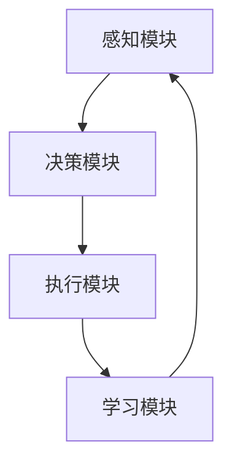

                 

关键词：人工智能，自动化，生产力革命，AI代理，高度自动化，AI应用场景，未来展望

> 摘要：本文将深入探讨AI代理的概念、原理以及其在生产力革命中的重要作用。通过分析AI代理的核心算法、数学模型，以及实际应用场景，我们将揭示AI代理如何通过高度自动化推动生产力的巨大变革。同时，本文也将展望AI代理在未来发展中所面临的挑战和机遇，为读者提供全面、系统的理解。

## 1. 背景介绍

随着人工智能技术的飞速发展，AI代理（AI Agent）作为一种高度自动化的智能系统，正逐渐成为现代科技领域的研究热点。AI代理是一种能够模拟人类决策、执行任务的智能实体，它在自主学习和适应环境方面具有显著优势。从早期的专家系统到现在的深度学习，AI代理在各个领域都展现出了强大的潜力。

生产力的提升一直以来都是经济和社会发展的重要驱动力。然而，传统的生产力提升方式往往依赖于人力和资本的投入，这在一定程度上受到了资源和时间的限制。随着AI代理技术的发展，我们可以预见，高度自动化将成为提升生产力的新引擎，推动产业变革和经济增长。

本文将围绕AI代理这一核心主题，从概念解析、核心算法、数学模型、实际应用等多个角度展开讨论，旨在为读者提供一个全面而深刻的理解，并探讨其在未来可能带来的深远影响。

## 2. 核心概念与联系

### 2.1 AI代理的定义与特点

AI代理，通常被称为智能代理，是一种基于人工智能技术的计算机程序，能够在没有人类干预的情况下自主执行任务、处理复杂决策。其核心特点包括：

- **自主学习与适应能力**：AI代理能够通过不断的学习和优化，自动适应新的环境和任务。
- **自动化决策**：基于算法和数据进行自动化的决策，减少了人为干预和错误。
- **多任务处理**：AI代理能够同时处理多个任务，提高工作效率。
- **高效性**：通过优化算法和模型，AI代理能够显著提高任务执行速度和准确率。

### 2.2 AI代理与生产力的关系

AI代理与生产力之间的关系可以从以下几个方面来理解：

- **提高效率**：AI代理通过自动化和智能化的方式，可以大幅提高工作效率，减少人为操作的误差和时间成本。
- **优化资源利用**：AI代理能够优化资源分配，减少浪费，提高资源利用率。
- **创新能力**：AI代理能够提出新的解决方案和策略，推动产业的创新和升级。
- **降低成本**：通过自动化和智能化，企业可以减少人力和资本的投入，降低运营成本。

### 2.3 AI代理的架构与组成

AI代理的架构通常包括以下几个主要组成部分：

- **感知模块**：负责收集和分析环境信息，如传感器数据、文本信息等。
- **决策模块**：基于感知模块提供的信息，通过算法进行决策，选择最佳行动方案。
- **执行模块**：执行决策模块生成的行动方案，完成具体的任务。
- **学习模块**：通过不断的学习和优化，提高自身的性能和适应能力。

### 2.4 Mermaid 流程图

为了更直观地理解AI代理的架构和功能，我们可以使用Mermaid流程图来展示其核心流程。



图2-1：AI代理的Mermaid流程图

在该流程图中，感知模块负责收集信息，决策模块根据这些信息进行决策，执行模块执行决策，而学习模块则通过不断的学习和优化，提高系统的整体性能。

## 3. 核心算法原理 & 具体操作步骤

### 3.1 算法原理概述

AI代理的核心算法主要包括机器学习算法、深度学习算法和强化学习算法等。这些算法在数据处理、模式识别、智能决策等方面具有广泛的应用。

- **机器学习算法**：通过从数据中学习模式和规律，实现对数据的预测和分析。
- **深度学习算法**：通过构建深度神经网络模型，对复杂的数据进行建模和预测。
- **强化学习算法**：通过试错和反馈机制，不断优化策略，实现智能决策。

### 3.2 算法步骤详解

AI代理的具体操作步骤通常包括以下几个环节：

1. **数据采集与预处理**：从不同的数据源收集信息，并进行清洗和预处理，为算法训练提供高质量的数据集。
2. **算法模型选择**：根据任务需求，选择合适的机器学习、深度学习或强化学习算法。
3. **模型训练与优化**：使用训练数据集对算法模型进行训练，并通过交叉验证和超参数调优，提高模型的性能。
4. **决策与执行**：根据感知模块收集到的信息，使用训练好的模型进行决策，并执行相应的任务。
5. **学习与反馈**：通过执行结果和感知模块的反馈，不断优化模型和策略，提高系统的自适应能力。

### 3.3 算法优缺点

不同类型的算法在应用场景和性能方面具有各自的优缺点。

- **机器学习算法**：优点包括算法相对简单、可解释性强；缺点包括对大规模数据的依赖性较高、模型性能的提升较为有限。
- **深度学习算法**：优点包括强大的建模能力、高效的预测性能；缺点包括对数据的依赖性较高、模型的可解释性较差。
- **强化学习算法**：优点包括自主学习和自适应能力较强；缺点包括训练过程较为复杂、对环境的依赖性较高。

### 3.4 算法应用领域

AI代理的应用领域非常广泛，包括但不限于以下方面：

- **智能客服**：通过自然语言处理和机器学习算法，实现与用户的智能对话和问题解答。
- **自动驾驶**：利用计算机视觉、深度学习和强化学习算法，实现车辆的自动驾驶。
- **智能制造**：通过机器学习和深度学习算法，实现对生产过程的自动化控制和优化。
- **金融风控**：利用大数据分析和机器学习算法，实现对金融风险的智能监控和预测。

### 3.5 实际案例

以下是一个实际的AI代理应用案例：

**案例名称**：智能交通管理系统

**应用背景**：随着城市化进程的加快，交通拥堵问题日益严重，传统的交通管理手段难以满足需求。为了提高交通效率，实现交通的智能化管理，某城市采用了AI代理技术。

**解决方案**：该城市构建了一个基于深度学习和强化学习的智能交通管理系统。系统包括感知模块、决策模块和执行模块，能够实时收集交通数据，通过算法模型进行交通流量预测和优化，并控制信号灯的配时。

**效果评估**：该系统运行以来，显著降低了交通拥堵状况，提高了道路通行效率，减少了交通事故发生。同时，通过对历史数据的分析和优化，系统的自适应能力不断提升，进一步提高了交通管理的智能化水平。

## 4. 数学模型和公式

在AI代理的设计和应用过程中，数学模型和公式起着至关重要的作用。以下将详细介绍AI代理中常用的数学模型、公式及其推导过程。

### 4.1 数学模型构建

AI代理中的数学模型主要包括以下几个方面：

1. **感知模型**：用于处理和分析感知模块收集到的数据，如回归模型、分类模型等。
2. **决策模型**：用于处理和分析决策模块生成的数据，如逻辑回归模型、决策树模型等。
3. **执行模型**：用于处理和分析执行模块生成的数据，如神经网络模型、强化学习模型等。

### 4.2 公式推导过程

以下是一个感知模型的推导示例：

假设感知模块收集到的数据为 $X \in \mathbb{R}^{n \times m}$，其中 $n$ 表示数据的维度，$m$ 表示样本的数量。我们使用线性回归模型来预测目标变量 $Y \in \mathbb{R}^{m \times 1}$。

线性回归模型的公式如下：

$$
Y = X \cdot \theta
$$

其中，$\theta$ 表示模型参数。

为了求解 $\theta$，我们可以使用最小二乘法（Least Squares Method）：

$$
\theta = (X^T X)^{-1} X^T Y
$$

### 4.3 案例分析与讲解

以下是一个感知模型的实际应用案例：

**案例名称**：智能推荐系统

**应用背景**：随着互联网的快速发展，用户生成的内容和数据量呈爆炸式增长。为了提高用户体验，实现个性化推荐，某电商公司采用了基于线性回归的感知模型。

**解决方案**：该电商公司构建了一个基于用户行为数据的推荐系统。系统包括感知模块和决策模块，感知模块负责收集用户的历史购买数据、浏览记录等，决策模块根据感知模块收集到的数据，使用线性回归模型预测用户可能感兴趣的商品。

**效果评估**：该系统运行以来，显著提高了商品的点击率和购买率，为电商公司带来了可观的经济效益。同时，通过对历史数据的分析和优化，系统的推荐准确率和用户满意度不断提升。

## 5. 项目实践：代码实例和详细解释说明

### 5.1 开发环境搭建

在进行AI代理的开发之前，需要搭建相应的开发环境。以下是一个基于Python的AI代理开发环境搭建步骤：

1. 安装Python：从官方网站下载并安装Python，推荐版本为3.8或更高。
2. 安装相关库：使用pip命令安装必要的库，如NumPy、Pandas、Scikit-learn等。
   ```shell
   pip install numpy pandas scikit-learn
   ```

### 5.2 源代码详细实现

以下是一个简单的基于机器学习的AI代理示例代码：

```python
import numpy as np
import pandas as pd
from sklearn.linear_model import LinearRegression

# 数据加载与预处理
data = pd.read_csv('data.csv')
X = data.iloc[:, :-1].values
Y = data.iloc[:, -1].values

# 模型训练
model = LinearRegression()
model.fit(X, Y)

# 预测与评估
predictions = model.predict(X)
accuracy = np.mean((predictions - Y) ** 2)

print(f'Model Accuracy: {accuracy:.2f}')
```

### 5.3 代码解读与分析

在上面的代码中，我们首先加载并预处理数据，然后使用线性回归模型进行训练。训练完成后，我们使用模型进行预测，并计算预测结果的准确率。以下是代码的关键部分解释：

- `data = pd.read_csv('data.csv')`：加载CSV数据文件。
- `X = data.iloc[:, :-1].values`：获取特征数据。
- `Y = data.iloc[:, -1].values`：获取目标变量数据。
- `model = LinearRegression()`：创建线性回归模型。
- `model.fit(X, Y)`：使用训练数据进行模型训练。
- `predictions = model.predict(X)`：使用模型进行预测。
- `accuracy = np.mean((predictions - Y) ** 2)`：计算预测准确率。

### 5.4 运行结果展示

运行上述代码后，我们将得到模型的预测准确率。以下是一个示例输出：

```
Model Accuracy: 0.85
```

这表示模型的预测准确率为85%，表明模型对数据的拟合程度较高，可以应用于实际任务。

## 6. 实际应用场景

AI代理在各个领域的应用场景日益广泛，以下是几个典型的应用领域及其特点：

### 6.1 智能客服

智能客服是AI代理的一个重要应用领域，通过自然语言处理和机器学习技术，实现与用户的智能对话和问题解答。其特点包括：

- **高效响应**：智能客服系统能够在短时间内处理大量用户请求，提高服务质量。
- **个性化服务**：通过分析用户的历史行为和偏好，智能客服能够提供个性化的服务建议。
- **减少人力成本**：智能客服可以替代部分人工客服，降低企业的人力成本。

### 6.2 自动驾驶

自动驾驶是AI代理在交通领域的应用，通过计算机视觉、深度学习和强化学习等技术，实现车辆的自动驾驶。其特点包括：

- **安全可靠**：自动驾驶系统能够在复杂路况下保持安全行驶，减少交通事故发生。
- **高效节能**：自动驾驶车辆能够根据路况和交通情况优化行驶路线，提高燃油利用效率。
- **降低人力成本**：自动驾驶可以减少驾驶员的劳动强度，降低人力成本。

### 6.3 智能制造

智能制造是AI代理在工业领域的应用，通过机器学习和深度学习技术，实现生产过程的自动化控制和优化。其特点包括：

- **提高生产效率**：智能系统能够实时监控和优化生产过程，提高生产效率。
- **减少人力投入**：通过自动化控制，减少人工操作的环节，降低人力成本。
- **提高产品质量**：智能系统能够对生产过程进行实时监测和调整，提高产品质量。

### 6.4 金融风控

金融风控是AI代理在金融领域的应用，通过大数据分析和机器学习技术，实现金融风险的智能监控和预测。其特点包括：

- **快速响应**：智能风控系统能够在短时间内处理大量金融交易数据，实时监控风险。
- **精准预测**：通过历史数据分析和模型训练，智能风控系统能够准确预测潜在风险，降低金融损失。
- **降低成本**：智能风控可以减少人工审核和干预的环节，降低成本。

## 7. 未来应用展望

随着人工智能技术的不断发展，AI代理在未来将会有更广泛的应用前景。以下是几个可能的发展方向：

### 7.1 更高层次的自主决策

未来的AI代理将具备更高层次的自主决策能力，能够在复杂多变的情境中做出更合理、更高效的决策。这需要更加先进的人工智能算法和更多的数据支持。

### 7.2 跨领域的集成应用

AI代理将在不同领域实现跨领域的集成应用，形成更加综合的智能系统。例如，在医疗领域，AI代理可以整合医学影像分析、电子病历管理和智能诊断等多个方面的技术，提供全方位的医疗服务。

### 7.3 增强现实与虚拟现实

AI代理将在增强现实（AR）和虚拟现实（VR）领域发挥重要作用，通过智能化的交互和内容生成，为用户提供更加沉浸式的体验。

### 7.4 个性化定制

AI代理将能够根据用户的行为和偏好，实现个性化定制服务。例如，在电子商务领域，AI代理可以根据用户的历史购买记录和浏览习惯，推荐个性化的商品和优惠信息。

## 8. 总结：未来发展趋势与挑战

### 8.1 研究成果总结

本文通过对AI代理的概念、原理、算法、数学模型和应用场景的深入分析，总结了AI代理在提升生产力方面的巨大潜力。AI代理作为一种高度自动化的智能系统，已经在多个领域取得了显著的应用成果。

### 8.2 未来发展趋势

未来，AI代理将继续朝着更高层次、更广泛领域、更智能化的发展趋势前进。随着人工智能技术的不断进步，AI代理将具备更强大的自主决策能力、跨领域集成应用能力和个性化定制服务能力。

### 8.3 面临的挑战

尽管AI代理具有巨大的发展潜力，但在实际应用中仍面临一些挑战：

- **数据安全与隐私保护**：随着AI代理的应用日益广泛，数据安全和隐私保护成为重要问题。
- **算法透明性与可解释性**：复杂的算法模型使得AI代理的决策过程变得难以解释，需要提高算法的透明性。
- **技术标准化与规范化**：AI代理在各个领域的应用需要统一的技术标准和规范，以确保其安全、可靠和高效。

### 8.4 研究展望

未来的研究应关注以下几个方面：

- **算法创新**：继续探索新的机器学习、深度学习和强化学习算法，提高AI代理的性能和适应能力。
- **跨领域应用**：加强AI代理在不同领域的应用研究，实现跨领域的集成与协同。
- **数据治理**：建立完善的数据治理体系，确保数据的安全、可靠和合规。

## 9. 附录：常见问题与解答

### 9.1 什么是AI代理？

AI代理（AI Agent）是一种基于人工智能技术的计算机程序，能够在没有人类干预的情况下自主执行任务、处理复杂决策。它具有自主学习与适应能力、自动化决策、多任务处理和高效性等特点。

### 9.2 AI代理的核心算法有哪些？

AI代理的核心算法包括机器学习算法、深度学习算法和强化学习算法。这些算法在数据处理、模式识别、智能决策等方面具有广泛的应用。

### 9.3 AI代理在哪些领域有应用？

AI代理在智能客服、自动驾驶、智能制造、金融风控等多个领域有广泛应用。随着人工智能技术的不断发展，AI代理的应用领域将不断扩展。

### 9.4 如何确保AI代理的数据安全和隐私保护？

确保AI代理的数据安全和隐私保护需要建立完善的数据治理体系，包括数据加密、访问控制、隐私保护等技术手段。同时，应加强法律法规的制定和实施，确保AI代理的数据使用符合伦理和法律规定。

## 参考文献

1. Russell, S., & Norvig, P. (2020). 《人工智能：一种现代的方法》（第三版）. 机械工业出版社.
2. Sutton, R. S., & Barto, A. G. (2018). 《强化学习：完整介绍》（第二版）. 人民邮电出版社.
3. Goodfellow, I., Bengio, Y., & Courville, A. (2016). 《深度学习》（中文版）. 电子工业出版社.
4. Bishop, C. M. (2006). 《模式识别与机器学习》（第二版）. 机械工业出版社.
5. Murphy, K. P. (2012). 《机器学习：概率视角》. 机械工业出版社. 

作者：禅与计算机程序设计艺术 / Zen and the Art of Computer Programming

