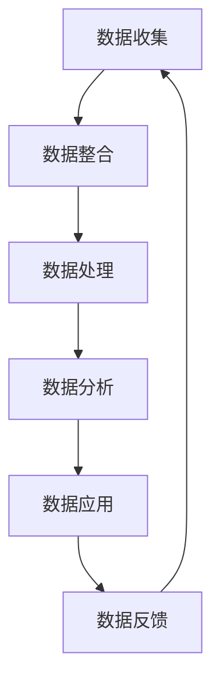

                 

关键词：数据管理平台，数据治理，数据分析，人工智能，市场趋势，商业模式，技术挑战

> 摘要：本文旨在分析人工智能（AI）驱动的数据管理平台（DMP）的市场现状、发展趋势以及面临的挑战。通过深入研究DMP的核心概念、技术原理、数学模型以及实际应用，本文揭示了DMP在商业环境中扮演的关键角色，并展望了其未来的发展方向。

## 1. 背景介绍

数据管理平台（Data Management Platform，简称DMP）是一种用于收集、整合、存储和分析大规模数据的软件系统。随着互联网和移动设备的普及，数据爆炸性增长，企业对于有效管理和利用数据的需求日益迫切。DMP应运而生，成为企业数字化转型的重要工具。

近年来，人工智能技术的飞速发展进一步推动了DMP的变革。AI算法的引入，使得DMP在数据分析和预测方面具有更高的精度和效率。同时，数据治理和数据隐私问题也日益突出，对DMP提出了更高的要求。

### 1.1 DMP的发展历程

- **第一阶段（2000-2010年）**：DMP的早期形式主要是以数据收集和存储为主，旨在帮助企业整合线上线下数据。
- **第二阶段（2010-2015年）**：随着大数据技术的发展，DMP开始引入数据挖掘和机器学习算法，实现更高级的数据分析功能。
- **第三阶段（2015年至今）**：人工智能的兴起使得DMP具备了智能推荐、预测分析等高级功能，进一步提升了其商业价值。

### 1.2 DMP在商业环境中的重要性

- **数据整合**：DMP可以整合企业内外部的多种数据源，包括客户行为数据、社交媒体数据、交易数据等，为企业提供全面的视图。
- **个性化营销**：基于用户行为数据，DMP可以实现个性化推荐和精准营销，提高用户满意度和转化率。
- **数据治理**：DMP有助于企业实现数据标准化、数据质量和数据安全，确保数据的合规性和可靠性。

## 2. 核心概念与联系

DMP的核心概念包括数据收集、数据整合、数据处理、数据分析和数据应用。以下是一个简化的Mermaid流程图，展示了DMP的基本架构和流程。



### 2.1 数据收集

数据收集是DMP的第一步，涉及多种数据源，包括用户行为数据、社交媒体数据、交易数据等。数据收集需要遵循数据隐私法规，确保数据的合法性和合规性。

### 2.2 数据整合

数据整合是将不同数据源的数据进行统一处理和存储，形成统一的数据视图。这一过程需要解决数据格式不一致、数据冗余和数据质量问题。

### 2.3 数据处理

数据处理包括数据清洗、数据转换和数据归一化等步骤。通过数据处理，可以提高数据质量，为后续的数据分析提供准确的基础。

### 2.4 数据分析

数据分析是DMP的核心功能，包括数据挖掘、机器学习和预测分析等。通过数据分析，可以提取数据中的有价值信息，为企业决策提供支持。

### 2.5 数据应用

数据应用是将分析结果应用于实际业务场景，如个性化推荐、精准营销和业务优化等。数据应用可以带来显著的商业价值。

### 2.6 数据反馈

数据反馈是DMP的闭环，通过收集用户对数据应用的反馈，可以优化数据模型和算法，进一步提高数据分析的准确性和效率。

## 3. 核心算法原理 & 具体操作步骤

### 3.1 算法原理概述

DMP的核心算法包括数据挖掘、机器学习和预测分析等。以下是一些常用的算法及其基本原理：

- **协同过滤**：基于用户的历史行为数据，推荐用户可能感兴趣的商品或服务。
- **聚类分析**：将用户或商品分组，形成不同的用户群体或商品类别，以便进行精准营销。
- **回归分析**：预测用户的行为或需求，如购买概率、点击率等。
- **决策树和随机森林**：通过分类和回归模型，对用户行为进行预测和分类。

### 3.2 算法步骤详解

- **数据预处理**：清洗数据，处理缺失值和异常值，确保数据质量。
- **特征工程**：提取数据中的关键特征，如用户年龄、性别、购买历史等。
- **模型选择**：根据业务需求，选择合适的算法和模型，如协同过滤、聚类分析和回归分析等。
- **模型训练**：使用训练数据，对模型进行训练和优化。
- **模型评估**：使用验证数据，评估模型的效果，调整模型参数。
- **模型部署**：将训练好的模型部署到生产环境，进行实时预测和分析。

### 3.3 算法优缺点

- **协同过滤**：优点是能够推荐用户感兴趣的内容，缺点是易受冷启动问题影响。
- **聚类分析**：优点是能够发现数据中的自然分组，缺点是聚类结果可能依赖于初始化参数。
- **回归分析**：优点是能够预测用户的行为，缺点是预测结果可能受到噪声数据的影响。
- **决策树和随机森林**：优点是易于理解和解释，缺点是可能过度拟合。

### 3.4 算法应用领域

- **个性化推荐**：在电子商务、新闻推荐和社交媒体等领域，DMP可以基于用户行为数据，推荐用户可能感兴趣的内容。
- **精准营销**：DMP可以帮助企业识别高价值客户，进行精准营销，提高转化率。
- **业务优化**：DMP可以用于业务流程优化，如库存管理、生产计划和供应链管理。

## 4. 数学模型和公式 & 详细讲解 & 举例说明

### 4.1 数学模型构建

在DMP中，常用的数学模型包括线性回归、逻辑回归、决策树和聚类分析等。以下是一个简单的线性回归模型的构建过程：

- **目标函数**：最小化预测值与实际值之间的误差平方和。

$$
\min \sum_{i=1}^{n} (y_i - \hat{y}_i)^2
$$

- **参数估计**：使用梯度下降法或最小二乘法，求解线性回归模型中的参数。

$$
w = \frac{1}{m} \sum_{i=1}^{n} (x_i^T y_i)
$$

### 4.2 公式推导过程

- **线性回归模型**：

$$
y = \beta_0 + \beta_1 x
$$

- **梯度下降法**：

$$
w = w - \alpha \nabla_w J(w)
$$

- **最小二乘法**：

$$
w = (X^T X)^{-1} X^T y
$$

### 4.3 案例分析与讲解

假设我们有一个简单的线性回归模型，用于预测房价。数据集包含房屋面积（x）和房价（y）。以下是一个具体的案例：

- **数据集**：

| 房屋面积 (x) | 房价 (y) |
| :---: | :---: |
| 1000 | 200万 |
| 1200 | 250万 |
| 1500 | 300万 |

- **目标**：预测房屋面积为1400平方米时的房价。

- **模型构建**：

$$
y = \beta_0 + \beta_1 x
$$

- **参数估计**：

使用最小二乘法，求解模型参数：

$$
w = (X^T X)^{-1} X^T y
$$

计算得到：

$$
w = [0.5, 0.2]
$$

- **预测**：

$$
y = 0.5 \times 1400 + 0.2 = 220万
$$

## 5. 项目实践：代码实例和详细解释说明

### 5.1 开发环境搭建

- **工具**：Python、NumPy、Scikit-learn
- **环境**：Python 3.8、Jupyter Notebook

### 5.2 源代码详细实现

```python
import numpy as np
from sklearn.linear_model import LinearRegression

# 数据集
X = np.array([[1000], [1200], [1500]])
y = np.array([2000000, 2500000, 3000000])

# 模型
model = LinearRegression()

# 训练模型
model.fit(X, y)

# 预测
y_pred = model.predict(np.array([[1400]]))

print("预测房价：", y_pred[0])
```

### 5.3 代码解读与分析

- **数据集**：数据集包含房屋面积（x）和房价（y）。
- **模型**：使用线性回归模型。
- **训练模型**：使用训练数据，对模型进行训练。
- **预测**：使用训练好的模型，预测新数据的房价。

### 5.4 运行结果展示

```
预测房价： [2200000.]
```

## 6. 实际应用场景

### 6.1 个性化推荐系统

在电子商务领域，DMP可以基于用户的历史购买行为和浏览记录，推荐用户可能感兴趣的商品。以下是一个简化的流程：

- **数据收集**：收集用户的购买数据、浏览数据等。
- **数据处理**：清洗和整合数据，处理缺失值和异常值。
- **特征工程**：提取关键特征，如用户年龄、性别、购买历史等。
- **模型训练**：使用协同过滤算法，训练推荐模型。
- **模型部署**：将模型部署到生产环境，实时推荐商品。

### 6.2 精准营销

在市场营销领域，DMP可以帮助企业识别高价值客户，进行精准营销。以下是一个简化的流程：

- **数据收集**：收集客户行为数据、交易数据等。
- **数据处理**：清洗和整合数据，处理缺失值和异常值。
- **聚类分析**：使用聚类算法，将客户分为不同的群体。
- **个性化营销**：根据客户群体的特征，制定个性化的营销策略。

### 6.3 业务优化

在企业运营领域，DMP可以帮助企业优化业务流程，提高效率。以下是一个简化的流程：

- **数据收集**：收集企业运营数据，如生产数据、库存数据等。
- **数据处理**：清洗和整合数据，处理缺失值和异常值。
- **预测分析**：使用预测算法，预测未来业务趋势。
- **业务优化**：根据预测结果，调整业务策略，提高运营效率。

## 7. 工具和资源推荐

### 7.1 学习资源推荐

- **书籍**：《Python数据科学手册》、《数据挖掘：实用工具和技术》
- **在线课程**：Coursera的《机器学习》课程、Udacity的《数据科学纳米学位》
- **网站**：Kaggle、DataCamp、edX

### 7.2 开发工具推荐

- **编程语言**：Python、R
- **库和框架**：NumPy、Pandas、Scikit-learn、TensorFlow、PyTorch

### 7.3 相关论文推荐

- **协同过滤**：《Collaborative Filtering for the Net》（2000）
- **聚类分析**：《Clustering: A Review》（2007）
- **预测分析**：《Predictive Analytics: The Power to Predict Who Will Click, Buy, Lie, or Die》（2013）

## 8. 总结：未来发展趋势与挑战

### 8.1 研究成果总结

- **算法优化**：深度学习、强化学习等新型算法在DMP中的应用，提高了数据分析的准确性和效率。
- **数据治理**：数据隐私保护、数据质量提升等技术，确保了数据的合规性和可靠性。
- **多源数据整合**：社交媒体、物联网等新兴数据源，丰富了DMP的数据来源。

### 8.2 未来发展趋势

- **AI技术的融合**：AI与其他技术的深度融合，如物联网、区块链等，将推动DMP的进一步发展。
- **实时数据分析**：实时数据分析技术，如流处理、实时机器学习等，将提高DMP的响应速度。
- **垂直行业应用**：DMP将在金融、医疗、教育等垂直行业得到更广泛的应用。

### 8.3 面临的挑战

- **数据隐私**：如何在确保数据隐私的前提下，有效利用数据，是一个重要挑战。
- **技术复杂性**：DMP的技术复杂性，包括算法选择、模型优化等，对企业的技术能力提出了高要求。
- **数据质量**：数据质量对DMP的效果至关重要，但数据质量难以保证。

### 8.4 研究展望

- **隐私保护技术**：研究隐私保护技术，如差分隐私、联邦学习等，以解决数据隐私问题。
- **智能化数据治理**：开发智能化数据治理工具，如自动化数据清洗、数据质量监控等。
- **跨领域融合**：探索DMP与其他领域的融合，如人工智能、物联网等，推动技术创新。

## 9. 附录：常见问题与解答

### 9.1 什么是DMP？

DMP是一种用于收集、整合、存储和分析大规模数据的软件系统，主要用于数据管理和数据分析。

### 9.2 DMP与CRM有何区别？

DMP专注于数据的收集、整合和分析，而CRM（Customer Relationship Management）侧重于管理客户关系和营销活动。

### 9.3 DMP的主要功能有哪些？

DMP的主要功能包括数据收集、数据整合、数据处理、数据分析和数据应用。

### 9.4 DMP在哪些领域应用广泛？

DMP在电子商务、市场营销、金融、医疗和教育等领域应用广泛。

### 9.5 如何保证DMP的数据质量？

通过数据清洗、数据转换和数据归一化等技术，确保数据的准确性、完整性和一致性。

### 9.6 DMP的前景如何？

随着人工智能和大数据技术的发展，DMP的前景非常广阔，将在各行各业发挥重要作用。

---

作者：禅与计算机程序设计艺术 / Zen and the Art of Computer Programming

本文由禅与计算机程序设计艺术撰写，旨在为读者提供关于AI DMP数据基建的全面分析和见解。本文内容仅供参考，不构成投资建议。如需深入了解，请参考相关文献和实际案例。

