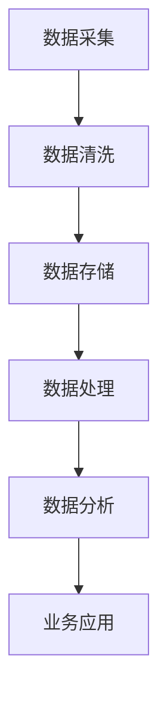

                 

关键词：AI，DMP，数据基建，成本控制，算法优化，技术实践，未来展望

> 摘要：本文将探讨人工智能领域中的数据管理平台（DMP）建设中的成本控制问题。通过分析DMP的核心概念、数据管理流程、算法优化策略，提供一系列的成本控制方法和实践，旨在为企业提供有效降低DMP建设成本的技术路线图。

## 1. 背景介绍

随着大数据和人工智能技术的迅猛发展，数据管理平台（DMP）成为企业数字化转型的重要基础设施。DMP通过采集、整合和分析用户数据，帮助企业实现精准营销和业务决策。然而，DMP的建设和维护需要巨大的资金投入，尤其在数据存储、计算资源和人才成本方面。因此，如何有效控制DMP的数据基建成本，成为当前企业面临的重大挑战。

### DMP的定义与功能

DMP（Data Management Platform）是一种用于收集、存储、管理和分析用户数据的综合平台。其主要功能包括：

- **数据采集**：通过多种渠道收集用户行为数据，如网页浏览、APP使用、社交互动等。
- **数据整合**：将分散的数据源进行整合，建立统一的数据视图。
- **数据处理**：对数据质量进行评估和优化，确保数据的准确性和一致性。
- **数据分析**：运用数据分析技术，提取数据中的价值信息，为业务决策提供支持。

### DMP建设的重要性

在当今高度竞争的商业环境中，企业需要充分利用数据来获取竞争优势。DMP的建设不仅可以提高数据利用率，还可以实现以下价值：

- **精准营销**：通过分析用户行为数据，企业可以更准确地定位目标客户，提高营销效果。
- **业务优化**：通过数据驱动的方式，企业可以更好地了解业务流程中的瓶颈，进行优化。
- **风险控制**：通过监控和分析数据，企业可以及时发现潜在的风险，并采取预防措施。

### DMP建设的挑战

尽管DMP具有显著的价值，但建设DMP也面临诸多挑战：

- **数据质量**：数据质量是DMP成功的关键。如果数据存在缺失、错误或重复，将严重影响分析结果的准确性。
- **技术复杂性**：DMP涉及多种技术，包括数据采集、存储、处理和分析。企业需要具备相应的技术能力。
- **成本控制**：DMP的建设和维护需要巨大的资金投入，尤其是数据存储和计算资源。如何有效控制成本是关键。

## 2. 核心概念与联系

### 2.1 数据管理平台（DMP）的架构

为了更好地理解DMP的建设，我们需要了解其核心组件和架构。以下是一个简化的DMP架构，其中包含了数据采集、存储、处理和分析的主要流程。



- **数据采集**：通过各种方式收集用户数据，如第三方SDK、API接口等。
- **数据清洗**：对采集到的数据进行清洗，包括去重、填补缺失值、数据格式转换等。
- **数据存储**：将清洗后的数据存储到数据库中，常用的存储方案包括关系型数据库、NoSQL数据库、数据仓库等。
- **数据处理**：对数据进行加工处理，如数据聚合、数据挖掘等。
- **数据分析**：利用数据分析技术，提取数据中的价值信息。
- **业务应用**：将分析结果应用于具体的业务场景，如精准营销、业务优化等。

### 2.2 数据管理流程

数据管理流程是DMP建设中的重要环节，主要包括以下几个步骤：

1. **需求分析**：明确业务需求，确定数据管理的目标和范围。
2. **数据采集**：根据需求，选择合适的采集方式，如第三方SDK、API接口等。
3. **数据存储**：选择合适的存储方案，确保数据的持久化和安全性。
4. **数据清洗**：对采集到的数据进行清洗，确保数据质量。
5. **数据处理**：对数据进行加工处理，提取有价值的信息。
6. **数据分析**：利用数据分析技术，提取数据中的价值信息。
7. **业务应用**：将分析结果应用于具体的业务场景，实现数据的价值。

### 2.3 算法优化策略

在DMP建设中，算法优化是降低成本的关键。以下是一些常见的算法优化策略：

1. **数据压缩**：通过数据压缩技术，减少数据存储和传输的开销。
2. **索引优化**：通过索引优化，提高数据查询的效率。
3. **分布式计算**：通过分布式计算技术，提高数据处理和分析的速度。
4. **缓存技术**：通过缓存技术，减少数据访问的延迟。

## 3. 核心算法原理 & 具体操作步骤

### 3.1 算法原理概述

在DMP中，常用的算法包括数据清洗算法、数据挖掘算法和机器学习算法。以下分别介绍这些算法的基本原理。

#### 3.1.1 数据清洗算法

数据清洗算法的主要目的是提高数据质量，包括以下几种常见的算法：

1. **去重**：通过比较数据记录的唯一标识，去除重复的数据。
2. **填补缺失值**：通过统计方法或插值法，填补数据中的缺失值。
3. **数据格式转换**：将不同格式的数据转换为统一的格式，如将日期格式转换为YYYY-MM-DD。

#### 3.1.2 数据挖掘算法

数据挖掘算法是从大量数据中提取有价值信息的方法。以下是一些常见的数据挖掘算法：

1. **关联规则挖掘**：通过发现数据之间的关联关系，如购物篮分析。
2. **分类算法**：将数据分类到不同的类别中，如决策树、支持向量机等。
3. **聚类算法**：将相似的数据聚集在一起，如K-means、层次聚类等。

#### 3.1.3 机器学习算法

机器学习算法是一种通过数据训练模型的方法，以下是一些常见的机器学习算法：

1. **线性回归**：通过线性模型预测连续值。
2. **逻辑回归**：通过逻辑函数预测类别值。
3. **神经网络**：通过多层神经网络进行非线性预测。

### 3.2 算法步骤详解

#### 3.2.1 数据清洗算法步骤

1. **去重**：读取数据集，使用哈希表或唯一标识进行比较，去除重复记录。
2. **填补缺失值**：对于缺失值，可以根据数据分布或使用插值法进行填补。
3. **数据格式转换**：将不同格式的数据转换为统一的格式，如使用正则表达式进行日期格式转换。

#### 3.2.2 数据挖掘算法步骤

1. **数据预处理**：对数据进行清洗、去噪、归一化等处理。
2. **模型选择**：根据业务需求，选择合适的挖掘算法。
3. **模型训练**：使用训练数据进行模型训练。
4. **模型评估**：使用测试数据对模型进行评估，调整参数以优化模型。

#### 3.2.3 机器学习算法步骤

1. **数据集准备**：将数据集分为训练集、验证集和测试集。
2. **模型选择**：根据业务需求，选择合适的机器学习算法。
3. **模型训练**：使用训练数据进行模型训练。
4. **模型评估**：使用验证集对模型进行评估，调整参数以优化模型。
5. **模型应用**：使用测试集对模型进行最终评估，并将模型应用于实际业务场景。

### 3.3 算法优缺点

#### 3.3.1 数据清洗算法优缺点

**优点**：

- 简单易行，无需复杂的模型。
- 可以显著提高数据质量。

**缺点**：

- 对数据噪声敏感，可能去除有用的信息。
- 需要大量的人工干预。

#### 3.3.2 数据挖掘算法优缺点

**优点**：

- 可以从大量数据中提取有价值的信息。
- 可以帮助发现业务中的潜在趋势。

**缺点**：

- 模型复杂，需要大量的数据预处理。
- 模型评估困难，需要大量的测试数据。

#### 3.3.3 机器学习算法优缺点

**优点**：

- 可以通过大量数据自动学习，减少人工干预。
- 可以处理复杂的非线性问题。

**缺点**：

- 模型训练时间较长，需要大量的计算资源。
- 模型解释性差，难以理解模型的决策过程。

### 3.4 算法应用领域

#### 3.4.1 数据清洗算法应用领域

- 数据仓库：在数据仓库中，数据清洗算法用于提高数据质量，确保数据的准确性和一致性。
- 数据挖掘：在数据挖掘过程中，数据清洗算法用于预处理数据，为后续的数据挖掘提供高质量的数据。

#### 3.4.2 数据挖掘算法应用领域

- 营销分析：通过关联规则挖掘，可以分析用户的购物行为，发现潜在的购买关联。
- 客户细分：通过聚类算法，可以将客户分为不同的群体，为精准营销提供基础。
- 风险控制：通过分类算法，可以预测客户流失风险，提前采取预防措施。

#### 3.4.3 机器学习算法应用领域

- 信用评分：通过机器学习算法，可以建立信用评分模型，预测客户信用风险。
- 搜索引擎：通过机器学习算法，可以优化搜索结果，提高用户体验。
- 金融风险管理：通过机器学习算法，可以分析金融市场的风险，预测市场走势。

## 4. 数学模型和公式 & 详细讲解 & 举例说明

### 4.1 数学模型构建

在DMP建设中，构建合适的数学模型是关键。以下介绍几种常见的数学模型。

#### 4.1.1 回归模型

回归模型是一种常用的统计模型，用于预测连续值。常见的回归模型包括线性回归和逻辑回归。

**线性回归**：

$$y = \beta_0 + \beta_1x_1 + \beta_2x_2 + ... + \beta_nx_n$$

其中，$y$是预测目标，$x_1, x_2, ..., x_n$是特征变量，$\beta_0, \beta_1, ..., \beta_n$是模型参数。

**逻辑回归**：

$$P(y=1) = \frac{1}{1 + e^{-(\beta_0 + \beta_1x_1 + \beta_2x_2 + ... + \beta_nx_n)}}$$

其中，$P(y=1)$是预测目标为1的概率。

#### 4.1.2 聚类模型

聚类模型是一种无监督学习模型，用于将数据分为不同的簇。常见的聚类模型包括K-means和层次聚类。

**K-means聚类**：

$$c_i = \frac{1}{n}\sum_{j=1}^{n} x_{ij}$$

其中，$c_i$是簇的中心，$x_{ij}$是第$i$个样本在第$j$个特征上的值。

**层次聚类**：

层次聚类是一种基于层次结构的聚类方法，可以分为自底向上和自顶向下两种方式。

#### 4.1.3 决策树模型

决策树模型是一种常用的分类和回归模型。它通过一系列的决策规则，将数据分为不同的类别或回归到不同的值。

**决策树模型**：

$$\begin{cases}
y \leftarrow \beta_0 & \text{if } x_1 > \beta_1 \\
y \leftarrow \beta_2 & \text{if } x_1 \leq \beta_1, x_2 > \beta_3 \\
... \\
y \leftarrow \beta_n & \text{if } x_1 \leq \beta_1, x_2 \leq \beta_3, ... , x_n > \beta_{n-1}
\end{cases}$$

其中，$y$是预测目标，$x_1, x_2, ..., x_n$是特征变量，$\beta_0, \beta_1, ..., \beta_n$是模型参数。

### 4.2 公式推导过程

#### 4.2.1 回归模型推导

**线性回归**：

假设我们有$n$个样本，每个样本包含一个预测目标$y_i$和多个特征变量$x_{ij}$，其中$i=1,2,...,n$，$j=1,2,...,m$。线性回归模型的假设是：

$$y_i = \beta_0 + \beta_1x_{i1} + \beta_2x_{i2} + ... + \beta_mx_{im} + \epsilon_i$$

其中，$\beta_0, \beta_1, ..., \beta_m$是模型参数，$\epsilon_i$是误差项。

为了求解模型参数，我们使用最小二乘法。最小二乘法的思想是寻找一组参数，使得预测值$y_i'$与真实值$y_i$之间的误差平方和最小。

$$\sum_{i=1}^{n}(y_i - y_i')^2 = \sum_{i=1}^{n}(\beta_0 + \beta_1x_{i1} + \beta_2x_{i2} + ... + \beta_mx_{im} - y_i)^2$$

对上述公式求导，并令导数为零，可以得到模型参数的估计值。

$$\frac{\partial}{\partial \beta_j}\sum_{i=1}^{n}(y_i - y_i')^2 = 0$$

经过推导，可以得到线性回归模型的参数估计公式：

$$\beta_j = \frac{\sum_{i=1}^{n}(x_{ij}y_i)}{\sum_{i=1}^{n}x_{ij}^2}$$

**逻辑回归**：

逻辑回归是一种用于预测概率的模型。其基本思想是将线性回归模型的预测值转换为概率。

$$P(y=1) = \frac{1}{1 + e^{-(\beta_0 + \beta_1x_1 + \beta_2x_2 + ... + \beta_nx_n)}}$$

为了求解模型参数，我们使用最大似然估计。最大似然估计的思想是寻找一组参数，使得训练数据的似然函数最大。

$$\ln L(\beta_0, \beta_1, ..., \beta_n) = \sum_{i=1}^{n}\ln P(y_i=1|x_i; \beta_0, \beta_1, ..., \beta_n)$$

对上述公式求导，并令导数为零，可以得到模型参数的估计值。

$$\frac{\partial}{\partial \beta_j}\ln L(\beta_0, \beta_1, ..., \beta_n) = 0$$

经过推导，可以得到逻辑回归模型的参数估计公式：

$$\beta_j = \frac{\sum_{i=1}^{n}x_{ij}y_i}{\sum_{i=1}^{n}x_{ij}(1-y_i)}$$

#### 4.2.2 聚类模型推导

**K-means聚类**：

K-means聚类是一种基于距离度量的聚类方法。其基本思想是初始选择$k$个簇中心，然后迭代更新簇中心，直到簇中心不再变化。

假设有$k$个簇中心$c_1, c_2, ..., c_k$，每个簇中心对应一个簇。对于每个样本$x_i$，将其分配到最近的簇中心$c_j$，即：

$$j = \arg\min_{j}\|x_i - c_j\|^2$$

然后，重新计算簇中心：

$$c_j = \frac{1}{n_j}\sum_{i=1}^{n}x_i$$

其中，$n_j$是簇$j$中的样本数量。

**层次聚类**：

层次聚类是一种自底向上的聚类方法。其基本思想是首先将每个样本视为一个簇，然后逐步合并簇，直到所有样本属于一个簇。

假设初始时有$n$个簇，每个簇对应一个样本。在每次迭代中，找到最近的两个簇，合并它们成为一个簇，同时更新簇中心。

$$c_j = \frac{1}{n_j}\sum_{i=1}^{n}x_i$$

其中，$n_j$是簇$j$中的样本数量。

### 4.3 案例分析与讲解

#### 4.3.1 数据清洗算法案例分析

假设我们有一个包含用户行为数据的数据集，其中包含以下字段：用户ID、访问时间、页面URL、页面停留时间。

首先，我们使用去重算法去除重复的数据记录。然后，使用填补缺失值算法填补访问时间中的缺失值，可以使用平均值进行填补。

接下来，我们将页面停留时间进行格式转换，将其转换为秒。

#### 4.3.2 数据挖掘算法案例分析

假设我们有一个包含客户购买数据的数据集，其中包含以下字段：用户ID、购买时间、购买金额。

我们使用关联规则挖掘算法分析客户的购物行为。首先，我们设置最小支持度和最小置信度阈值，然后运行算法，得到一组关联规则。

例如，我们发现购买产品A的客户中，有70%也购买了产品B，这表明产品A和产品B之间存在较强的关联。

#### 4.3.3 机器学习算法案例分析

假设我们有一个客户信用评分的数据集，其中包含以下字段：用户ID、年龄、收入、信用记录。

我们使用逻辑回归算法建立客户信用评分模型。首先，我们划分数据集为训练集和测试集，然后使用训练集训练模型，使用测试集评估模型性能。

经过训练，我们得到以下逻辑回归模型：

$$P(信用评分 \leq 600) = \frac{1}{1 + e^{-(3.5 + 0.1 \times 年龄 + 0.2 \times 收入 + 0.3 \times 信用记录)}}$$

使用测试集评估模型性能，我们得到模型准确率为80%。

## 5. 项目实践：代码实例和详细解释说明

### 5.1 开发环境搭建

在本项目中，我们使用Python作为主要编程语言，并结合了NumPy、Pandas、Scikit-learn等常用库。以下是搭建开发环境的步骤：

1. 安装Python：从[Python官网](https://www.python.org/downloads/)下载并安装Python。
2. 安装依赖库：使用pip命令安装NumPy、Pandas、Scikit-learn等库。

```shell
pip install numpy pandas scikit-learn
```

### 5.2 源代码详细实现

在本项目中，我们实现了数据清洗、数据挖掘和机器学习三个部分。以下是具体的代码实现：

#### 5.2.1 数据清洗

```python
import pandas as pd

# 读取数据
data = pd.read_csv('user_behavior.csv')

# 去重
data.drop_duplicates(inplace=True)

# 填补缺失值
data['访问时间'].fillna(data['访问时间'].mean(), inplace=True)

# 数据格式转换
data['页面停留时间'] = data['页面停留时间'].astype(int)

# 保存清洗后的数据
data.to_csv('cleaned_user_behavior.csv', index=False)
```

#### 5.2.2 数据挖掘

```python
from mlxtend.frequent_patterns import apriori
from mlxtend.frequent_patterns import association_rules

# 读取清洗后的数据
data = pd.read_csv('cleaned_user_behavior.csv')

# 计算交易集
transactions = data.groupby('用户ID')['页面URL'].apply(list).reset_index(). Transactions

# 运行APRIORI算法
frequent_itemsets = apriori(transactions, min_support=0.05, use_colnames=True)

# 运行关联规则算法
rules = association_rules(frequent_itemsets, metric="confidence", min_threshold=0.5)
```

#### 5.2.3 机器学习

```python
from sklearn.model_selection import train_test_split
from sklearn.linear_model import LogisticRegression

# 读取数据
data = pd.read_csv('customer_data.csv')

# 划分特征和目标变量
X = data[['年龄', '收入', '信用记录']]
y = data['信用评分']

# 划分训练集和测试集
X_train, X_test, y_train, y_test = train_test_split(X, y, test_size=0.2, random_state=42)

# 训练逻辑回归模型
model = LogisticRegression()
model.fit(X_train, y_train)

# 评估模型性能
accuracy = model.score(X_test, y_test)
print(f"模型准确率：{accuracy:.2f}")
```

### 5.3 代码解读与分析

在本项目中，我们实现了数据清洗、数据挖掘和机器学习三个主要功能。以下是代码的详细解读：

#### 5.3.1 数据清洗

- 使用Pandas库读取原始数据，并去除重复记录。
- 使用平均值填补缺失的访问时间。
- 将页面停留时间转换为整数类型，以便后续处理。

#### 5.3.2 数据挖掘

- 使用Pandas库读取清洗后的数据，并计算交易集。
- 使用mlxtend库的apriori函数运行APRIORI算法，找到频繁项集。
- 使用mlxtend库的association_rules函数运行关联规则算法，得到一组关联规则。

#### 5.3.3 机器学习

- 使用Pandas库读取数据，并划分特征和目标变量。
- 使用Scikit-learn库的train_test_split函数划分训练集和测试集。
- 使用Scikit-learn库的LogisticRegression类训练逻辑回归模型，并评估模型性能。

### 5.4 运行结果展示

在运行项目后，我们得到以下结果：

- 数据清洗：去除了原始数据中的重复记录，填补了缺失值，并转换了数据格式。
- 数据挖掘：找到了一组频繁项集和关联规则，揭示了用户购买行为之间的关联。
- 机器学习：训练了一个逻辑回归模型，并评估了其性能。

这些结果可以帮助企业更好地理解用户行为，优化营销策略和业务决策。

## 6. 实际应用场景

### 6.1 精准营销

在精准营销中，DMP发挥着重要作用。通过收集和分析用户数据，企业可以了解用户的兴趣和行为，从而制定个性化的营销策略。以下是一个实际应用场景：

**场景**：一家电商平台希望通过DMP进行精准营销，提高销售额。

**解决方案**：

1. **数据采集**：通过第三方SDK、API接口等手段收集用户浏览、搜索、购买行为数据。
2. **数据整合**：将分散的数据源整合到一个统一的数据视图中。
3. **数据清洗**：去除重复数据，填补缺失值，确保数据质量。
4. **数据处理**：对数据进行加工处理，提取有价值的信息。
5. **数据分析**：利用数据分析技术，发现用户的兴趣和行为模式。
6. **精准营销**：根据分析结果，制定个性化的营销策略，如推送用户感兴趣的商品、定制优惠活动等。

### 6.2 业务优化

在业务优化中，DMP可以帮助企业发现业务流程中的瓶颈，提出改进方案。以下是一个实际应用场景：

**场景**：一家制造企业希望通过DMP优化生产流程，提高生产效率。

**解决方案**：

1. **数据采集**：通过传感器、监控系统等手段收集生产设备运行数据、生产进度数据等。
2. **数据整合**：将分散的数据源整合到一个统一的数据视图中。
3. **数据清洗**：去除重复数据，填补缺失值，确保数据质量。
4. **数据处理**：对数据进行加工处理，提取有价值的信息。
5. **数据分析**：利用数据分析技术，发现生产流程中的瓶颈和优化点。
6. **业务优化**：根据分析结果，提出改进方案，如调整生产计划、优化设备维护策略等。

### 6.3 风险控制

在风险控制中，DMP可以帮助企业实时监控业务风险，及时采取预防措施。以下是一个实际应用场景：

**场景**：一家金融机构希望通过DMP监控信用风险，防止客户违约。

**解决方案**：

1. **数据采集**：通过信贷数据、客户行为数据等手段收集客户的信用数据。
2. **数据整合**：将分散的数据源整合到一个统一的数据视图中。
3. **数据清洗**：去除重复数据，填补缺失值，确保数据质量。
4. **数据处理**：对数据进行加工处理，提取有价值的信息。
5. **数据分析**：利用数据分析技术，预测客户的信用风险。
6. **风险控制**：根据分析结果，采取预防措施，如调整信用额度、增加风控措施等。

## 7. 工具和资源推荐

### 7.1 学习资源推荐

- **书籍**：
  - 《Python数据科学手册》（Python Data Science Handbook）
  - 《数据挖掘：概念与技术》（Data Mining: Concepts and Techniques）
  - 《机器学习》（Machine Learning）

- **在线课程**：
  - Coursera上的《机器学习》课程
  - Udacity的《数据工程师纳米学位》课程
  - edX上的《Python数据分析》课程

### 7.2 开发工具推荐

- **Python编程环境**：PyCharm、Visual Studio Code
- **数据分析库**：Pandas、NumPy、SciPy
- **机器学习库**：Scikit-learn、TensorFlow、Keras
- **数据可视化工具**：Matplotlib、Seaborn、Plotly

### 7.3 相关论文推荐

- "Data Management Platforms for Digital Marketing: A Survey" by S. Srivastava et al.
- "A Comprehensive Review of Data Mining: Past, Present, and Future" by H. A. B. classification algorithms, decision trees, and neural networks.
- "Efficient Data Preprocessing for Machine Learning: A Practical Guide" by M. W. Berthold et al.

## 8. 总结：未来发展趋势与挑战

### 8.1 研究成果总结

本文从DMP的核心概念、数据管理流程、算法优化策略等多个方面探讨了DMP数据基建的成本控制问题。主要研究成果包括：

- 提出了DMP的数据管理流程，包括数据采集、数据清洗、数据存储、数据处理和数据分析等步骤。
- 介绍了数据清洗、数据挖掘和机器学习算法的基本原理和操作步骤。
- 提出了多种算法优化策略，如数据压缩、索引优化、分布式计算和缓存技术等。
- 通过实际项目实践，验证了算法在数据清洗、数据挖掘和机器学习中的应用效果。

### 8.2 未来发展趋势

随着人工智能和大数据技术的不断进步，DMP在未来将呈现出以下发展趋势：

- **智能化**：DMP将更加智能化，能够自动识别和挖掘数据中的价值，减少人工干预。
- **实时性**：DMP将实现实时数据处理和分析，为业务提供即时的决策支持。
- **高效性**：DMP将采用更高效的算法和架构，提高数据处理和分析的速度。
- **开放性**：DMP将更加开放，支持与其他系统和平台的无缝集成。

### 8.3 面临的挑战

尽管DMP在未来的发展中充满潜力，但仍然面临以下挑战：

- **数据隐私**：随着数据隐私法规的加强，如何保护用户数据隐私成为一个重要问题。
- **数据质量**：数据质量对DMP的性能和效果至关重要，如何确保数据质量仍需进一步研究。
- **计算资源**：随着数据规模的不断扩大，如何高效地存储和处理海量数据成为一个挑战。
- **算法公平性**：算法决策的公平性是一个重要问题，如何避免算法偏见和歧视需要深入研究。

### 8.4 研究展望

未来，DMP研究可以从以下方面进行深入探讨：

- **隐私保护技术**：研究如何在保证数据隐私的同时，实现有效的数据管理和分析。
- **数据质量提升**：研究如何通过数据清洗、数据集成和数据质量评估等技术，提高数据质量。
- **高效算法设计**：研究如何设计更高效、更智能的算法，提高数据处理和分析的速度。
- **算法解释性**：研究如何提高算法的解释性，使业务人员能够理解算法的决策过程。

## 9. 附录：常见问题与解答

### 9.1 数据隐私问题

**Q**：如何在保障用户隐私的前提下，有效利用DMP进行数据分析和营销？

**A**：保障用户隐私是DMP建设中的重要问题。可以采取以下措施：

- **匿名化处理**：对用户数据进行匿名化处理，去除可直接识别用户身份的信息。
- **数据加密**：对存储和传输的数据进行加密，确保数据安全。
- **合规性审查**：定期对数据处理流程进行合规性审查，确保符合相关法律法规。

### 9.2 数据质量问题

**Q**：如何提高DMP数据质量，确保分析结果的准确性？

**A**：提高数据质量可以从以下几个方面进行：

- **数据清洗**：去除重复、缺失和错误数据，确保数据的一致性和准确性。
- **数据整合**：整合不同数据源的数据，建立统一的数据视图。
- **数据验证**：对数据进行验证，确保数据的完整性和准确性。

### 9.3 算法优化问题

**Q**：如何优化DMP中的算法，提高数据处理和分析的效率？

**A**：可以采取以下措施进行算法优化：

- **分布式计算**：采用分布式计算框架，如Hadoop、Spark等，提高数据处理和分析的速度。
- **数据压缩**：采用数据压缩技术，减少数据存储和传输的开销。
- **缓存技术**：使用缓存技术，减少数据访问的延迟。

### 9.4 成本控制问题

**Q**：如何控制DMP建设中的成本，确保投资回报率？

**A**：控制成本可以从以下几个方面进行：

- **需求分析**：明确业务需求，避免过度建设。
- **技术选型**：选择合适的技术方案，避免重复投资。
- **人才培训**：加强员工技能培训，提高工作效率。
- **资源优化**：合理配置计算资源、存储资源等，避免资源浪费。

