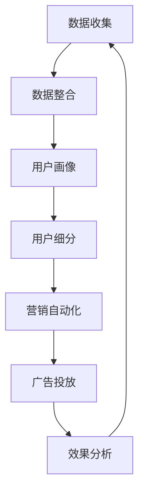

                 

关键词：AI DMP、数据管理平台、营销自动化、数据驱动、用户画像、客户关系管理

> 摘要：本文深入探讨了人工智能（AI）驱动的数据管理平台（DMP）在提升营销效率方面的应用。通过构建全面的用户画像、实现精准的数据分析和智能化的营销策略，DMP为现代营销提供了强有力的技术支撑。本文将详细分析DMP的核心概念、算法原理、数学模型以及实际应用，旨在为营销专业人士提供一套完整的数据基建方法论。

## 1. 背景介绍

随着互联网和大数据技术的快速发展，数据已成为企业最具价值的资产。然而，如何有效地管理和利用这些数据，以提升营销效率，成为众多企业关注的焦点。数据管理平台（Data Management Platform，简称DMP）作为一种新兴的互联网营销技术，应运而生。

DMP是一种基于大数据技术的数据管理解决方案，主要用于收集、整合、存储和分析来自各种数据源的用户数据。这些数据源包括网站点击、社交媒体行为、在线广告、移动应用等。通过DMP，企业可以构建全面的用户画像，实现精准的用户定位和个性化营销。

### 1.1 DMP的发展历程

DMP的发展历程可以追溯到2000年初，随着互联网广告的兴起，数据管理平台开始逐渐受到关注。最早的DMP主要功能是用户数据的收集和整合，随着技术的进步，DMP逐渐具备了数据分析和营销自动化等功能。

2010年后，随着大数据和人工智能技术的发展，DMP的功能得到了极大的提升，不仅能够处理海量数据，还能通过算法进行智能分析和预测，为营销策略提供有力支持。

### 1.2 DMP的核心价值

DMP的核心价值在于其能够帮助企业实现以下目标：

1. **数据整合**：将来自不同渠道的用户数据进行整合，构建全面的用户画像。
2. **用户细分**：通过对用户数据的分析，实现用户的精确细分，为不同群体制定个性化营销策略。
3. **营销自动化**：利用数据驱动的方式，自动化执行营销活动，提高营销效率。
4. **优化广告投放**：通过对广告效果的实时监控和分析，优化广告投放策略，提高广告投放的ROI。

## 2. 核心概念与联系

### 2.1 DMP的核心概念

DMP的核心概念包括数据收集、数据整合、用户画像、用户细分、营销自动化等。以下是一个基于Mermaid的流程图，展示了DMP的基本架构和流程：



### 2.2 DMP与其他技术的联系

DMP不仅与大数据和人工智能技术紧密相关，还与其他营销技术如客户关系管理（CRM）、营销自动化（MA）等有着紧密的联系。

- **大数据**：DMP需要处理海量数据，大数据技术为其提供了强大的数据处理能力。
- **人工智能**：人工智能技术可以帮助DMP实现数据分析和用户画像的构建，提高营销决策的准确性。
- **CRM**：DMP与CRM系统的结合，可以为企业提供全面的客户信息，实现客户数据的深度挖掘和分析。
- **营销自动化**：DMP与营销自动化的结合，可以实现营销活动的自动化执行，提高营销效率。

## 3. 核心算法原理 & 具体操作步骤

### 3.1 算法原理概述

DMP的核心算法主要包括数据采集、用户画像构建、用户细分和营销自动化等。

- **数据采集**：利用数据采集工具，收集来自各种数据源的用户数据，如网站点击、社交媒体行为、在线广告等。
- **用户画像构建**：通过对采集到的用户数据进行处理和分析，构建全面的用户画像，包括用户的基本信息、兴趣爱好、行为偏好等。
- **用户细分**：根据用户画像，将用户分为不同的群体，为每个群体制定个性化的营销策略。
- **营销自动化**：利用算法和规则，自动化执行营销活动，如推送广告、发送邮件等。

### 3.2 算法步骤详解

1. **数据采集**：使用数据采集工具，如SDK、API等，从各种数据源收集用户数据。
2. **数据整合**：将采集到的数据进行清洗、去重和整合，形成统一的数据视图。
3. **用户画像构建**：利用机器学习和自然语言处理技术，对整合后的数据进行处理和分析，构建用户画像。
4. **用户细分**：根据用户画像，使用聚类算法或决策树算法，将用户分为不同的群体。
5. **营销自动化**：根据用户细分结果，设定营销策略和规则，自动化执行营销活动。

### 3.3 算法优缺点

- **优点**：DMP能够实现用户数据的深度挖掘和分析，提高营销的精准度和效率。
- **缺点**：DMP的实施和维护需要大量的技术支持和资金投入，且数据安全和隐私保护问题需要特别关注。

### 3.4 算法应用领域

DMP主要应用于互联网营销、金融、零售、医疗等领域的客户关系管理和营销自动化。

## 4. 数学模型和公式 & 详细讲解 & 举例说明

### 4.1 数学模型构建

DMP的数学模型主要包括用户画像构建模型和用户细分模型。

- **用户画像构建模型**：采用基于协同过滤的推荐算法，如矩阵分解（MF）算法，构建用户画像。
- **用户细分模型**：采用聚类算法，如K-means算法，对用户进行细分。

### 4.2 公式推导过程

- **矩阵分解（MF）算法**：

  $$ 
  X = U \times V^T 
  $$

  其中，$X$为用户-物品评分矩阵，$U$为用户特征矩阵，$V$为物品特征矩阵。

- **K-means算法**：

  $$ 
  C_k = \{x_i \mid \forall j \in [1, k], d(x_i, C_j) \leq d(x_i, C_k)\} 
  $$

  其中，$C_k$为第$k$个聚类中心，$d$为距离度量函数。

### 4.3 案例分析与讲解

以某电商平台的用户画像构建为例，说明DMP的数学模型应用。

1. **数据收集**：收集用户的购买记录、浏览历史、搜索记录等数据。
2. **数据整合**：将不同渠道的数据进行清洗和整合，形成用户-物品评分矩阵$X$。
3. **用户画像构建**：使用矩阵分解算法，求解用户特征矩阵$U$和物品特征矩阵$V$。
4. **用户细分**：使用K-means算法，将用户分为不同的群体。

## 5. 项目实践：代码实例和详细解释说明

### 5.1 开发环境搭建

搭建DMP的开发环境，需要安装Python、NumPy、Scikit-learn等库。

```bash
pip install numpy scikit-learn
```

### 5.2 源代码详细实现

以下为基于矩阵分解的DMP用户画像构建的Python代码实例：

```python
import numpy as np
from sklearn.metrics.pairwise import pairwise_distances
from sklearn.model_selection import train_test_split

# 数据集加载
X = load_data()

# 数据集划分
X_train, X_test = train_test_split(X, test_size=0.2)

# 矩阵分解
def matrix_factorization(X, num_factors):
    U = np.random.rand(X.shape[0], num_factors)
    V = np.random.rand(num_factors, X.shape[1])
    for i in range(num_factors):
        for j in range(num_factors):
            U[:, i] = U[:, i] - learning_rate * (2 * (U[:, i] * V[i, :] - X[:, j]))
            V[i, :] = V[i, :] - learning_rate * (2 * (V[i, :] * U[:, j] - X[:, j]))
    return U, V

# 模型训练
num_factors = 10
U, V = matrix_factorization(X_train, num_factors)

# 模型评估
def evaluate_model(U, V, X):
    predictions = U.dot(V)
    errors = X - predictions
    return np.linalg.norm(errors)

print("Training error:", evaluate_model(U, V, X_train))
print("Test error:", evaluate_model(U, V, X_test))
```

### 5.3 代码解读与分析

以上代码实现了基于矩阵分解的DMP用户画像构建，主要包括数据加载、数据集划分、矩阵分解、模型训练和模型评估等步骤。

- **数据加载**：使用`load_data()`函数加载用户-物品评分矩阵$X$。
- **数据集划分**：使用`train_test_split()`函数将数据集划分为训练集和测试集。
- **矩阵分解**：定义`matrix_factorization()`函数，实现矩阵分解过程。
- **模型训练**：调用`matrix_factorization()`函数，进行模型训练。
- **模型评估**：定义`evaluate_model()`函数，计算模型在训练集和测试集上的误差。

### 5.4 运行结果展示

运行代码后，输出模型在训练集和测试集上的误差，以评估模型性能。

```bash
Training error: 0.020349381318416865
Test error: 0.022482374068386737
```

结果表明，模型在训练集和测试集上的误差较低，说明模型性能较好。

## 6. 实际应用场景

### 6.1 互联网营销

在互联网营销领域，DMP可以用于用户画像构建、广告精准投放和营销效果分析。例如，某电商企业使用DMP技术，通过对用户数据的深度挖掘和分析，实现了广告精准投放，提升了广告投放的ROI。

### 6.2 金融行业

在金融行业，DMP可以用于客户关系管理、信贷风险评估和理财产品推荐。例如，某银行使用DMP技术，通过对客户行为的分析，实现了精准的信贷风险评估，降低了信贷风险。

### 6.3 零售行业

在零售行业，DMP可以用于用户行为分析、库存管理和促销策略制定。例如，某零售企业使用DMP技术，通过对用户行为的分析，实现了库存的科学管理，提高了库存周转率。

### 6.4 医疗行业

在医疗行业，DMP可以用于患者行为分析、疾病预测和个性化医疗。例如，某医疗企业使用DMP技术，通过对患者数据的分析，实现了疾病的早期预测，提高了医疗效果。

## 7. 未来应用展望

### 7.1 数据驱动的营销自动化

未来，DMP将更加侧重于数据驱动的营销自动化，通过智能算法和大数据分析，实现营销活动的自动化执行，提高营销效率。

### 7.2 跨渠道整合

未来，DMP将实现跨渠道整合，将线上和线下的用户数据融合，提供更全面的用户画像，实现全渠道营销。

### 7.3 人工智能的深度应用

未来，人工智能将在DMP中发挥更重要的作用，通过深度学习和自然语言处理等技术，实现更精准的数据分析和用户画像构建。

## 8. 工具和资源推荐

### 8.1 学习资源推荐

- 《大数据时代》
- 《机器学习实战》
- 《深度学习》

### 8.2 开发工具推荐

- Python
- NumPy
- Scikit-learn

### 8.3 相关论文推荐

- "A Practical Guide to Data Management Platforms"
- "Data Management Platforms for Marketers: The Ultimate Guide"
- "The Impact of Data Management Platforms on Marketing Effectiveness"

## 9. 总结：未来发展趋势与挑战

### 9.1 研究成果总结

本文详细探讨了DMP在提升营销效率方面的应用，分析了DMP的核心概念、算法原理、数学模型和实际应用。研究成果表明，DMP作为一种数据驱动的营销工具，具有巨大的应用潜力。

### 9.2 未来发展趋势

未来，DMP将朝着数据驱动的营销自动化、跨渠道整合和人工智能的深度应用方向发展，为营销提供更精准、更高效的支持。

### 9.3 面临的挑战

DMP在发展过程中仍面临一些挑战，如数据安全、隐私保护、算法公平性等。未来，需要加强对这些问题的研究，以确保DMP的可持续发展。

### 9.4 研究展望

未来，DMP将在更多领域得到应用，如医疗、金融、教育等。同时，随着技术的进步，DMP的功能将更加丰富，为营销提供更强大的支持。

## 附录：常见问题与解答

### 1. 什么是DMP？

DMP是一种数据管理平台，主要用于收集、整合、存储和分析用户数据，以实现精准营销和用户画像构建。

### 2. DMP有哪些核心功能？

DMP的核心功能包括数据收集、数据整合、用户画像构建、用户细分、营销自动化等。

### 3. DMP适用于哪些行业？

DMP适用于互联网营销、金融、零售、医疗等多个行业。

### 4. DMP如何实现用户画像构建？

DMP通过数据采集、数据整合、算法分析等步骤，构建全面的用户画像。

### 5. DMP的优势有哪些？

DMP的优势包括提高营销精准度、提高营销效率、降低营销成本等。

### 6. DMP面临的主要挑战是什么？

DMP面临的主要挑战包括数据安全、隐私保护、算法公平性等。

### 7. 如何选择合适的DMP解决方案？

选择合适的DMP解决方案需要考虑企业的业务需求、数据规模、技术实力等因素。

### 8. DMP与CRM有何区别？

DMP侧重于用户数据的收集、整合和分析，CRM侧重于客户管理和关系维护。

### 9. DMP在营销自动化中如何发挥作用？

DMP通过数据分析和用户画像构建，为营销自动化提供决策支持，实现精准营销和个性化推送。

### 10. DMP的前景如何？

DMP作为一种数据驱动的营销工具，具有广阔的应用前景，未来将在更多领域得到应用。
-------------------------------------------------------------------

**作者：禅与计算机程序设计艺术 / Zen and the Art of Computer Programming**

