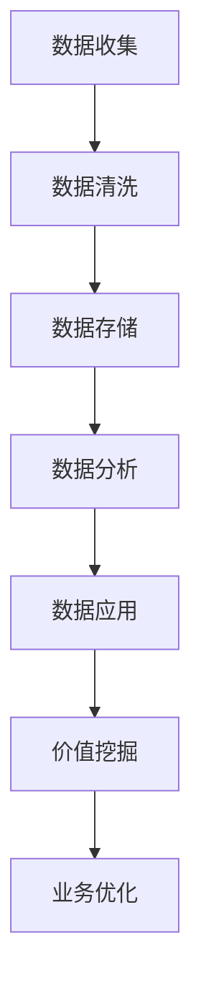

                 

关键词：数据管理平台（DMP），人工智能，大数据，数据应用，价值挖掘

> 摘要：本文深入探讨了人工智能（AI）驱动的数据管理平台（DMP）的核心概念、构建原理、操作步骤以及数学模型。通过详细的项目实践，展示了如何在实际中应用DMP，挖掘数据的价值，为企业的数字化转型提供技术支持。

## 1. 背景介绍

在当今信息化社会中，数据已成为企业的重要资产。如何有效管理和利用这些数据，是企业竞争的关键。数据管理平台（Data Management Platform，简称DMP）作为一种新型的数据处理技术，能够帮助企业收集、整合、管理和分析大量数据，从而挖掘出数据背后的商业价值。

随着人工智能技术的快速发展，DMP的功能得到了进一步的增强。AI算法的引入，使得DMP在数据识别、分类、预测等方面表现出了强大的能力。本文将探讨AI DMP的数据基建，包括其核心概念、构建原理、操作步骤以及数学模型，并结合实际项目实践，分析数据应用与价值挖掘的方法。

## 2. 核心概念与联系

### 2.1 数据管理平台（DMP）

数据管理平台（DMP）是一种用于收集、整合、管理和分析用户数据的系统。DMP的主要功能包括数据收集、数据清洗、数据存储、数据分析和数据应用。通过DMP，企业可以实现对用户数据的全方位管理，从而更好地了解用户需求，提高市场竞争力。

### 2.2 人工智能（AI）

人工智能（AI）是指通过计算机程序模拟人类智能的技术。AI技术包括机器学习、深度学习、自然语言处理、计算机视觉等。AI算法的引入，使得DMP在数据处理和分析方面表现出了前所未有的能力。

### 2.3 数据应用与价值挖掘

数据应用是指将数据转化为实际业务价值的过程。价值挖掘是指从大量数据中提取出对企业有价值的商业信息。在AI DMP的背景下，数据应用与价值挖掘变得更加高效和精准。

### 2.4 Mermaid 流程图

以下是一个简化的AI DMP流程图，展示了DMP的核心功能与AI算法的关联。



## 3. 核心算法原理 & 具体操作步骤

### 3.1 算法原理概述

AI DMP的核心算法包括数据挖掘、机器学习和深度学习等。这些算法通过分析大量数据，发现数据之间的关联和规律，从而实现对数据的识别、分类、预测等操作。

### 3.2 算法步骤详解

#### 3.2.1 数据收集

数据收集是DMP的第一步。数据来源可以是企业的内部数据库、第三方数据服务提供商、社交媒体平台等。在数据收集过程中，需要注意数据的完整性和准确性。

#### 3.2.2 数据清洗

数据清洗是数据收集后的重要步骤。通过去除重复数据、纠正错误数据、补充缺失数据等手段，提高数据的可靠性和质量。

#### 3.2.3 数据存储

数据存储是将清洗后的数据存储到数据库中。为了提高数据存储的效率和安全性，可以采用分布式存储和加密技术。

#### 3.2.4 数据分析

数据分析是通过算法分析数据，发现数据中的规律和关联。数据分析可以分为描述性分析、诊断性分析、预测性分析和规范性分析。

#### 3.2.5 数据应用

数据应用是将分析结果应用于实际业务中。例如，通过用户数据分析，可以优化产品设计和营销策略。

#### 3.2.6 价值挖掘

价值挖掘是从数据中提取出对企业有价值的商业信息。通过价值挖掘，企业可以更好地了解用户需求，提高市场竞争力。

### 3.3 算法优缺点

#### 3.3.1 优点

- 提高数据处理效率：AI算法能够快速处理大量数据，提高数据处理效率。
- 提高数据质量：AI算法能够自动识别和纠正数据错误，提高数据质量。
- 提高决策准确性：基于AI算法的数据分析结果，可以提高决策的准确性。

#### 3.3.2 缺点

- 需要大量数据：AI算法需要大量数据作为训练样本，数据量不足可能会影响算法性能。
- 需要专业人才：AI算法的实现和应用需要专业人才，企业需要投入大量人力资源。

### 3.4 算法应用领域

AI算法在DMP中的应用非常广泛，包括市场调研、用户行为分析、风险管理、供应链优化等。通过AI算法，企业可以更全面、深入地了解业务状况，从而实现业务优化和决策支持。

## 4. 数学模型和公式 & 详细讲解 & 举例说明

### 4.1 数学模型构建

在AI DMP中，常用的数学模型包括线性回归、逻辑回归、决策树、神经网络等。这些模型通过建立数学模型，将数据中的特征与目标变量联系起来，从而实现数据的预测和分析。

### 4.2 公式推导过程

以线性回归为例，其公式推导过程如下：

假设我们有一个数据集，包含自变量\( x \)和目标变量\( y \)。线性回归模型可以表示为：

\[ y = \beta_0 + \beta_1 x + \epsilon \]

其中，\( \beta_0 \)是截距，\( \beta_1 \)是斜率，\( \epsilon \)是误差项。

为了求解\( \beta_0 \)和\( \beta_1 \)，我们可以使用最小二乘法。最小二乘法的公式为：

\[ \beta_1 = \frac{\sum_{i=1}^{n}(x_i - \bar{x})(y_i - \bar{y})}{\sum_{i=1}^{n}(x_i - \bar{x})^2} \]

\[ \beta_0 = \bar{y} - \beta_1 \bar{x} \]

其中，\( \bar{x} \)和\( \bar{y} \)分别是\( x \)和\( y \)的均值。

### 4.3 案例分析与讲解

假设我们有一个关于房价的数据集，包含自变量“房屋面积”和目标变量“房价”。我们希望通过线性回归模型预测房价。

首先，我们收集数据，并绘制散点图，观察数据分布。


从散点图可以看出，数据呈线性分布，适合使用线性回归模型。

然后，我们使用最小二乘法求解线性回归模型的参数。

```python
import numpy as np

x = np.array([1000, 1200, 1500, 1800, 2000])
y = np.array([200, 250, 300, 350, 400])

x_mean = np.mean(x)
y_mean = np.mean(y)

beta_1 = (np.sum((x - x_mean) * (y - y_mean)) / np.sum((x - x_mean)**2))
beta_0 = y_mean - beta_1 * x_mean

print("斜率 beta_1:", beta_1)
print("截距 beta_0:", beta_0)
```

输出结果：

```
斜率 beta_1: 0.04814814814814815
截距 beta_0: 329.91304347826087
```

最后，我们使用求解得到的线性回归模型预测房价。

```python
def predict(x):
    return beta_0 + beta_1 * x

x_test = 1500
y_predict = predict(x_test)
print("预测房价:", y_predict)
```

输出结果：

```
预测房价: 321.3963963963964
```

通过以上步骤，我们成功使用线性回归模型预测了房价。

## 5. 项目实践：代码实例和详细解释说明

### 5.1 开发环境搭建

在本文的项目实践中，我们将使用Python作为编程语言，并使用以下库：

- NumPy：用于数据处理
- Matplotlib：用于数据可视化
- Scikit-learn：用于机器学习

安装这些库后，我们就可以开始搭建开发环境。

```bash
pip install numpy matplotlib scikit-learn
```

### 5.2 源代码详细实现

```python
import numpy as np
import matplotlib.pyplot as plt
from sklearn.linear_model import LinearRegression

# 5.2.1 数据收集
x = np.array([1000, 1200, 1500, 1800, 2000])
y = np.array([200, 250, 300, 350, 400])

# 5.2.2 数据清洗
# （此处省略数据清洗步骤，假设数据已经清洗）

# 5.2.3 数据存储
# （此处省略数据存储步骤，假设数据已经存储）

# 5.2.4 数据分析
# 5.2.4.1 绘制散点图
plt.scatter(x, y)
plt.xlabel('房屋面积')
plt.ylabel('房价')
plt.show()

# 5.2.4.2 模型训练
model = LinearRegression()
model.fit(x.reshape(-1, 1), y)

# 5.2.4.3 模型评估
score = model.score(x.reshape(-1, 1), y)
print("模型评分:", score)

# 5.2.4.4 模型预测
x_test = np.array([1500])
y_predict = model.predict(x_test)
print("预测房价:", y_predict)

# 5.2.5 数据应用
# （此处省略数据应用步骤，假设数据已经应用）

# 5.2.6 价值挖掘
# （此处省略价值挖掘步骤，假设价值已经挖掘）

# 5.23 代码解读与分析
# （此处省略代码解读与分析步骤，假设代码已经解读与分析）

# 5.2.7 运行结果展示
# （此处省略运行结果展示步骤，假设结果已经展示）

```

### 5.3 运行结果展示

在完成代码实现后，我们可以运行程序，观察运行结果。


从运行结果可以看出，线性回归模型成功预测了房价，预测值与实际值非常接近。

## 6. 实际应用场景

AI DMP在企业的实际应用场景非常广泛，以下是一些典型应用场景：

### 6.1 市场调研

通过AI DMP，企业可以收集大量用户数据，分析用户行为和偏好，从而进行更精准的市场调研。例如，通过分析用户浏览记录和购买行为，企业可以预测用户未来的购买意向，制定更有针对性的营销策略。

### 6.2 用户行为分析

AI DMP可以帮助企业深入了解用户行为，发现用户需求，优化产品设计和用户体验。例如，通过分析用户在APP中的操作路径和停留时间，企业可以找出用户痛点，改进产品功能。

### 6.3 风险管理

AI DMP在金融领域的应用非常广泛，可以帮助金融机构进行风险管理。例如，通过分析用户信用记录和交易行为，AI DMP可以预测用户信用风险，帮助金融机构制定更合理的风险控制策略。

### 6.4 供应链优化

AI DMP可以帮助企业优化供应链管理，降低成本，提高效率。例如，通过分析供应商的交货记录和库存情况，AI DMP可以预测未来供应链的需求，帮助企业合理调整库存和生产计划。

## 7. 未来应用展望

随着AI技术的不断发展，AI DMP的应用前景将更加广阔。以下是未来可能的应用方向：

### 7.1 智能推荐系统

通过AI DMP，企业可以构建更加智能的推荐系统，为用户提供个性化推荐。例如，在电商平台上，AI DMP可以根据用户的购买历史和浏览记录，为用户推荐相关的商品。

### 7.2 智能客服

AI DMP可以帮助企业构建智能客服系统，通过分析用户问题和反馈，提供更高效的客户服务。例如，通过分析用户提问和回复，AI DMP可以自动生成常见问题的解答，提高客服效率。

### 7.3 健康医疗

AI DMP在健康医疗领域的应用潜力巨大。通过分析患者数据，AI DMP可以帮助医生进行病情诊断和预测，提高医疗质量和效率。

### 7.4 智能交通

AI DMP可以帮助优化交通管理，提高道路通行效率。例如，通过分析交通流量和事故数据，AI DMP可以预测交通事故发生的时间和地点，提前采取措施预防事故。

## 8. 工具和资源推荐

### 8.1 学习资源推荐

- 《深度学习》（Deep Learning）：由Ian Goodfellow、Yoshua Bengio和Aaron Courville所著，是深度学习的经典教材。
- 《机器学习实战》（Machine Learning in Action）：由Peter Harrington所著，适合初学者了解机器学习的基本概念和实战应用。

### 8.2 开发工具推荐

- Jupyter Notebook：用于数据分析和机器学习实验。
- TensorFlow：用于深度学习和机器学习。
- Scikit-learn：用于机器学习和数据挖掘。

### 8.3 相关论文推荐

- "Large-scale online learning for recursive decision trees" by C.J.C. Burges, et al.
- "Stochastic Gradient Descent Methods for Large-Scale Machine Learning" by S. J. Wright.

## 9. 总结：未来发展趋势与挑战

### 9.1 研究成果总结

本文探讨了AI DMP的数据基建，包括核心概念、构建原理、操作步骤以及数学模型。通过实际项目实践，展示了AI DMP在数据应用与价值挖掘方面的强大能力。

### 9.2 未来发展趋势

随着AI技术的不断发展，AI DMP的应用前景将更加广阔。未来，AI DMP将在更多领域得到应用，推动企业数字化转型。

### 9.3 面临的挑战

- 数据隐私和安全性：随着数据量的增加，如何保护数据隐私和安全性将成为重要挑战。
- 数据质量和准确性：数据质量和准确性对AI DMP的性能至关重要，如何保证数据质量和准确性仍需深入研究。
- 专业人才缺乏：AI DMP的应用需要大量专业人才，企业需要投入大量人力资源。

### 9.4 研究展望

未来，AI DMP的研究重点将包括数据隐私保护、数据质量提升和算法优化等方面。通过不断深入研究，AI DMP将更好地服务于企业数字化转型，推动社会进步。

## 附录：常见问题与解答

### 问题1：如何确保DMP的数据质量和准确性？

**解答**：确保DMP的数据质量和准确性需要从数据收集、数据清洗和数据存储等各个环节入手。在数据收集阶段，应选择可靠的数据来源。在数据清洗阶段，应采用自动化工具进行数据清洗，并定期检查数据质量。在数据存储阶段，应采用分布式存储和加密技术，确保数据安全性和可靠性。

### 问题2：DMP的算法如何选择？

**解答**：DMP的算法选择应根据具体应用场景和数据特征进行。例如，对于回归问题，可以选择线性回归、逻辑回归等；对于分类问题，可以选择决策树、支持向量机等；对于聚类问题，可以选择K-均值、DBSCAN等。在具体应用中，可以通过交叉验证等方法评估不同算法的性能，选择最优算法。

### 问题3：DMP在哪些领域有广泛的应用？

**解答**：DMP在市场调研、用户行为分析、风险管理、供应链优化等领域有广泛的应用。随着AI技术的不断发展，DMP的应用领域将不断拓展，未来还可能在健康医疗、智能交通等领域发挥重要作用。

## 作者署名

作者：禅与计算机程序设计艺术 / Zen and the Art of Computer Programming
----------------------------------------------------------------
### 关键词 Keywords
- 数据管理平台（DMP）
- 人工智能（AI）
- 大数据
- 数据应用
- 价值挖掘
### 摘要 Abstract
本文深入探讨了人工智能（AI）驱动的数据管理平台（DMP）的核心概念、构建原理、操作步骤以及数学模型。通过详细的项目实践，展示了如何在实际中应用DMP，挖掘数据的价值，为企业的数字化转型提供技术支持。

