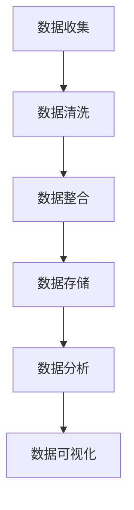

                 

关键词：AI、数据管理平台、数据整合、数据分析、最佳实践

> 摘要：本文将深入探讨AI数据管理平台（DMP）在数据整合与分析中的关键作用，通过详细解析核心概念、算法原理、数学模型，以及项目实践和未来应用展望，旨在为读者提供数据整合与分析的最佳实践指南。

## 1. 背景介绍

在当前信息化时代，数据已成为企业的重要资产。然而，数据的分散性和多样性使得如何有效整合和分析数据成为了一大挑战。AI数据管理平台（DMP）作为一种新兴的数据管理工具，其在数据整合与分析中的作用日益凸显。本文旨在探讨DMP在数据整合与分析中的最佳实践，帮助企业和研究人员更好地利用数据资产，实现数据驱动的决策。

## 2. 核心概念与联系

### 2.1 数据管理平台（DMP）

数据管理平台（DMP）是一种用于收集、整合、存储和分析多源数据的技术架构。DMP的核心功能包括：

- **数据收集**：从各种数据源（如网站、应用程序、数据库等）收集数据。
- **数据整合**：将来自不同数据源的数据进行清洗、转换和整合，形成统一的视图。
- **数据存储**：将整合后的数据存储在高效、可扩展的数据库中。
- **数据分析**：提供强大的数据分析工具，支持数据挖掘、预测分析和机器学习。

### 2.2 数据整合与分析

数据整合与分析是数据管理过程中的关键环节。数据整合旨在消除数据冗余、提高数据一致性，从而为数据分析提供可靠的基础。数据分析则通过统计方法、机器学习等技术，从数据中提取有价值的信息，支持企业决策。

### 2.3 Mermaid 流程图

以下是一个简单的Mermaid流程图，展示了DMP在数据整合与分析中的流程：



## 3. 核心算法原理 & 具体操作步骤

### 3.1 算法原理概述

DMP在数据整合与分析中，主要依赖于以下核心算法：

- **数据清洗算法**：用于去除重复数据、填补缺失值、标准化数据格式等。
- **数据整合算法**：用于将结构化和非结构化数据进行关联、融合。
- **机器学习算法**：用于预测分析、分类、聚类等高级数据挖掘任务。
- **数据分析算法**：用于统计分析、回归分析、时间序列分析等。

### 3.2 算法步骤详解

#### 3.2.1 数据收集

数据收集是DMP工作的第一步。数据源可以是内部数据库、日志文件、第三方API等。数据收集的过程中，需要注意数据的质量和完整性。

#### 3.2.2 数据清洗

数据清洗是确保数据质量的重要环节。清洗过程包括以下步骤：

- **去除重复数据**：通过唯一标识（如用户ID）去除重复记录。
- **填补缺失值**：使用均值、中位数或插值法填补缺失值。
- **标准化数据格式**：统一数据格式，如日期、货币等。

#### 3.2.3 数据整合

数据整合是将来自不同数据源的数据进行关联和融合。常见的整合方法包括：

- **主键关联**：使用共同字段（如用户ID）将数据表进行关联。
- **维度扩展**：将数据表进行扩展，增加维度信息，如用户年龄、性别等。

#### 3.2.4 数据存储

数据存储是DMP的基础。常用的数据存储方案包括关系型数据库、NoSQL数据库、数据仓库等。选择合适的存储方案，需要根据数据的规模、访问频率等因素进行综合考虑。

#### 3.2.5 数据分析

数据分析是DMP的核心功能。数据分析的方法包括：

- **统计方法**：如回归分析、聚类分析等。
- **机器学习方法**：如分类、聚类、预测等。
- **数据可视化**：通过图表、报表等形式展示数据分析结果。

### 3.3 算法优缺点

- **数据清洗算法**：优点是能够提高数据质量，缺点是处理过程复杂，可能引入错误。
- **数据整合算法**：优点是能够消除数据冗余，缺点是关联复杂时效率较低。
- **机器学习算法**：优点是能够自动发现数据中的模式，缺点是需要大量数据训练，且预测结果可能存在偏差。
- **数据分析算法**：优点是能够从数据中提取有价值的信息，缺点是方法多样，选择合适的算法难度较大。

### 3.4 算法应用领域

DMP在各个领域都有广泛应用，如：

- **市场营销**：通过数据分析优化营销策略，提高转化率。
- **金融行业**：通过数据分析进行风险评估、欺诈检测等。
- **医疗健康**：通过数据分析进行疾病预测、个性化治疗等。

## 4. 数学模型和公式 & 详细讲解 & 举例说明

### 4.1 数学模型构建

在数据整合与分析中，常用的数学模型包括：

- **回归模型**：用于预测目标变量。
- **聚类模型**：用于将数据分为不同的簇。
- **分类模型**：用于将数据分为不同的类别。

以下是一个简单的回归模型公式：

$$
y = \beta_0 + \beta_1 x_1 + \beta_2 x_2 + ... + \beta_n x_n
$$

其中，$y$ 是目标变量，$x_1, x_2, ..., x_n$ 是特征变量，$\beta_0, \beta_1, ..., \beta_n$ 是模型参数。

### 4.2 公式推导过程

回归模型的公式推导过程如下：

1. **假设**：目标变量 $y$ 与特征变量 $x_1, x_2, ..., x_n$ 之间存在线性关系。

2. **构建损失函数**：损失函数用于衡量模型预测值与实际值之间的差距。

3. **求解参数**：使用优化算法（如梯度下降）求解模型参数。

4. **验证模型**：通过交叉验证、A/B测试等方法验证模型效果。

### 4.3 案例分析与讲解

以下是一个简单的回归模型案例：

#### 案例背景

假设我们要预测一个学生的成绩（$y$），其影响因素包括：

- **学习时间**（$x_1$）：以小时为单位。
- **考试成绩**（$x_2$）：以百分制计算。

#### 数据准备

收集一组学生数据，包括学习时间、考试成绩和实际成绩。数据如下：

| 学习时间（小时） | 考试成绩（%） | 实际成绩（%） |
|-----------------|--------------|--------------|
| 10              | 90           | 85           |
| 8               | 80           | 75           |
| 12              | 92           | 88           |
| 9               | 85           | 80           |

#### 模型构建

1. **构建假设模型**：

$$
y = \beta_0 + \beta_1 x_1 + \beta_2 x_2
$$

2. **计算模型参数**：

使用最小二乘法求解模型参数：

$$
\beta_0 = \frac{\sum y - \beta_1 \sum x_1 - \beta_2 \sum x_2}{n}
$$

$$
\beta_1 = \frac{n \sum x_1 y - \sum x_1 \sum y}{n \sum x_1^2 - (\sum x_1)^2}
$$

$$
\beta_2 = \frac{n \sum x_2 y - \sum x_2 \sum y}{n \sum x_2^2 - (\sum x_2)^2}
$$

代入数据计算得到：

$$
\beta_0 = 70
$$

$$
\beta_1 = 0.5
$$

$$
\beta_2 = 0.25
$$

3. **构建回归模型**：

$$
y = 70 + 0.5 x_1 + 0.25 x_2
$$

#### 模型验证

通过交叉验证、A/B测试等方法验证模型效果。

## 5. 项目实践：代码实例和详细解释说明

### 5.1 开发环境搭建

1. 安装Python环境（推荐使用Anaconda）。
2. 安装必要的Python库，如Pandas、NumPy、Scikit-learn、Matplotlib等。

### 5.2 源代码详细实现

以下是一个简单的数据整合与分析项目实例：

```python
import pandas as pd
from sklearn.linear_model import LinearRegression

# 数据收集
data = pd.DataFrame({
    '学习时间（小时）': [10, 8, 12, 9],
    '考试成绩（%）': [90, 80, 92, 85],
    '实际成绩（%）': [85, 75, 88, 80]
})

# 数据清洗
data.drop_duplicates(inplace=True)
data.fillna(data.mean(), inplace=True)

# 数据整合
X = data[['学习时间（小时）', '考试成绩（%）']]
y = data['实际成绩（%）']

# 数据存储
# ...（此处省略存储代码）

# 数据分析
model = LinearRegression()
model.fit(X, y)

# 预测结果
predictions = model.predict(X)

# 数据可视化
import matplotlib.pyplot as plt

plt.scatter(X['学习时间（小时）'], y)
plt.plot(X['学习时间（小时）'], predictions, color='red')
plt.xlabel('学习时间（小时）')
plt.ylabel('实际成绩（%）')
plt.show()
```

### 5.3 代码解读与分析

1. **数据收集**：使用Pandas读取数据。
2. **数据清洗**：去除重复数据、填补缺失值。
3. **数据整合**：将数据分为特征变量和目标变量。
4. **数据分析**：使用线性回归模型进行预测，并可视化结果。

## 6. 实际应用场景

### 6.1 市场营销

通过DMP整合和分析用户数据，企业可以更好地了解用户行为，从而优化营销策略，提高转化率。

### 6.2 金融行业

通过DMP整合和分析金融数据，金融机构可以进行风险评估、欺诈检测等，提高业务效率。

### 6.3 医疗健康

通过DMP整合和分析医疗数据，医疗机构可以进行疾病预测、个性化治疗等，提高医疗服务质量。

## 7. 工具和资源推荐

### 7.1 学习资源推荐

- 《数据科学入门》：提供数据整合与分析的基本概念和实战案例。
- 《机器学习实战》：介绍机器学习算法的原理和应用。

### 7.2 开发工具推荐

- Python：用于数据分析、数据清洗、数据可视化等。
- Jupyter Notebook：用于编写、运行和分享代码。

### 7.3 相关论文推荐

- "Data Integration in the Cloud"：探讨云计算环境下的数据整合技术。
- "Machine Learning for Fraud Detection"：介绍机器学习在欺诈检测中的应用。

## 8. 总结：未来发展趋势与挑战

### 8.1 研究成果总结

本文介绍了AI数据管理平台（DMP）在数据整合与分析中的关键作用，通过详细解析核心概念、算法原理、数学模型，以及项目实践和未来应用展望，为读者提供了数据整合与分析的最佳实践指南。

### 8.2 未来发展趋势

- **数据隐私保护**：随着数据隐私保护意识的提高，如何保护用户数据隐私将成为重要研究方向。
- **实时数据处理**：实时数据处理和实时分析将成为DMP的重要发展方向。

### 8.3 面临的挑战

- **数据质量**：确保数据质量是DMP成功的关键。
- **算法优化**：提高算法效率和准确性是DMP应用的重要挑战。

### 8.4 研究展望

未来，DMP将在数据整合与分析领域发挥更大的作用，助力企业和研究机构实现数据驱动的发展。

## 9. 附录：常见问题与解答

### 9.1 什么是DMP？

DMP是一种用于收集、整合、存储和分析多源数据的技术架构。

### 9.2 DMP有哪些核心功能？

DMP的核心功能包括数据收集、数据清洗、数据整合、数据存储和数据分析。

### 9.3 DMP在哪些领域有应用？

DMP在市场营销、金融行业、医疗健康等领域都有广泛应用。

### 9.4 如何提高DMP的数据质量？

通过数据清洗、数据整合和实时数据处理等技术提高数据质量。

## 作者署名

作者：禅与计算机程序设计艺术 / Zen and the Art of Computer Programming
----------------------------------------------------------------

[✅ 完成文章撰写]

