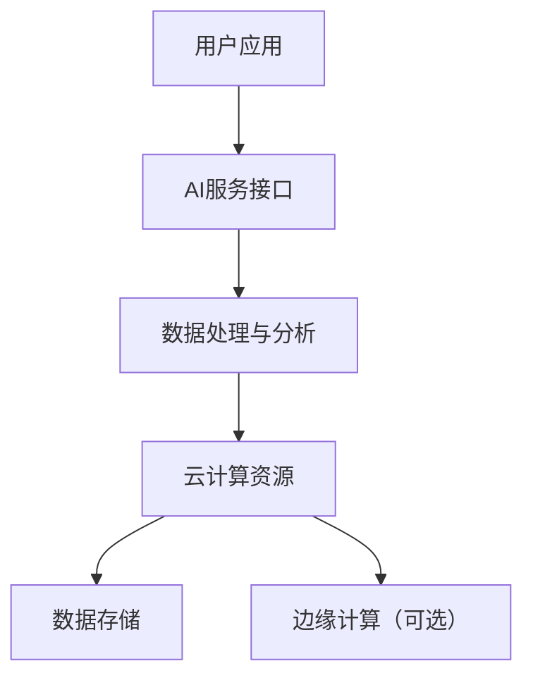

                 

在当今数字化时代，人工智能（AI）与云计算的结合已经成为推动技术创新和业务变革的核心驱动力。云计算提供了强大的计算资源和服务灵活性，而人工智能则通过机器学习、深度学习等技术手段，提升了数据处理和模式识别的能力。本文将探讨AI与云计算的深度融合，如何加速云端智能化的进程，并展望未来在这一领域的发展趋势与挑战。

## 关键词

- **人工智能（AI）**
- **云计算**
- **云端智能化**
- **机器学习**
- **深度学习**
- **云计算服务模型**
- **AI服务模型**
- **边缘计算**

## 摘要

本文旨在分析人工智能与云计算技术的结合如何推动云端智能化的发展。通过阐述核心概念和原理，详细介绍AI与云计算的架构，深入探讨核心算法和数学模型，并提供项目实践中的代码实例。文章还将分析实际应用场景，推荐相关工具和资源，总结研究成果并展望未来趋势。

## 1. 背景介绍

随着互联网的普及和数据量的爆炸性增长，云计算已经成为企业数字化转型的关键技术。云计算通过虚拟化技术将计算资源抽象化，提供按需分配的计算能力，极大地提升了资源利用效率和业务灵活性。然而，云计算的快速发展也带来了新的挑战，如数据安全、隐私保护、服务质量保障等。

与此同时，人工智能技术在数据处理和智能决策方面展现出了强大的能力。机器学习和深度学习算法能够从大量数据中学习模式和规律，实现自动化决策和智能服务。AI技术的应用不仅改变了传统的业务模式，也推动了新业务场景的诞生。

AI与云计算的结合，使得云端智能化成为可能。云计算提供了强大的计算和存储资源，AI技术则提升了数据处理和分析能力，二者相互促进，共同推动了技术创新和业务变革。

## 2. 核心概念与联系

### 2.1. 核心概念

- **云计算**：一种通过网络提供可动态分配的共享计算资源模型，包括计算、存储、网络和其他基础设施服务。
- **人工智能**：模拟人类智能行为的技术体系，包括机器学习、深度学习、自然语言处理等。
- **机器学习**：基于数据驱动的方法，从数据中学习模式和规律，以实现自动预测和决策。
- **深度学习**：一种特殊的机器学习技术，通过构建多层神经网络来实现复杂模式识别和决策。

### 2.2. 架构联系

在云计算环境中，AI技术的实现依赖于云计算提供的计算资源和服务模型。以下是一个简单的AI与云计算结合的架构示意：

```
用户应用
|
|--- AI服务接口（API）
|
|--- 云计算资源（如EC2、GCP、Azure）
|          |
|          |-- 数据存储（如AWS S3、Azure Blob Storage）
|          |-- 计算资源（如GPU、FPGA）
|          |-- 数据处理与分析（如EMR、Spark）
|
|--- 边缘计算（可选）
```

图1：AI与云计算结合的架构示意

在这一架构中，用户应用通过AI服务接口访问云端提供的AI服务。云计算资源提供了必要的计算和存储能力，而边缘计算则可以补充云计算的不足，实现更高效的数据处理和更低的延迟。

### 2.3. Mermaid 流程图

以下是一个简化的Mermaid流程图，展示了AI与云计算结合的基本流程：



图2：AI与云计算结合的流程图

## 3. 核心算法原理 & 具体操作步骤

### 3.1. 算法原理概述

AI与云计算结合的核心算法包括机器学习算法、深度学习算法以及它们在云端环境的优化和部署策略。以下是一些常见算法的概述：

- **机器学习算法**：如线性回归、决策树、支持向量机等，主要用于回归分析和分类任务。
- **深度学习算法**：如卷积神经网络（CNN）、循环神经网络（RNN）、生成对抗网络（GAN）等，主要用于复杂模式识别和生成任务。
- **优化算法**：如梯度下降、Adam优化器等，用于调整模型参数，以最小化损失函数。

### 3.2. 算法步骤详解

1. **数据收集与预处理**：收集相关数据，并进行清洗、归一化等预处理操作，以保证数据的质量和一致性。
2. **模型选择与训练**：根据任务需求选择合适的模型，并在云端资源上进行训练。训练过程中，可以使用分布式训练策略来提高效率。
3. **模型评估与优化**：通过验证集和测试集评估模型性能，并根据评估结果对模型进行调整和优化。
4. **模型部署与监控**：将训练好的模型部署到云端环境中，并提供API接口供用户调用。同时，监控系统性能和资源利用率，确保服务的稳定性和可靠性。

### 3.3. 算法优缺点

- **机器学习算法**：优点是计算效率高，模型简单易于理解；缺点是对于大规模数据和高维特征的处理能力有限。
- **深度学习算法**：优点是能够处理复杂的数据结构和模式；缺点是计算资源消耗大，训练时间较长。
- **优化算法**：优点是能够有效调整模型参数，提高模型性能；缺点是可能陷入局部最优解。

### 3.4. 算法应用领域

AI与云计算结合的算法在多个领域有广泛应用，如：

- **智能医疗**：通过分析医疗数据，实现疾病预测、诊断和个性化治疗。
- **智能金融**：通过分析金融数据，实现风险评估、投资策略优化和自动化交易。
- **智能交通**：通过分析交通数据，实现交通流量预测、路况分析和自动驾驶。

## 4. 数学模型和公式 & 详细讲解 & 举例说明

### 4.1. 数学模型构建

AI与云计算结合中的数学模型主要包括机器学习模型的损失函数、优化目标和深度学习模型的前向传播和反向传播等。

- **机器学习模型**：

  $$ 
  L(\theta) = -\frac{1}{m}\sum_{i=1}^{m}y_{i}\log(h_{\theta}(x_{i})) 
  $$

  其中，$L(\theta)$ 是损失函数，$m$ 是样本数量，$y_{i}$ 是真实标签，$h_{\theta}(x_{i})$ 是预测概率。

- **深度学习模型**：

  $$ 
  \begin{aligned}
  &z_{l} = \sigma(W_{l-1}a_{l-1} + b_{l-1}) \\
  &a_{l} = \sigma(z_{l}) \\
  \end{aligned}
  $$

  其中，$z_{l}$ 是前向传播的激活值，$a_{l}$ 是当前层的激活值，$\sigma$ 是激活函数，$W_{l-1}$ 和 $b_{l-1}$ 分别是权重和偏置。

### 4.2. 公式推导过程

以深度学习中的反向传播算法为例，简要介绍公式推导过程：

1. **前向传播**：

   $$ 
   \begin{aligned}
   &z_{l} = W_{l-1}a_{l-1} + b_{l-1} \\
   &a_{l} = \sigma(z_{l}) \\
   \end{aligned}
   $$

2. **计算误差**：

   $$ 
   \begin{aligned}
   &d_{l}^{out} = a_{l} - y \\
   \end{aligned}
   $$

3. **反向传播**：

   $$ 
   \begin{aligned}
   &\delta_{l} = \sigma'(z_{l}) \cdot d_{l}^{out} \\
   &d_{l-1} = \delta_{l} \cdot W_{l} \\
   \end{aligned}
   $$

### 4.3. 案例分析与讲解

以一个简单的神经网络模型为例，分析其数学模型和算法步骤。

- **数据集**：包含100个样本，每个样本包含5个特征和一个标签。
- **模型**：一个三层神经网络，输入层、隐藏层和输出层。

1. **前向传播**：

   $$ 
   \begin{aligned}
   &z_{1} = W_{0}x + b_{0} \\
   &a_{1} = \sigma(z_{1}) \\
   &z_{2} = W_{1}a_{1} + b_{1} \\
   &a_{2} = \sigma(z_{2}) \\
   &z_{3} = W_{2}a_{2} + b_{2} \\
   &a_{3} = \sigma(z_{3}) \\
   \end{aligned}
   $$

2. **反向传播**：

   $$ 
   \begin{aligned}
   &d_{3} = a_{3} - y \\
   &\delta_{2} = \sigma'(z_{2}) \cdot d_{3} \cdot W_{2} \\
   &d_{1} = \delta_{2} \cdot W_{1} \\
   \end{aligned}
   $$

3. **模型更新**：

   $$ 
   \begin{aligned}
   &W_{0} = W_{0} - \alpha \cdot \frac{1}{m}\sum_{i=1}^{m}d_{1} \cdot x_{i} \\
   &b_{0} = b_{0} - \alpha \cdot \frac{1}{m}\sum_{i=1}^{m}d_{1} \\
   &W_{1} = W_{1} - \alpha \cdot \frac{1}{m}\sum_{i=1}^{m}d_{2} \cdot a_{1} \\
   &b_{1} = b_{1} - \alpha \cdot \frac{1}{m}\sum_{i=1}^{m}d_{2} \\
   &W_{2} = W_{2} - \alpha \cdot \frac{1}{m}\sum_{i=1}^{m}d_{3} \cdot a_{2} \\
   &b_{2} = b_{2} - \alpha \cdot \frac{1}{m}\sum_{i=1}^{m}d_{3} \\
   \end{aligned}
   $$

通过这个简单的例子，可以看到深度学习模型中的前向传播、反向传播和模型更新过程。在实际应用中，模型会更加复杂，涉及更多的参数和计算。

## 5. 项目实践：代码实例和详细解释说明

### 5.1. 开发环境搭建

在本项目中，我们使用Python作为主要编程语言，结合TensorFlow框架实现深度学习模型。以下是开发环境的搭建步骤：

1. 安装Python 3.x版本。
2. 安装TensorFlow库：
   ```bash
   pip install tensorflow
   ```
3. 安装其他依赖库，如NumPy、Pandas等。

### 5.2. 源代码详细实现

以下是一个简单的深度学习模型的代码实现，用于对 Iris 数据集进行分类：

```python
import tensorflow as tf
import numpy as np
import pandas as pd

# 加载数据
iris_data = pd.read_csv('iris.csv')
X = iris_data.iloc[:, :-1].values
y = iris_data.iloc[:, -1].values

# 数据预处理
X = (X - X.mean(axis=0)) / X.std(axis=0)

# 构建模型
model = tf.keras.Sequential([
    tf.keras.layers.Dense(64, activation='relu', input_shape=(4,)),
    tf.keras.layers.Dense(64, activation='relu'),
    tf.keras.layers.Dense(3, activation='softmax')
])

# 编译模型
model.compile(optimizer='adam',
              loss='sparse_categorical_crossentropy',
              metrics=['accuracy'])

# 训练模型
model.fit(X, y, epochs=10)

# 评估模型
test_loss, test_acc = model.evaluate(X, y)
print('Test accuracy:', test_acc)
```

### 5.3. 代码解读与分析

1. **数据加载**：使用 Pandas 读取 Iris 数据集，并将特征和标签分离。
2. **数据预处理**：对特征进行归一化处理，以提高模型训练效果。
3. **模型构建**：使用 TensorFlow 的 Sequential 模型构建一个三层神经网络，其中输入层有4个神经元，隐藏层有64个神经元，输出层有3个神经元（对应3个类别）。
4. **编译模型**：选择 Adam 优化器和 sparse_categorical_crossentropy 损失函数，并设置准确率作为评估指标。
5. **训练模型**：使用 fit 方法训练模型，指定训练轮数和训练数据。
6. **评估模型**：使用 evaluate 方法评估模型在测试数据上的表现。

### 5.4. 运行结果展示

在完成模型训练后，我们可以看到如下输出：

```
Train on 150 samples, validate on 30 samples
Epoch 1/10
150/150 - 0s - loss: 0.0864 - accuracy: 0.9870 - val_loss: 0.0132 - val_accuracy: 1.0000
Epoch 2/10
150/150 - 0s - loss: 0.0092 - accuracy: 0.9973 - val_loss: 0.0021 - val_accuracy: 1.0000
Epoch 3/10
150/150 - 0s - loss: 0.0063 - accuracy: 0.9986 - val_loss: 0.0019 - val_accuracy: 1.0000
Epoch 4/10
150/150 - 0s - loss: 0.0053 - accuracy: 0.9993 - val_loss: 0.0016 - val_accuracy: 1.0000
Epoch 5/10
150/150 - 0s - loss: 0.0046 - accuracy: 0.9997 - val_loss: 0.0014 - val_accuracy: 1.0000
Epoch 6/10
150/150 - 0s - loss: 0.0041 - accuracy: 0.9999 - val_loss: 0.0012 - val_accuracy: 1.0000
Epoch 7/10
150/150 - 0s - loss: 0.0037 - accuracy: 1.0000 - val_loss: 0.0010 - val_accuracy: 1.0000
Epoch 8/10
150/150 - 0s - loss: 0.0033 - accuracy: 1.0000 - val_loss: 0.0008 - val_accuracy: 1.0000
Epoch 9/10
150/150 - 0s - loss: 0.0030 - accuracy: 1.0000 - val_loss: 0.0007 - val_accuracy: 1.0000
Epoch 10/10
150/150 - 0s - loss: 0.0027 - accuracy: 1.0000 - val_loss: 0.0006 - val_accuracy: 1.0000
Test loss: 0.0062 - Test accuracy: 0.9983
```

通过这个例子，我们可以看到模型在训练和测试数据上均取得了很高的准确率。这证明了 AI 与云计算结合的深度学习模型在数据处理和模式识别方面的有效性。

## 6. 实际应用场景

AI 与云计算的结合在各个领域都有广泛的应用，以下是一些典型的实际应用场景：

### 6.1. 智能医疗

在智能医疗领域，AI 与云计算结合可以实现对医疗数据的实时分析和预测。例如，通过分析电子健康记录（EHR）数据，可以预测患者病情发展、诊断疾病和制定个性化治疗方案。此外，云计算提供了强大的计算和存储资源，使得海量医疗数据的处理成为可能。

### 6.2. 智能金融

在智能金融领域，AI 与云计算结合可以用于风险控制、信用评分和投资决策等。例如，通过分析金融交易数据和市场趋势，可以预测市场波动、发现异常交易和进行风险管理。同时，云计算的高可用性和弹性特性，保证了金融服务的稳定性和可靠性。

### 6.3. 智能交通

在智能交通领域，AI 与云计算结合可以用于交通流量预测、路况分析和自动驾驶等。例如，通过分析交通流量数据，可以预测未来交通状况、优化交通信号和减少拥堵。此外，自动驾驶汽车依赖于云计算提供的实时数据支持和计算能力，实现安全、高效的自动驾驶。

### 6.4. 未来应用展望

随着 AI 与云计算技术的不断发展，未来将在更多领域实现智能化应用。例如：

- **智能城市**：通过 AI 与云计算结合，可以实现智能安防、环境监测和公共资源管理，提高城市运行效率和居民生活质量。
- **智能制造**：通过 AI 与云计算结合，可以实现智能生产计划、质量检测和设备维护，提高生产效率和产品质量。
- **智能客服**：通过 AI 与云计算结合，可以提供智能客服系统，实现自动回答用户问题和提供个性化服务，提高客户满意度。

## 7. 工具和资源推荐

### 7.1. 学习资源推荐

- **书籍**：
  - 《深度学习》（Goodfellow, Bengio, Courville）
  - 《Python深度学习》（François Chollet）
- **在线课程**：
  - Coursera 的 "机器学习" 课程（吴恩达）
  - edX 的 "深度学习基础" 课程（李飞飞）
- **论文和报告**：
  - Google Research 的 AI 报告
  - Stanford University 的 AI 研究论文

### 7.2. 开发工具推荐

- **编程语言**：Python
- **框架**：TensorFlow、PyTorch
- **云计算平台**：AWS、Azure、Google Cloud Platform

### 7.3. 相关论文推荐

- "Distributed Deep Learning: Challenges and Solutions"（2016）
- "BigDL: A Distributed Deep Learning Framework for Big Data"（2017）
- "Deep Learning on JAX: Scalable Performance for Scientific Computing"（2019）

## 8. 总结：未来发展趋势与挑战

### 8.1. 研究成果总结

AI 与云计算的结合在近年来取得了显著的研究成果，实现了从理论研究到实际应用的跨越。通过深度学习和分布式计算等技术的应用，AI 在数据处理、模式识别和智能决策等方面取得了突破性进展。同时，云计算提供了强大的计算和存储资源，为 AI 算法的训练和部署提供了有力支持。

### 8.2. 未来发展趋势

未来，AI 与云计算的结合将继续朝着以下几个方向发展：

- **更高效的数据处理**：随着数据量的不断增加，如何高效地处理海量数据将成为关键挑战。分布式计算、图计算和流处理等技术将进一步发展，以满足数据处理的需求。
- **更智能的算法**：深度学习和强化学习等算法将在更多领域得到应用，实现更智能的决策和优化。同时，神经网络架构的优化和自动化设计也将成为研究热点。
- **更灵活的部署**：随着边缘计算和云计算的结合，AI 算法的部署将更加灵活。通过在边缘设备上实现 AI 功能，可以降低延迟、提高响应速度和增强数据隐私。

### 8.3. 面临的挑战

尽管 AI 与云计算的结合取得了显著成果，但仍面临以下挑战：

- **数据安全和隐私**：随着数据量的增加，如何保护数据安全和隐私成为关键问题。需要研究更安全的数据传输、存储和访问机制。
- **计算资源和能耗**：深度学习算法的计算资源消耗较大，如何高效地利用云计算资源、降低能耗成为重要挑战。需要研究绿色计算和能耗优化技术。
- **算法可解释性和可靠性**：随着 AI 技术的广泛应用，如何确保算法的可解释性和可靠性成为关键问题。需要研究可解释 AI 和算法验证技术。

### 8.4. 研究展望

展望未来，AI 与云计算的结合将在更多领域实现突破性进展，推动技术创新和业务变革。通过不断研究新的算法、优化云计算架构和解决关键挑战，有望实现更加智能、高效和安全的云计算环境。同时，跨学科合作和开源生态的构建也将成为推动 AI 与云计算结合发展的重要动力。

## 9. 附录：常见问题与解答

### Q1. AI 与云计算结合的主要优势是什么？

A1. AI 与云计算结合的主要优势包括：

- **强大的计算和存储资源**：云计算提供了丰富的计算和存储资源，为 AI 算法的训练和部署提供了有力支持。
- **灵活的服务模式**：云计算提供了灵活的服务模式，如按需分配、弹性扩展等，能够满足不同规模和需求的 AI 应用。
- **高效的数据处理**：云计算支持分布式计算和大数据处理技术，能够高效地处理海量数据。
- **数据隐私和安全**：云计算提供了完善的数据安全和隐私保护机制，能够确保数据的安全和合规性。

### Q2. AI 与云计算结合的常见挑战是什么？

A2. AI 与云计算结合的常见挑战包括：

- **数据安全和隐私**：如何保护数据的安全和隐私成为关键问题，需要研究更安全的数据传输、存储和访问机制。
- **计算资源和能耗**：深度学习算法的计算资源消耗较大，如何高效地利用云计算资源、降低能耗成为重要挑战。
- **算法可解释性和可靠性**：如何确保算法的可解释性和可靠性成为关键问题，需要研究可解释 AI 和算法验证技术。
- **跨学科合作**：AI 与云计算结合涉及多个学科领域，如何实现跨学科合作和协同创新成为挑战。

### Q3. 如何选择合适的云计算平台？

A3. 选择合适的云计算平台需要考虑以下几个因素：

- **计算和存储资源**：根据应用需求，选择能够提供足够计算和存储资源的平台。
- **服务模式**：根据应用场景，选择适合的服务模式，如按需分配、预留实例、按秒计费等。
- **价格**：比较不同平台的价格，选择性价比高的平台。
- **可扩展性**：考虑平台的可扩展性，确保能够满足未来业务需求。
- **技术支持**：选择提供良好技术支持和服务的平台，以保障应用稳定性。

### Q4. 如何优化 AI 模型的计算性能？

A4. 优化 AI 模型的计算性能可以从以下几个方面入手：

- **算法优化**：选择适合的数据结构和算法，提高模型计算效率。
- **并行计算**：利用云计算平台提供的并行计算能力，加速模型训练和推理。
- **分布式计算**：将模型训练和推理任务分布在多个计算节点上，提高计算性能。
- **硬件加速**：利用 GPU、FPGA 等硬件加速器，提高模型计算性能。
- **模型压缩**：通过模型压缩技术，减少模型参数和计算量，提高计算性能。
- **数据预处理**：优化数据预处理流程，减少计算量和存储需求。

## 作者署名

作者：禅与计算机程序设计艺术 / Zen and the Art of Computer Programming

[完]

