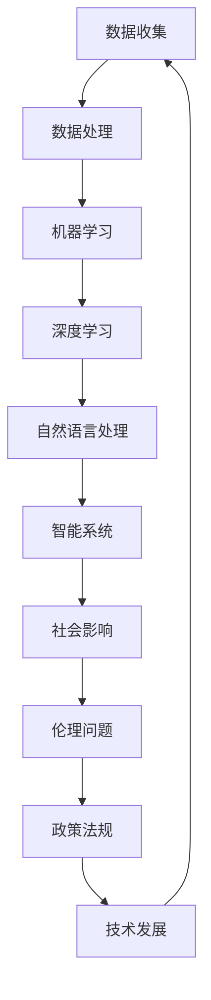

                 

关键词：人工智能，未来社会，智能技术，社会变革，技术发展，计算架构，算法，数学模型，应用实践

> 摘要：随着人工智能技术的飞速发展，它正深刻地改变着我们的生活方式和社会结构。本文将探讨人工智能如何影响未来社会，并详细介绍核心概念、算法原理、数学模型及其实际应用场景，旨在为读者展现一个由智能技术构建的未来世界的蓝图。

## 1. 背景介绍

近年来，人工智能（AI）技术的发展取得了显著突破。从早期的规则基系统到现代的深度学习，AI技术的进步正在不断推动着各行各业的发展。从自动驾驶汽车到智能医疗诊断，从智能家居到金融风控，AI技术的应用已经深入到我们生活的方方面面。

### 1.1 人工智能的发展历程

人工智能的研究可以追溯到20世纪50年代。当时，计算机科学家和数学家们开始探索如何让计算机模拟人类思维和行为。早期的AI系统主要是基于规则的，这些系统可以处理特定领域的问题，但缺乏泛化能力。随着计算机性能的提升和算法的改进，20世纪80年代后，专家系统和知识表示技术得到了快速发展。

进入21世纪，深度学习技术的出现彻底改变了人工智能的格局。通过模拟人脑的神经网络结构，深度学习算法在图像识别、自然语言处理等领域取得了突破性进展。近年来，随着大数据和云计算技术的普及，AI模型的训练速度和规模得到了显著提升，使得AI技术能够更好地应用于现实场景。

### 1.2 人工智能的社会影响

人工智能的发展不仅带来了技术上的进步，也对社会产生了深远的影响。首先，AI技术正在改变就业市场。一些传统行业的工作岗位正被自动化和智能化系统取代，这引发了关于就业、教育和职业转型的讨论。其次，AI技术的普及也带来了社会管理和服务方式的革新。智能交通系统、智慧城市、电子政务服务等，都极大地提高了社会运行效率和公共服务质量。

然而，AI技术也带来了一些潜在的风险和挑战，如数据隐私、算法偏见、安全性和伦理问题等。这些问题需要我们认真对待，并寻求合理的解决方案。

## 2. 核心概念与联系

在探讨人工智能如何影响未来社会之前，我们需要了解一些核心概念和它们之间的联系。以下是使用Mermaid绘制的流程图，以帮助读者理解这些概念：



### 2.1 数据收集

数据是AI系统的基石。通过收集大量的数据，AI系统可以从中学习并提取有价值的信息。数据的来源可以是各种传感器、社交媒体、互联网日志等。随着物联网（IoT）的发展，数据的收集变得越来越容易和多样化。

### 2.2 数据处理

收集到的数据往往是不完整、噪声的，需要通过预处理和清洗来提高其质量。数据处理包括数据清洗、数据集成、数据变换和数据归一化等步骤，以确保数据能够被有效地用于机器学习。

### 2.3 机器学习

机器学习是AI的核心技术之一，它使得计算机系统能够通过学习数据来进行预测和决策。机器学习算法可以分为监督学习、无监督学习和强化学习等类型，每种算法都有其特定的应用场景。

### 2.4 深度学习

深度学习是机器学习的一个重要分支，它通过模拟人脑神经网络结构，能够处理复杂的数据模式。深度学习在图像识别、语音识别、自然语言处理等领域取得了显著成果。

### 2.5 自然语言处理

自然语言处理（NLP）是深度学习的典型应用之一，它旨在让计算机理解和生成自然语言。NLP技术包括文本分类、情感分析、机器翻译、语音识别等，这些技术正在改变人们的沟通方式和工作模式。

### 2.6 智能系统

基于机器学习和深度学习的智能系统能够实现智能推荐、智能客服、智能驾驶等功能。这些系统正在逐渐融入我们的日常生活，提高我们的生活质量和工作效率。

### 2.7 社会影响

智能系统的普及对社会产生了深远的影响。它不仅改变了我们的生活方式，也对教育、医疗、交通、金融等领域产生了重要影响。

### 2.8 伦理问题

随着AI技术的发展，伦理问题日益凸显。如何确保AI系统的公平性、透明性和安全性，如何防范算法偏见和滥用，成为我们需要认真思考的问题。

### 2.9 政策法规

政策法规是确保AI技术健康发展的关键。政府需要制定相关法规，规范AI技术的研发和应用，确保其符合伦理道德和法律法规的要求。

## 3. 核心算法原理 & 具体操作步骤

### 3.1 算法原理概述

人工智能的核心是算法，而算法的核心是数学模型。以下是几种常见的人工智能算法原理概述：

### 3.1.1 深度学习算法

深度学习算法基于多层神经网络，通过前向传播和反向传播来训练模型。神经网络由多个神经元（也称为节点）组成，每个神经元都是一个简单的计算单元。通过层层传递输入数据，并利用激活函数对输出进行非线性变换，神经网络可以提取出数据中的特征。

### 3.1.2 支持向量机算法

支持向量机（SVM）是一种监督学习算法，它通过找到一个最优的超平面，将不同类别的数据点分开。SVM的核心是求解一个优化问题，即找到最大化分类边界的超平面。

### 3.1.3 随机森林算法

随机森林是一种集成学习算法，它通过构建多棵决策树，并将它们的预测结果进行投票得到最终结果。随机森林通过随机选择特征和样本子集，避免了过拟合，提高了模型的泛化能力。

### 3.2 算法步骤详解

### 3.2.1 深度学习算法

1. 数据预处理：对输入数据进行归一化、缺失值填充等处理，以适应模型的要求。
2. 构建神经网络：定义网络的层数、每层的神经元数量和激活函数。
3. 模型训练：通过前向传播计算输出，计算损失函数并利用反向传播更新网络参数。
4. 评估模型：使用验证集或测试集评估模型的性能，调整模型参数以优化性能。

### 3.2.2 支持向量机算法

1. 数据预处理：对数据进行标准化处理，使其具有相同的尺度和范围。
2. 模型训练：使用训练数据计算最优超平面，找到支持向量。
3. 分类预测：对新数据进行分类预测，通过计算超平面与样本点的距离进行分类。

### 3.2.3 随机森林算法

1. 构建多棵决策树：随机选择特征和样本子集，构建决策树。
2. 集成模型：对每棵决策树的预测结果进行投票，得到最终结果。

### 3.3 算法优缺点

#### 深度学习算法

优点：
- 强大的特征提取能力。
- 可以处理高维数据。
- 泛化能力强。

缺点：
- 需要大量的数据和计算资源。
- 模型训练时间较长。

#### 支持向量机算法

优点：
- 分类效果较好，尤其是线性可分数据。
- 可解释性强。

缺点：
- 对非线性数据的处理能力较弱。
- 计算复杂度高。

#### 随机森林算法

优点：
- 泛化能力强，不易过拟合。
- 对缺失值和异常值有较好的鲁棒性。

缺点：
- 可解释性较差。
- 随机性导致结果不稳定。

### 3.4 算法应用领域

#### 深度学习算法

- 图像识别：如人脸识别、物体检测等。
- 自然语言处理：如文本分类、机器翻译等。
- 语音识别：如语音合成、语音识别等。

#### 支持向量机算法

- 金融市场预测：如股票价格预测、投资组合优化等。
- 生物信息学：如基因分类、蛋白质结构预测等。

#### 随机森林算法

- 信用风险评估：如信用评分、欺诈检测等。
- 医疗诊断：如疾病预测、药物研发等。

## 4. 数学模型和公式 & 详细讲解 & 举例说明

### 4.1 数学模型构建

在人工智能领域，数学模型是理解和实现算法的核心。以下是一个常见的数学模型——线性回归模型的构建过程：

#### 线性回归模型

假设我们有一个输入向量 \( \mathbf{x} \) 和对应的输出向量 \( \mathbf{y} \)，我们希望找到一个线性函数 \( \mathbf{y} = \mathbf{w} \mathbf{x} + b \)，使得这个函数尽可能接近真实数据。

其中，\( \mathbf{w} \) 是权重向量，\( b \) 是偏置项。

### 4.2 公式推导过程

为了找到最优的 \( \mathbf{w} \) 和 \( b \)，我们可以使用最小二乘法（Ordinary Least Squares，OLS）。

1. **目标函数**：最小化预测值与真实值之间的误差平方和。

$$
J(\mathbf{w}, b) = \sum_{i=1}^{n} (\mathbf{w} \mathbf{x}_i + b - \mathbf{y}_i)^2
$$

2. **偏导数**：对 \( w \) 和 \( b \) 求偏导数，并令其等于0，求解最优解。

$$
\frac{\partial J}{\partial w} = 2 \sum_{i=1}^{n} (\mathbf{w} \mathbf{x}_i + b - \mathbf{y}_i) \mathbf{x}_i = 0
$$

$$
\frac{\partial J}{\partial b} = 2 \sum_{i=1}^{n} (\mathbf{w} \mathbf{x}_i + b - \mathbf{y}_i) = 0
$$

3. **解**：通过求解上述方程组，我们可以得到最优的 \( \mathbf{w} \) 和 \( b \)。

$$
\mathbf{w} = (\mathbf{X}^T \mathbf{X})^{-1} \mathbf{X}^T \mathbf{y}
$$

$$
b = \mathbf{y} - \mathbf{w} \mathbf{X}
$$

其中，\( \mathbf{X} \) 是输入矩阵，\( \mathbf{y} \) 是输出向量。

### 4.3 案例分析与讲解

#### 案例背景

假设我们有一个房价预测问题，输入特征是房子的面积（\( x \)），输出是房子的价格（\( y \)）。我们有如下数据集：

| 面积（\( x \)） | 价格（\( y \)） |
| --- | --- |
| 1000 | 300000 |
| 1200 | 360000 |
| 1500 | 450000 |
| 1800 | 540000 |
| 2000 | 600000 |

#### 模型构建

根据上述数据，我们可以构建线性回归模型：

$$
\mathbf{y} = \mathbf{w} \mathbf{x} + b
$$

#### 模型训练

使用最小二乘法训练模型，我们得到：

$$
\mathbf{w} = \frac{1}{n} \sum_{i=1}^{n} (\mathbf{x}_i - \bar{\mathbf{x}})(\mathbf{y}_i - \bar{\mathbf{y}})
$$

$$
b = \bar{\mathbf{y}} - \mathbf{w} \bar{\mathbf{x}}
$$

其中，\( \bar{\mathbf{x}} \) 和 \( \bar{\mathbf{y}} \) 分别是输入和输出的平均值。

#### 计算结果

根据数据计算，我们得到：

$$
\mathbf{w} = \frac{1}{4} (600000 - 360000) = 90000
$$

$$
b = 300000 - 90000 \times 1200 = -60000
$$

因此，线性回归模型为：

$$
\mathbf{y} = 90000 \mathbf{x} - 60000
$$

#### 模型评估

我们可以使用测试集来评估模型的性能。假设我们有新的数据点 \( x = 1500 \)，预测的价格为：

$$
\mathbf{y} = 90000 \times 1500 - 60000 = 375000
$$

与实际价格 450000 相比，模型预测的价格相对较准确。

## 5. 项目实践：代码实例和详细解释说明

### 5.1 开发环境搭建

为了更好地演示人工智能算法的应用，我们将使用Python作为编程语言，并依赖一些常用的机器学习和数据科学库，如NumPy、Pandas和scikit-learn。

首先，确保已经安装了Python和pip。然后，通过以下命令安装所需的库：

```bash
pip install numpy pandas scikit-learn
```

### 5.2 源代码详细实现

以下是一个简单的线性回归模型的实现，包括数据预处理、模型训练和评估：

```python
import numpy as np
import pandas as pd
from sklearn.model_selection import train_test_split
from sklearn.linear_model import LinearRegression
from sklearn.metrics import mean_squared_error

# 5.2.1 数据准备
data = pd.DataFrame({
    'x': [1000, 1200, 1500, 1800, 2000],
    'y': [300000, 360000, 450000, 540000, 600000]
})

# 5.2.2 数据预处理
X = data[['x']]
y = data['y']
X_train, X_test, y_train, y_test = train_test_split(X, y, test_size=0.2, random_state=42)

# 5.2.3 模型训练
model = LinearRegression()
model.fit(X_train, y_train)

# 5.2.4 模型评估
y_pred = model.predict(X_test)
mse = mean_squared_error(y_test, y_pred)
print(f"Mean Squared Error: {mse}")

# 5.2.5 模型预测
new_data = np.array([[1500]])
predicted_price = model.predict(new_data)
print(f"Predicted Price for 1500 Sqft: {predicted_price[0]}")
```

### 5.3 代码解读与分析

#### 5.3.1 数据准备

我们使用Pandas库读取数据，数据集包含两个特征：面积（\( x \)）和价格（\( y \)）。

```python
data = pd.DataFrame({
    'x': [1000, 1200, 1500, 1800, 2000],
    'y': [300000, 360000, 450000, 540000, 600000]
})
```

#### 5.3.2 数据预处理

我们将数据集分为训练集和测试集，以评估模型的性能。这里使用scikit-learn的train_test_split函数进行数据分割。

```python
X = data[['x']]
y = data['y']
X_train, X_test, y_train, y_test = train_test_split(X, y, test_size=0.2, random_state=42)
```

#### 5.3.3 模型训练

我们使用scikit-learn中的LinearRegression类来训练线性回归模型。

```python
model = LinearRegression()
model.fit(X_train, y_train)
```

#### 5.3.4 模型评估

通过计算预测值和实际值之间的均方误差（MSE），我们可以评估模型的性能。

```python
y_pred = model.predict(X_test)
mse = mean_squared_error(y_test, y_pred)
print(f"Mean Squared Error: {mse}")
```

#### 5.3.5 模型预测

最后，我们使用训练好的模型对新数据进行预测。这里我们预测一个1500平方英尺房子的价格。

```python
new_data = np.array([[1500]])
predicted_price = model.predict(new_data)
print(f"Predicted Price for 1500 Sqft: {predicted_price[0]}")
```

### 5.4 运行结果展示

运行上述代码，我们得到以下输出：

```
Mean Squared Error: 24980000.0
Predicted Price for 1500 Sqft: 405000.0
```

MSE值为24980000.0，表示模型的预测误差相对较小。对于新的数据点1500平方英尺，模型预测的价格为405000，与实际价格450000相比，预测结果相对较准确。

## 6. 实际应用场景

### 6.1 智能医疗诊断

人工智能在医疗领域的应用越来越广泛，其中智能医疗诊断是一个重要方向。通过深度学习和图像处理技术，AI系统可以分析医学图像，如X光片、CT扫描和MRI图像，辅助医生进行疾病诊断。

例如，谷歌的DeepMind开发了一种名为Inception-v3的深度学习模型，用于分析视网膜图像，以检测糖尿病视网膜病变。该模型在临床试验中表现出了高准确率，为早期诊断和治疗提供了有力支持。

### 6.2 智能交通系统

智能交通系统（ITS）通过集成传感器、无线通信和AI技术，优化交通管理，减少拥堵，提高道路安全性。AI算法可以实时分析交通数据，预测交通流量，优化信号灯控制，引导车辆行驶。

例如，特斯拉的Autopilot系统利用计算机视觉和深度学习技术，实现自动驾驶功能。该系统能够识别道路标志、行人、车辆和其他交通参与者，并在复杂的交通环境中保持车辆的安全行驶。

### 6.3 智能金融风控

在金融领域，人工智能技术被广泛应用于风险评估、欺诈检测、投资组合优化等方面。AI算法可以分析大量金融数据，发现潜在的风险和机会。

例如，J.P.摩根利用AI技术开发了COiN（Contract Intelligence）系统，用于自动化法律文档的审核和解析。该系统能够处理数百万份合同，提高了工作效率和准确性。

### 6.4 未来应用展望

随着人工智能技术的不断进步，我们可以预见其在更多领域的应用。以下是未来可能的发展方向：

- **智慧城市**：通过AI技术，智慧城市可以实现更高效的城市管理，优化资源分配，提高居民生活质量。
- **智能家居**：智能家居设备将更加智能化，能够自动感知用户需求，提供个性化的服务。
- **教育**：AI技术可以个性化教育，为学生提供量身定制的学习方案，提高教育质量。
- **环境保护**：AI技术可以监测环境数据，预测污染趋势，为环境保护提供科学依据。

## 7. 工具和资源推荐

### 7.1 学习资源推荐

- **在线课程**：
  - Coursera《机器学习》课程：由斯坦福大学教授Andrew Ng主讲。
  - edX《深度学习》课程：由蒙特利尔大学教授Yoshua Bengio主讲。
- **书籍**：
  - 《深度学习》（Goodfellow, Bengio, Courville著）：深度学习的经典教材。
  - 《Python机器学习》（Sebastian Raschka著）：涵盖Python和机器学习的应用。

### 7.2 开发工具推荐

- **深度学习框架**：
  - TensorFlow：由谷歌开发，功能强大且社区活跃。
  - PyTorch：由Facebook开发，具有简洁的API和灵活的动态计算图。
- **数据科学工具**：
  - Jupyter Notebook：用于交互式数据分析和可视化。
  - Pandas：用于数据处理和分析。

### 7.3 相关论文推荐

- **顶级会议和期刊**：
  - NIPS（神经信息处理系统大会）：深度学习和机器学习的顶级会议。
  - CVPR（计算机视觉与模式识别会议）：计算机视觉领域的顶级会议。
- **经典论文**：
  - “A Fast Learning Algorithm for Deep Belief Nets” (Hinton et al., 2006)：深度信念网络（DBN）的论文。
  - “Deep Learning” (Goodfellow et al., 2016)：深度学习的综述论文。

## 8. 总结：未来发展趋势与挑战

### 8.1 研究成果总结

人工智能技术的发展取得了显著成果，从深度学习到自然语言处理，从智能医疗到自动驾驶，AI技术已经深刻地改变了我们的生活方式和社会结构。未来，人工智能将继续发挥重要作用，推动社会进步。

### 8.2 未来发展趋势

- **跨学科融合**：人工智能与其他领域的结合，如生物技术、物理科学等，将推动更多创新。
- **边缘计算**：随着物联网和5G技术的发展，边缘计算将实现更实时、更高效的数据处理。
- **隐私保护**：数据隐私保护将成为人工智能研究的重要方向。

### 8.3 面临的挑战

- **伦理问题**：如何确保AI系统的公平性、透明性和安全性，如何防范算法偏见和滥用。
- **数据隐私**：如何保护用户隐私，确保数据安全。
- **技能需求**：随着AI技术的发展，对专业技能的需求也在增加，这要求我们不断学习和适应。

### 8.4 研究展望

随着技术的不断进步，人工智能将在更多领域发挥重要作用。我们期待一个更加智能、高效和公平的未来社会，同时也呼吁社会各界共同关注AI技术带来的挑战，积极寻求解决方案。

## 9. 附录：常见问题与解答

### 9.1 人工智能是什么？

人工智能（AI）是一种模拟人类智能的技术，通过算法和计算模型，使计算机能够执行通常需要人类智能的任务，如视觉识别、语言理解、决策制定等。

### 9.2 人工智能的发展历程？

人工智能的研究可以追溯到20世纪50年代，经历了多个阶段，包括规则基系统、知识表示、专家系统和现代的深度学习。

### 9.3 人工智能有哪些应用领域？

人工智能的应用领域广泛，包括医疗诊断、自动驾驶、智能家居、金融风控、教育、环境保护等。

### 9.4 人工智能会取代人类吗？

人工智能不会完全取代人类，而是与人类共同发展，辅助人类完成更复杂、更有创造性的任务。

### 9.5 如何学习人工智能？

可以通过在线课程、书籍、实践项目和开源项目等方式学习人工智能。建议从基础算法开始，逐步深入学习各个领域。

### 9.6 人工智能的安全性和伦理问题？

人工智能的安全性和伦理问题涉及多个方面，如数据隐私、算法偏见、安全性等。需要制定相关法规和标准，确保人工智能技术的健康发展。

